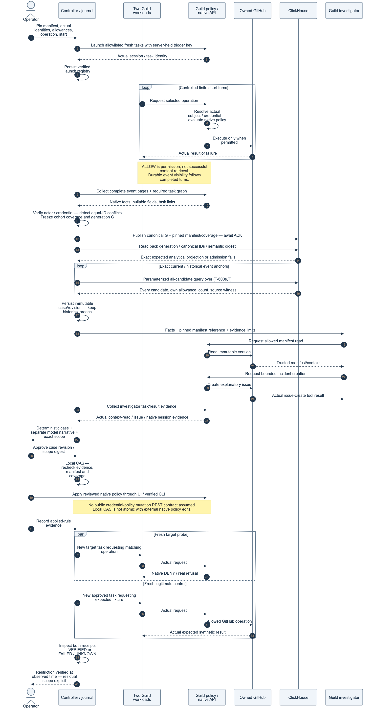
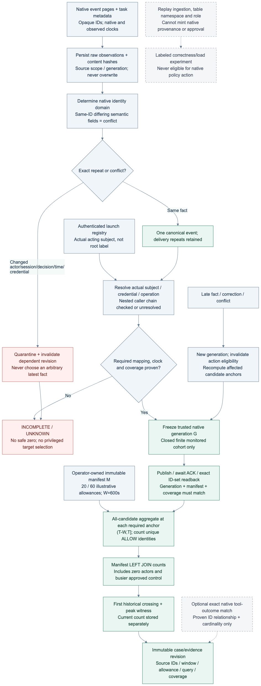
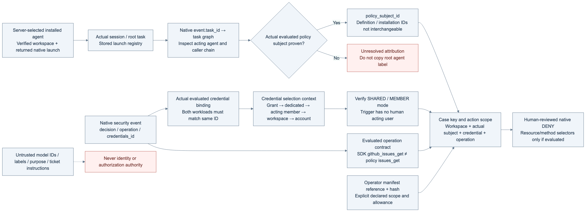
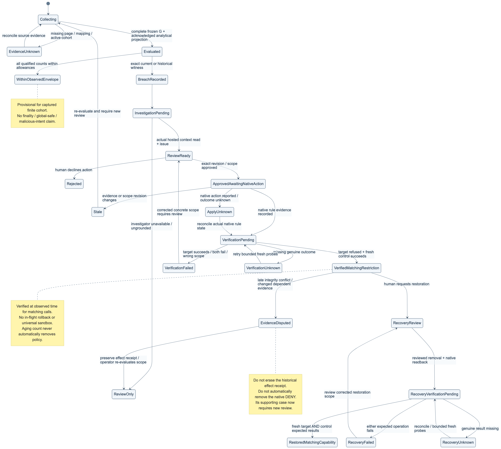
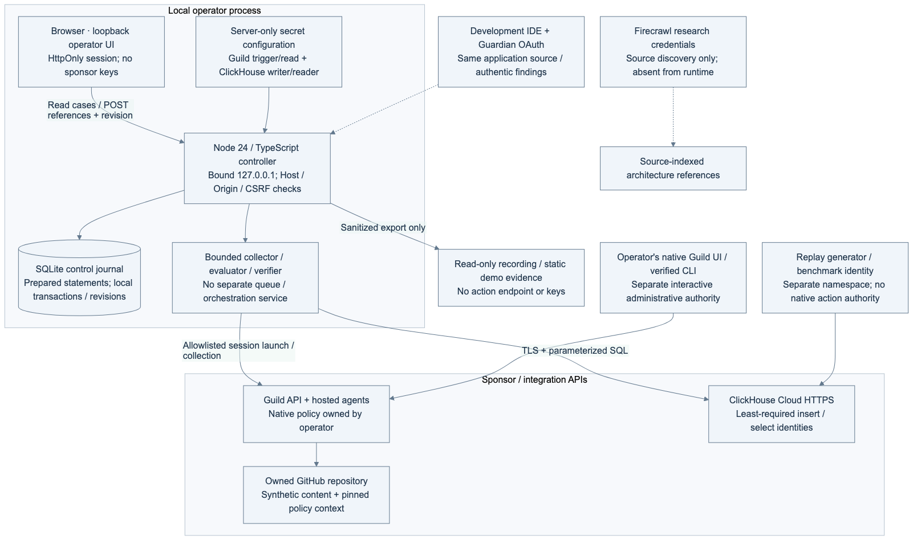
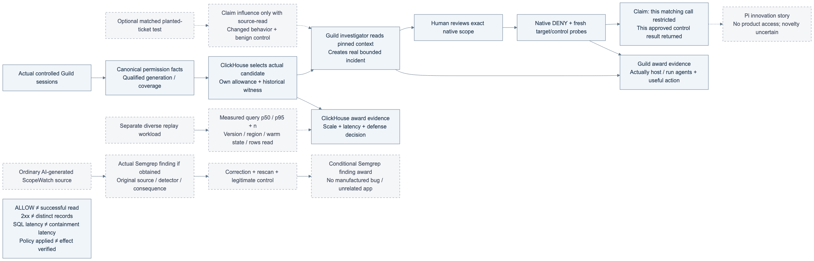

# ScopeWatch diagrams for implementation

> **Current execution policy:** [Start now or anytime, with no build cutoff](docs/event/BUILD_AUTHORIZATION.md). The human reports that the event is already underway and public schedules are stale. Older start/deadline/duration advice below is superseded; historical timestamps and analytics windows remain evidence, not build gates.

All seven architecture views are included in this repository as **editable Mermaid, SVG and PNG**, together with the [offline interactive viewer](docs/architecture/architecture.html) and [renderer](docs/architecture/render-diagrams.cjs). This page displays the PNGs directly for GitHub readers. SVG or the viewer is better for zooming into labels.

The diagrams describe the proposed project. Actual native identities, source fields, executed SQL and policy effects still need event proof. Follow the [corrected architecture/contracts](docs/architecture/ARCHITECTURE.md) and [build plan](docs/build/BUILD_PLAN.md) if an older advisory sketch differs.

| View | Use during implementation | Main owner |
|---|---|---|
| System / trust boundaries | Divide the five live stages and keep development/research outside authorization | All owners |
| Execution sequence | Wire launch, finite capture, publication/readback, queries, investigation, human native action and fresh results in the correct order | Guild + collector |
| Evidence pipeline | Implement conflict-first admission, per-event bindings, coverage, generations and historical witnesses | Collector/ClickHouse |
| Identity / credential scope | Prove actual acting subject, evaluated shared credential, mode/grants and exact operation | Guild/enforcement |
| Action / recovery states | Implement pending, stale, unknown, failed, disputed and separate restoration predicates | Controller/UI |
| Deployment / secrets | Place local journal, server-held credentials, sponsor connections and sanitized export correctly | Controller + Guild |
| Claims / sponsors | Map each demonstrated sponsor contribution to actual evidence and explicit limits | Scenario + demo |

## 1. System and trust boundaries

[Mermaid source](docs/architecture/diagrams/01-system.mmd) · [SVG](docs/architecture/rendered/01-system.svg) · [PNG](docs/architecture/rendered/01-system.png)

## 2. Execution, evidence and native action sequence

[Mermaid source](docs/architecture/diagrams/02-sequence.mmd) · [SVG](docs/architecture/rendered/02-sequence.svg) · [PNG](docs/architecture/rendered/02-sequence.png)

## 3. Evidence admission and analytical evaluation

[Mermaid source](docs/architecture/diagrams/03-evidence.mmd) · [SVG](docs/architecture/rendered/03-evidence.svg) · [PNG](docs/architecture/rendered/03-evidence.png)

## 4. Actual native identity and evaluated credential scope

[Mermaid source](docs/architecture/diagrams/04-identity.mmd) · [SVG](docs/architecture/rendered/04-identity.svg) · [PNG](docs/architecture/rendered/04-identity.png)

## 5. Action, evidence disputes and separate recovery states

[Mermaid source](docs/architecture/diagrams/05-action-state.mmd) · [SVG](docs/architecture/rendered/05-action-state.svg) · [PNG](docs/architecture/rendered/05-action-state.png)

## 6. Deployment, secrets and permission placement

[Mermaid source](docs/architecture/diagrams/06-deployment.mmd) · [SVG](docs/architecture/rendered/06-deployment.svg) · [PNG](docs/architecture/rendered/06-deployment.png)

## 7. Proof obligations and sponsor contributions

[Mermaid source](docs/architecture/diagrams/07-claims-and-sponsors.mmd) · [SVG](docs/architecture/rendered/07-claims-and-sponsors.svg) · [PNG](docs/architecture/rendered/07-claims-and-sponsors.png)

## Editing and regeneration

The additional [agent-team build graph](docs/prompts/BUILD_DAG.svg) maps orchestration dependencies rather than the application's native identity graph. [PNG](docs/prompts/BUILD_DAG.png) · [Mermaid](docs/prompts/BUILD_DAG.mmd) · [complete build prompt](docs/prompts/BUILD_SCOPEWATCH.md).

Edit the `.mmd` source for the relevant view. The [architecture artifact README](docs/architecture/README.md) gives the pinned Mermaid/Playwright regeneration command and offline serving instructions. The renderer regenerates all seven SVG/PNG pairs and the viewer; keep the sources and exports together in commits. Rendering validates the diagrams and viewer, not native account behavior or the competition application.
