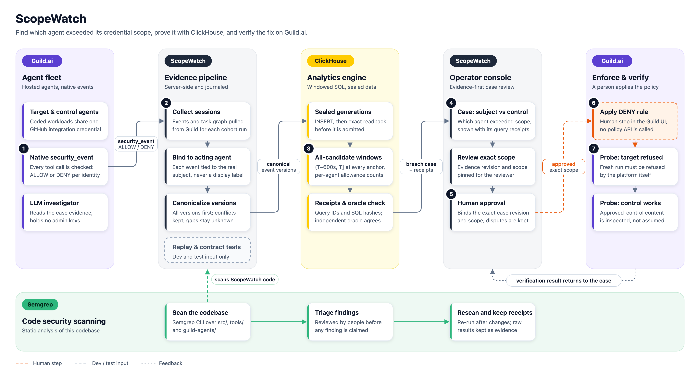

<div align="center">

# ScopeWatch

**Least-privilege control for AI agent fleets.**<br/>
Find the one agent that overreached its own allowance, contain exactly that capability, and prove that approved agents keep working.

[](#guildai-the-agent-platform)
[](#clickhouse-the-analytics-engine)
[](#semgrep-security-scanning-of-this-codebase)

[](docs/BUILD_STATUS.md)
[](docs/BUILD_STATUS.md)
[](docs/BUILD_STATUS.md)
[](evidence/semgrep/README.md)
[](#project-status)
<br/>
[](tsconfig.json)
[](package.json)
[](src/client)
[](src/server)
[](src/storage)
[](LICENSE)

[How it works](#how-it-works) · [Guild.ai](#guildai-the-agent-platform) · [ClickHouse](#clickhouse-the-analytics-engine) · [Semgrep](#semgrep-security-scanning-of-this-codebase) · [Quick start](#quick-start) · [Status](#project-status) · [Docs](#documentation)

</div>

<p align="center">
  <picture>
    <source media="(prefers-color-scheme: dark)" srcset="docs/architecture/event-build/scopewatch-product-architecture-dark.png"/>
    
  </picture>
</p>

## Why ScopeWatch

AI agents increasingly share integration credentials. One GitHub connection serves a ticket agent, a release agent and a cleanup agent at once. When one of them starts calling a permission far more than its job needs, for example after reading a manipulated ticket, today's tools fall short:

- **Per-credential limits can't say which agent** is responsible.
- **Revoking the credential stops every agent,** including the ones doing approved work.
- **Point-in-time counters miss history.** A burst that crossed the line ten minutes ago looks fine once it ages out.

ScopeWatch answers three questions precisely: **which agent** (the policy subject the platform actually evaluated, never a display name), **over what** (native ALLOW permission decisions against *that agent's own* allowance, at every moment), and **how to stop only that**. It denies one capability for one agent, then proves the target is refused while approved work continues.

## How it works

| | Step | Powered by |
|---|---|---|
| **1** | **Run the fleet.** Agents run as hosted Guild sessions launched through an API trigger. Every tool call is checked against Guild's credential policy and recorded as a native `security_event` (ALLOW or DENY). |  |
| **2** | **Collect and attribute.** ScopeWatch pages through every session's events **and** task graph, and binds each decision to the agent that actually made it. Session labels and root agents are never used as a fallback. |  |
| **3** | **Canonicalize.** All versions of every event are compared before any filter. Contradictions block the result, and missing data stays *unknown*, never zero. | ScopeWatch core |
| **4** | **Publish and read back.** Sealed evidence generations are written to ClickHouse and admitted only after an exact readback of IDs, bindings, coverage and manifest. |  |
| **5** | **Detect in SQL.** One parameterized query evaluates **every agent** over the window `(T−600s, T]` at **every event anchor** plus the cutoff, against each agent's own allowance. An independent oracle must agree. |  |
| **6** | **Review the case.** The operator sees the breached agent beside the busiest compliant one, the first crossing, the peak, contributing sessions and every query receipt. An optional hosted LLM investigator reads only pinned facts. |   |
| **7** | **Contain and verify.** The operator approves one exact scope, then **applies the DENY in Guild's policy table**; ScopeWatch never mutates policy itself. Fresh probes must show the target refused **and** the control returning its expected content. Recovery is reviewed and verified separately. |  |

<p align="center">
  
  <br/><sub>Operator console on labeled synthetic replay data. Every screen carries its data source (REPLAY, CONTRACT TEST or NATIVE).</sub>
</p>

## Guild.ai: the agent platform


Guild is where the fleet runs and where enforcement happens. ScopeWatch builds on four Guild capabilities:

- **Hosted agents.** The target (`scopewatch-ticketassist`) and control (`scopewatch-releasereview`) are deterministic coded agents built with `@guildai/agents-sdk`, and they read only an owned fixture repository. The investigator is an LLM agent whose tools are limited to reading content and creating an issue, and it never receives controller or admin keys. Source: [`guild-agents/`](guild-agents/README.md).
- **Native permission events.** Every GitHub tool call is evaluated against the shared credential's policy and emitted as a `security_event`. ScopeWatch counts these **decisions**; an ALLOW is not proof that data was read.
- **Task-graph attribution.** Each event's `task_id` is walked up through parent tasks to the nearest agent task. Installed-agent, definition and version IDs are treated as separate key spaces; on a real account they do differ.
- **Credential policy.** Containment is a DENY rule in Guild's policy table, applied by a human. ScopeWatch records and checks the operator's receipt against the approved scope, and flags mismatched or stale applications.

Adapter: [`src/integrations/guild/`](src/integrations/guild/) (launcher, collector, binding, investigator, verifier). It has been calibrated against a real Guild account; see the [native integration ledger](docs/native/NATIVE_PROOF_LEDGER.md).

## ClickHouse: the analytics engine


The containment decision is made in ClickHouse SQL, not in application code.

- **Every agent, every moment.** Fixed, versioned, parameterized queries (`anchorList`, `anchorAllCandidates`, `witness`, `conflictCheck`) evaluate all candidates at every distinct ALLOW anchor plus the cutoff. Windows are tie-exact `(T−600s, T]` in nanoseconds. `uniqExact` counts distinct native identities, and `LEFT ALL JOIN` with `join_use_nulls` keeps quiet agents as an explicit zero. See [`queries.ts`](src/integrations/clickhouse/queries.ts).
- **Each agent against its own limit.** Allowances are versioned per agent, credential and operation (`allowance_versions`), so a busy agent isn't flagged just for being busy.
- **History is evidence.** First crossing, peak and current count are kept separately. A breach that has since aged out is still visible, with its contributing sessions.
- **Conflict-first.** A shared CTE keeps an event only if all of its versions agree, before any actor, decision or time filter. Tables are plain `MergeTree` and deduplication is explicit in SQL.
- **Trust, then verify.** An insert acknowledgement is not admission; a generation becomes a case only after exact readback ([`publisher.ts`](src/integrations/clickhouse/publisher.ts)). An independent oracle ([`src/core/oracle.ts`](src/core/oracle.ts)) re-derives every count and must agree.
- **Auditable receipts.** Every query records `query_id`, SQL and output SHA-256, typed parameters, rows, client ms and server ms. The operator console shows them.
- **Least privilege.** Each data mode has its own database, an ingest user (INSERT plus readback SELECT) and a read-only query user. The running app never holds admin credentials ([`tools/ch-setup.ts`](tools/ch-setup.ts)).

**Measured (local, synthetic):**
- A replay of 8 sessions evaluates 57 anchors in 64 queries, and the oracle agrees.
- A 20,000-unit benchmark smoke test passed 63 SQL-versus-oracle checks, and all 244 issued query IDs were reconciled against `system.query_log`.
- The all-candidate anchor query ran at a server p50 of ~40 ms on a 22,891-row generation (n=6, 2 CPU). That is a smoke test, not a scale benchmark.

[Replay evidence](evidence/sanitized/replay-local-2026-10-09/README.md) · [benchmark](evidence/sanitized/bench-local-2026-10-09/README.md)

## Semgrep: security scanning of this codebase


ScopeWatch is security tooling largely written with AI assistance, so its own code is scanned too. Three Semgrep CLI 1.180.0 scans covered `src`, `tools` and `guild-agents`. They used the default, TypeScript, Node, secrets, security-audit, OWASP Top 10, React, SQL-injection, XSS, command-injection and JWT rulesets, plus `p/guardian-default` and `p/ai-best-practices` on the current tree (165 applicable rules). The scans reported **0 findings and 0 errors**; raw results are preserved in [`evidence/semgrep/`](evidence/semgrep/README.md). A clean scan is not a proof of absence. The app's trust boundaries are also covered by adversarial tests (`tests/adversarial/`).

## Built for operators who need proof

- **Containment you can verify.** "Restricted" means a fresh probe was refused **and** an approved, busier agent still returned its expected content. Lifting a restriction needs the same proof, and nothing auto-releases when a count falls.
- **Human authority by design.** Approvals bind the exact case revision, evidence manifest and scope digest with compare-and-swap. Policy changes stay in Guild's hands and the operator's.
- **Every number has a source.** Replay, contract-test and native data use separate journals, databases and UI labels. Simulated outcomes are named `simulated_*` and are never shown as real.
- **Secure by default.** The server binds to loopback only. It uses an operator login, an HttpOnly SameSite=Strict session cookie, a CSRF token and an exact Host/Origin allowlist. Request schemas are strict, so the browser never supplies a subject, credential or SQL. Exports are sanitized.

## Quick start

Requirements: Node ≥ 24, npm, and Docker (or any local ClickHouse 25.8).

```bash
./run.sh    # installs deps, starts local ClickHouse, provisions users, builds, serves replay mode on :4317
```

`run.sh` prints the operator secret (generated once into `runtime/operator-secret`) and never reads `.env`, so it cannot touch ClickHouse Cloud. The same steps by hand:

```bash
npm ci
npm run ch:up && npm run ch:setup        # local ClickHouse 25.8 + least-privilege users per mode
npm run build
set -a; . runtime/clickhouse-local.env; set +a
SCOPEWATCH_MODE=replay SCOPEWATCH_OPERATOR_SECRET='choose-a-16+-char-secret' npm start
# open http://127.0.0.1:4317, sign in, click "Run replay pipeline"
```

| `SCOPEWATCH_MODE` | Data source | Actions |
|---|---|---|
| `replay` | Declared synthetic seeds (`data/replay/`) through the real pipeline and real ClickHouse | Read-only |
| `contract_test` | The real Guild adapter against a loopback mock of Guild's documented API | Simulated, labeled `simulated_*` |
| `native` | A real Guild workspace (`https://api.guild.ai`) and your ClickHouse | Full workflow, with human policy application in Guild |

Other commands: `npm run replay` (headless pipeline with query receipts), `npm run doctor` (configuration check without printing secrets), `npm run dev` (server plus Vite). Without Docker, any local ClickHouse 25.8 on `127.0.0.1:18123` with admin user `sw_admin` works with `npm run ch:setup`.

## Quality

| Check | Result |
|---|---|
| `npm test`: unit, client, integration, adversarial | **254 passed** |
| `npm run test:ch`: real SQL on ClickHouse 25.8.33.6 (readback, all-anchor SQL vs oracle on boundary, tie, late-arrival and conflict fixtures) | **37 passed** |
| `npm run test:e2e`: Playwright against the real server at 360/768/1440 px | **37 passed** |
| typecheck (strict) · lint · build · `npm audit --omit=dev` | clean · 0 vulnerabilities |

All results are for the same application code (`d5ed715`). Receipts are in [docs/BUILD_STATUS.md](docs/BUILD_STATUS.md).

## Project status

| | |
|---|---|
| ✅ **Local platform** | Complete and tested end to end on replay data and against a mock of Guild's documented API |
| ✅ **Guild account setup** | Private agents, fixture repository and API trigger created on a real account; adapter calibrated on real task and event shapes |
| ⏳ **Live Guild run** | Pending: GitHub App authorization, trigger and collector keys (Guild web UI), then the first native containment run. No native result is claimed yet |
| ⏳ **ClickHouse Cloud** | Not yet run; all SQL so far ran on local ClickHouse 25.8 |

Steps to the first live run: [BUILD_STATUS → To reach VERIFIED_LIVE](docs/BUILD_STATUS.md#to-reach-verified_live-human-owned-steps).

## Documentation

| | |
|---|---|
| [Architecture (Mermaid, detailed)](docs/architecture/event-build/scopewatch-architecture.svg) · [sponsor map](docs/architecture/event-build/scopewatch-sponsors.svg) | Every component, trust boundary and data flow |
| [Design architecture](docs/architecture/ARCHITECTURE.md) · [Guild contracts](docs/architecture/GUILD_CONTRACTS.md) · [ClickHouse contracts](docs/architecture/CLICKHOUSE_CONTRACTS.md) | Authoritative design and API/SQL contracts |
| [UI contract](docs/ui/UI_CONTRACT.md) · [screenshots](evidence/screenshots/) · [demo recording](evidence/demo/README.md) | Operator console |
| [Build status](docs/BUILD_STATUS.md) · [native integration ledger](docs/native/NATIVE_PROOF_LEDGER.md) · [reviews](docs/reviews/event-build/) | Verification receipts and independent reviews |
| [START_HERE.md](START_HERE.md) · [CURATION.md](CURATION.md) | Original research and design package |

**Repository layout:** `src/server`, `src/core`, `src/storage` (API, detection logic, journal) · `src/integrations/{guild,clickhouse}` · `src/client` (operator console) · `guild-agents/` · `tests/` · `tools/` · `data/replay/` · `docker/` · `evidence/` (sanitized, labeled artifacts).

## Team

Team: [@nihalnihalani](https://github.com/nihalnihalani) and [@charliegillet](https://github.com/charliegillet). Development used Claude Opus 5.5 as lead engineer, Claude Sonnet 5.5 for implementation and testing, and independent Opus reviews ([details](docs/BUILD_STATUS.md#team-and-models-actual)). Work happens on `nihal` and `charlie` branches and merges into `main` by pull request.

Never commit credentials or raw sessions; [.env.example](.env.example) lists the settings with blank values.

## License

[MIT](LICENSE) © 2026 Nihal Nihalani and Charlie Gillet. Third-party documentation snapshots under `references/` remain the property of their respective owners and are not covered by this license.

<sub>Execution policy for the original build: [start now or anytime, with no build cutoff](docs/event/BUILD_AUTHORIZATION.md). Historical timestamps and analytics windows are evidence, not build gates.</sub>
