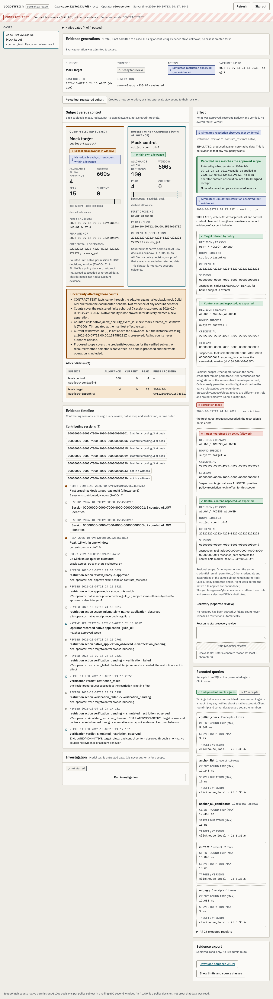
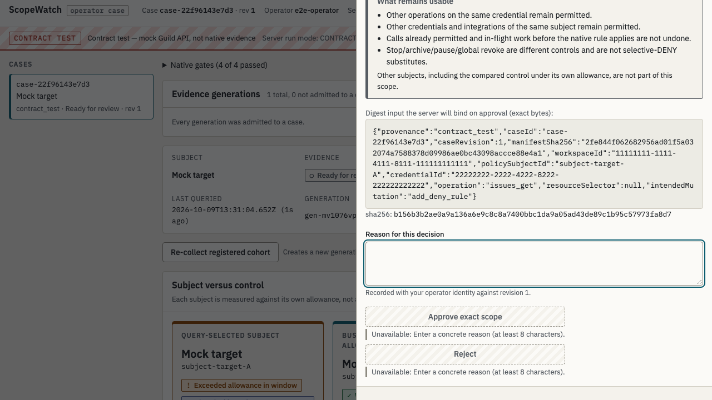

# ScopeWatch

### Contain the one AI agent that overreached, and prove the approved ones still work.

**Defensive AI for agent fleets.** Several AI agents share one integration credential. One of them, here an agent reading tickets, starts calling a GitHub permission far more often than its job needs. ScopeWatch uses **ClickHouse** to work out exactly which agent crossed **its own** allowance and when. It is built to turn **Guild.ai's** native permission events into an evidence case (live run pending) and have a human apply one precise DENY. Fresh probes must then show that agent refused **and** a busier, approved agent still working.

| | |
|---|---|
| 🟨 **ClickHouse**: Best use of real-time analytics | The breach decision is made **in SQL**: every event anchor, tie-exact window, conflict-first, checked by an independent oracle, and every query leaves an auditable receipt |
| 🟪 **Guild.ai**: Best use of Guild to host and run agents | Guild is designed to host the workloads, provide the permission evidence, host the investigator and enforce the policy. Three private agents (two deterministic coded workloads and an LLM investigator) and an API trigger are created on a real account, and the adapter is calibrated on real task/event shapes. Live loop: **NATIVE_PENDING** |
| 🟩 **Semgrep** | Three Semgrep CLI scans of this AI-written codebase, including `p/guardian-default` and `p/ai-best-practices`: **0 findings, none claimed**. We don't manufacture a bug for a prize |
| ⭐ **Pi**: Most Innovative | Per-agent attribution behind a *shared* credential, a historical breach witness and proof-of-containment. [Why it's new](#why-scopewatch-is-different) |

**Status:** **LOCAL_READY**: every local check passes on `main`. **NATIVE_PENDING**: the live Guild loop has not run yet. **VERIFIED_LIVE: not claimed.** Every result below states which kind of evidence it comes from. [Exact receipts →](docs/BUILD_STATUS.md)


<sub>Operator case page on the labeled synthetic replay fixture. The striped REPLAY strip is shown on every screen; replay is never action eligible.</sub>

---

## Contents

[Why it matters](#why-it-matters) · [Architecture](#architecture) · [ClickHouse](#-clickhouse-the-decision-is-made-in-sql) · [Guild.ai](#-guildai-hosts-the-agents-the-evidence-and-the-enforcement) · [Semgrep](#-semgrep-a-clean-scan-reported-as-a-clean-scan) · [Why it's different](#why-scopewatch-is-different) · [Proof](#proof-numbers-you-can-re-run) · [Quick start](#quick-start) · [Demo](#demo) · [Honesty](#what-we-do-not-claim) · [Repo map](#repository-map)

## Why it matters

Agent fleets share credentials. A GitHub integration typically serves many agents, so the usual per-credential rate limits and alerts can't say **which** agent misbehaved. Revoking the credential stops **every** agent. Operators need three answers, quickly and correctly:

1. **Who, exactly?** The policy subject Guild actually evaluated for *each* call, not a session label, model ID or display name.
2. **Over what, exactly?** A count of native **ALLOW permission decisions** against *that agent's own* allowance. The count runs over every captured session and catches a crossing that happened earlier and has since aged out.
3. **Can I stop only that?** Deny one capability for one subject, then prove the target is refused while approved work continues. Lifting the restriction (recovery) needs its own proof.

An ALLOW is a policy decision, not proof that data was read. ScopeWatch counts decisions, never "records stolen".

## Architecture

**Sponsor map:** what each sponsor does in the loop, and its evidence status:

![Sponsor contribution map: Guild hosts agents, emits security_event ALLOW/DENY and enforces the human-applied DENY; ClickHouse stores sealed generations and counts ALLOWs per candidate over (T-600s, T] at every anchor with query_log receipts; Semgrep scans the codebase; the human approves exact scope and applies DENY](docs/architecture/event-build/scopewatch-sponsors.png)

**Full system architecture** (click to zoom):


<sub>🟨 ClickHouse · 🟪 Guild.ai · 🟩 Semgrep · 🟥 human step (no policy API) · ⬜ non-native replay/mock. [SVG (zoomable)](docs/architecture/event-build/scopewatch-architecture.svg) · [Mermaid source](docs/architecture/event-build/scopewatch-architecture.mmd) · [research-phase design diagrams](DIAGRAMS.md)</sub>

**The loop, step by step**

| # | Step | Where | Sponsor |
|---|---|---|---|
| 1 | Launch a registered cohort of agent sessions through the Guild **API trigger** (agent IDs from a server allowlist; POST never retried) | `src/integrations/guild/launcher.ts` | 🟪 |
| 2 | Collect every page of session **events and tasks**; bind each `security_event` to its acting subject through the **task graph** | `collector.ts`, `binding.ts` | 🟪 |
| 3 | Canonicalize **all versions** of each event before any filter; same-ID contradictions block admission; gaps stay *unknown*, never zero | `src/core/canonicalize.ts`, `admission.ts` | |
| 4 | Seal → publish to ClickHouse → **exact readback** of IDs, semantics, multiplicity, bindings, coverage and manifest | `src/integrations/clickhouse/publisher.ts` | 🟨 |
| 5 | Evaluate the window `(T−600s, T]` at **every distinct anchor plus the cutoff, for all candidates** in SQL; an independent oracle must agree | `queries.ts`, `src/integrations/clickhouse/evaluator.ts`, `src/core/oracle.ts` | 🟨 |
| 6 | Open a case: first crossing, peak, current count, witness sessions and query receipts; optional **hosted investigator** gets pinned facts only | `src/server/services`, `investigator.ts` | 🟨 🟪 |
| 7 | Operator approves an **exact scope** bound by CAS to case revision + manifest hash + scope digest | `src/core/actions.ts` | |
| 8 | **Human applies the DENY in the Guild UI** and enters what they observed; mismatched or stale scope → `scope_mismatch` / `disputed_stale_application` | Guild UI | 🟪 🟥 |
| 9 | **Fresh probes**: the target must be genuinely refused, and the approved control's content must match a server-held marker. Recovery needs both to succeed. Nothing auto-releases | `verifier.ts` | 🟪 |

## 🟨 ClickHouse: the decision is made in SQL

> **"ClickHouse decides who crossed their own limit, at every event anchor, tie-exact and conflict-first, and every number is checked against an independent oracle."**

- **All-candidate, all-anchor evaluation.** Fixed, versioned, parameterized queries (`scopewatch.sql/v1:*`): `conflictCheck`, `nullKeyCount`, `anchorList`, `anchorAllCandidates`, `witness`. Windows are `(T−600s, T]` with the effective start inclusive and `uniqExact` over native identity keys. `LEFT ALL JOIN` with `join_use_nulls` keeps zero-event candidates **explicitly zero**, and each candidate has its own pinned allowance (`allowance_versions`). [`queries.ts`](src/integrations/clickhouse/queries.ts)
- **Conflict-first canonicalization in SQL.** A shared CTE keeps an identity only if all its versions agree. No actor, ALLOW, operation or time filter runs before that check, so a filter can't hide a contradicting duplicate. Plain `MergeTree` tables: ordering keys are not uniqueness, and deduplication is explicit in SQL.
- **History survives.** First crossing, peak and current count are stored separately. In the `late-arrival-v1` replay, a 10-event tie takes TicketAssist from 20 to 30 at 12:04:00Z, and the crossing is **kept as a witness although the current count is 0**.
- **Readback before trust.** An INSERT acknowledgement does not admit data. A generation becomes a case only after ClickHouse returns exactly the facts, bindings, coverage and manifest the journal sealed. Double inserts and altered bindings fail closed (tested).
- **Auditable receipts.** Each query records `query_id`, SQL sha256, typed params, row count, output sha256, client ms and server ms (from the `x-clickhouse-summary` header), and they're shown in the UI. In the benchmark, all **244/244** issued query IDs were reconciled against `system.query_log`.
- **Least privilege.** Separate databases per mode (`scopewatch`, `scopewatch_replay`, `scopewatch_contract`), each with an ingest user (INSERT + readback SELECT) and a query user (SELECT). The running app never uses admin. [`tools/ch-setup.ts`](tools/ch-setup.ts)

**Evidence:** [replay bundle](evidence/sanitized/replay-local-2026-10-09/README.md) (57 anchors, 64 queries, oracle agrees) · [benchmark smoke](evidence/sanitized/bench-local-2026-10-09/README.md) (20k synthetic units, 63 checks, 0 failures) · `npm run test:ch` **37 passed** · benchmark smoke (local, 2 CPU, n=6): the all-candidate anchor query on a generation of 22,891 raw rows had a server p50 of **40 ms**. That is a smoke test, not a scale claim.
**Not yet proven:** no ClickHouse Cloud run, no native Guild events in the projection, no scale or latency claim (the benchmark is a 20k-unit local smoke test).

## 🟪 Guild.ai: hosts the agents, the evidence and the enforcement

> **"Guild hosts the workloads, the evidence and the investigator. ScopeWatch turns Guild's native permission events into an exact, human-approved scope, and refuses to fake a result Guild hasn't given it."**

- **Hosted agents on a real account** ([`guild-agents/`](guild-agents/README.md)): `scopewatch-ticketassist` (target), `scopewatch-releasereview` (control) and `scopewatch-investigator`, all private. The two workloads are deterministic coded agents (`@guildai/agents-sdk`) that read only an owned fixture repo. The investigator is an LLM agent; its tools are limited to `github_repos_get_content` and `github_issues_create`, and it gets **no controller or admin keys**.
- **Native evidence, not logs.** The adapter exhausts session events **and** tasks page by page, accepts `security_event` ALLOW/DENY, and binds each event to its acting subject. The binding walks `security.task_id` up through parent tasks to the nearest agent task, then to the agent ref and the verified subject. The root/requested label is **never** a fallback. Installed-agent, definition and version IDs are kept as separate key spaces. [`src/integrations/guild/`](src/integrations/guild/)
- **Calibrated against the real API.** On a real account we observed the actual event type (`security_event`), the nested `parent_task`/`version` objects, and installed-agent IDs that differ from definition IDs. We then fixed the adapter (+4 tests). [Native proof ledger](docs/native/NATIVE_PROOF_LEDGER.md)
- **Policy stays human.** ScopeWatch never mutates Guild policy and there is no policy endpoint. The operator applies the DENY in Guild's UI, and the app records and checks that receipt against the approved scope.
- **Verification is behavioural.** Fresh sessions after the receipt must show `DENY/POLICY_DENIED` for the target, while the control's tool-task `response_data` contains its server-held marker. Model prose is never consulted.

**Evidence:** the full loop runs end to end against a loopback mock built from Guild's documented API (`contract_test`, outcomes labeled `simulated_*`). The adapter is calibrated on the real account.
**Not yet proven (NATIVE_PENDING):** the live loop hasn't run. The one calibration session stopped on a missing GitHub credential *before* any permission decision, so no native `security_event` has been observed yet. [Path to VERIFIED_LIVE](#path-to-verified_live)

## 🟩 Semgrep: a clean scan, reported as a clean scan

We ran three local Semgrep CLI 1.180.0 scans (`--metrics=off`) on ScopeWatch's own AI-generated source: `src`, `tools` and `guild-agents`. They used public default, TypeScript/Node, secrets, security-audit, OWASP Top 10, React, SQL injection, XSS, command injection and JWT rulesets, plus `p/guardian-default` and `p/ai-best-practices` on the current tree (70 files, 165 applicable rules). **Result: 0 findings, 0 errors.** Raw JSON is preserved in [evidence/semgrep](evidence/semgrep/README.md). **No finding is claimed**, no defect was planted, and the hosted Guardian route was not run. The app's trust boundaries are also covered by adversarial tests (`tests/adversarial/`):
- loopback bind and operator login;
- HttpOnly, SameSite=Strict cookie and CSRF token;
- exact Host/Origin allowlist;
- strict schemas, with no browser-supplied subject, credential or SQL.

## Why ScopeWatch is different

1. **Blame the agent, not the credential.** Each native ALLOW is attributed to the acting subject through Guild's task graph, behind a *shared* credential. On the real account, installed-agent IDs differ from definition IDs, so ScopeWatch never treats them as interchangeable.
2. **Analytics you can audit.** ClickHouse selects. An independent oracle that shares no canonicalization or SQL code must agree, or no case is opened. Every query leaves a receipt, and the benchmark reconciled all of its query IDs against `system.query_log`.
3. **Exact time, exact history.** Windows are tie-exact `(T−600s, T]` at every anchor, and conflicts are checked before any filter. A historical crossing remains evidence after today's count falls.
4. **Proof of containment, not a toggle.** A restriction is "observed" only when the target is genuinely refused **and** an approved busier agent still returns its expected content. Recovery needs the same proof, and nothing auto-releases.
5. **Human authority by construction.** Approval binds the exact case revision and scope. Policy is applied by a human in Guild, stale or mismatched receipts are flagged, and the investigator holds no admin keys.
6. **It refuses to cheat.** Replay, mock and native evidence never mix. They use separate journals, databases and UI strips, and mock outcomes are literally named `simulated_*`.

## Proof: numbers you can re-run

All application checks below were run on the same code (`d5ed715`; later commits change only docs and diagrams) against local ClickHouse 25.8.33.6.

| Check | Result | Source |
|---|---|---|
| `npm test` (unit, client, integration, adversarial) | **254 passed** | [BUILD_STATUS](docs/BUILD_STATUS.md) |
| `npm run test:ch` (real SQL, local ClickHouse 25.8.33.6) | **37 passed** | BUILD_STATUS |
| `npm run test:e2e` (Playwright, real local server, 360/768/1440) | **37 passed** | BUILD_STATUS |
| typecheck · lint · build · `npm audit --omit=dev` | exit 0 · 0 errors/warnings · exit 0 · **0 vulnerabilities** | BUILD_STATUS |
| Replay `harbordesk-v1` | readback 5/5 · 57 anchors · 64 queries · **oracle agrees** · TicketAssist **21/20 at 12:05:00Z**, peak 30 · ReleaseReview 40/60 within · LabelSweeper explicit 0 | [replay bundle](evidence/sanitized/replay-local-2026-10-09/README.md) |
| Replay `late-arrival-v1` | crossing 30/20 at 12:04:00Z **retained with current count 0** · 21 anchors · 27 queries · oracle agrees | replay bundle |
| Benchmark smoke | 20,000 synthetic units · 50 candidates · 63 checks, 0 failures · **244/244** query IDs in `query_log` | [bench](evidence/sanitized/bench-local-2026-10-09/README.md) |
| Semgrep | **0 findings**, none claimed | [semgrep](evidence/semgrep/README.md) |

Reviews: independent Opus 5.5 "devil" plan review, integrated review and re-review of the code (all P0/P1 fixed), and a review of this README, plus Sonnet 5.5 acceptance reports. See [docs/reviews/event-build](docs/reviews/event-build/).

## Quick start

Requirements: Node ≥ 24 (built on 25.2.1), npm, and Docker for local ClickHouse.

```bash
npm ci
npm run ch:up && npm run ch:setup     # local ClickHouse 25.8 (pinned digest) + per-mode least-privilege users
npm run build
set -a; . runtime/clickhouse-local.env; set +a
SCOPEWATCH_MODE=replay SCOPEWATCH_OPERATOR_SECRET='choose-a-16+-char-secret' npm start
# open http://127.0.0.1:4317, sign in with the secret, click "Run replay pipeline"
```

`npm run replay` runs the same pipeline headless and prints query receipts. `npm run doctor` reports configuration without printing secrets. `npm run dev` starts the server and Vite together.

> **Without Docker:** any local ClickHouse 25.8 on `127.0.0.1:18123` with admin user `sw_admin` works, and `npm run ch:setup` provisions it. The latest receipts were produced this way with the official `v25.8.33.6-lts` macOS binary.

| Mode (`SCOPEWATCH_MODE`) | What runs | Can it act? |
|---|---|---|
| `replay` | Declared synthetic seeds (`data/replay/*.json`) through the real pipeline and real ClickHouse | Never (`409 not_eligible`) |
| `contract_test` | The real Guild adapter against a **loopback mock** of the documented API: launch, collect, bind, investigate, review, verify, recover | Simulated only (`simulated_*`, never `restriction_verified`) |
| `native` | Real Guild (`https://api.guild.ai` only) and configured ClickHouse | Only after the native gates; missing settings show UNCONFIGURED, never replay |

## Demo

A 2:21 local recording of the real app is in [`evidence/demo/`](evidence/demo/README.md), with scene-by-scene notes in [EVENT_DEMO.md](docs/demo/EVENT_DEMO.md). It shows replay detection, the session inspector, query receipts and the oracle, then a review blocked on replay. It then runs the contract-test loop: review → approve exact scope → handoff → failed verification without a DENY → simulated DENY → `simulated_restriction_observed`. Every scene is captioned with its evidence class.

| Workflow stepper + simulated restriction (contract test) | Review dialog (exact scope) |
|---|---|
|  |  |

More screenshots at 360/768/1440 and in dark mode: [evidence/screenshots](evidence/screenshots/).

## What we do not claim

- **No live Guild result yet:** no native `security_event`, hosted investigator issue, native DENY, fresh refusal or recovery. Status is NATIVE_PENDING.
- **No ClickHouse Cloud, scale or latency claim.** All SQL ran on a local ClickHouse 25.8.
- **No Semgrep finding.** No Pi or Akash integration.
- **The app never applies Guild policy.** Local CAS cannot stop an external admin; stale or manual changes are recorded as disputed.
- **An ALLOW is a policy decision,** not proof that data was read, leaked or stolen.

## Path to VERIFIED_LIVE

These steps are human-owned ([details](docs/BUILD_STATUS.md#to-reach-verified_live-human-owned-steps)):
1. In the Guild web UI, authorize the GitHub App on the fixture repo, copy the trigger key, and create a collector key (`workspaces:read`, `agents:read`).
2. Run baseline probes and record the verified subject, credential and operation settings in `.env`.
3. Run `SCOPEWATCH_MODE=native`, review the case, **apply the DENY yourself in the Guild UI**, record the receipt, then verify.
4. Save sanitized results under `evidence/sanitized/native-<run>/`.

## Repository map

| Path | Contents |
|---|---|
| `src/server`, `src/core`, `src/storage` | HTTP API and services, window/canonicalization/oracle/actions logic, SQLite journal |
| `src/integrations/clickhouse`, `src/integrations/guild` | ClickHouse schema/queries/publisher/admin; Guild launcher/collector/binding/investigator/verifier |
| `src/client` | React operator case page ([UI contract](docs/ui/UI_CONTRACT.md)) |
| `tests/` | Unit, integration, adversarial, ClickHouse and Playwright suites; mock Guild API |
| `guild-agents/` | Private Guild target/control workload and investigator agents |
| `tools/*.ts`, `data/replay/`, `docker/` | doctor, replay, bench, scenario, demo tools; replay seeds; local ClickHouse compose |
| `evidence/` | Sanitized, labeled artifacts only (**no native evidence yet**) |
| `docs/` | [Build status](docs/BUILD_STATUS.md), [native ledger](docs/native/NATIVE_PROOF_LEDGER.md), [architecture](docs/architecture/ARCHITECTURE.md), [sponsor strategy](docs/sponsors/SPONSOR_STRATEGY.md), [submission draft](docs/demo/SUBMISSION_DRAFT.md), reviews |
| `references/`, `research/`, `templates/`, `provenance/` | Pre-event research handoff (advisory, not application evidence). Start at [START_HERE.md](START_HERE.md); [curation](CURATION.md) |

## Team, build and branches

Built during the event, starting at commit `d79cdb0` on 9 October 2026. Claude Opus 5.5 led and integrated the build, Claude Sonnet 5.5 teammates did implementation and acceptance testing, and an independent Opus 5.5 "devil" did the reviews ([who did what](docs/BUILD_STATUS.md#team-and-models-actual)). `main` is the default branch; `nihal` and `charlie` are working branches, merged by pull request.

The repository is private. Never commit credentials or raw sessions; [.env.example](.env.example) has blank values only. `python3 tools/validate_handoff.py` checks the documentation package offline.

> **Current execution policy:** [Start now or anytime, with no build cutoff](docs/event/BUILD_AUTHORIZATION.md). The human reports that the event is already underway and public schedules are stale. Older start/deadline/duration advice is superseded; historical timestamps and analytics windows remain evidence, not build gates.
