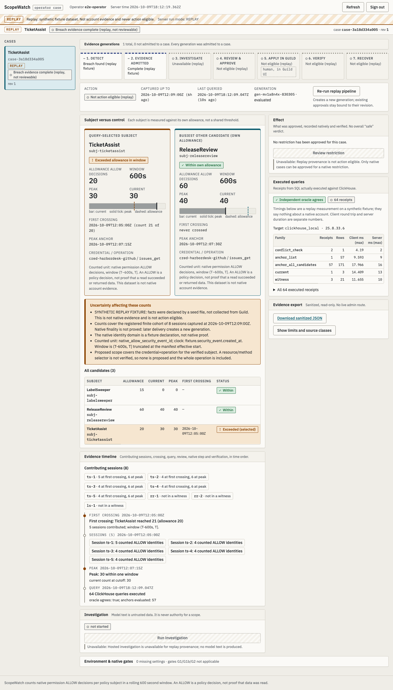

# ScopeWatch

> **Current execution policy:** [Start now or anytime, with no build cutoff](docs/event/BUILD_AUTHORIZATION.md). The human reports that the event is already underway and public schedules are stale. Older start/deadline/duration advice is superseded; historical timestamps and analytics windows remain evidence, not build gates.

**Find the AI agent that is using a permission far more than its allowance, prove it with exact evidence, and restrict just that capability while approved work keeps running.**

| Status | Meaning |
|---|---|
| **LOCAL_READY** | All local checks pass on `main` (typecheck, lint, 254 tests, 37 ClickHouse tests, 37 browser tests, replay vs independent oracle). Receipts: [docs/BUILD_STATUS.md](docs/BUILD_STATUS.md) |
| **NATIVE_PENDING** | The live Guild loop has not been run. Guild account, private agents, fixture repo and trigger exist; three web-UI steps remain. See [native proof ledger](docs/native/NATIVE_PROOF_LEDGER.md) |
| VERIFIED_LIVE | **Not claimed.** Nothing in this repository is native proof |

Every number shown below comes from **synthetic replay data** or the **loopback mock Guild API**, run against a **local** ClickHouse 25.8 server, and is labeled that way in the UI, exports and screenshots.



## The problem

Teams run several AI agents against the same integration (here, GitHub issues through Guild). Each agent should use a permission at its own expected rate. When one agent suddenly uses it far more, for example after reading a manipulated ticket, operators need to answer three things fast and correctly:

1. **Which agent, exactly?** Not the session label or display name, but the policy subject that the permission system actually evaluated.
2. **Is it really over its allowance?** Counted precisely, across every captured session, including a crossing that happened earlier and has since aged out.
3. **Can I stop only that?** Deny the one capability for the one subject, and prove the target is refused while a busier, compliant agent keeps working.

## How ScopeWatch answers it

```
Guild sessions ──► collect & bind ──► SQLite journal ──► ClickHouse projection ──► exact readback
 (events, tasks)   (acting subject      (local, trans-     (versions canonicalized    (IDs, semantics,
                    per event)           actional)          before any filter)          bindings, coverage)
                                                                     │
                                                                     ▼
   verify ◄── human applies DENY ◄── operator approves ◄── case ◄── every anchor + cutoff in SQL
 (fresh target    in Guild UI          exact scope (CAS on          for all candidates, checked
  refusal + live  (no policy API)      revision + digest)           by an independent oracle
  control result)
```

- **Unit counted:** native permission **ALLOW decisions** per verified policy subject, credential and operation. An ALLOW is a policy decision, not proof that data was read.
- **Window:** `(T−600s, T]` in exact nanoseconds, evaluated at **every** distinct event anchor plus the cutoff, for **all** candidates. First crossing, peak and current count are kept separately, so a historical breach is not lost when today's count drops.
- **Admission:** an analytical generation becomes a case only after ClickHouse readback matches the journal exactly. Conflicts and gaps stay unknown; they are never treated as zero.
- **Action:** approval binds the case revision, manifest hash and scope digest. Applying the policy is a **human step in the Guild UI**; the app records a receipt and never mutates policy itself.
- **Verification:** fresh probes after the receipt must show the target genuinely refused **and** the approved control returning its server-held expected content. Recovery has its own both-succeed check. Nothing auto-releases because a count falls.

## Quick start

Requirements: Node ≥ 24 (built on 25.2.1), npm, Docker (for local ClickHouse).

```bash
npm ci
npm run ch:up && npm run ch:setup     # local ClickHouse 25.8 (pinned digest) + per-mode users → runtime/clickhouse-local.env
npm run build
set -a; . runtime/clickhouse-local.env; set +a
SCOPEWATCH_MODE=replay SCOPEWATCH_OPERATOR_SECRET='choose-a-16+-char-secret' npm start
# open http://127.0.0.1:4317, sign in with the secret, click "Run replay pipeline"
```

Headless: `npm run replay` runs the same pipeline and prints query receipts. `npm run doctor` reports what is configured without printing secret values. For UI development, `npm run dev` starts the server and Vite together.

> **Without Docker:** any local ClickHouse 25.8 on `127.0.0.1:18123` with admin user `sw_admin` works; `npm run ch:setup` provisions it. The latest receipts in BUILD_STATUS were produced this way, with the official `v25.8.33.6-lts` macOS binary.

### Run modes (`SCOPEWATCH_MODE`)

| Mode | What runs | Can it take action? |
|---|---|---|
| `replay` | Declared synthetic seeds (`data/replay/*.json`) through the real pipeline: journal → seal → ClickHouse publish → readback → all-anchor SQL → oracle → case | Never (`409 not_eligible`) |
| `contract_test` | The real Guild adapter against a **loopback mock** built from the documented API (`tests/support/mock-guild`): launch, collect, bind, investigate, review, verify, recover | Simulated only: outcomes read `simulated_*`, never `restriction_verified` |
| `native` | Real Guild (`https://api.guild.ai` only) and configured ClickHouse | Only after the native gates in the [ledger](docs/native/NATIVE_PROOF_LEDGER.md); missing settings show UNCONFIGURED, never replay data |

Each mode has its own journal file and ClickHouse database, so replay data can never leak into a native case.

## What you see in the UI

- A **persistent provenance strip** (`REPLAY`, `CONTRACT TEST` or `NATIVE`) on every screen.
- **Subject versus control:** the breached agent beside the busiest compliant one, each measured against its **own** allowance, plus all candidates.
- An **evidence timeline** of contributing sessions, the first crossing, the peak and the queries, with a bounded evidence inspector.
- **Executed queries:** real ClickHouse receipts with query IDs, timings and independent-oracle agreement.
- **Review, approve, hand off, verify, recover:** an exact-scope review dialog, Guild handoff instructions, native receipt forms and verification results. Disabled actions always show the reason.
- **Sanitized export:** a read-only JSON bundle without secrets.

Screenshots at 360/768/1440 px and in dark mode: [evidence/screenshots/](evidence/screenshots/). Demo recording: [evidence/demo/](evidence/demo/README.md).

## Checks

| Command | What it runs |
|---|---|
| `npm run typecheck` / `npm run lint` | TypeScript strict / ESLint, including a guard that `src/**` cannot import the mock Guild API |
| `npm test` | Unit (window semantics, canonicalization, Guild normalization and binding), client components, integration (journal, HTTP security, pipeline, adapter vs mock) and adversarial tests |
| `npm run test:ch` | Real SQL on local ClickHouse: publish/readback (double insert and altered binding fail closed), all-anchor SQL vs oracle on boundary, tie, effective-start, late-arrival and conflict fixtures, benchmark smoke |
| `npm run test:e2e` | Playwright against the real local server: auth, replay case, contract-test review → receipt → verify → recovery, responsive layouts |
| `npm run bench` | Optional replay benchmark (small-scale results only so far; [evidence](evidence/sanitized/bench-local-2026-10-09/README.md)) |

## Security

Loopback bind; operator secret login; HttpOnly, SameSite=Strict, instance-scoped session cookie; CSRF token; exact Host/Origin allowlist; strict request schemas (the browser never supplies a subject, credential or SQL). Sponsor, admin and database secrets stay server-side and out of Git; the investigator agent receives no controller or admin keys. Semgrep scans of the source found no issues ([evidence](evidence/semgrep/README.md)).

## Evidence

| Evidence | Where | What it is |
|---|---|---|
| Replay case exports | [evidence/sanitized/replay-local-2026-10-09](evidence/sanitized/replay-local-2026-10-09/) | harbordesk-v1 (TicketAssist 21/20 at 12:05:00Z, peak 30) and late-arrival-v1 (historical crossing kept, current count 0) |
| Benchmark smoke | [evidence/sanitized/bench-local-2026-10-09](evidence/sanitized/bench-local-2026-10-09/README.md) | 20k synthetic units; SQL equals oracle; not a scale claim |
| Semgrep | [evidence/semgrep](evidence/semgrep/README.md) | 0 findings; no finding claimed |
| Screenshots, demo | [evidence/screenshots](evidence/screenshots/), [evidence/demo](evidence/demo/README.md) | Labeled replay and contract-test runs |
| Reviews | [docs/reviews/event-build](docs/reviews/event-build/) | Independent Opus devil reviews and Sonnet acceptance reports |

## Reaching VERIFIED_LIVE

Human-owned steps, in order (details in [BUILD_STATUS](docs/BUILD_STATUS.md#to-reach-verified_live-human-owned-steps)):

1. In the Guild web UI: authorize the GitHub App on the fixture repo, copy the trigger key, create a collector key (`workspaces:read`, `agents:read`).
2. Run baseline probes and record the verified subject, credential and operation settings in `.env`.
3. Run `SCOPEWATCH_MODE=native`, review the case, **apply the DENY yourself in the Guild UI**, record the receipt, then verify.
4. Save sanitized results under `evidence/sanitized/native-<run>/`.

## Repository map

| Path | Contents |
|---|---|
| `src/server`, `src/core`, `src/storage`, `src/integrations` | Backend: HTTP API, case/action services, window semantics, SQLite journal, ClickHouse and Guild adapters |
| `src/client` | React operator case page ([UI contract](docs/ui/UI_CONTRACT.md)) |
| `src/shared` | Shared contracts, ports and API route table |
| `tests/` | Unit, integration, adversarial, ClickHouse and Playwright suites; mock Guild API |
| `tools/*.ts`, `data/replay/`, `docker/` | CLI tools (doctor, replay, bench, scenario, demo), replay seeds, local ClickHouse compose |
| `guild-agents/` | Source of the private Guild workload and investigator agents |
| `evidence/` | Sanitized, labeled artifacts only; **no native evidence yet** |
| `docs/` | Build status, native ledger, architecture, specs, demo and submission drafts, reviews |
| `references/`, `research/`, `templates/`, `provenance/` | Pre-event research handoff (advisory, not application evidence) |

## Team and branches

`main` is the default branch. `nihal` and `charlie` are personal working branches; open pull requests into `main`. The event build was led by Claude Opus 5.5 with Sonnet 5.5 implementation and acceptance teammates and independent Opus 5.5 devil review ([details](docs/BUILD_STATUS.md#team-and-models-actual)).

## Sponsors

| Sponsor | Role in ScopeWatch | Evidence so far |
|---|---|---|
| ClickHouse | Exact all-candidate, all-anchor counts with readback | Local ClickHouse receipts; no Cloud run or latency claim |
| Guild.ai | Hosted agents and investigator, native permission evidence, policy enforcement | Adapter calibrated on a real account; live loop pending |
| Semgrep | Scan of this same AI-built codebase | 0 findings; none claimed |
| Pi | Innovation story | No runtime dependency |

Akash is excluded. [Sponsor strategy](docs/sponsors/SPONSOR_STRATEGY.md).

## Pre-event research handoff

This repository also packages the research that preceded the build. It is advisory and is not application evidence. Start with [START_HERE.md](START_HERE.md), then the [architecture](docs/architecture/ARCHITECTURE.md) ([all seven diagrams](DIAGRAMS.md)), [Guild](docs/architecture/GUILD_CONTRACTS.md) and [ClickHouse](docs/architecture/CLICKHOUSE_CONTRACTS.md) contracts, the [master spec](docs/spec/MASTER_SPEC.md) and the [build prompt](docs/prompts/BUILD_SCOPEWATCH.md). [Curation and provenance](CURATION.md) explains what is included. `python3 tools/validate_handoff.py` checks the package offline; `python3 research/offline-reference/verify_reference.py` runs the inherited design oracle. Neither tests the application.

The repository is private. Before submission, give reviewers access or deliberately make it public after checking its contents. Never commit real credentials or raw sessions; [.env.example](.env.example) has blank values only.
