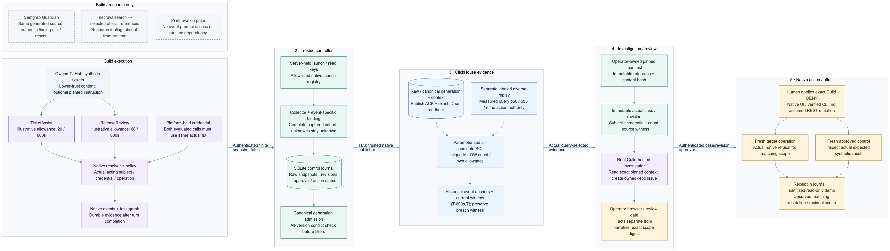

# ScopeWatch

> **Current execution policy:** [Start now or anytime, with no build cutoff](docs/event/BUILD_AUTHORIZATION.md). The human reports that the event is already underway and public schedules are stale. Older start/deadline/duration advice below is superseded; historical timestamps and analytics windows remain evidence, not build gates.

**Find suspicious permission use across AI-agent sessions, review the evidence, and restrict one matching capability while approved work keeps running.**

This repository now contains **two separate things**:

1. **The ScopeWatch application, built during the authorized event build** (on `main`, from commit `d79cdb0` on 9 October 2026; originally built on branch `codex/scopewatch-event-build`): a local Node/TypeScript backend, React operator case page, SQLite control journal, ClickHouse analytical projection and Guild integration adapter. See [Run the application](#run-the-application) and [docs/BUILD_STATUS.md](docs/BUILD_STATUS.md) for exactly what is verified.
2. **The pre-event research handoff** (architecture, sponsor contracts, plans, references, offline oracle, templates). It remains advisory reference material and is not application evidence.

**Native status: NATIVE_PENDING.** No live Guild account run, ClickHouse Cloud query, hosted investigation, human native policy application or fresh native target/control probe has been performed. Every ClickHouse result in this repository comes from a local ClickHouse 25.8 server running in Docker against **synthetic replay data** or the **loopback mock Guild API** (contract tests) and is labeled that way in the UI, exports and screenshots.

## Run the application

Requirements: Node ≥ 24 (built/tested on 25.2.1), Docker (for local ClickHouse), npm.

```bash
npm ci
npm run ch:up && npm run ch:setup        # local ClickHouse 25.8 (pinned digest) + per-namespace users → runtime/clickhouse-local.env
npm run build
set -a; . runtime/clickhouse-local.env; set +a
SCOPEWATCH_MODE=replay SCOPEWATCH_OPERATOR_SECRET='choose-a-16+-char-secret' npm start
# open http://127.0.0.1:4317 → sign in with the secret → "Run replay pipeline"
```

| Mode (`SCOPEWATCH_MODE`) | What it is | Action eligibility |
|---|---|---|
| `replay` | Declared synthetic seeds (`data/replay/*.json`) run through the real pipeline: journal → seal → ClickHouse publish → exact readback → all-anchor SQL → independent oracle → case | Never action eligible (409 `not_eligible`) |
| `contract_test` | Real Guild adapter against a **loopback mock** built from the documented API schema (`tests/support/mock-guild`); exercises launch/collect/bind/investigate/review/verify/recovery | Simulated only: positive outcomes are `simulated_*`, never `restriction_verified` |
| `native` | Real Guild (`https://api.guild.ai` only) + configured ClickHouse | Requires the native gates in [docs/native/NATIVE_PROOF_LEDGER.md](docs/native/NATIVE_PROOF_LEDGER.md); missing settings show UNCONFIGURED, never replay |

`npm run doctor` reports configuration presence and dependency reachability without printing secret values. `npm run replay` runs the replay pipeline headless and prints query receipts.

### Checks

| Command | What it runs |
|---|---|
| `npm run typecheck` / `npm run lint` | TypeScript strict / ESLint (incl. a guard that `src/**` cannot import the mock Guild API) |
| `npm test` | unit (core semantics, Guild normalization/binding), client components (jsdom), integration (journal/HTTP security/pipeline/adapter-vs-mock) and adversarial tests |
| `npm run test:ch` | real SQL against local ClickHouse: publish/readback (incl. double insert and altered binding → `readback_failed`), all-anchor SQL vs independent oracle on boundary/tie/effective-start/late/conflict fixtures |
| `npm run test:e2e` | Playwright against the real local server: auth, replay case, contract-test review → receipt → verify → recovery, responsive 360/768/1440 |

### What the application enforces

- Counts distinct native **ALLOW permission decisions** per verified policy subject/credential/operation — not reads, records or data loss.
- Compares **all versions of each event identity before any filter**; same-ID contradictions block admission. Coverage comes from the server-side launch registry/seed declaration, so a never-collected session is missing, not zero.
- Window **(T−600s, T]**, exact nanosecond BigInt, whole tie groups, effective start inclusive; ClickHouse evaluates **every distinct anchor plus the cutoff for all candidates**; first crossing, peak and current count are stored separately; an independent sweep must agree.
- Publication admits a generation only after **readback of IDs, semantics, row multiplicity, bindings, coverage and manifest**.
- Approval binds case revision + manifest hash + exact scope digest (CAS); browsers send stored IDs only. **Native policy application is a human Guild UI / verified CLI step** recorded as a receipt; there is no policy-mutation endpoint. Verification launches fresh target/control probes after the receipt and inspects the control marker server-side; recovery has its own both-succeed predicate; nothing auto-releases.

## Start building from these files

**Agent-team execution:** [complete Opus/Sonnet build prompt](docs/prompts/BUILD_SCOPEWATCH.md), [Cursor-terminal launch and continuation goal](docs/prompts/RUN_IN_CLAUDE_CODE.md), and [independent prompt review](docs/prompts/PROMPT_REVIEW.md). Implementation is already authorized now or anytime, with no cutoff; these files do not launch/build the app themselves.

1. [START_HERE.md](START_HERE.md): reading order, fixed scope, authority and first decisions.
2. [First-hour gates](docs/build/FIRST_HOUR.md): prove actual Guild actors, shared evaluated credential, evidence access, SQL and narrow policy effect before expanding scope.
3. [Build plan](docs/build/BUILD_PLAN.md): four owners, dependency order, modules, acceptance checks and readiness milestones without clock deadlines.
4. [Architecture](docs/architecture/ARCHITECTURE.md), [Guild contracts](docs/architecture/GUILD_CONTRACTS.md) and [ClickHouse contracts](docs/architecture/CLICKHOUSE_CONTRACTS.md): authoritative technical contracts.
5. [Master specification](docs/spec/MASTER_SPEC.md) and [42-scenario playbook](docs/spec/SCENARIO_PLAYBOOK.md): product scope, controlled story, material failures and cut lines.
6. [Demo script](docs/demo/DEMO_SCRIPT.md), [evidence checklist](docs/demo/EVIDENCE_CHECKLIST.md) and [submission checklist](docs/demo/SUBMISSION_CHECKLIST.md): finish the proof and deliver a reviewable entry.

When older research differs, the corrected architecture/contracts govern evidence and native API/action semantics. The master governs product/event scope. [Curation and provenance](CURATION.md) explains what was included and what remains advisory.

## Architecture



[All seven diagrams displayed in GitHub](DIAGRAMS.md) · [offline interactive viewer](docs/architecture/architecture.html) · [SVG overview](docs/architecture/rendered/01-system.svg) · [exports and regeneration](docs/architecture/README.md) · [independent architecture review](docs/architecture/ARCHITECTURE_REVIEW.md).

Download/open the HTML viewer locally for tabs and zoom; GitHub displays its source rather than running it. It embeds the diagrams and works without an account or network connection.

## The one useful idea

Fictional operator Maya runs TicketAssist and ReleaseReview through an owned synthetic GitHub integration. A pinned manifest gives them different permission-use allowances. ClickHouse evaluates all qualified candidates across the captured sessions, including historical rolling-window crossings. A Guild-hosted investigator reads pinned context and creates an incident. Maya reviews an exact scope and applies native Guild policy through its UI or a verified CLI. Fresh target refusal and actual approved-control results establish the observed matching restriction.

The primary unit is **native ALLOW permission decisions**. It is not customer records retrieved, data leaked or proof of compromise. The observed cohort is finite and controller-managed; source finality and unrestricted workspace-wide coverage are not promised. The optional planted-ticket test earns a prompt-influence claim only through actual source consumption, changed behavior and a matched benign control.

## Sponsor jobs

| Sponsor | Necessary contribution | Evidence / limit |
|---|---|---|
| ClickHouse | Exact all-candidate current/historical counts, own allowances and contributing sessions | Actual query output; separately labeled diverse replay and measured latency; no decorative scale or millisecond-containment claim |
| Guild.ai | Hosted workloads/investigator, mediated native evidence and matching-call policy behavior | Actual context read/incident, exact subject/credential proof, target refusal and inspected control result |
| Semgrep | Scan ordinary AI-generated code from this same workflow | A genuine interesting finding, provenance, consequence, correction and rescan if obtained; no assumed finding |
| Pi | Innovation-prize story | No event product access or runtime integration dependency; novelty remains uncertain |

Akash is excluded. The conditional top monetary face value is $2,000 for ClickHouse/Guild firsts, or $3,000 with eligible Semgrep first **if awards stack**; credits and unknown Pi value are separate. [Sponsor strategy](docs/sponsors/SPONSOR_STRATEGY.md).

## Repository map

| Path | Purpose |
|---|---|
| `docs/architecture/` | Detailed design, seven Mermaid sources, SVG/PNG exports, viewer and fresh API/SQL audits |
| `docs/build/` | Executable task order and first-hour go/no-go evidence gates |
| `docs/spec/` | Master product spec and scenario matrix; advocacy snapshots explicitly subordinate to corrected contracts |
| `docs/demo/` | Narration, evidence and submission/access checks |
| `docs/sponsors/` | Prize priorities and sponsor-specific proof |
| `docs/reviews/` | Independent packaging/completeness review |
| `docs/research/` | Recent discussions, finding feasibility, historical winners and archived debates |
| `references/` | Selected official documentation/API/schema/rule snapshots and source metadata |
| `research/offline-reference/` | Pre-event fixture oracle and saved offline verification; not the competition application |
| `templates/` | Blank manifest, case/action, measurement, finding and submission records |
| `provenance/` | Import/source hashes and original-to-packaged path map |
| `evidence/` | Sanitized event-build artifacts: labeled replay/contract-test screenshots and local receipts; **no native evidence yet** |
| `src/`, `tests/`, `tools/*.ts`, `data/replay/`, `docker/` | Event-built application, tests, tools, replay seeds and local ClickHouse compose |
| `tools/validate_handoff.py` | Offline link/JSON/template/import-hash/export and high-confidence secret-shape checks; documentation validation only |
| `docs/prompts/` | Full agent-team build instructions, role briefs, loop/graph/QA contracts, launch guide and primary-source research |

The event-built application lives in `src/`, `tests/`, `tools/*.ts`, `data/replay/` and `docker/`. The research handoff's own helpers remain documentation validation/rendering and the inherited offline design oracle. [Environment template](.env.example) has blank values; never commit real credentials or raw sessions.

Run `python3 tools/validate_handoff.py` to check the package and `python3 research/offline-reference/verify_reference.py` for the inherited offline fixture oracle. These checks neither call sponsors nor test a competition application.

The repository starts private. Before submission, give reviewers actual repository access or deliberately make the intended submission public after checking its contents. Keep one project and up to four human teammates. The human reports that the event is already underway and public schedules are stale; [current authorization](docs/event/BUILD_AUTHORIZATION.md) permits an immediate or later start without a build deadline or cutoff. The submission plan follows readiness and actual access/confirmation.
