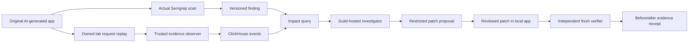

> Imported historical/advisory research. This is not current build authority; follow the ScopeWatch architecture/contracts and START_HERE. Original research date and qualifications remain below.

# Deep research: a money-oriented Cyberdefense hackathon project

**Superseded default project choice:** the fresh October 9 three-advocate debate and independent final review selected [ScopeWatch](../../spec/FINAL_IDEA.md). This document preserves the earlier BoundaryProof recommendation and its evidence. Use the linked current brief for the final build/prize plan.

Completed expanded research, 9 October 2026 IST, for the 9 October San Francisco event. Research and planning only; no competition project has been implemented or genuine target finding obtained. Akash excluded. Current prize details are the user's supplied event packet; public Luma independently confirms the theme, sponsors, judges and agenda, but does not publish those itemized prizes. The supplied packet supersedes the older archive's uncertainty about Pi and Guild awards.

## Executive decision

The recommended product is **BoundaryProof: turn one real source finding into an observed security consequence, a useful investigation decision and evidence that the repair preserves legitimate behavior.** Start with a working Guild/ClickHouse core unless an authentic, interesting Semgrep finding already exists. Promote Semgrep to the lead only after an actual scan, meaningful observed effect and a defensible eligibility path. This is a conditional plan for maximizing eligible prize opportunities, not a payout forecast.

Choose the exact vulnerability after examining ordinary AI-generated code during the event. The strongest catalog-supported starting candidate is a genuine token-trust failure where unverified JWT claims control a protected tenant/role/action decision. An outbound-destination failure detected by an explicitly selected stock CLI ruleset is the second candidate. The warm-cache authorization story remains a compelling third candidate, conditional on actual detection and custom/Pro access/eligibility. No dedicated rule for that cache behavior was established in the public Guardian-default snapshot. Preserve the original prompt, output, commit and actual scanner result. A rule written after diagnosis is confirmation, not proof that Semgrep originally discovered the problem. [Exact rule audit](../finding-feasibility.md).

The same working story can support three monetary tracks when eligibility and integrations are established: Semgrep supplies the source finding, ClickHouse finds affected requests and changes the investigation priority, and a real Guild-hosted investigator turns bounded evidence into a root-cause/repair proposal. Pi's innovation prize adds no integration work. The known top-award ceiling is **$3,000 cash/gift-card face value**, plus ClickHouse/Semgrep credits and Pi's unspecified gift card/hardware, **only if awards can stack**. No win probability or expected payout is established. Without a qualifying Semgrep finding, the nominal two-track Guild/ClickHouse top-award cash/gift-card face-value ceiling is $2,000 if those awards stack; that is still not expected revenue.

This is our preferred hackathon scope because the judge can see one boundary fail, the event appear in analytics, and the same protected operation be denied after repair while legitimate use still works. Six inspected products already cover substantial parts of this architecture, including runtime/source correlation and multi-user authorization tests. No market-novelty proof emerged. The prize argument must be the interesting real finding and a focused, working result, not a claim to invent contextual security or automated remediation. [Competitor audit](../competition-and-eligibility.md), [independent prize critique](../prize-strategy-adversarial.md).

## Prize economics and effort allocation

All amounts in this table come from the supplied current sponsor packet. Credits and hardware are kept separate from spendable money.

| Sponsor | Awards | Necessary evidence | Priority |
|---|---|---|---|
| ClickHouse | 1st $1,000 Amazon/Visa gift card + $500 credits; 2nd $500 gift card + $300 credits; 3rd $250 cash/Amazon gift card | Actual high-volume analytics, measured latency, and an insight that changes detection/investigation/remediation | Core if an analytics builder is available |
| Guild.ai | Winning team $1,000; two runners-up $500 each | A published/installed agent actually hosted and run in Guild, useful tool action and inspectable session | Core; test account/setup early |
| Semgrep | 1st $1,000 cash gift card; 2nd $500; both 20 Semgrep credits | An interesting issue in AI-generated code with real Semgrep output and reproducible impact | Discovery gate; strongest upside depends on authenticity |
| Pi | Three Stream Deck + gift-card prizes; gift-card amount unspecified | Innovation; no Pi product or tech access is provided | Pitch bonus; no engineering dependency |

The quantified monetary pool across ClickHouse, Guild and Semgrep is $5,250, distributed across winners. It is not a possible payout to one team. One team taking the top award in all three monetary tracks would receive $3,000 face value. Team splits, redemption terms, stacking, sponsor-category opt-in and general prizes are not specified in the supplied text.

If stacking is permitted, target each eligible sponsor whose working integration improves the shared demonstration. If stacking is prohibited, choose the strongest eligible $1,000 track based on the finding, working integrations and mentor feedback. Guild is listed as a $1,000 award without a stated gift-card restriction; confirm its payout method if only cash matters. Semgrep and ClickHouse top awards are described as gift cards. Do not trade away a complete demonstration to chase the last logo.

At kickoff, establish: (1) can one project win multiple sponsor categories; (2) do custom Semgrep rules and an issue first diagnosed by another method qualify; (3) what demonstration and video limits apply; (4) whether event accounts provide Guardian, Pro/Workflow or just the documented beta access. Previous events' three-tool requirements and five equal-weight criteria are not established for this event. [Current public event](https://luma.com/cyberhack).

## What previous winners actually built

The archive records 11 verified ClickHouse awardees, nine Guild awardees and three Semgrep awardees. All 23 are consolidated in the [complete relevant-winner matrix](../all-relevant-winners.md), with what they built/claimed and rank provenance. Exact ranks are not all confirmed. No historical Pi awardee was verified in the researched organizer series. The Oct 8 code deep dives correct some Oct 7 first-pass access/implementation assumptions; award badges establish membership, while current repository code may differ from the judged version. [Archive methodology](../../../CURATION.md), [corrected winner-versus-loser analysis](../winners/WHY_THEY_WON.md).

| Example | Built / verified award | What to adapt |
|---|---|---|
| Rokko | Simulated streaming ad impressions, Kafka/MergeTree/materialized views, agent creative-weight changes; ClickHouse confirms first | Show a loop in which an aggregate changes the next action. [Sponsor recap](https://clickhouse.com/blog/aws-mcp-hackathon-san-francisco) |
| RedBot | Authorized chatbot security assessment and finding/history storage; ClickHouse confirms second | Cybersecurity is already a winning use case, but another chatbot red-team demo repeats existing territory. [Sponsor recap](https://clickhouse.com/blog/nyc-ai-agents-hackathon) |
| policyDiff | Policy-to-claims joins and quantified exposure; ClickHouse category badge; headline exposure was seeded | One precise impact question, with ClickHouse in the path between source and action. Label simulation. [Submission](https://devpost.com/software/policydiff-asn4xf) |
| AeroRider | AI hazards feed a ClickHouse route score; category badge; seeded route guarantees the demo flip | The model proposes or describes; deterministic analytics decide. [Submission](https://devpost.com/software/aerorider) |
| DailyGate | Separate published Guild agents with different tools; category badge; displayed live panel was scripted | Real permission differences, with a genuine hosted session rather than a pretend audit stream. [Submission](https://devpost.com/software/dailygate) |
| Branch | Engineering pipeline, sponsor-specific submission documentation; Guild and other sponsor badges, but no verifiable Guild SDK/API use | A clear per-sponsor proof dossier helps reviewers; implement the claimed role. Historical stacking is precedent, not this event's rule. [Submission](https://devpost.com/software/branch-5zn8h0) |
| Darwin | Generated tools scored partly using Semgrep; category badge; headline vulnerability totals were inflated in the inspected implementation | Make the scan affect a visible decision, retain raw evidence and avoid invented security scores. [Submission](https://devpost.com/software/darwin-cmfysv) |
| CommitDNA / Udon Cat | Personalized commit-security tutoring / agent-coding security workflow; Semgrep category badges; individual placements unconfirmed | A distinctive user story matters. These were older best-use awards, unlike this event's finding award. [Semgrep retrospective](https://semgrep.dev/blog/2025/what-a-hackathon-reveals-about-ai-agent-trends-to-expect-2026/) |

The matched research also found substantial integrations that missed particular sponsor awards. The user's IncidentSherpa won Senso while its SQL-driven workflow did not win ClickHouse/Guild; it was not generally unsuccessful. Scan/fix/rescan alone did not separate Semgrep winners. Therefore integration depth is not a causal win formula. The transferable pattern is a useful idea, a reliable short demo, a visible sponsor decision and evidence an engineer can inspect. Copying mocked outcomes, vulnerable defaults or post-deadline work would undermine this project's pitch.

Detailed sponsor findings: [ClickHouse/Guild](../clickhouse-guild.md), [Semgrep/Pi](../semgrep-pi.md). Full project histories remain in the existing archive; this recommendation intentionally selects the relevant evidence rather than treating every awardee as an independent vote for one architecture.

## Current sponsor capabilities that change the design

### ClickHouse

The ClickStack update titled **Aug '26 was published September 16, 2026** and covers v2.34-v2.38. Relevant features include GA dashboard variables, deployment/release markers, formula alerts, richer webhook data and beta LLM observability. Release markers are particularly useful: show the vulnerable version, the first boundary violation and the patched version on one timeline. The new emerging-signals MCP tool can compare log patterns between windows; its vendor demonstration is not a general security detection benchmark. [Official update](https://clickhouse.com/blog/whats-new-in-clickstack-august-2026).

Executable UDFs became GA on ClickHouse Cloud on October 5. They are relevant to advanced in-database scoring but add deployment/availability work this MVP does not need. Plain MergeTree, HTTP/client inserts and a parameterized aggregate query are sufficient. [UDF announcement](https://clickhouse.com/blog/executable-udfs-generally-available-on-clickhouse-cloud).

An incremental materialized view triggers when its left/source table receives an insert. A later change in a joined findings table does not retroactively enrich past event rows. Aggregate immutable telemetry if useful, then join scanner findings at query time. Do not build a stale impact count by assuming both join sides trigger the view. [Materialized-view documentation](https://clickhouse.com/docs/concepts/features/materialized-views/incremental-materialized-view).

### Guild.ai

Current Guild documentation supports secretless agent execution, mediated credential egress, real session events and credential policies. These are useful product capabilities; no fresh release date was independently found, so they are not all presented as newly launched this month. [Security architecture](https://docs.guild.ai/platform/security-architecture).

Two setup traps affect the five-hour plan. A new connected credential starts with an allow-all default; adding a restrictive policy alongside it is insufficient, so replace/remove the default before claiming least privilege. API triggers use a dedicated UI-created key and Basic auth; a general partner API key can create chat sessions, not an api_trigger session. Save the actual returned session ID/URL. [Credential policies](https://docs.guild.ai/platform/credential-policies), [API triggers](https://docs.guild.ai/platform/api-triggers), [API documentation index](https://docs.guild.ai/llms.txt).

Use one hosted investigator first. The agent reads bounded evidence and proposes a restricted patch/action; a second operator is optional. Coded agents require the documented runtime and publishing path, including Guild registry authentication. A native prompt/tool agent is a valid simplification if compiler/setup work dominates. [Quickstart](https://docs.guild.ai/quickstart), [coded agents](https://docs.guild.ai/guide/coded-agents).

### Semgrep

Guardian's remote Claude Code/Codex plugins use a fixed **guardian-default** ruleset; organization policies do not apply to that path. Custom cache-detection rules must use a supported local/custom path, such as the Semgrep CLI, rather than being advertised as automatically available in the remote hook. Capture the actual scan, rule ID, source line and errors. [Guardian rules/configuration](https://docs.semgrep.dev/semgrep-guardian/rules-and-configuration), [quickstart](https://docs.semgrep.dev/semgrep-guardian/quickstart).

Semgrep already combines static analysis with LLM reasoning for business-logic findings. Custom Workflows and the prebuilt Agentic Workflows make a generic “LLM discovers, writes a rule, fixes, rescans” product less distinctive. Availability/access differs: do not make private/custom SDK access or proprietary cross-file analysis critical to the demo. Community Edition's within-function analysis is not the same as Semgrep Code's broader analysis. [Custom Workflows](https://semgrep.dev/blog/2026/introducing-semgrep-custom-workflows/), [Agentic Workflows](https://semgrep.dev/blog/2026/introducing-semgrep-agentic-workflows-automate-deep-vulnerability-hunting-at-scale/), [Pro Engine](https://docs.semgrep.dev/semgrep-code/semgrep-pro-engine-intro).

The September 24 malware detection/response announcement also matters: a simple suspicious-package summarizer competes with current sponsor functionality. BoundaryProof should contribute local impact/closure evidence around the authentic finding, not recreate the sponsor's scanner. [Announcement](https://semgrep.dev/blog/2026/introducing-malware-detection-and-response-automation).

### Pi

Pi announced a Claude Compliance API integration September 29, connecting Claude Code development sessions to security context, with documented data scope. Its customer/root-cause stories emphasize contextual, actionable security rather than another isolated alert. This makes durable evidence and correct repair a useful innovation framing, but it does not make Pi a dependency: **the event provides no product access**. [September launch](https://www.pi.security/blog/powering-every-builder-with-security-context-pi-integrates-with-anthropics-compliance-api), [Lemonade customer story](https://www.pi.security/customers/lemonade), [variant-analysis example](https://www.pi.security/blog/one-word-aws-sdk-cloud-takeover).

## What the last 30 days suggest

The research window is September 9-October 9, 2026. Two completed passes cover defensive-agent security and then AI-generated-code security specifically. The first returned 52 records; the deeper second returned 80 records across Reddit, YouTube, Hacker News, GitHub and web, with 8 of 17 YouTube items transcribed. These totals are not deduplicated unique claims, uniformly relevant evidence, market-size metrics or independently verified incidents. Broad AI videos account for much of the viewing total. The [first community brief](../recent-pulse.md) and [deeper code brief](../recent-code-pulse.md) preserve exact coverage footers and bounded interpretations. X was unavailable; TikTok/Instagram failed in the first pass and were omitted from the second. Auto-transcript errors and partial coverage are explicit limits.

Three primary-source observations shaped the choice:

1. Mandiant's September report describes agent/RAG data-boundary failures and recommends tenant isolation, real-time behavior telemetry and restricted investigation permissions. This supports a source-to-runtime boundary demo, not a claim that all RAG agents leak. [Report](https://cloud.google.com/security/resources/ai-risk-and-resilience-2026).
2. Check Point's September 10 PuzzleMask work demonstrates a limited experimental failure of quick LLM policy checks to identify prose-wrapped payloads. It reinforces the need to evaluate behavior and use structural controls; it is not evidence that every guardrail or model fails. [Research](https://research.checkpoint.com/2026/puzzlemask-abusing-plain-prose-as-a-covert-ai-attack-vector/).
3. Anthropic's September threat report documents real malicious uses and evolution of AI-enabled operations. The practical implication for this hackathon is an inspectable local security outcome rather than unverifiable claims of autonomous adversary detection. [Report](https://www.anthropic.com/threat-intelligence-report-september-2026).

The conditional cache candidate is an established authorization failure, not a new vulnerability class. OWASP already recommends tenant-aware caches and authorization checks on protected data. Novelty must come from an actual surprising generated implementation and its evidence chain. [Multi-tenant guidance](https://cheatsheetseries.owasp.org/cheatsheets/Multi_Tenant_Security_Cheat_Sheet.html).

The September 29 Semgrep SusVibes study scored function and security separately on 186 CVE-derived tasks, reporting 93.5% functional success versus 54.8% correct-and-secure. Its memorization and benchmark-construction caveats preclude applying those rates to an ordinary new app. The actionable lesson is to keep legitimate-operation and protected-boundary checks separate. [Study](https://semgrep.dev/blog/2026/claude-opus-5-5-susvibes-benchmark/).

Google's September 19 infrastructure article recommends separate developer/scanner/triage contexts and structural validation. Snyk's September 10 lifecycle argument includes runtime validation, and its September 17 release places remediation in open preview and agentic AppSec in private preview. These are prior art and vendor positions/availability claims, not proof of this project's novelty or measured performance. [Google](https://cloud.google.com/blog/topics/systems/using-ai-agents-to-secure-google-infrastructure/), [Snyk lifecycle](https://snyk.io/blog/is-prevention-solved/), [Snyk release](https://snyk.io/news/agentic-ai-security-moves-into-production/).

## Finding selection supported by the actual public catalog

The parsed public Guardian bundle contains 332 rules in the saved snapshot; the AI-best-practices pack contains 27, with no rule-ID overlap between those two snapshots. Those are catalog observations, not proof that an authenticated hook ran a particular rule or that a target is vulnerable. Full pinned IDs, rule bodies, checksums and limitations are in [finding-feasibility.md](../finding-feasibility.md). [Guardian bundle](https://semgrep.dev/c/p/guardian-default), [AI pack](https://semgrep.dev/c/p/ai-best-practices).

| Candidate | Published detection anchor | Necessary case evidence | Event decision |
|---|---|---|---|
| Unverified JWT claims used for a protected decision | Guardian includes `python.jwt.security.unverified-jwt-decode.unverified-jwt-decode`; JS decode/none-algorithm checks also exist | Actual scan plus a protected operation improperly authorized; nonsecurity decoding or prior independent verification can be benign | First candidate if genuinely observed; known class needs an interesting actual consequence |
| Outbound destination boundary | Stock Flask/requests SSRF and MCP SSRF rules exist outside the inspected Guardian default | Actual explicitly configured scan, controlled destination evidence and observed effect; a generic flag does not establish redirect behavior | Second candidate; check framework/client/rule compatibility before commitment |
| Cache/permission transition | No dedicated pattern for this behavior established in Guardian default; custom/Pro reasoning is a separate surface | Actual observed permission failure and accepted detection/attribution path | Third, conditional candidate; do not chase it indefinitely |
| Credential propagation into logs/tool outputs | Particular public credential-logging rules exist outside the inspected Guardian default | Genuine detected source path and synthetic value crossing its permitted audience | Completion-oriented fallback; ordinary secret detection may be less interesting |

Public rules do not establish current-event custom-rule eligibility. Generation transcripts and immutable hashes are our credibility recommendation, not an attestation requirement located in the prize rules. Authentication docs do not establish an Enterprise-organization requirement for entry. The sponsor packet does not say that only Guardian may detect the issue; an explicit stock CLI scan is a different legitimate Semgrep surface whose actual result must be retained.

## Competition and the realistic innovation claim

| Inspected product | Established overlap | Honest project positioning |
|---|---|---|
| Sentry Seer | Runtime telemetry + source root cause, patch/PR and CI iteration | A specific security consequence and evidence receipt, not the first runtime-to-code fixer |
| Datadog Bits/IAST | Telemetry investigation and runtime sink/source vulnerability context | A bounded identity/resource case; not universal runtime exploitability prioritization |
| Endor + Microsoft Defender | Code-to-runtime attack paths and SCA prioritization | A first-party generated implementation case, not the invention of correlation |
| StackHawk | Multi-authentication BOLA testing and CI regression | A surprising state transition in the actual finding, not the invention of two-user testing |
| ClickStack | Agent traces, log-pattern comparisons, release markers and alerts | Use sponsor infrastructure; contribute an inspectable security decision |
| Guild Software Factory | Hosted issue/plan/change/review workflow | One useful bounded investigation, not another generic software factory |

The [competition audit](../competition-and-eligibility.md) links every first-party source and qualifies access/stage. The strongest defensible claim is a focused hackathon composition around an authentic finding. There is no evidence that competitors cannot perform equivalent tests or closure. Pi's Most Innovative prize remains a bonus opportunity, not a predicted outcome.

## Three ideation rounds and the adversarial selection

An independent reviewer generated eight candidates, attacked the shortlist and narrowed the contract. The expanded catalog and competition research then changed case priority, and a fresh independent reviewer challenged opportunity cost and premature commitment. The scores are design judgments, not prize probabilities. Full records: [round 1](ideation-round1.md), [round 2](ideation-round2.md), [round 3](ideation-round3.md), [fourth financial/product critique](../prize-strategy-adversarial.md).

| Candidate | Why considered | Decisive objection / result |
|---|---|---|
| Return to Sender | Approved webhook redirects or retry state violate the destination boundary; clear runtime impact | Good alternate if an authentic finding exists; avoid broad SSRF/DNS-rebinding scope |
| Phantom Approval | Approved action changes before execution | Excellent Guild/Pi fit, but difficult Semgrep semantics and approval infrastructure |
| Tenant Time Bomb | Tenant context lost across delayed/background work | Good alternate, but scheduling/context propagation complicates proof |
| Cross-tenant warm-cache bypass | Secure cold path, insecure early cache return; tiny A/B reproduction | Distinctive conditional case; catalog audit lowers its priority because default detection is unestablished |
| Injection-proof SOC | Poisoned logs induce a dangerous tool action | Crowded, uncertain model behavior and weak finding-award fit |
| Dependency/skill provenance | Agent extension/install path becomes a supply-chain threat | Relevant but costly evidence and unsafe-sample handling; sponsor overlap |
| Credential Evacuation | Indirect secret logging/trace propagation | Reliable fallback but lower uniqueness; only use synthetic canaries |
| Patch Referee / Echo | Multiple fixes or recurrence rules judged by tests/scanner | Too broad; overlaps historical Darwin and current Semgrep/Pi workflows |

Round 2 rejected the assumption that four logos increase award odds by themselves, the claim that a cache-key pattern proves exploitation, the use of attacker-supplied tenant fields as truth, and “0 findings” as sufficient fix verification. Round 3 removed multi-agent tournaments, universal IDOR rules, autonomous merging, Slack/voice extras and an elaborate memory product. The fourth critique makes the lead track conditional: a working Guild/ClickHouse product is the default; an authentic eligible finding promotes Semgrep. Catalog inspection elevates token-trust and stock-rule destination cases above an assumed cache finding. One case, one useful decision and one inspectable outcome remain the product contract.

## Concrete working project

### User and outcome

The user is an AppSec engineer responsible for an AI-built multi-tenant support application. They need to know whether a finding is exercised, which requests/resources are affected, and whether the proposed fix preserves normal operation. BoundaryProof shows those three answers in one case view.

The chosen event case uses an owned generated application and synthetic confidential markers. If actual scan evidence supports the token-trust candidate, the product explains how unverified claims were promoted into a protected decision. If a genuine cache case is obtained and eligible, tenant A legitimately warms a protected result and tenant B improperly receives it through the cache before the check. The specific mechanism is selected from reality, not forced into the scaffold. The reproduction is real against the controlled app; the background scale dataset is explicitly synthetic.

The chain means Semgrep supplies static evidence; ClickHouse answers impact; Guild reasons and proposes; the application authorization patch enforces the boundary; the verifier establishes the tested before/after behavior. Async analytics observes after an event and scopes response. It is not the request-time mechanism that prevents the first leak.

### Four visible sponsor moments

| Sponsor | What the judge sees | Concrete artifact |
|---|---|---|
| Semgrep | Actual vulnerable line and rule, tied to preserved original AI output | Scan JSON, rule source, original prompt/output/commit, pre-fix replay |
| ClickHouse | A new violating request found among real stored replay events; affected resources/requests determine the case | SQL, query ID, actual count/rows-read and latency, version comparison |
| Guild | A real published investigator uses the aggregate and source evidence, returns a bounded explanation/proposal | Agent configuration, session URL and actual tool events |
| Pi | A subtle boundary failure closed without disabling the legitimate feature | Live A/B behavior and a versioned closure receipt; no Pi integration claim |

### Smallest honest implementation

Use one language/backend the team already knows. A small FastAPI/TypeScript target, local Semgrep CLI/Guardian workflow, ClickHouse HTTP/client interface and one Guild-hosted agent are enough. One case screen has source evidence, runtime impact and closure proof. No full SIEM, multi-cloud inventory, production agent fleet, voice UI or public-target scanning.

The ledger records request/trace ID, code version, route, independently established actor/credential validity, served resource ownership, relevant state such as cache hit/miss, result, observer timestamp and dataset_kind. For a token-trust case, unverified claims are untrusted attributes: derive expected identity/permissions from the controlled authority/fixture, not the target's assertion that the token is authenticated. Scanner rows record rule/file/line/commit and the explicit route mapping. If the mapping is configured for the controlled app, label it; do not imply general causal reconstruction of arbitrary repositories.

Load a target of roughly one million diverse synthetic/replayed rows, then issue separate live lab requests. This is a proposed workload, not a measured result or a rubric minimum. Reduce it if needed, retaining the true stored row count and live update. The impact query groups unauthorized served responses by code version/route and links the matching finding. For strict tenant-exclusive ownership, tenant mismatch is a valid signal; for legitimate sharing or same-tenant ACLs, use the independent fixture authorization relation. A mismatch field asserted by the target or client is insufficient.

Measure SQL duration/rows-read, insert-to-alert lag, and event-to-investigation duration separately. Show p50/p95 only after a defined repeated sample; display measurement count and warm/cold condition. A five-second model call does not become a 20ms response because one SQL query took 20ms. No fabricated dollar-loss, security-accuracy or customer-impact badge.

### What counts as a verified fix

For the selected case, the independent check must establish that the protected operation is denied under the failing credentials/state and that legitimate operation is retained. In a token case, credential verification must precede using claims for security decisions; display-only decoding is not itself the demonstrated failure. The verifier computes expected outcomes independently. The following details apply when the actual selected case is the cache scenario.

Authorize protected resource access before serving a cached value. Keys must distinguish whatever changes the permitted result: tenant, principal/view or role where necessary, relevant policy version and content/version, or invalidate affected entries. A tenant prefix alone cannot fix same-tenant access revocation or different user visibility. Flush/rebuild unsafe old entries as part of the demonstrated transition. [OWASP multi-tenant guidance](https://cheatsheetseries.owasp.org/cheatsheets/Multi_Tenant_Security_Cheat_Sheet.html).

The independent verifier runs the same warm-up/request sequence against pre-fix and post-fix versions from fresh process/cache state. Minimum checks: authorized cold read succeeds; authorized warm read succeeds; unauthorized cross-tenant warm read fails; after a local permission revoke, a formerly valid protected read fails if that permission model exists in the target. It records actual returned canary/object IDs and status. A fix that always denies requests fails. A scan error means unverified, not clean.

Keep verifier/fixture/expected-result files outside the patch agent's allowed writable paths. The patch proposal may change the target source only; an enforcing local controller rejects other paths and verifier changes. Persist target/verifier/fixture hashes and result timestamps in the receipt. This is stronger demonstrator evidence, not a formal proof of freedom from vulnerabilities.

## Five-hour execution plan

Use 11:30 AM-4:30 PM PT as the conservative window because the supplied portal opens at 11:30 while the agenda kickoff says 11:00. Build the project during the organizer-confirmed event window. This research brief is preparation, not permission to reuse prebuilt competition code.

| PT time | Whole-team milestone | Exit gate |
|---|---|---|
| 11:30-12:10 | Confirm prize/eligibility details; preserve original AI code; get authentic finding/repro; parallel ClickHouse/Guild hello-world | At 40 minutes, select a real observed bug or switch to the honest defense benchmark |
| 12:10-1:15 | Pre-fix replay, first correct patch and behavior checks; live ClickHouse insert/query; useful Guild session | Every retained sponsor integration needs tangible artifacts, not planned labels |
| 1:15-2:20 | Wire the single case view; query changes investigation priority; scale dataset; fresh closure receipt | Remove second agent, automation extras and recurrence features if loop is incomplete |
| 2:20-3:15 | Validate legitimate use, time queries, make source links/receipts/session inspectable; draft submission | Freeze the product path |
| 3:15-4:10 | Rehearse, record/upload short demo, verify repo access and shareable link | No new features; use actual recorded runs if services are slow |
| 4:10-4:30 | Submit repository, video, build/tools description, names/emails; screenshot/website if ready | Leave upload/access margin |

Suggested four-person split: (1) generated target, finding, patch and verifier; (2) trusted instrumentation, ClickHouse data/query/timings; (3) real Guild deployment and investigator; (4) case UI, evidence dossier and demo/submission. Align one case JSON contract immediately. The Guild role should also help integration once the first agent works.

For two people, combine UI/Guild and target/analytics; cut the second agent and automated patch application. Solo, prioritize the strongest working eligible track; an authentic qualifying finding can make Semgrep the lead. Add one companion only if time permits. This is an implementation judgment, not a numeric prize forecast.

## The demo that sells the project

Prepare a 90-second core, expandable to the confirmed event limit. The supplied text says short video, not an exact three-minute limit.

1. **0:00-0:12:** Show the actual protected consequence in the selected case. For a token case: “The agent trusted a claim the application never verified.” For a genuine cache case: “The SQL had the tenant filter. The cache skipped it.”
2. **0:12-0:30:** Original AI code and actual Semgrep finding. Explain registry/Guardian versus custom rule honestly.
3. **0:30-0:48:** Live event enters ClickHouse beside labelled synthetic traffic. One query identifies affected requests/resources and code version; actual timing is visible.
4. **0:48-1:04:** Open the real Guild investigation/session: bounded evidence, root cause and restricted proposal. Show a useful hosted tool result.
5. **1:04-1:25:** Patch diff, fresh replay: unauthorized read denied, legitimate cold and warm reads still succeed. Open the receipt.
6. **1:25-1:30:** “Found in AI-generated code. Scoped with real analytics. Closed with behavior evidence.”

Prepare `SPONSORS.md` during the event with necessary role, demo timestamp, actual evidence link and limitation for each sponsor. It helps sponsor reviewers understand the project without a tool tour. Record external-service runs honestly; a recorded real session is stronger evidence than a fake live spinner.

## Devil's advocate and rescue branches

| Challenge | Practical answer |
|---|---|
| “You deliberately generated vulnerable code.” | Preserve the unleading feature request and untouched original output. Seeded examples are labelled benchmarks and do not establish finding eligibility. |
| “Semgrep didn't discover this; you did.” | State the sequence exactly. Use a genuine scanner finding where possible; get mentor confirmation for custom-rule confirmation. |
| “Cache isolation is already known.” | Agree. Demonstrate why this particular generated implementation was surprising; novelty is not world-first status. |
| “This duplicates Semgrep or Pi.” | The contribution is observed request impact and independent behavior closure around the case, not another scanner or security-memory clone. |
| “ClickHouse just stores logs.” | Its query ranks the investigated case and counts known affected resources; show the changed input to Guild and measured data work. |
| “You prevented the leak after it already happened.” | The first request is an observed lab violation; analytics scopes response; the patch prevents the demonstrated later unauthorized read. |
| “The agent can game its own tests.” | Restrict writable paths and keep verifier/fixtures independent; reject altered expectations and always-deny patches. |
| “Guild isn't doing the work.” | Show the hosted session and useful tool calls; label local scanner/verifier accurately. |

If the first candidate does not yield an eligible finding but another interesting genuine Semgrep issue does, keep BoundaryProof and change the case. If custom-rule eligibility is rejected, choose a real supported finding or focus on ClickHouse/Guild/Pi without claiming the Semgrep prize. If no authentic finding exists after 30-40 minutes, use an explicitly seeded owned-lab benchmark for the analytics/hosted-investigation project. If Guild setup fails, ask a mentor once and remove it from the critical path rather than inventing a session. If patch generation is unreliable, apply a labelled human-reviewed patch and keep the fresh verifier.

The central money decision is **protect the finished, eligible evidence chain**. A polished two-track entry can be better than a broken three-track ceiling.

## Open questions

- Current-event award stacking and exact sponsor opt-in rules.
- Custom Semgrep rule/finding attribution eligibility and available product tiers.
- Whether ordinary AI generation yields an authentic eligible finding; no finding has been produced in this research task.
- Team size, experience, event accounts, cloud quotas and network reliability.
- Current entrant quality/count and judge scores; historical selected winners cannot establish win odds.
- Exact video-duration and external-link requirements beyond the supplied packet.

## Evidence and rerun inputs

Primary URLs used are linked beside claims above. The comprehensive per-sponsor registers are in [ClickHouse/Guild](../clickhouse-guild.md#source-inventory-and-saved-evidence), [Semgrep/Pi](../semgrep-pi.md#source-register), [rule audit](../finding-feasibility.md) and [competitor/rules audit](../competition-and-eligibility.md). Raw captures are gitignored under `.firecrawl/`; public raw rule snapshots have recorded hashes and a pinned source-tree identity. Historical membership/rank provenance remains in [research/evidence.md](../historical/evidence.md), with all relevant awardees in [the consolidated matrix](../all-relevant-winners.md). Community findings and source limitations are in [recent-pulse.md](../recent-pulse.md) and [recent-code-pulse.md](../recent-code-pulse.md).

Checked completion: four sponsor profiles; all 23 archived relevant awardees; two recent community passes; six named product comparisons plus Snyk/Pi sponsor overlap; actual published rule catalog/source inspection; four ideation/adversarial reviews; five-hour and smaller-team plans; prize arithmetic; linked public event-rule trail; limitations and rescue gates. No current-event public source settled stacking, custom-rule attribution or exact video duration. Those remain live-event questions rather than research facts to invent.

workflow: firecrawl-deep-research + firecrawl + last30days

topic: Cyberdefense hackathon prize strategy, prior sponsor winners, current sponsor capabilities and defensive-AI project ideation

depth: exhaustive continuation, reusing archived full-code investigations and prior live sources, adding pinned rule-catalog/source and six-product competition audits, with two completed multi-source last30days passes

research_as_of: 2026-10-09 IST; community window 2026-09-09 to 2026-10-09

output: complete research/build brief; independent four-round product/ideation critique; full relevant-winner matrix; catalog and competition appendices; no implementation or deployment
