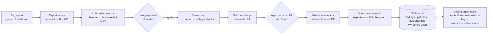

> Imported historical/advisory research. This is not current build authority; follow the ScopeWatch architecture/contracts and START_HERE. Original research date and qualifications remain below.

# Why they won: ClickHouse · Guild AI · Semgrep · Pi Security

**Combined findings from 10 agent teams, 8 Oct 2026, the day before the Cyberdefense hackathon (9 Oct, AWS Builder Loft SF, submissions close 4:30 PM).**

How the work was done:
- 6 analysis teams read the code of 16 cloned winner repos plus 2 found during this pass, and went through Devpost pages, demo transcripts, hosted apps and sponsor blogs.
- 4 devil's-advocate teams then re-checked the key claims and checked the full Devpost galleries of 4 past events (about 240 projects, mostly non-winners) to test the conclusions against projects that lost.

Labels: **[V]** = checked against code, a URL or a transcript. **[I]** = inference. Per-project detail, including Mermaid architecture diagrams, file:line evidence and demo timelines, is in the linked files.

> **Round 2 update (8 Oct, later):** see **[WHY_THEY_WON.md](../../../winners/WHY_THEY_WON.md)**, which compares winners with losers event by event, and the [17 whole-codebase deep dives](../../../winners). It corrects this report in several places:
> - Thin pools held only at AWS MCP 2025. NYC 2026 had 60 of 75 projects using ClickHouse, and London had 27 of 46.
> - Daghan Altas (Semgrep) also judged in 2025.
> - The 2025 Semgrep rubric was 4 × 25%, with no Autonomy criterion.
> - IncidentSherpa was your own team's Harness entry, and it won the Senso prize.
> - Branch's AI plan is thrown away.
> - Darwin's "150 vulnerabilities" are 15 failed runs counted as 10 each.

---

## 1. Ten findings that matter

1. **Code depth did not predict winning, for any of the three sponsors with past winners.** Projects that used each sponsor deeply lost to shallow ones:
   - **ClickHouse:** IncidentSherpa did almost exactly what we would have recommended (live ClickHouse SQL finding the root cause, Langfuse traces, Jira actions) and lost. LicenseTrace's single hardcoded row won.
   - **Guild:** RxScout and Branch have **zero** Guild code and won. NightCrawler built a real Guild approval gate and lost.
   - **Semgrep:** none of CommitDNA's 5 rule IDs exist in Semgrep's registry, and it won. security-goons ran a real fix-and-rescan loop and lost.
2. **Every inspectable winner seeded, hardcoded or scripted its headline result.** **[V]** Examples:
   - Rokko's "CTR" can't be checked: the schema has no clicks column and the agent code was never published.
   - policyDiff's "$792K at risk" comes from a hand-typed 10-row table.
   - TC Pilot's before/after effect was put there by its own data seeder.
   - Vital Signal's "189 WHO alerts" are 5 hardcoded ones.
   - Phalanx's "human approval" is `autoDecision: 'APPROVE'`.
   - MediCall's warfarin recall is injected.
   - Argus falls back to a random `SCRUM-xxxx` ticket key.
   - CommitDNA's hosted app makes no network calls.

   Judges did not audit repos.
3. **Rules were not enforced:**
   - SynapseCRO committed its core product the day before the event at exact 5-minute intervals, against an explicit "built during the event" rule, and won.
   - Phalanx and Branch landed critical fixes after the deadline.
   - TC Pilot's video ran 263 s against a 3-minute limit.
4. **What did separate winners from non-winners:**
   - one sharp, emotionally clear idea with a clear user;
   - a live wow moment that worked;
   - the sponsor **named and badged on screen at the moment it decides something**;
   - a Devpost write-up full of the sponsor's own words. The Guild devil's advocate found that how often "guild" appears on a Devpost page sorts winners from losers better than the code does;
   - fewer than about 5 sponsor tools. IncidentSherpa (9 sponsors) and ResearchAgent (6) lost.
5. **Sponsors reward a story they can retell.** ClickHouse's blogs praised "agents acting on live data" and "a narrow MVP that works end to end". Semgrep's blog wrote up all three winners as "trends" and repeated Darwin's marketing claims as fact. Guild's 1st-place claimants publicly thanked Guild staff.
6. **Thin entry pools make winning cheap (only at some events; see the round-2 correction above).** About 40% of credible Guild pitches at Ship to Prod got an award (6 awards for about 14 substantive entries). London had about 4–8 ClickHouse entries for 2 slots. **[V/I]**
7. **The judges have changed for tomorrow.** Past ClickHouse recaps came from DevRel and marketing, and past Guild judges were its CEO and VP of Engineering. Tomorrow:
   - ClickHouse: **Dustin Healy**, a full-stack engineer.
   - Semgrep: **Daghan Altas**, Head of Product. Milan Williams (Semgrep Product) is listed as a speaker.
   - Pi: two **Pi engineers**, Mike Caballero and Rishiraj Chandra.
   - Guild: only **Corbett Waddingham**, Head of DevRel.

   Expect more "is this real?" questions than at past events. **[V]**
8. **Pi has no past winners, no public API, and only a ~50% chance of a prize.** Pi is in the organizer's "tools and mentorship" tier. Its pitch, "institutional security memory", closely matches two of the event's four tracks ("Autonomous remediation" and "Continuous defense"). Pi is judged on how well an entry fits its thesis.
9. **Guild prize existence is also unconfirmed.** Guild is in the mentorship tier too, and DevRel is its only listed judge. `cyberhack.devpost.com` returns 403, which suggests a draft page that will open around kickoff.
10. **The judging criteria are almost certainly the series standard:** Idea, Technical Implementation, Tool Use, 3-minute Demo and Autonomy, at 20% each. One past event required ≥3 sponsor tools. **[V]** for 3 past tokens& Devposts; [I] for tomorrow.

---

## 2. ClickHouse: 10 winners covered, plus RedBot (blocked)

| Project | Award | ClickHouse in code | Depth | Headline claim vs. reality |
|---|---|---|---|---|
| [Rokko](clickhouse/rokko.md) | 1st, AWS MCP 2025 | Kafka engine → MV → MergeTree, partitioned by day | Load-bearing ingest; agent side unpublished | CTR claim unverifiable; live credentials committed |
| [IncidentLogica](clickhouse/incidentlogica.md) | 2nd | **No public evidence** (only the sponsor's blog says it was used) | Unverifiable | Demo is a stock Temporal sample app |
| [Vital Signal](clickhouse/vital-signal.md) | 1st, NYC 2025 | 4 MergeTree tables; the MV was likely never created | Light | "189 WHO alerts" = 5 hardcoded; probable repo found this pass; silent demo |
| [policyDiff](clickhouse/policydiff.md) | Category (1st claimed) | ReplacingMergeTree + `FINAL` diffing, a queue table shared between services | Load-bearing | "$792K" from a 10-row hand-typed table |
| [TC Pilot](clickhouse/tc-pilot.md) | Best ClickHouse **+ Top Overall** | 5 ReplacingMergeTree + 2 MergeTree, `avgIf`/`countIf` | Near core | Effect seeded; 263 s video |
| [seconds ai](clickhouse/seconds-ai.md) | Category | MV counting distinct complainants | Load-bearing | Main ingest path writes an empty author, which breaks the count |
| [AeroRider](clickhouse/aerorider.md) | Category (2nd claimed) | **3 MVs, AggregatingMergeTree, H3 joins, TTL**; a Gemini hazard written to ClickHouse changes the route | **Deepest; core** | Whole repo is one commit made 6 min before the deadline; demo found this pass |
| [EARWITNESS](clickhouse/earwitness.md) | Category + Langfuse slot | 3 plain MergeTree tables; the MV exists only in the docs | Thin | Video never says "ClickHouse" |
| [LicenseTrace](clickhouse/licensetrace.md) | Category | **One hardcoded INSERT** (`server.js:627-632`) | Decorative | Live scans never stored |
| [SynapseCRO](clickhouse/synapsecro.md) | Category | ClickHouse history fed into 5 LLM prompts | Load-bearing | Repo found this pass; core product pre-built against the rules |
| RedBot | 2nd, NYC 2025 | **Not written up** (see §8) | — | — |

**Features no winner used:** TTL (except AeroRider), projections, vector search, a ClickHouse MCP server.

**Team view → after devil's advocate** ([A](clickhouse/_TEAM_A.md) · [B](clickhouse/_TEAM_B.md) · [DA](clickhouse/_DEVILS_ADVOCATE.md)):
- The teams said "a visible data → action loop wins." The devil's advocate showed it is **not sufficient**: IncidentSherpa and Basket did it and lost.
- **"Langfuse counts as ClickHouse" applied only at Harness.** Langfuse isn't a partner tomorrow, and IncidentSherpa had it and lost. Treat it as low priority.
- Several claims were downgraded to "no public evidence": IncidentLogica's ClickHouse use, Rokko's missing clicks column, and seconds ai's GRANTs, which exist only in a README.

**Revised ClickHouse formula:**

| Priority | Element | Confidence |
|---|---|---|
| 1 | Reach the finalists: one sharp security idea, a polished 2:30–2:50 demo, a **number** on screen | High |
| 2 | ClickHouse genuinely in the live runtime path | Medium-high |
| 3 | One ClickHouse query **changes a security decision on screen**, with ms and row count shown | Medium |
| 4 | Fewer than 5 sponsor tools, with ClickHouse as the spine | Medium |
| 5 | Clean code hygiene, since engineers judge a security event: parameterized `{x:String}` SQL, no committed secrets, the repo itself Semgrep-clean | Medium |
| 6 | Runs on a scheduled or streaming trigger, not a button (Autonomy = 20%) | Medium |
| 7 | One idiomatic engine feature with a one-line justification (an MV feeding an AggregatingMergeTree, or TTL) | Low-medium |
| 8 | Talk to Zoe Steinkamp and Dustin Healy about schema early | Medium |

**Stage traps:**
- Create MVs **before** seeding, because an MV only fills from inserts made after it exists.
- Use `FINAL` on ReplacingMergeTree.
- Test ClickHouse Cloud port 8443 from a phone hotspot tonight.

---

## 3. Guild AI: 9 winners + Argus

| Project | Event / rank | Real Guild usage | Key finding |
|---|---|---|---|
| [MediCall](guild-ai/medicall.md) | Ship to Prod, 3rd (claimed) | **Only verified SDK install** (`@guildai/agents-sdk` 0.2.40 from the private registry), 4 published agents | The deepest Ship to Prod build placed **3rd** |
| [Phalanx](guild-ai/phalanx.md) | Ship to Prod | CLI sessions, but the verdict is thrown away; `autoDecision:'APPROVE'`; fork #2 hardcoded | Guild fixes landed 17:12 and 17:44, so it was probably broken when submitted |
| [Branch](guild-ai/branch.md) | Ship to Prod (won **4 tracks**) | **Zero**: SDK declared as optional, never installed | Halo effect from a strong all-round demo |
| [RxScout](guild-ai/rxscout.md) | Ship to Prod | **Zero**: a single commit at 13:14 | Most "guild" mentions on Devpost (13) |
| [WildFire Response](guild-ai/wildfire-response.md) | Ship to Prod | Guild only as "future work" | Repo, YouTube and Drive all gone |
| [tracepath](guild-ai/tracepath.md) | Ship to Prod | No code; the design is a Guild agent with typed security tools (osv-scanner, Chainguard fix matching) | Most security-relevant design |
| [Magpie](guild-ai/magpie.md) | Harness, 1st (claimed) | 4 agents with **no tools** (`tools: {}`) | Demo found this pass |
| [DailyGate](guild-ai/dailygate.md) | Harness | Deepest: one agent per permission level, where the tools it's given are the boundary | The judged version took no real actions; ran on SQLite, not ClickHouse; never said "Guild" in its captions |
| [proPR](guild-ai/propr.md) | Harness | No repo or demo | — |
| [Argus](guild-ai/argus.md) | Self-Evolving, 1st (claimed; a Guild DevRel post names the winners) | One scoped `pick(jiraTools)` agent; the Jira credential is held in Guild | 11k-line commit 8 min before the deadline; fake ticket key if Guild fails |

**Guild's tools** ([platform guide](guild-ai/_GUILD_PLATFORM.md)):
- `@guildai/cli` is on public npm.
- `@guildai/agents-sdk` comes from the **private** registry `app.guild.ai/npm` and needs `guild auth login`.
- Integrations are `@guildai-services/*`.
- Credentials are **OAuth only**, so custom API keys can't live in Guild.
- Agents run in a sandbox with no direct internet access.
- The approval prompt `ui_prompt` **doesn't work in triggered runs.**

**Team view → after devil's advocate** ([A](guild-ai/_TEAM_A.md) · [B](guild-ai/_TEAM_B.md) · [DA](guild-ai/_DEVILS_ADVOCATE.md)):
- The teams said "real enforcement (deny policies, blocking approval, triggers) is the open path to 1st." The devil's advocate disagreed: in 2 of the 3 ranked data points, deeper Guild use came with a *lower* rank. It also found 6 Guild-native projects that lost, including a real approval gate (NightCrawler), a real webhook trigger (RepoToon) and a *security* "Guild governance" pitch (MCP Auditor). MCP Auditor's team couldn't even install the SDK.
- **Expected value:** the full Guild play costs 3–4 hours (55–70% of build time) for at most about +$250–750. A thin-but-real slice costs about 90 minutes and dominates.

**Revised Guild formula:**

| Priority | Element | Confidence |
|---|---|---|
| 1 | A Guild-heavy Devpost section, plus one spoken sentence saying what Guild does: "Guild holds the GitHub token, scopes each agent, every action is a Guild session" | High |
| 2 | A strong idea and a working live wow moment | High |
| 3 | Something real the DevRel judge can open: a published agent and real `session_url`s shown next to each finding | Medium-high |
| 4 | **One** least-privilege primitive: `pick()` scoping, with the credential for one integration held in Guild (the Argus pattern) | Medium |
| 5 | Talk to Corbett during the build | Medium |
| 6 | Deny policies, blocking approvals, permission-level routers, triggers | **Low**; stretch only |

**MVP (about 90 min):**
- **Agents:**
  - `sec-triage`: read-only `pick(gitHubTools, [issues_get, pulls_get])`.
  - `sec-operator`: write-only, no delete or merge tools.
- **Flow:**
  - Your detector fires the public `api_trigger` endpoint, so no human starts it.
  - The Approve button lives in **your** UI, and the app refuses to proceed if the session errors.
- **Demo line:** "triage *couldn't* open the PR; Guild never granted it the tool."

---

## 4. Semgrep: 3 winners (2 repos return 404)

| Project | Semgrep usage | Depth | Key finding |
|---|---|---|---|
| [Darwin](../../../winners/semgrep-darwin.md) | `semgrep --config p/security-audit --config p/python --json` → **40% of a model-fitness score** (`backend/forge/scanner.py:339-393`) | Formula load-bearing, implementation thin | The UI never shows a finding; "llama" is Claude; the quality score is random; the real Semgrep call landed about 90 min before the deadline; a scanner failure falls back to a regex check |
| [CommitDNA](../../../winners/semgrep-commitdna.md) | Semgrep MCP (claimed) to verify LLM-written training content | Core to the pitch, scripted UI | The hosted app makes no network calls; **all 5 rule IDs are invented**; "Accelerated 10x for judges" was shown on screen. It won on the idea |
| [Udon Cat](../../../winners/semgrep-udon-cat.md) | Real registry rule IDs and messages → a Qwen fix → applied | Load-bearing | The most genuine output; **never re-scans**; Semgrep only, no other sponsors; same author as Guild winner Branch |

**2025 prize tiers:**
- 1st ($2.5k): an agent that generates rules and runs a security-improving workflow.
- 2nd ($1.5k): a custom rule.
- 3rd ($1k): a scan of generated code that comes back clean.

Which winner got which tier is **unknowable**. Both the Devpost order and Semgrep's blog list Darwin first, so the thinnest integration may have taken 1st.

**Projects that lost:** 20 of 56 projects used Semgrep and 3 won its prize. Every piece of the team's original play appeared in a project that lost the Semgrep prize:
- custom rules + "LLM proposes, Semgrep verifies" (TidyShot won 1st overall, but not Semgrep);
- MCP + fix + re-scan (security-goons);
- blocking code before it runs (Yoru).

**What the three winners shared:** one new way of framing what Semgrep is, a clear user persona, Semgrep badged in the UI within 15 s, one memorable artifact or score, and a demo under 3 minutes.

**Platform notes** ([guide](semgrep/_SEMGREP_PLATFORM.md), checked against v1.180.0):
- `semgrep mcp` ships inside the binary, but only 7 tools work locally, and none of them runs `semgrep --test`.
- **Local `semgrep_scan` has no `config` parameter, and it errors if metrics are off.**
- Free taint analysis is single-file and within one function, so cross-file bugs silently show 0 findings.
- "An LLM writes a Semgrep rule" and "scan → Autofix → rescan" are **already Semgrep features**. Re-implementing them reads as a clone unless the *trigger* is new.

**Revised Semgrep formula** ([team](semgrep/_TEAM.md) · [DA](semgrep/_DEVILS_ADVOCATE.md)):

| Priority | Element | Confidence |
|---|---|---|
| 1 | One new, nameable framing of what Semgrep is in your system. Example: an **immune system** that writes "antibody" rules from live attacks | High |
| 2 | Semgrep visibly **decides** something on screen (a gate, block or rank), with a badge | High |
| 3 | Say the judges' 2026 product names: Guardian (scans agent-written code), Agentic Workflows, the AI / Agent-Skills rulesets | Medium-high |
| 4 | A user persona plus one memorable metric, under 3 min | Medium-high |
| 5 | One genuine live moment: a real rule and file:line; everything else pre-computed and **labelled** | Medium |
| 6 | An agent-written custom rule proven by `semgrep --test`, plus a false-positive check on 2–3 real OSS repos | Medium-low (it's the proof, not the headline) |
| 7 | Rescan to zero and refuse to pass on errors | Hygiene only |

---

## 5. Pi Security: no history, inferred model

**Profile** ([profile](pi-security/_PI_PROFILE.md)):
- **Company:** pi.security, CEO Guy Arazi, about $35M raised (June 2026).
- **Thesis, "institutional security memory":** take one report, confirm it, trace the root cause, find every similar bug, write one fix that fits the codebase, then block that pattern on future PRs.
- **Recurring lines:** "detection is a commodity", "a scanner starts every run from zero".
- **Latest launch (29 Sep):** its assistant Sloane now runs inside Claude Code sessions, and Pi says "Nothing is blocked, nothing is proxied."
- **No public API, SDK, MCP server, docs or free tier.**

**Prize existence:** about 50/50. If there is one, it's more likely themed ("best remediation agent") than "Best use of Pi". The two Pi engineers are probably on the overall panel regardless ([event intel](pi-security/_CYBERDEFENSE_EVENT.md), [DA](pi-security/_DEVILS_ADVOCATE.md)).

**The gap:** no winner across all three sponsors traced a bug to its root cause or hunted for similar bugs. That is exactly Pi's pitch, and nobody has shown it.

**"Echo" → "Echo-lite"** ([winner model](pi-security/_PI_WINNER_MODEL.md)):
- **Full Echo** has 7 steps and is only about 25% likely to be finished and demoed reliably by one person. It also climaxes on a hard block, which contradicts Pi's "nothing is blocked" line.
- **Echo-lite** changes three things:
  - it replays the original exploit as a regression test alongside the Semgrep rule;
  - its final moment is a coding agent being **warned and fixing its own code**, not blocked;
  - it adds Guild only if time allows.
- **Confidence:** about 60% that it's the best Pi-aligned choice, and about 70% that it's a good choice overall.

---

## 6. What the devil's advocates overturned

| Original team conclusion | After challenge |
|---|---|
| ClickHouse: "visible data→action loop + narrative wins" | Not necessary *or* sufficient; polish, a single sharp idea and a quantified payoff discriminate better |
| ClickHouse: "Langfuse traces earn ClickHouse credit" | Harness-only; Langfuse isn't a partner tomorrow; low priority |
| Guild: "real enforcement = open path to 1st" | Depth tracks rank inversely in 2 of 3 ranked cases; 6 deep non-winners. Thin-but-real (~90 min) is the expected-value optimum |
| Guild: "the CEO and VP Engineering judge" | Tomorrow it's DevRel only, and the prize is unconfirmed |
| Guild: "DailyGate falls back to the highest permission level" | Overstated: the fallback varies by category, and that file was written after judging |
| Semgrep: "no live custom rule = biggest gap" | Custom-rule projects lost; it is the proof, not the headline |
| Semgrep: tier mapping CommitDNA 1st / Darwin 3rd | Unknowable; Darwin-1st fits just as well |
| Semgrep: "Darwin fails open to 100" | Overstated: a failure falls back to a regex check first |
| Pi: "Echo, all four sponsors, hard block on a later PR" | Too big for one person; the block contradicts Pi's latest launch; Echo-lite instead |
| Pi: "Pi listed in tools/mentorship = no prize" | That grouping is weak evidence; Luma lists all partners together; ~50/50 |

---

## 7. Plan for tomorrow

### Project: "Echo-lite: one report, every variant, never again"

**Sponsor jobs, one visible job each:**

| Sponsor | Job | On-screen moment |
|---|---|---|
| Semgrep | The "immune system": learns an antibody rule from one report and guards agent-written code (say "Guardian-style") | `--test` ✓ and "1 → 4" with file:line |
| ClickHouse | Security memory: `patterns`, `findings` and `guardrail_hits`; a query shows recurrence and time-to-protection | The SQL panel next to the changed outcome, with ms and row count |
| Guild | Least privilege: triage can't write; only the operator can, and only after approval | Real `session_url` links next to each finding; 5-second cut to the Guild session page |
| Pi | Pitch fit: "detection is a commodity; memory isn't." Root cause → similar bugs → fix once → remember | The closing line, quoting their own words |

**Tonight (8 Oct), off the clock:**
1. **Guild:** run `npm i -g @guildai/cli && guild auth login`, publish a hello agent, then fire one `api_trigger` with curl and keep the `session_url`. Connect GitHub. Spend ≤20 min trying a credential deny policy, and keep it only if you can screenshot it.
2. **ClickHouse Cloud:** create the service and keys, and test port 8443 from a phone hotspot. Put keys in `.env` and git-ignore it.
3. **Semgrep:** pin the binary version, copy the YAML rule packs into the repo so nothing downloads on venue Wi-Fi, and confirm `semgrep --test --json` output. Have **one known-good IDOR rule** as a fallback.
4. **Starting point:** prepare an *empty* project skeleton only. Pre-built product code risks the "built during the event" rule, even though it went unenforced before.

**Kickoff (9:30–11:00):**
1. Screenshot the Devpost prize section.
2. Confirm prizes exist for Pi and Guild, and whether "≥3 sponsor tools" is required.
3. Ask the Pi engineers whether any sandbox or Sloane access exists for hackers.
4. Find Corbett, Zoe/Dustin and Daghan/Milan, and pitch them the idea in one sentence.

**Build timeline (11:00 → 16:30):**

| Time | Work |
|---|---|
| 11:00–12:00 | Target API (5 handlers, 4 IDOR variants in 2–3 forms), exploit script, ClickHouse schema with MVs created first |
| 12:00–13:30 | Rule generation + `--test` loop + sweep; ClickHouse writes |
| 13:30–14:30 | Shared-layer fix, exploit replay goes to 403, re-scan to 0; Guild triage and operator |
| 14:30–15:30 | Coding-agent hook moment; UI panel (SQL + session links) |
| **15:30** | **Feature freeze** |
| 15:30–16:30 | Record the 2:45 video, Devpost with a "How we use Guild/ClickHouse/Semgrep" section, and a **"What's real vs. seeded"** README section; run Semgrep on your own repo and show it clean |

**3-minute demo:**

| Time | Beat |
|---|---|
| 0:00–0:15 | "A bug report is a sample, not the finding." |
| 0:15–0:45 | The exploit returns 200. |
| 0:45–1:20 | Rule YAML, `--test` green, "1 report → 4 bugs". |
| 1:20–1:50 | A one-file fix; 4 × 403; Semgrep 0; Guild operator PR. |
| 1:50–2:35 | The coding agent writes the bug again, is warned, and fixes itself; a ClickHouse row lands. |
| 2:35–3:00 | Time-to-protection metric, one line per sponsor, Pi's thesis line. |

**Honesty rule, given who's judging:**
- Every winner faked something, but tomorrow's judges are Pi and Semgrep engineers.
- Label any cached step on screen as "cached run".
- Seed only the target app.
- Never fake a ticket key, rule ID or approval.

---

## 8. Coverage and limits

- **Repo coverage:**
  - Cloned: 16 winner repos across ClickHouse (8), Guild (7, incl. Argus) and Semgrep (1).
  - Found this pass: probable repos for Vital Signal and SynapseCRO, plus demos for AeroRider and Magpie.
  - Still unavailable: WildFire, CommitDNA, Udon Cat (404), and IncidentLogica, tracepath and proPR (no repo). The Wayback Machine was offline.
  - Akash winners were dropped at your request.
- **RedBot:** it is the most security-relevant ClickHouse winner, but **it was not written up**, because a safety filter blocked the subagent's output twice and I didn't try to work around it. The notes it reported before stopping: 6 MergeTree/ReplacingMergeTree tables, read queries that fail silently, a UI that never reads ClickHouse, a "demo mode" committed after submission, and a 3-slide deck.
- **Evidence limits:**
  - Ranks are mostly unpublished or self-reported, and there are no judge scorecards.
  - Current repos may differ from the judged versions.
  - Demo analysis is based on auto-generated captions, not on watching the footage.
  - The sample is about 24 winners, so every formula here is a probability, not a law.

## File index

- `WHY_THEY_WON.md`: round-2 cross-event causal analysis
- `why-they-won/`: 5 event-level reports comparing winners with losers
- `deep-dives/`: 17 whole-codebase deep dives plus 6 team summaries

- `clickhouse/`: 10 project files, `_TEAM_A.md`, `_TEAM_B.md`, `_DEVILS_ADVOCATE.md`
- `guild-ai/`: 10 project files, `_GUILD_PLATFORM.md`, `_TEAM_A.md`, `_TEAM_B.md`, `_DEVILS_ADVOCATE.md`
- `semgrep/`: 3 project files, `_SEMGREP_PLATFORM.md`, `_TEAM.md`, `_DEVILS_ADVOCATE.md`
- `pi-security/`: `_PI_PROFILE.md`, `_CYBERDEFENSE_EVENT.md`, `_PI_WINNER_MODEL.md`, `_DEVILS_ADVOCATE.md`
- `_BRIEF.md`: the shared method and evidence rules
