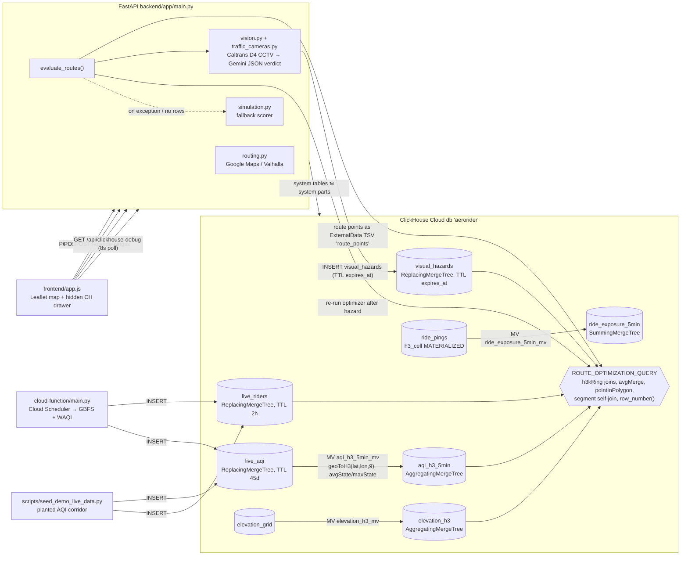

> Imported historical/advisory research. This is not current build authority; follow the ScopeWatch architecture/contracts and START_HERE. Original research date and qualifications remain below.

# AeroRider — ClickHouse Team B analysis

## 1. Snapshot

| Field | Value | Evidence |
|---|---|---|
| Event | Harness Engineering Hack (tokens&), San Francisco | https://harness-hack.devpost.com/ |
| Date | 12 June 2026 (deadline 4:30 PM PDT) | Devpost |
| Award | Best Use of ClickHouse, category winner. **2nd place is creator-reported only** (LinkedIn post by Mukunth Vaibhav G) | `data/winners.json`; https://devpost.com/software/aerorider |
| Prize text (verified) | Team #2: "$500 ClickHouse credits + $250 Cash/amazon gift card" | harness-hack.devpost.com |
| Repo | https://github.com/ybavgito/AeroRider (`repos/clickhouse/aerorider`) | |
| Demo | **A video exists. The prior research's "no standalone video was located" is outdated.** The Devpost page embeds https://www.youtube.com/watch?v=8JmDTt5OFw4 "Aerorider - HarnessHack Submission (Clickhouse Sponsor)", 143 s, uploaded 2026-06-12 by Mukunth Vaibhav G | Devpost scrape + yt-dlp, 8 Oct 2026 |
| Hosted app | None (local demo: `localhost:4173` frontend, `127.0.0.1:8080` backend, per README) | README:119-133 |
| Screenshots | `docs/screenshots/aerorider-route.jpg`, `aerorider-clickhouse-camera.jpg` (both viewed) | |
| Team | One git author (Mukunth Vaibhav Ganesh Kumar). The README says "we"; team size unknown | `git log` |

## 2. What it is

A health-aware bike-route planner for San Francisco. Given an origin and destination, it fetches candidate routes (Google Maps bicycling or Valhalla). It sends every route's GPS points to ClickHouse, which scores each whole route by a "Respiratory Load Index": air quality per H3 cell, gradient from an elevation grid, and AI-detected visual hazards from public Caltrans traffic cameras analyzed by Gemini. If Gemini flags a hazard on the shortest route, the hazard is written to ClickHouse, the route is re-scored, and the app reroutes ("AI visual check blocked shortest; rerouted to Balanced" in the screenshot). A hidden "CH" button opens a judge-facing "What Happened" drawer that exposes the ClickHouse side.

## 3. Architecture (as found in code)

Python 3 FastAPI backend (`backend/app/*`), vanilla JS + Leaflet/CyclOSM frontend (`frontend/app.js` 2,504 lines), a Google Cloud Function scaffold for live-feed ingestion, ClickHouse Cloud, and Gemini 2.5 Flash vision. Sponsor tech: **ClickHouse** only (Harness sponsors such as Guild, Render and Langfuse are not used).



## 4. ClickHouse usage deep-dive

**Depth rating: core-to-the-pitch. ClickHouse is the decision engine, and this is the deepest ClickHouse feature use in this cohort.**

| Feature | File:line | What it does |
|---|---|---|
| ReplacingMergeTree + monthly partitions + TTL | `sql/schema.sql:3-17` | `live_riders` (bike-share stations), `TTL event_time + INTERVAL 2 HOUR DELETE` |
| AggregatingMergeTree with `-State` columns | `sql/schema.sql:34-46` | `aqi_h3_5min`: `avg_aqi_state AggregateFunction(avg, UInt16)`, `ORDER BY (h3_resolution, h3_cell, bucket_start)`, TTL 45 d |
| Incremental materialized view with geo indexing | `sql/schema.sql:48-62` | `geoToH3(lat, lon, 9) AS h3_cell, avgState(aqi), maxState(aqi), countState()` grouped into 5-minute buckets |
| Second MV (terrain) | `sql/schema.sql:74-95` | `elevation_h3_mv` pre-aggregates elevation by H3 cell |
| MATERIALIZED column | `sql/schema.sql:122` | `h3_cell UInt64 MATERIALIZED geoToH3(lat, lon, 9)` on `ride_pings` |
| SummingMergeTree + MV | `sql/schema.sql:129-159` | per-session, per-route 5-minute exposure sums |
| Self-expiring AI facts | `sql/schema.sql:161-180` | `visual_hazards` `TTL expires_at + INTERVAL 1 MINUTE DELETE`; queries also filter `expires_at > now()` (`queries.py:347`) |
| **External data (temporary table per query)** | `backend/app/clickhouse.py:82-98, 101-119` | the candidate routes' points are streamed as `ExternalData(file_name="route_points", fmt="TSVWithNames")`. No staging table is needed |
| Spatial joins via H3 neighborhoods | `queries.py:300, 360, 407` | `arrayJoin(h3kRing(route_h3_cell, 1))` for AQI/elevation probes; `h3kRing(…, 3)` for bike-station coverage |
| Merge combinators over MV state | `queries.py:316-338` | `avgMerge(avg_aqi_state)`, `maxMerge`, `countMerge` restricted to `bucket_start >= now() - INTERVAL 2 HOUR` |
| Geo functions | `queries.py:465-474` | `pointInPolygon((lon,lat), [...SF core polygon...])`, `geoDistance`, `h3EdgeLengthM(9)` |
| Segment self-join for gradient | `queries.py:483-488` | `elevation_at_point cur JOIN … nxt ON nxt.point_index = cur.point_index + 1` |
| Scoring + window ranking in SQL | `queries.py:513-521, 549-550` | `rli = Σ((aqi·1.2 + gradient·8.5 + hazard_penalty)·segment_m)/Σ segment_m`; `row_number() OVER (ORDER BY rli + eta·1.2)` |
| Historical comparison | `queries.py:582-637` | hourly `avgMerge` over N days per route cell |
| Introspection for the judge drawer | `queries.py:658-680`, `clickhouse.py:257-304` | `system.tables` ⟕ `system.parts` for engine, row counts and last part time, plus a hardcoded MV description list |

The closed loop (`backend/app/main.py:350-368`):

```python
rows, query_ms = run_route_optimization(routes=..., origin=..., fallback_aqi=...)
scores = _route_scores_from_rows(rows, baseline_route_id)
if scores:
    pre_vision_selected_route_id = scores[0].route_id
    vision_checks, vision_hazards = _route_vision_checks(request)   # Gemini on Caltrans frames
    if vision_hazards:
        insert_visual_hazards(vision_hazards)                       # write AI fact to ClickHouse
        rows, second_query_ms = run_route_optimization(...)         # re-score; route changes
```

Not used: vector search, MCP, projections, skip indexes, dictionaries, RBAC.

## 5. Claimed vs. real

| Claim | Reality |
|---|---|
| "ClickHouse scores whole route geometries, not just one point" (README:32) | **True.** `ROUTE_OPTIMIZATION_QUERY` (`queries.py:272-580`) processes every point of every candidate route |
| "Gemini produces a hazard signal, ClickHouse stores it, and the route actually changes" | **True in code** (`main.py:359-388`), and the screenshot shows "Camera checks 2 / 2 hazard" with a Gemini verdict "Heavy congestion and stopped traffic visible in the rightmost lane of US-101" at 90% confidence |
| Live AQI data | Partly real: `cloud-function/main.py:90-117` ingests WAQI and Lyft GBFS. **But** `scripts/seed_demo_live_data.py:9-22` plants a "dirty" corridor (e.g. `demo-aqi-nopa` AQI 142, `demo-aqi-alamo` 128) and a "clean corridor" (`demo-aqi-clean-market` 48). Because the optimizer only reads the last 2 hours (`queries.py:326`), seeding just before judging guarantees a reroute. README:105-109: "Seed demo data if live data is sparse" |
| Elevation grid | 20 hand-entered points for all of SF (`sql/seed_static_data.sql`), so gradients are coarse |
| Camera relevance | The Gemini prompt admits "The camera may show a highway or arterial near the route, not the bike lane itself" (`vision.py:55-57`); the screenshot camera is US-101 at Octavia, a freeway |
| Hidden drawer "QUERY" tab shows the SQL | It shows a hand-written, simplified **display copy** (`frontend/app.js:1153-1215`, `clickHouseSqlSnippet()`), not the executed query string. The display copy uses `avgMerge` inside a filtered LEFT JOIN, which differs from the real CTE structure |
| "41372 near route · 100 stations" (screenshot "Live bikes") | Likely an **overcount bug**: `station_coverage` (`queries.py:286-315`) expands each route point into 37 probe cells (`h3kRing(…,3)`) and then `sum(bikes_avail)` across join rows, so a station near many points is counted many times. `countDistinct(station_id)` is correct (inference from the SQL plus the screenshot number) |
| Model column default | `visual_hazards.model DEFAULT 'simulated-gemini-vision'` (`schema.sql:175`) and `simulation.py` provide a full non-ClickHouse fallback (`main.py:401-421`) |
| "Exposure 10% lower" (demo 1:19) | The screenshot shows "15% lower". Values depend on the seeded AQI |

## 6. Demo analysis (143 s, auto-captions of 8JmDTt5OFw4)

| Time | Beat | Content |
|---|---|---|
| 0:01–0:12 | Hook | "health aware bike route planner … optimizes for the route that is the safest for your lungs" |
| 0:13–0:27 | Live run starts | enters "financial district office", multiple routes drawn |
| 0:26–0:47 | **ClickHouse moment 1** | "Behind the scenes, each route is sent to Click House cloud as hundreds of GPS points … within a matter of seconds … compares those route points against air quality, elevation and recent route history … scores the entire full ride" |
| 0:48–1:22 | Decision | "find the healthiest route … shortest route looks good at first … higher respiratory load … recommends the cleaner option … difference is 2 minutes but the exposure is … 10% lower" |
| 1:24–1:51 | **ClickHouse moment 2 ("wow")** | "open the hidden clickout panel … what happened behind the scenes … map cells checked … elevation data and also visual hazard checks … public cameras … San Francisco" |
| 1:51–2:01 | Thesis | "the AI is not just chatting with the user. It changes the route decision based on that" |
| 2:02–2:19 | Recap | "chooses a destination, evaluates multiple routes, scores environmental risks, check visual hazards with AI and reroutes … all of these tabs will show you what's actually happening behind clickhouse" |

ClickHouse is narrated as the engine for roughly 40% of the runtime, and the hidden drawer gives judges a "behind the scenes" view with timing ("Latest route evidence loaded in 876.8 ms", "Decision time 568.0 ms", "Map cells read 17"). The video title itself says "(Clickhouse Sponsor)", so the team targeted the ClickHouse prize directly.

## 7. Build timeline

- **One commit**: `347e95c 2026-06-12 16:24:29 -0700 "Initial AeroRider demo"`, 6 minutes before the 4:30 deadline. Nothing can be inferred about hour-by-hour progress or prebuilt parts from git.
- Size: 7,729 lines (frontend JS 2,504 + CSS 1,301; Python backend ~1,750 incl. `queries.py` 726 and `main.py` 505; SQL 215; cloud function 164).
- Inference: the polish (three MVs, ExternalData, a judge drawer, a Gemini/Caltrans integration, a GCF ingester, tests in `backend/tests/test_simulation.py`) is a lot for ~6.5 hours for one author. This suggests heavy AI-assisted coding and possibly pre-event scaffolding, but neither is provable from history.

## 8. Why it won (ranked)

1. **The sponsor tech visibly changes the outcome.** The route flips because of a ClickHouse query over AI-written rows. The README says it outright: "'AI + maps' only becomes compelling when the AI changes the outcome" (README:52). Verified in code (`main.py:359-388`).
2. **Breadth of idiomatic ClickHouse.** MV→AggregatingMergeTree with `-State/-Merge`, H3 geo functions, TTL-expiring facts, ExternalData and SummingMergeTree. This reads to a ClickHouse DevRel judge as "they actually learned the product", rather than "Postgres with a different driver" (inference).
3. **Judge-facing transparency.** The hidden "What Happened" drawer with Story/Query/Data/Result tabs, latency numbers and `system.parts` row counts makes the ClickHouse work legible in a 3-minute demo.
4. **A clear, sympathetic consumer problem** with an immediately understandable map visual.
5. Fully ClickHouse-focused submission: the video title, the Devpost "Accomplishments" section and the drawer all point at ClickHouse.

## 9. Weaknesses

- The reroute is engineered by seeding a dirty AQI corridor; the live WAQI density in SF is too low for the H3-res-9 joins to matter.
- Freeway cameras are not bike-lane evidence; the hazard-to-route link is cosmetic.
- The bike-count overcount is visible on screen.
- Not deployed, no autonomy story (the Autonomy criterion is 20%), no agent loop beyond one rescore.
- The "QUERY" tab shows hand-written SQL, not what ran.
- Single opaque commit; no tests of the SQL.

## 10. Steal-this

1. **"AI writes a fact → ClickHouse re-scores → decision flips" loop.** For Cyberdefense: the LLM triage agent writes `verdicts` (with `TTL expires_at`), and a risk query re-ranks assets or alerts immediately. Show before/after rank on screen.
2. **ExternalData temp tables.** Ship the candidate set (e.g. the SBOM or the IP list from the current scan) with the query and join it against historical threat-intel MVs, with no staging table.
3. **MV → AggregatingMergeTree rollups** (e.g. `events_5min` per (asset, technique) with `uniqState(src_ip)`, `countState()`) and read them with `-Merge`. Say "the dashboard never scans raw events".
4. **TTL on ephemeral AI judgments** so stale verdicts age out automatically; it is a good talking point about freshness.
5. **A judge drawer**: a hidden panel showing executed query time, rows read, tables/engines from `system.tables`/`system.parts`, and MVs. Make it show the **real** SQL text and `query_log` stats rather than a display copy.
6. Put the sponsor name in the video title and make ClickHouse the narrated decision engine, not "the storage".
