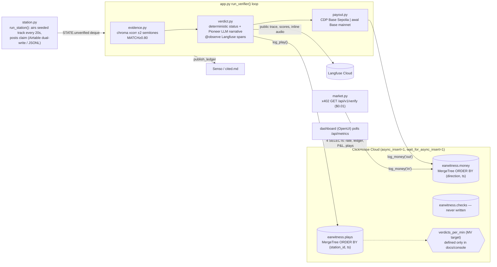

> Imported historical/advisory research. This is not current build authority; follow the ScopeWatch architecture/contracts and START_HERE. Original research date and qualifications remain below.

# EARWITNESS — ClickHouse Team B analysis

> **Current execution policy:** [Start now or anytime, with no build cutoff](../../../../../event/BUILD_AUTHORIZATION.md). The human reports that the event is already underway and public schedules are stale. Older start/deadline/duration advice below is superseded; historical timestamps and analytics windows remain evidence, not build gates.

## 1. Snapshot

| Field | Value | Evidence |
|---|---|---|
| Event | Harness Engineering Hack (tokens&), San Francisco | https://harness-hack.devpost.com/ |
| Date | 12 June 2026 (deadline 4:30 PM PDT) | Devpost |
| Award | Structured badge under **Best Use of ClickHouse**. The README line 3 says "**Harness Engineering Hack: Best use of Langfuse**". | `data/winners.json`; `README.md:3`; commit `b3777c8` 2026-06-25 "docs: highlight harness langfuse award" |
| Reconciling the two | The ClickHouse category text includes "**$500 Cash/amazon gift card for the most impressive use of Langfuse**" inside the ClickHouse prize (verified, harness-hack.devpost.com). ClickHouse acquired Langfuse on 16 Jan 2026 (https://clickhouse.com/blog/clickhouse-acquires-langfuse-open-source-llm-observability; https://github.com/orgs/langfuse/discussions/11593). **Inference (high confidence):** EARWITNESS won the Langfuse slot of the ClickHouse umbrella prize, so its ClickHouse-category badge reflects Langfuse use, not ClickHouse depth | |
| Repo | https://github.com/gorajing/earwitness (`repos/clickhouse/earwitness`) | |
| Demo | https://www.youtube.com/watch?v=QqeSwumPpBk — "Screen Recording 2026 06 12 at 4 29 21 PM", **84 s**, uploader Gorajing | yt-dlp |
| Hosted app | https://earwitness.onrender.com — **503 "Service Suspended … by its owner"** on 8 Oct 2026 | curl |
| Team | 1 git author (Jin Choi / gorajing). Docs reference Codex/Claude agent handoffs (`docs/CODEX_HANDOFF.md`, `docs/CODEX_REVIEW.md`, `.claude/skills`, `.agents/skills`) | |

## 2. What it is

An autonomous "airplay royalty auditor". A seeded fake radio station airs a track every 20 seconds and posts a claim (title, artist, license). The agent ignores the text and fingerprints the actual audio (librosa chroma cross-correlation across ±2 semitones to catch pitch-shift disguises) against a reference catalog. It pays the artist $0.01 USDC when the claim is honest and withholds on discrepancies. It also sells verification packets to other agents via x402, traces every cycle publicly in Langfuse, writes events to ClickHouse, and publishes a cited ledger (Senso/cited.md). Pitch: "Playlists lie. The signal doesn't" (README:11).

## 3. Architecture (as found in code)

Python FastAPI (`earwitness/*.py`, 1,743 lines) with two asyncio background loops, a React/OpenUI dashboard (`dashboard/src`, 667 lines JSX), librosa/scipy DSP, Pioneer (OpenAI-compatible LLM narrative), Langfuse v4, Coinbase CDP / Agentic Wallet, x402, Senso, Airtable/Airbyte, ClickHouse Cloud.



## 4. ClickHouse usage deep-dive

**Depth rating: thin wrapper (an append-only event ledger plus P&L sums). It is not core to the pitch: the video never mentions ClickHouse.**

| Feature | File:line | Notes |
|---|---|---|
| Async inserts | `earwitness/events.py:23-32`, `clickhouse_events.py:12-21` | `settings={"async_insert": 1, "wait_for_async_insert": 1}`, described as "the officially recommended small-insert pattern" (`events.py:3`) |
| Per-thread client | `events.py:23-26` | "clickhouse-connect sessions reject concurrent queries" (commit `4cf106c` "per-thread ClickHouse clients — dashboard polling was dropping verdicts"). A real ClickHouse gotcha they hit and documented on Devpost |
| Tables | `clickhouse_events.py:31-77` | `plays` (Enum8 verdict), `money` (Enum8 direction, `Decimal64(6)` USDC), `checks`; all MergeTree |
| Writes | `events.py:35-56`; call sites `app.py:76-81`, `market.py:83-90` | one row per play, payout and x402 sale |
| Reads | `events.py:59-75` (`countIf`, `sumIf` totals), `events.py:102-121` (dashboard metrics) | `sumIf(amount_usdc, direction='in')` vs `'out'` is the agent P&L |
| Materialized view | `events.py:104-107` reads `earwitness.verdicts_per_min` | the MV is **not created anywhere in code**. Only `docs/INTEGRATIONS.md:151-152` describes it ("the DevRel move: an incremental materialized view verdicts_per_min_mv TO verdicts_per_min (SummingMergeTree)"), so it was pasted into the SQL console by hand |

Key snippet (`events.py:111-114`):

```python
pnl = ch().query("""
    SELECT toString(sumIf(amount_usdc, direction='in')),
           toString(sumIf(amount_usdc, direction='out')), count()
    FROM earwitness.money""").result_rows[0]
```

Schema drift (verified): `clickhouse_events.ensure_schema()` creates `plays` **without** `claimed_artist`/`claimed_title` (`clickhouse_events.py:33-45`), yet `events.log_play` inserts them (`events.py:36-42`). `checks` is created with `(packet_id, buyer, amount_usdc, tx_hash)` (`:66-76`) while `log_check` inserts `price_usdc, status` (`events.py:53-56`), and `log_check` is never called. The working schema lived only in the cloud console.

**Langfuse, the likely prize driver** (`earwitness/tracing.py`, `verdict.py`): one public trace per cycle (`set_trace_as_public()`, `tracing.py:50`), a session per station-day (`tracing.py:35`), `@observe` spans for ingest/fingerprint/LLM (`verdict.py:49, 62`), `score_trace` for `fingerprint_score` and categorical `verdict_status` (`tracing.py:60-67`), the `langfuse.openai` drop-in for generations (`verdict.py:26`), and the aired audio clip attached as media on discrepancy traces (commit `c708373`). The ledger links every row to a public trace URL (`public/earwitness-ledger.md`).

## 5. Claimed vs. real

| Claim | Reality |
|---|---|
| README:46 "every play/verdict/dollar within ~1s; insert-time MV for the discrepancy rate; the P&L query" | Inserts and P&L are real. The MV exists only as console DDL described in docs, not in the repo |
| "Pays real USDC … both directions, with receipts" | Real on-chain payout paths exist (`payout.py`). The Render config uses CDP **Base Sepolia (testnet)**. The local fallback uses `awal` on Base mainnet; the published ledger links `basescan.org` (mainnet) tx hashes, e.g. `0x6f3610af…` (`public/earwitness-ledger.md`). Not independently verified on-chain |
| "Listens to live radio" | The station is **seeded and disclosed** (README:14 "The station is seeded and disclosed"). There are 4 Suno tracks plus one planted lie ("Midnight Garden" pitch-shifted −1 semitone). `docs/DEMO.md` "Reliability rules": "The plant is seeded; reference fingerprints precomputed; the catch **cannot** miss" |
| "Ledger: 666 verified · 337 lies caught · $3.56 paid on-chain · $0.36 earned" | Counts come from ClickHouse `autonomy_totals()`. The file was updated after the event (commit `82dac49`, 2026-06-15). 337 "lies" are repeated rotations of one planted track |
| Devpost: "EARWITNESS is not a mock" | The integrations are real and env-gated; each has explicit fallbacks (local markdown for Senso, JSONL for Airtable) |
| Hosted app | Suspended (503) as of 8 Oct 2026 |

## 6. Demo analysis (84 s, auto-captions)

| Time | Beat | Content |
|---|---|---|
| 0:04–0:21 | Hook + what | "robot radio auditor … listens to radio stations … pays real artists actual money when it's honest and refuses to pay when it's a lie … post receipts … no human touches it" |
| 0:21–0:41 | Big idea | "Every other system trusts the label … The labels can lie … The sound is physics … basically Shazam with the wallet and a conscience" |
| 0:41–1:05 | Mechanism | "fake radio station. Every 20 seconds it airs a track and posts a claim … fingerprints what is actually aired … compares against the library … claim against the reality" |
| 1:05–1:19 | Payoff | "once it matches it's verified the money moves … discrepancy the money does not move … you can see the actual payment being paid out here" |

**ClickHouse is never mentioned in the narration** (verified across the full transcript). The video was recorded at 4:29 PM, one minute before the deadline, and is under half of the allowed 3 minutes. The planned 3-minute script (`docs/DEMO.md`) had explicit sponsor beats ("ClickHouse console side-by-side (`count()` twice, number grows)", "ClickHouse — the money-in/money-out P&L query", lines 12 and 46) that did **not** make it into the recorded video. The live 4:30–5:00 PM booth demo may have included them (unknown).

## 7. Build timeline

- 39 commits. Event-day commits run **12:16 → 17:20 PDT**. The first commit `9f406b9` 12:16 "locked plan + verified sponsor integration specs" (37 files, 1,550 lines) is followed by large batched commits: `3075670` 12:21 (+3,134), `36f3816` 12:27 (+4,369), `bce1b73` 12:50 (+6,822 incl. dashboard). Work was clearly done locally from ~9:45 and committed in bursts, consistent with AI-agent-driven development ("B1…B4.11" task IDs).
- ClickHouse-specific: `36f3816` 12:27 "ClickHouse events", `4cf106c` 13:21 per-thread clients, `4b37acb` 14:38 autonomy stats.
- Post-deadline: `e0fd0a6` 16:47, `fc95c70` 17:20 (docs/ops), `82dac49` 06-15, README award edits 06-25.
- A pre-pivot plan is preserved in `_archive/` (Rollback War Room, then SampleSignal). It shows the author targeted ClickHouse explicitly: "ClickHouse | $1,600 (3 winners) | the live event/telemetry warehouse + the incident queries … A *genuinely* great, differentiated use" (`_archive/war-room/SPONSORS.md:12`).
- Size: Python core 1,743 lines, JSX 667 lines, ~1,300-line docs, plus vendored skill packs (`.agents/.claude/.cursor/skills`, ~1.3k lines each).

## 8. Why it won (ranked, inference)

1. **Langfuse depth inside a ClickHouse-owned prize.** Public traces, sessions, scores, inline audio media and a dispute→feedback loop are a near-complete tour of Langfuse features. The prize text reserves $500 of the ClickHouse category for "most impressive use of Langfuse", and the README claims exactly that award.
2. **Memorable, physics-grounded narrative** ("Shazam with a wallet and a conscience") with a deterministic catch that cannot fail on stage.
3. **Inspectable automated decisions.** Every verdict has a fingerprint score, a public trace, a ledger row and a tx hash. This matches the ClickHouse/Langfuse "observability" story.
4. **Strong autonomy** (two always-on loops, hundreds of plays by evening), which fits the 20% Autonomy criterion.
5. ClickHouse used idiomatically for its size (async inserts, Enum/Decimal types, `sumIf` P&L, an MV in the console), plus a documented real gotcha on Devpost (per-thread clients).

## 9. Weaknesses

- ClickHouse use is shallow: three append-only tables and four dashboard queries. The MV is not reproducible from the repo, and the repo schema is broken relative to its own inserts.
- No ClickHouse on screen in the submitted video.
- A seeded station and a single planted lie; the "live radio" framing is generous.
- The service is suspended now, so judges in hindsight cannot check it.
- Prize-attribution ambiguity: a pure ClickHouse competitor (e.g. AeroRider) out-engineered it on ClickHouse features.

## 10. Steal-this

1. **Treat Langfuse as part of the ClickHouse prize.** ClickHouse owns Langfuse (since Jan 2026). For Cyberdefense, trace every agent triage decision in Langfuse (public traces, sessions per scan, `score_trace` for severity/confidence, attach evidence such as packet captures or log excerpts as media). Pitch ClickHouse (event warehouse) + Langfuse (decision audit) as one ClickHouse-stack story.
2. **The deterministic-core + LLM-narrative split**: status is computed by rules (here DSP thresholds; for us Semgrep findings or signature matches), and the LLM only explains it and "cannot flip a discrepancy into a pass" (`verdict.py:5`). Judges trust it and the demo cannot fail.
3. **Agent P&L / KPI row from ClickHouse** (`sumIf`, `countIf`) shown live: "N alerts triaged · M true positives · $X saved".
4. **Write the per-sponsor "DevRel moment" into the demo script** (their `docs/DEMO.md` beats), then actually record it. EARWITNESS lost its ClickHouse beat by recording at 4:29.
5. **Async inserts with wait + one client per thread** to avoid the dropped-row bug they hit.
6. **Keep all DDL (including MVs) in code** with an idempotent `ensure_schema()` so the demo DB is reproducible.
