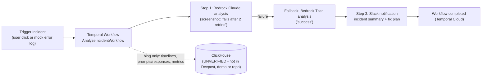

> Imported historical/advisory research. This is not current build authority; follow the ScopeWatch architecture/contracts and START_HERE. Original research date and qualifications remain below.

# IncidentLogica: ClickHouse 2nd place at the MCP AWS Enterprise Agents Challenge (25 Jul 2025)

> **Current execution policy:** [Start now or anytime, with no build cutoff](../../../../../event/BUILD_AUTHORIZATION.md). The human reports that the event is already underway and public schedules are stale. Older start/deadline/duration advice below is superseded; historical timestamps and analytics windows remain evidence, not build gates.

> Analyst: ClickHouse Team A. Read-only analysis, 8 Oct 2026.
> Evidence labels: **[V]** = verified (file:line, URL, timestamp); **[I]** = inference.
> **Headline finding: there is no evidence that ClickHouse was used.** ClickHouse is absent from the Devpost "Built With" list, the Devpost story, the demo narration and the only related repository we could locate. The sole source for ClickHouse usage is one bullet in the sponsor's blog, published about 4 months after the event.

## 1. Snapshot

| Field | Value |
|---|---|
| Event | MCP AWS Enterprise Agents Challenge, San Francisco ("AWS MCP Hackathon", two days per the blog) |
| Date | 2025-07-25 |
| Award | **ClickHouse 2nd place, confirmed by the sponsor** under the blog heading "Second Place - AI Ops Agent", which links to this Devpost page **[V]** (https://clickhouse.com/blog/aws-mcp-hackathon-san-francisco, published 20 Nov 2025). `data/winners.json` labels the category "Most fun use of ClickHouse" |
| Team | 3 people introduce themselves in the demo: "I am Ahmed", "I'm Ryuzo", "I'm Oliver" (0:01-0:07) **[V]**. On Devpost, Ahmet Dedeler (`ahmet-dedeler`) started the project and Ryuzo Kijima (`ryuzo`) liked it. Oliver matches GitHub user `oliverrr123` (Oliver Cingl) **[I]** |
| Devpost | https://devpost.com/software/incidentlogica. Built With: **amazon-web-services, bedrock, claude, temporal**. **ClickHouse is not listed** **[V]** |
| Repo | **None linked.** The nearest candidate is `oliverrr123/aws-hackathon` (see §7), an unmodified copy of `temporal-community/temporal-ai-agent` that contains no team code |
| Demo | https://www.youtube.com/watch?v=zzqxzkcJOjk. "IncidentLogica Demo", 130 s, uploaded 2025-07-26 by "Ryuzo" **[V]**. The video file returned 403 to yt-dlp. Auto-captions were retrieved, and Devpost has 2 screenshots |
| Hosted app | None |

## 2. What it is

The Devpost pitch is an "AI Ops Agent that never fails, even when APIs do." When a service incident fires, a Temporal workflow calls AWS Bedrock (Claude) to analyze the incident, explain the root cause and propose mitigation. If the model call fails, Temporal retries or falls back to another model (Titan). The agent then posts a summary and action plan to Slack. Devpost calls it an "AI incident commander" **[V]**. The target user is an SRE or on-call team. **However, the demo shows a trip-planning chatbot** that falls back between models and reports errors to Slack. That is the reliability pattern applied to a sample agent, not incident analysis (§6).

## 3. Architecture

**No team source code is available**, so no diagram can be drawn from code. The diagram below shows the architecture as Devpost, the blog and the Devpost screenshot "AI Ops Agent – Powered by Temporal + Bedrock" describe it. **It is not verified in code.** The ClickHouse node comes from the blog only.

What the demo and the Temporal screenshot actually show **[V]**: the Temporal Cloud namespace `hackathon.t3jwk` running `agent-workflow` of type **`AgentGoalWorkflow`** on task queue `agent-task-queue`, started **2025-07-25 23:19:55 UTC**, with 144 history events. Its input `agent_goal` is **"Australia and New Zealand Event Flight Booking"**. That is the stock goal from the open-source `temporal-ai-agent` sample (`goals/travel.py:55-58`, `agent_name="Australia and New Zealand Event Flight Booking"`). A React chat front end is shared across devices, and Slack receives error reports.

## 4. ClickHouse usage deep-dive

- **Code evidence: none.** No team repository exists. The candidate repo `oliverrr123/aws-hackathon` has zero matches for `clickhouse` (`grep -rli clickhouse`), and also none for `bedrock` or `slack` (only `poetry.lock` mentions slack) **[V]**.
- **Devpost evidence: none.** ClickHouse is missing from Built With and the story text **[V]**.
- **Demo evidence: none.** ClickHouse is never mentioned in the 130 s narration. The closest line is "whenever the agent takes an action we log that" (1:04-1:06), with no destination named **[V]**.
- **Sponsor claim (the only source):** "**ClickHouse** for storing incident timelines, prompts/responses, and metrics for post‑mortems" (blog, "Architecture at a glance") **[V that the blog says it]**.

**Depth rating: unverifiable, likely decorative or absent [I].** If the blog bullet is accurate, the use was an append-only log of LLM exchanges and incident events. The blog's cross-team takeaway, "Observability by default: Storing prompts, traces, and metrics made it easy to explain model behavior," is probably generalized from this entry and GlucoTrack.

**Other sponsors used** **[V]**: Temporal (Cloud plus local; this is the core of the pitch), AWS Bedrock (Claude, with fallback to Titan per the narration), and a Slack integration. The event's MCP theme is not visible in the demo (upstream `temporal-ai-agent` does support MCP tools).

## 5. Claimed vs. real

| Claim | Evidence |
|---|---|
| "AI incident commander" that analyzes incidents and root causes | The demo shows a **trip-planning chatbot** ("helps you basically plan your trips to any country at any date", 0:26-0:34). The Temporal screenshot shows the stock flight-booking goal. **No incident analysis is shown** **[V]** |
| Bedrock Claude → Titan fallback | Narrated at 1:10-1:19 ("we use Claude first and then we use Titan"). The diagram screenshot depicts it. Not verifiable in code. Upstream uses LiteLLM (`activities/tool_activities.py:9`, default `LLM_MODEL=openai/gpt-4o` in `.env.example:4`), which can route to Bedrock **[V/I]** |
| Slack summaries | Narrated at 0:52-0:58 and 1:45-1:55. Not shown in the captions, and no code found **[V narration only]** |
| ClickHouse stores timelines, prompts and metrics | Blog only (§4) |
| Multi-device shared chat | Narrated at 1:22-1:34, "made possible by Temporal". Plausibly the upstream sample's behavior with a shared workflow ID **[I]** |
| Partial build | The team admitted it. The blog says "Challenge: Presenting a partial build while conveying the full vision", "Advice: 'Fake it till you make it - how you tell the story matters'" **[V]** |

## 6. Demo analysis

The demo is 130 s of three people talking over a running app. It has no scripted hook. Transcript from auto-captions **[V]**:

| Time | Content |
|---|---|
| 0:01-0:07 | Introductions: "we are team Incident Logica. I am Ahmed / I'm Ryuzo / I'm Oliver" |
| 0:07-0:22 | One-line pitch: "an agent that uses Temporal with AWS Bedrock to analyze the data and if something fails, we use it to have a fallback to never have downtime" |
| 0:26-0:34 | Oliver: "we have like a chatbot which helps you plan your trips to any country at any date" |
| 0:34-0:52 | **Core moment**: "if some model is unavailable it automatically falls back to another one, and if… no model is available, then it sends a report to Slack so somebody can look at it and implement a fix" |
| 1:00-1:19 | "we use Temporal both locally and on the Temporal Cloud and whenever the agent takes an action we log that… if something fails, we use Claude first and then we use Titan" |
| 1:22-1:39 | Multi-device: "if he sends a message there, I can see it on my end… multi-person chat" |
| 1:41-1:44 | "Is there anything else to say?" "Probably not." |
| 1:45-1:55 | Slack integration: "whenever there's an error or some event happens, the bot comments about that and shares the data" |
| 1:59-2:09 | "we were team, what was our name?… we came up with it last minute… thank you" |

**Sponsor moment for ClickHouse: none.** The sponsor tech on screen and in the narration is Temporal and Bedrock. The "wow" is the reliability claim (automatic model fallback, never down) plus the live Temporal Cloud dashboard, a ~58-minute running workflow with 144 events (Devpost screenshot). The delivery is informal and unpolished.

## 7. Build timeline

**No team commits exist anywhere we searched.** Searches run **[V]**:
- `gh search repos incidentlogica` / `"incident logica"`: no results. `gh search code IncidentLogica`: only a ClickHouse-blog knowledge-base chunk (`olyannaa/clickadvisor`) and unrelated "IncidentLogicalName" hits.
- `gh search repos "temporal bedrock slack"` (created 2025-07-20..08-05) and `incident` (created 2025-07-24..28): nothing attributable to the team.
- Member accounts: `ryuzo-k` (Ryuzo Kijima, account created 2025-07-23; repos from August 2025 are unrelated) and `ryuzokijima` (a "me" repo only). `ahmet-dedeler`'s repo list (`type=all`) includes **`oliverrr123/aws-hackathon`**, created **2025-07-25T20:04Z** and last pushed **2025-07-25T23:24Z**, which is event day. The Temporal run start of 23:19 UTC falls inside that window.
- Inspecting `oliverrr123/aws-hackathon` (shallow-cloned to scratch, read-only): **310 commits, all upstream**. The newest is `4ed4efb 2025-07-22 Simon Emms "chore: add support for devcontainers (#50)"`. Every author is a Temporal maintainer (Steve Androulakis, Mason Egger and others). It is not a GitHub fork (`fork=false`). It is a re-push of the upstream sample, about 8.2k lines of py/js/jsx. **No IncidentLogica-specific code, and no ClickHouse, Bedrock or Slack code.**

**[I]** The team started from the `temporal-ai-agent` sample, ran its stock travel goal on Temporal Cloud, and added model fallback and Slack reporting locally, but never pushed those changes. Effectively the whole visible system was prebuilt by Temporal. Identity confidence that this repo is the team's base is **medium-high**: there is a member link, the date matches, the demo describes a trip planner, and the Temporal screenshot shows the exact stock goal name.

## 8. Why it won (analysis)

Inference throughout. Weigh this precedent lightly.

1. **Few ClickHouse-eligible entries.** ClickHouse's event recap features only three projects (two winners plus a GlucoTrack spotlight). A 2nd-place prize going to an entry with no shown ClickHouse use suggests the field of ClickHouse entries was thin **[I]**.
2. **A reliability and observability story that fit the sponsor's narrative.** The blog lists "Orchestration matters: Temporal gave reliability superpowers" and "Observability by default: storing prompts, traces, and metrics" as cross-team themes. The blog describes IncidentLogica's ClickHouse role as exactly that post-mortem store **[V blog]**. The team may have pitched ClickHouse verbally at judging, which the recorded demo wouldn't capture **[I]**.
3. **Storytelling over build.** The team's own advice, as quoted by the sponsor, was "Fake it till you make it - how you tell the story matters" **[V]**. The judges appear to have rewarded the vision (incident commander, never down) despite a partial build.
4. **A live, verifiably running Temporal Cloud workflow** made the reliability claim concrete **[V screenshot]**.

## 9. Weaknesses

- No verifiable ClickHouse usage at all. Any entry with real ClickHouse queries on screen should beat this.
- The demo contradicts the pitch: a trip chatbot, not incident response. There is no root-cause analysis and no incident data.
- No repo. The visible code is 100% upstream sample code.
- The team forgot its own name in the demo (1:59). The narration is unscripted.
- For a stronger competitor in the Cyberdefense setting, this is the cautionary half of the pattern. It also shows the bar for ClickHouse placements can be low when the field is thin.

## 10. Steal-this (for the Cyberdefense entry)

1. **Durable incident-response loop.** Wrap LLM triage steps in a durable workflow with retries and model fallback, and put the escalation (Slack) in the graph. Then **actually** write every step to ClickHouse: an `incident_events` table (`MergeTree ORDER BY (incident_id, ts)`) holding prompt, response, model, latency, retry count and outcome. That gives you the post-mortem timeline that IncidentLogica only claimed.
2. **Show the failure path live.** Kill the primary model or API on stage, show the fallback firing, then run a ClickHouse query listing the incident timeline including the failed attempt. That turns "never fails" into evidence.
3. **Name the sponsor out loud, on screen.** IncidentLogica's recording never says "ClickHouse." Don't rely on judges inferring it.
4. **The cautionary lesson:** a partial build with a strong story placed 2nd. Story matters, but don't copy the gap between pitch and demo. Make the thing you demo the thing you pitch.
