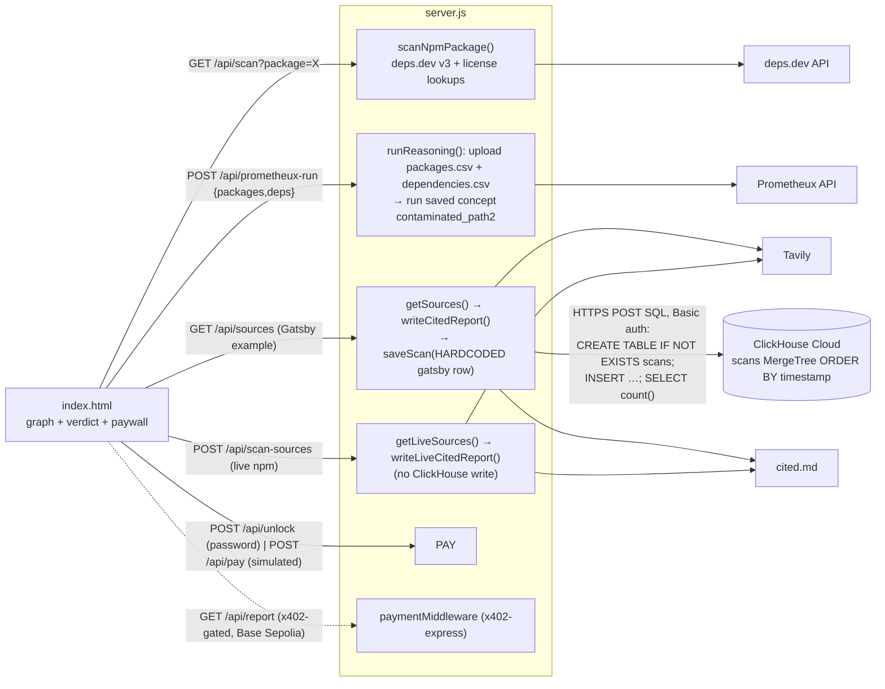

> Imported historical/advisory research. This is not current build authority; follow the ScopeWatch architecture/contracts and START_HERE. Original research date and qualifications remain below.

# LicenseTrace — ClickHouse Team B analysis

> **Current execution policy:** [Start now or anytime, with no build cutoff](../../../../../event/BUILD_AUTHORIZATION.md). The human reports that the event is already underway and public schedules are stale. Older start/deadline/duration advice below is superseded; historical timestamps and analytics windows remain evidence, not build gates.

## 1. Snapshot

| Field | Value | Evidence |
|---|---|---|
| Event | Multiagents Hackathon London (tokens&), Tessl, 210 Pentonville Rd | https://multiagents-hackathon.devpost.com/ |
| Date | Fri 26 June 2026 (kickoff 10:00, submission deadline 4:30 PM BST); 82 participants; "Projects must be built during the event. Maximum team size of 3" | Devpost (verified) |
| Award | Best Use of ClickHouse, category winner. Rank **unconfirmed** (two winners) | `data/winners.json`; https://devpost.com/software/licensetrace |
| Prize text (verified) | "Best Use of ClickHouse — £1,000 in cash — 2 winners. 1st place: $1,000 gift card (USD) + $500 ClickHouse Cloud credits. 2nd place: $300 ClickHouse Cloud credits." | multiagents-hackathon.devpost.com |
| Judging criteria (verified) | Idea, Technical Implementation, Tool Use, Presentation, Autonomy ("How well does the agent act on real-time data without manual intervention?"), unweighted on this page | Devpost |
| Repo | https://github.com/Welddevelopment/Tokens-Hackathon---Codebase-Dependencies-Scanner (`repos/clickhouse/licensetrace`) | |
| Demo | https://www.youtube.com/watch?v=trJ8B1QgfKE — "License Trace prevents copyleft dependency contamination", **206 s**, uploader Joel Jeon | yt-dlp |
| Hosted app | none (`node server.js` → localhost:3000) | README |
| Team | **Solo** ("I built", Devpost; `CLAUDE.md:1` "hackathon, solo, ~6h"); Joel (Welddevelopment / Joel Jeon). Self-described beginner (`CLAUDE.md:19` "I'm a beginner; explain what things do") | |

## 2. What it is

A software-supply-chain license scanner. Given an npm package, it builds the transitive dependency graph, finds copyleft (GPL/AGPL) packages buried deep in the tree, and **proves the reachability path** from the root to the offender ("gatsby → … → smartwrap (GPL-2.0)"). Reasoning runs on Prometheux (a Datalog/Vadalog-style reasoning engine). Tavily fetches live citations, a `cited.md` report is written, and the full report is paywalled (dev password or x402). ClickHouse "logs every scan". The pitch is grounded in a real incident (the Gatsby/smartwrap build break documented by Goldman Sachs Engineering) and in lawsuits (Orange, Panasonic).

## 3. Architecture (as found in code)

Node.js (built-ins + `x402-express` only) server `server.js` (691 lines). Single-page UI `index.html` (1,009 lines, inline SVG graph). External services: deps.dev, Prometheux REST, Tavily, ClickHouse Cloud HTTPS, the x402 facilitator (Base Sepolia).



## 4. ClickHouse usage deep-dive

**Depth rating: decorative. One hardcoded audit row per Gatsby demo run; live scans never touch ClickHouse.**

| Feature | File:line | Notes |
|---|---|---|
| Raw HTTPS interface, no client lib | `server.js:198-231` | POSTs SQL as the body to `https://{host}:8443/` with Basic auth |
| Table DDL on every save | `server.js:242-245` | `CREATE TABLE IF NOT EXISTS scans (timestamp DateTime, root_package String, contaminated UInt8, copyleft_package String, path String) ENGINE = MergeTree ORDER BY timestamp` |
| Insert via string-concatenated SQL | `server.js:248-251` | hand-escaped `'` and `\` (`server.js:240`), no parameters |
| Row-count confirmation | `server.js:254-255` | `SELECT count() FROM scans`, logged to the terminal |
| Fail-open | `server.js:233-259` | any error is logged and "scan continues" |
| **Only call site** | `server.js:622-640` (`/api/sources`) | `saveScan({ root: "gatsby", contaminated: 1, copyleft: "smartwrap", path: "gatsby → gatsby-recipes → … → smartwrap" })`, a **hardcoded literal**, not the computed result |
| Live npm scans | `server.js:521-541` (`/api/scan`), `:604-620` (`/api/scan-sources`) | **no** `saveScan` call (verified: `grep saveScan` → only `server.js:233, 627`) |

```js
// server.js:625-632
writeCitedReport(sources);   // write cited.md from the live URLs
// store this scan in ClickHouse (never throws — failures are logged)
await saveScan({
  root: "gatsby", contaminated: 1, copyleft: "smartwrap",
  path: "gatsby → gatsby-recipes → graphql-tools-schema → value-or-promise → to-readable-stream → smartwrap",
});
```

ClickHouse is never read back for any user-facing feature: no history view, no trend, no dedup, no MV.

**Other sponsors.** Prometheux is load-bearing for the "reasoning" story: CSV upload to `api/v1/data/files/upload` plus a run of the saved concept `api/v1/concepts/9e354b7f44/run/contaminated_path2` (`server.js:406-504`); the rule itself lives in the Prometheux cloud and is not in the repo. Tavily is real and live (`server.js:38-103, 137-156`). deps.dev is real (`server.js:308-404`).

## 5. Claimed vs. real

| Claim | Reality |
|---|---|
| Demo 2:55–3:02: "every single finding in license trace is grounded in real sources fetched live with tavily and logged in click house" | Only the Gatsby example writes to ClickHouse, and it writes a constant row. Live findings (node-jose, express) are not logged |
| README:18 "Stores every scan for audit/monitoring" | False for live scans (see above) |
| Devpost "ClickHouse logs every scan" | Same |
| "Prometheux derives and proves that path live" | The Prometheux call is real for both the example and live scans (commits `5a53fc1`, `85e0720`). But `index.html:352-375` still contains a `KNOWN_GATSBY_RESULT` stub with a simulated 550 ms delay ("STUB: hardcoded known answer for gatsby"), and `deriveContamination()` is a local fallback. Which path ran in the video cannot be determined from the transcript |
| x402 "agentic payment pathway" (demo 1:39–1:44) | `/api/pay` is **simulated**: "Always 'settles' … so the payment rail looks live on stage" and it returns a random fake `txHash` (`server.js:560-576`; commit `8dbca03` "Make x402 agent payment look live (demo-simulated settlement)"). A real x402 route exists at `GET /api/report` (`server.js:665-680`, commit `684be84`), but the video unlocks "using a password" (1:51) |
| "Doesn't just panic at the word GPL" (node-jose demo 2:13–2:30) | `isCopyleft()` (`index.html:327-332`) returns false for any license containing "or": `if(/\bor\b/i.test(l)) return false; // dual option, or "-or-later"`. That correctly ignores dual licenses, but it **also silently excludes `GPL-2.0-or-later` / `GPL-3.0-or-later` / `AGPL-3.0-or-later`**, which are fully copyleft. This is a false-negative bug in a security-adjacent tool. Server-side `isCopyleft` is the opposite, a naive `/GPL/i` (`server.js:274`), so client and server disagree |
| Gatsby chain is the real incident path | The demo graph is a curated 13-package CSV (`packages.csv`, `dependencies.csv`). Names such as `graphql-tools-schema` do not look like real npm package names (inference; not verified against the npm registry) |

## 6. Demo analysis (206 s, auto-captions)

| Time | Beat | Content |
|---|---|---|
| 0:00–0:28 | Hook / problem | "you ship … hundreds of open source packages. You chose maybe 10, 20 … some carry massive copyleft licenses, GPL, AGPL that can legally force your entire project open source" |
| 0:30–1:01 | Real-world stakes | "Teams using Gatsby suddenly had their entire project break overnight because of a tiny GPL package … five layers deep … Goldman Sachs documented … Orange recently paid over €900,000 … Panasonic's facing a multi-million dollar suit" |
| 1:03–1:25 | Live run 1 ("wow") | "every single dependency hop, however deep … Gatsby five layers down to smart[wrap] GPL 2.0. This is the exact contamination path" (red path animation) |
| 1:28–2:05 | Monetization | "works even on free plan … pay for the full cited report … X402 agentic payment … unlock it using a password … see every single source" |
| 2:06–2:30 | Live run 2 (nuance) | "more than a dumb GPL detector … node.js[e] … has GPL … in Node Forge, but it's not flagged because it's completely legal" |
| 2:33–2:46 | Live run 3 (negative control) | "Express … completely clean. Most of them are" |
| 2:48–3:22 | Close + sponsors | "grounded in real sources fetched live with tavily and **logged in click house** (3:02) and the power behind it prometheus [Prometheux]" |

ClickHouse appears once, at 3:02, as a one-clause mention. The "wow" is the red path animation plus the real-incident grounding. The demo uses a strong three-case structure (positive, tricky negative, clean negative).

## 7. Build timeline

19 commits, all on 2026-06-26 (BST): `c796245` 11:04 initial, `25a8588` **12:30** "Add license contamination scanner: UI, Tavily sourcing, cited.md, ClickHouse" (ClickHouse wired in the first real commit), `78c3263` 12:51 live deps.dev, `5a53fc1` 14:05 live Prometheux, `0d4216a` 14:41 paywall, `8dbca03` 15:38 simulated x402, `684be84` 15:54 real x402, `1c08cb3` 15:59 strict copyleft. Nothing was committed after the deadline. ~1.7k lines of code. Built with Claude (`CLAUDE.md` is the agent brief). No evidence of prebuilt code.

## 8. Why it won (ranked, inference)

1. **Thin competition.** 82 participants and two ClickHouse slots; ClickHouse was one of ten listed backers. A clean, working, well-told project with *any* honest ClickHouse use may have been enough. The prior research's note stands: "A simple audit trail can add sponsor value even when another tool performs the main reasoning."
2. **Excellent storytelling and real-world grounding** (a named incident, court cases, three test cases), which scores on Idea and Presentation.
3. **A security/compliance audit framing** where "log every scan to an analytics store for audit/monitoring" is a natural ClickHouse narrative, even if barely implemented.
4. **Visible end-to-end live system** (deps.dev, Prometheux, Tavily, report, payment) built solo.
5. The judges likely did not inspect `server.js` closely enough to notice the constant row (inference).

## 9. Weaknesses

- ClickHouse is decorative: a constant row, never read back, absent from live scans.
- Simulated payment with a fake tx hash; password unlock in the video.
- The copyleft rule misses `-or-later` licenses, and client and server disagree.
- The demo graph is curated, the reasoning rules are hidden in a SaaS concept, and the stub path remains in the client.
- SQL built by string concatenation (fine for a demo, but a security-hackathon judge would flag it).

## 10. Steal-this (high relevance for Cyberdefense; this is the most security-adjacent winner)

1. **Path-proof framing.** "Not *what* is vulnerable, but *how* it reaches you." For Cyberdefense: prove the reachability chain from an internet-exposed service → vulnerable dependency → sink (pairs naturally with Semgrep findings). Animate the path in red.
2. **The three-case demo**: a true positive, a tricky "looks bad but isn't" case (dual license ≈ an unreachable vulnerable function), and a clean negative control. It shows precision, not just recall.
3. **Ground stakes in a named real incident** in the first 60 seconds.
4. **Do the ClickHouse part properly where LicenseTrace didn't.** Store every scan and finding (`scans`, `findings`, `paths` with `Array(String)`), then *read them back*: "new since last scan" diffs, a time-to-remediate MV, and org-wide "which repos reach package X" queries. That turns their decorative log into a load-bearing feature.
5. Use parameterized ClickHouse queries (`{name:Type}`) rather than string-escaped SQL; security judges notice.
6. Correct the license/vuln rule edge cases (`-or-later`), since a security tool with a false-negative bug is a liability if a judge spots it.
