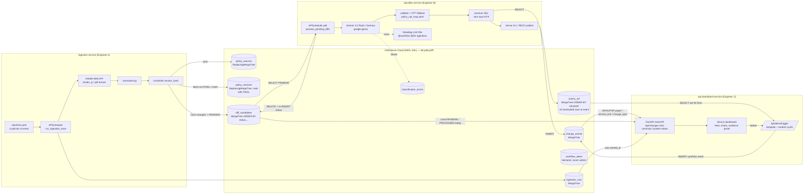

> Imported historical/advisory research. This is not current build authority; follow the ScopeWatch architecture/contracts and START_HERE. Original research date and qualifications remain below.

# policyDiff — ClickHouse category winner, Agentic Engineering Hack (23 May 2026)

Analyst: ClickHouse Team A. Sources read: repo `repos/clickhouse/policydiff` (HEAD `b07bab2`, 46 commits), Devpost page, YouTube demo auto-transcript, hosted-app landing page. Evidence labels: **[V]** = verified (file:line / URL / timestamp), **[I]** = inference.

---

## 1. Snapshot

| Field | Value |
|---|---|
| Event | Agentic Engineering Hack, NYC (https://luma.com/nycagenthack), **2026-05-23** (one-day; all hack commits fall 12:01–17:23 EDT that day) [V] |
| Award | ClickHouse category winner — **verified** by Devpost structured award badge (per `data/winners.json`). **1st place is creator-reported only** (LinkedIn post). [V] |
| Rank evidence | LinkedIn post https://www.linkedin.com/posts/manojsadanala_hackathon-ai-healthcareai-activity-7465811469213892609-FtEk — **inaccessible** to us (Firecrawl refuses LinkedIn). No ClickHouse blog/commentary for this event was located. Treat "1st" as unverified. |
| Repo | https://github.com/manoj1749/policyDiff (no LICENSE file) [V] |
| Demo | https://www.youtube.com/watch?v=EMDqxOE8Fto — "PolicyDiff - Real-time payer policy intelligence for proactive denial prevention.", **119 s**, uploaded 2026-05-25, channel Manoj Sadanala [V] |
| Hosted app | https://policy-diff-x3bo.vercel.app — on 2026-10-08 renders the dashboard shell with **$0 revenue at risk, 0 changes classified**, "Run the demo trigger or wait for the next live ingestion cycle." (empty DB or backend down) [V] |
| Team | 3 engineers per Devpost ("built in parallel by three engineers"). Git authors: Manoj Parasuram Sadanala (classifier + integration, majority of commits), Yashwanth Kasanneni (ingestion service, dashboard UI), Kumar Saurabh (dashboard initial commit) [V: `git log`] |

---

## 2. What it is

A payer-policy change monitor for hospital revenue-cycle teams. Insurers (UHC, Aetna, Cigna, Humana) silently revise clinical policy bulletins and prior-auth criteria; billing teams find out only after claims get denied. policyDiff scrapes those policy documents on a schedule, hashes each normalized version, and when the hash changes it asks an LLM to classify the change (TIGHTENING / LOOSENING / SCOPE_CHANGE / STYLISTIC), extract the changed clause and affected CPT billing codes, then joins those CPT codes against a claims reference table to put a **dollar figure ("annualized revenue at risk")** on the change. A dashboard shows a feed of changes with revenue breakdowns by payer, service line and change type, plus a markdown "evidence brief". The user is a hospital billing/coding or revenue-integrity analyst.

---

## 3. Architecture

Three independently deployable Python services that **never import each other — they communicate only through shared ClickHouse tables** (stated design rule, `context/README_Engineer_A_Ingestion_Diff_Service_v2.md:98`: "The services communicate through ClickHouse tables and API calls, not direct Python imports across services.") [V]

- **ingestion-service** (Python, APScheduler): Nimble Web API scrape (HTML w/ JS render, PDF) → normalize → xxhash64 → `policy_versions` / `diff_candidates` / `ingestion_runs`.
- **classifier-service** (FastAPI + APScheduler; later Railway cron): polls `diff_candidates WHERE status='PENDING'` → Gemini/Gemma via `google-genai` (Datadog LLM Obs `@llm`/`@workflow`) → revenue SQL on `claims_ref` → Senso publish (CLI then REST fallback) → `change_events` insert → status flip via DELETE+INSERT.
- **api-dashboard-service**: FastAPI backend (read-only aggregations on `change_events`) + Next.js 14 frontend; a "Trigger Demo" endpoint that **synthesizes** a change event (see §5); optional x402 PDF export and Luminai webhook (both off by default).
- Infra: `docker-compose.yml` runs `clickhouse/clickhouse-server:latest` locally with `infra/clickhouse/*.sql` mounted as init scripts (`docker-compose.yml:15-23`); at the event the team moved to **ClickHouse Cloud on AWS with SSL** (commits `6504d4c`, `16deb4b`, 14:22–14:38).



Other sponsor/partner tech used: **Nimble** (scraping, load-bearing in the real pipeline), **Gemini** (classification), **Datadog LLM Observability** (tracing), **Senso / cited.md** (evidence brief publishing — returned empty URLs at event per Devpost "Senso REST API returned 404"), **x402** and **Luminai** (stub/optional, disabled by default; not in Devpost "Built With").

---

## 4. Sponsor usage deep-dive — ClickHouse

**Depth rating: load-bearing (bordering core-to-the-pitch for the architecture, but not for the demo).** ClickHouse is the *only* integration bus between the three services and the only place revenue numbers come from. Remove it and nothing works. But the engine features used are basic OLTP-style patterns on small tables; there is no streaming, no MV, no TTL, no projection, no vector search, no analytical workload where ClickHouse's speed matters [I].

### 4.1 Schema (DDL) — `infra/clickhouse/`

| Table | Engine / key | File:line | Notes |
|---|---|---|---|
| `policy_sources` | `ReplacingMergeTree(updated_at)` `ORDER BY (payer, policy_id)` | `001_ingestion_schema.sql:8-22` | upsert-by-insert of the watchlist; `Array(String)` for CPT codes |
| `policy_versions` | `ReplacingMergeTree(fetched_at)` `ORDER BY (payer, policy_id, version_hash)` | `001_ingestion_schema.sql:24-39` | every scraped version; `version_hash UInt64` (xxhash64) |
| `diff_candidates` | `MergeTree()` `ORDER BY (status, created_at, payer, policy_id)` | `001_ingestion_schema.sql:41-61` | work queue; `diff_id UUID DEFAULT generateUUIDv4()`, `status DEFAULT 'PENDING'` — **status in sort key** caused their main ClickHouse pain (below) |
| `ingestion_runs` | `MergeTree()` `ORDER BY (started_at, status)` | `001_ingestion_schema.sql:63-76` | run audit log |
| `claims_ref` | `MergeTree()` `ORDER BY (cpt, payer)` | `002_classifier_schema.sql:7-16` | reimbursement reference for $ impact |
| `change_events` | `MergeTree()` `ORDER BY (created_at, payer, policy_id, change_type)` | `002_classifier_schema.sql:19-43` | final product table; stores LLM fields, `cpt_codes_affected Array(String)`, `revenue_at_risk_usd Float64`, `datadog_trace_id` |
| `classification_errors` | `MergeTree()` `ORDER BY (created_at, error_stage)` | `002_classifier_schema.sql:46-57` | LLM failure log |
| `workflow_alerts` | `MergeTree()` | `003_dashboard_schema.sql:12-23` | **declared but never written** by any code (grep finds no writer) [V] |

Not used anywhere: materialized views, Kafka/S3 engines, TTL, projections, `LowCardinality`, partitions, codecs, AggregatingMergeTree, vector/ANN indexes, ClickHouse MCP server [V by grep]. The team's own spec explicitly deferred an MV: "In production, we would avoid excessive `FINAL` on very large tables and instead maintain a latest-version materialized view." (`context/README_Engineer_A_Ingestion_Diff_Service_v2.md:283`) [V].

### 4.2 Queries and access code

Client everywhere is `clickhouse_connect` over HTTP(S) (`secure`/`verify` flags added for Cloud).

- **Latest version lookup with FINAL** — `services/ingestion-service/app/clickhouse_repo.py:75-89`:
  ```sql
  SELECT ... FROM {db}.policy_versions FINAL
  WHERE payer = %(payer)s AND policy_id = %(policy_id)s
  ORDER BY fetched_at DESC LIMIT 1
  ```
  Used by `scheduler.py:63` to decide NO_CHANGE vs DIFF_CREATED (`scheduler.py:87-122`).
- **Work-queue poll** — `services/classifier-service/app/clickhouse_repo.py:35-62`: `WHERE status = 'PENDING' ORDER BY created_at ASC LIMIT {batch}`.
- **Revenue at risk (the money number)** — `services/classifier-service/app/clickhouse_repo.py:124-139`:
  ```python
  codes_csv = ", ".join(f"'{c}'" for c in cpt_codes)
  query = f"""
      SELECT sum(avg_reimbursement_usd * claim_count_90d * 4) AS revenue
      FROM policydiff.claims_ref
      WHERE cpt IN ({codes_csv})
  """
  ```
  Called from `revenue_impact.py:33` only for TIGHTENING/SCOPE_CHANGE (`revenue_impact.py:13`). Note: `cpt_codes` come from **LLM output** and are string-interpolated, i.e. an injection-shaped pattern (low real risk; but exactly what Semgrep flags) [V code / I risk].
- **Status "update" via DELETE + re-INSERT** — `services/classifier-service/app/clickhouse_repo.py:202-252` (`mark_processed`) and `255-296` (`mark_error`). Docstring: "Cloud ClickHouse blocks ALTER TABLE UPDATE on ORDER BY key columns. We use DELETE + INSERT to simulate an update" (`:205-206`). Uses lightweight `DELETE FROM` (`:227-229`). Devpost "Challenges" confirms: "ClickHouse CANNOT_UPDATE_COLUMN — The initial diff_candidates table had status in the ORDER BY key..." [V].
- **Dashboard aggregations** — `services/api-dashboard-service/backend/app/clickhouse_repo.py`:
  - feed with parameterized filters `{change_type:String}` etc. `:67-133`
  - risk summary: `sum(revenue_at_risk_usd)` + three `GROUP BY` (change_type `:203-207`, service_line `:219-224`, payer `:235-240`)
  - system status: `count()` PENDING, `PROCESSED AND toDate(processed_at) = today()`, `max(started_at)` with a guard for ClickHouse's 1970 epoch on empty aggregates (`:262-312`, comment at `:277`).
- **Idempotent seed** — `seed_claims_ref_if_empty()` `services/classifier-service/app/clickhouse_repo.py:95-121` (added post-event, see §7).

### 4.3 Depth verdict

| Feature | Present | Depth |
|---|---|---|
| MergeTree / ReplacingMergeTree with deliberate sort keys | yes | load-bearing |
| `FINAL` dedupe read | yes | load-bearing (diff detection) |
| ClickHouse as cross-service queue/state bus | yes | core to architecture |
| SQL join of LLM output → $ (CPT `IN` + sum) | yes | core to the pitch ($792K number) |
| GROUP BY dashboard aggregations | yes | load-bearing for UI |
| Lightweight DELETE mutation | yes | workaround |
| MVs, TTL, streaming ingest, vector search, MCP | no | — |

---

## 5. Claimed vs. real

| Claim (source) | Reality in code | Verdict |
|---|---|---|
| "continuously scrapes policy documents from major payers" (Devpost) | Real Nimble pipeline exists (`nimble_client.py`, `scheduler.py:31-122`). At event, watchlist had **6 policies** (`git show 849221d:.../watchlist.yaml`). Post-event commits disable UHC/Cigna policies "blocked or 404 by upstream" (`404e8a8`, `128ee71`) and "disable 9 failing policies" (`810b89c`). | Real code; live reliability at judging time unknown [I: likely partial] |
| "$792K in annualized revenue risk" for UHC Cardiac MRI CPT 75561 (Devpost) | At event, `claims_ref` was seeded from a **hardcoded 10-row list**; row `("75561","Cardiology",2200.0,90,"UHC")` (`git show 849221d:services/classifier-service/scripts/seed_claims_ref.py`). 2200 × 90 × 4 = **792,000**. The headline number is a hand-typed reference value × 4. | Arithmetic real; input data illustrative [V] |
| "Gemini classifies the change at 0.98 confidence" (Devpost) | Real Gemini call path (`gemini_client.py:25-61`, `classifier.py:99-115`). The demo diff used for this is a seeded synthetic UHC policy text (`services/classifier-service/scripts/seed_demo_diff.py` OLD_TEXT/NEW_TEXT adding a stress-test requirement). | Real LLM over **synthetic** diff [V] |
| Dashboard "Trigger Demo" shows a new policy change being detected | `/api/demo/trigger` → `demo_trigger._data_driven_demo()` (`demo_trigger.py:284-430`): picks a **hardcoded scenario template** (`SCENARIO_TEMPLATES`, `:36+`), a random payer from `PAYERS = ["Aetna","Cigna","Humana","BCBS"]` (`:263`), `confidence = round(random.uniform(0.87, 0.97), 2)` (`:357`), revenue from `claims_ref` or `random.uniform(500_000, 2_500_000)` fallback (`:337`), then inserts directly into `change_events` with `datadog_trace_id="demo-simulated"` (`:398-410`). Docstring: "Smart demo trigger (zero-rate-limit simulation)" (`:2`). **No scrape, no diff, no classifier call** (Gemini optionally rewrites the markdown only). Committed during the hack (`53bc785` 15:08 "zero-rate-limit smart demo"). | **Simulated** [V] |
| "Senso publishing" of evidence briefs | `senso_publisher.py:238-267` tries CLI then REST; Devpost admits REST 404'd and cited.md URLs are "What's next". Dashboard falls back to inline markdown. | Mostly not working at event [V Devpost] |
| "Full observability — every Gemini call traced in Datadog" | `@llm` on `call_gemini` (`gemini_client.py:25`), `@workflow` on `process_pending_diffs` (`main.py:133`); agentless init. Note `datadog_trace_id` column is always written as `""` (`main.py:104`) or `"demo-simulated"`. | Real tracing; trace-ID linkage stub [V] |
| x402 payment export, Luminai routing | Endpoints exist but default-disabled (`x402_optional.py:20`, `luminai_optional.py:21`); `workflow_alerts` never written. Devpost lists them as "What's next". | Stub [V] |
| "All three services share a cloud ClickHouse instance on AWS" | Consistent with SSL commits `6504d4c`/`16deb4b` and `secure/verify` client args. | Plausible [V code] |

Credentials: only `.env.example` is tracked (`git ls-files`); no live secrets observed in tracked source in this pass [V, shallow check].

---

## 6. Demo analysis (YouTube, 119 s)

Transcript is YouTube auto-captions; a single speaker narrating a screen recording of the dashboard. Visuals not inspected frame-by-frame — the breakdown below is from audio only.

| Time | Segment | Content |
|---|---|---|
| 00:00–00:12 | Hook / intro | "This is team policy diff. What we have built is a payer policy change monitor..." |
| 00:12–00:57 | Problem + approach | Monitors insurer policy changes (added/updated/removed), "analyze using the AI models to see how the revenue ... has been affected", change types "tightening, loosening and scope change" |
| 01:00–01:08 | Dashboard tour | Payers ("Humana and all these things"), service lines affected |
| 01:10–01:17 | **Data disclosure** | "here we have the demo datas how these things will be ... based on the changes we have generated" — i.e. the feed shown is generated demo data (matches §5 demo trigger) |
| 01:19–01:53 | Feature walk | Revenue at risk per change, confidence, scope-change vs loosening examples, CPT codes affected |
| 01:55–01:57 | Close | "So this is what we have built. Thank you." |

Observations:
- **ClickHouse is never mentioned by name in the demo audio** [V transcript]. Nor are Nimble, Gemini, Datadog, Senso. The sponsor moment, if any, is implicit (dashboard numbers come from ClickHouse GROUP BYs).
- No live end-to-end run (scrape → diff → classify) is narrated; it is a dashboard tour over generated data.
- "Wow" moment: the dollar figure — "how much revenue is at risk" attached to a specific policy change and CPT codes (01:19–01:53). [I] That single number is the whole pitch.
- Structure: hook → problem → dashboard tour. Missing: live run, sponsor callout, impact close. The video is weak; the win most likely came from the live in-room presentation and Devpost write-up [I].

---

## 7. Build timeline

Commit cadence (`git log --date=iso`, EDT) [V]:

| Window | Commits | What |
|---|---|---|
| 2026-05-23 12:01–12:27 | 2 | Initial commit; `context/` added: three ~620–650-line per-engineer spec READMEs (schemas, contracts, env, acceptance checklists) |
| 13:10–13:49 | 5 | Dashboard initial (Kumar), classifier service w/ Gemini + revenue + Datadog (Manoj, `7153eac`), ingestion service (Yashwanth) |
| 14:22–14:38 | 2 | Move to Cloud ClickHouse SSL; DELETE+reinsert status update; add `recommended_action` column |
| 15:08–15:56 | 11 | **Demo hardening**: "zero-rate-limit smart demo" (`53bc785`), switch to Gemma (1,500 RPD), clear-state, localStorage, UI merge |
| 16:00–17:23 | 7 | Vercel deploy config (3 services), daily cron, feed refresh fix (`849221d` — last event-day commit; treat as judged version) [I] |
| 05-25 → 05-28 | 19 | Post-event: README, Senso setup, Datadog fixes, watchlist expand to 20 then disable 9 failing, **CMS Medicare auto-seed for claims_ref** (`9a86cd7`), two full UI redesigns ("strip AI-slop aesthetics — data-terminal look"), Railway cron |

Size: ~14.1k lines total in tracked text files, of which ~2.6k is `.claude`/`.agents` Senso skill copies, ~1.9k is `context/` specs, ~1.3k CSS, ~0.5k package-lock. Real service code ≈ **4.5–5k lines** Python/TS [V `wc -l`]. `git diff --stat 849221d HEAD` = 19 files, +3,400/−1,802 — mostly UI, README, CMS seeding [V].

What was likely prebuilt [I]: the architecture and full per-engineer specs (`context/*.md`, committed 26 min after start, ~1,900 lines, read like LLM-generated planning docs with acceptance checklists). Code itself appears written during the day (commit sizes and fix cadence consistent with live build, heavy AI-assisted coding likely given CLAUDE.md/skills later).

**Judged version vs. current:** the CMS-backed revenue data, expanded watchlist and redesigned UI all post-date judging. At judging the $ numbers came from 10 hand-entered rows.

---

## 8. Why it won (analysis — all ranked factors are inference unless marked)

No sponsor commentary exists for this event, so we tie to ClickHouse's stated values in its two other recaps.

1. **Agent output turned into a quantified business consequence via a SQL join.** "Policy changed" → "$792K annualized revenue at risk on CPT 75561". ClickHouse recaps praise exactly this loop: "ingest data → store in ClickHouse → compute features → let agents act" and "Streaming → features → actions" (NYC and SF blogs) [V quotes]. Here the LLM output (CPT list) is fed straight back into a ClickHouse aggregate.
2. **ClickHouse is the system's spine, not a sidecar.** Three services, one shared schema, zero direct calls — every hand-off (version store, work queue, results, audit, errors) is a ClickHouse table. Judges reviewing the architecture diagram would see ClickHouse in the middle of everything. Blog value: ClickHouse "became the natural 'source of truth' for events, logs, and metrics" [V quote NYC blog].
3. **Real, painful, monetizable problem with a crisp user** (hospital revenue cycle / prior-auth denials). Matches "Picked a real problem ... Shipped a narrow but usable loop" [V quote NYC blog].
4. **Shows ClickHouse-specific engineering literacy** — ReplacingMergeTree + FINAL for versioning, sort-key design, and a documented war story about `CANNOT_UPDATE_COLUMN` on a sort-key column. Sponsor engineers judging tend to reward teams who hit and solved a real engine constraint [I].
5. **Polished, filterable dashboard that never shows an empty or broken state** during the pitch (the synthetic demo trigger guarantees fresh rows; "zero metrics when cleared" fixes). Matches "Production‑grade UX: React dashboards reading from ClickHouse made analytics feel instantaneous" [V quote SF blog].
6. **Multi-sponsor stack** (Nimble, Gemini, Datadog, Senso, ClickHouse) — likely satisfied event rules and other judges [I].

---

## 9. Weaknesses

- **Demo was simulated.** The in-dashboard "detection" is a template + `random.uniform` insert (`demo_trigger.py:306-410`); the narrator says "demo datas ... we have generated". A competitor showing a real scrape → real diff → real classification live would beat this on credibility.
- **Revenue numbers are hand-typed** at judging (10-row seed); ×4 annualization of a "90-day count" is a heuristic.
- **ClickHouse used as an OLTP queue** — status in the sort key, DELETE+reinsert mutations, `FINAL` reads. Works at hackathon scale; it is an anti-pattern a ClickHouse engineer would notice. No feature that shows *why ClickHouse* (speed on volume, MVs, streaming).
- **Sponsor never named in the video.** Judges relying on the video wouldn't hear "ClickHouse" once.
- **String-interpolated SQL** with LLM-derived values (`classifier-service/app/clickhouse_repo.py:128-133`); `demo_trigger.py:319-325` similarly.
- Dead schema (`workflow_alerts`), stubbed integrations (x402, Luminai), Senso URLs empty, `datadog_trace_id` never populated.
- Hosted app currently shows an empty dashboard (0 events) [V 2026-10-08].
- Rank "1st" is unverified.

---

## 10. Steal-this (for a Cyberdefense entry with ClickHouse / Pi Security / Guild / Semgrep)

1. **"Change → classified → dollar/blast-radius" join.** Our equivalent: detection (e.g. Semgrep finding or new exposed asset) → LLM/rule classification → ClickHouse join against an asset/criticality table → "this finding touches 14 internet-facing services handling PII; risk score X". Make the *last* step a ClickHouse aggregate so the sponsor is in the money shot.
2. **ClickHouse as the inter-agent bus.** Each agent/service writes to its own table and reads the previous stage's table (`diff_candidates` → `change_events`). Gives a free audit trail of every agent hand-off — strong for security/forensics storytelling. But design the queue correctly: **keep `status` out of `ORDER BY`**, or better, model status as append-only event rows (`ReplacingMergeTree(version)` keyed by id) and read latest with `argMax`/`FINAL` — avoid their DELETE+reinsert.
3. **Version-hash diffing with ReplacingMergeTree.** Store each config/policy/scan snapshot with `xxhash64` + `ReplacingMergeTree(fetched_at) ORDER BY (asset, id, hash)`; diff on hash change. Directly reusable for config-drift / attack-surface-change detection. Go one step further than they did: add the "latest version" **materialized view** their own spec deferred (`context/README_Engineer_A...md:283`) — that's a visible ClickHouse-feature win.
4. **Per-engineer contract specs before coding.** Their `context/` files fixed table schemas and status enums up front so three people built in parallel against ClickHouse with no conflicts. Do this Friday morning.
5. **Always-works demo button — but disclose it and still show one real run.** Keep a deterministic seed path so the dashboard is never empty, *and* run one real end-to-end detection live. Say "ClickHouse" out loud at the moment the number appears.
6. **Store LLM errors and traces in ClickHouse** (`classification_errors`, `datadog_trace_id`) — and actually populate the trace ID. Matches ClickHouse's "Observability by default: storing prompts, traces, and metrics" judging value [V SF blog].
7. **Run Semgrep on your own repo before demo** — their f-string `IN (...)` with LLM-derived values is precisely the kind of finding a Semgrep judge would enjoy seeing caught and fixed (parameterize with `{codes:Array(String)}` and `has()`).
