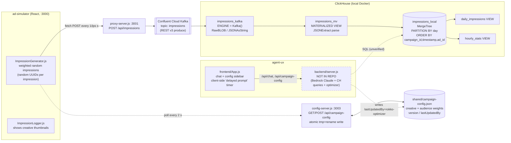

> Imported historical/advisory research. This is not current build authority; follow the ScopeWatch architecture/contracts and START_HERE. Original research date and qualifications remain below.

# Rokko: The Ad Optimizer Agent (ClickHouse, 1st place, AWS MCP Enterprise Agents, 25 Jul 2025)

> Analyst: ClickHouse Team A. Sources read: the full repo at `repos/clickhouse/rokko` (5 commits, not shallow), Devpost page (fetched 8 Oct 2026), ClickHouse blog recap, YouTube auto-transcript (`-NTsy-OQp00`). I could not download the video itself (HTTP 403), so no frame-level visual verification. **[V]** = verified fact with citation. **[I]** = inference.

---

## 1. Snapshot

| Field | Value |
|---|---|
| Event | MCP - AWS - Enterprise Agents Challenge (San Francisco), 25 Jul 2025. ClickHouse blog calls it "two fast-paced days". |
| Award | **First place, ClickHouse prize.** The Devpost badge reads "Winner, **Most fun use of ClickHouse**" **[V]** and the ClickHouse blog heading reads "First Place : Ad Optimizer Agent" **[V]** (https://clickhouse.com/blog/aws-mcp-hackathon-san-francisco). The project **also** won "Best use of Confluent Cloud" **[V, Devpost]**. Evidence strength: **strong** (structured badge plus sponsor confirmation). |
| Team | **Solo.** Jason Kelly is the only Devpost creator **[V]**, and all 5 commits are by Jason Kelly (upwave.com email) **[V, git log]**. |
| Repo | https://github.com/JasonLKelly/awshackjuly2025 |
| Demo | https://www.youtube.com/watch?v=-NTsy-OQp00. The video is titled "Rokko", runs 167 s, was uploaded 2025-07-26 by "jkwa", and has an empty description **[V, yt-dlp]**. |
| Hosted app | None |
| Devpost tagline | "Automatically optimize your ad campaigns with AWS Bedrock, Confluent Cloud and ClickHouse!" |
| Devpost "Built with" | amazon-web-services, bedrock, clickhouse, confluent, node.js, react. There is **no MCP and no Temporal** in that list or in the code. |

## 2. What it is

Rokko is a chat agent for brand advertisers. In the demo the advertiser is an "Oreo Q3" campaign manager. Rokko asks for the campaign name and target audience, then looks at live ad-impression performance and **rewrites the campaign's delivery configuration**: it shifts creative weights toward the best performer and throttles the weak ones. It then keeps re-checking on a timer. There are no real viewers at a hackathon, so a React **ad-impression simulator** generates synthetic impressions. Those impressions flow through **Confluent Cloud Kafka** into **ClickHouse**, the agent reads them from there, and the agent's config changes feed back into the simulator. The problem it targets is the manual, slow work of optimizing a campaign. The user is a marketer who talks to an agent instead of a dashboard.

## 3. Architecture

**Components found in code [V]:**

| Component | Path | Tech | LOC |
|---|---|---|---|
| Ad simulator UI | `ad-simulator/src/*.js` | React 18 (CRA) | about 570 |
| Kafka REST proxy | `ad-simulator/proxy-server.js` (and a near-duplicate, `secure-proxy-server.js`) | Express plus node-fetch to the Confluent REST v3 produce API | 96 / 100 |
| Shared config server | `ad-simulator/config-server.js` | Express, JSON file on disk, atomic temp-file-plus-rename writes | 140 |
| ClickHouse schema | `ad-simulator/setup-clickhouse.sql` plus 9 iteration/fix SQL files | MergeTree, Kafka engine, materialized view, views | about 364 SQL in total |
| ClickHouse runtime | `ad-simulator/docker-compose.yml` | `clickhouse/clickhouse-server:latest` running locally in Docker, **not ClickHouse Cloud** | 21 |
| Agent chat UI | `agent-ux/frontend/src/App.js` | React, axios, react-markdown | 381 |
| **Agent backend (Bedrock, ClickHouse queries, optimizer)** | `agent-ux/backend/` | **MISSING.** The directory contains only `.env.example` (1 line). | 0 |

**Critical finding [V]:** the published repo does **not** contain the agent backend. The README says to `cd agent-ux/backend; npm install; npm start # Runs on port 3002` (`README.md:216-224`), and `agent-ux.md:85-88` lists `backend/server.js` and `package.json`. In the repo, `agent-ux/backend/` holds only `.env.example`, and that file says `OPENAI_API_KEY=your_openai_api_key_here` (`agent-ux/backend/.env.example:1`), even though Bedrock is what the docs claim. The single "Refreshing the repo" commit (b62c3be, 2025-07-25 22:33 PDT) added 70 files and **0** backend source files. Every piece of code that **queries** ClickHouse, calls Bedrock, or runs the optimizer is therefore absent. The frontend calls `/api/chat` and `/api/campaign-config` (`agent-ux/frontend/src/App.js:121, 181, 204`), and those endpoints lived in the unpublished server.

There is indirect evidence that the missing optimizer did exist and wrote config **[V]**. `shared/campaign-config.json:41-43` has `"lastUpdatedBy": "rokko-optimizer"`, `"lastUpdated": "2025-07-26T02:47:24.898Z"` (19:47 PDT on 25 Jul) and `"version": 26`. The string `rokko-optimizer` appears nowhere in the published code: `config-server.js:119` stamps `'ad-simulator'`. So some unpublished process wrote this config 20 or more times on event day. The config also lists creatives `c4.png` and `c5.png`, which matches the Devpost claim that "AI generates new creatives and adds them to rotation" (**[I]**: the new creatives were probably images dropped into `shared/`, which `config-server.js:29-42` auto-detects).

### Real data flow (as found in code, plus the missing backend shown as a dashed box)



## 4. Sponsor usage deep-dive (ClickHouse)

### 4.1 Features used [V]

1. **MergeTree fact table**, `ad-simulator/setup-clickhouse.sql:6-21`:
   ```sql
   CREATE TABLE IF NOT EXISTS impressions_local (
       ad_id UUID, campaign_id UUID, creative_id UUID,
       timestamp DateTime64(3),
       device_type LowCardinality(String), location LowCardinality(String),
       browser LowCardinality(String), gender LowCardinality(String),
       age UInt8,
       partition_date Date MATERIALIZED toDate(timestamp),
       ingestion_time DateTime DEFAULT now()
   ) ENGINE = MergeTree()
   PARTITION BY partition_date
   ORDER BY (campaign_id, timestamp, ad_id)
   SETTINGS index_granularity = 8192;
   ```
   This is reasonable idiomatic ClickHouse: `LowCardinality` dimensions, a `MATERIALIZED` partition column, daily partitions, and a sort key that leads with campaign. A later version switches the IDs to `String` (`impressions-table-strings.sql:4-19`).
2. **Kafka table engine** consuming Confluent Cloud over SASL_SSL/PLAIN, `setup-clickhouse.sql:24-36`, with `kafka_format = 'JSONAsString'`. Later variants use `kafka_format = 'RawBLOB'` and new consumer group names (`kafka-fixed-format.sql:11`, `kafka-fresh-consumer.sql:10-11`, `update-kafka-credentials.sql:13-15`).
3. **Materialized view as the streaming ETL** (Kafka to MergeTree), `setup-clickhouse.sql:39-52`:
   ```sql
   CREATE MATERIALIZED VIEW IF NOT EXISTS impressions_mv TO impressions_local AS
   WITH JSONExtractString(JSONExtractString(raw_message, 'value'), 'data') as impression_data
   SELECT toUUID(JSONExtractString(impression_data, 'adId')) as ad_id, ...
   FROM impressions_kafka WHERE JSONHas(impression_data, 'adId');
   ```
4. **Plain (non-materialized) analytic views**: `daily_impressions` (`setup-clickhouse.sql:55-66`, `count()` and `uniq()` by date × device × location × browser × gender) and `hourly_stats` (`:68-77`, `toStartOfHour`, `uniq`, `avg(age)`). The research report calls these "aggregate views". They are ordinary `CREATE VIEW`s, not AggregatingMergeTree or materialized rollups.
5. **Operational queries**, `ad-simulator/monitor-clickhouse.sh:15-30`: `count()`, last-hour filter `timestamp >= now() - INTERVAL 1 HOUR`, `uniq()`, and a device-type breakdown.
6. **HTTP interface for setup**: `setup.sh:32` pipes the DDL to `curl -X POST http://localhost:8123/`.

**Not used [V, by absence]:** ClickHouse Cloud, any ClickHouse MCP server, TTL, projections, AggregatingMergeTree/SummingMergeTree, vector search, or any client library (no `@clickhouse/client` in either `package.json`).

### 4.2 The debugging trail (good evidence of real, hard-won integration) [V]

There are **9 SQL files** that each re-create `impressions_kafka` and/or `impressions_mv`. Together they record an on-site fight with the Confluent REST envelope.

- The proxy wraps every impression as `{ value: { type: 'JSON', data: JSON.stringify(req.body) } }` (`proxy-server.js:49-54`). The Kafka message value is therefore a **JSON string literal containing JSON**, not an object.
- The first MV assumed a `value.data` object path (`setup-clickhouse.sql:40`). The fixes unwrap the string with `JSONExtract(raw_message, 'String')` (`kafka-fixed-parsing.sql:5`, `update-kafka-credentials.sql:24`).
- `toUUID` failed on non-UUID test IDs such as `"test-123"` (seen in `proxy.log` line 6). One fix pads strings into UUIDs: `reinterpretAsUUID(substring(concat(JSONExtractString(clean_json,'adId'), '0000…'),1,32))` (`kafka-final-fix.sql:7-9`). Another changes the columns to `String` (`impressions-table-strings.sql`).
- The repo also has `rotate-credentials.sh` and `update-kafka-credentials.sql:4-5` (`DROP VIEW … DROP TABLE …`). `proxy.log` contains **102 HTTP 401** responses, consistent with a mid-hack credential rotation, and **8 HTTP 429** rate-limit responses.

**[I]** README step 1 runs `setup-clickhouse.sql` followed by `kafka-new-credentials.sql`. The final working combination was most likely the String-ID table plus RawBLOB and the `JSONExtract(raw_message,'String')` MV, but the repo does not record which files were actually applied.

### 4.3 Volume actually pushed [V, `ad-simulator/proxy.log`, 126,320 lines committed]

- **5,906** impressions accepted by Kafka (HTTP 200), from **2025-07-25T18:53:40Z to 2025-07-26T00:57:13Z** (11:53 to 17:57 PDT on event day). That is about 6 hours of live streaming.
- Creative distribution in the log: `c1.png` 3,852, `c2.png` 306, `c3.png` 299. This is consistent with the demo's "set creative one to 94%" (01:59-02:16), so **the optimizer really did shift traffic** (**[I]** from the skew; the log does not record the moment the weights changed).

### 4.4 A structural flaw in the ClickHouse data model [V]

- `ImpressionGenerator.js:29-31` generates **a fresh random UUID for `adId`, `campaignId` and `creativeId` on every impression**. Grouping by `campaign_id` or `creative_id` in ClickHouse therefore yields one row per impression, and the leading `ORDER BY campaign_id` key is effectively random.
- The meaningful creative dimension, `creativeName` (`ImpressionGenerator.js:32`), is **not extracted by any MV** and **has no column** in `impressions_local`.
- **No clicks or conversions exist anywhere.** The generator emits impressions only.
- So the demo statement "the agent has actually gone in and queried Clickhouse … creative one has the highest click-through rate" (01:07-01:20) **cannot be produced by the published schema**. **[I]** The missing backend either used a different or extended table, simulated CTR, or computed it outside ClickHouse. This cannot be verified.

### 4.5 Depth rating

**Load-bearing for ingestion, unverified for decisions. Overall: "load-bearing" (ingest) / "core-to-the-pitch" (narrative).**
- The Kafka-engine → MV → MergeTree pipeline is real, ran for about 6 hours, and is the spine of the demo story, so it is load-bearing.
- The part that matters most to the "agent acts on analytics" claim, the agent's SQL against ClickHouse, is **not in the repo**. As published, ClickHouse is a sink that only `monitor-clickhouse.sh` reads.

### 4.6 Other sponsors / tech

- **Confluent Cloud** (also won its prize): REST v3 produce via the proxy (`proxy-server.js:22-28`) and the native Kafka consumer in ClickHouse.
- **AWS Bedrock (Claude)**: claimed by the README, Devpost and demo. The model ID is inconsistent: `agent-ux/README.md:30` says `us.anthropic.claude-sonnet-4-20250514-v1:0`, while `agent-ux/README.md:63` and `agent-ux.md:16` say Claude 3.5 Sonnet. **No Bedrock code is in the repo.**
- **Temporal**: appears only in docs as "future integration" (`agent-ux.md:62-74`) and in the placeholder `"lastUpdatedBy": "temporal-workflow"` in the README sample (`README.md:116`). It was not built.
- **MCP**: nothing. The event was branded "MCP", but this entry has no MCP server or client.
- Claude Code was used to build it: `CLAUDE.md:1-17` ("Don't start servers. Just tell me…").

### 4.7 Credentials

Live-looking Confluent SASL credentials are hardcoded in `ad-simulator/setup-clickhouse.sql:35-36`. Old credentials (plain and base64) are in `ad-simulator/rotate-credentials.sh:14-19`. A ClickHouse password is in `docker-compose.yml:15` and `monitor-clickhouse.sh:8`. **Not reproduced here.** These are irrelevant to the judging but are a hygiene red flag a security-themed judge would notice.

## 5. Claimed vs. real

| Claim (source) | Reality | Verdict |
|---|---|---|
| Kafka streams impressions into ClickHouse (blog, Devpost, demo 00:26-00:35) | Kafka engine plus MV plus MergeTree DDL; 5,906 messages in `proxy.log` | **Backed** |
| "Millisecond-class aggregations and joins on streaming data made model features instantly queryable" (blog) | No joins anywhere in the published SQL; only `count`/`uniq` views | **Not backed in published code** (backend missing) |
| "predicts ad bidding prices" (blog) | No bidding or price prediction anywhere; the agent re-weights creative/audience delivery percentages | **Sponsor's paraphrase is inaccurate** |
| Agent queries ClickHouse and finds the creative with the highest CTR (demo 01:07-01:20) | Schema has no clicks and no creative name; backend missing | **Unverifiable; contradicted by published schema** |
| Agent applies optimizations to the live campaign (demo 01:59-02:16; Devpost) | `campaign-config.json` written by `rokko-optimizer` v26; simulator polls every 2 s (`ad-simulator/src/App.js:101`) and restarts generation on change (`:146-160`); creative skew in `proxy.log` | **Backed indirectly** |
| "off in the background continuing to pull the results every few minutes" (demo 01:47-01:57) | A **client-side** countdown that re-sends a prompt to `/api/chat` (`agent-ux/frontend/src/App.js:60-99, 101-164`), triggered by a `delayedPrompt` field in the backend response (`:228-232`). It is browser timers, not Temporal or a server-side scheduler. | **Backed, but the loop is a browser setTimeout** |
| "AI generates new creatives and adds them to rotation" (Devpost) | `c4.png` and `c5.png` appear in config; `config-server.js:29-73` auto-adds any image dropped in `shared/`; no generation code | **Partially backed** (plumbing only); Devpost's own "What's next" admits "Generate actual visual creatives, not just concepts" |
| "Visual performance dashboard showing creative thumbnails and metrics in tables" (Devpost) | Simulator log shows thumbnails (`ImpressionLogger.js:8-47`); agent UI "Artifacts" panel is a placeholder: "Charts and visualizations will appear here..." (`agent-ux/frontend/src/App.js:368-374`) | **Partially backed** |
| Temporal workflows (README) | Docs only | **Not built** |
| Uses MCP (event theme) | None | **Not built** |

## 6. Demo analysis

Length: **2:47 (167 s)**. A single narrator talks over a screen recording. Transcript: `scratchpad/vtt/-NTsy-OQp00.txt`.

| Time | Beat | What is said or shown |
|---|---|---|
| 00:00-00:14 | **Hook + stack name-drop** | "the ad optimization agent. It uses AWS bedrock, … streaming from Confluent Cloud, Click House database to automatically track and auto optimize ad campaigns." All three sponsors are named in the first 10 s. |
| 00:14-00:35 | **Honest framing + data firehose** | "we can't really have real ad viewers in this hackathon. So, we have a simulator…" They start it: "it's just sending a ton of ad impressions into Confluent Cloud which will then be populated into the click house analytics database." **First ClickHouse on-screen moment (about 00:33).** |
| 00:35-01:05 | **Conversational setup** | Rokko asks for the campaign name ("Oreo campaign … Q3"), then the audience ("women 25 to 35 because they're hungry for Oreos"). There is a light joke, which fits "Most fun use". |
| **01:07-01:20** | **Sponsor moment / wow #1** | "the agent has actually gone in and **queried Clickhouse** to see how the impressions are performing, and it shows that creative number one has the highest click-through rate and offers to optimize the campaign." |
| 01:23-01:44 | Agent runs the analysis | "analyze the creative performance and make some suggestions" (about 18 s of silence/waiting at 01:26-01:44). |
| 01:44-01:57 | **Autonomy** | "we've optimized the performance and it's giving me a full report. And now it's off in the background continuing to pull the results every few minutes." |
| **01:59-02:16** | **Wow #2: closed loop visible** | "it's actually set creative one to 94% and has reduced the frequency of the other creatives that aren't performing as well in that demographic." |
| 02:18-02:39 | Recap | "build an agent using AWS bedrock … confluent cloud to be the big pipeline, the fire hose sending data into … the click house database. It shows how it's performing with really fast queries." It ends abruptly at "We have a limited amount of time." |

The structure is hook → honest simulation caveat → data firehose → conversational setup → **agent queries ClickHouse → recommendation → applies change → background loop** → recap. ClickHouse is named 4 times. The memorable beat is the agent **changing the live campaign config** (94% to creative one) right after reading ClickHouse. That gives a visible data → decision → action loop in under 3 minutes.

## 7. Build timeline

`git log` [V] shows 5 commits, all by Jason Kelly:

| Commit | Time (PDT) | Content |
|---|---|---|
| b62c3be | 2025-07-25 22:33 | "Refreshing the repo": 70 files, 168,538 insertions (mostly `proxy.log` 126k lines and lockfiles) |
| 6effa3f | 2025-07-25 22:40 | Update overview.md |
| 92da751 | 2025-07-26 06:55 | Update README |
| 2dc2373 | 2025-07-26 06:57 | Rename overview.md to README.md, add logo |
| 9917a51 | 2025-07-26 06:59 | Move image |

- The **entire codebase lands in one squashed "refresh" commit at 22:33 on event night**. The title implies an earlier history was discarded or re-initialised. There is no commit-level view of the build.
- The **runtime evidence pins the build to event day**: `proxy.log` runs from 11:53 to 17:57 PDT on 25 Jul. The first message is a hand test (`"adId": "test-123"`), which suggests the pipeline was first wired around noon. The config was last written at 19:47 PDT. The Devpost project was created on Jul 25 at 20:44 EDT (17:44 PDT).
- Size: about **3,870 lines** of non-lockfile text. That is roughly 1,300 JS, 364 SQL (mostly near-duplicate iterations), 840 CSS, and 600 Markdown. The key component is missing.
- **Prebuilt? [I]** Probably not. The SQL thrash, the `test-123` message and the planning docs (`adsimulator.md` "V1 Implementation Plan", `agent-ux.md` "Next Steps … Implement ClickHouse queries", `agent-ux.md:95`) read like a same-day Claude-Code-assisted build (`CLAUDE.md`). `agent-ux.md` was written **before** the ClickHouse query integration existed, so the integration was added late in the day.
- **[I]** The judged version included the backend. The published version does not, probably because `server.js` held hardcoded secrets or because `.gitignore` handling during the "refresh" dropped it. This is speculation.

## 8. Why it won (analysis, ranked)

1. **It is the exact story ClickHouse wanted to tell: streaming → features → action. [I, strongly supported]** The blog's cross-team takeaway is literally "**Streaming → features → actions:** Event streams (often via **Kafka**) landed in ClickHouse, where teams computed features and fed agents that **act in real time**." Rokko is the purest example. Kafka engine → MV → MergeTree → agent → config change → new stream. The blog's first-place write-up ("Confluent Kafka streams events into ClickHouse … the agent reacts to fresh signals and updates bids") describes that loop.
2. **It uses ClickHouse-native streaming ingestion, not a client insert. [V/I]** Using the **Kafka table engine plus a materialized view** shows that ClickHouse itself is the stream consumer, which is a differentiated feature. Most hackathon teams just `INSERT` from Python. The blog adds that the team "preferred ClickHouse over batch-oriented options for **low-latency, scalable** analytics on hot data."
3. **The closed loop is visible in under 3 minutes. [V transcript]** The agent reads data, recommends, **mutates the live system** ("set creative one to 94%", 02:02), and then schedules its own follow-up. Judges see causality, not a chart.
4. **The data really is live.** About 6 hours and 5,906 real Kafka messages back a demo "firehose" that is not canned **[V proxy.log]**.
5. **The sponsors are stacked.** The project names three sponsors in the first 10 s and won **two** sponsor prizes (ClickHouse plus Confluent), which suggests a deliberately sponsor-aligned build **[V Devpost]**.
6. **It is fun and relatable.** The prize was literally "Most **fun** use of ClickHouse". An Oreo campaign and a "hungry for Oreos" joke make it a light, consumer-legible demo. **[I]**
7. **Honest framing.** "We can't really have real ad viewers in this hackathon. So, we have a simulator" pre-empts the "is this fake?" question and turns it into a feature.

The blog's reasons, quoted verbatim: "A real‑time agent that predicts **ad bidding prices** from time‑series ad signals." / "**Confluent Kafka** streams events into ClickHouse for feature computation; the agent reacts to fresh signals and updates bids." / "Millisecond‑class aggregations and joins on streaming data made model features instantly queryable. The team preferred ClickHouse over batch‑oriented options for **low‑latency, scalable** analytics on hot data." Note that the blog was written about 4 months later (20 Nov 2025) and inaccurately describes the project as "bidding". **[I]** The sponsor rewarded the architecture pattern and the narrative more than the specific SQL.

## 9. Weaknesses (what judges probably overlooked)

- **The decision-making code is not public.** The Bedrock agent, its ClickHouse queries and the optimizer cannot be audited.
- **The schema cannot support the headline metric.** There are no clicks, so no CTR. `creativeName` is not stored. The IDs are random per impression, so `ORDER BY campaign_id` and per-creative grouping are meaningless (§4.4). A judge who opened the SQL would see that the analytics as published cannot answer "which creative is best".
- **ClickHouse depth is shallow beyond ingestion.** It uses plain views, no materialized aggregates (AggregatingMergeTree/SummingMergeTree), no TTL, no projections, no joins, and runs locally in Docker rather than on ClickHouse Cloud.
- **The "background agent" is a browser timer**, not durable orchestration. Temporal was planned but not built.
- **Repo hygiene is poor:** 9 near-duplicate SQL fix files, a committed 126k-line log, two near-identical proxy servers, and **hardcoded live-looking credentials**.
- **The theme is ignored:** no MCP at an MCP-branded event.
- **The demo ends abruptly** ("We have a limited amount of time.") and includes about 18 s of dead air waiting on the LLM (01:26-01:44).
- **[I]** A stronger competitor could win by showing the actual ClickHouse SQL on screen, with a query-latency number, and a real metric that drives the decision.

## 10. Steal-this (for a Cyberdefense entry on Fri 9 Oct 2026)

1. **Kafka-engine (or ClickPipes) → MV → MergeTree as the security event firehose.** Stream simulated auth, WAF or EDR events through Kafka into ClickHouse with a materialized view that parses and enriches them. Say it out loud in the demo: "ClickHouse consumes the stream itself."
2. **Write a simulator and admit it in the first 20 seconds.** "We can't attack prod at a hackathon, so here is an attack-traffic simulator." Rokko shows judges accept a disclosed simulator. Make the simulator's **parameters changeable by the agent**, so its defensive action visibly changes the stream (for example, blocking an IP drops that IP's events from the next query).
3. **Close the loop on screen in under 3 minutes.** Query ClickHouse → recommendation → **agent mutates a live control** (block list, rate limit, WAF rule) → the data visibly changes → the agent schedules its own re-check. Rokko's "set creative one to 94%" corresponds to "dropped attacker 10.0.0.7 to 0% traffic".
4. **Fix Rokko's mistakes so the analytics are genuinely load-bearing.** Use stable entity keys (user, IP, host) in `ORDER BY`. Store the dimension the agent reasons about. Add **TTL**, an **AggregatingMergeTree/SummingMergeTree rollup via MV**, and a window query (`toStartOfMinute`, `uniqExact`, `quantile`). **Show the SQL and its millisecond latency on screen**, because judges reward what they see.
5. **Use a versioned shared-state file or table with `lastUpdatedBy`** (`config-server.js:76-94`, atomic temp-file-plus-rename, version++). It is a cheap audit trail of agent actions. Better still, put agent actions into a ClickHouse `agent_actions` table, which matches the blog's "Observability by default: storing prompts, traces, and metrics".
6. **Stack sponsors deliberately.** One clean pipeline touched two sponsor prizes. For Cyberdefense, have the ClickHouse event store feed a Guild agent, Semgrep findings land in the same ClickHouse tables, and Pi Security sit in the loop.
7. **Avoid Rokko's misses:** publish the backend, never commit credentials (a security judge will notice instantly), and do not let the video end mid-sentence.
