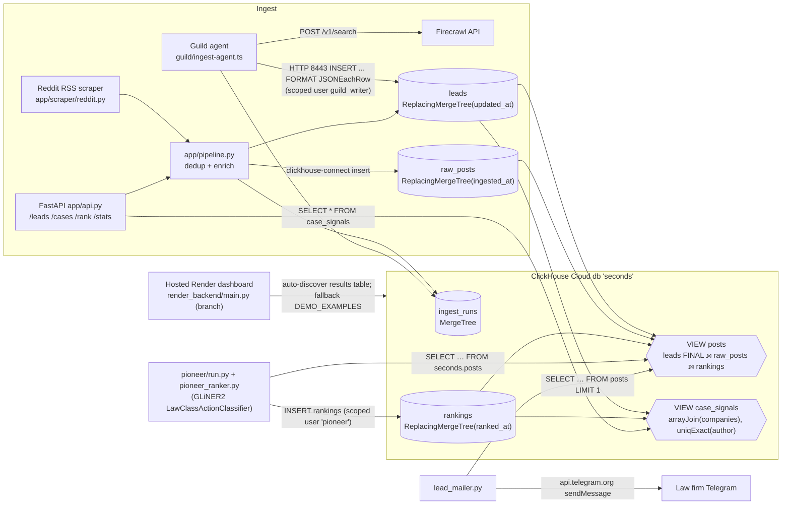

> Imported historical/advisory research. This is not current build authority; follow the ScopeWatch architecture/contracts and START_HERE. Original research date and qualifications remain below.

# seconds ai (seconds.ai) — ClickHouse Team B analysis

> **Current execution policy:** [Start now or anytime, with no build cutoff](../../../../../event/BUILD_AUTHORIZATION.md). The human reports that the event is already underway and public schedules are stale. Older start/deadline/duration advice below is superseded; historical timestamps and analytics windows remain evidence, not build gates.

## 1. Snapshot

| Field | Value | Evidence |
|---|---|---|
| Event | Harness Engineering Hack (tokens&), AWS Builder Loft, San Francisco | https://harness-hack.devpost.com/ |
| Date | Fri 12 June 2026 (kickoff 9:45, submission deadline 4:30 PM PDT) | Devpost schedule |
| Award | Best Use of ClickHouse, category winner. Rank **unconfirmed**. The Devpost title "team 1 - seconds.ai" is a team label, not a placement | `data/winners.json`; Devpost `<title>` = "team 1 - seconds.ai \| Devpost" |
| Prize pool (verified) | "Best Use of ClickHouse — $1,600 in cash — 3 winners. Team #1: $1000 amazon gift card/visa card + $500 ClickHouse credits. Team #2: $500 ClickHouse credits + $250 Cash/amazon gift card. $500 Cash/amazon gift card for the most impressive use of Langfuse" | harness-hack.devpost.com (scraped 8 Oct 2026) |
| Judging criteria (verified) | Idea 20%, Technical implementation 20%, Tool Use 20%, Presentation (3-min demo) 20%, **Autonomy 20%** ("How well does the agent act on real-time data without manual intervention?") | harness-hack.devpost.com |
| Repo | https://github.com/txshah/seconds.ai (cloned at `repos/clickhouse/seconds-ai`, `main` only). Extra upstream branches `sajib/render-deploy-stub`, `sajib/render-telegram-integration`, `sanjay_branch` hold the **hosted** demo code (fetched via `gh api`) | `gh api repos/txshah/seconds.ai/branches` |
| Demo | https://www.youtube.com/watch?v=jNSkYxDTygo — "seconds.ai", 143 s, uploaded 2026-06-12 by Sajib Acharjee Dip | yt-dlp metadata |
| Hosted app | https://seconds-ai.onrender.com/ — live on 8 Oct 2026. `/health` returns `{"service":"seconds.ai polished demo backend","demo_mode":true,"pioneer_mode":"cached_outputs","senso_configured":false,"composio_configured":false,"clickhouse_configured":true}` | curl, 8 Oct 2026 |
| Team | 5 committers: Tvesha Shah (txshah), Munib Rahman, Sanjay Devarajan (sanjay030102 / SanjayDevarajan03), Sajib Acharjee Dip (Sajib-006). Commit authors suggest 4 people | `git log`, `gh api …/commits` |

## 2. What it is

A lead-generation pipeline for plaintiff-side consumer-protection law firms. Agents search Reddit and the open web for consumer complaints (hidden fees, data breaches, defective products). A heuristic tagger extracts company, complaint type, dollar-harm and a "legal signal" pre-score. A Pioneer fine-tuned classifier labels each post with a statute. ClickHouse then rolls individual complaints into class-action candidates per (company × complaint type), counting **distinct complainants** as a proxy for the legal numerosity test. The best lead is pushed to a law firm's Telegram chat. The pitch: "one angry post isn't a lawsuit; 50 different people complaining about the same company for the same reason is a class action forming" (demo 0:15–0:29).

## 3. Architecture (as found in code)

Languages: Python 3.12 (FastAPI, clickhouse-connect), TypeScript (Guild agent SDK), HTML/JS dashboard (hosted branch). Sponsor tech: **ClickHouse Cloud**, Guild.ai, Firecrawl, Pioneer (GLiNER2 fine-tune), Render, Telegram (claimed Composio), Senso (claimed only).



Note: the hosted Render service is **not** the `app/api.py` FastAPI in `main`. It is a separate 1,731-line `render_backend/main.py` on branch `sajib/render-deploy-stub`, which reads whichever ClickHouse table has the expected columns and falls back to hardcoded `DEMO_EXAMPLES` (branch file lines 267, 447–506).

## 4. ClickHouse usage deep-dive

**Depth rating: load-bearing. The `case_signals` view is the most thoughtful product SQL in this cohort, but the demo never shows it, so it is not core to the pitch.**

| Feature | Where | Notes |
|---|---|---|
| Provenance-root table | `app/schema.sql:9-23` | `ingest_runs` MergeTree `ORDER BY (started_at, run_id)` logs every pipeline execution (fetched/new/leads/status/error) |
| Idempotent raw store | `app/schema.sql:27-45` | `raw_posts` `ReplacingMergeTree(ingested_at) ORDER BY (post_id)`, keeps full `raw_json` |
| Upsert-by-insert lead lifecycle | `app/schema.sql:50-79`, `app/store.py:100-127` | `leads` `ReplacingMergeTree(updated_at)`; `set_ranking()` re-inserts the full row with new `updated_at`, so the newest version wins |
| Separate write surface for the model team | `app/schema.sql:84-93` | `rankings` `ReplacingMergeTree(ranked_at)`: "re-ranking is just another INSERT" |
| Spec-shaped read view for the ML teammate | `app/schema.sql:98-120` | `posts` VIEW joins `leads FINAL`, `raw_posts FINAL`, `rankings FINAL`, and builds `metrics_json` with `toJSONString(map(...))` |
| **Product aggregation** | `app/schema.sql:126-157` | `case_signals` VIEW, quoted below |
| Analytics endpoints | `app/api.py:64-93` (`/stats`: `arrayJoin(companies)` top-10), `app/api.py:245-269` (`/cases`) | `/cases` filters `complainants >= min_complainants` |
| Least-privilege users | `guild/README.md:13-15`; `HANDOFF.md` ("user: pioneer # scoped: SELECT on seconds.*, INSERT on seconds.rankings") | `CREATE USER guild_writer …; GRANT INSERT ON seconds.leads …; GRANT INSERT ON seconds.ingest_runs` |
| HTTP interface from a sandboxed agent | `guild/ingest-agent.ts:126-135` | `fetch("https://${host}:8443/?query=INSERT INTO … FORMAT JSONEachRow")` with `X-ClickHouse-User/Key` headers |
| Model reads and writes ClickHouse directly | `pioneer/pioneer_ranker.py:101-123, 155-161` | `SELECT … FROM seconds.posts FINAL WHERE pioneer_score IS NULL`; `db.insert("rankings", …)` |
| Delivery reads ClickHouse | `lead_mailer.py:37-55` | `SELECT … FROM posts WHERE signal_score >= {score:Float32} ORDER BY signal_score DESC LIMIT 1` |

The key snippet (`app/schema.sql:126-146`) encodes a legal concept, numerosity, as a distinct count:

```sql
SELECT company, complaint_type,
    uniqExact(author)                                          AS complainants,
    uniqExactIf(author, created_utc >= now() - INTERVAL 7 DAY) AS complainants_7d,
    arraySlice(groupUniqArray(source_url), 1, 5)               AS evidence,
    round( least(uniqExact(author)/10.0, 1.0)*0.5 + avg(signal_score)*0.3
         + least(uniqExactIf(author, created_utc >= now() - INTERVAL 7 DAY)/5.0, 1.0)*0.2, 3) AS case_score
FROM ( SELECT arrayJoin(l.companies) AS company, … FROM seconds.leads AS l FINAL
       LEFT JOIN seconds.rankings AS rk FINAL ON rk.post_id = l.lead_id )
GROUP BY company, complaint_type;
```

Features **not** used: materialized views, TTL, projections, skip indexes, partitions, vector search, ClickHouse MCP. The views are plain (computed at query time, with FINAL on every read).

**Other sponsors.** Guild.ai: the TS agent with `"use agent"` and `@guildai/agents-sdk`. Firecrawl: `/v1/search` from the agent and `app/scraper/firecrawl.py`. Pioneer: a GLiNER2 fine-tune, `pioneer/finetuning_checkpoints/training_results.txt` (`model_name: LawClassActionClassifier`, `base_model: fastino/gliner2-base-v1`, 5 epochs, status `deployed`, 2026-06-12T19:44Z). Render: `render.yaml`. Composio is listed in `requirements.txt:7-9` but never imported. Senso is not in the `main` code.

## 5. Claimed vs. real

| Claim | Reality (verified) |
|---|---|
| README: "Seven sponsor tools each fulfill a distinct responsibility" (README:17) | Senso is absent from `main` (only README/HANDOFF mention it). Composio is never imported: `lead_mailer.py:77` docstring says "via Composio", but `lead_mailer.py:100-104` POSTs directly to `api.telegram.org`. Devpost "What's next" admits "Composio email to firms + Senso-published citation pages" are future work |
| README: Composio "sends Gmail alerts to every subscribed firm" | Code sends **one** lead (`LIMIT 1`, commit `950811e` "Limit query to 1 lead per run") to Telegram chats configured in `.env` (`lead_mailer.py:10-31`) |
| Demo 0:58–1:07: "fine-tuned the model in Pioneer with a synthetic database … tell us how likely it is this will turn into a real case" | A fine-tune exists, but `lead_mailer.py:47-52` selects and thresholds on the **heuristic `signal_score`**, not `pioneer_score`. The hosted dashboard's own text says "We use cached outputs in the video because live inference can take minutes" (live page, 8 Oct 2026) and `/health` reports `pioneer_mode: "cached_outputs"` |
| "Autonomous agent fires on a schedule. There's no human in the loop" (demo 0:40–0:44) | The Guild agent is real, but no schedule definition is in the repo. Devpost "Challenges" says Guild agents "can't make raw fetch() calls", which sent the team "back to rebuild the agent around Guild's connectors". The committed agent still uses raw `fetch()` (`guild/ingest-agent.ts:113, 129`). Devpost "What's next" lists "the full Guild connector-based autonomous loop, end to end" as future work |
| Numerosity via distinct complainants | **Broken on the primary ingestion path.** The Guild agent writes `author: ""` for every row (`guild/ingest-agent.ts:166`) and `created_utc = ingestion time` (`:143, :165`). So `uniqExact(author)` collapses to 1 per (company, type), and 7-day "velocity" measures ingest recency, not complaint recency. Only the RSS path carries authors |
| `lead_mailer` selects column `profit` from `posts` | `profit` is not in the `posts` view DDL (`app/schema.sql:98-120`), so the live DB schema drifted from the repo (commit `3821253` "Add profit column"). Inference: the column was added by hand in the console |
| "Real-time" complaints | `pioneer/rankings_output.json` (416 rows) contains many news and FTC pages (e.g. "AT&T data breach settlement nears approval", "Equifax Data Breach Settlement - Federal Trade Commission"), so the "complaints" are partly search hits about existing settlements; 205/416 rows are labeled `not actionable` |
| "Get notification … via open telemetry" (demo 1:59–2:02) | No OpenTelemetry code exists in any branch inspected. The hosted "Notify user" button is a JS `alert("Notification prepared for approved demo recipient …")` (live page source) |
| Hosted app = this repo | The deployed backend is a separate demo backend (`render_backend/main.py`, branch `sajib/render-deploy-stub`, commits 20:53Z–23:09Z). It auto-discovers a "results" table and falls back to hardcoded `DEMO_EXAMPLES` if ClickHouse fails |

## 6. Demo analysis (143 s, from YouTube auto-captions)

| Time | Beat | Content |
|---|---|---|
| 0:00–0:13 | Hook / problem | "being scammed … hidden fees … data breaches … lawyers find out months later … The whole system runs on lag" |
| 0:13–0:35 | Insight | "One guy making a little post on Reddit … 50 different people … that's a class action forming. We detect that pattern in real time … hundreds of millions of dollars" |
| 0:36–0:47 | Architecture: sponsor roll-call | "using guild AI … firecrawl inside an agent … fires on a schedule … no human in the loop … ingest all that data into click house" (**first ClickHouse mention, 0:46**) |
| 0:48–1:17 | Model | "Once we have the data in click house, we can run our inference on our fine-tune model … Pioneer … synthetic database … upload it to click house so we have the entire system and all our data stored there" |
| 1:17–1:31 | Delivery and hosting | "using composio from the click house database we send this compiled context in the form of a telegram post … deployed … using render" |
| 1:31–1:54 | Dashboard | "all the reports … notify the users based on the report and the risk factors … seamless agent interface" |
| 1:54–2:18 | Payoff ("wow" moment) | "click publish artifact … notification … on the phone … how much money they can potentially make" |

Structure: hook → problem → insight → sponsor roll-call → dashboard → phone notification. ClickHouse is named four times (0:46, 0:48, 1:15, 1:20) but always as "where the data is stored". The `case_signals` numerosity view, the strongest ClickHouse idea, is never shown on screen (inference from the transcript; video frames were not reviewed). The wow moment is the Telegram notification on a phone with an "Estimated Payout".

## 7. Build timeline

- `main` commits: 25, all on 2026-06-12 between **11:42 and 16:04 PDT** (deadline 16:30). First code: `03e1be4` 13:10 "Build ingestion + ClickHouse handoff layer (scraping + DB)". Pioneer fine-tune `368c552` 13:59. Mailer `a4c61c9` 15:11. README "TLDR section for judging alignment" `9651c51` 15:27.
- Hosted branches: `e659dc9` 20:53Z (13:53 PDT) "Add Render deployment scaffold" through `0392fc0` 23:09Z (16:09 PDT) "Add notify user demo button".
- Size: about 2.1k lines of Python/TS across `app/`, `guild/`, `pioneer/` and `lead_mailer.py`, plus a 1.7k-line hosted backend on its branch. Generated data: `pioneer/rankings_output.json` (4,993 lines) and a 299-line synthetic JSONL training set.
- Prebuilt? No evidence. The cadence shows parallel workstreams merged by PR (#1 munib, #2 pioneer, #3 sanjay_branch), consistent with a same-day build. The well-commented 289-line `HANDOFF.md` contract suggests heavy AI-assisted writing (inference).

## 8. Why it won (ranked, inference unless marked)

1. **The data model expresses the domain.** `case_signals` turns a legal test (numerosity, commonality, defendant) into `uniqExact`, `arrayJoin(companies)` and windowed `uniqExactIf`. Devpost says so explicitly: "A class action's legal tests … map almost one-to-one onto a real-time aggregation query. ClickHouse turned out to be the perfect engine" (verified quote). This is a strong "why ClickHouse" story for sponsor judges.
2. **ClickHouse is the shared bus between three teammates.** Ingest writes, Pioneer reads a spec-shaped view and writes `rankings`, and the mailer reads `posts`. Scoped DB users per agent (verified) look production-minded.
3. **Devpost "Challenges" names real ClickHouse Cloud details**: "Engines silently map to their Shared* variants, FINAL is required to dedup ReplacingMergeTree reads, and the table alias must come before FINAL in a join" (verified quote). Sponsor DevRel judges reward this signal that the team actually used the product.
4. **Clear money story and autonomy framing**, aligned with the 20% Autonomy criterion. The README even has a "TLDR: Judging Alignment" table mapping to each criterion (README:11-19).
5. **Large team, many sponsor touches, a polished hosted dashboard** that reads ClickHouse live.

## 9. Weaknesses a stronger competitor could exploit

- Numerosity is broken for Guild-ingested rows (`author: ""`), so the headline idea does not work on the "autonomous" path.
- Pioneer outputs in the demo are cached; delivery thresholds on heuristic `signal_score`.
- Composio, Senso and OpenTelemetry are claimed without code. Real dependency: Telegram API.
- No materialized views or TTL; FINAL on every read. This is fine at hackathon scale, but there is no "ClickHouse at speed" moment.
- The ClickHouse moment is never visualized; a judge only hears "stored in ClickHouse".
- Schema drift (`profit` column) means the repo cannot recreate the demo DB.

## 10. Steal-this (for the Cyberdefense entry)

1. **Encode the security concept as a distinct-count aggregation.** For example, `uniqExact(src_ip)` per (target, technique) with 1h/24h `uniqExactIf` windows gives "campaign vs. one-off" scoring, just as seconds.ai used `uniqExact(author)` for numerosity. Put the formula on a slide.
2. **ReplacingMergeTree upsert pattern** for alert/finding lifecycle (`new → triaged → fixed`): re-insert with a newer `updated_at`, read with FINAL. Keep a separate `rankings`-style table that the LLM agent writes to, joined in a view.
3. **Scoped ClickHouse users per agent** (e.g. `scanner_writer` INSERT-only, `triage_agent` SELECT + INSERT on `verdicts`). Show the GRANTs; it is a security-hackathon credibility point.
4. **An `ingest_runs` provenance table** so every finding traces back to the scan run that produced it.
5. **Write a "challenges with ClickHouse" paragraph** naming concrete engine details (SharedMergeTree, FINAL, async inserts) on Devpost.
6. **Avoid their mistakes**: fill the key field you count distinct on, do not claim sponsors you have not wired, and show the aggregation result on screen.
