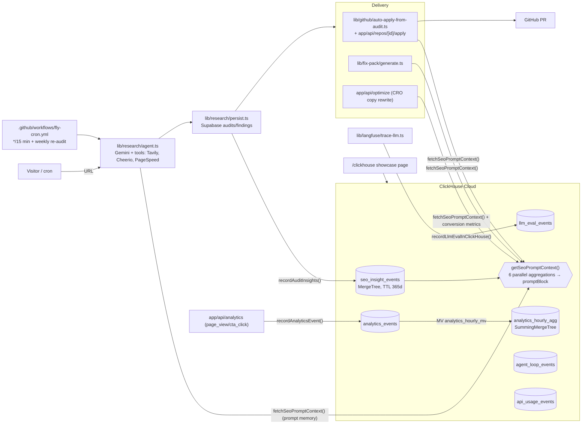

> Imported historical/advisory research. This is not current build authority; follow the ScopeWatch architecture/contracts and START_HERE. Original research date and qualifications remain below.

# SynapseCRO — ClickHouse Team B analysis

> **Current execution policy:** [Start now or anytime, with no build cutoff](../../../../../event/BUILD_AUTHORIZATION.md). The human reports that the event is already underway and public schedules are stale. Older start/deadline/duration advice below is superseded; historical timestamps and analytics windows remain evidence, not build gates.

## 1. Snapshot

| Field | Value | Evidence |
|---|---|---|
| Event | Multiagents Hackathon London (tokens&) | https://multiagents-hackathon.devpost.com/ |
| Date | 26 June 2026 (kickoff 10:00, deadline 4:30 PM BST). Rules: "**Projects must be built during the event.** Maximum team size of 3" | Devpost (verified) |
| Award | Best Use of ClickHouse, category winner. Rank **unconfirmed** (1st: $1,000 gift card + $500 credits; 2nd: $300 credits) | `data/winners.json`; https://devpost.com/software/synapsecro |
| Repo | **Found during this analysis** (the prior research said "No canonical public repository found"): **https://github.com/ramstar3000/seo_tool**. Identity evidence: the Devpost submitter is Ram Vinjamuri (devpost.com/ramstar30000, whose profile links github.com/ramstar3000); the repo contains `fly.toml`, `app/clickhouse/page.tsx` (the `/clickhouse` page Devpost links), `lib/clickhouse/*`, `audit_fix_packs`, and commit `8459047` "Add SynapseCRO: self-optimizing CRO platform…". Cloned read-only to scratchpad (`…/scratchpad/synapsecro`). Analyzed at commit **`1467ca9`** (last event-day commit, 15:39 BST); `HEAD 764989b` (2026-07-10) adds 6k lines but **no ClickHouse changes** (`git diff --stat 1467ca9 HEAD -- lib/clickhouse app/clickhouse` is empty) | `gh api users/ramstar3000/repos`; git |
| Demo | https://www.youtube.com/watch?v=O1_n7AjpXAc — "Hackathon Project", **87 s**, uploader Ram Vinjamuri | yt-dlp |
| Hosted app | https://synapsecro.fly.dev — the landing page loads (8 Oct 2026). **`/clickhouse` now renders "ClickHouse showcase unavailable — set CLICKHOUSE_* env vars."**, so the ClickHouse service is disconnected today. No login or audit was attempted | firecrawl, 8 Oct 2026 |
| Team | Git authors: Ram Vinjamuri and "Abhiram Vinjamuri" (likely the same person, via GitHub web merges, plus the bot-authored audit PR). Devpost lists only Ram Vinjamuri. Solo or small team | git log |

## 2. What it is

An autonomous local-SEO/CRO agency in a box. A visitor enters a website URL. A Gemini research agent with tools (Tavily SERP, Cheerio scraping, PageSpeed Insights, competitor and social lookups) produces scored findings. The system then delivers fixes as a **GitHub PR** (through a GitHub App with per-user installation tokens) or as a copy-paste "fix pack" for Wix/Webflow/Squarespace. Leads are re-audited weekly by cron, and outreach emails cite real rank data. ClickHouse is the cross-audit "memory": recurring and persistent findings, rank drift, LCP history and eval scores are aggregated and injected into the next LLM prompt.

## 3. Architecture (as found in code at `1467ca9`)

Next.js 16 / React 19 / TypeScript (~25k lines at the event commit), Supabase Postgres (source of truth, realtime), `@clickhouse/client` against ClickHouse Cloud, Langfuse via OpenTelemetry, Gemini + Anthropic via the Vercel AI SDK, Resend email, a GitHub App, Fly.io (with a GitHub Actions cron).



## 4. ClickHouse usage deep-dive

**Depth rating: load-bearing. The ClickHouse aggregate memory is injected into five LLM entry points; the closed loop is core to the Devpost sponsor pitch.**

| Feature | File:line (at `1467ca9`) | Notes |
|---|---|---|
| Schema bootstrap in code (idempotent) | `lib/clickhouse/schema.ts:5-157` | 6 tables, ALTER-ADD-COLUMN migrations, 1 MV |
| Partitioning + TTL | `schema.ts:15-18, 61-65` etc. | `PARTITION BY toYYYYMM(created_at)`, `TTL … + INTERVAL 365 DAY` on every event table |
| Nullable sort keys | `schema.ts:63-65` | `ORDER BY (lead_id, audit_id, event_type, completed_at) SETTINGS allow_nullable_key = 1` |
| SummingMergeTree + MV | `schema.ts:84-92, 119-130` | `analytics_hourly_mv TO analytics_hourly_agg` with `count()` per hour × event_type. **But** `getHourlyFunnel` reads raw `analytics_events` (`lib/clickhouse/events.ts:100-125`); the MV target is only counted on the showcase (`showcase.ts:85`). Partly decorative |
| Write: audit memory | `lib/clickhouse/seo-insights.ts:90-158`, called from `lib/research/persist.ts:120` | one `audit_summary` row and one row per finding (severity, category, rank, LCP, competitor count) |
| **Read: persistence detection** | `seo-insights.ts:345-372` | `count(DISTINCT audit_id) AS audit_count, dateDiff('day', min(completed_at), max(completed_at)) AS days_persisting … GROUP BY title, category, severity HAVING audit_count >= 2 OR days_persisting >= 7` |
| **Read → prompt** | `seo-insights.ts:400-582` (6 parallel queries) → `buildPromptBlock()` `:268+` → `lib/seo/prompt-context.ts:4-14` | emits text starting "Historical SEO insight memory (ClickHouse):" |
| Prompt-memory consumers | `lib/research/agent.ts:55`, `lib/fix-pack/generate.ts:97-98`, `lib/github/auto-apply-from-audit.ts:132`, `app/api/repos/[id]/apply/route.ts:152-153`, `app/api/optimize/route.ts:27` | memory changes what the agent looks for and what PRs it writes |
| Eval analytics with JSON | `lib/clickhouse/evals.ts:51-93` | `ARRAY JOIN JSONExtractArrayRaw(scores_json) AS score … avg(JSONExtractFloat(score,'value'))` per trace/score |
| Conversion metrics | `lib/clickhouse/events.ts:62-99` | `countIf(event_type='page_view')`, `countIf(event_type='cta_click')`, with a Supabase fallback in `lib/analytics/metrics.ts` |
| Judge showcase | `lib/clickhouse/showcase.ts:71-110, 161+`, `app/clickhouse/page.tsx`, `app/api/clickhouse/showcase/route.ts` | scale stats (row counts per table, distinct audits/leads), funnel, persistent findings |
| Demo seeding | `scripts/seed-clickhouse-demo.mjs:3, 115` | "Seed ClickHouse with hackathon demo data — scale + 'issues persisting 14 days'"; `auditDays = [14, 7, 0]` for a fictional "Camden Smile Dental" |

```ts
// lib/seo/prompt-context.ts:4-14
export async function fetchSeoPromptContext(params) {
  const context = await getSeoPromptContext(params);
  if (context.source !== 'clickhouse') return null;
  if (context.auditCount === 0 && context.findingCount === 0) return null;
  return context.promptBlock;      // "Historical SEO insight memory (ClickHouse): …"
}
```

Not used: AggregatingMergeTree, projections, vector search, ClickHouse MCP, RBAC.

**Other sponsors:** Tavily (SERP and lead discovery; the Devpost "Tavily" section), Cursor (built with), Langfuse (OTEL tracing and evals; also part of ClickHouse since Jan 2026), Supabase, the GitHub App.

## 5. Claimed vs. real

| Claim (Devpost) | Reality |
|---|---|
| "Every audit and re-audit writes to ClickHouse … the next run reads that memory back in before the agent touches a page" | **True** (`persist.ts:120` writes; `research/agent.ts:55` reads) |
| "materialised views for hourly conversion" | The MV exists, but the funnel query reads raw events; the MV target is only counted |
| "Prompt self-improvement: bad eval scores → proposed prompt revision → GitHub PR against our own repo" (and commit `1fc97aa` "Rewrite agent prompts using ClickHouse eval and production insights") | The improve loop (`lib/prompts/improve.ts:1-30, 60-96`) computes eval evidence from **Supabase** audits via `computeResearchEvalScores`, not ClickHouse. ClickHouse `llm_eval_events` is a sink plus showcase aggregate. One PR was produced (#1, merged 15:15) |
| "Proven to improve SEO on my personal website" | PR #2 (`synapsecro/audit-1782484542900`, merged 15:39) is an auto-PR against the SynapseCRO repo itself ("Enhance homepage title…"). No ranking evidence was found |
| "Fully working … free tool now" / `/clickhouse` stats link | Today the `/clickhouse` page shows "ClickHouse showcase unavailable"; on judging day it depended on seeded data (`seed-clickhouse-demo.mjs`) |
| "Projects must be built during the event" (rule) | **8 commits are dated 2026-06-25 09:00:00–09:35:00 +0100 at exact 5-minute intervals** (`c4c3a49` "Initial commit from Create Next App" … `7eaf4b5` "Ship Fly deployment…"), i.e. the **day before** the event. They contain the core product (12.4k of 25.2k lines at the event commit; `8459047` "Add SynapseCRO: self-optimizing CRO platform with research agent and GitHub PRs"). The GitHub repo `created_at` is 2026-06-25T17:21Z. The uniform timestamps look scripted (e.g. rewritten or replayed history). Either way, the base product predates the event. **All ClickHouse code is first committed on event day** (`c3a27bc` 11:15 "Add ClickHouse analytics integration and SEO memory in prompts"; none of `lib/clickhouse` exists at `7eaf4b5`) |
| "Postgres stores today's audit; ClickHouse is how SynapseCRO re-learns" | Accurate split: Supabase is the source of truth, and ClickHouse is the analytical memory with fail-soft fallbacks (`getClickHouseClient()` returns null and every reader returns empty context) |

## 6. Demo analysis (87 s, auto-captions)

| Time | Beat | Content |
|---|---|---|
| 0:00–0:08 | What | "audits local sites and ships fixes. It creates GitHub PRs when there's a repo, fix packs when there isn't" |
| 0:09–0:17 | Autonomy claim | "automated the whole chain from free audits to leads to research agents to auto PRs and fix packs, weekly re-audits and a CRO loop" |
| 0:18–0:25 | Stack | "very simple tech stack using Supabase, **ClickHouse for its back end** … integrations all the way to GitHub" (only ClickHouse mention) |
| 0:27–0:43 | Live run start | audits "my Human AI project", email, "start a full audit" |
| 0:44–1:07 | Pre-baked result | "I'll go into the research and find a previous one which I ran" → audit and recommended fixes (GitHub, Google Business, robots/meta tags) |
| 1:07–1:22 | Payoff | "a pre-made example … files changed … meta tags … prompts" (the auto-PR) |

The video is very short, shows no ClickHouse screen, and falls back to a pre-run audit and a pre-made PR. The ClickHouse case was made in the Devpost "Sponsor Section" text and the `/clickhouse` showcase page, plus any live judging (unknown).

## 7. Build timeline

- 2026-06-25 09:00–09:35 (8 synthetic-cadence commits): base product, Fly deploy, marketing UI. 12,388 lines of TS/SQL/MJS.
- 2026-06-26 10:08 → 15:39 BST (33 commits): `47d2f63` 10:08 "Add hackathon agent features and sponsor integrations"; `c3a27bc` **11:15** ClickHouse integration + SEO memory; `797c74a` 11:58 ClickHouse showcase + Langfuse OTEL; `266e8a7` 13:47 "Feed ClickHouse audit memory into prompts"; `c81a8ed` 13:58 prompt self-improvement; `6aaa963` 14:06 GitHub App; `8241193` 14:51 fix packs; `1fc97aa` 15:08 prompt rewrite PR; `1467ca9` 15:39 auto-audit PR merge. At the event commit: 25,161 lines; `lib/clickhouse` is 1,843 lines plus a 225-line `docs/CLICKHOUSE.md`.
- 2026-07-10: `8b6caea` "push" (+6,267/−961, benchmarks/detectors). Not judged.

## 8. Why it won (ranked, inference)

1. **The memory loop is the sponsor pitch, and it is real in code.** ClickHouse aggregates ("this finding has persisted 14 days across 3 audits") are injected into five LLM prompt sites. The Devpost wording, "not a dashboard nobody opens", explicitly answers the classic sponsor-judge objection.
2. **Persistence semantics in SQL** (`count(DISTINCT audit_id)`, `dateDiff` on min/max, a `HAVING` threshold) are a clean, explainable analytic that Postgres-only teams would not frame.
3. **A dedicated ClickHouse showcase page** (`/clickhouse`) with scale stats and a funnel, linked from Devpost, made judging easy.
4. **Product maturity and autonomy.** Cron re-audits, auto-PRs, email outreach and a GitHub App made a strong Autonomy and Technical impression, helped by a day-before head start (see §5).
5. A thin field (82 participants, two ClickHouse slots).

## 9. Weaknesses

- Possible rule tension: the core product predates the event per commit timestamps; only the ClickHouse layer is provably event-day work.
- The demo barely shows ClickHouse and relies on pre-run results.
- The MV is not used by the funnel query; the eval "self-improvement" reads Supabase, not ClickHouse.
- Seeded showcase data; the showcase is dead today.
- `getPersistentFindings` used on the showcase is global (not per lead), so "persistent findings" can mix businesses.

## 10. Steal-this

1. **"ClickHouse as agent memory" prompt block.** Before each triage/scan run, query `findings` history (e.g. `count(DISTINCT scan_id)`, `dateDiff` first/last seen, "still unfixed after N scans") and prepend a "Historical security memory (ClickHouse):" block to the agent prompt. Make the agent say "this SQLi in `/login` has persisted 3 scans / 9 days".
2. **Persistence/regression detection as a `HAVING` rule** (`audit_count >= 2 OR days_persisting >= 7`), which maps directly onto vulnerability SLA breach.
3. **Fail-soft dual-write**: Postgres or the primary store for state, ClickHouse for analytics; every reader degrades to empty context so the demo cannot crash.
4. **A `/clickhouse` judge page** with live row counts per table, MVs and the persistent-issue query, linked from Devpost in a "Sponsor Section" paragraph per sponsor.
5. **Evals into ClickHouse** with `ARRAY JOIN JSONExtractArrayRaw(scores_json)` so LLM triage quality is queryable over time (a natural pairing with Langfuse).
6. **Do not copy**: back-dated or pre-built product code. Build during the event or disclose prior work.
