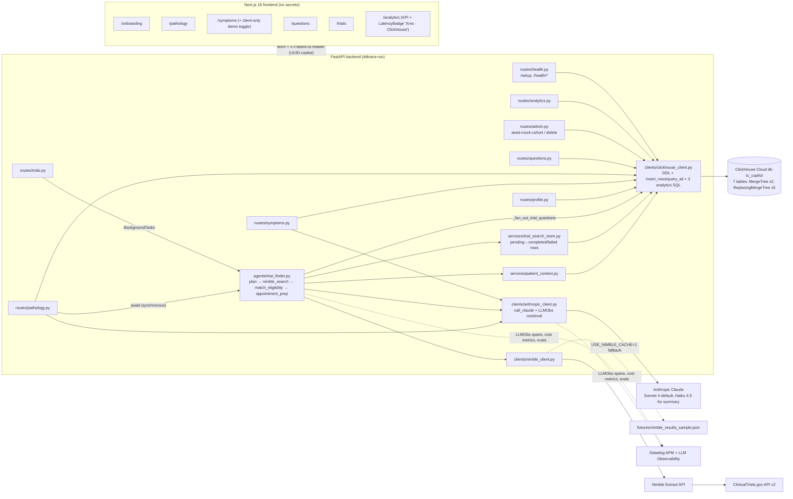

> Imported historical/advisory research. This is not current build authority; follow the ScopeWatch architecture/contracts and START_HERE. Original research date and qualifications remain below.

# TC Pilot (TC-Pilot / "TC Co-pilot") — ClickHouse Team A analysis

All file:line references are to `repos/clickhouse/tc-pilot/` at HEAD `ac57e18` (cloned depth 50; the full history is 20 commits). Labels: **[V]** = verified fact with a cited source; **[I]** = inference.

---

## 1. Snapshot

| Field | Value |
|---|---|
| Event | Agentic Engineering Hack (tokens& NYC series), 23 May 2026 — https://agentic-engineering-hack.devpost.com/ |
| Award | **[V]** Devpost project page lists two badges: **"Winner — Best use of ClickHouse"** and **"Winner — Top Overall Winners"** (curl of https://devpost.com/software/tc-pilot, 8 Oct 2026). Gallery caption on the same page: *"We won first place overall"*. |
| Rank inside ClickHouse category | **2nd — creator-reported only** (per `data/winners.json`, sourced from LinkedIn). **Not re-verified:** https://www.linkedin.com/in/akhil-mohammed returned HTTP 999 (bot wall) to curl, and firecrawl refuses LinkedIn person profiles. No sponsor blog or announcement for this event was found. |
| Evidence strength | Category membership: strong (structured Devpost badge). In-category rank: weak (creator claim only). The "Top Overall" win is strong (badge). |
| Team | **[V]** 2 people: Haris A (GitHub `Haris320`) and Akhil Mohammed (`Akhil-Mohammed`, Devpost `m-akhil2-0`). Devpost: *"Two-engineer build with a hard line…"* |
| Repo | https://github.com/Haris320/tc-pilot |
| Demo | https://www.youtube.com/watch?v=n-i_Wm6XZzA — "TC Pilot Demo (WINNER)", 263 s (4:23), uploaded 2026-05-24 by "Haris" (re-upload; see §6) |
| Hosted app | None. **[V]** Devpost update by Akhil Mohammed, 24 May 2026 16:27 EDT: *"deploy coming soon"*. |
| Other sponsors used | Anthropic Claude (Sonnet 4 / Haiku 4.5), Datadog APM + LLM Observability, Nimble (Extract over ClinicalTrials.gov), Vercel (intended deploy target only). |

**[V] Notable:** Nataly Merezhuk — named in ClickHouse's NYC blog post as part of the ClickHouse on-site crew ("Kevin Zhang, Nataly Merezhuk, and Zoe Steinkamp") — commented on this Devpost submission: *"Your YouTube video isn't available!"*, and Haris replied *"Reuploaded the video!"*. So ClickHouse staff were reviewing the Devpost entries, including the video.

---

## 2. What it is

A companion web app for people newly diagnosed with **testicular cancer** ("TC"). A patient (identified only by a UUID cookie) fills in a profile (cancer type, stage, location, age), pastes their pathology report, and gets (a) a plain-English explanation plus questions for their oncologist, (b) a background agentic search of ClinicalTrials.gov that ranks trials for that patient, (c) a daily symptom tracker with a 14-day chart and an LLM trend summary that flags symptoms rising ≥2 points, and (d) one merged "questions for my doctor" prep sheet. On top of that, an **/analytics** page runs population-level ClickHouse queries over a **synthetic 1,000-patient cohort** to show how each medication shifts each symptom score in the 14 days before vs. after it started ("Zofran lowered nausea by 3.74 points"). Explicitly framed as navigation, not diagnosis (`CLAUDE.md:16`).

---

## 3. Architecture

**Stack [V]:** Next.js 16 App Router + TypeScript + Tailwind v4 + recharts frontend (`app/`, `components/`, `lib/`); Python 3.12 FastAPI backend (`backend/app/`) using `clickhouse-connect`, `anthropic`, `httpx`, `ddtrace`. Frontend never calls sponsors directly; every call goes through one wrapper per sponsor in `backend/app/clients/` (`CLAUDE.md` §4). Note: `CLAUDE.md` names the wrappers `app/lib/claude.py` etc., but the real files are `backend/app/clients/{anthropic_client,clickhouse_client,nimble_client}.py` — the spec drifted from code.

**ClickHouse tables [V]** (`backend/app/clients/clickhouse_client.py:29-105`): `patient_profiles`, `patient_symptoms`, `symptom_logs`, `doctor_questions`, `pathology_reports`, `patient_medications`, `trial_search_runs` — ClickHouse is the **only** datastore (no Postgres/Redis/SQLite anywhere in the tree).



**Data flow of the hero path [V]:** `POST /translate-report` (`routes/pathology.py:46-121`) reads the stage from `patient_profiles FINAL` (`:53-60`), calls Claude, writes `pathology_reports` (`:100-104`), inserts a `pending` row into `trial_search_runs` (`:109`), then **awaits** the whole trial-finder agent synchronously (`:112`) — load ClickHouse context (`agents/trial_finder.py:254-257`) → Claude plans query (`:40-67`) → Nimble/CT.gov (`:113-131`) → Claude ranks eligibility (`:137-175`) → Claude builds appointment prep (`:181-210`) → re-insert the run row as `completed` (`:295-306`) → fan out trial questions into `doctor_questions` with de-dup against existing rows (`:323-355`).

---

## 4. Sponsor usage deep-dive (ClickHouse)

### 4.1 Schema / engines / sort keys [V] (`backend/app/clients/clickhouse_client.py`)

| Table | Engine | ORDER BY | Lines | Comment |
|---|---|---|---|---|
| `patient_profiles` | ReplacingMergeTree() | `patient_id` | 30-40 | upsert-by-reinsert; read with `FINAL` |
| `patient_symptoms` | ReplacingMergeTree() | `(patient_id, symptom_name)` | 41-49 | **EAV-style** per-patient symptom catalog — lets users add "Ear Ringing" without a migration |
| `symptom_logs` | **MergeTree()** | `(patient_id, logged_at, symptom_name)` | 50-57 | the time-series fact table; sort key fits per-patient 14-day window queries |
| `doctor_questions` | ReplacingMergeTree() | `(patient_id, added_at, id)` | 58-67 | "done" toggle is implemented as re-insert with the same key (`routes/questions.py:106-113`) — correct RMT idiom |
| `pathology_reports` | MergeTree() | `(patient_id, created_at, id)` | 68-77 | append-only history |
| `patient_medications` | ReplacingMergeTree() | `(patient_id, medication_name)` | 78-86 | has `start_date Date` — the pivot for the before/after query |
| `trial_search_runs` | ReplacingMergeTree() | `(patient_id, run_id)` | 87-104 | **agent run state machine**: same `run_id` re-inserted as pending → completed/failed; JSON blobs stored as `String` |

Other DDL behaviour: `CREATE DATABASE IF NOT EXISTS` via a bootstrap client with no db (`:122-132`); idempotent `ALTER TABLE … ADD COLUMN IF NOT EXISTS` backfills for `name`/`age` (`:141-146`); tables auto-created on every FastAPI startup in the lifespan hook, non-fatal on failure (`main.py:46-53`).

**Not used [V by absence — grep of the tree]:** no materialized views, no projections, no `PARTITION BY`, no TTL, no `LowCardinality`, no `AggregatingMergeTree`, no async inserts, no vector search, no ClickHouse MCP server, no Kafka/ClickPipes. JSON is stored as `String` (`trials_json`, `questions_json`, `themes_json`), not the `JSON` type. No version column on any ReplacingMergeTree (relies on last-insert-wins + `FINAL`).

### 4.2 Analytical SQL — the "sponsor moment" [V]

Three population queries, each timed with `time.perf_counter()` and returned as `query_ms` so the UI can badge them:

1. **Overview** (`clickhouse_client.py:219-239`) — three scalar subqueries in one round trip (`count()` of profiles, symptom_logs, medications).
2. **Medication impact** (`:242-281`) — the centrepiece: conditional aggregates around a per-patient event date.

```sql
SELECT pm.display_name AS medication, sl.symptom_name AS symptom,
  round(avgIf(sl.score, sl.logged_at <  toDateTime(pm.start_date)), 2) AS avg_before,
  round(avgIf(sl.score, sl.logged_at >= toDateTime(pm.start_date)), 2) AS avg_after,
  countIf(sl.logged_at <  toDateTime(pm.start_date)) AS n_before,
  countIf(sl.logged_at >= toDateTime(pm.start_date)) AS n_after
FROM symptom_logs AS sl
INNER JOIN patient_medications AS pm USING (patient_id)
WHERE sl.logged_at BETWEEN toDateTime(pm.start_date) - INTERVAL 14 DAY
                       AND toDateTime(pm.start_date) + INTERVAL 14 DAY
GROUP BY medication, symptom
HAVING n_before >= 5 AND n_after >= 5
ORDER BY (avg_before - avg_after) DESC
```
   (`clickhouse_client.py:253-266`). This is a genuine ClickHouse-idiomatic query (`avgIf`/`countIf` combinators, interval arithmetic, minimum-support `HAVING`) — an "event-study" pattern.
3. **Population symptom trends** (`:284-317`) — `toDate(logged_at)` daily `avg(score)`/`count()` per symptom over N days (N interpolated via f-string but bounded 7–365 by FastAPI `Query` at `routes/analytics.py:32`).

Per-patient analytics: 14-day `toDate` + `avg` group-bys feed the chart (`routes/symptoms.py:144-162`), the Claude symptom summary (`:165-226`) and the agent's patient context (`services/patient_context.py:92-102`). So ClickHouse aggregates are **inputs to the LLM**, not just a dashboard.

### 4.3 Seeding [V] (`backend/app/routes/admin.py`)

`POST /admin/seed-mock-cohort?count=1000` (`:94-204`) generates synthetic patients with 90 days of daily scores for 4–5 symptoms and 1–2 medications each, then bulk-inserts the four tables in one `insert` each (`:175-196`). Medication effects are **hard-coded into the generator** (`MED_EFFECTS`, `:59-66` — e.g. ondansetron → nausea −3.0) on top of a sinusoidal "two BEP chemo cycles" ramp (`_chemo_ramp`, `:69-76`) plus ±1 noise. Cleanup: `ALTER TABLE {t} DELETE WHERE patient_id LIKE 'mock-%'` (`:216-217`) — note the code comment and API.md call this a "lightweight mutation", but `ALTER TABLE … DELETE` is a classic (heavy) mutation, not `DELETE FROM` lightweight delete.

**[I] Sanity check of demo numbers vs. generator:** 1,000 patients × 90 days × ~4.3 symptoms ≈ 390k `symptom_logs` rows. ~1.33 meds/patient over 5 meds → ~265 ondansetron patients × ~29 days in window ≈ 7.7k nausea rows — matches the demo's "over 7,000 data points" (transcript 03:55–03:59). The demo's "improved by 3.74 points" is the seeded −3.0 effect plus the chemo-ramp and clamp — i.e. the insight is the generator's own constant read back out.

### 4.4 Plumbing / ops [V]

- Single shared client guarded by a `threading.Lock` (`clickhouse_client.py:16-17, 198-213`) — added after "FastAPI hit concurrency crashes once we shared a ClickHouse client" (Devpost) and commit `fc54f0f` "Fix concurrency crashes". The seed endpoint bypasses the lock (`admin.py:175`).
- Server-side parameter binding `{pid:String}` everywhere for user input (e.g. `routes/symptoms.py:61`) — no SQL injection on patient paths.
- Sponsor **health gate**: `GET /health/clickhouse` does a write-then-read round trip and returns `{writeOk, readOk, row}` (`clickhouse_client.py:150-185`, `routes/health.py:29-37`); `ping()` (`:188-192`) is included in the Datadog trace gate (`health.py:103-127`).
- ClickHouse reads/writes are wrapped as Datadog LLMObs `task` spans named `clickhouse-read` / `clickhouse-write` (`anthropic_client.py:93-97`; used at `routes/pathology.py:52, 99`, `routes/symptoms.py:135, 168`), with `rows_fetched` metric annotated (`symptoms.py:180`). So ClickHouse operations are visible inside the LLM trace tree in Datadog — this is what the demo shows at 00:48–01:03.

### 4.5 Depth rating

**Load-bearing, bordering on core-to-the-pitch.** ClickHouse is the sole system of record (all 7 tables), the agent's context loader, the agent run-state store, and the source of the one quantitative "wow" screen. It is *not* core to the product's main value prop (pathology translation and trial matching are LLM + Nimble), and the analytics showpiece runs on synthetic data with no advanced engine features (no MVs/TTL/projections). Compared with other winners: more idiomatic SQL than LicenseTrace/RedBot-style "insert findings" usage, less engine depth than Rokko (Kafka + MVs).

### 4.6 Other sponsors (brief)

- **Anthropic** [V]: `call_claude` wrapper (`anthropic_client.py:100-190`), default `claude-sonnet-4-20250514` (`:26`), Haiku 4.5 for symptom summary (`routes/symptoms.py:213-220`); every call carries an allow-listed `feature_tag` (`:28-36, 120-121`) and per-call USD cost metrics (`:144-169`).
- **Datadog** [V]: agentless LLMObs enable (`main.py:16-28`), workflow/tool/task spans throughout the agent (`trial_finder.py:252-283`), `LLMObs.submit_evaluation` of cheap heuristic evals like `clean_json`, `question_count` (`anthropic_client.py:175-188`; `pathology.py:79-86`). Likely the strongest sponsor integration in the repo.
- **Nimble** [V]: Extract API against CT.gov v2 (`nimble_client.py:28, 102-135, 186-201`), with fixture fallback only when `USE_NIMBLE_CACHE=1` (`:203-223`; `trial_finder.py:126-131`).

---

## 5. Claimed vs. real

| Claim | Source | Reality |
|---|---|---|
| "We also use Click House to aggregate all our user data and find trends across medication and how it impacts symptoms." | Devpost | **Backed** by `medication_impact()` SQL — but the trends are **synthetic, injected by `MED_EFFECTS`** (`admin.py:59-66`). The UI footer admits "for demonstration purposes" (`app/analytics/page.tsx:451`). |
| "real population-level medication-impact deltas … on a seeded 1,000-patient cohort" | Devpost | "Real" query, seeded data. Honest about seeding. |
| "cross-querying four different tables at once … aggregate all of this in less than a second" | Demo 03:31–03:45 | Overview hits **3** tables; medication impact joins **2**; the page fires **3** parallel requests (`analytics/page.tsx:341-345`). "Four tables" is a slight overstatement. Sub-second is plausible for ~400k rows. |
| Symptom chart shows a trend "over time" | Demo 01:47–01:56 | Speaker says "That's kind of like the demo data" — the chart has a **client-side-only demo toggle** with hardcoded scores that "never touches the DB" (`app/symptoms/page.tsx:19-61, 169-179`). The per-patient chart, when not toggled, is real ClickHouse data. |
| `POST /symptoms/seed-demo-history` | `API.md:178-183` | **Not implemented** — no route in `backend/` (grep). Replaced by the client-side demo toggle. |
| Trial finder runs "in the background at the same time" | Demo 02:01–02:07 | `routes/pathology.py:110-112` actually **awaits** the agent synchronously ("UI shows a single spinner; no polling"). `POST /find-trials` uses BackgroundTasks (`routes/trials.py:46`). |
| Live CT.gov trials | Demo 03:10–03:22 | Live by default; fixture fallback exists but is env-gated off (`.env.example` `USE_NIMBLE_CACHE=0`). Cannot verify which path ran in the demo. |
| "Lightweight mutations" delete | `admin.py:211`, API.md | Uses `ALTER TABLE … DELETE` (regular mutation). Minor. |
| Spec file paths `app/lib/clickhouse.py` | `CLAUDE.md` §2–3 | Real path is `backend/app/clients/clickhouse_client.py`. |
| Auth | Devpost "What's next" | UUID cookie only, any client can send any `X-Patient-Id` (`deps.py:6-14`); `/admin/*` and `/analytics/*` are unauthenticated. Disclosed as future work. |

No credentials were found committed: `backend/.env.example` has empty secret values (non-secret defaults only), and no `.env` file appears in the git history.

---

## 6. Demo analysis

**Video [V]:** "TC Pilot Demo (WINNER)", 4:23, uploaded 2026-05-24 (the day after the event; the Devpost thread shows the first upload was unavailable and was re-uploaded after a ClickHouse staffer flagged it). Two speakers (Haris, then Akhil). Screen recording, no slides. Transcript: auto-captions (`n-i_Wm6XZzA.en.vtt`); timestamps are caption cue starts.

| Time | Beat | What's on screen / said |
|---|---|---|
| 00:00–00:21 | **Hook / problem** | "if you recently got diagnosed with cancer … this is going to help you navigate it. So, it's like your pilot." Very light problem framing, no stats. |
| 00:23–00:36 | Feature tour | Onboarding → "We track your symptoms … pathology report … find trials and give you questions to ask your doctor." |
| 00:36–00:46 | Live run starts | Pastes a pathology report and starts translation. |
| 00:46–01:03 | **Sponsor moment #1 (Datadog)** | While waiting: "we're tracking all of this using Datadog's LLM observability tracer … see all the requests … including our read and writes" — the `clickhouse-read/write` task spans appear inside LLMObs traces. |
| 01:03–01:25 | Trial-search trace | Shows trial-search trace breakdown; "Nimble way to automatically start parsing for nearby trials"; "Questions to ask my doctor". |
| 01:27–01:56 | Symptom tracker | Adds "ear ringing" (Claude-validated custom symptom → `patient_symptoms` insert, `routes/symptoms.py:96-141`), logs today, shows chart — "That's kind of like the demo data" (client-side toggle). |
| 01:59–03:22 | Speaker 2: agent explanation | Narrates the 3–4 tool calls: gather context → structured params → Nimble search → `match_eligibility` ("This is where our agentic component comes into play") → oncologist questions; clicks a real CT.gov hyperlink (03:16–03:22). |
| 03:27–04:20 | **Sponsor moment #2 (ClickHouse) — the closer** | "our analytics page … ClickHouse's rapid … cross-querying four different tables at once … over 180[k?] … aggregate all of this in less than a second" (03:29–03:45); "if they were on Zofran, how their nausea went down … improved it by 3.74 points and we have over 7,000 data points" (03:47–03:59); "outside of research facilities, you're never going to find actual real patient data … we can do a lot of aggregation to analyze trends and patterns" (03:59–04:15). |
| 04:21–04:23 | Close | "That's our project. Thanks for watching." |

**Structure [I]:** hook (weak) → feature tour → live run with observability-as-spectacle → agent-architecture narration → ClickHouse analytics as the finale. ClickHouse appears explicitly only in the last ~55 s (≈21% of runtime), but it is the last thing judges see and is the only screen with numbers and latency badges ("Xms · ClickHouse", `app/analytics/page.tsx:74-80`).

**Wow moment [I]:** the medication-impact bar chart — "Zofran → nausea ▼3.7 pts, 7,000 data points, <1 s" — a concrete, quantified, population-scale insight produced by one SQL query. Second-best: watching ClickHouse read/write spans inside the Datadog LLM trace.

**Polish [I]:** unscripted, filler-heavy narration ("uh", "kind of like"), trial results still loading mid-demo. It won despite a rough recording — the product depth carried it.

---

## 7. Build timeline

**[V]** 20 commits, all between **2026-05-23 11:15 and 2026-05-24 16:25 EDT** (`git log --date=iso`). Event date 23 May 2026.

| Time (EDT) | Commit | Content |
|---|---|---|
| 05-23 11:15 | `4397dcd` | Initial scaffold: Next.js, design system (`globals.css` 338 lines), **469-line `CLAUDE.md` spec** + lockfile (5,764 insertions, mostly `pnpm-lock.yaml`). |
| 11:26 | `e9857f3` | Phase-2 frontend: onboarding, symptoms, pathology, questions (+1,388). |
| 11:35 | `5394c45` | Trials UI skeleton + `API.md` contract. |
| 12:26 | `8779160` | "env setup" — backend appears, **`clickhouse_client.py` first version (140 lines)** with DDL + health check (+1,620). |
| 12:49–13:04 | `746b44a`, `bf58f9a` | Nimble/Datadog fixes, Nimble structured extract. |
| 14:35 | `fc54f0f` | Concurrency-crash fix (the ClickHouse lock), pathology history, age column (+1,128). |
| **14:57** | `8f7cae4` | **"Add admin and analytics endpoints"** — `admin.py` (seeder), `analytics.py`, analytics SQL (+115 lines in `clickhouse_client.py`), `app/analytics/page.tsx` (458 lines). |
| 15:38 | `efee05b` | LLMObs evaluation metrics. |
| 15:44 | `29e3f14` | Client-side demo mode for symptom chart. |
| 16:28 | `55ddc34` | "trials" — the entire agentic trial finder (`trial_finder.py` 360, `trial_search_store.py`, `patient_context.py`, `trial_search_runs` table) (+1,330). |
| **05-24 16:23–16:25** | `bc0928a`, `ac57e18` | Merge of the trials branch into main — commit message: *"Clinical Trials parsing and searching/ranking existed only on my local branch. Merging to main."* |

**Size [V]:** ~2,994 lines Python backend, ~2,869 lines TS/TSX frontend, 451 lines CSS, ~946 lines of docs (`CLAUDE.md`, `API.md`, `backend/README.md`).

**Interpretation [I]:**
- The ClickHouse analytics showpiece was built in roughly the **final 2–2.5 hours** before judging (14:57 commit), after the core product worked — a deliberate "add the sponsor wow" phase.
- The agent code (authored 16:28 on event day) only reached `main` the next day; the judged demo ran from Akhil's local branch. Code on `main` at end of event lacked the trial finder. Authored timestamps suggest it was written during the event, but the late merge means the judged version cannot be pinned to a single commit.
- Pre-work: `CLAUDE.md:22` says *"Practice run lives at `/Users/haris/code/applications/tc-demo` — its CLAUDE.md informed this spec"*, and Devpost says "Our practice run had lost hours to sponsor SDKs…". So the team **rehearsed the whole build beforehand** and arrived with a spec; the 11:15 commit lands a full design system + 469-line spec within minutes of starting. Heavy AI-agent-assisted coding is evident (CLAUDE.md/AGENTS.md as agent instructions).

---

## 8. Why it won (analysis — all ranked factors are [I] unless marked)

1. **ClickHouse produced a quantified, human-meaningful insight, not just storage.** The medication-impact event-study query turns logs into "Zofran cuts nausea by 3.7 pts across 7,000 points in <1 s". This matches exactly what ClickHouse's own recaps praise: "computed features and fed agents that act" and "React dashboards reading from ClickHouse made analytics feel instantaneous" (AWS blog, "What we saw across teams"); "Offering a strong ClickHouse-specific prize made it easier for teams to justify building something data-intensive rather than a minimal demo" (NYC blog). The visible `query_ms` latency badge on every card (`analytics/page.tsx:74-80`) sells the speed narrative directly.
2. **ClickHouse is the whole backend — and the agent reads from it.** All 7 tables, agent run state, and LLM context (14-day aggregates go into Claude prompts: `patient_context.py:92-102`, `symptoms.py:188-221`). Mirrors the NYC blog line "ClickHouse became the natural 'source of truth' for events, logs, and metrics" and the "ingest data → store in ClickHouse → compute features → let agents act" loop.
3. **Idiomatic engine choices a ClickHouse engineer would notice:** ReplacingMergeTree + `FINAL` for mutable entities, the re-insert-to-update idiom for the question toggle and run-state machine, MergeTree time-series fact table with a `(patient_id, logged_at, …)` sort key, `avgIf/countIf` combinators. Not deep, but correct — "turned 'it sort of works' into 'this feels production-grade'" (NYC blog).
4. **Real problem, narrow, end-to-end working loop.** Testicular-cancer navigation with an emotional hook; every page actually wired. The ClickHouse blogs repeatedly reward this: "Picked a real problem … Shipped a narrow but usable loop"; "A small, polished project beats an ambitious, half-broken one every time" (NYC blog). It also won **Top Overall** [V], so general judges agreed.
5. **Observability as demo spectacle.** ClickHouse reads/writes appear as spans inside Datadog LLM traces — echoing "Observability by default: Storing prompts, traces, and metrics made it easy to explain model behavior" (AWS blog).
6. **Sponsor-engagement signal [V/I]:** a ClickHouse staffer was actively reviewing the Devpost entry and nudged the team to fix the video; the team responded. [I] Being on judges' radar and responsive likely didn't hurt.

Why only 2nd (creator claim) in the ClickHouse category [I]: synthetic data, no advanced ClickHouse features (MVs, TTL, projections, streaming ingest), and ClickHouse appears late in the demo; the winning project (policyDiff, per creator) may have made ClickHouse more central to its core loop.

---

## 9. Weaknesses

- **The insight is self-fulfilling**: effects are hardcoded in `MED_EFFECTS` and read back by the query. A judge reading `admin.py` would see it; nobody apparently did.
- **No advanced ClickHouse:** no materialized views (the medication impact and daily trends are textbook MV/AggregatingMergeTree candidates), no TTL, no partitioning, no `LowCardinality(String)` for symptom/medication names, no version column on ReplacingMergeTree, JSON stored as String, `FINAL` on every read.
- **Wrong-ish delete** (`ALTER TABLE DELETE` mutation called "lightweight"), seeder bypasses the client lock, f-string interpolation of `days` (bounded, so safe, but a pattern Semgrep would flag).
- **Security:** no auth; `X-Patient-Id` is fully client-controlled → trivial IDOR across patients' medical data; unauthenticated `/admin/seed-mock-cohort` (up to 10k patients → DoS) and `/admin/mock-cohort` delete; no rate limiting. For a cyberdefense judging panel this would be disqualifying.
- **Judged version ambiguity:** agent code merged to `main` a day late; demo video uploaded after the event.
- **Demo weaknesses:** no crisp problem statement or numbers in the hook; ClickHouse appears only in the final minute; filler-heavy narration; "four tables" overstatement.
- **Medical claims unvalidated;** prompts are careful ("Never tell the patient to enroll") but there's no grounding check of trial eligibility.

---

## 10. Steal-this (for a Cyberdefense entry)

1. **Event-study SQL as the money shot.** Swap "medication start" for "control deployed / Semgrep rule enabled / patch applied" and "symptom score" for "alert volume / finding severity / exploit attempts": `avgIf(metric, ts < change_ts)` vs `avgIf(metric, ts >= change_ts)` over ±14 days, `HAVING n_before >= 5 AND n_after >= 5`, `ORDER BY improvement DESC` → "Rule X cut injection findings by 73% across 40k events in 120 ms". One query, one bar chart, quantified defensive impact.
2. **Show the latency on screen.** Time every analytics query and render a `"38ms · ClickHouse"` badge on each card (`analytics/page.tsx:74-80` pattern). Judges from ClickHouse remember speed they can see.
3. **Agent run state in ReplacingMergeTree.** `ORDER BY (tenant, run_id)`, insert `pending` → re-insert `completed/failed` with outputs; read with `FINAL`. Gives you a free, queryable audit log of every agent/scan run — perfect for "what did the security agent do and why".
4. **ClickHouse aggregates as LLM context.** Feed the agent a compact 14-day aggregate (not raw rows) from ClickHouse before it reasons — demonstrably "data → agent → action". In cyber: per-host/per-rule trend summaries feeding triage.
5. **Deterministic, labelled synthetic cohort with an admin seeder + cleanup** (`mock-` prefix, `random.Random(42)`), so the analytics screen is never empty on stage — but **disclose it** and, unlike TC Pilot, make at least one stream real (e.g. real Semgrep scan results over real repos).
6. **Sponsor health gates before features:** a `/health/clickhouse` write-then-read endpoint and "visually confirm a row in the console" discipline (Devpost lesson: "a green 200 told us nothing").
7. **Trace sponsor DB calls inside the agent trace** (`clickhouse-read`/`clickhouse-write` task spans) so a single screen shows the agent reasoning *and* the data layer working.
8. **Write `CLAUDE.md` + `API.md` contracts first and rehearse the build beforehand** — TC Pilot arrived with a practice run behind it and shipped ~6k lines in ~5 hours.
9. **Do the opposite on security:** a cyberdefense entry must not ship header-based identity or unauthenticated admin routes — judges (Semgrep, Pi Security) will look.
