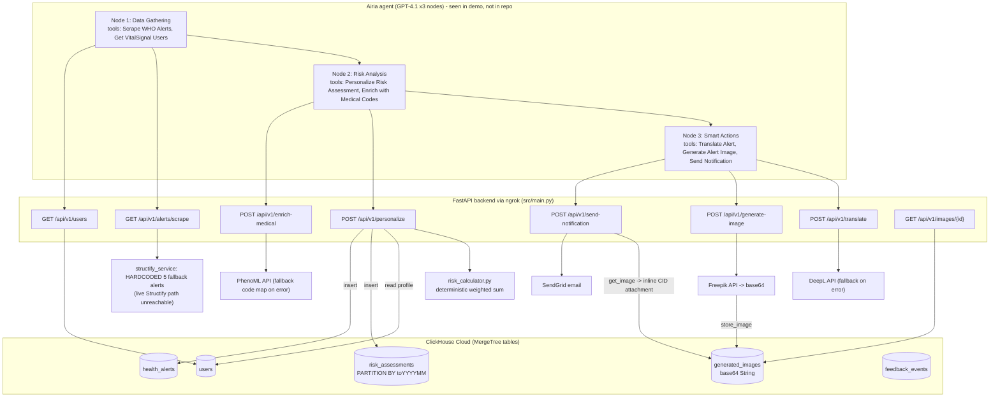

> Imported historical/advisory research. This is not current build authority; follow the ScopeWatch architecture/contracts and START_HERE. Original research date and qualifications remain below.

# Vital Signal (VitalSignal) — ClickHouse 1st place, NYC AI Agents Hackathon (4 Oct 2025)

> **Current execution policy:** [Start now or anytime, with no build cutoff](../../../../../event/BUILD_AUTHORIZATION.md). The human reports that the event is already underway and public schedules are stale. Older start/deadline/duration advice below is superseded; historical timestamps and analytics windows remain evidence, not build gates.

> Analyst: ClickHouse Team A. Read-only analysis, done 8 Oct 2026.
> Evidence labels: **[V]** = verified (file:line, URL, timestamp); **[I]** = inference.
> **New since the 7 Oct research snapshot:** a public repository that matches the submission was found: `richelgomez99/vitalsignal-backend`. The Google Drive demo was also downloaded and reviewed frame by frame. The earlier research recorded "no canonical public repo" and "recording access not checked." Both are now resolved.

## 1. Snapshot

| Field | Value |
|---|---|
| Event | NYC AI Agents Hackathon ("hackdogs"), hosted at Datadog's NYC office. One Saturday, about 135 attendees, about 20 submissions, and every team had to use at least 3 sponsor tools **[V]** (ClickHouse blog, https://clickhouse.com/blog/nyc-ai-agents-hackathon) |
| Date | 2025-10-04 |
| Award | **Best use of ClickHouse, 1st place. Sponsor-confirmed** by the blog heading "First Place - VitalSignal" **[V]**. Also carries the Devpost award badge (per `data/winners.json`) |
| Team | **Solo builder.** Devpost lists only `richelgomez99` (Richel Gomez). The blog says "the builder" and "the VitalSignal creator" and quotes them in the first person **[V]** |
| Devpost | https://devpost.com/software/vital-signal |
| Repo | https://github.com/richelgomez99/vitalsignal-backend. Created 2025-10-04, and its description is word-for-word the Devpost tagline **[V]** (`gh search repos vitalsignal`). The Devpost page itself has **no repo link**. The identity match rests on the same author handle, the same date and the same description **[I, high confidence]** |
| Demo | Google Drive file `Screen Recording 2025-10-04 at 4.27.22 PM.mov`. It runs 108 s at 2880x1480 and **has no audio track** (ffprobe shows only a video stream). It is publicly downloadable **[V]** |
| Hosted app | No standalone UI. The judge entry point was the Airia agent chat (chat.airia.ai) using test credentials posted on Devpost. One commenter (Ben Morss) replied that "those login credentials didn't work for me" **[V]**. *We do not reproduce the credentials here.* |
| Unrelated look-alike | `antoinewrd1/vitalsignal-azure` (2026) is unrelated **[V]** |

## 2. What it is

VitalSignal is a personalized disease-outbreak alerting agent. A disease outbreak alert, such as dengue in Brazil, is scored separately for each stored user profile using health conditions, location, family members' locations, travel plans and age. Users who are actually at risk get an email. The email contains a risk score, the reasons behind it, recommended actions, medical-code explanations (PhenoML), an AI-generated poster (Freepik), and a "family-shareable report" translated into the family's language (DeepL). The pitch: "same alert → different outcomes for different people." The intended user is an immigrant or diaspora family member who learns about a health crisis in a relative's region only "once it hits mainstream news" (blog quote) **[V]**.

## 3. Architecture

**Real stack, as found in code** **[V]**: Python 3.11 + FastAPI backend (`src/main.py`, 829 lines). `clickhouse-connect` client (`src/utils/clickhouse_client.py`). Service wrappers for Structify, PhenoML, DeepL, Freepik and SendGrid (`src/services/*.py`). A deterministic weighted risk calculator (`src/risk_calculator.py`, 477 lines). The backend is exposed through ngrok (`src/services/freepik_service.py:145` hardcodes an `ngrok-free.dev` URL). **Airia** (a no-code agent builder) is the orchestrator. It has 3 GPT-4.1 nodes, "Data Gathering", "Risk Analysis" and "Smart Actions", and each node calls the FastAPI endpoints as custom tools. Airia nodes are not in the repo. They were seen only in the demo video.



## 4. ClickHouse usage deep-dive

**Schema, `src/database_schema.sql`** **[V]**:
- `users`: `ENGINE = MergeTree() ORDER BY (user_id, created_at)` (lines 5-33). Health conditions, medications, family members, travel plans, preferences and `learned_weights` are all stored as **JSON-in-String** columns (lines 15-27). No native JSON/Map/Array types are used.
- `health_alerts`: `MergeTree ORDER BY (disease, published_at)` (36-61). Includes ICD-10, SNOMED and FHIR fields, also JSON strings.
- `risk_assessments`: `MergeTree PARTITION BY toYYYYMM(calculated_at) ORDER BY (user_id, calculated_at)` (64-98). This is the most analytics-shaped table. It stores the per-factor breakdown (`base_severity`, `health_vulnerability`, `geographic_proximity`, `family_exposure`, `travel_risk`, `learned_preference`), plus `reasoning`, `processing_time_ms` and `external_apis_called`.
- `feedback_events` (101-116) and `api_call_logs` (119-137).
- **Materialized view** `risk_assessment_metrics` with `ENGINE = SummingMergeTree()`, which runs daily counts and averages by risk level (139-151). The schema comment calls it "(optional, for demo)".

**Runtime calls, `src/utils/clickhouse_client.py`** **[V]**:
- Connection: `clickhouse_connect.get_client(... secure=...)` (24-31). Health check is `SELECT 1` (37-45).
- `get_user` uses a parameterized query, `{user_id:String}` (84-87).
- `save_risk_assessment` inserts the full factor breakdown (159-189). It is called on every `/personalize` request at `src/main.py:258`, and `save_alert` follows at `main.py:261`.
- `get_metrics` runs `count()`, `GROUP BY risk_level`, `avg(processing_time_ms)` and `GROUP BY service_name` (211-255). This backs `GET /api/v1/metrics` (`main.py:750-758`, docstring: "Useful for demo to show system activity").
- **Image BLOB store.** `store_image` runs `CREATE TABLE IF NOT EXISTS generated_images ... ENGINE = MergeTree() ORDER BY created_at` on the fly and inserts base64 into a `String` column (280-308). `get_image` reads it back (310-324). The write side is `freepik_service.py:140`. The read side is `sendgrid_service.py:55-68`, which turns the image into an inline `content_id: "alert_image"` attachment. This is the "ClickHouse isn't just for time-series - excellent for BLOB storage" story that Devpost tells **[V]**.

```python
# src/services/sendgrid_service.py:55-59
if image_url and "/api/v1/images/" in image_url:
    image_id = image_url.split("/")[-1]
    from src.utils.clickhouse_client import db_client
    image_data = db_client.get_image(image_id)
```

**What is defined but not really live** **[V]**:
- `scripts/init_db.py:27` splits the schema on `;` and **skips any statement starting with `--`**. Every statement in `database_schema.sql` starts with a comment line (`-- Users table`, `-- Materialized view ...`, and so on), so init_db would execute nothing. The team then added `scripts/create_tables_manual.py`, which creates only the 4 core tables (lines 13-99). **That script creates no MV and no `api_call_logs`.** **[I]** The SummingMergeTree MV and `api_call_logs` probably never existed in the demo database.
- `log_api_call` (257-277) is **never called** anywhere in the repo (grep finds only the definition).
- `learned_weights` is read in `risk_calculator.py:279-283` but never updated. Feedback is stored (`main.py:708-732`) and never fed back. The "learning" is schema-only.
- `update_user_languages.py:7-18` sets `preferences = JSONExtractString(preferences,'preferred_language','es')`. This would overwrite the JSON object with a scalar. It is a one-off demo-data hack.

**Depth rating: load-bearing (light).** ClickHouse is the system of record for user profiles, which every personalization needs. It is the write log for every risk assessment, and it is in the critical path of the email image flow. But it uses no analytics-specific features in the live path: no aggregations drive decisions, the MV is probably absent, and JSON is stored as strings. It is used as a general-purpose store. The blog's framing, "ClickHouse sits at the center of the architecture," fits the data flow, but the ClickHouse features in use are basic **[I]**.

**Other sponsors used** **[V]** (Devpost built-with plus code): Airia (orchestration), Structify, PhenoML, DeepL, Freepik, SendGrid. Devpost claims "7 sponsor tools." FastAPI is also listed.

## 5. Claimed vs. real

| Claim (Devpost/README/blog) | Code/demo reality |
|---|---|
| "Structify scrapes 189 real-time WHO/CDC health alerts… not mock data" | **False in code.** `structify_service.py:30-33` unconditionally returns `_get_fallback_alerts()`, which holds 5 hardcoded `HealthAlert`s. The comment reads "For demo reliability, use fallback data… API access needs proper endpoint". The live path sits after `return` and is a TODO **[V]** |
| "Non-deterministic risk engine… true autonomy" | `risk_calculator.py:285-310` is a **fixed weighted sum** (0.25/0.25/0.15/0.15/0.15/0.05) with thresholds (312-323). The thresholds were tuned for the demo: "Lowered from 0.60 to catch more HIGH risk" **[V]**. Results differ by profile, but the engine is deterministic |
| "Behavioral learning / learned weights" | Feedback is stored but never applied (see §4) **[V]** |
| "ClickHouse stores images as BLOBs" | True. Base64 is stored in a `String` column (§4) **[V]** |
| "User profiles in ClickHouse" | True. Demo users `demo_maria`, `demo_john`, `demo_sarah`, `demo_kwame` and `demo_aisha` are seeded by `scripts/init_db.py` and `add_high_risk_users.py` **[V]** |
| "Smart ID mapping" for LLM-produced IDs | Real hack. `main.py:217-241` hard-maps `maria_silva_id` → `demo_maria` and similar, because the LLM kept inventing IDs. The Airia tool prompts in the demo also say "DO NOT create new IDs" **[V]** |
| PhenoML/DeepL/Freepik integration | Real API calls, but each has a silent fallback (`phenoml_service.py:104-136`, `deepl_service.py:62-69`, `freepik_service.py:97-177`) **[V]** |
| Image shown in emails | In the demo emails the image renders as **broken alt-text "Alert Visual"** (frames around 1:28 and 1:36) **[V]**. The headline challenge Devpost says was solved does not visibly work in the recording |
| Credentials | `.env.example` contains what looks like a real ClickHouse Cloud hostname and a sender email, with placeholder secrets. Git history contains assignment lines for API keys and the ClickHouse password (`git log -p -S password`). Values were not inspected or reproduced **[V presence only]** |

## 6. Demo analysis

**Format** **[V]**: a silent 108-second screen recording with no narration, no title card and no problem statement. The filename timestamp, 4:27:22 PM, matches the Airia run timestamp of 10/4/2025 4:27:26 PM. The recording therefore starts about 2 minutes after the last functional commit (16:25:54) and close to the submission deadline. Timestamps below are approximate, sampled every 8 s.

| ~Time | On screen |
|---|---|
| 0:00 | Airia "Test" canvas, "VitalSignal Agent, Version 3.00 (Published)". Input → Data Gathering → Risk Analysis → Smart Actions → Output. The user types "Start workflow" |
| 0:08 | Run starts ("Executing Agent flow…"). The Data Gathering node's tool "Scrape WHO Alerts" is highlighted |
| 0:16 | Tool panel for **"Get VitalSignal Users"**, the ClickHouse-backed tool. Its Purpose text: "Gets all VitalSignal users with their health profiles. CRITICAL: … Use EXACTLY this user_id …" |
| 0:24 | Risk Analysis node: GPT-4.1, with the prompt "Process ALL 5 users completely. For EACH user (demo_maria, demo_john, demo_sarah, demo_kwame, demo_aisha)… Call 'Personalize Risk Assessment'" |
| 0:32-0:40 | Tool panels for "Personalize Risk Assessment" and "Enrich with Medical Codes" (PhenoML) |
| 0:48-0:56 | Live output streaming JSON tool calls, for example `generate_alert_image {disease_name: "Malaria", severity: "MEDIUM", location: "Addis Ababa"}` and a translate call with `"target_language": "AR"` |
| 1:04-1:12 | "Translate Alert" (DeepL) and "Generate Alert Image" (Freepik) tool panels |
| 1:20 | Completion summary: "Each email included: risk score and reasoning, a dedicated visual image, and the report translated… Maria Silva: PT-BR, Sarah Chen: PT-BR, Aisha Hassan: AR". Run stats: **26,245 tokens, $0.0734, 70,386 ms** |
| 1:28 | **Wow moment: the real Gmail inbox.** Subject is a COVID-19 alert for Maria: "Your Risk Level: HIGH, Risk Score 0.51/1.00", "Why this matters to you", recommended actions, "Medical Information (Powered by PhenoML)". The image shows as broken "Alert Visual" alt text |
| 1:36 | Second email: malaria (Ethiopia), MEDIUM 0.40 |
| 1:44 | Third email: "Family-Shareable Report (Translated)" in Portuguese ("Sarah Chen está em risco MÉDIO de contrair dengue em Chicago…"), footer "Powered by AI-driven risk analysis tailored to your profile" |

**Structure:** live run → per-tool sponsor panels → real output in a real inbox. It has no hook, no problem framing, and no ClickHouse console or query on screen. ClickHouse appears only implicitly, as the "Get VitalSignal Users" tool at about 0:16. **[I]** The deciding pitch was probably the live in-person presentation, which this recording doesn't capture. The blog's description of the inspiration ("I have family in different parts of the world…") reads like the spoken pitch.

## 7. Build timeline

Commits, all on 2025-10-04 EDT unless noted **[V]** (`git log`):

| Time (EDT) | Commit |
|---|---|
| 11:39 | `93658be` "Complete Phase 1 - Core API with risk calculator". **3,465 lines in one commit**, including the full schema, ClickHouse client, risk calculator (477 lines) and planning docs (`plan.md`, `tasks.md`, `AIRIA_SETUP_GUIDE.md`) |
| 11:47 / 11:56 | Airia tool guide and ngrok URL docs |
| 12:30 | Structify integration |
| 13:08 | WIP PhenoML |
| 15:59 | `902c64b` "Complete AI Health Guardian System": +1,743/-3,439, adding DeepL, Freepik, SendGrid and image storage in ClickHouse, and deleting the planning docs |
| 16:10, 16:25 | Pycache cleanup; "fix risk calculator + Freepik service" |
| 16:27 | Demo recorded (video filename) |
| 10-05, 10-07 | README edits only |
| 2026-08-03 | "stop tracking venv" |

Size: about 3,700 lines of Python (`find -name '*.py' | xargs cat | wc -l`) plus a 151-line SQL schema. 11 commits in total.

**[I]** The blog describes a 5.5-hour build window. The first commit lands about 1.5-2 hours into the day with 3.4k lines and AI-style planning docs (`plan.md`, `tasks.md`, "Phase 1"). That points to heavy AI-assisted generation from a pre-written plan. The blog confirms prep: "Chose ClickHouse as the database early. Pre-created accounts and API keys for sponsor tools." No evidence suggests code written before the event (the repo was created the same day). The commit history fits "stable core first, then layer integrations," which is the builder's stated approach.

## 8. Why it won (analysis)

The ranking is inference, supported by the cited evidence.

1. **Every agent decision runs through ClickHouse data.** Personalization reads the stored profile, the result is logged to ClickHouse, and the email image round-trips through ClickHouse. The blog's own words are "ClickHouse sits at the center of the architecture," and the builder quote is "I never once had to worry about database limitations… user profiles, scraped JSON alerts, or image metadata" **[V blog]**. ClickHouse's narrative at this event was ClickHouse as the "source of truth" for the "ingest → store → compute → act" loop. VitalSignal is a clean instance of it.
2. **Polished, complete end-to-end loop with a tangible real-world artifact.** The run ends in real emails in a real Gmail inbox. The blog advice section echoes this almost word for word: "A small, polished project beats an ambitious, half-broken one every time," "Define your MVP ruthlessly and build an end-to-end experience that actually works" **[V]**.
3. **"Same alert → different outcome" is an instantly legible demo of context changing agent behavior.** That shows why stored data matters to an agent **[I]**.
4. **Emotional, personal story.** The founder has family in Ethiopia and the Philippines (Devpost), and the blog quotes the inspiration at length **[V]**.
5. **Sponsor breadth.** 7 sponsor tools against a requirement of 3. The blog notes "orchestrating six new platforms under a 5.5-hour deadline". Juries that span sponsors reward this **[I]**.
6. **Small field.** About 20 submissions, with ClickHouse as the only database sponsor ("a large share of them chose ClickHouse") **[V blog]**. Being the strongest ClickHouse-centric product in a small field was enough. The ClickHouse usage didn't need to be advanced **[I]**.

## 9. Weaknesses

- The core "real-time WHO data" claim is hardcoded. Judges evidently didn't check, or didn't weigh it **[V code]**.
- No analytics in the live path. There is no aggregation, trend, or historical query influencing decisions. The MV is probably never created. A competitor running `GROUP BY region, disease` trend detection over ingested alerts would show deeper ClickHouse use **[I]**.
- JSON stored as `String`, base64 images in a MergeTree: these are anti-patterns a ClickHouse engineer would notice. They show the judges rewarded product completeness over idiomatic schema **[I]**.
- The image is broken in the shown emails. "Learning" is unimplemented. The ID-mapping hack shows LLM tool-calling was fragile.
- The silent demo video has no narrative. The judge-test credentials reportedly didn't work (Devpost comment).
- Leaked-secret risk: secrets are present in git history.

## 10. Steal-this (for the Cyberdefense entry)

1. **"Same input → different action because of stored context."** Example: the same CVE or alert gets a different priority per asset because ClickHouse holds asset inventory, exposure and past incidents. Show 3 assets side by side with different outcomes. The cause-and-effect makes the sponsor value obvious.
2. **End the demo in a real external artifact,** such as a real Slack message, email, Jira ticket or PR. A real inbox screenshot was this winner's wow moment.
3. **Persist every agent decision with its factor breakdown.** Mirror `risk_assessments` with columns for each scoring factor, the reasoning, the latency and the tools called, partitioned by month. Then actually query it on stage (a `GROUP BY` over severity) to beat VitalSignal on depth.
4. **Pre-decide the stack and pre-create sponsor accounts and keys** before the event. Write a `plan.md` and `tasks.md`, generate the core in the first 90 minutes, then layer integrations. This is the documented winning process (blog plus commit timeline).
5. **Avoid their mistakes.** Use native `JSON`/`Map`/`Array` types, make sure the MV is actually created (watch schema-splitting bugs), keep secrets out of git, and if data is seeded or simulated, say so upfront. Hiding it is a risk if a sharper judge checks the code.
6. **Tell the personal "why" in one sentence.** Both NYC winners led with a concrete human motivation.
