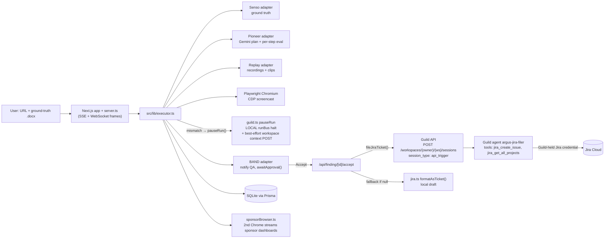

> Imported historical/advisory research. This is not current build authority; follow the ScopeWatch architecture/contracts and START_HERE. Original research date and qualifications remain below.

# Argus — Guild AI (Self-Evolving Agents Hackathon, 24 Jul 2026)

> Analyst: Guild AI Team B. Checked 8 Oct 2026. **First source inspection of this repo** (prior research only verified access). Read-only. **[fact]** = verified; **[inference]** = judgment.

## 1. Snapshot

| Field | Value |
|---|---|
| Event | Self-Evolving Agents Hackathon (tokens& + Senso), DG717 SF, 24 Jul 2026. Devpost shows "20 participants" (registration field, not attendance) and "Winners announced soon" [fact: https://self-evolving-agents.devpost.com/] |
| Prize | **"Best use of agents in Guild"**: $2,000 cash, 3 winners, "Awarded by Guild for the best use of agents in Guild. 1st place: $1,000. 2nd place: $500 (two teams)." [fact, same URL] |
| Rules | "Projects must be built during the event. Maximum team size of 4." Requires a 3-min demo and a public repo [fact] |
| Judging criteria | Idea, Technical Implementation, Tool Use, Presentation, Autonomy (no weights listed) [fact] |
| Award | **Participant-claimed 1st**: "my solo project Argus won ✨ First Prize — Best Use Case of Guild.ai" (Ashna Parekh, LinkedIn activity-7486852658482511872) [fact]. **New corroboration:** Guild Head of DevRel Corbett Waddingham posted on 25 Jul 2026 (02:53 UTC): "special thank you to our winners: Ashna Parekh, C. Lai, Nalin Iyer, Jason Ye, and Von Viray" (LinkedIn activity-7486614556996313088) [fact]. That confirms from the **sponsor side** that Ashna is a Guild winner. It doesn't state ranks, so 1st place remains participant-reported. The Devpost gallery is **still unpublished** as of 8 Oct 2026 [fact: project-gallery page]. |
| Repo | https://github.com/Ashna16/Argus (`repos/guild-ai/argus`, **2 commits**) |
| Demo | https://youtu.be/ybS23YwBhHQ, "Final Argus Demo", 232 s, uploaded **2026-08-22** (about 4 weeks after the event) [fact: yt-dlp]. Not necessarily what judges saw. |
| Team | Solo (Ashna Parekh), with Cursor as co-author on the commit [fact: commit trailer] |

## 2. What it is

Argus is a "universal testing agent" for QA and product managers. You give it a target URL and a product/ground-truth document. Then:
- **Senso** compiles ground truth from the document.
- **Pioneer/Gemini** drafts test cases, and **Replay** finds more.
- **Playwright** runs them live in a split-screen view while recording.
- A model compares each step against ground truth and flags mismatches as bugs.
- **Replay** produces a full-session recording plus an isolated bug clip.
- **BAND** notifies a human QA to Accept or Decline.
- On Accept, a **Guild agent files the Jira ticket** through Guild's Jira connector, with the recording/clip links, "so Argus never holds Jira credentials."

The demo target is saucedemo.com logged in as `problem_user` (README:17).

## 3. Architecture (from code)



About 7.3k lines of TS/TSX [fact: wc]. Senso, Pioneer, Replay, BAND and Actian adapters each switch between mock and real based on environment keys (`src/lib/adapters/config.ts:12-28`).

## 4. Guild usage deep-dive

**Depth rating: core-to-the-pitch (narrow, real).** There's one genuine Guild-hosted capability (the credential-isolated Jira filer) plus a cosmetic "pause" story.

**(a) The Jira filer agent is real and coded deterministically, not as a prompt** [fact]:
```ts
// guild-agents/argus-jira-filer/agent.ts:1, 42-45
"use agent";
const tools = { ...pick(jiraTools, ["jira_create_issue", "jira_get_all_projects"]), ...consoleTools };
```
- It's a code-first `agent({ inputSchema, outputSchema, tools, run })` with typed Zod I/O (agent.ts:16-40, 185-190), compiled with `@guildai/babel-plugin-agent-compiler` (package.json build:transform). Published as `@guildai/ashnaparekh1998~argus-jira-filer` **v1.0.11** [fact: package.json]. Eleven versions suggest a lot of iteration [inference].
- `run()` resolves the project key (input → env → first project from `jira_get_all_projects`) (agent.ts:96-128). It builds an Atlassian Document Format description with clickable Replay links (agent.ts:66-94) and retries the issue type `Task` → `Bug` → `Story` (agent.ts:133-158). Labels: `argus, automated-qa, <severity>`.
- **"Scoped connector / no Jira creds in app": verified.** The app has no Jira REST/auth code; `src/lib/adapters/jira.ts:3-8` explicitly says so and only formats a draft. The Jira credential lives in Guild ("Add the Jira credential inside Guild's dashboard", docs/SPONSORS.md:53). The agent's toolset is limited to create-issue + list-projects. Caveat: `jira_get_all_projects` is a read tool, so the scope is "create + list", not strictly the `issues:create` that SPONSORS.md:54 recommends. Whether the Guild credential itself was scoped can't be verified from code [fact/inference].
- **Invocation from the app** via a **Guild API trigger** [fact]:
  - `POST {GUILD_BASE}/workspaces/{owner}/{workspace}/sessions` with `{session_type:"api_trigger", agent_input}` and HTTP Basic `id:secret` (`src/lib/adapters/guild.ts:19-29, 201-211`).
  - It then polls `/sessions/{id}/events?limit=50` every 2 s for up to 60 s, streams each event line to the UI (`describeGuildEvent`, guild.ts:143-164) and regex-extracts `/browse/KEY-123` or `"key":"KEY-123"` (guild.ts:240-300).
- **Fail-soft fallback:** if Guild returns null, accept/route.ts:126-127 creates a local draft via `formatAsTicket`. **That draft gets a random fake key** `SCRUM-${1000 + random*8000}` (`jira.ts:14`) with status "Draft". SPONSORS.md:56 says it falls back "with **no error shown**" [fact]. Inference: in a demo, a failed Guild call could still show a plausible ticket key.

**(b) The "Guild pauses/monitors the run" claim is mostly local** [fact]:
- `pauseRun()` calls `runBus.pause(runId)` and emits a `guild_pause` UI event with the label "Guild.ai: pausing run" (guild.ts:43-56). The executor calls it on any ground-truth mismatch (executor.ts:409-415).
- A Guild call happens only as **best-effort telemetry**: a POST to `/workspaces/{id}/contexts`, falling back to `/context`. It disables itself after the first rejection because "Trigger API keys are scoped to session creation, so workspace context writes may be rejected" (guild.ts:70-104).
- SPONSORS.md:45: "Full Guild-hosted agent wrapping requires publishing Argus into a Guild workspace. The adapter ... **enforces** halt locally."

So Guild branding is attached to a local pause. Judges hearing "Guild has paused because it found a bug" (demo 01:56) saw a local mechanism [fact + inference].

**(c) Sponsor-dashboard theater:** `sponsorBrowser.ts` drives a second Chrome on a persistent signed-in profile and streams frames of each sponsor's real dashboard into the left pane, because dashboards send `X-Frame-Options: DENY` (README:27-37). On Accept it shows the Guild pane with "Agent / Filing / Project" facts (accept/route.ts:53-61) [fact]. This deliberately makes each sponsor visible on screen at its stage.

## 5. Claimed vs. real

| Claim (LinkedIn / demo) | Reality |
|---|---|
| "Guild's agent files the bug into Jira autonomously ... scoped connector so Argus never holds Jira credentials" | **Backed by code** (agent.ts + guild.ts fileJiraTicket + no Jira auth in app). It's triggered by a human Accept, so it's an approved action, not autonomous selection. |
| "Guild will also pause ... monitor the entire workflow" (demo 00:55, 01:56) | **Mostly local.** The pause is an in-process bus; the Guild context write is optional and may be rejected (guild.ts:70-104). |
| Self-evolving (event theme) | Declined findings become `KnownNonIssue` patterns (SQLite, optional Actian vectors) and are skipped on future runs (executor.ts:411; SPONSORS.md:36, 60). It's a light "learns from declines" loop with no Guild involvement [fact]. |
| A Jira ticket was really filed in the demo | The demo opens a Jira board ticket at 03:00-03:14 [fact: transcript]. Whether it came from the Guild path or the draft fallback can't be verified from video captions alone. The UI only shows "Open in Jira" when `jiraUrl` comes from Guild (accept/route.ts:88-123), which suggests the Guild path worked [inference]. |
| Built during the event | Commit 1 (2026-07-23 17:33) is the create-next-app scaffold only. Commit 2 lands **11,075 insertions in a single commit** at 2026-07-24 16:22, 8 minutes before the 4:30 pm deadline, co-authored by Cursor [fact]. The single-commit shape makes in-event provenance unverifiable [inference]. |

## 6. Demo analysis (ybS23YwBhHQ, 3:52, post-event re-record)

- **[00:00-00:55] Hook + pipeline diagram:** "a universal testing agent ... Senso, Pioneer, Replay, Band ... this is the workflow." Uses saucedemo.com, "a website ... made specifically for QAs ... a buggy website."
- **[00:55-01:12] Guild sponsor moment #1 (diagram):** "if they accept, Guild AI will go into Jira ... We have used Guild to integrate with Jira ... Guild will also pause ... it will monitor the entire workflow."
- **[01:12-01:47] Live run:** uploads the ground-truth doc. "Senso ... has brought 18 ground truths ... Pioneer is using different Gemini versions ... Replay has also found the test case." 11 + 1 = 12 test cases.
- **[01:56-02:20] Guild moment #2:** "Guild has paused because it found a particular bug ... capturing the failure ... waiting your approval."
- **[02:20-02:55] HITL:** per-page batching "because we don't want to bug the QA with a lot of notifications". Two bugs found; accepts "sort order incorrect".
- **[02:55-03:14] Wow moment / Guild moment #3:** "Guild is filing it in real time on our Jira board and it has given us the link". Opens the Jira ticket.
- **[03:14-03:51] Payoff:** the Replay clip highlights the exact frame: "Sauce Labs backpack is $29 but it is shown somewhere at the top".
- Guild is named 8 times in the transcript, at every handoff [fact: grep]. Structure: diagram → live run → human approval → real system-of-record write → evidence clip.

## 7. Build timeline

- 2026-07-23 17:33: scaffold. 2026-07-24 16:22: everything (68 files, +11,075). No later commits [fact].
- The 15 vendored sponsor docs (`docs/sponsors/*-llms.txt`, Replay OpenAPI, Senso HTML) suggest the builder fed sponsor docs to Cursor [inference].
- The repo at HEAD equals what was submitted. The demo video came 4 weeks later but no code changed after the event [fact].

## 8. Why it won (analysis, ranked)

1. **Guild's role is the "last mile" with a security property**: a human-approved, credential-isolated, least-privilege write into a system of record. That's exactly Guild's control-plane pitch (credentials held by the platform, scoped tools) [inference, strong].
2. **Guild appears on screen at every stage**, with sponsor dashboards streamed live and a "Guild agent working" pane (sponsorBrowser + accept route) [fact/inference].
3. **A real artifact lands in a real external system** (a Jira ticket with a Replay clip link). Judges can click it [fact: demo 03:00-03:14].
4. **A code-first Guild agent with typed I/O and resilient retries** (issue-type fallback, project auto-discovery) shows SDK depth beyond a prompt wrapper [fact].
5. **Sponsor stacking (5-6 sponsors)** plus a polished split-screen UI, at a small event (Devpost "20 participants"; Guild lists 5 winner names) [fact/inference].
6. **The builder talked to Guild DevRel**: thanks "Corbett Waddingham and Guild.ai" [fact]. A non-winner noted that "sponsor support plays a big part" and credited Corbett for explaining Guild (Inseon Hwang's LinkedIn post) [fact].

## 9. Weaknesses

- The "Guild pause/monitor" claim is local theater [fact].
- A silent fallback with a fake random ticket key (jira.ts:14; SPONSORS.md:56) is risky for honesty [fact].
- Hardcoded personal Atlassian site and owner defaults (agent.ts:168, 175; guild.ts:177, 274) [fact].
- Polling-and-regex ticket detection (guild.ts:261-281) [fact].
- Guild does just one action. No policy, approval inside Guild, triggers or multi-agent work [fact].
- Single-commit provenance [fact].

## 10. Steal-this (Cyberdefense)

1. **Credential-isolated "file the finding" agent.** Put Jira/GitHub/PagerDuty/ServiceNow credentials in Guild, and give a code-first agent `pick(jiraTools, ["jira_create_issue"])` only. Pitch it as: "our app never holds ticketing credentials; the agent can create, not edit or delete." Screenshot the credential scope for the pitch (SPONSORS.md:54 says exactly this).
2. **A human Accept triggers a Guild API session** (`session_type: "api_trigger"`, Basic `id:secret`), with Guild session events streamed into your UI so judges *see Guild working*.
3. **Evidence-rich tickets:** attach the reproduction artifact (pcap or log excerpt, Semgrep finding with file:line, a recording) as ADF links.
4. **Batch HITL per page/incident** so the analyst isn't spammed.
5. **Make sponsors visible at each stage** (a split pane), but back every on-screen sponsor claim with a real call. Don't brand local logic as Guild.
6. **Decline → suppression memory** (known non-issues) is a cheap "self-improving" story that maps to false-positive suppression in security triage.
