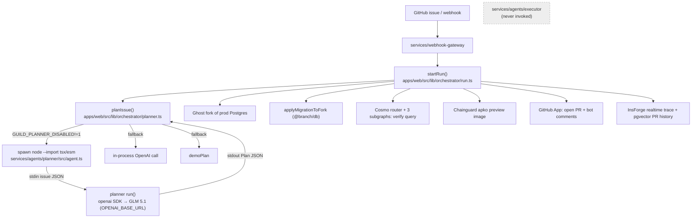

> Imported historical/advisory research. This is not current build authority; follow the ScopeWatch architecture/contracts and START_HERE. Original research date and qualifications remain below.

# Branch — Guild AI track (Ship to Prod, 24 Apr 2026)

## 1. Snapshot

| Field | Value | Evidence |
|---|---|---|
| Event | Ship to Prod – Agentic Engineering Hackathon, AWS Builder Loft SF | https://ship-to-prod.devpost.com/ |
| Award | **Winner – Most Innovative Use of Guild.ai Platform** (rank unpublished). Also won **Chainguard, Best use of Ghost, Best Use of WunderGraph** → **4 sponsor tracks** | Devpost badges, https://devpost.com/software/branch-5zn8h0 |
| Repo | https://github.com/chinesepowered/hack-apr24 (`repos/guild-ai/branch`) | |
| Demo | https://www.youtube.com/watch?v=F-5-mgj1U7M — "Branch", 137 s, uploaded 2026-04-24 by "clai" | yt-dlp |
| Hosted app | none found; `pnpm demo` zero-credential mock mode | Devpost |
| Team | Nelson Lai (devpost `clai74`, GitHub `chinesepowered`) — solo listed | Devpost |
| Devpost "Built with" | only `typescript` | Devpost |

## 2. What it is

Branch is an "autonomous feature-development agent": a developer files a GitHub issue ("add VAT support for EU customers"); Branch produces a structured change plan, forks the production Postgres with Ghost, applies the migration on the fork, verifies through a WunderGraph Cosmo federated query, builds a per-PR Chainguard preview image, and opens a PR authored by a "Branch bot". The UI is GitHub itself (bot comments/commits) plus a dashboard. Users: product teams who want issue-to-PR automation that is tested against production-shaped data.

## 3. Architecture (as found in code)

pnpm/turbo monorepo: `apps/web` (Next.js dashboard + orchestrator), `packages/*` adapters (ghost, github, chainguard, insforge, db, shared), `services/cosmo-router`, `services/subgraphs` (customers/orders/catalog), `services/webhook-gateway`, `services/preview-builder`, and **`services/agents/{planner,executor}`** (Guild coded-agent projects, excluded from the pnpm workspace).



No code path contacts the Guild cloud. "Guild" = the planner file follows the Guild coded-agent file shape and is run as a plain Node subprocess.

## 4. Guild usage deep-dive

**Package:** `@guildai/agents-sdk` declared as an **optionalDependency** (`services/agents/planner/package.json`). The committed `package-lock.json` files contain **no `node_modules/@guildai/agents-sdk` entry** (verified: `grep -c 'node_modules/@guildai'` = 0 in both lockfiles) → the SDK was never installed when the lockfile was generated.

```ts
// services/agents/planner/src/agent.ts:1,127-138,165-176
"use agent";
...
async function loadGuildSdk(): Promise<GuildSdk | null> {
  try {
    const dynImport = new Function("m", "return import(m)") as (m: string) => Promise<GuildSdk>;
    return await dynImport("@guildai/agents-sdk");
  } catch { return null; }
}
...
const sdkAgent = await (async () => {
  const sdk = await loadGuildSdk();
  if (!sdk || typeof sdk.agent !== "function") return null;
  return sdk.agent({ description: "Branch planner — turns a GitHub issue into a structured Plan.",
                     inputSchema, outputSchema, run });
})();
export default sdkAgent ?? { description: "Branch planner (CLI fallback)", run };
```

| Guild feature | File:line | Reality | Depth |
|---|---|---|---|
| `"use agent"` auto-managed directive | `planner/src/agent.ts:1`, `executor/src/agent.ts:1` | Correct marker for Guild's Babel compiler, but only meaningful inside the Guild runtime | decorative locally |
| `agent({description, inputSchema, outputSchema, run})` factory | `planner/src/agent.ts:165-176` | Called only if SDK resolves; otherwise plain object | thin |
| `progressLogNotifyEvent` via `task.ui.notify` | `planner/src/agent.ts:109-120` | Falls back to `stderr` — the path actually taken | thin |
| LLM via Guild `task.llm` | — | **Not used.** Direct `openai` SDK to GLM 5.1 (`planner/src/agent.ts:69-82`). `services/agents/README.md`: "Guild's workspace-level `task.llm` is not used because it does not support per-agent model selection" | — |
| Executor agent | `executor/src/agent.ts` | Spawns `psql` (`:87-100`); **not referenced** anywhere in `apps/`/`packages/` | dead code |
| Triggers / GitHub & Slack integrations | `plan.md:15,24,87,191` | Planned ("GitHub Issue → Guild Trigger (webhook)", "Guild 1st/2nd target") — **not implemented** | claim only |
| Deployability on Guild | — | As written the planner would **fail in Guild's sandbox**: the runtime "only supports `@guildai/agents-sdk` and `zod`… `fetch` exists but cannot connect" (docs.guild.ai SDK intro, Oct 2026), and it imports `openai` + reads `process.env`. Executor imports `node:child_process` (inference; docs may have been looser in April) | not deployable as-is |

**Overall Guild depth: decorative / "Guild-shaped" — 0 Guild API calls.** The "live proof" in `sponsors.md:74-75` is literally `Guild planner agent returned plan (subprocess, zai-org/GLM-5-FP8)` — a Node subprocess, logged by `run.ts:145`.

Other sponsors: Ghost (fork + migrate — load-bearing), WunderGraph Cosmo (router, 3 Pothos subgraphs, MCP gateway — load-bearing), Chainguard (apko/grype preview images, SBOMs committed at repo root), InsForge (realtime trace, pgvector PR history).

## 5. Claimed vs. real

| Claim | Reality |
|---|---|
| Devpost: "Guild trigger fires on GitHub issue webhook → planner agent → executor agent → tool calls back into Cosmo MCP. Plans serialized through Guild's task primitives." | No trigger, no executor call, no task primitives; own `webhook-gateway` + subprocess |
| Devpost: "The autonomous loop is *deployable* on Guild — triggers, durable state, and re-runnable tasks" | Plausible future; uses `openai` SDK that the sandbox disallows |
| `sponsors.md:67`: "same code path that runs after `guild agent deploy`" | `guild agent deploy` is not a documented CLI command (docs: `guild agent save --publish`); `deploy.md:149-150` does use the correct `init --template AUTO_MANAGED_STATE` / `save --wait --publish` |
| README: "executed inside a Guild coded-agent subprocess" | Accurate wording — "subprocess", not "Guild runtime" |
| Demo-mode fallbacks | `USE_MOCK_LLM=1` → `MOCK_PLAN` (`planner/src/agent.ts:65-68,150-159`); orchestrator falls back to `demoPlan` (`planner.ts:29-31,47,50`); executor `USE_MOCK_EXEC` returns fake PR #482 (`executor/src/agent.ts:38-45`) |

## 6. Demo analysis (F-5-mgj1U7M, 137 s)

Structure: problem (iterative coding-agent loop) → solution → GitHub bot artifacts → sponsor list. Mostly narration over the GitHub bot output; no dashboard deep-dive.

- [0:01] "Hi and welcome to Branch, autonomous feature development agent… people see an issue, paste it into their coding agent… repeatedly until they get to open a PR… We automate that whole process."
- [0:33] "someone opens a GitHub issue for add VAT support for EU customers. We plan and we create a fork using Ghost… test the production database against our fix without affecting our production database."
- [0:50] "we verify that actually works thanks to Cosmo. And then we open a PR… we use Chainguard to build the preview runtime."
- [1:08] **Wow moment:** "We created a GitHub bot… all these commits… made by our Branch bot… we didn't need to do a specific UI… our UI is exactly in your workflow."
- [1:24] Sponsor list: Cosmo router/MCP gateway/streams, Ghost, Chainguard per-PR preview image, "**we use AI for the orchestration**" [auto-caption; very likely "Guild AI" — inference], InsForge realtime + pgvector.
- [2:01] "look at sponsors.md to see exactly how we're using each and every sponsor."

Guild appears at most once (1:43), garbled; never shown on screen as a Guild UI.

## 7. Build timeline (PT)

9 commits: 11:08 init → 11:41 `plan.md` (181-line plan naming Guild as a $1k/$500 target) → 14:01 "first shot" (124 files, 7.9k lines) → 14:59/16:20 "checkpoint" (16:20 = 32 files, +10.6k incl. SBOM JSON) → 16:29 cleanup (−1.5k) → 16:31 README → 16:45 fixes → **17:20 "live!" (14 files, after the 16:30 deadline)**. Repo pushed last at 2026-04-25T00:20Z. ~4.2k lines TS/JS. Devpost submitted ~16:23–16:29 PT. Plan-first workflow with docs URLs suggests heavy coding-agent use (inference).

## 8. Why it won (analysis)

1. **Polished, "real" workflow across 4 sponsors** — issue → fork → verify → PR bot is concrete; it won 4 tracks, so judges across sponsors liked it. Guild judges may have rewarded overall quality more than Guild depth (inference).
2. **Speaks Guild's vocabulary precisely**: `"use agent"`, `AUTO_MANAGED_STATE`, `agent()` factory, Zod schemas, `progressLogNotifyEvent`, "the agent boundary is the right unit of governance… a versioned artifact you can roll back" (`sponsors.md:78`). Fluency with brand-new SDK primitives reads as deep adoption.
3. **Coding-agent use case = Guild's own product line** ("Software Factory: agents prepare pull requests, humans approve and merge", guild.ai) — direct narrative fit.
4. **Explicit sponsors.md** with per-sponsor "what we use / where in demo / pitch" — makes judging easy.

## 9. Weaknesses

- Zero Guild runtime usage; SDK never installed; executor never run.
- Planner code violates documented sandbox constraints → "deploy tomorrow" claim untested.
- No human approval in the PR flow; no Guild credential policies on the GitHub App.
- Last functional commit after the deadline.

## 10. Steal-this

- **`sponsors.md` per-sponsor dossier** (what/where-in-demo/pitch/live-proof line). Cheap, judge-friendly.
- **The "bot in the workflow" UI** — security findings delivered as GitHub PRs/comments by a named bot.
- **Ghost-style fork-and-test before prod** maps to Cyberdefense "test the remediation on a clone".
- **Do it for real on Guild:** use `gitHubTools` integration + `task.llm` inside the agent and a GitHub webhook trigger, so the Guild session log is the evidence, rather than a subprocess that merely looks like a Guild agent.
