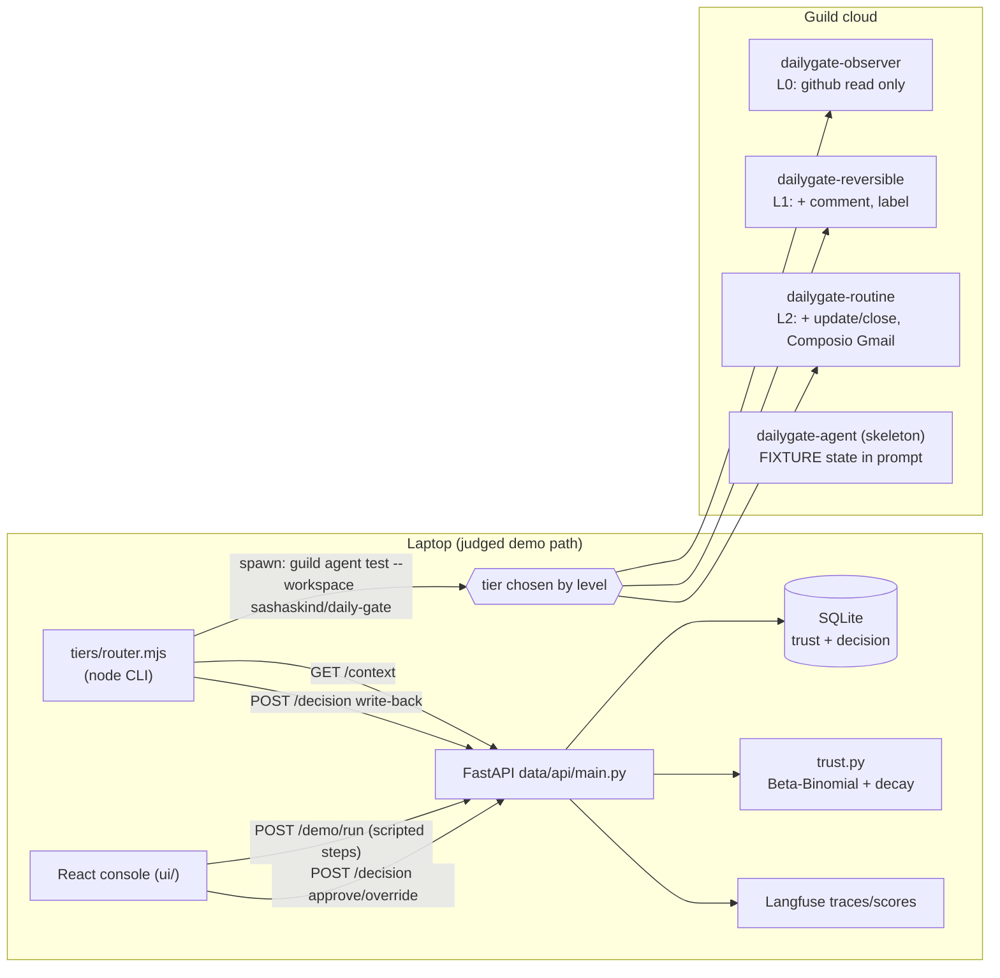
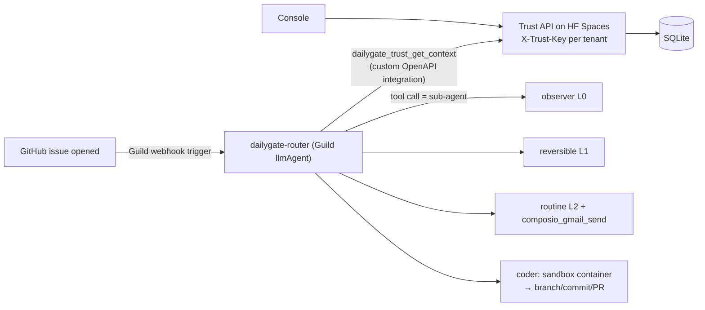

> Imported historical/advisory research. This is not current build authority; follow the ScopeWatch architecture/contracts and START_HERE. Original research date and qualifications remain below.

# DailyGate — Guild AI (Harness Engineering Hack, 12 Jun 2026)

> **Current execution policy:** [Start now or anytime, with no build cutoff](../../../../../event/BUILD_AUTHORIZATION.md). The human reports that the event is already underway and public schedules are stale. Older start/deadline/duration advice below is superseded; historical timestamps and analytics windows remain evidence, not build gates.

> Analyst: Guild AI Team B. Checked 8 Oct 2026. Read-only source analysis; nothing installed or run.
> Labels: **[fact]** = verified at file:line / URL / timestamp. **[inference]** = analyst judgment.

## 1. Snapshot

| Field | Value |
|---|---|
| Event | Harness Engineering Hack (tokens& / Creators Corner), AWS Builder Loft SF, 12 Jun 2026, 187 participants, 78 gallery projects [fact: https://harness-hack.devpost.com/] |
| Prize | **Most Innovative Use of Agents (Guild.ai)**: $2,000 total, 3 winners, 1 x $1,000 (1st), 2 x $500 (2nd) [fact: prizes section, same URL] |
| Award | Devpost "Winner — Most Innovative Use of Agents (Guild.ai)" badge [fact: https://devpost.com/software/dailygate]. **Rank unconfirmed.** Magpie claims 1st, so DailyGate is *probably* one of the two 2nd places [inference: by elimination, only if Magpie's claim is true] |
| Judging criteria | Idea 20%, Technical implementation 20%, Tool use 20%, Presentation (3-min demo) 20%, **Autonomy 20%** ("How well does the agent act on real-time data without manual intervention?") [fact: harness-hack.devpost.com] |
| Repo | https://github.com/SashaSkind/dailygate (`repos/guild-ai/dailygate`, 49 commits) |
| Demo | https://youtu.be/B5a7SoK_7Bs: "DailyGate", 150 s, uploaded 2026-06-12 by Tvisha Shah [fact: yt-dlp metadata] |
| Hosted | README now links a live dashboard plus a trust API on HF Spaces (added after the event in commits 43697e1 / 1249622) [fact] |
| Team | Sasha Skinderev (SashaSkind), Tvisha Shah (commits as "Tvisha") [fact: git log]. The Devpost text says "two engineers (and two Claude Code agents)" |

## 2. What it is

DailyGate is a "chief of staff" agent for an engineering manager. It watches work items from GitHub, Slack and email. For each item it decides whether to **act** (close a duplicate, nudge, send a thank-you email) or **escalate** (a hiring decision, for example). The pitch is **earned autonomy**. Every decision and the manager's response (approved, edited or overridden) feeds a Bayesian trust score per *category* of work. Enough approvals promote a category to a higher **permission tier**, and one override demotes it. "Ceiling" categories such as candidate decisions can never be promoted. The intended user is an engineering manager who doesn't trust an agent that acts on everything and doesn't want one that asks about everything.

## 3. Architecture (as found in code)

Two lanes joined by a frozen JSON contract (`contract/context.schema.json`, `contract/types.ts`):
- **Agent lane (TypeScript, Guild agents-sdk):** permission-tier agents, a router and capability agents.
- **Data/trust lane (Python, FastAPI + SQLite):** the Bayesian trust engine, decision ledger, Langfuse tracing and a React/Vite console.

### 3a. Judged version (state at the 16:55 merge `42b8648`, about the 4:30 pm deadline)



### 3b. Current HEAD (post-event, 13 Jun – 7 Aug)



**Every Guild feature used (HEAD):**
- `llmAgent` with a typed `inputSchema` + `inputTemplate` [router/agent.ts:51-71]
- **agents as tools** (published agents imported as `@guildai/daily-gate~dailygate-*/tool`) [router/agent.ts:9-12, 64-67]
- **Guild GitHub service tools** chosen per tier with `pick(gitHubTools, [...])` [tiers/*/agent.ts]
- a **custom OpenAPI integration** published to Guild (Composio→Gmail bridge) [agent/integrations/composio-gmail.openapi.yaml; tiers/routine/agent.ts:9, 57], plus the trust API as an integration (`@guildai-services/daily-gate~dailygate-trust`) [router/agent.ts:13, 63; data/api/dailygate-trust.openapi.yaml]
- **webhook triggers** (`guild trigger create --type webhook --integration github-oauth --event issues --action opened`) [agent/triggers/setup-trigger.sh:25-30]
- an **org workspace** and org-published agents (`daily-gate~`) [commits 9920b96, c3d7567]
- the **experimental coding container** (`experimental_coding_create/delete`, `communicate`) [coder/agent.ts:8-10, 57, 76-83]
- `useWorkspaceAgents: false` on every agent (isolation) [router/agent.ts:71]
- the Guild CLI MCP server + Guild Claude Code skills checked into the repo [.mcp.json; .claude/skills/*]

Other sponsors: Composio (Gmail send), Langfuse (traces, and manager responses become Scores) [data/api/langfuse_client.py]. The event README *claims* ClickHouse, but the data lane is **SQLite** (`data/api/database.py:8,15` @42b8648) [fact]. ClickHouse appears only in plan/schema docs.

## 4. Guild usage deep-dive

**Depth rating: core-to-the-pitch.** The central claim is that "earned autonomy is a Guild-governed capability grant, not a prompt flag", and the code partly supports it. Each tier is a separate published Guild agent whose **tool list is the permission boundary**:

```ts
// tiers/observer/agent.ts:40-47  (L0)
tools: { ...pick(gitHubTools, ["github_issues_get","github_issues_list_for_repo",
          "github_issues_list_comments_for_repo"]), ...pick(guildTools, ["guild_get_me"]) }
// tiers/reversible/agent.ts:45-52 (L1) adds github_issues_create_comment, github_issues_add_labels
// tiers/routine/agent.ts:50-59   (L2) adds github_issues_update + composio_gmail_composio_gmail_send
```

So "close this issue" really is impossible at L1: `github_issues_update` isn't in that agent's toolset [fact]. This is the strongest pattern in the repo.

**Where the governance is still prompt-only (important for Cyberdefense):**
1. **The ceiling in the cloud router lives only in the prompt.** `router/agent.ts:34-35` says "CEILING categories ... are CAPPED at level 0", but the router is an LLM holding *all four* tier tools at once (`router/agent.ts:62-68`). Nothing in code stops it from calling `routine` for a candidate decision. [fact: code; risk = inference]
2. **The trust read is advisory.** The router "should" call `dailygate_trust_get_context`, but on failure it uses a **hardcoded fallback table** in the prompt (`router/agent.ts:44-46`: `issue-triage=2 · capacity-assignment=2 ...`). That means *fail-open to level 2* for some categories. [fact]
3. **The local judged router enforced the ceiling in code.** `tiers/router.mjs:67-74` (`if (t.ceiling) { level = 0 ... }`) is deterministic, and `trust.py:237-238` (`if ceiling: return 0`) is also deterministic. The 15 Jun move to a cloud LLM router *weakened* enforcement from code to prompt. [fact + inference]
4. `router.mjs:60-61` has a `--level` override ("demo-only, to force the switch on camera") [fact].

**Trust engine (Python, not Guild)** [fact: data/api/trust.py]:
- signal quality: approved +1.0, n/a +0.5, edited −0.4, overridden −1.0 (lines 32-38)
- 30-day half-life decay (line 42); confidence saturates at N=4 (line 46); promotion requires confidence ≥ 0.20 (line 49)
- risk thresholds: low 0.70, medium 0.80, high 0.92 (lines 52-56); reversible band 0.55 (line 59); the risk profile comes from a keyword match on the category name (lines 63-73)
- team calibration: ±0.05 on the threshold from the tenant's override rate (lines 171-186)
- **immediate demotion** when the latest decision is an override or edit (lines 312-324)
- mapping to tiers: `autonomy_level()` (lines 224-243)

**Write-back loop:** `tiers/router.mjs:96-126` parses `ACTED|ESCALATE` from the agent's one-line output with a regex and POSTs `/decision`. ESCALATE becomes `manager_response="pending"`, which the UI shows in the escalation queue [fact]. The Devpost text explains *why* escalation isn't Guild `ui_prompt`: "`ui_prompt` can't run under triggers (non-interactive)", so approvals moved to an async persisted queue [fact: Devpost]. That's a useful Guild constraint to know.

## 5. Claimed vs. real

| Claim | Reality |
|---|---|
| "Earned autonomy is real, Guild-governed permissions" | **Mostly true.** Tier toolsets are real Guild grants. But tier *selection* is made by an LLM router (HEAD) or a local script (judged version), so the gate is only as strong as the selector. |
| Tiers take real actions | **Not at judging time.** At `42b8648`, routine said: "Name the exact tool + key args you invoke, then confirm. (Live delivery is gated only by Gmail OAuth verification ...)". The reversible tier at HEAD *still* says "(In this proof, name the exact tool + key args you would call, then confirm.)" (`tiers/reversible/agent.ts:27`). Real GitHub/Composio execution arrived 13 Jun 23:17-23:46 (commits 68c1e86, 132a612, 3e7cb19), after judging. [fact] |
| "Real-time triggers (a fresh GitHub issue wakes the agent unprompted)" | A trigger setup script exists (`agent/triggers/setup-trigger.sh`, committed 15:56-16:06 on event day). The triggered agent at judging was the **skeleton** `agent/agent.ts`, which reasons over an embedded `FIXTURE` (`agent/agent.ts:10, 64-65` @42b8648), not live data. Devpost's own "What's next" admits "today it triages on a snapshot". [fact] |
| UI "execution panel" shows the agent running | `ui/src/api.ts:73` calls `POST /demo/run`. `main.py:327-406` is a **scripted** narrative (`build_steps` in demo.py) with no Guild call. It records a real decision and recomputes real trust. [fact] Inference: the on-screen "agent acted" feed is DB-driven, not a live Guild session. |
| ClickHouse is the ledger | False. The ledger is SQLite (`database.py`). [fact] |
| "Tiered-agent pattern confirmed by a Guild engineer" | Devpost claim; no independent source. [unverified] |
| "Hard ceiling holds even when we force trust to maximum" | True in `router.mjs:68` and `trust.py:237`. Prompt-only in the HEAD cloud router. |

## 6. Demo analysis (B5a7SoK_7Bs, 2:30, auto-captions)

- **[00:00-00:19] Hook/problem:** "Every AI agent today is stuck between two extremes. Some agents ask for permission for everything ... some do everything on their own and it's kind of terrifying."
- **[00:19-00:38] Concept:** "a team management agent that earns its autonomy over time. It starts cautious and then it earns the right to act more."
- **[00:38-01:16] Architecture walkthrough:** "work arrives through GitHub, email, a Slack message, which is taken in by Composio; it goes through a trust gate where we calculate a Bayesian score ... candidate decision you always need escalation ... a thank-you note could be automated."
- **[01:34-01:53] Results feed:** "it did a code review on its own ... pushed for a stale task ... sent a thank-you note to an open contributor ... nudged an employee."
- **[01:53-02:28] Impact numbers:** "2.3 hours have been saved. 14 things have been acted alone autonomously ... four categories of work that are trusted."
- **Guild is never named in the captions** (grep for "guild" in the transcript finds nothing; only "Composio" is named). Caveat: auto-captions can mishear names. [fact: transcript] There's no live tier switch on camera in the narration. The "wow" is conceptual: the moving line and the Bayesian gate.
- The demo is a UI walkthrough. Guild agent runs, tool grants and promotion events aren't narrated as live. [inference from transcript; video frames not reviewed]

## 7. Build timeline

- Event day (12 Jun, PT): first commit 11:51 → contract scaffold 13:55 → 3-tier ladder + Bayesian trust 14:27-14:28 → write-back loop 15:00 → Langfuse 15:05-15:25 → trigger-ready agent 15:11 → UI polish 16:10-16:27 → YouTube link 16:34 → Guild CLI skills/MCP 16:36 → merge 16:55. **About 27 commits; about 3.2k lines of ts/tsx/py/mjs/sql at 42b8648** (excluding vendored .claude skills) [fact].
- Post-event: real Composio/GitHub execution (13 Jun), router/org publish/coder/digest/scheduler/linear agents (15 Jun), live Bayesian trust via a Guild integration (16 Jun), multi-tenancy (18 Jun), HF Spaces + marketplace listing (27 Jun – 5 Jul), tests + DESIGN.md (9 Jul), README (7 Aug). HEAD is about 4.8k code lines.
- **Most of what makes the repo impressive today (router/agent.ts, coder, live trust integration) did not exist when it was judged.** [fact]
- Prebuilt: Guild's `agent-dev` skill (1,460 lines) was dropped in at 16:36 [fact]. Its use by Claude Code during the build is inference.

## 8. Why it won (analysis, ranked)

1. **Idea matches Guild's own story exactly** [inference, strong]. Guild sells itself as "the control plane for AI agents ... manage, govern" (guild.ai). Its DevRel later posted "Agents do the work. People own the outcome. Humans still merge every PR" (Corbett Waddingham, Software Factory post, Sep 2026). DailyGate *is* governed autonomy, and the tier-per-permission pattern uses Guild's capability-grant model as the product's mechanism.
2. **Hits the "Autonomy 20%" criterion head-on** by framing autonomy as something that grows, with a measurable "acted alone" counter [inference].
3. **Real math, not a counter.** A time-decayed Beta posterior, risk thresholds and immediate demotion read as rigor (trust.py) [fact].
4. **Multiple Guild primitives** (published agents, tool `pick` scoping, a custom OpenAPI integration, a trigger script, a workspace) show platform depth for "Tool Use 20%" [fact].
5. **Clear human-in-the-loop story with a hard ceiling**, which is easy for judges to repeat [inference].

## 9. Weaknesses

- At judging, actions were described, not executed. The live demo was a scripted endpoint plus SQLite [fact].
- The ceiling is prompt-enforced in the cloud router, and the fallback table fails open to L2 [fact].
- Tier output is parsed by regex from free text (`router.mjs:99`). A malformed reply means no write-back [fact].
- Trust is per category with a keyword-derived risk profile (`trust.py:63-73`). A mislabeled category inherits the wrong risk [fact/inference].
- The demo never shows Guild itself (no Guild session or tool-grant view on screen per the captions) [fact/inference].
- A stronger competitor would show a **live** promotion: same request, refused at L1, approved, promoted, executed at L2 against a real system, all on screen.

## 10. Steal-this (Cyberdefense)

1. **One Guild agent per permission tier; the toolset is the permission.** For SOC response: `observer` (read logs/alerts), `contain` (isolate host, disable token: reversible), `remediate` (rotate creds, patch, close: routine). Promotion means handing work to an agent that *physically* has the tool.
2. **Enforce ceilings in code, not prompts.** Put a deterministic gate (like `router.mjs:67-74`) *in front of* the LLM, or give the router only the tier tool it is allowed to call. Fail **closed** (L0) on trust-API failure. DailyGate's fallback table is the anti-pattern.
3. **Bayesian earned autonomy per incident class.** Approve, edit, override → Beta posterior with decay and immediate demotion on override. Ceiling classes: deleting data, disabling MFA org-wide, production firewall changes.
4. **An async persisted approval queue instead of blocking prompts**, because `ui_prompt` can't run under triggers. Approvals become the training signal.
5. **A frozen JSON contract between lanes** to parallelize a 2-person team.
6. **Demo the boundary live.** Ask the L1 agent to "disable this user". It refuses because the tool is absent. Approve 3 times, it gets promoted, re-run, it acts. Show the Guild session/tool list on screen, which is what DailyGate's video lacked.
