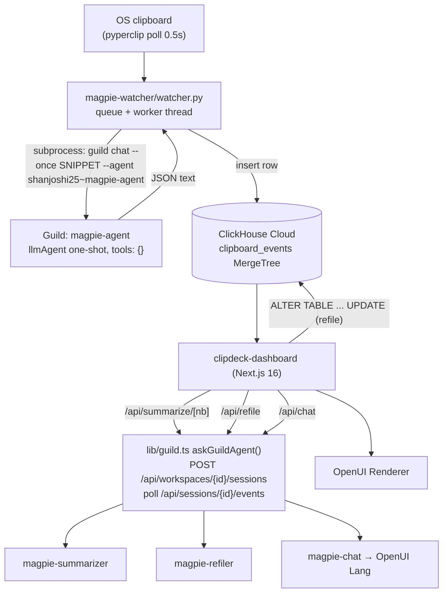

> Imported historical/advisory research. This is not current build authority; follow the ScopeWatch architecture/contracts and START_HERE. Original research date and qualifications remain below.

# Magpie — Guild AI (Harness Engineering Hack, 12 Jun 2026)

> **Current execution policy:** [Start now or anytime, with no build cutoff](../../../../../event/BUILD_AUTHORIZATION.md). The human reports that the event is already underway and public schedules are stale. Older start/deadline/duration advice below is superseded; historical timestamps and analytics windows remain evidence, not build gates.

> Analyst: Guild AI Team B. Checked 8 Oct 2026. Read-only. **[fact]** = verified; **[inference]** = judgment.

## 1. Snapshot

| Field | Value |
|---|---|
| Event | Harness Engineering Hack, 12 Jun 2026, AWS Builder Loft SF (187 participants, 78 projects) [fact: https://harness-hack.devpost.com/] |
| Prize | Most Innovative Use of Agents (Guild.ai): 1 x $1,000 (1st), 2 x $500 (2nd) [fact] |
| Award | Devpost Guild winner badge [fact: https://devpost.com/software/magpie-lcguye; gallery lists DailyGate, proPR, Magpie as the first three entries]. **1st place is creator-reported only.** Shantanu Joshi's LinkedIn post: "🏆 Won 1st place for Most Innovative Use of Agents (Guild.ai) at the Harness Engineering Hack" [fact: LinkedIn post activity-7472151833524727808]. The README makes the same claim (README.md:3). No Guild/organizer post confirming the rank was found. |
| Judging criteria | Idea / Technical / Tool use / Presentation / Autonomy, 20% each [fact] |
| Repo | https://github.com/shantanujoshi25/magpie (`repos/guild-ai/magpie`, 9 commits) |
| Demo | **Found:** https://www.youtube.com/watch?v=HWpXXJRrSqc, "Magpie - AI Note taker", 193 s, uploaded 2026-06-12 (channel "Shan") [fact: Devpost embed + yt-dlp]. This fills the "unresolved demo URL" gap from prior research. |
| Team | 2: Shantanu Joshi, Mehul Mangave [fact: LinkedIn + git log] |
| Other sponsors | ClickHouse Cloud, OpenUI (Thesys) |

## 2. What it is

Magpie is an "ambient study tracker". A Python watcher polls the OS clipboard every 0.5 s. Each copied snippet goes to a Guild classifier agent, which assigns a topic "notebook", a type and a one-line insight. The row lands in ClickHouse, and a Next.js dashboard rebuilds itself live (notebook cards, charts). Three more Guild agents summarize a notebook, re-file "Misc" snippets, and answer questions by emitting **OpenUI Lang**, a UI description the dashboard renders. The user is a student or researcher. The core idea is that every Ctrl+C is an implicit highlight.

## 3. Architecture (from code)



Languages: Python 3.12 (watcher), TypeScript (agents, Next.js 16 / React 19). About 2.9k lines total, including 420 lines of CSS [fact: wc].

## 4. Guild usage deep-dive

**Depth rating: load-bearing but shallow.** Guild is the only LLM path, so every classification, summary and answer goes through it. But all four agents are **tool-less, one-shot prompt wrappers**:

```ts
// magpie-agent/agent.ts:51-56 (same shape in magpie-chat:66-72, magpie-refiler:29-35, magpie-summarizer:22-28)
export default llmAgent({ description: "...", tools: {}, systemPrompt, mode: "one-shot" })
```

- **Two invocation paths:**
  - The CLI: `guild chat --once <snippet> --agent shanjoshi25~magpie-agent` via `subprocess.run`, with a 30 s timeout (`magpie-watcher/watcher.py:93-98`) [fact].
  - The **Guild HTTP API**: `POST https://app.guild.ai/api/workspaces/{WORKSPACE_ID}/sessions` with `{initial_prompt, session_type:"chat", agent_id}`, then poll `GET /api/sessions/{id}/events` every 1 s until the last `runtime_done` event has `content.text` (`clipdeck-dashboard/src/lib/guild.ts:73-84, 100-110, 35-46`) [fact]. This is a useful, reusable recipe for calling Guild agents from a web backend (the other team owns the API surface doc).
- **Auth:** `GUILD_TOKEN` env var, or shell out to `guild auth token`, cached in-process and cleared on 401 (`guild.ts:17-23, 86-91`). The workspace ID and owner prefix are hardcoded (`guild.ts:7-8`) [fact].
- **Robustness glue:**
  - `parseAgentJson` strips code fences and normalizes keys the model drops underscores from (`guild.ts:119-139`); the prompt yells about it too (`magpie-agent/agent.ts:39-45`).
  - The watcher falls back to `"Misc"` on timeout, non-zero exit or bad JSON (`watcher.py:99-124, 138-145`).
  - Chat: `repairDoc` trims to the `root =` line, with a deterministic `TextContent` fallback (`api/chat/route.ts:14-30, 71-79`).
- **"Agents can't reach the database, intentionally"** (README:156). The agents are text in, text out. The **guarded mutation** lives in app code: the refiler's answer is accepted only if it's in the candidate set (`api/refile/route.ts:70-71`) before `ALTER TABLE clipboard_events UPDATE notebook = {nb} WHERE event_id = {id}` (`route.ts:73-77`) [fact]. Note the SQL itself doesn't constrain `notebook='Misc'`. The guard is the earlier SELECT (route.ts:39-46), which is safe in practice but not as tight as the README implies [inference].
- No Guild tools, integrations, triggers, approvals, sub-agents or workspace context are used [fact: no `tools` entries; package.json depends on `@guildai-services/guildai~github` from the template but never imports it].

## 5. Claimed vs. real

| Claim | Reality |
|---|---|
| "Four coordinated Guild.ai agents" | Four separately published one-shot prompts. "Coordination" is the Next.js routes calling them independently. There's no agent-to-agent handoff [fact]. |
| "Capture sits at the OS-level system clipboard, not ... a polling wrapper" (LinkedIn) | The watcher **is** a polling loop (`time.sleep(POLL_INTERVAL_SEC)` at watcher.py:254; the Devpost text says "polls your clipboard every half second") [fact]. |
| "Under three seconds" copy-to-card | Devpost admits cold starts of 8-10 s, mitigated by pre-warming and token caching [fact: Devpost "Challenges"]. |
| Live dashboard is backed by real data | Real ClickHouse queries (chat route.ts:44-60). `clickhouse/seed.js` seeds 30 rows "spread across the last 10 minutes so the timeline widget has shape" [fact]. The demo's "11 snippets ... for neural networks" at 02:29 matches the seed's Neural Networks notebook [inference]. |
| Scheduled summarizer | Listed as "What's next", not built (README:164) [fact]. |

## 6. Demo analysis (HWpXXJRrSqc, 3:13, recorded live in the room)

- **[00:00-00:18] Hook:** "every study session you copy dozens of things ... They all vanish the moment you close the tab. Magpie captures every single one, classifies it, and builds you a structured live queryable notebook without you ever typing a prompt."
- **[00:18-00:54] Sponsor roll-call (sponsor moment #1, about 20 s in):** "guild AI that runs the agents. Every clipboard copy is a live agent invocation ... ClickHouse Cloud ... our data backbone ... OpenUI renders the dashboard."
- **[00:54-02:11] Live run:** starts the Python watcher, copies passages from a **computer-security** reading ("say I'm a student studying computer security"), then Ctrl+C three times.
- Background PA audio at about 02:00-02:20: "less than 10 minutes left to submit ... If you are a general judge, not a sponsor judge ..." [fact]. The recording was made minutes before the deadline.
- **[02:11-02:48] Wow moment:** the dashboard shows the copied paragraphs filed into a "Computer Security" notebook alongside seeded notebooks.
- **[02:48-03:07] Sponsor moment #2:** "Summarize" calls the Guild summarizer and returns "a whole summary of all the notes." The video ends at about 3:07 ("That's about ..."). **Ask Magpie / OpenUI chat is not shown** [fact: transcript].

## 7. Build timeline

All on 12 Jun (PT): initial commit 13:17 → "part2" 15:03 → **"Track A: Guild agent + clipboard watcher" 15:14** → **"Add 3 Guild-powered dashboard features (summarize, re-file, OpenUI chat)" 15:54** → README 16:02. Post-event (14 Jun) changes are README-only; 903 lines of build-plan markdown (`01-setup.md`…`04-polish.md`) were removed in 6220299 [fact]. The LinkedIn claim of "idea to working MVP in 5 hours" fits. All Guild code landed in the final 75 minutes [fact]. The judged code is effectively HEAD minus README edits.

## 8. Why it won (analysis, ranked)

1. **Polished, relatable demo with a visceral beat**: copy text, and a card appears. This scores on Presentation and Idea [inference].
2. **"Ambient, zero-prompt" autonomy.** Every Ctrl+C is an agent invocation, which directly targets the Autonomy 20% criterion ("act on real-time data without manual intervention") [inference, strong].
3. **Multi-agent decomposition is legible**: four named agents with single jobs in a table (README:44-53). The authors say "This is the part that won the track" (README:46). Their claim, not a judge statement [fact/inference].
4. **Generative UI from an agent** (the chat agent's output *is* the UI) is novel [inference].
5. **Guild DevRel engagement.** The team thanks "Corbett Waddingham and Killian Murphy from Guild.ai for their inputs". Both appear on the Luma event page as Guild staff ("Head of Developer Relations @ Guild.ai", "VP Engineering @ Guild.ai") near a "Judges" heading. The search snippet doesn't make clear whether each one judged [fact: LinkedIn post; luma.com/harnesshack search snippet; page not fully read]. Talking to the sponsor judges during the build seems to matter [inference].
6. Three-sponsor stacking (Guild + ClickHouse + OpenUI) [fact].

## 9. Weaknesses

- Guild is used as a hosted prompt runner. There's no governance, tools, triggers or approvals, which is the opposite of Guild's "control plane" pitch [fact/inference].
- The watcher is a local polling loop on one laptop, not a Guild trigger [fact].
- Cold-start latency (8-10 s) [fact: Devpost].
- A hardcoded workspace ID and a personal agent namespace [fact: guild.ts:7-8].
- Seeded data inflates the dashboard [fact/inference].
- A stronger entry would use Guild-native triggers/integrations and show governance.

## 10. Steal-this (Cyberdefense)

1. **The "implicit signal" framing:** turn a passive stream (logs, alerts, clipboard) into per-event agent invocations with zero prompts. For SOC work, every new alert row is a Guild classifier invocation that files it into an incident "notebook".
2. **The `askGuildAgent` recipe** (create session → poll events → last `runtime_done.content.text`) with token caching and 401 reset (guild.ts:58-113). Pre-warm agents before the demo.
3. **Keep agents text-in/text-out and put mutations behind app-side allowlists** (refile guard, route.ts:70-71). This is a good least-privilege story for security judges.
4. **Defensive output parsing:** strip fences, alias keys, fall back deterministically so the demo never crashes.
5. **Record the demo in-room and lead with one visceral beat in under 60 s, then name each sponsor's role in a single sentence.**
6. **Talk to the Guild DevRel/VP Eng judges during the build** and credit them publicly.
