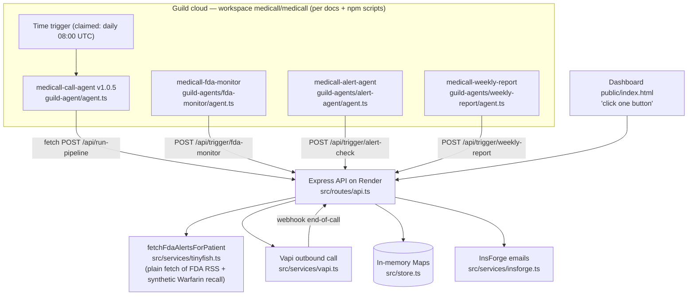

> Imported historical/advisory research. This is not current build authority; follow the ScopeWatch architecture/contracts and START_HERE. Original research date and qualifications remain below.

# MediCall — Guild AI track (Ship to Prod, 24 Apr 2026)

> **Current execution policy:** [Start now or anytime, with no build cutoff](../../../../../event/BUILD_AUTHORIZATION.md). The human reports that the event is already underway and public schedules are stale. Older start/deadline/duration advice below is superseded; historical timestamps and analytics windows remain evidence, not build gates.

## 1. Snapshot

| Field | Value | Evidence |
|---|---|---|
| Award | **Winner – Most Innovative Use of Guild.ai Platform** + **Winner – Best Use of Vapi** | Devpost badges, https://devpost.com/software/medicare-6jtuhn (verified) |
| Rank | **Guild 3rd ($250 tier, one of four)**, Vapi **1st** — *participant-reported* by Kevin Chen: "MediCall just won two sponsor tracks at Ship to Prod — 1st (Vapi) and 3rd (Guild.ai)." (LinkedIn, datePublished 2026-05-01) | https://www.linkedin.com/posts/k3vnc_medicall-just-won-two-sponsor-tracks-at-ship-activity-7456111931733667840-SYDx |
| Repo | https://github.com/abdullahw1/MediCall (`repos/guild-ai/medicall`), 21 commits 10:59–16:48 PT | git log |
| Demo | https://www.youtube.com/watch?v=rzGN9MnGIyc — "hackathon 04/24", 180 s, uploaded 2026-04-24 | yt-dlp |
| Hosted | Render backend `https://medicall-5v26.onrender.com` (hardcoded default in agents) | `guild-agent/agent.ts:7` |
| Team | Abdullah Waheed (`abdullahw1`), Kevin Chen (`k3vnc`) | Devpost |
| Built with | guild.ai (agent-sdk + cli), insforge (@insforge/sdk), npm, render, tinyfish, vapi | Devpost |

## 2. What it is

Daily automated phone check-ins for seniors on medication. Every morning a Vapi voice agent calls the patient, asks whether they took their meds and about symptoms (dizziness, chest pain…), and reads out any active FDA recall affecting their medications. Concerning answers trigger emails to caregiver and doctor (InsForge), and a dashboard shows call outcomes, alerts and a doctor brief. Users: adult children/caregivers and their parents' doctors.

## 3. Architecture (as found in code)



TypeScript backend (~1.6k lines in `src/`), 2.8k-line static dashboard, four Guild agents (324 lines total).

## 4. Guild usage deep-dive

**Real SDK, really installed, really published.** Evidence:
- `guild-agent/package.json`: name `@guildai/medicall~medicall-call-agent` (Guild registry naming `owner~agent`), version `1.0.5`, deps `@guildai/agents-sdk: "*"`, `zod: ^4.3.0`.
- `guild-agent/package-lock.json:101-104`: `node_modules/@guildai/agents-sdk` **version 0.2.40, resolved from `https://app.guild.ai/npm/@guildai/-/019db0f5-…`** → the team authenticated (`guild auth login`) and installed from Guild's private registry. Same in `alert-agent` and `weekly-report` lockfiles.
- Root `package.json:12-16` npm scripts drive the real CLI against a real workspace: `npx --yes @guildai/cli@latest workspace agent list --workspace medicall/medicall --json`, `trigger list`, `session list --type time`.
- Commit `42a49e5` message: "Headers() for Guild compiler" — a change made to satisfy Guild's agent compiler, i.e., they hit runtime-build constraints (inference: they built on Guild).

```ts
// guild-agent/agent.ts:1-3, 57-70, 90-97
"use agent";
import { type Task, agent } from "@guildai/agents-sdk";
...
async function run(input: Input, _task: Task<Tools>): Promise<Output> {
  const baseUrl = input.backend_url.replace(/\/$/, "");
  const url = `${baseUrl}/api/run-pipeline`;
  ...
  const response = await fetch(url, { method: "POST", headers: {...}, body: JSON.stringify(body) });
  ...
  const data = pipelineResultSchema.parse(await response.json());
...
export default agent({ description: "Triggers MediCall's call pipeline via POST /api/run-pipeline …",
  inputSchema, outputSchema, tools: {}, run });
```

| Guild feature | Where | Depth |
|---|---|---|
| Auto-managed coded agents (`"use agent"` + `agent({...})`), 4 of them, each typed with Zod in/out | `guild-agent/agent.ts`, `guild-agents/{fda-monitor,alert-agent,weekly-report}/agent.ts` | real, thin (each = one HTTP POST) |
| Publishing/versioning | package versions 1.0.1–1.0.5; commits `a43d816` "Publish backend run-pipeline agent", `5a262fb` "sync v1.0.5" | real |
| Workspace with 4 installed agents | `docs/guild-judge-walkthrough.md`, `package.json:13` | real (CLI scripts), not independently verified |
| **Time trigger** (daily 08:00 UTC, JSON input pinning `backend_url`) — the autonomy claim | `docs/guild-judge-walkthrough.md` §2 | claimed; not in code (triggers live in Guild) |
| Sessions as "flight recorder" (Chats / Triggers / Agent Tests tabs, token meters) | `docs/guild-judge-walkthrough.md` §2 | judge-facing narrative |
| `task.llm`, integrations, `ui_prompt`, credential policies | — | **not used** (`tools: {}` everywhere) |
| Outbound HTTP from agent via `fetch` | `agent.ts:66` | Worked in April (per demo); **current docs say "`fetch` exists but cannot connect"** and require `guildai~experimental-fetch` — platform changed or this would fail today |

**Overall Guild depth: load-bearing for scheduling/orchestration, thin per agent.** Guild is the scheduler + control plane; all logic lives in the Render backend. Devpost is candid: "Guild.ai runs a small coded agent that calls the deployed API to start the pipeline".

**Judge enablement artifact (unique among winners):** `docs/guild-judge-walkthrough.md` — a 2-minute script telling judges exactly where to click in app.guild.ai ("Organizations → MediCall → Workspaces → medicall"), with prepared "judge lines": *"Guild is our control plane: each capability is a separate installable agent with its own schema and version history—not one prompt doing everything."* / *"Sessions are our flight recorder."*

Other sponsors: Vapi (load-bearing — live phone call, assistant overrides inject name/meds/recalls), InsForge (email delivery only; Devpost admits "patient/call data … uses a structured in-memory store"), TinyFish (**name only** — see below).

## 5. Claimed vs. real

| Claim | Reality |
|---|---|
| Demo 0:24 / 1:15: "Another agent uses **TinyFish** to pull the live FDA recall feed… TinyFish basically flagged that an FDA recall was on his warfarin" | `src/services/tinyfish.ts` does **not call TinyFish**; it `fetch`es the FDA RSS URL (`:43`) and **hard-injects a synthetic Warfarin recall for any patient on Warfarin** (`:32-39`: `// Demo: inject a synthetic Warfarin recall…` "lot #WF-2026-04"). The demo's recall is this string |
| "fleet of four code-first autonomous agents… No prompt engineering, no manual triggers" (Devpost) | Four agents exist; only call-agent's trigger is described; in the demo the call is started with "click one button" from the dashboard (1:22) |
| Autonomous end-to-end | If Vapi fails, `/api/run-pipeline` persists **"Fallback: Vapi unavailable. Simulated successful call."** with status `took_meds` (`src/routes/api.ts:183-191`) |
| Patient data persistence | In-memory `Map`s seeded at boot (`src/store.ts:81-96`) |
| 3rd place Guild | Participant claim only |

## 6. Demo analysis (rzGN9MnGIyc, 180 s)

Emotional hook → how it works (sponsor-by-sponsor) → live call → dashboard close. Two-thirds of the video is the live phone call.

- [0:00] **Hook:** "125,000 Americans die every year from not taking their medications. My neighbor's mom sadly passed away last year because she missed her heart medication for 3 days straight."
- [0:12] Promise: "We call your loved ones every single morning… family and doctor would know within seconds."
- [0:24] **Guild moment:** "Every morning, **G.A.I. [Guild AI] agents wake up autonomously. No human trigger needed.** One agent kicks off the call pipeline. Another agent uses TinyFish to pull the live FDA recall feed…"
- [0:43] Vapi places the call; "dynamically inject the patient's name, medications, and active recalls into the agent's script at call time."
- [0:58] "alert agent fires and InsForge delivers instant email notifications… autonomous end to end."
- [1:15] Patient Samuel Brooks on warfarin + metoprolol; "I'm going to click one button."
- [1:42–2:42] **Wow moment — live call:** "Hey, is this Samuel?… have you had any dizziness, chest pain…?" → "I have dizziness and shortness of breath" → agent escalates; patient asks about recalls → agent recites the Warfarin 5 mg recall and lot number.
- [2:42] Dashboard shows result flagged.

Guild is narrated once (0:24) and not shown on screen; the Guild UI tour was evidently reserved for in-person judging (`guild-judge-walkthrough.md`).

## 7. Build timeline (PT)

10:59 init → 11:33 backend (Kevin) → 12:46 dashboard + **Guild agent-development skill** (`.claude/skills/guild-agent-development/SKILL.md`, 206 lines of Guild CLI/SDK notes) → 13:00 first Guild agent + Kiro specs (`.kiro/specs/vapi-guild-integration`) → 14:56 "update guild agent to code-first" → 15:19–15:44 switch to backend run-pipeline agent, publish, default Render URL, "Remove Guild packages from web app deploy dependencies" → 16:28 multi-agent Guild pipeline (merge) → **16:48 four workspace agents + judge walkthrough (18 min after deadline)**. Tools: Cursor ("Made-with: Cursor"), Kiro specs, Claude skills.

## 8. Why it won (ranked, analysis)

1. **Genuine Guild platform use with proof judges could click**: private-registry SDK install, published versioned agents, a workspace, a time trigger, sessions — and a scripted judge walkthrough of app.guild.ai. Most other winners never touched the Guild cloud in code.
2. **"Autonomous on a schedule" = the rubric's #1 criterion** ("Autonomy — How well does the agent act on real-time data without manual intervention?"). A Guild time trigger is the cleanest possible answer.
3. **Emotional, high-stakes story + live phone call** (won Vapi 1st).
4. **Control-plane vocabulary** ("separate installable agent with its own schema and version history"; "sessions are our flight recorder") mirrors Guild's positioning.
5. Placed only 3rd in Guild (participant claim) — likely because each agent is a trivial HTTP wrapper with no `task.llm`, tools, or governance (inference).

## 9. Weaknesses

- Agents contain no intelligence; Guild is a cron + HTTP caller.
- TinyFish claim is false in code; the key demo recall is synthetic.
- Silent "simulated successful call" fallback is dangerous for a health product.
- Unauthenticated `POST /api/run-pipeline` on a public Render URL — anyone can trigger calls (security weakness).
- No HITL despite medical stakes.

## 10. Steal-this

- **Write a `guild-judge-walkthrough.md`** and rehearse the 2-minute tour of app.guild.ai (agents → sessions → triggers). Have judge-lines ready.
- **Use a Guild trigger** (time or webhook) so the demo can say "no human trigger needed" truthfully.
- **Small, single-responsibility published agents** with Zod schemas and semver; list them via `guild workspace agent list --json`.
- **CLI scripts in package.json** (`guild:agents`, `guild:sessions`) to dump evidence on demand.
- **Ship a project-local Guild skill** for your coding agent (their `.claude/skills/guild-agent-development/SKILL.md`) — it front-loaded SDK constraints (no `Promise.all` in auto-managed agents, only SDK+zod imports).
- Avoid: synthetic data presented as live; unauthenticated trigger endpoints.
