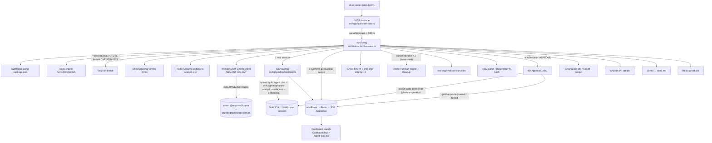

> Imported historical/advisory research. This is not current build authority; follow the ScopeWatch architecture/contracts and START_HERE. Original research date and qualifications remain below.

# Phalanx — Guild AI track (Ship to Prod, 24 Apr 2026)

## 1. Snapshot

| Field | Value | Evidence |
|---|---|---|
| Event | Ship to Prod – Agentic Engineering Hackathon (tokens&, AWS Builder Loft SF) | https://ship-to-prod.devpost.com/ , https://luma.com/shiptoprod |
| Date | Fri 24 Apr 2026; hacking 11:00–16:30 PT, finalists 17:00, awards 19:00 | Devpost rules/schedule |
| Award | **Winner – Most Innovative Use of Guild.ai Platform** (rank 1st/2nd/3rd **not published**). Also won **Chainguard** and **WunderGraph** tracks (3 sponsor wins) | Devpost badges on https://devpost.com/software/phalanx-c2gupz (verified) |
| Prize pool context | Guild: $1,000 (1) / $500 (1) / $250 (4) | Devpost home page |
| Repo | https://github.com/ElijahUmana/phalanx (cloned at `repos/guild-ai/phalanx`) | |
| Demo | https://youtu.be/raOOVmiU3y4 — "Phalanx", 212 s (3:32), uploaded 2026-04-25 | yt-dlp metadata |
| Hosted app | none (README "remove live dashboard link", commit `1ac03dc`) | git log |
| Team | Devpost lists **one member, Elijah Umana**; commit `f64a03c` says "integrate all pending teammate work" and `src/lib/guild/index.ts:1` says "Task #8" — consistent with either teammates or a parallel coding-agent workflow (inference) | |

## 2. What it is

Phalanx is an "autonomous CVE response" pipeline for software supply-chain vulnerabilities. You paste a GitHub repo URL; it pulls the dependency manifest, pulls CVE feeds (NVD/OSV/GHSA), and — the pitch's core primitive — forks the dependency database into N parallel *remediation hypotheses* (upgrade-minor, upgrade-major, pin-and-patch, swap-to-Chainguard), cancels the false-positive hypothesis "mid-flight", validates the survivors in isolated staging backends, gets an approval from an Operator agent, opens a PR and publishes an evidence bundle (signed SBOM, Sigstore, cited.md). The target user is an AppSec / platform team that today takes "60 days to patch" a critical CVE. The governance story — scoped authority per agent role, human approval before production, an audit log of every agent action — is what makes it directly relevant to the Cyberdefense hackathon.

## 3. Architecture (as found in code)

Next.js 16 app (TypeScript) + Redis (event bus/SSE) + a separate `cosmo/` WunderGraph supergraph (4 Connect-gRPC subgraphs, router, MCP gateway, JWT mock). Guild is reached **only by shelling out to the `guild` CLI**.



Sponsor tech present: Guild, WunderGraph Cosmo, Ghost (TigerData), Redis 8, InsForge, TinyFish, Chainguard (dfc/cosign), Nexla, Senso (cited.md), Coinbase CDP/x402. README claims "eight sponsor tools, each architecturally load-bearing" (`README.md:57-78`).

## 4. Guild usage deep-dive

**Transport = CLI subprocess, not SDK/HTTP.** `src/lib/guild/orchestrator.ts:4-18` (header) states it "shells out to the `guild agent chat --mode json` CLI … In production this would swap to the Guild HTTP API directly once a stable Node SDK ships."

```ts
// src/lib/guild/orchestrator.ts:103-110
const sessionId = randomUUID();          // <-- locally generated, NOT Guild's session id
const startedAt = Date.now();
const result = await new Promise<{ stdout: string; stderr: string }>((resolve, reject) => {
    const proc = spawn(
        'guild',
        ['agent', 'chat', '--path', meta.path, '--mode', 'json', '--no-splash', '--ephemeral'],
```

| Guild feature | Where | What it really does | Depth |
|---|---|---|---|
| 5 Guild agents (scanner, analyst, planner, validator, operator) | `src/lib/guild/types.ts:31-37` (`AGENT_NAMES`), `orchestrator.ts:197-353` | Typed wrappers exist for all five, each with a Zod output schema; **only `runAnalyst` and `runApprovalGate` are called** by the pipeline (`scan/orchestrator.ts:35-42` imports only those two). Agent source code is **not in the repo** — `orchestrator.ts:95-100` tells you to `guild agent clone elijah-21296/<name>`; `types.ts:1-4` (post-event edit) says "the agent definitions are published to Guild, not vendored here" | thin wrapper |
| Guild session per agent turn | `orchestrator.ts:90-128` | `guild agent chat --ephemeral` builds an ephemeral version **from local files** (per Guild CLI docs) and runs one session; stdout parsed | real but thin |
| Structured-output boundary | `orchestrator.ts:130-177` (`extractJson`/`unwrapEnvelope`), schemas `types.ts` | Peels CLI JSON envelope / code fences, then `schema.parse()` — good pattern | load-bearing for typing |
| "Audit log" | `orchestrator.ts:179-191` emits `guild.action` with sha256-12 `inputHash`/`outputHash`; dashboard panel titled **"Guild audit log"** (`src/components/dashboard/AgentFeed.tsx:43`) | This is **Phalanx's own Redis event stream**, not Guild's platform audit log/session log. `sessionId` is a local `randomUUID()` (`orchestrator.ts:103`), so it cannot be cross-referenced to a Guild session | decorative branding of own log |
| Cancel broadcast | `orchestrator.ts:265-276` emits `guild.cancel.broadcast` when analyst says FALSE_POSITIVE ≥0.9 | Never drives the demo: the scan pipeline ignores the analyst verdict (`scan/orchestrator.ts:225` `void analystVerdict; // … no local branching yet`) and cancels **fork index 2 unconditionally** (`scan/orchestrator.ts:276` `const cancelledIndex = 2;`) | not wired |
| Human approval gate (Operator, "multi-turn mode with HITL") | `orchestrator.ts:359-436`, call site `scan/orchestrator.ts:397-428` | The pipeline passes `autoDecision: 'APPROVE', autoApprover: 'phalanx-ci-demo', autoReason: 'CI demo auto-approval — replace with human gate in prod'`. That decision is injected **into the LLM prompt** (`orchestrator.ts:388-390` "Pre-approved decision: APPROVE by …"), the LLM echoes JSON, and Phalanx emits `guild.approval.granted` (`orchestrator.ts:406-419`). If the session times out (90 s cap) a **synthetic** `guild.approval.granted` with `fallback: true` is emitted (`scan/orchestrator.ts:415-428`). There is **no approve button** in the dashboard (only `AgentFeed.tsx:54` colours approval events green) | decorative / staged |
| Interactive path | `orchestrator.ts:360-362` "If omitted, the Guild CLI prompts interactively"; `scan/orchestrator.ts:398-401` "A human-gated run … would invoke the same agent via Guild's web UI" | Described, not exercised | claim only |

**Where real authority enforcement lives — WunderGraph, not Guild.** Role → scope table in `cosmo/jwt-mock/src/server.ts:24-46` (ANALYST read-only; REMEDIATOR `write:staging`; ROLLOUT_OPERATOR `write:production` "Gated by Guild human approval in prod"). The pipeline deliberately makes the Analyst call `rolloutProductionDeploy` (`scan/orchestrator.ts:176-181`), the router rejects it via `@requiresScopes`, and the client emits `wundergraph.scope.denied` (`src/lib/wundergraph/client.ts:158-170`). This is the demo's "approval boundary" moment (transcript 1:17).

**Overall Guild depth rating: thin wrapper pitched as core-to-the-pitch.** Two real Guild CLI sessions per scan; their outputs have no effect on control flow (analyst verdict discarded; operator decision pre-written).

Other sponsors: WunderGraph (load-bearing: real scope denial), Ghost (fork/CoW + pgvector, real with 30 s timeout and synthetic fallback `scan/orchestrator.ts:252-258`), Redis (streams/pubsub, real), InsForge (staging rows; post-event patch adds in-memory fallback), Chainguard (dfc/SBOM with `fixtureFallback: true`), TinyFish, Nexla, Senso, x402 (wallet real, **tx hash is a placeholder** `scan/orchestrator.ts:338-350`).

## 5. Claimed vs. real

| Claim (Devpost / README / demo) | Code reality |
|---|---|
| "Guild.ai: 5 published agents (Scanner, Analyst, Planner, Validator, Operator) with sandboxed execution, credential injection, and immutable audit logs" (Devpost) | 5 typed wrappers; 2 invoked; agent definitions not in repo so sandbox/credential claims unverifiable. Audit log shown is the app's own Redis stream |
| "The Operator uses multi-turn mode with a human-in-the-loop approval gate" (Devpost) | Approval is pre-decided in the prompt (`autoDecision: 'APPROVE'`), with synthetic fallback. No human in the loop in the demo path |
| "Everything you see is live" (demo 0:27) | CVE is hardcoded (`scan/orchestrator.ts:49-58` lodash CVE-2020-8203); hypotheses hardcoded (`:60-65`); 3 of 4 analyst lanes synthetic (`:206-224`, `synthetic: true`); cancellation hardcoded (`:276`); x402 tx hash placeholder (`:338-350`) |
| "one analyst just flagged a false positive, and then Redis pub/sub cancels that fork" (demo 2:07) | Redis cancel is real, but the trigger is a constant index with reason string `'false_positive — Analyst-3 confirmed vendor patch already applied upstream'` (`:287`) — not an analyst output |
| "Guild is optional … marks any event that took a substituted path" (`README.md:148`) | True: `synthetic: true` / `fallback: true` flags exist — the honest part |
| README "Governed agent execution … Guild — sandboxed runtime, credentials injected at call time" (`README.md:68`) | Matches Guild's platform properties (docs) but Phalanx's agents do no credentialed tool calls in this repo |

## 6. Demo analysis (YouTube raOOVmiU3y4, 212 s, auto-captions)

Structure: hook stat → one-line product → live run narrated panel-by-panel → sponsor roll-call → impact number.

- **[0:00] Hook:** "Supply chain attacks cause 60-billion dollars a year… average enterprise takes 60 days to patch… Snyk scans it and files a ticket."
- **[0:14] Positioning:** "we fork your entire dependency state, test for fixes in parallel, cancel the false positives mid-flight, and ship the winner with a signed SBOM. This is Phalanx." Pastes repo with lodash, minimist, express, node-fetch.
- **[0:27]** "everything you see is live" — NVD / GHSA / OSV records; CVE-2020-8203 prototype pollution in lodash.
- **[0:42]** TinyFish "real browser navigating real websites"; Ghost memory engine vector match; "dispatching the investigation to four parallel analyst agents".
- **[1:17] Approval-boundary moment (WunderGraph):** "the analyst just tried to call the production deployment operation and got denied. That's per-operation scope enforcement… only the rollout operator can touch production. That's not a feature flag, it's baked into the federated schema."
- **[1:37] Core primitive:** Ghost forks the DB four times, one per hypothesis, each with InsForge staging.
- **[2:07] Wow moment:** "one analyst just flagged a false positive, and then Redis pub/sub cancels that fork across the entire pipeline in under a millisecond."
- **[2:21–2:53]** Validation + Chainguard scoring; TinyFish opens a PR; evidence published to cited.md; Nexla writeback.
- **[2:53] Impact:** "60-day remediation cycle compressed to 90 seconds… every action governed, scoped, and auditable."
- **[3:08] Sponsor roll-call:** "WunderGraph, TinyFish, Ghost, **Guild**, Redis, Chainguard, InsForge, and Nexla… remove any one … and the product breaks."

**Guild on screen:** Guild is named **once** by voice (3:08). The "Guild audit log" panel and `guild.approval.granted` event are visible on the dashboard (inferred from `AgentFeed.tsx`; I did not watch the video frames). The explicit approval-gate step is **not narrated**.

## 7. Build timeline (git, all PT −0700; `git log` is complete, not shallow)

- 14:16 `init` → 14:28 scaffold Next.js 16 + Chainguard Dockerfile (7.5k lines) → 14:42–14:59 Ghost, dashboard, Redis, InsForge, Nexla modules → 15:09 **115-file, 19,940-line commit** "docs: clean up README" (bulk drop of `cosmo/` etc. — prebuilt-in-session or generated) → 15:25–15:50 Senso, TinyFish, x402.
- **15:54 `940f140` "feat(guild): Phalanx agent orchestration — 5 published Guild agents + typed SDK" (+756)**; **15:58 `2de2d3a` "wire real Guild sessions into Phase 2 and Phase 5"**. Guild was the last major integration, ~35 min before the 16:30 deadline.
- 16:02–16:58 deploy/README polishing.
- **After the 16:30 deadline:** 17:12 `eb4db66` "fix: Guild stdin piping", 17:44 `626bb97` "fix(guild): send JSON input to agent chat", 18:15 Nexla real API. So the Guild CLI invocation was being fixed during finalist judging (17:00); the submitted-at-deadline version likely had a broken Guild stdin path (inference from commit messages).
- Aug 17–20 2026: README rewrite, CI, LICENSE, InsForge fallback; only one comment line changed under `src/lib/guild/`.
- Size: ~14.7k lines TS/TSX in app + ~5.1k in `cosmo/`. 37 commits.

## 8. Why it won (ranked, analysis)

1. **Governance narrative matched Guild's product exactly** (inference, strong). Guild markets itself as "The Control Plane for AI Agents… scoped credentials, permissions, policies, and human approval gates" (guild.ai). Phalanx's Devpost: "Agent governance isn't optional — it's the product… Guild's immutable audit log and WunderGraph's per-operation scopes turned out to be the selling points." Judges from Guild (CEO James Everingham, VP Eng Killian Murphy, Bryce Heltzel per Luma) heard their own pitch reflected back.
2. **Five named agents with typed I/O contracts** — reads as a real multi-agent system on Guild (`types.ts` schemas for every role), even though only two run.
3. **Visible "audit log" panel and approval event** labeled Guild on the dashboard, keyed by input/output hashes — tangible "Guild doing governance" on screen.
4. **Sheer breadth + polish:** 10 sponsor integrations, 52+ typed SSE events, won 3 tracks. The track rubric explicitly rewards "Tool Use — at least 3 sponsor tools" (20%).
5. **Security domain:** a CVE-remediation agent with blast-radius controls is the archetypal "needs governance" use case.

## 9. Weaknesses (what judges likely missed)

- The Guild sessions are non-causal: analyst verdict discarded (`scan/orchestrator.ts:225`), cancellation hardcoded (`:276`), approval pre-written into the prompt (`:406-408`). A judge reading the code would see the "HITL gate" is an LLM rubber stamp.
- "Audit trail" uses a locally generated session UUID, not Guild's session id → cannot be reconciled with Guild's real session log.
- Agent code not in the repo → Guild usage is unauditable from the submission.
- Guild accessed via CLI subprocess with 120 s timeouts; brittle (fixes landed after the deadline).
- No Guild credential policy, trigger, integration (`task.tools`), or `ui_prompt` usage — none of the platform's actual enforcement features.
- A stronger competitor: same story, but with the Operator as a Guild agent that uses `task.ui.prompt` / `ask()` to block for a real human, and credential policies that DENY `write`-class operations for non-operator agents.

## 10. Steal-this (Cyberdefense)

- **Role-scoped agents with a deny demo:** ANALYST / REMEDIATOR / OPERATOR scope table (`cosmo/jwt-mock/src/server.ts:24-48`) and a scripted "analyst tries prod and is denied" beat. In Guild terms: separate agents, each `pick()`-ing a minimal toolset, plus a credential policy `DENY` rule — then show the denial live.
- **Zod boundary on every agent output** (`orchestrator.ts:130-177` envelope unwrapping + `schema.parse`).
- **Hash-chained audit events** (`inputHash`/`outputHash`, `orchestrator.ts:179-191`) — but use the *real* Guild session id/URL so judges can click through to app.guild.ai.
- **Provenance flags** (`synthetic: true`, `fallback: true`) on every substituted path — honest and judge-proof.
- **Narrative: "remove any one sponsor and it breaks"** and an impact compression number ("60 days → 90 s").
- **Fix what Phalanx faked:** make the false-positive cancel and the approval actually depend on Guild agent output; give the approval a real human click (Guild `ui_prompt` or a dashboard button that resumes the session).
