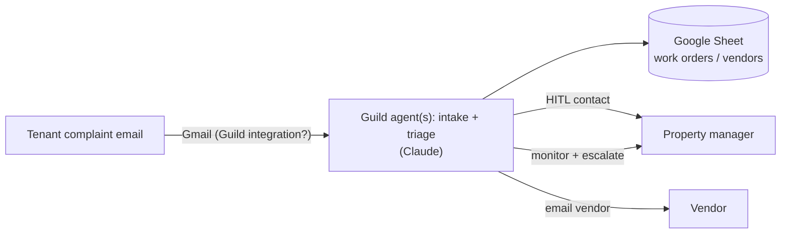

> Imported historical/advisory research. This is not current build authority; follow the ScopeWatch architecture/contracts and START_HERE. Original research date and qualifications remain below.

# proPR — Guild AI (Harness Engineering Hack, 12 Jun 2026)

> Analyst: Guild AI Team B. Checked 8 Oct 2026. **No source code available.** Everything below comes from the Devpost page and searches. **[fact]** = verified; **[inference]** = judgment.

## 1. Snapshot

| Field | Value |
|---|---|
| Event | Harness Engineering Hack, 12 Jun 2026 [fact] |
| Award | Devpost badge: "Harness Engineering Hack — **Winner** — Most Innovative Use of Agents (Guild.ai)" [fact: raw HTML of https://devpost.com/software/propr]. Rank unknown. One of the three Guild winners (1 x $1,000, 2 x $500). If Magpie's 1st-place claim is true, proPR is a 2nd-place ($500) team [inference by elimination; unverified]. |
| Tagline | "Automate property management with the pros." [fact] |
| Team | One listed member: **SarahVSargent Sargent** (devpost.com/SarahVSargent) [fact: "Created by" block]. Team size may be larger off-Devpost [unknown]. |
| Repo | **None linked.** The Devpost "Built With" includes a `github` tag, but there's no link [fact]. |
| Demo | **None found.** The page has no video embed, no images (placeholder thumbnail) and no external links [fact: scrape + raw HTML grep for youtube/vimeo/github]. The event required a 3-min demo recording and a public repo [fact: harness-hack.devpost.com], so this entry apparently won without either being public. |
| Built with | claude, github, google-gmail-oauth, google-spreadsheets, guild [fact] |

## 2. What it is (entire Devpost text, condensed)

- Inspiration: "An overwhelmed, qualming property manager."
- What it does: "Intakes complaints, triages complaints, assigns and contacts human-in-the-loop, initiates vendor contacting, and continuously monitors the repair process, making escalations to humans when needed."
- How: "Guild.ai, Claude."
- Challenges: "Time." Accomplishments: "Progress." Learned: "Scope small." Next: "Scope big (smallily)." [fact]

Inference from the tags: Gmail OAuth for complaint intake and vendor email, Google Sheets as the ticket/vendor ledger, Guild-hosted Claude agents for triage, contact and escalation, and maybe GitHub for code.

## 3. Architecture (inferred, not from code)

**Every edge is inferred from the Devpost tags and one sentence.** None of it is verified.

## 4. Guild usage deep-dive

**Depth rating: unknown (unverifiable).** No code, no demo. The only evidence is the "guild" Built-With tag and "How we built it: Guild.ai, Claude." [fact]. Inference: the Gmail and Sheets tags plus "monitors the repair process" point to Guild-managed integrations (OAuth connectors) and possibly a recurring trigger. That would fit Guild's integration catalog, but that's speculation.

## 5. Claimed vs. real

Nothing can be checked. There's no repo, demo, screenshot or hosted app [fact].

## 6. Demo analysis

No recording located. The Devpost page has none, and searches by project and member name surfaced none [fact]. Judging at this event included live in-room demos (4:30-5:00 PM per the schedule) [fact: harness-hack.devpost.com schedule]. The win was likely earned from the live demo, which left no public trace [inference].

## 7. Build timeline / repository search

- Devpost update: "SarahVSargent Sargent started this project — 4 months ago". The exact timestamp wasn't captured in the scrape [fact].
- **GitHub search (8 Oct 2026):**
  - `gh api users/SarahVSargent/repos` returned 7 public repos (bosque, breakthebarrier [2026-07-04], Food-Forest, khandelwal_shiyao, landscape-cad, maze_code, stock_signals_regressions). **None is from June 2026 or related to property management or Guild** [fact].
  - `search/code q=guildai user:SarahVSargent` returned 0 [fact].
  - `gh search repos propr --created 2026-06-01..2026-06-30` returned only unrelated repos (pphouse/propr-trader, BradEwing/propr-report: Santa Monica Prop R) [fact].
  - "property management" repos created 10-20 Jun 2026: dozens of generic ones, none tied to the team [fact].
- Conclusion: the repo is private, deleted or never pushed [inference].

## 8. Why it won (analysis; low confidence)

1. **Concrete operational pain plus an HITL escalation loop**: complaint intake → triage → vendor outreach → monitoring → human escalation. That maps cleanly onto Guild's "agents do the work, people own the outcome" theme and the Autonomy criterion ("continuously monitors") [inference].
2. **Real integrations (Gmail OAuth, Sheets)** suggest the agent acted on live data in the room demo [inference].
3. With only 3 Guild winners among 78 projects, and many entries not using Guild deeply, a working Guild-native flow could have been enough [inference].

## 9. Weaknesses

There's no public artifact. The write-up is minimal. Nothing about it can be replicated or verified [fact]. Treat this as evidence that **sponsor judges weigh the live demo heavily**, and that the Devpost text barely matters for the Guild prize [inference].

## 10. Steal-this

1. **Pick an unglamorous operational workflow with clear escalation points.** For Cyberdefense: a phishing-report mailbox → triage → contact the user → block the sender → escalate to a human.
2. **Use Guild-managed OAuth integrations (Gmail, Sheets) so credentials never touch your code.** That's a natural security-judge talking point.
3. Don't copy the thin write-up. The award was won *despite* it, and other prizes (or verification later) need a repo and demo.
