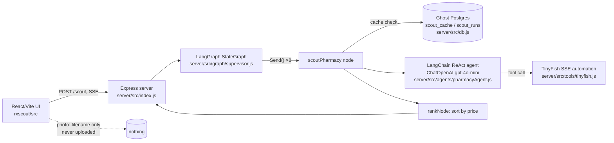

> Imported historical/advisory research. This is not current build authority; follow the ScopeWatch architecture/contracts and START_HERE. Original research date and qualifications remain below.

# RxScout — Guild AI track (Ship to Prod, 24 Apr 2026)

> **Current execution policy:** [Start now or anytime, with no build cutoff](../../../../../event/BUILD_AUTHORIZATION.md). The human reports that the event is already underway and public schedules are stale. Older start/deadline/duration advice below is superseded; historical timestamps and analytics windows remain evidence, not build gates.

## 1. Snapshot

| Field | Value | Evidence |
|---|---|---|
| Award | **Winner – Most Innovative Use of Guild.ai Platform** (only award; rank unpublished) | Devpost badge, https://devpost.com/software/rxscout |
| Repo | https://github.com/bvsbharat/RxScot1 (`repos/guild-ai/rxscout`) — **1 commit**, `a6ffb56` 2026-04-24 13:14:21 PT; repo created 20:12Z, last pushed 20:14Z (= 13:14 PT) and never updated | `gh api repos/bvsbharat/RxScot1` |
| Demo | https://www.youtube.com/watch?v=ZheUbxVqV5A — "demo", 75 s, uploaded 2026-04-24 by Bharat Bhavnasi | yt-dlp |
| Team | Devpost shows one "Private user"; repo owner/uploader Bharat Bhavnasi (`bvsbharat`) | Devpost |
| Built with (Devpost) | chainguard, ghost, guild.ai, insforge, tinyfish (+ react, vite, express, SSE, ghost-postgres, guild-ai, tinyfish-sdk, openai-gpt-4o-mini, multer, pg in text) | |

## 2. What it is

A consumer price-comparison agent for prescription drugs: type a medication (or attach a label photo), and RxScout fans out one agent per pharmacy (Costco, Cost Plus, GoodRx, Walmart, CVS, Walgreens, Kroger, Rite Aid) that browses the pharmacy's site and extracts the cash price, streaming progress to a React UI and ranking the cheapest option. Hook: "One cholesterol pill: $7 at Costco, $393 across the street."

## 3. Architecture (as found in the only public commit)

Dependencies (`server/package.json`): `@langchain/core`, `@langchain/langgraph`, `@langchain/openai`, `langchain`, `express`, `pg`, `zod`. **No Guild package, no `guild` CLI invocation, no multer, no OCR.**

## 4. Guild usage deep-dive — rigorous verification

Searches performed on the full clone (all 35 files, 1 commit, `git branch -a` = only `main`):

- `grep -rniI "guild|agent chat|ephemeral|pharmacy-scout|rx-ocr|rx-parser|experimental-fetch|guildTools"` over the repo (excluding `.git`) → **0 matches**.
- Directory listing: no `server/agents/` directory (Devpost names `server/agents/pharmacy-scout`, `rx-ocr`, `rx-parser`); the only agent file is `server/src/agents/pharmacyAgent.js` (LangChain).
- Photo upload: `rxscout/src/components/SearchScreen.jsx:17,51,116-124` stores only `attachmentName` in React state; `useRxScout.js:34-39` passes it into local query state; server has no upload route (`index.js` routes: `/health`, `/history`, `/history/:id`, `/scout`).
- GitHub: `gh api repos/bvsbharat/RxScot1/branches` → `main` only; only other repo created around the event, `bvsbharat/RxCheep` (created 2026-04-24 15:06Z), is **empty**. `gh search code "pharmacy-scout"` / `"looksLikeInputEcho"` → no relevant hits. `prkshverma09/RxScout` (Sept 2026) is an unrelated CALL-E hackathon project.

**Depth rating: none in public code (Guild claim uncorroborated).**

### What the Devpost says was built (verbatim, the judged narrative)
> "We scrapped an earlier LangGraph supervisor in favor of a simpler pattern: Node owns the fan-out, and each 'agent' is a local Guild AI agent (`server/agents/pharmacy-scout`, `rx-ocr`, `rx-parser`). The server spawns `guild agent chat --ephemeral --mode json` per invocation and parses the JSON reply — no orchestration framework, no graph, just `Promise.all` over the pharmacy list."
> "experimental-fetch — The pharmacy-scout Guild agent fetches the page itself with `guildTools`."
> "rx-ocr agent (GPT-4o-mini via Guild)"
> Challenge: pharmacy-scout "would sometimes just reflect the request payload back at us" → `looksLikeInputEcho()` guard.

### How it could still have won the Guild track (analysis)
1. **The Guild version was likely built after 13:14 and never pushed** (inference, strong). The public commit is the *earlier LangGraph supervisor* the Devpost says was "scrapped"; the Devpost description is detailed and technically specific (exact CLI flags matching Phalanx's pattern, the `experimental-fetch` integration name that exists in Guild docs, a believable "input echo" failure mode), which is the kind of detail people write from experience. The repo's last push (13:14 PT) predates the 16:30 deadline by 3+ hours.
2. **Judging was live, demo-based** (5:00 PM finalist presentations; "3-minute demo"). Guild judges likely saw a run or the team's Guild workspace in person; repo inspection may not have been part of sponsor judging.
3. **Low competition depth in the Guild category**: 6 of ~60 teams won a Guild prize (4 of them $250 3rd-place). Any credible Guild use plausibly placed.
4. **Fan-out of N Guild agents in parallel** is a vivid "multi-agent on Guild" story, and the input-echo learning is genuine platform feedback that a sponsor values.

## 5. Claimed vs. real

| Claim | Public code |
|---|---|
| Nine AI agents (tagline) | 8 pharmacies in `server/src/pharmacies.js` |
| Guild agents pharmacy-scout / rx-ocr / rx-parser | absent |
| Photo → OCR → parsed prescription | UI shows filename only; no backend |
| `Promise.all` fan-out, no graph | Public code **is** a LangGraph graph (`supervisor.js:1-25`, `Send` fan-out) |
| Ghost Postgres cache with 60-min TTL, `scout_runs`/`scout_cache` | Present (`server/src/db.js`, cache read in `supervisor.js:89-101`) |
| TinyFish browsing | Present (`server/src/tools/tinyfish.js:14-40`, SSE to `agent.tinyfish.ai/v1/automation/run-sse`) |
| Chainguard, InsForge (Built-with tags) | No trace in code |

## 6. Demo analysis (ZheUbxVqV5A, 75 s)

Screen-recorded UI only; no architecture, no sponsor callouts.
- [0:00] "user will land on here… type the drug… **TinyFish will trigger all the agents parallelly**… fetching the prices from all the drug stores."
- [0:17] "not all drugs are available across all the stores… gives you the best price."
- [0:37] "We have the prices now. And the best one is in Walmart. And the last one is pending for CVS."
- [0:56] "here is our final price."

**Guild is never mentioned or shown.** Wow moment: price cards resolving live in parallel.

## 7. Build timeline

Single commit at 13:14 PT (+6,761 lines incl. lockfiles; ~1.6k lines JS/JSX) with a co-author trailer `Claude Opus 4.7 (1M context)` — coding-agent generated in ~2 h. Nothing pushed during the remaining 3 h 16 m.

## 8. Why it won (ranked, analysis)
1. Live judging of a Guild version not in the repo (most likely).
2. Strong consumer hook with a concrete $ number.
3. Parallel per-site agents = good multi-agent visual.
4. Small category, 4 consolation-tier slots.

## 9. Weaknesses
- Submitted repo contradicts the Devpost architecture; any code-level review fails the Guild claim.
- No price-accuracy validation; no governance/approval story at all.

## 10. Steal-this
- **Push the judged version.** RxScout shows awards can survive a stale repo, but it is pure risk; in a security hackathon reviewers are likelier to read code.
- Per-target fan-out (one agent per pharmacy ↔ one agent per asset/host/repo) with a cache keyed by (target, query) and TTL.
- Document real platform pitfalls (the "input echo" guard) in the write-up — it signals genuine use to the sponsor.
