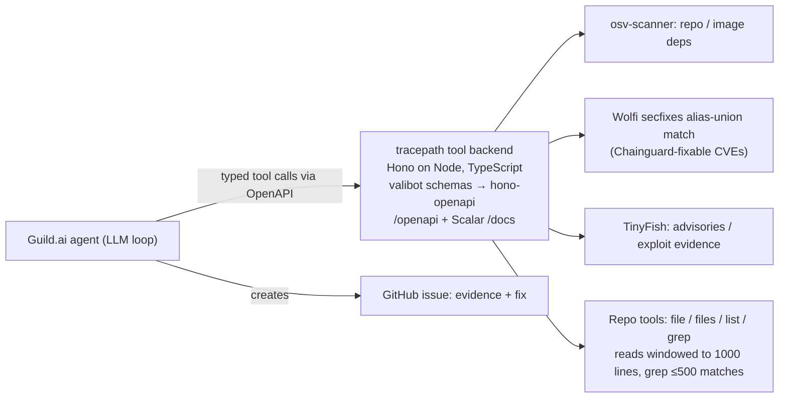

> Imported historical/advisory research. This is not current build authority; follow the ScopeWatch architecture/contracts and START_HERE. Original research date and qualifications remain below.

# tracepath — Guild AI track (Ship to Prod, 24 Apr 2026)

## 1. Snapshot

| Field | Value | Evidence |
|---|---|---|
| Award | **Winner – Most Innovative Use of Guild.ai Platform** (only award; rank unpublished) | Devpost badge, https://devpost.com/software/tracepath-ewops5 |
| Repo | **None linked**; no public repo found | gh searches below |
| Demo | **None** on the page (no video, no "Try it out"); screenshots only | Devpost |
| Team | Clément Boillot (devpost `devpost969`), Baptiste Girardeau (devpost `hello822`); neither Devpost profile links GitHub | Devpost |
| Built with | chainguard, guild.ai, hono, tinyfish, typescript | Devpost |
| Tagline | "a Guild.ai agent that closes CVE tickets instead of filing them. Scans repos/images with osv-scanner, isolates Chainguard-fixable CVEs, traces exploitability via TinyFish, opens issues." | Devpost |

## 2. What it is (Devpost)

A vulnerability-triage agent: give it a GitHub repo or container image; it scans with osv-scanner, matches findings against Wolfi/Chainguard `secfixes` to isolate CVEs fixable by switching to a Chainguard image, traces whether the vulnerable code is actually reachable/exploitable (source navigation + TinyFish advisory retrieval), and opens a GitHub issue with evidence and a fix — "closes CVE tickets instead of filing them". **This is the most directly Cyberdefense-relevant Guild winner.**

## 3. Architecture (submission-described; no code)

## 4. Guild usage (as described — unverified)

Verbatim Devpost:
- "tracepath is the tool backend behind a Guild.ai agent that autonomously triages and remediates vulnerabilities in a GitHub repo or container image."
- "Hono on Node, TypeScript, valibot schemas exposed through hono-openapi so **Guild.ai gets a typed, self-describing tool surface via /openapi** and Scalar docs at /docs."
- "**Bounding LLM context.** The first Guild.ai runs happily asked for 40k-line lockfiles. Every tool grew a cap."
- "Three sponsor integrations (Guild.ai, Chainguard, TinyFish) that each pull their weight in the loop, no glue tools."
- "An agent loop that goes from 'here is a repo' to 'here is an issue with a fix' without a human in the middle."
- What's next: "signed manifest of which tools ran…"

Interpretation: Guild hosts the agent (LLM loop + GitHub issue creation, probably through Guild's GitHub integration) and tracepath is a custom OpenAPI tool service — a pattern Guild supports via integrations/custom services (`guildServiceTool`, `@guildai-services/*` packages in docs). **Depth (claimed): core-to-the-pitch; verified: none.**

## 5. Claimed vs. real
No code, no video. The "40k-line lockfile" anecdote and per-tool caps are specific, experience-flavored details (inference: real Guild runs happened).

## 6. Demo analysis
No video exists on the Devpost page. Not assessable.

## 7. Build timeline
Unknown. Searches: `gh search repos` "tracepath osv / chainguard / guild" → 0; `gh search code` "tracepath osv-scanner", "guildai tracepath" → 0; only 2026 "tracepath" repo is `nujovich/tracepath` (created 2026-07-09, "Agent Audit Stack", unrelated). Candidate accounts `baptiste0928` (name "Baptiste Girardeau", Paris) and `cboillot` have no tracepath repo — identity unconfirmed.

## 8. Why it won (analysis)
1. **Security + agent-native tool design**: an OpenAPI typed tool surface for a Guild agent is "platform-native" thinking; Guild's own pitch is governing agent→tool calls.
2. **Noise reduction story** (reachability, "closes tickets instead of filing them") is a sharp, credible value prop.
3. Concrete platform learnings (context bounding) signal real use.
4. Small category.

## 9. Weaknesses
Nothing public to verify; no demo; no approval step ("without a human in the middle") — a governance-minded judge might prefer a gate before issue/PR creation.

## 10. Steal-this (high value for Cyberdefense)
- **Typed OpenAPI tool backend for a Guild agent** (Hono + valibot + hono-openapi, `/openapi` + `/docs`).
- **Hard caps on every tool's output** (1000-line windows, 500 grep matches) — prevents context blowups on lockfiles/logs.
- **osv-scanner + Chainguard/Wolfi secfixes join** to separate "fixable by image swap" from "needs code change".
- **Reachability before alerting** — fewer, better findings.
- **Signed manifest of which tools ran** (their next step) — make it step one: hash each Guild session's tool calls into the issue body.
