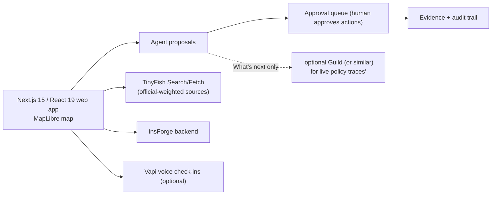

> Imported historical/advisory research. This is not current build authority; follow the ScopeWatch architecture/contracts and START_HERE. Original research date and qualifications remain below.

# WildFire Response (WorldFire Response / SafeSignal) — Guild AI track (Ship to Prod, 24 Apr 2026)

## 1. Snapshot

| Field | Value | Evidence |
|---|---|---|
| Award | **Winner – Most Innovative Use of Guild.ai Platform** (only award; rank unpublished) | Devpost badge, https://devpost.com/software/worldfire-response (verified 2026-10-08) |
| Repo | https://github.com/YuvrajGupta1808/Wildfire-Response → **HTTP 404** (`gh api` "Not Found", rechecked 2026-10-08) | |
| Demo | Embedded YouTube `aWGiSp3kr0E` → yt-dlp: **"This video is unavailable"**. Google Drive `1XN997klIFmQ-SWGQHdO51Q8G7rBo4216` → **HTTP 404** (yt-dlp and curl). **No demo content could be reviewed.** | |
| Team | pramod thebe (`pramodthe`), Yuvraj Gupta (`YuvrajGupta1808`) | Devpost |
| Built with | guild.ai, insforge, tinyfish, wundergraph | Devpost |
| Tagline | "A family-first wildfire command center: official-weighted sources, household status, human-approved agent actions, and optional voice check-ins—without pretending to be 911." | Devpost |

## 2. What it is (from Devpost only)

A web MVP for families during wildfires: aggregates evidence weighted toward official sources, tracks household member status, lists resources, and — the relevant pattern — **an approval queue for agent-proposed actions** with evidence and audit trails. "Demo mode runs without full backend keys; live mode targets InsForge + TinyFish + Vapi."

## 3. Architecture (submission-described; no code available)

The diagram reflects Devpost text, not code. "How we built it" names only Next.js 15, React 19, InsForge, TinyFish Search/Fetch, Vapi and MapLibre.

## 4. Guild usage

**Depth: not evidenced anywhere.** The only Guild mention in the description is under *What's next*: "optional Guild (or similar) for live policy traces". "guild.ai" appears in the Built-with tags. No code, video or sponsor commentary establishes any implemented Guild feature.

## 5. Claimed vs. real

Cannot be assessed against code (404). Internal inconsistency: Guild is tagged as built-with but described as future work. "What we learned" repeats "Accomplishments" verbatim (Devpost) — a sign of a rushed submission.

## 6. Demo analysis

Both demo URLs are dead (YouTube unavailable; Drive 404). **No transcript.**

## 7. Build timeline

Unknown. Searches: `gh repo list YuvrajGupta1808` (57 public repos) and `pramodthe` — no wildfire/worldfire/safesignal repo; repos created around the event are unrelated (Agent-Marketplace, LearnWithAI, Rodex-IDE, arc-marketplace…). `gh search repos/code` for "worldfire", "safesignal wildfire", "wildfire response insforge" → nothing relevant (code search later hit rate limit 403). Repo is private, deleted or renamed.

## 8. Why it won (analysis, low confidence)

1. **Human-approved agent actions + audit trail** is precisely Guild's governance narrative ("human approval gates"), even if implemented in their own app. Judges may have scored the *concept* of governed agents.
2. Live judging: Guild judges may have seen Guild in the in-person demo that is not documented.
3. Socially compelling, safety-conscious framing ("without pretending to be 911").
4. Category had 4 × $250 slots.

## 9. Weaknesses
No verifiable Guild usage; dead repo and video; Guild described as future work.

## 10. Steal-this
- **Approval queue for agent-proposed actions** as a first-class UI object (proposal → evidence → approve/reject → audit). For Cyberdefense: proposed containment actions (block IP, isolate host, revoke token) queued for analyst approval — but implement the gate *in Guild* (`task.ui.prompt` / `ask()`), so the sponsor sees their primitive.
- "Official-weighted sources" ↔ trust-weighted threat intel.
- Keep the repo public and the video on YouTube; this team's evidence evaporated.
