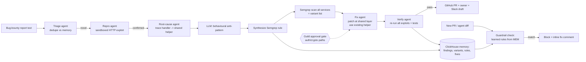
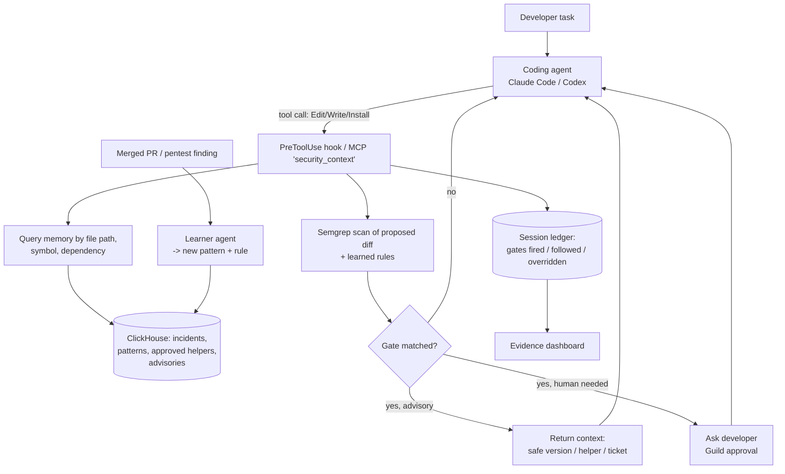
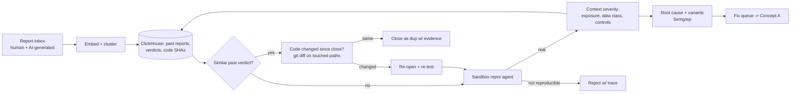
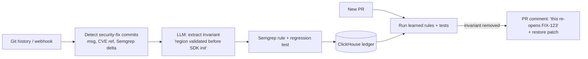

> Imported historical/advisory research. This is not current build authority; follow the ScopeWatch architecture/contracts and START_HERE. Original research date and qualifications remain below.

# What a Pi Security winner probably looks like (inference)

> **Everything in this file is INFERENCE.** I found no verified historical Pi Security sponsor winner, prize text or judge commentary. The 8 Oct 2026 re-search covered pi.security, Guy Arazi's posts, Devpost, the tokens& challenge pages, the organizer's LinkedIn, and GitHub/npm. I could not even confirm that Pi offers a prize at this event (see `_CYBERDEFENSE_EVENT.md` §4).
>
> This model is built from three things:
> - (a) Pi's own product language and blog posts, cited in `_PI_PROFILE.md`.
> - (b) The same organizer's standard rubric: 5 × 20% for Idea, Technical Implementation, Tool Use, 3-min Demo and Autonomy.
> - (c) Defensive-security precedents among past winners in `repos/*/*`.

---

## 1. Evidence base

### 1a. What Pi says it values [F → I]

| Pi signal (quoted, with source) | What a judge will likely reward |
|---|---|
| "Detection is a commodity" / "Finding flaws was always the easy part; fixing them is the hard one" (press release; AWS SDK post) | Projects that **fix and verify**, not just scan |
| "A valid report is a sample, not the finding … Pi works out the shape of a defect rather than its syntax, then sweeps every language" (AWS SDK post) | **Variant hunting**: one seed finding becomes N siblings |
| "The missing check doesn't belong on that one handler. It belongs in the shared middleware" (Bugcrowd post) | A **root-cause fix at the right layer** |
| "A scanner starts every run from zero. Pi starts from everything it has already learned." (Triage Gap) | **Memory that compounds** and is visibly reused on the second run |
| "That memory immediately becomes a live guardrail at … the pull request … can hold the merge" (Lemonade) | **Learned guardrails** that block reintroduction |
| "Sloane carries those gates into every Claude Code session … Nothing is blocked, nothing is proxied" (Claude Compliance API post, 29 Sep 2026) | **Security context injected into coding agents** while they work |
| "Pi reproduces the finding … in a sandbox" / "Fix validated" (Bugcrowd, Lemonade) | **Dynamic proof** of both the exploit and the fix |
| "Severity is not impact" (AWS SDK post) | Scoring that uses the app's real architecture, not CVSS alone |
| "AI multiplied the reports. No one multiplied the judgment." (Triage Gap) | **Triage of noisy, AI-generated reports** using history plus code |

### 1b. How well past winners map onto Pi's pillars

Code I read for this report. Paths are relative to `repos/`. Scope: `repos/clickhouse`, `repos/guild-ai` and `repos/semgrep` only.

| Past winner (sponsor, award) | Pi pillar it touches | Real mechanism | How deep it goes |
|---|---|---|---|
| **Phalanx** (Guild, Ship to Prod category winner) | memory + fix-as-PR | pgvector similar-CVE recall `guild-ai/phalanx/src/lib/ghost/memory.ts:120-147`; PR creation `src/lib/tinyfish/pr-creator.ts:186-284` | **Scripted**: `DEMO_CVE` lodash CVE-2020-8203 is hardcoded (`src/lib/scan/orchestrator.ts:49-58`) and the 4 strategies are fixed (`:60-65`) |
| **DailyGate** (Guild, Harness Hack) | earned autonomy for PR fixes | Beta-Binomial trust per category (`guild-ai/dailygate/data/api/trust.py:124-169`); overrides demote | Real. A good pattern for "auto-merge security fixes only once trust is earned" |
| **RedBot** (ClickHouse, NYC 2nd) | per-target finding memory | past-attack recall in ClickHouse (`clickhouse/redbot/database_schema.py:359-391`) | **Partly faked**: `redbot_app.py:188` reads "DEMO MODE - Always find vulnerabilities" |
| **Darwin** (Semgrep, AWS AI Agents) | prevention by selection | `semgrep --config p/security-audit --json` (`semgrep/darwin/backend/forge/scanner.py:339-347`) with a 40% security weight | Detect-and-select only, no fixes |
| **LicenseTrace** (ClickHouse, Multiagents) | root-cause *path* | BFS of the deps.dev graph keeps the full chain to the copyleft node (`clickhouse/licensetrace/server.js:311-404`) | Real live scan; the report is hardcoded |
| CommitDNA / Udon Cat (Semgrep, AWS AI Agents), tracepath (Guild) | developer-specific learning loop / LLM fixes / reachability | Narrative only (`data/winners.json`); repos returned 404 or are unresolved | — |

**What this shows:**
1. **No past winner did real code-level variant analysis or root-cause tracing.** That is the open lane, and it is exactly Pi's flagship capability.
2. Memory, gating and PR-fix patterns *did* win prizes (Phalanx, DailyGate, RedBot), often with heavy scripting (Phalanx, RedBot).
3. Pi sends two engineers as judges, so expect scripting to be penalised more than DevRel judges penalised it.

### 1c. How other security-vendor sponsors have picked winners

- **Semgrep's own retrospective of the AWS AI Agents hackathon** (https://semgrep.dev/blog/2025/what-a-hackathon-reveals-about-ai-agent-trends-to-expect-2026/) praised these qualities: "security agent directly integrated into the development environment", MCP, "deterministic reasoning from Semgrep" combined with LLM explanation (Darwin, CommitDNA), browser or agent "pre-flight inspection" (AgentSafe), and shift-left guardrails.
  - The pattern: **pairing a deterministic engine with LLM judgment, placed where code is written**.
  - That overlaps heavily with Pi's Sloane-in-Claude-Code positioning.
- The **ClickHouse NYC retrospective** (https://clickhouse.com/blog/nyc-ai-agents-hackathon) singled out RedBot for "chatbot security": a concrete attack demo plus stored findings.
- I found no Snyk, Socket or other AppSec-vendor judge commentary from comparable agent hackathons. That gap is unresolved.

---

## 2. The predicted winning formula for Pi, ranked

1. **The full loop in one demo:** seed finding → reproduce → root cause → variants → one fix at the right layer → verify → memory → guardrail blocks the reintroduction. Pi's whole product is this loop. A project that shows all of it, even on a toy repo, reads as "they get us".
2. **A "second run" moment:** a new PR or agent session reintroduces the bug in different syntax and gets caught by the *learned* rule, not a stock rule. This proves compounding memory, the line Pi repeats most often.
3. **Variants found by behaviour, not regex:** an LLM abstracts the bug into a behavioural anti-pattern, and a deterministic engine (Semgrep rules synthesised from that pattern, or AST queries) finds siblings across files or languages. Show "1 report → N bugs".
4. **A fix in house style using the codebase's existing helper**, with a sandbox test proving the exploit fails after the patch.
5. **Developer-workflow polish:** PR comment on the exact line, owner via CODEOWNERS or git blame, a Slack/Jira draft.
6. **Autonomy with a human gate:** auto-fix low-risk classes and require approval for auth or crypto code (DailyGate-style). This also scores the organizer's "Autonomy" criterion.
7. **Sponsor stack for "Tool Use":** Semgrep as detector and rule engine, ClickHouse as the memory and timeline store, Guild as the agent orchestration and approval layer. The same project can then compete for the Semgrep, ClickHouse and Guild prizes too.

**Anti-patterns that will likely lose Pi's vote:**
- Scanner-only dashboards ("detection is a commodity").
- Generic LLM fixes with no verification.
- A CVSS-only severity score.
- A "memory" that is written but never read (Argus's non-issue memory, as found by the code analysis).
- A hardcoded "always find vulnerabilities" demo mode.

---

## 3. Concrete project concepts, each with an architecture

All four are designed for about 5.5 hours of hacking (11:00 to 16:30). A seeded vulnerable demo repo is acceptable, but the seeded bug class must be *found and fixed live*, not printed from a constant.

### Concept A: "Echo", variant hunting and a guardrail from one bug report (recommended)

**Pitch:** paste one HackerOne-style report ("changing `invoice_id` returns another tenant's invoice"). Echo:
1. reproduces it against the running app;
2. finds the root cause (a missing tenant scope in a shared data-access helper);
3. hunts every sibling IDOR across the services;
4. writes one fix that uses the repo's existing `scopeToTenant()` helper;
5. re-runs the exploits to prove they now fail;
6. stores the pattern in memory and auto-generates a Semgrep rule;
7. blocks a fresh PR that reintroduces the bug.

**Why Pi:** a 1:1 miniature of the Lemonade and Bugcrowd flows, which are the stories Pi tells most.
**Tools:** Semgrep (rule synthesis and scan), ClickHouse (findings, variants and guardrail-hit timeline), Guild (agent roles and approval), OpenAI or Claude (abstraction and patching).

**Demo beat, 3 minutes:**
1. 0:00–0:20: the hook, "1 report → 7 bugs".
2. 0:20–1:30: the live loop.
3. 1:30–2:10: a split view of the exploits passing before and failing after.
4. 2:10–2:40: a new PR written with different variable names gets blocked by the learned rule.
5. 2:40–3:00: the ClickHouse memory timeline and the impact numbers.

### Concept B: "Sloane-lite", security memory inside the coding agent (an MCP server or Claude Code hook)

**Pitch:** an MCP server or Claude Code `PreToolUse` hook that, *while the agent writes code*, injects the organization's learned security context:
- past incidents touching this file;
- the approved safe helper;
- banned dependency versions;
- the ticket to link.

Each session's gates are recorded: fired, followed, or overridden with a reason.

**Why Pi:** it mirrors Pi's newest launch (the Claude Compliance API integration, 29 Sep 2026). A judge from Pi will recognise it immediately.
**Risk:** it can look like "a Pi clone"; frame it as an open-source prototype. It is also less "Autonomy"-heavy, so add an auto-fix step.

### Concept C: "Recall", triage against program history for AI-generated report slop

**Pitch:** ingest a bug-bounty inbox of 30 reports, about half of them AI-generated noise. For each report:
- dedupe against history, but **re-open stale "informational" closes when the code has changed** (the ClickUp and Lovable failure modes from Pi's Triage Gap post);
- reproduce it;
- rescore severity using architecture facts, such as internet-facing, holds PII, gateway enforces tenancy;
- route confirmed ones into the Concept A fix pipeline.

**Why Pi:** directly answers Guy Arazi's 9 Jun post. It is strong on "Attack intelligence: turn fragmented signals into a clear picture".

### Concept D: "Undo-proof", a regression-proof fix ledger (lighter build, best for a solo hacker)

**Pitch:** watch a repo's history. When a security fix commit lands (identified by message, CVE reference or Semgrep delta), extract the invariant it introduced and generate a Semgrep rule plus a unit test. On every later PR, flag any change that *removes* the invariant. This is Pi's anecdote of "a developer accidentally overwrote the fix … Pi recognized the pattern coming back."

**Ranking for Pi's prize [I]:** A > B > C > D. A covers the most pillars and has the strongest live "wow" moment, 1 → N plus a block. B is the most *on-trend* for Pi but risks looking derivative. C is the best fit for the "attack intelligence" track. D is the safest scope.

---

## 4. Demo checklist tuned for two Pi engineers judging [I]

- [ ] Show the **actual exploit request** succeeding, then failing after the fix. Engineers trust HTTP responses over dashboards.
- [ ] Show the **variant count** and click into at least two siblings that look *syntactically different*.
- [ ] Show the fix **diff**, placed in the shared helper or middleware, not the single handler.
- [ ] Show **memory being read**: the second-run block cites the original finding ID.
- [ ] Say Pi's own words back to them, sparingly: "root cause, not symptom", "one report → a class", "security that compounds".
- [ ] Be honest about what is seeded. A README section titled "What's real vs. seeded" protects credibility with engineering judges.
- [ ] Keep it to 3 minutes and put the sponsor-tech moments on screen: the Semgrep rule file, the ClickHouse query and the Guild approval.

## 5. Uncertainties

1. **Whether a Pi prize exists at all**, and its wording. Pi is listed under "Tools and mentorship" in the organizer's post.
2. Whether Pi provides any API or sandbox. If it does, *using it* would likely outweigh everything above.
3. No Pi judge commentary from any past event exists to calibrate against.
4. The judging criteria are inferred from three other tokens& Devposts; this event's Devpost is private (HTTP 403).
5. I directly re-checked the cited lines for Phalanx, Darwin, RedBot and DailyGate; other precedent citations come from a subagent's read-only pass over the cloned repos.
