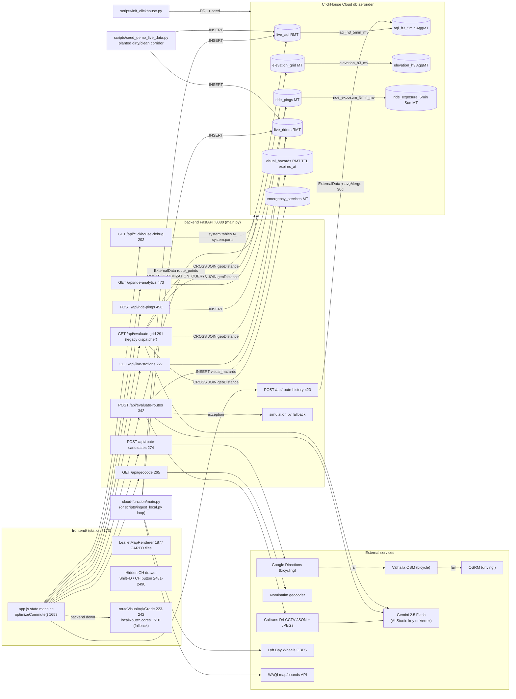

# AeroRider: whole-project deep dive

Round-1 file: [`analysis/clickhouse/aerorider.md`](../archive/source-tree/analysis/clickhouse/aerorider.md). Repo: `repos/clickhouse/aerorider` (https://github.com/ybavgito/AeroRider). Every tracked source file was read in full except `frontend/styles.css` (1,301 lines of presentation CSS, which I only skimmed). I viewed both screenshots and re-pulled the demo captions (YouTube `8JmDTt5OFw4`, 2:19 of speech) on 8 Oct 2026.

Labels: **[V]** = verified at a file:line, URL or caption timestamp. **[I]** = inference.

---

## 1. At a glance

AeroRider is a health-aware bike-route planner for San Francisco. A rider picks a destination. The app fetches 2–3 street-routed bike alternatives and ships every GPS point of every route to ClickHouse Cloud in a single query. ClickHouse then scores each whole route with a "Respiratory Load Index" (RLI) built from air quality per H3 cell, terrain gradient and AI-detected visual hazards. Before the final ranking, Gemini 2.5 Flash looks at the nearest live Caltrans traffic-camera frame for each route. If it reports a hazard, that verdict is written to ClickHouse as a 15-minute TTL row, the same scoring query is re-run, and the recommendation can flip ("AI visual check blocked shortest; rerouted to Balanced", screenshot) [V]. A hidden "CH" drawer shows judges what ClickHouse did.

- **Pitch:** "Most navigation apps optimize for the fastest route. AeroRider optimizes for the route that is the safest for your lungs" (caption 0:04–0:10) [V].
- **Award:** Best Use of ClickHouse category winner at the Harness Engineering Hack, SF, 12 Jun 2026. The creator reports 2nd place, but no official rank is published (`data/winners.json:528-551`) [V].
- **Team:** one git author, Mukunth Vaibhav Ganesh Kumar [V].

**Corrections and additions to round 1:**

1. The visible "hills" are mostly an artifact of a 20-point elevation grid plus a 0-metre default (§8, §10).
2. In the published screenshot, AQI contributed **zero** route-local samples ("Air Readings --"). That flip came from the vision penalty, not from the seeded AQI corridor [V screenshot + I].
3. Both fallback scorers are biased so that "shortest" always looks worse (+28 AQI) [V].
4. The OSRM last-resort fallback uses the *driving* profile [V].
5. The repo is "V2" of an earlier "Medical Dispatcher" app. Its emergency/hospital path is still wired in but is not part of the demo [V/I].

---

## 2. Repo map

```
aerorider/
├── README.md                    161  Devpost-style story + local run instructions
├── .env.example / .gitignore         env template (ClickHouse, WAQI, Gemini, Maps); .env ignored
├── sql/
│   ├── schema.sql               183  11 objects: 7 tables, 3 MVs, 1 ALTER (the ClickHouse core)
│   └── seed_static_data.sql      32  5 hospitals + 20 hand-entered elevation points for all of SF
├── backend/                          FastAPI service (Python 3.12)
│   ├── Dockerfile                14  python:3.12-slim + uvicorn (Cloud Run-shaped; not used in README flow)
│   ├── requirements.txt           4  clickhouse-connect, fastapi, google-genai, uvicorn
│   ├── app/main.py              505  10 HTTP endpoints; closed loop score→vision→insert→re-score
│   ├── app/queries.py           726  9 SQL strings incl. 309-line ROUTE_OPTIMIZATION_QUERY
│   ├── app/clickhouse.py        304  client, ExternalData builder, inserts, debug introspection
│   ├── app/schemas.py           255  Pydantic request/response models with bounds
│   ├── app/routing.py           296  geocode (Nominatim) + Google / Valhalla / OSRM route candidates
│   ├── app/vision.py            184  Gemini vision verdict on Caltrans frame → VisualHazard
│   ├── app/traffic_cameras.py   107  Caltrans D4 CCTV feed parser + nearest-camera search
│   ├── app/dispatcher.py        150  Gemini text: reroute sentence + legacy "Stop pedaling" alert
│   ├── app/simulation.py        156  no-ClickHouse fallback scorer (Gaussian smog/hill fields)
│   ├── app/config.py             49  env-backed frozen Settings dataclass
│   └── tests/test_simulation.py  57  4 unittest cases, all on the simulation fallback only
├── cloud-function/main.py       164  GCF/Cloud Scheduler ingester: Lyft GBFS + WAQI → ClickHouse
├── scripts/                          *.sh wrappers + init_clickhouse.py (SQL splitter), ingest_local.py
│                                     (loops the cloud function locally), seed_demo_live_data.py (planted AQI)
├── frontend/                         static vanilla-JS app, served by `python -m http.server`
│   ├── index.html               233  panels, hidden CH drawer (Story/Query/Data/Result tabs)
│   ├── app.js                  2504  state, API calls, Leaflet map, Three.js + canvas terrain alternates
│   ├── styles.css              1301  styling (skimmed)
│   └── config.js / config.example.js  API base URL (localhost:8080 / Cloud Run placeholder)
└── docs/screenshots/*.jpg            2 screenshots (route view; CH drawer with camera verdict)
```

**Lines of code (hand-written; `wc -l`):**

| Language | Files | Lines |
|---|---|---|
| Python, backend app | 11 | 2,733 |
| Python, tests / cloud function / scripts | 5 | 411 |
| JavaScript | 3 | 2,506 |
| CSS | 1 | 1,301 |
| HTML | 1 | 233 |
| SQL | 2 | 215 |
| Shell | 7 | 75 |
| Docs/config (README, env, Dockerfile, reqs) | — | ~255 |
| **Total tracked text** | 38 | **7,729** |

No generated, vendored or template code. There is no create-next-app, no shadcn and no node_modules. Leaflet and Three.js load from unpkg at runtime (`index.html:7,230`, `app.js:1`) [V]. **Hand-written ≈ 7,480 lines excluding docs/env.** About 1,600 lines of `app.js` are UI rendering and two alternate terrain renderers (Three.js `app.js:2047-2274` and canvas `2276-2429`) that the demo never uses because Leaflet is the default (`app.js:2431-2439`) [V]. The `?v=vision-ui-5` cache-buster (`index.html:8,231`) suggests at least five UI iterations [I].

---

## 3. System architecture

### Component diagram (as found in code)



### Sequence: the demo flow ("Find Healthiest Route" → reroute → drawer)

```mermaid
sequenceDiagram
  actor R as Rider/Presenter
  participant FE as app.js
  participant BE as FastAPI main.py
  participant RT as routing.py
  participant CH as ClickHouse Cloud
  participant CAM as Caltrans CCTV
  participant G as Gemini 2.5 Flash

  R->>FE: type "Financial District Office", click Find Healthiest Route
  FE->>FE: resolveDestination (preset list 17-23) / GPS or DEFAULT_ORIGIN 386-406
  FE->>BE: POST /api/route-candidates
  BE->>RT: google → valhalla → osrm (286-296)
  RT-->>FE: ≤3 routes, ≤900 pts each, ids shortest/arterial/scenic
  FE->>BE: POST /api/evaluate-routes {routes, fallback_aqi}
  BE->>CH: ROUTE_OPTIMIZATION_QUERY + ExternalData(route_points TSV)
  CH-->>BE: ranked rows (rli, load_score, h3 counts) [query 1]
  loop each candidate route (main.py:150)
    BE->>CH: SELECT geoToH3(point@58%) (clickhouse.py:122)
    BE->>CAM: nearest in-service camera ≤5 km, fetch JPEG
    BE->>G: image + JSON-only hazard prompt (cached per URL / 2 min)
    G-->>BE: {hazard, hazard_type, confidence, severity, evidence}
  end
  alt any hazard
    BE->>CH: INSERT visual_hazards (expires_at = now+15m)
    BE->>CH: ROUTE_OPTIMIZATION_QUERY again [query 2]
  end
  BE->>G: reroute sentence (dispatcher.py:128) — overwritten if vision flipped
  BE-->>FE: selected route, scores, vision_checks, pre_vision_selected_route_id
  FE->>FE: status "AI visual check blocked X; rerouted to Y" (1634-1636)
  FE->>BE: POST /api/route-history (30d hourly avgMerge)
  R->>FE: click "CH" (hidden drawer)
  FE->>BE: GET /api/clickhouse-debug (8 s refresh)
  BE->>CH: system.tables ⟕ system.parts, max(event_time) per table, active hazards
  FE-->>R: Story metrics, camera cards, hardcoded SQL "Query" tab, table rows/engines
```

---

## 4. Component walkthrough

### 4.1 ClickHouse schema (`sql/schema.sql`)
Seven tables and three MVs. Details are in §5 and the patterns in §13. The design separates **latest-state tables** (`live_riders` and `live_aqi`, both `ReplacingMergeTree(version)` ordered by entity id; `:3-32`) from **history rollups** fed by MVs at insert time (`aqi_h3_5min`, `:34-62`). Because `live_aqi` is `ORDER BY sensor_id` with a replacing engine, background merges keep only the newest row per sensor. The 5-minute history survives only in the MV target, which is a clean split whether or not it was intentional [V/I]. `ride_pings` gets an `h3_cell` MATERIALIZED column (`:122`) and a SummingMergeTree exposure rollup (`:129-159`). `visual_hazards` is the AI write-back table with row-level TTL on `expires_at` (`:161-180`). Line `:182-183` re-applies the `live_aqi` TTL as an ALTER, which suggests the TTL was changed on a live table [I].

### 4.2 ClickHouse client layer (`backend/app/clickhouse.py`)
- `get_client()` is an `lru_cache` singleton over `clickhouse_connect` HTTPS 8443 (`:28-40`).
- `_route_points_external_data()` (`:82-98`) serialises every point of every route to TSVWithNames and attaches it as an **external temporary table `route_points`**. The SQL reads it with `FROM route_points` (`queries.py:284,590`). No staging table and no cleanup are needed.
- Every query is timed with `perf_counter` and the result is returned as `query_ms` for the UI (`:43-51, 101-119`).
- `insert_visual_hazards` (`:131-175`) and `insert_ride_pings` (`:204-246`) are column-named batch inserts.
- `run_clickhouse_debug()` (`:257-304`) joins `system.tables` and `system.parts` for engine, rows and last part time. It also runs `max(event_time)` per table (`queries.py:682-689`) and lists active hazards. The **MV list is hardcoded** (`:284-303`) rather than read from `system.tables WHERE engine='MaterializedView'` [V].

### 4.3 SQL (`backend/app/queries.py`)
| Query | Lines | Purpose | Used by |
|---|---|---|---|
| `MASTER_RLI_QUERY` | 1-133 | city-wide: active stations ⋈ AQI within 500 m (`geoDistance` join), nearest elevation via `CROSS JOIN` + `argMin`, RLI, nearest hospital via `row_number() OVER (PARTITION BY station_id …)` | `/api/evaluate-grid` w/o coords (legacy) |
| `TRACKED_RIDER_QUERY` | 135-270 | same chain for one rider + heading look-ahead | Emergency Check button |
| `ROUTE_OPTIMIZATION_QUERY` | 272-580 | **the core**: 12 CTEs (walked through below) | `/api/evaluate-routes` |
| `ROUTE_HISTORY_QUERY` | 582-637 | route H3 cells ⋈ hourly `avgMerge` over N days | `/api/route-history` |
| `RIDE_ANALYTICS_QUERY` | 639-656 | per-session aggregates from raw `ride_pings` (does **not** read the SummingMergeTree rollup) | `/api/ride-analytics` |
| `CLICKHOUSE_DEBUG_TABLE_QUERY` | 658-680 | `arrayJoin(wanted_tables)` ⟕ `system.tables` ⟕ `system.parts` | drawer |
| `LIVE_STATIONS_QUERY` | 691-705 | `argMax` latest per station | map dots |
| `ACTIVE_VISUAL_HAZARDS_QUERY` | 707-726 | `expires_at > now()` | drawer |

The steps of `ROUTE_OPTIMIZATION_QUERY`:
1. `incoming_points`: `geoToH3(lat,lon,9)` (`:274-285`).
2. `station_coverage`: `arrayJoin(h3kRing(cell,3))` ⋈ latest stations. It uses `sum(bikes_avail)`, which over-counts, see §10 (`:286-315`).
3. `h3_aqi`: `avgMerge/maxMerge/countMerge` over the last 2 h (`:316-328`).
4. `h3_elevation`: `avgMerge` (`:329-338`).
5. `active_visual_hazards`: `expires_at > now()` (`:339-349`).
6. `aqi_probe_points`: `h3kRing(cell,1)` (`:350-362`).
7. `environmental`: sample-weighted AQI per point, falling back to the `{fallback_aqi}` parameter (`:363-392`).
8. `elevation_probe_points` and `elevation_at_point`: sample-weighted elevation, **defaulting to 0** (`:393-445`, default at `:424-428`).
9. `segments`: self-join `nxt.point_index = cur.point_index + 1`, `geoDistance`, gradient clamped to 0–35 %, `pointInPolygon` SF box, hazard LEFT JOIN on exact cell (`:446-489`).
10. `route_scores`: distance-weighted `rli = Σ((aqi·1.2 + grade·8.5 + hazard(320+35·sev))·seg_m)/Σseg_m` (`:490-524`).
11. `ranked`: `row_number() OVER (ORDER BY rli + eta·1.2, eta)` (`:525-553`).

### 4.4 API and orchestration (`backend/app/main.py`)
- `evaluate_routes()` (`:342-420`) is the product:
  1. Query 1 runs.
  2. `pre_vision_selected_route_id` is recorded (`:358`).
  3. `_route_vision_checks` runs **one camera check per route**, always, regardless of rank (`:147-156`).
  4. Any hazards are inserted, query 2 runs, and the `query_ms` values are summed (`:360-368`).
  5. If the winner changed, the Gemini reroute sentence is overwritten with a fixed template: "…vision detected a bike-lane obstruction on {id}; blocked that H3 edge for 15 minutes" (`:377-382`).
  6. `source` is labelled `clickhouse-vision-route-optimizer` and the like (`:383-387`).
  7. On any exception or empty result, the code **silently falls back to `simulated_route_scores`** and returns `source="simulation-route-optimizer"` with a `note` (`:401-420`).
- The hazard location is **the route point at 58 % of the polyline** (`:136`). It is neither the camera's location nor where the camera saw anything. The camera can be up to 5 km away (`traffic_cameras.py:81`) [V].
- `_row_to_hazard` calls Gemini (`synthesize_dispatch`) **per row**, synchronously (`:77`). `/api/evaluate-grid?limit=50` can therefore make 50 sequential LLM calls [V].

### 4.5 Routing (`backend/app/routing.py`)
- The provider chain is Google Directions `mode=bicycling` → Valhalla `costing=bicycle` (`use_roads 0.25, use_hills 0.35`) → OSRM **`/route/v1/driving/`** (`:257`) [V]. The OSRM fallback therefore produces car routes in a bike app. `.env.example:27` says "falls back to distance-ranked OSRM", while README:131 says "otherwise Valhalla".
- `_label_candidates` dedupes routes within 25 m of the same length, sorts by distance and assigns ids `shortest/arterial/scenic` by rank (`:104-125`). "Shortest" is therefore literally the shortest geometry, which is the baseline the fallbacks penalise.
- `_downsample` caps routes at 900 points (`:69-73`). A hand-rolled polyline decoder handles precision 5 (Google) and 6 (Valhalla) (`:76-101`).

### 4.6 Vision (`vision.py`, `traffic_cameras.py`)
- The Caltrans District 4 status JSON is fetched once per process (`lru_cache(maxsize=1)`, never refreshed; `traffic_cameras.py:47-78`). Only in-service cameras with a static image URL are kept.
- `nearest_camera` computes the minimum haversine distance over all route points × all cameras, in O(cameras × points) Python (`:81-96`).
- The image fetch is limited to 2.5 MB, 8 s and JPEG magic bytes (`:41-45, 103-107`).
- Gemini verdicts are cached on `(image_url, name, route, time//120)` (`vision.py:82-100, 136`). Routes that share a camera therefore get the **same verdict**, and in the screenshot 2 of 2 checks reported "hazard" [V].
- The resulting hazard has a deterministic `hazard_id = vision-{route}-{h3}`, a 15-minute expiry and the model name (`:169-184`).

### 4.7 LLM text (`dispatcher.py`)
There are two Gemini text uses, each guarded by deterministic templates (§6). The "Medical Dispatcher" alert ("AeroRider Alert: Stop pedaling…", `:9-16, 27-42`) is a V1 feature. App title `"AeroRider V2 Medical Dispatcher"` (`main.py:52`) and `<title>AeroRider V2 Ride Tracker` (`index.html:6`) [V] suggest a pre-existing V1 [I].

### 4.8 Simulation fallback (`simulation.py`)
- The fallback uses Gaussian "smog pocket", "Divisadero" and "clean corridor" fields plus a **per-route-id bias `{"shortest": 28, "arterial": -16, "scenic": 6}`** (`:83-92`) [V]. The fallback will almost always pick a non-shortest route.
- The unit test asserts exactly that outcome: `test_simulated_route_scores_prefer_clean_arterial_route` (`tests/test_simulation.py:24-53`) [V].
- `SIMULATED_STATIONS` (`:9-14`) are the same four stations as the seed script.

### 4.9 Ingestion (`cloud-function/main.py`, `scripts/`)
- `ingest_live_feeds` is an HTTP function for Cloud Scheduler. It fetches Lyft GBFS station info and status, plus WAQI `map/bounds` for the SF bbox, and batch-inserts `INGEST_CYCLES` times with a 15 s sleep between cycles (`:117-164`).
- A station counts as active only if it is renting **and** has more than 0 bikes (`:66`).
- `scripts/ingest_local.py` imports the same module and loops it locally every 15 s (`:24-43`). Per the README that is how the demo ran, with no deployed GCF [V README:113-117; I].
- `scripts/init_clickhouse.py` contains a quote-aware `;` splitter (`:23-42`) that runs `schema.sql` and then the seed.
- `scripts/seed_demo_live_data.py` plants 8 "dirty" sensors along a NoPa/Alamo/Van Ness corridor (AQI 78–142) and 4 "clean" ones (48–62), all stamped `now()` (`:9-22, 48-54`) [V].

### 4.10 Frontend (`frontend/app.js`)
- One global `state` object (`:43-89`) and a `renderState()` that re-renders everything every second (`:2501`) and on every event (`:803-853`). Every render also tries the debug and stations refreshes, which are throttled internally (`:850-851`).
- `hydrateRoute()` (`:417-442`) **assigns each route point a client-fabricated `aqi` and `grade`** from `routeVisualAqi`/`routeVisualGrade` (`:223-242`). These are Gaussian hotspots with the same `shortest:+28` bias. The values feed the simulated ride, the RLI header during a ride, the **`local_aqi`/`grade`/`rli` written into `ride_pings`** (`:629-645`), and the browser fallback scorer (`:1510-1576`) [V].
- `optimizeCommute()` (`:1653-1702`): if `/api/evaluate-routes` throws, the browser scorer takes over and the status reads "Backend route optimizer unavailable. Browser route model active." (`:1694-1698`). The fallback is disclosed in the status line but is still fake.
- Hidden drawer:
  - Toggle via the CH button or Shift+D (`:2481-2490`).
  - The **Story** tab is a 9-step pipeline narrative filled from real response fields (`:1088-1152`).
  - The **Query** tab shows a **hand-written display SQL** (`:1154-1221`), not the executed string.
  - The **Data** tab shows `system.parts` rows and engines (`:1237-1303`).
  - The **Result** tab is a JSON snapshot (`:1305-1347`).
- Ride tracking: geolocation `watchPosition` with jitter suppression (`:735-761`), 1.8 s ping flush with re-queue of the last 80 on failure (`:657-681`), and analytics refresh every 5.2 s.

### 4.11 Infra, config, tests
- The `Dockerfile` (`backend/Dockerfile:1-14`), `config.example.js` (Cloud Run URL) and the backend `.env.example` CORS (`your-vercel-app.vercel.app`) show a deploy was planned. The README describes only a local demo (`README:119-133`) [V].
- There is no CI and no SQL tests. The 4 unit tests cover only the simulation and the dispatcher fallback text.

---

## 5. Data model

### Tables

| Table | Engine | ORDER BY | PARTITION | TTL | Notes (file:line) |
|---|---|---|---|---|---|
| `live_riders` | `ReplacingMergeTree(version)` | `station_id` | `toYYYYMM(event_time)` | `+2 HOUR DELETE` | version = `toUnixTimestamp64Milli(event_time)` default (`schema.sql:3-17`) |
| `live_aqi` | `ReplacingMergeTree(version)` | `sensor_id` | month | `+45 DAY` | MV source (`:19-32`, ALTER `:182-183`) |
| `aqi_h3_5min` | `AggregatingMergeTree` | `(h3_resolution, h3_cell, bucket_start)` | month | `+45 DAY` | `AggregateFunction(avg/max, UInt16)`, `count` (`:34-46`) |
| `aqi_h3_5min_mv` | MV TO | — | — | — | `toStartOfInterval(5 MINUTE)`, `geoToH3(lat,lon,9)`, `avgState/maxState/countState` (`:48-62`) |
| `elevation_grid` | `MergeTree` | `(lat, lon)` | — | — | 20 rows (`seed_static_data.sql:12-32`) |
| `elevation_h3` | `AggregatingMergeTree` | `(h3_resolution, h3_cell)` | — | — | (`:74-82`), MV `:84-95` |
| `emergency_services` | `MergeTree` | `(lat, lon, facility_id)` | — | — | 5 hospitals (`seed:5-10`) |
| `ride_pings` | `MergeTree` | `(session_id, event_time)` | month | `+45 DAY` | `h3_cell UInt64 MATERIALIZED geoToH3(lat, lon, 9)` (`:108-127`) |
| `ride_exposure_5min` | `SummingMergeTree` | `(session_id, route_id, bucket_start)` | month | `+45 DAY` | MV `:144-159` (never read by the API) |
| `visual_hazards` | `ReplacingMergeTree(observed_at)` | `(hazard_id, h3_cell)` | `toYYYYMM(observed_at)` | `expires_at + 1 MINUTE DELETE` | `hazard_type LowCardinality(String)`, `model DEFAULT 'simulated-gemini-vision'` (`:161-180`) |
| `route_points` | *external temp table* | — | — | — | per-query TSV (`clickhouse.py:82-98`) |

### Endpoints (`backend/app/main.py`)

| Method | Path | Line | Does |
|---|---|---|---|
| GET | `/healthz` | 193 | config flags |
| GET | `/api/clickhouse-debug` | 202 | system tables/parts, latest timestamps, active hazards, hardcoded MV list |
| GET | `/api/live-stations` | 227 | latest active stations (or `SIMULATED_STATIONS`) |
| GET | `/api/geocode?q=` | 265 | lat,lon parse or Nominatim |
| POST | `/api/route-candidates` | 274 | Google → Valhalla → OSRM |
| GET | `/api/evaluate-grid` | 291 | legacy: tracked-rider or city-wide RLI + nearest hospital + Gemini alert; simulation if no CH |
| POST | `/api/evaluate-routes` | 342 | core closed loop (§4.4) |
| POST | `/api/route-history` | 423 | 30-day hourly AQI per route |
| POST | `/api/ride-pings` | 456 | batch insert ≤200 pings |
| GET | `/api/ride-analytics?session_id=` | 473 | per-route ride aggregates |

There is no authentication on any endpoint (§10).

### Environment variables
Backend (`config.py:16-35`): `CLICKHOUSE_HOST`, `CLICKHOUSE_PORT` (8443), `CLICKHOUSE_DATABASE` (aerorider), `CLICKHOUSE_USER` (default), `CLICKHOUSE_PASSWORD`, `CLICKHOUSE_SECURE` (true), `CORS_ORIGINS`, `GEMINI_MODEL` (gemini-2.5-flash), `GEMINI_API_KEY`, `GOOGLE_MAPS_API_KEY`, `GOOGLE_GENAI_USE_VERTEXAI` (default **true**), `GOOGLE_CLOUD_PROJECT`, `GOOGLE_CLOUD_LOCATION`.

Ingest (`cloud-function/main.py:13-23`, `.env.example`): `WAQI_TOKEN`, `WAQI_BOUNDS`, `GBFS_STATION_INFORMATION_URL`, `GBFS_STATION_STATUS_URL`, `INGEST_CYCLES`, `INGEST_INTERVAL_SECONDS`, `LOCAL_INGEST_INTERVAL_SECONDS`.

Frontend: `window.AERORIDER_API_BASE` (`config.js:1`), with a `localStorage` override (`app.js:2495`).

---

## 6. AI / agent design

There is no agent loop, tool calling, memory or multi-agent pattern. AeroRider makes **three single-shot Gemini calls**, all using `settings.gemini_model` = `gemini-2.5-flash` by default (`config.py:30`). That matches the README's claim (`README:132`) [V].

| # | Where | Input | Output handling |
|---|---|---|---|
| 1. **Vision hazard verdict** | `vision.py:36-79` | prompt + Caltrans JPEG bytes, `response_mime_type="application/json"` (`:75`) | `_parse_json` strips code fences (`:18-23`); fields clamped (`:143-147`); any exception → `hazard:false` fallback (`:26-33, 78-79`); cached 2 min per camera |
| 2. **Reroute sentence** | `dispatcher.py:128-150` | route stats prompt (`:91-114`) | first sentence only, >32 words → template (`:117-125`); any exception → template (`:70-88`) |
| 3. **Emergency dispatch alert** (legacy) | `dispatcher.py:45-67` | rider/RLI/hospital prompt (`:27-42`) | must start with "AeroRider Alert: Stop pedaling" and have ≥2 sentences, else template (`:19-24`) |

Vision system prompt (`vision.py:53-65`, verbatim, trimmed):

> You are a headless route-safety vision service for a bicycle route planner. The attached image is a real Caltrans District 4 traffic camera frame near a candidate bicycle route. **The camera may show a highway or arterial near the route, not the bike lane itself.** Decide whether the visible scene shows a route-relevant hazard or congestion signal: stopped traffic, crash, smoke/fire, construction lane closure, police activity, flooding, or blocked roadway. If traffic appears normal and moving, return hazard false. Return strict JSON only with these keys: hazard:boolean, hazard_type:string, confidence:number from 0 to 1, severity:integer from 1 to 5, evidence:string under 18 words.

Design notes:
- The LLM output is treated as **data written into the database**, and the decision is made in SQL. This is the project's best AI-design idea (README:52) [V]. It is "LLM as a sensor, SQL as the judge."
- "Congestion" counts as a hazard. Freeway congestion is common in SF afternoons, so a hazard is **likely on most demo runs** [I]. The screenshot shows "Heavy congestion and stopped traffic visible in the rightmost lane of US-101" at 90 % [V].
- If Gemini returns `hazard:true` without confidence or severity, the defaults are 0.8 and **4** (`vision.py:143-144`), which bias toward a strong penalty [V].
- The penalty term `320 + 35·severity` per metre (`queries.py:504, 514`) is about 2.7× the max AQI contribution (AQI 240 × 1.2 = 288). A single hazard cell therefore dominates a short segment [V arithmetic].
- There are no retries and no timeouts on the Gemini calls. Each one runs synchronously inside the request [V].
- Both the vision and text calls build a new `genai.Client` per call (`vision.py:44-51`, `dispatcher.py:52-59, 135-142`) [V].

---

## 7. All integrations

| Service | Usage (file:line) | Depth |
|---|---|---|
| **ClickHouse Cloud** (sponsor) | DDL `schema.sql`; 9 queries `queries.py`; ExternalData `clickhouse.py:82-119`; inserts `:131-246`; system introspection `:257-304`; ingest `cloud-function/main.py:129-147` | **Core-to-the-pitch.** It is the decision engine, and the route flips on a ClickHouse re-query |
| Gemini 2.5 Flash (AI Studio or Vertex) | `vision.py:36-79`, `dispatcher.py:45-150` | Load-bearing (vision); decorative (reroute wording) |
| Caltrans D4 CCTV | `traffic_cameras.py:12, 47-107` | Load-bearing for the "AI changes the route" beat; weak relevance (freeway cams) |
| Google Directions / Valhalla / OSRM | `routing.py:159-296` | Load-bearing (geometry source) |
| Nominatim | `routing.py:30-66` | Thin wrapper (free-text destinations only) |
| Lyft GBFS (Bay Wheels) | `cloud-function/main.py:46-79` | Load-bearing for the "Live Bikes" stat (which is over-counted) |
| WAQI | `cloud-function/main.py:90-114` | Real, but **effectively decorative in the demo**: too sparse at H3 res 9 to land within one ring of route cells (screenshot "Air Readings --") [V/I] |
| Leaflet + CARTO tiles, Three.js | `index.html:7,230`; `app.js:1877-2045, 2047-2274` | UI; Three.js is unused by default |
| Google Cloud Functions / Cloud Run | `cloud-function/`, `Dockerfile`, `config.example.js` | Scaffold only; demo ran locally [I] |
| Other Harness sponsors (Guild, Render, Langfuse, Harness) | none | Not used [V by grep-free full read] |

---

## 8. Real vs. mock map

| Feature / claim | Status | Evidence |
|---|---|---|
| Real street bike routes for any SF destination | **Real** (OSRM fallback = car routes) | `routing.py:159-296`, `:257` |
| "Each route is sent to ClickHouse Cloud as hundreds of GPS points" (0:26) | **Real** | `clickhouse.py:82-119`; ≤900 pts/route `routing.py:69` |
| ClickHouse scores the whole ride (air, elevation, history) | **Real SQL; inputs weak** | `queries.py:272-580` |
| Air-quality component | **Partially real / seeded.** Live WAQI is real but sparse; the dirty corridor is planted; with no samples every point = `fallback_aqi` (slider, default 42) | `seed_demo_live_data.py:9-22`; `queries.py:373-378`; `app.js:270`; screenshot "Air Readings --" |
| Hill/elevation component | **Mostly artifact.** 20 points ~2 km apart; points without a sample in `h3kRing(·,1)` get elevation **0**, so crossing near a grid point creates a 0→~100 m step that clamps to 35 % gradient (+297 RLI on that segment) | `seed_static_data.sql:12-32`; `queries.py:424-428, 475-482` [I on magnitude] |
| "Shortest route has higher respiratory load because of air quality and hill exposure" (1:01) | **Partially real.** Depends on the seed timing and the elevation artifact; in the screenshot the flip is attributed to vision | `app.js:1634-1636`; screenshot |
| AI vision checks public cameras and changes the route (1:24–1:57) | **Real mechanism, weak grounding.** Freeway camera ≤5 km away; hazard placed at the route's 58 % point, not the camera location; same verdict shared by routes using one camera | `main.py:136`; `traffic_cameras.py:81`; `vision.py:82-100` |
| Hazard "blocked that H3 edge for 15 minutes" | **Real** (TTL row + `expires_at > now()` filter) but it is a score penalty, not a block | `vision.py:182`; `schema.sql:180`; `queries.py:347, 514` |
| "Exposure 10 % lower" (1:19) | **Real arithmetic** on the above inputs | `main.py:91`; screenshot shows 15 % |
| Live bikes near route ("41372 near route · 100 stations") | **Real data, buggy number.** `sum(bikes_avail)` over (point × 37 probe cells) join rows | `queries.py:291, 300` |
| 30-day route history ("Past Air 1h avg AQI 103") | **Real query** over whatever was ingested; uses exact cells (no ring), so it disagrees with the optimizer | `queries.py:582-637` |
| Ride exposure / post-ride analytics | **Real pipeline, fabricated values.** Pings store browser-generated `routeVisualAqi` and `routeVisualGrade`, not ClickHouse AQI | `app.js:437-438, 641-643` |
| `ride_exposure_5min` SummingMergeTree "post-ride summary" | **Write-only.** No query reads it | grep of `queries.py` (only `max(bucket_start)` in debug `:687`) |
| Drawer "Query" tab = SQL that ran | **Hardcoded display copy** | `app.js:1154-1221` |
| Drawer "Data" tab rows/engines | **Real** | `queries.py:658-680` |
| Drawer MV list | **Hardcoded** | `clickhouse.py:284-303` |
| Decision time "568 ms" | **Real** (sum of 2 query timings; excludes Gemini) | `main.py:367` |
| Backend down → recommendation still shown | **Fake fallback** (biased toward non-shortest), labelled in the status line | `app.js:1694-1698`, `:224` |
| ClickHouse down → recommendation still shown | **Fake fallback**, `source="simulation-route-optimizer"` | `main.py:401-420`, `simulation.py:84-88` |
| Cloud Function live ingestion | **Real code; ran locally** | `scripts/ingest_local.py`; README:113 |
| Emergency/hospital dispatch | **Real code, not demoed** (legacy V1) | `main.py:291-339`, `dispatcher.py:45-67` |

**Rough real-vs-mock ratio: about 65 % real / 35 % mocked, seeded or rigged** by feature weight [I]. The machinery is real: routing, ClickHouse queries, Gemini vision and inserts. Several of its *inputs* are planted or artifactual (AQI corridor, elevation grid, client AQI in ride pings), and both fallbacks are rigged toward the same answer.

---

## 9. Demo path trace (video 8JmDTt5OFw4, captions pulled 8 Oct 2026)

| Time | What is said/shown | Code that runs |
|---|---|---|
| 0:01–0:12 | Pitch | — |
| 0:13–0:26 | "entering … financial district office … takes my location, fetches multiple bike route options" | `optimizeCommute` `app.js:1653` → `setDestinationFromInput` (preset `:18`) → `currentOriginForPlanning` (GPS or `DEFAULT_ORIGIN` 37.7687,-122.4466 = Panhandle, the first seeded sensor) → `POST /api/route-candidates` → `routing.route_candidates` |
| 0:26–0:47 | "each route is sent to Click House cloud as hundreds of GPS points … compares … air quality, elevation and recent route history" | `POST /api/evaluate-routes` → `run_route_optimization` with ExternalData (`clickhouse.py:101`) → `ROUTE_OPTIMIZATION_QUERY`. "Route history" is the follow-up `POST /api/route-history` (`app.js:1578`) |
| 0:48–0:59 | "exposure … pending because it's currently processing" | route cards render "pending" until `routeScores` arrive (`app.js:1449`); the backend is running query 1, three camera fetches + Gemini calls, insert, and query 2 synchronously |
| 1:01–1:22 | "shortest … higher respiratory load because of air quality and hill exposure … 2 minutes … 10 % lower" | `route_scores`/`ranked` CTEs; `load_reduction_pct` (`main.py:91, 113`); card text (`app.js:1449`) |
| 1:24–1:51 | "hidden clickout panel … map cells checked … elevation … visual hazard checks … public cameras" | `setClickHouseDevOpen` (`app.js:1373`) → `GET /api/clickhouse-debug`; camera cards from `vision_checks` (`app.js:1020-1086`) |
| 1:51–2:01 | "the AI … changes the route decision" | `main.py:359-382` (insert hazard, re-query, override instruction) |
| 2:02–2:19 | recap; "all of these tabs will show you what's actually happening" | Query tab = static string (`app.js:1154`) |

The default origin is the Panhandle, the first seeded "dirty" sensor (`app.js:15` = `seed_demo_live_data.py:10`), and the "Financial District Office" preset equals the "clean-work" sensor coordinates (`app.js:18` = `seed…py:21`) [V]. The seed data was built for this exact demo trip [I, strong].

---

## 10. Code quality and security review

**Structure, B.**
- Clean split between config, schemas, SQL strings, the DB layer, routes and providers.
- Pydantic models carry real bounds (e.g. `points max_length=3000`, `routes ≤5`, `pings ≤200`; `schemas.py:41-53, 190-206`).
- Typed Python with `from __future__ import annotations`.
- The SQL is long but readable, built from named CTEs.
- `app.js` is a 2.5 k-line single module with a global mutable state and full re-render every second, plus two unused renderers.

**Error handling, C.**
- `except Exception` is used everywhere, so failures degrade silently into simulation (`main.py:402`, `routing.py:290`, `vision.py:78`, `dispatcher.py:66,149`, `app.js:714-716` "silently ignore").
- The UI does surface `source` and the status line, which partly compensates.

**Correctness bugs** [V code, I impact]:
1. **Bike over-count:** `sum(bikes_avail)` after the `h3kRing(…,3)` fan-out (`queries.py:291, 300`). The fix is `sum` over `DISTINCT (station_id, bikes)` or a pre-dedupe.
2. **Elevation 0 default** turns missing data into steep hills (`queries.py:424-428`). Use `NULL` and skip the segment, or interpolate.
3. **Hazard location** is the route's 58 % point, not the camera's position (`main.py:136`).
4. **The optimizer and history use different spatial joins** (kRing 1 vs exact cell) and different windows (2 h vs 30 d), so the drawer can show "Past Air AQI 103" next to "Air Readings --" (screenshot).
5. **OSRM fallback uses the driving profile** (`routing.py:257`).
6. `ReplacingMergeTree` tables are `PARTITION BY toYYYYMM`, so dedup does not cross month boundaries. Reads use `argMax`, so this is harmless here.
7. `caltrans_d4_cameras()` is cached forever, so a long-running backend never sees cameras go out of service (`traffic_cameras.py:47`).
8. `ride_exposure_5min` is never read.

**Tests, D.** There are 4 tests, all on the fallback path, and none on SQL or endpoints (`tests/test_simulation.py`).

**Security, for a cyberdefense audience:**

| Issue | Where | Severity |
|---|---|---|
| **No auth on any endpoint**, including writes (`/api/ride-pings` inserts) and an endpoint that triggers paid Gemini calls (`/api/evaluate-routes` makes up to 5 routes × vision + text calls; `/api/evaluate-grid?limit=50` makes 50 sequential Gemini calls). This is cost-amplification and DoS | `main.py:291-420, 456` | Medium (local demo; high if deployed per `Dockerfile`) |
| **Data-poisoning path into the decision.** Anyone can POST `visual_hazards`-affecting routes; more importantly, the decision trusts an LLM verdict on an unauthenticated public image feed (prompt injection by image is theoretical) | `vision.py`, `main.py:360-361` | Low-medium |
| SQL injection | **None found.** Every value uses server-side `{name:Type}` parameters or ExternalData; the only f-string SQL is static | `queries.py` passim, `clickhouse.py:125` | — (good) |
| Secrets | None committed; `.env*` ignored with `!*.env.example` (`.gitignore:7-9`) | — (good) |
| Secrets in URLs | WAQI token and Google Maps key go in query strings, which end up in proxy logs | `cloud-function/main.py:92`, `routing.py:211` | Low |
| HTML injection from external data | Leaflet tooltip builds HTML from GBFS `station_id` (`app.js:1944`); `innerHTML` with computed values (`:1076`) | Low |
| CORS | Allow-list, not `*`; `allow_credentials=False` (`main.py:54-60`) | — (good) |
| SSRF | Camera URLs come from the Caltrans feed, not the user; Nominatim `q` is URL-encoded (`routing.py:41-53`) | Low |
| Unbounded upstream payloads | 2.5 MB read cap on camera fetch (`traffic_cameras.py:44`); none on routing JSON | Low |
| Error leakage | Only exception class names are returned (`main.py:217` etc.) | — (good) |

**Overall grade: B−.** The SQL and ClickHouse craft are well above hackathon average. Validation and parameterisation are good. Silent fake fallbacks, data artifacts that drive the headline result, and near-zero tests pull it down.

---

## 11. Build history

```
347e95c  Mukunth Vaibhav Ganesh Kumar <mukunthvaibhavg@gmail.com>
         2026-06-12 16:24:29 -0700  "Initial AeroRider demo"  40 files, +7,729 / -0
```

- **1 commit, 1 author, 100 % of lines** [V `git log`, `rev-list --count = 1`].
- It landed **6 minutes before the 4:30 PM PDT deadline** [V time; deadline from round 1/Devpost]. Nothing was committed after the deadline.
- Hour-by-hour pace is **unknowable**. The work was developed outside git or squashed before pushing [I].
- Signals of prior or iterated work [I]:
  - "V2" naming (`main.py:52`, `index.html:6`) and the vestigial V1 "Medical Dispatcher" path (hospitals table, `MASTER_RLI_QUERY`, Emergency Check button).
  - `?v=vision-ui-5` cache-buster.
  - The README says "Early versions showed too many raw metrics" (`README:36`).
  - An ALTER TTL appended to the DDL (`schema.sql:182`).
- It is plausible that the V1 dispatcher existed before the event or early in the day, and that V2 (route optimizer + vision) was the event's main work. This cannot be proven from git.
- The 2,504-line JS file with three renderers, plus the consistent docstring-free Python style, reads as heavily AI-assisted [I].

---

## 12. How hard was this to build?

**A skilled builder with AI help in 5.5 h could reproduce the demo path** [I]:

| Part | Estimate | Difficulty |
|---|---|---|
| Schema (7 tables, 3 MVs) + init script | 0.5 h | Easy once you know `-State/-Merge` |
| `ROUTE_OPTIMIZATION_QUERY` (ExternalData, H3 rings, segment self-join, weighted score, window rank) | 1.5 h | **Hardest.** ClickHouse JOIN semantics, H3 functions, fixing aggregation-after-arrayJoin |
| Routing providers + polyline decode | 0.5 h | Moderate (provider quirks) |
| Caltrans + Gemini vision → insert → re-score | 0.75 h | Moderate; the idea matters more than the code |
| FastAPI glue + Pydantic | 0.5 h | Easy |
| Leaflet UI + route cards + hidden drawer | 1.5 h | Moderate; the drawer is what judges remember |
| Ingest function + seed script | 0.25 h | Easy |

Skip: Three.js and canvas renderers, the legacy dispatcher, ride tracking and ride analytics. None of them appear in the demo.

The hard parts were (a) getting one SQL statement to score N routes × M points with spatial probes correctly, and (b) **engineering the inputs so the flip reliably happens on stage** (seeded corridor matched to the default origin/destination, congestion-as-hazard prompt, large hazard penalty).

---

## 13. Reusable patterns and code (for a Cyberdefense entry with ClickHouse)

### P1. Ship the candidate set as an external table, join it against history, rank in one query
`backend/app/clickhouse.py:82-98, 109-117` [V]:
```python
return ExternalData(
    file_name="route_points",
    data=buffer.getvalue().encode("utf-8"),
    fmt="TSVWithNames",
    structure=("route_id String, route_name String, point_index UInt32, "
               "lat Float64, lon Float64, eta_minutes Float64"),
)
...
result = client.query(ROUTE_OPTIMIZATION_QUERY, parameters={...},
                      external_data=_route_points_external_data(routes))
```
**Cyber use:** upload the current scan's IPs, SBOM packages or Semgrep findings as `candidates`, `JOIN` them against `threat_intel_*` rollups and alert history, and return a ranked list. There is no staging table, no cleanup and no race between concurrent users. Say "the scan never touches disk".

### P2. Latest-state table + MV → AggregatingMergeTree rollup, read with `-Merge`
`sql/schema.sql:19-62` and `queries.py:316-328` [V]:
```sql
CREATE TABLE live_aqi (... version UInt64 DEFAULT toUnixTimestamp64Milli(event_time))
ENGINE = ReplacingMergeTree(version) PARTITION BY toYYYYMM(event_time)
ORDER BY sensor_id TTL event_time + INTERVAL 45 DAY DELETE;

CREATE TABLE aqi_h3_5min (bucket_start DateTime('UTC'), h3_resolution UInt8, h3_cell UInt64,
    avg_aqi_state AggregateFunction(avg, UInt16), max_aqi_state AggregateFunction(max, UInt16),
    sample_count_state AggregateFunction(count))
ENGINE = AggregatingMergeTree ORDER BY (h3_resolution, h3_cell, bucket_start)
TTL bucket_start + INTERVAL 45 DAY DELETE;

CREATE MATERIALIZED VIEW aqi_h3_5min_mv TO aqi_h3_5min AS
SELECT toStartOfInterval(event_time, INTERVAL 5 MINUTE) AS bucket_start, toUInt8(9) AS h3_resolution,
       geoToH3(lat, lon, 9) AS h3_cell, avgState(aqi), maxState(aqi), countState()
FROM live_aqi GROUP BY bucket_start, h3_resolution, h3_cell;
-- read side
SELECT h3_cell, avgMerge(avg_aqi_state), maxMerge(max_aqi_state), countMerge(sample_count_state)
FROM aqi_h3_5min WHERE h3_resolution = 9 AND bucket_start >= now() - INTERVAL 2 HOUR GROUP BY h3_cell;
```
**Cyber use:** `events` (raw) → MV → `events_5min` `ORDER BY (asset_id, technique, bucket)` with `uniqState(src_ip)`, `countState()`, `maxState(severity)`. Keep the leading `ORDER BY` key equal to your join/filter key (here `h3_cell`; for you, `asset_id`). Then run the "dashboards never scan raw events" line. Also re-use the sample-weighted merge `sum(avg·n)/sum(n)` across neighbours (`queries.py:373-378`) when combining several rollup rows.

### P3. AI verdicts as TTL-expiring facts that SQL reads back (the closed loop)
`schema.sql:161-180`, `queries.py:339-349`, `main.py:351-368` [V]:
```sql
CREATE TABLE visual_hazards (hazard_id String, observed_at DateTime64(3,'UTC') DEFAULT now64(3),
  expires_at DateTime('UTC'), h3_cell UInt64, ..., hazard_type LowCardinality(String),
  confidence Float32, severity UInt8, source String, evidence String, model String)
ENGINE = ReplacingMergeTree(observed_at) PARTITION BY toYYYYMM(observed_at)
ORDER BY (hazard_id, h3_cell) TTL expires_at + INTERVAL 1 MINUTE DELETE;
-- reader always filters, because TTL deletion happens lazily at merge time:
SELECT h3_cell, max(confidence), max(severity) FROM visual_hazards WHERE expires_at > now() GROUP BY h3_cell
```
```python
rows, ms = run_route_optimization(...); before = scores[0].route_id
checks, hazards = _route_vision_checks(request)        # LLM = sensor
if hazards:
    insert_visual_hazards(hazards)                     # write fact
    rows, ms2 = run_route_optimization(...)            # SQL = judge; decision may flip
```
**Cyber use:** an LLM or Semgrep triage step writes `verdicts(finding_id, asset_id, verdict, confidence, severity, model, expires_at)`. The risk-ranking query LEFT JOINs active verdicts and re-ranks, and the UI shows **before → after rank**. Key details: a deterministic id + `ReplacingMergeTree(observed_at)` makes repeated verdicts idempotent; `expires_at > now()` in the reader covers lazy TTL; storing `model` and `evidence` gives an audit trail.

### P4. Fan-out probing with `arrayJoin(h3kRing(...))`, then weighted aggregate + window rank in SQL
`queries.py:350-392, 490-553` [V]. The shape generalises to "expand each candidate into neighbours, LEFT JOIN signals, aggregate back, score, `row_number() OVER (ORDER BY score)`":
```sql
SELECT ..., arrayJoin(h3kRing(route_h3_cell, 1)) AS nearby_h3_cell FROM incoming_points
...
row_number() OVER (ORDER BY (rs.rli + (rs.eta_minutes * 1.2)) ASC, rs.eta_minutes ASC) AS route_rank
```
**Cyber analogue:** `arrayJoin(lateral_neighbors)` or IP → /24 → ASN expansion, so an asset inherits risk from adjacent hosts. **Avoid their bug:** after any fan-out, aggregate with `uniqExact`/`DISTINCT` before `sum` (`queries.py:291`).

### P5. Judge drawer backed by system tables
`queries.py:658-680` [V]:
```sql
WITH [...] AS wanted_tables
SELECT wanted.table_name AS name, ifNull(any(t.engine),'missing') AS engine,
       toUInt64(ifNull(sum(p.rows),0)) AS rows, max(p.modification_time) AS last_part_at
FROM (SELECT arrayJoin(wanted_tables) AS table_name) AS wanted
LEFT JOIN system.tables AS t ON t.database = currentDatabase() AND t.name = wanted.table_name
LEFT JOIN system.parts  AS p ON p.database = currentDatabase() AND p.table = wanted.table_name AND p.active
GROUP BY wanted.table_name
```
Do it better than they did. Show the **executed** SQL text (return it from the API) and pull `read_rows`, `read_bytes` and `query_duration_ms` from `system.query_log` using a `query_id` you set per request. AeroRider's Query tab is a hardcoded string (`app.js:1154`). A ClickHouse engineer judge who checks it will notice.

### P6. MATERIALIZED derived key at ingest
`schema.sql:122`: `h3_cell UInt64 MATERIALIZED geoToH3(lat, lon, 9)`. **Cyber use:** `src_net UInt32 MATERIALIZED IPv4CIDRToRange(src_ip, 24).1` or `domain_tld LowCardinality(String) MATERIALIZED topLevelDomain(url)`. The client never computes it, and you can `ORDER BY` it.

### What to avoid (lessons from AeroRider)
- **Defaulting missing signal to 0 inside a score** (`queries.py:424-428`). Use `NULL` and `countIf` coverage, and show coverage on screen.
- **Rigged fallbacks** (`simulation.py:84-88`, `app.js:224`). A judge who kills the network and still sees the same "win" will lose trust. Make fallbacks say "DEMO DATA" in the result itself.
- **Seed data that silently decides the outcome.** If you seed, show it as a scenario ("replaying incident X") rather than as live.
- **Sum after fan-out** (the bike over-count shown on screen).
- **Proxy evidence presented as direct evidence** (freeway cameras for bike lanes; the hazard pinned to an arbitrary route point). In security terms, don't attribute an alert to an asset the sensor didn't observe.
- **Unauthenticated endpoints that trigger LLM spend.** At a cyberdefense hackathon, add at least an API key and rate limiting. Judges from Semgrep or Pi Security will look.
