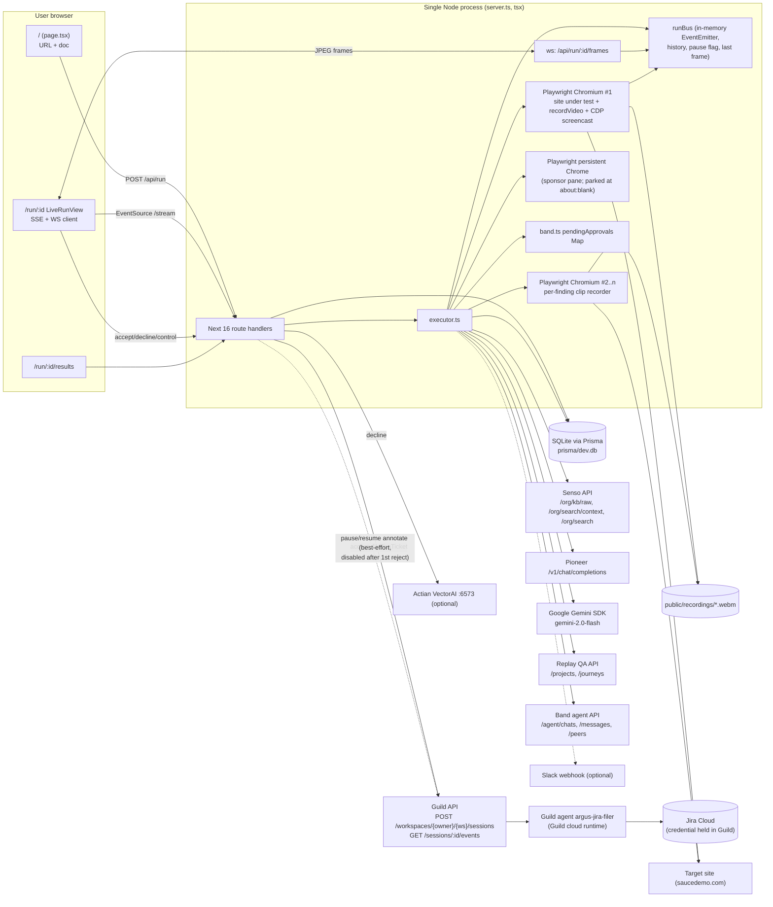
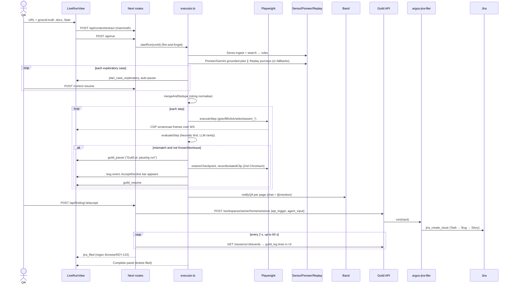

# Argus — whole-project deep dive

> **Current execution policy:** [Start now or anytime, with no build cutoff](../../event/BUILD_AUTHORIZATION.md). The human reports that the event is already underway and public schedules are stale. Older start/deadline/duration advice below is superseded; historical timestamps and analytics windows remain evidence, not build gates.

> Guild AI deep-dive group. Checked 8 Oct 2026. Read-only; nothing installed or run. **[V]** = verified at file:line in `repos/guild-ai/argus` (HEAD `4fda8d2`). **[I]** = inference.
> Round-1 file: [`analysis/guild-ai/argus.md`](../archive/source-tree/analysis/guild-ai/argus.md). This pass read every hand-written source file. It corrects round 1 in three places, flagged **(correction)**.

## 1. At a glance

Argus pitches itself as a "universal testing agent" for QA engineers and PMs. You give it a URL and a ground-truth product doc. It compiles rules (Senso), drafts test cases (Pioneer/Gemini) and exploratory cases (Replay), runs them live in headless Chromium, and streams the browser into a split-screen UI. Mismatches become findings with a video clip. A human accepts or declines each finding (Band notifies the human). On Accept, a **published Guild code-first agent files the Jira ticket using a Jira credential held by Guild**, so Argus never holds Jira credentials.

- **Award:** Self-Evolving Agents Hackathon (24 Jul 2026), "Best use of agents in Guild". The builder (solo, Ashna Parekh) claims 1st. Guild DevRel's post confirms she was a winner but doesn't give ranks.
- **One-line pitch [I]:** "Find the bug, prove it with a clip, and let a least-privilege Guild agent file it."

In code, the pipeline is a **Sauce Demo-specific harness**: deterministic Playwright assertions catch the bugs. The LLM steps are optional and fail soft. The only load-bearing Guild piece is the Jira filer.

## 2. Repo map

```
argus/
├── server.ts                    custom Node HTTP server: Next handler + WebSocket upgrade for /api/run/:id/frames
├── prisma/schema.prisma         SQLite models: Run, Page, Finding, TestCase, KnownNonIssue, RunEvent
├── guild-agents/argus-jira-filer/
│   ├── agent.ts                 Guild code-first agent ("use agent"): Jira create_issue with ADF links
│   ├── package.json             @guildai/ashnaparekh1998~argus-jira-filer v1.0.11, Guild babel compiler build
│   └── tsconfig.json, markdown.d.ts, README.md (empty)   guild-init scaffolding [I]
├── scripts/
│   ├── sponsor-login.mts        opens a persistent Chrome profile with each sponsor dashboard so you can sign in
│   └── sponsor-check.mts        smoke test: would each sponsor pane show LIVE or fall back
├── src/lib/
│   ├── executor.ts              the whole pipeline (691 lines): Senso → plan → merge → execute → clip → HITL
│   ├── browser.ts               Playwright session, CDP screencast, step executor, Sauce-specific assertions
│   ├── bus.ts                   in-process event bus + history replay + per-run pause flag + frame fan-out
│   ├── sponsorBrowser.ts        2nd Chrome + "stage" storyboard emitter for the left pane
│   ├── sponsorStages.ts         storyboard table: stage → sponsor, title, caption (all kind "panel")
│   ├── plans/saucedemo.ts       hardcoded 11-step Sauce Demo plan, 4 exploratory cases, default ground-truth text
│   ├── mediaUrls.ts             absolutise /recordings/* links for Jira
│   ├── types.ts, db.ts          shared types; Prisma singleton
│   └── adapters/
│       ├── config.ts            adapterLive(): real if key present and USE_MOCK_ADAPTERS != "true"
│       ├── guild.ts             pauseRun/resumeRun (local) + fileJiraTicket (Guild API trigger + poll)
│       ├── pioneer.ts           model routing table, Pioneer chat → Gemini SDK fallback, step eval, merge
│       ├── replay.ts            Replay QA project + journeys; local Playwright "isolated clip"
│       ├── senso.ts             KB ingest + search → rules; local line-split fallback
│       ├── band.ts              Band chat + @mention; in-memory approval promises
│       ├── actian.ts            VectorAI upsert with a hash "embedding" (write-only)
│       ├── jira.ts              local Jira-shaped draft (random key)
│       └── index.ts             barrel
├── src/app/
│   ├── page.tsx                 home: URL + doc upload/paste → POST /api/run
│   ├── run/[id]/LiveRunView.tsx       SSE + WebSocket client, stage rail, live browser, event feed
│   ├── run/[id]/SponsorWorkbench.tsx  left pane: one panel per sponsor stage + Accept/Decline bar
│   ├── run/[id]/useRunDerived.ts      folds the event stream into per-sponsor artifacts
│   ├── run/[id]/results/ResultsView.tsx  findings list, videos, accept/decline, Jira draft view
│   ├── replay/watch/page.tsx    "Replay-branded" player for local .webm files
│   ├── api/…                    9 route handlers (see §5)
│   └── globals.css, layout.tsx  theme tokens; fonts (scaffold-modified)
├── docs/SPONSORS.md             sponsor setup and honest notes ("enforces halt locally", "no error shown")
├── docs/sponsors/*              VENDORED sponsor llms.txt / OpenAPI / HTML (1,690 lines)
├── saucedemo_ground_truth.docx  demo ground-truth document
└── AGENTS.md, CLAUDE.md         create-next-app 16 agent-rules stub
```

**Lines of code** (tracked files, excluding `package-lock.json` and `docs/sponsors/*`) [V: `git ls-files | xargs wc -l`]:

| Language | Lines |
|---|---|
| TypeScript (`.ts`) | 5,093 (incl. 190 Guild agent) |
| TSX | 2,046 |
| `.mts` scripts | 123 |
| CSS | 188 |
| Prisma | 77 |
| `.mjs` config | 33 |
| **Hand-written total** | **≈7.3k** (≈7.2k TS/TSX) |

- **Generated/template:** commit `ea0abcd` is pure `create-next-app` (layout.tsx, globals.css base, eslint/postcss/next config, public/*.svg, AGENTS.md/CLAUDE.md). That's under 100 lines of non-lockfile code that survives.
- **Vendored:** `docs/sponsors/*` (1,690 lines) is docs fed to Cursor [I].
- **Ignored:** `.gitignore` excludes `.claude/`, `.cursor/`, `.agents/` and `skills-lock.json`, so any agent skills used aren't in the repo [V].
- **No shadcn or other component libraries.** The UI is hand-styled Tailwind plus `@tabler/icons-react`.
- The whole app was co-authored with Cursor (commit trailer) [V], so "hand-written" here means "authored in the event session", not typed by hand.

## 3. System architecture

### Component diagram (as found in code)



### Sequence diagram: main demo flow



## 4. Component walkthrough

**Custom server (`server.ts`).** Wraps Next so one process can serve WebSocket frames. `/api/run/:id/frames` upgrades go to `ws`, and everything else (including HMR) goes to Next (server.ts:23-36) [V]. `attachFrameClient` subscribes to `runBus.subscribeFrames` (server.ts:43-52) [V]. `hostname = "localhost"` is passed to Next only. `server.listen(port)` has no host, so it binds all interfaces (server.ts:38) [V].

**Event bus (`src/lib/bus.ts`).** A per-run `EventEmitter`. `subscribe` replays history first (bus.ts:49-55), so a late SSE client sees the whole run. It keeps the last frame per channel for reconnecting clients (bus.ts:71-79). The pause/resume state is a `Set` (bus.ts:81-97), and `waitIfPaused` polls every 200 ms [V]. Nothing ever writes the `RunEvent` Prisma table: events live only in memory [V: grep finds no `runEvent.create`].

**Executor (`src/lib/executor.ts`).** One async function drives everything:
- **Senso (lines 112-135):** `compileGroundTruth`.
- **Routing beat (lines 137-162):** a "cheap visual beat". `chooseModelForPage` looks up a table and makes no call (executor.ts:137 comment).
- **Plan generation (lines 164-186):** grounded and exploratory run in parallel via `Promise.all`.
- **Case reveal (lines 191-261):** cases are revealed one at a time with sleeps (1.8 s each). The run **auto-pauses after every exploratory case** until the operator clicks Resume (lines 241-252).
- **Merge and persist (lines 263-331):** merges the plans and saves pages and test cases.
- **Step loop (lines 346-577):** checkpoint, execute, evaluate.
- **On a new mismatch (lines 409-526):** the full sequence runs in this order:
  1. `pauseRun`
  2. show the bug panel
  3. restore the checkpoint
  4. record the isolated clip
  5. re-execute the step
  6. create the `Finding`
  7. `resumeRun`
- **Finalise video (lines 579-584):** the full session video is finalised *before* HITL "so the link in tickets is a real file".
- **HITL (lines 587-635):** Band notify per page, then `awaitApproval` per finding with a 120 s timeout. **A timeout resolves to "declined"** (band.ts:205-207) [V].
- **Learning:** dedupes with `seenPatterns` within a run and `KnownNonIssue` across runs (lines 40-53, 409-413) [V].

**Browser (`src/lib/browser.ts`).** Headless Chromium with `recordVideo` and a CDP `Page.startScreencast` at JPEG quality 55 (browser.ts:33-89). Checkpoints are cookies + localStorage + URL (browser.ts:121-153). Assertions are **Sauce Demo-specific DOM checks**:
- **Images:** `.inventory_item` image src matched against `sl-404|404|broken|dog`, a shared src, or name-token mismatch (browser.ts:221-276).
- **Sort order:** computed from `.inventory_item_name` and `.inventory_item_price` (browser.ts:277-308).
- **Cart badge:** `.shopping_cart_badge` polled for 3 s (browser.ts:309-326).

All three verified [V].

**Pioneer adapter (`adapters/pioneer.ts`).**
- **Routing:** `ROUTING_TABLE` maps page types to Pioneer models. login, cart and generic go to `gemini-3-flash`; inventory goes to `gemini-3.5-flash`; checkout goes to `gemini-3.1-pro` (lines 25-56). `MOCK_ROUTING` uses `gemini-2.0-flash` / `gemini-2.0-pro` (lines 58-89). `_taskKind` is ignored (line 93) [V].
- **LLM calls:** `llm()` tries Pioneer, then the Gemini SDK, then returns null (lines 144-150).
- **Grounded plan:** `generateGroundedTestCases` sends the prompt, extracts JSON with a regex, then runs `sanitizeSaucePlan`. That drops anything matching `checkout|payment|...` and appends the add-to-cart steps if they're missing. Otherwise it falls back to `buildSauceDemoPlan` (lines 222-259, 415-469).
- **Merge:** `mergeAndDedupe` is **not an LLM call**. It does lowercase/alphanumeric string matching, and `mergedBy` is just the model label (lines 261-314) [V].
- **Exploratory text to steps:** done with keyword rules (`price`+`sort` → `assert_sort_order lohi`, and so on) (lines 316-384) [V].

**Replay adapter (`adapters/replay.ts`).** `startSessionRecording` always creates a local dir and URL `/recordings/{runId}/full.webm`. If a key is set, it also `POST /projects` to Replay QA with Sauce logins (lines 42-92). `generateExploratoryTests` falls back in order:
1. Replay journeys, polled 6 × 2 s (lines 193-241)
2. Gemini 2.0 Flash prompt (lines 151-188)
3. The 4 hardcoded cases (line 190)

`recordIsolatedClip` launches a **fresh local Chromium with `recordVideo` and `slowMo: 120`**. It restores cookies and localStorage, outlines the target element in red, replays the prelude step and the failing step, and saves `/recordings/clip-*.webm` (lines 243-329). **No Replay API is involved in any recording** [V].

**Senso (`adapters/senso.ts`).**
- **Ingest:** `POST /org/kb/raw`; a 409 is treated as already ingested (lines 31-47). Then it sleeps 1.5 s.
- **Rule extraction:** two `/org/search/context` queries; each chunk becomes a rule (lines 53-87). One `/org/search` call follows, and its synthesized answer is split by line (lines 89-114). The result is deduped and capped at 40.
- **Fallback:** a local line splitter that understands `[Page]` prefixes (lines 127-168) [V].

**Band (`adapters/band.ts`).**
1. `GET /agent/me`
2. `POST /agent/chats`
3. `POST …/events` (task event)
4. `GET /agent/peers` → pick the `BAND_QA_MENTION` peer, else a human, else the first peer
5. Add that peer as a participant
6. `POST …/messages` with an @mention

Steps 1-6 are at lines 90-198. Accept/Decline are **not** received from Band; the human clicks in Argus. The `/api/finding/:id/band` route is a forwarder for a webhook that doesn't exist yet [V]. If there's no key, it logs and can post to a Slack webhook (lines 67-85).

**Guild (`adapters/guild.ts`) and agent.** See §6/§7.

**Actian (`adapters/actian.ts`).** On decline it upserts a 64-dimension **hash "embedding"** ("bag-of-chars", lines 117-129). `searchSimilarNonIssues` is exported but **never called** [V: grep]. It's write-only memory.

**Sponsor pane (`sponsorBrowser.ts`, `sponsorStages.ts`, `SponsorWorkbench.tsx`).** **(correction)** Round 1 said Argus "streams frames of each sponsor's real dashboard". At HEAD that's false:
- **No browser stages:** every `STAGES` entry has `kind: "panel"` (sponsorStages.ts:96-167). `show()` only navigates when `def.kind === "browser"` (sponsorBrowser.ts:178). Otherwise it parks the Chrome at `about:blank` (line 185) [V].
- **Frames never rendered:** `LiveRunView` stores `sponsorFrame` (LiveRunView.tsx:34, 110) but never passes it to `SponsorWorkbench` [V].

So the persistent-profile dashboard streaming is **dead code**. The left pane is a set of React panels rebuilt from the run's own events (`useRunDerived.ts:58-177`). That honestly reflects real run data, and the README section is stale [I].

**Front end.** `page.tsx` takes a URL plus a pasted or uploaded doc. `/api/context/extract` handles docx via mammoth, PDF via pdf-parse, and text files (8 MB cap). `LiveRunView.tsx` holds the EventSource and WebSocket, the stage rail, the pause toggle, the target browser with a cursor dot, and the event feed. `SponsorWorkbench.tsx` has 10 stage panels plus the `ApprovalBar`. `ResultsView.tsx` lists findings with `<video>` players, Accept/Decline, and the Jira link or local draft. `replay/watch/page.tsx` is a **Replay-branded player for local files**; it validates `src` starts with `/recordings/` and has no `..` (lines 25-27) [V].

**Scripts and config.** `sponsor-login.mts` and `sponsor-check.mts` (§2). `next.config.ts` externalises playwright, prisma and pdf-parse. There's no Dockerfile, no CI, no tests and no deploy config: it's a laptop-only app [V].

## 5. Data model

**Prisma / SQLite** (`prisma/schema.prisma`) [V]:

| Model | Fields | Use |
|---|---|---|
| `Run` (10-21) | targetUrl, status, groundTruth Json, contextText, fullRecordingUrl, sessionRecordingId | one per run |
| `Page` (23-33) | runId, name, status, order, pageType | merged-plan pages |
| `Finding` (35-49) | title, severity, expected, actual, pattern, fullRecordingUrl, clipUrl?, status, **jiraUrl?** (set if Guild filed), **jiraDraft?** (fallback) | bugs |
| `TestCase` (51-59) | source, modelUsed, description, stepJson | audit of plan |
| `KnownNonIssue` (61-68) | targetUrl, pattern, unique(targetUrl, pattern) | "self-evolving" suppression |
| `RunEvent` (70-77) | type, payload | **declared, never written** |

**Guild agent I/O (Zod)** (`guild-agents/argus-jira-filer/agent.ts`):
- Input (lines 16-30): title, severity, expected, actual, pattern, fullRecordingUrl, clipUrl, resultsUrl, pageName, project.
- Output (lines 34-38): ticketUrl, key, id.

**API routes** [V]:

| Method | Path | Handler | Does |
|---|---|---|---|
| POST | `/api/run` | `src/app/api/run/route.ts:9` | validate URL with `new URL`, create Run, `startRun` fire-and-forget |
| GET | `/api/run/:id` | `run/[id]/route.ts:7` | Run + pages + findings + testCases |
| GET | `/api/run/:id/stream` | `run/[id]/stream/route.ts:7` | SSE of runBus events + 15 s heartbeat |
| GET/POST | `/api/run/:id/control` | `run/[id]/control/route.ts:8,35` | pause/resume flag |
| GET | `/api/run/:id/recording` | `run/[id]/recording/route.ts:13` | serve full.webm or an orphan page@*.webm; runId regex-checked |
| WS | `/api/run/:id/frames` | `server.ts:25-35` | JPEG frame stream |
| POST | `/api/context/extract` | `context/extract/route.ts:28` | docx/pdf/txt → text |
| POST | `/api/finding/:id/accept` | `finding/[id]/accept/route.ts:14` | Guild filing → else local draft; `resolveApproval` |
| POST | `/api/finding/:id/decline` | `finding/[id]/decline/route.ts:9` | KnownNonIssue upsert + Actian upsert |
| POST | `/api/finding/:id/band` | `finding/[id]/band/route.ts:10` | forward to accept/decline |
| page | `/replay/watch?src=` | `src/app/replay/watch/page.tsx:9` | branded `<video>` player |

**Environment variables** (code reads) [V]:
- **Core:** `DATABASE_URL`, `PORT`, `NODE_ENV`, `ARGUS_PUBLIC_URL`, `USE_MOCK_ADAPTERS`.
- **Senso:** `SENSO_API_KEY`, `SENSO_API_BASE`.
- **Replay:** `REPLAY_API_KEY`, `REPLAY_QA_BASE`.
- **Pioneer / Gemini:** `PIONEER_API_KEY`, `PIONEER_API_BASE`, `GEMINI_API_KEY`.
- **Band / Slack:** `BAND_API_KEY`, `BAND_API_BASE`, `BAND_QA_MENTION`, `SLACK_WEBHOOK_URL`.
- **Guild:** `GUILD_API_TOKEN` (or `GUILD_API_KEY`, format `id:secret`), `GUILD_API_BASE`, `GUILD_WORKSPACE_ID`, `GUILD_OWNER` (default `ashnaparekh1998`), `GUILD_WORKSPACE_NAME` (default `home`), `GUILD_JIRA_AGENT` (label only).
- **Actian:** `ACTIAN_VECTORAI_ACCESS_TOKEN` (or `ACTIAN_API_KEY`), `ACTIAN_API_BASE`, `ACTIAN_COLLECTION`.
- **Jira:** `JIRA_PROJECT_KEY`, `JIRA_BASE_URL`.
- **Sponsor pane / HITL:** `ARGUS_SPONSOR_PANE`, `ARGUS_SPONSOR_HEADLESS`, `ARGUS_SPONSOR_PROFILE`, `ARGUS_HITL_TIMEOUT_MS`.
- **Guild runtime:** the agent reads `JIRA_PROJECT_KEY` and `JIRA_BASE_URL` itself (agent.ts:101, 176).

## 6. AI / agent design

| # | Call | Provider / model | Where | Prompt (trimmed) | Parsing / fallback |
|---|---|---|---|---|---|
| 1 | Grounded plan | Pioneer `gemini-3.5-flash` (inventory route) → Gemini SDK `gemini-2.0-flash` | pioneer.ts:228-239, 102-150 | "Generate a grounded JSON test plan for ${targetUrl} using this Senso ground truth. **Sauce Demo only**: one continuous loop — login as problem_user / secret_sauce, then inventory image + sort checks, then Add to cart + cart badge. Do NOT invent checkout… Return ONLY JSON {pages:[…]} Action types: goto, fill, click, select, assert_images_match_names, assert_sort_order, assert_cart_count, wait, assert_text." | `/\{[\s\S]*\}/` + JSON.parse → `sanitizeSaucePlan`; on any failure `buildSauceDemoPlan` |
| 2 | Exploratory cases (no Replay journeys) | Gemini SDK `gemini-2.0-flash` (hardcoded) | replay.ts:151-188 | "You are a generic exploratory QA tester for Sauce Demo (Swag Labs)… Stay on login / inventory / cart only… 4-5 cases." | regex JSON + forbidden-word filter → hardcoded 4 cases |
| 3 | Step evaluation | Pioneer per-page model → Gemini | pioneer.ts:152-211 | "You are a QA evaluator. Compare the step result to ground truth. Return ONLY JSON {mismatch,reason,pattern,title,severity,expected,actual}. Only flag mismatch:true when observations clearly prove a real UI bug. If unsure, mismatch:false." + rules + observations | regex JSON; parse failure or null → **pass** |
| 4 | Senso "answer" | Senso `/org/search` (Senso's own LLM) | senso.ts:89-114 | "Extract a numbered list of ground-truth rules for QA testing this application" | split by newline |
| 5 | Guild agent | **No LLM.** Deterministic code-first agent | agent.ts:96-183 | n/a | typed Zod output |

**Key finding (correction to round 1's "a model compares each step against ground truth and flags mismatches").** `evaluateStep` runs `heuristicEvaluate` **first** (pioneer.ts:158-159). Image, sort and cart bugs are decided by Playwright DOM checks and returned with hand-written titles such as "Broken product images for problem_user" and "Sort order incorrect on inventory page" (pioneer.ts:482-520). The LLM is skipped whenever an assertion passed (lines 174-181) or the step was a quiet click/fill/goto (lines 185-187). The comment says why: "that path was creating false 'add to cart' findings". In practice the LLM evaluator only runs for `assert_text` failures or non-timeout errors [V]. **Both demo bugs are deterministic DOM checks, not LLM judgments of the ground truth.** The Senso rules feed the planning prompt only.

**Orchestration.** A single linear async pipeline with no agent loop, tool calling or memory beyond `KnownNonIssue`. "Multi-agent" means sponsor adapters called in sequence. Retries:
- Replay journeys: 6 polls.
- Guild events: 30 polls × 2 s.
- Jira issue type in the agent: Task → Bug → Story.

LLM calls have no retries; they fail soft to deterministic data.

**Model-name check.** Demo narration says "Pioneer is using different Gemini versions". The code backs that only as a static routing table shown as a UI beat (executor.ts:137-162). The model IDs `gemini-3-flash` / `gemini-3.5-flash` / `gemini-3.1-pro` are Pioneer-side names we can't verify. Without a Pioneer key the UI labels them "fast model" / "frontier model" and calls `gemini-2.0-flash` [V].

## 7. All integrations

| Service | Exact usage | Depth |
|---|---|---|
| **Guild: Jira filer agent** | `"use agent"` code-first agent with `pick(jiraTools, ["jira_create_issue","jira_get_all_projects"])` + `consoleTools` (agent.ts:42-45). ADF description with link marks (66-94). Issue-type fallback (133-158). Published v1.0.11 | **core-to-the-pitch** (one action) |
| **Guild: API trigger** | `POST {GUILD_BASE}/workspaces/{owner}/{workspace}/sessions` `{session_type:"api_trigger", agent_input}`, Basic `id:secret` (guild.ts:19-29, 201-211). Poll `/sessions/:id/events?limit=50` and `/sessions/:id` (240-300). Regex ticket key out of event JSON (261-281) | load-bearing |
| **Guild: "pause/monitor"** | `pauseRun` = `runBus.pause` + UI event "Guild.ai: pausing run" (guild.ts:43-56). Optional POST `/workspaces/{id}/contexts` then `/context`, disabled after the first failure (70-141) | **decorative**: see §8 |
| Senso | KB ingest + context search + answer (senso.ts:31-114) | load-bearing for the rules list in the UI; thin for detection |
| Pioneer | `/v1/chat/completions` with `X-API-Key` + Bearer (pioneer.ts:102-128) | thin wrapper (plan only; fails to hardcoded plan) |
| Google Gemini | `@google/generative-ai` `gemini-2.0-flash` (pioneer.ts:130-142; replay.ts:151-155) | thin fallback |
| Replay QA | `POST /projects` with Sauce logins; `GET /projects/:id/journeys` (replay.ts:56-89, 193-241) | thin wrapper; **recordings are not Replay** |
| Band | chat + event + @mention (band.ts:90-198) | load-bearing for notification only; approvals come back via Argus UI |
| Actian VectorAI | upsert with a fake hash vector; search never called (actian.ts) | decorative |
| Jira | Only via Guild. `jira.ts` builds a local draft with a random key | through Guild |
| Playwright / CDP | core executor, screencast, video | core |
| Prisma / SQLite, mammoth, pdf-parse, ws | persistence, doc parsing, frames | infrastructure |
| Slack | optional webhook when Band is off (band.ts:74-85) | decorative |

## 8. Real vs. mock map

| Feature / claim (README, LinkedIn, demo) | Status | Evidence |
|---|---|---|
| "Universal testing agent — give it a URL" | **hardcoded to Sauce Demo** | Prompts say "Sauce Demo only" (pioneer.ts:229, replay.ts:156). Assertions use `.inventory_item`, `.shopping_cart_badge` (browser.ts:222-310). Fallback plan, selectors and logins are Sauce-specific (saucedemo.ts; replay.ts:64-67). Any other URL would run Sauce selectors and time out |
| Senso compiles ground truth (demo "18 ground truths") | **real** (with key) / local split fallback | senso.ts:23-125, 127-168 |
| Pioneer routes Gemini models per page | **partially real**: a static table shown as a beat; one plan call uses it | pioneer.ts:25-100; executor.ts:137-162 |
| Gemini drafts grounded test cases | **partially real**: LLM output is filtered and topped up, with a deterministic fallback | pioneer.ts:222-259, 415-469 |
| Replay generates exploratory cases | **partially real**: Replay journeys if ready within 12 s, else Gemini, else 4 hardcoded cases | replay.ts:138-191 |
| Merge/dedupe "by model" | **mocked**: string normalisation, labelled with a model name | pioneer.ts:261-314 |
| Live browser execution, split screen | **real** | browser.ts:33-89; LiveRunView.tsx:95-122 |
| AI compares each step to ground truth | **mostly deterministic**: heuristics decide; LLM rarely called | pioneer.ts:152-211, 475-535 |
| Bugs found (images, sort) | **real** DOM checks against real saucedemo `problem_user` bugs | browser.ts:221-308 |
| "Guild has paused because it found a bug … waiting your approval" (demo 01:56) | **cosmetic.** `pauseRun` sets a local flag. The executor keeps going (clip capture) and calls `resumeRun` right after, before any approval. Approval happens after all pages finish | guild.ts:43-56; executor.ts:415-520, 587-635 |
| Guild "monitors the entire workflow" | **missing** apart from a best-effort context POST that self-disables | guild.ts:70-104 |
| Replay full-session recording | **local Playwright video**, linked as "Full session recording (Replay)" | replay.ts:46-53, 94-136; agent.ts:78 |
| Replay isolated bug clip | **local Playwright video** in a 2nd Chromium; "Replay is re-recording just this step" (SponsorWorkbench.tsx:392) | replay.ts:243-329 |
| Replay-branded player | **branding over local file** | replay/watch/page.tsx:6, 64 |
| Band notifies QA | **real** (with key); approval stays in Argus | band.ts:90-159 |
| Human Accept/Decline gate | **real** | accept/decline routes; executor.ts:621-634 |
| Guild agent files Jira with Guild-held credential | **real** | agent.ts; guild.ts:170-308; no Jira auth in app (jira.ts:3-8) |
| "Filed by: Guild agent, autonomously" | **overclaimed**: triggered by a human Accept | SponsorWorkbench.tsx:523 |
| Ticket key shown on failure | **silent fake fallback**: random `SCRUM-####` draft, "never surface an error" | jira.ts:13-14; accept/route.ts:126-127 |
| Jira ticket links to the clip/session | **real link, but to `ARGUS_PUBLIC_URL`, default `http://localhost:3000`**, so it's unplayable for anyone else | mediaUrls.ts:2-7; accept/route.ts:31-34 |
| Self-evolving: declines are remembered | **real but exact-match** (`KnownNonIssue`) | decline/route.ts:26-38; executor.ts:40-53 |
| Actian vector memory | **write-only, fake embedding** | actian.ts:117-129; search never called |
| Live sponsor dashboards in the left pane (README) | **dead code**: all stages are panels and frames aren't rendered | sponsorStages.ts:96-167; sponsorBrowser.ts:178-187; LiveRunView.tsx:34 |
| Run event log persisted | **missing**: `RunEvent` never written; in-memory only | bus.ts; schema.prisma:70-77 |

Rough tally of 22 rows: about 7 real, 6 partial, 9 mocked, cosmetic, branded, hardcoded or missing. **The Guild claim that carries the pitch (credential-isolated filing) is real.**

## 9. Demo path trace

Demo video `ybS23YwBhHQ` (232 s, re-recorded 22 Aug). Timestamps come from the round-1 transcript.

1. **00:00-00:55 diagram.** No code on screen.
2. **01:12 upload doc, start.** `page.tsx:42-63` calls `/api/context/extract` (mammoth reads `saucedemo_ground_truth.docx`). Then `POST /api/run` creates the run (run/route.ts) and `startRun`.
3. **"Senso has brought 18 ground truths".** `compileViaSenso` returns deduped chunks and answer lines (senso.ts:23-125). `SensoPanel` lists them (SponsorWorkbench.tsx:154-176).
4. **"Pioneer is using different Gemini versions".** `pioneer_routing` event from the static table (executor.ts:137-162). Grounded cases are revealed every 1.8 s (executor.ts:191-204).
5. **"Replay has also found the test case".** Replay journeys or a fallback. The operator presses Resume after each (executor.ts:239-253; ReplayPanel). "11 + 1 = 12 cases" is consistent with the 11-step Sauce plan plus one surviving exploratory case [I].
6. **Live run in the right pane.** CDP frames over WS (browser.ts:58-89). Login, image check, sort select and assert.
7. **01:56 "Guild has paused".** `pauseRun` emits `guild_pause` (guild.ts:43-49). `BugPanel` shows "Guild paused the run" (SponsorWorkbench.tsx:377). The clip is recorded locally (replay.ts:243-329), then `resumeRun`.
8. **02:20 per-page batching, two bugs.** All steps finish, then the video is finalised and `notifyQA` sends one Band message per page (executor.ts:587-619). The ApprovalBar lists pending findings.
9. **02:55 Accept "sort order incorrect".** `accept/route.ts` sets the Guild pane, then `fileJiraTicket` starts the Guild session. Event lines stream into `GuildPanel` as `guild_log`. The regex finds `/browse/SCRUM-n` and `jira_filed` fires. The JiraPanel shows "Open in Jira".
10. **03:00-03:14 opens the Jira ticket.** A real ticket created by `jira_create_issue` in the Guild runtime (agent.ts:150-153) [I: the "Open in Jira" link renders only on the Guild path]. The ticket's video links point at `localhost:3000` [V: mediaUrls.ts].
11. **03:14-03:51 "Replay clip highlights … backpack $29".** A local `clip-*.webm` with a red outline from `highlightSelector` (replay.ts:331-354), played in the Results/Jira panel.

## 10. Code quality and security review

**Quality.**
- **Typing:** strict TS throughout, with good shared types (`types.ts`) and a discriminated `StepAction` union.
- **Structure:** clean adapter boundaries with a uniform real/mock switch (`config.ts`).
- **Comments:** explain *why* (for example executor.ts:579-580, pioneer.ts:172-187).
- **Weak points:**
  - A 691-line god function in `executor.ts`.
  - In-memory state (bus, approvals, sponsor registry) means a restart loses runs.
  - `any` in the Guild agent (agent.ts:134, 139).
  - No tests, CI, lint config beyond the scaffold, or Docker.
  - The README is stale on the sponsor dashboards.

**Grade [I]: B−** for a solo 1-day build: readable and well-factored, but demo-specific.

**Logic bugs found [V by reading; not executed]:**
- **Early-accept race.** The ApprovalBar appears as soon as a `bug` event fires (LiveRunView.tsx:67-76). `awaitApproval` is only registered after *all* pages finish (executor.ts:621-622). If the human accepts early, `resolveApproval` finds no pending entry (band.ts:224-225). The executor then waits 120 s, gets "declined", and logs "QA declined — no ticket filed" even though the ticket was filed.
- **Accept isn't idempotent** (accept/route.ts). A double click or a Band forward plus a UI click files two Jira tickets.
- **Timeout counts as decline** (band.ts:205-207), but no `KnownNonIssue` is written, so the outcome is ambiguous.
- `totalCases: 10` in the fallback plan, which actually has 11 steps (saucedemo.ts:12 vs steps). Cosmetic.

**Security (relevant to a cyberdefense audience):**

| Issue | Where | Severity [I] |
|---|---|---|
| **No authentication on any route**: anyone who can reach the port can start runs, accept findings (→ files Jira tickets using the Guild-held credential), decline (poisons suppression memory) | all `src/app/api/**` | High if exposed |
| **Binds all interfaces**: `server.listen(port)` without host despite `hostname = "localhost"` | server.ts:8, 38 | Medium (LAN exposure at a hackathon venue) |
| **Server-side browser SSRF / local file read**: `targetUrl` is only checked with `new URL()`, so `file:///…`, `http://169.254.169.254/…` or internal hosts would be loaded by server Chromium and **streamed back as screenshots** | run/route.ts:15-22; browser.ts:169 | High if exposed |
| **Suppression-memory poisoning**: a decline writes a permanent `KnownNonIssue` for the pattern, matched by `contains: host` (executor.ts:44-49), so one decline silences that bug class for every URL containing the host | decline/route.ts:26-38 | Medium (security-triage analogue: false-negative injection) |
| Prompt injection: page observations and the uploaded doc go verbatim into LLM prompts | pioneer.ts:189-199, 228-237 | Low (heuristics dominate) |
| Internal fetch built from `req.url` origin (Host-header driven) | band/route.ts:26-27 | Low |
| Hardcoded personal identifiers: Atlassian site, Guild owner | guild.ts:177, 274; agent.ts:168, 175; sponsor-login.mts:20 | Info |
| Persistent Chrome profile with signed-in sponsor sessions on disk | sponsorBrowser.ts:18-20 (gitignored `.argus/`) | Info |
| **Good:** no secrets committed (`.env*` ignored, only `.env.example`). The Jira credential never touches the app. The recording route regex-validates `runId` (recording/route.ts:18). The watch page blocks `..` | .gitignore; jira.ts:3-8 | — |

## 11. Build history

| Commit | Author | Time (PT) | Size |
|---|---|---|---|
| `ea0abcd` "Initial commit from Create Next App" | Ashna Parekh | **Thu 23 Jul 17:33** (day before) | 19 files, +7,123 (6,819 lockfile) |
| `4fda8d2` "Ship Argus: live sponsor testing agent with split-screen demo UI." Co-authored-by: Cursor | Ashna Parekh | **Fri 24 Jul 16:22** | 68 files, **+11,075 / −136** (≈1.6k lockfile, 1.7k vendored docs, ≈7.3k code) |

- **Grouped by hour:** 17:00 on 23 Jul has the scaffold. 16:00 on 24 Jul has everything else. No other hour has commits.
- **Before the event:** only the create-next-app scaffold. Its timestamp suggests setup the evening before, which is allowed for boilerplate [I].
- **Final hour:** the whole product landed 8 minutes before the 16:30 deadline in one squashed commit.
- **After the deadline:** no commits. HEAD is the submitted code [V].
- **Authors:** 1 human plus Cursor.
- **Iteration we can't see:** the Guild agent is at **v1.0.11** (package.json:3), i.e. about 11 publishes to the Guild registry during the day [I]. The comments record debugging (for example "that path was creating false 'add to cart' findings", pioneer.ts:183-184; "Trigger API keys are scoped to session creation", guild.ts:70-74).
- **Provenance:** in-event provenance can't be checked commit by commit.

## 12. How hard was this to build?

**A skilled builder with Cursor could rebuild it in 5.5 hours [I]:**
- **Core (~2.5 h):** the Next app with SSE, the Playwright executor with Sauce assertions, and the split-screen UI.
- **Clip recorder and checkpoints (~45 min).**
- **The six sponsor adapters (~20-30 min each) with mock fallbacks (~2 h).**
- **Guild filer (~1 h):** the agent, the trigger, the Guild-side Jira credential, and the polling.

That's tight but feasible. Argus is about 7.3k lines because Cursor writes verbose UI.

**The hard parts:**
1. **Next 16 custom server sharing upgrades with HMR**, plus CDP screencast fan-out (server.ts:23-36).
2. **Guild API trigger semantics.** It runs async: you only get a session id and have to poll events. The Jira site and issue types need trial and error (the agent tries Task, then Bug, then Story; the error message tells you to check `cloud_id`). Eleven agent versions point to real friction.
3. **Checkpoint/restore to re-record only the failing step** (browser.ts:121-153 + replay.ts:243-329).
4. **Pacing the demo:** auto-pauses, staged reveals, holding the pane while filing (sponsorBrowser.ts:151-156).

**Easy and over-represented:** the routing table, the merge and the Actian memory.

## 13. Reusable patterns and code (for a Cyberdefense entry)

1. **Least-privilege "file the finding" Guild agent.** The toolset is the permission, and no LLM is needed:
   ```ts
   // guild-agents/argus-jira-filer/agent.ts:42-45
   const tools = {
     ...pick(jiraTools, ["jira_create_issue", "jira_get_all_projects"]),
     ...consoleTools,
   };
   ```
   Swap Jira for GitHub, PagerDuty or ServiceNow. Pitch it as "our detector never holds the ticketing or response credential".
2. **Trigger a Guild agent from your app and stream its session into your UI** (guild.ts:201-258):
   ```ts
   POST `${GUILD_BASE}/workspaces/${owner}/${workspace}/sessions`
     { session_type: "api_trigger", agent_input }   // Basic base64("id:secret")
   // then poll GET /sessions/${id}/events?limit=50 every 2s → onLog(describeGuildEvent(e))
   ```
   Improvement: parse the agent's typed `output` (`st.output.ticketUrl`, guild.ts:290) instead of regex-scraping event JSON.
3. **Deterministic check before the LLM** (pioneer.ts:158-187): "don't let the LLM invent a bug when the assertion passed". For security: Semgrep, ClickHouse or rule hits decide, and the LLM only explains or prioritises.
4. **Event bus with history replay** (bus.ts:34-55), so SSE clients that join late (judges refreshing) see the whole run. Each step is also a `stage` event that drives a per-sponsor panel (`useRunDerived.ts`). That makes every sponsor visibly do something real.
5. **Evidence capture on detection**: checkpoint, isolated replay and a highlighted element (browser.ts:121-153; replay.ts:298-313). The security analogue is a pcap or log slice plus a highlighted line attached to the ticket.
6. **Decline → suppression memory** (decline/route.ts:26-38) as cheap "self-improving" false-positive suppression. Scope it exactly (no `contains: host`), and add expiry and an audit trail.

**Avoid:**
- Branding a local flag as "Guild paused/monitors" (guild.ts:43-56). In a security demo, a fake control is a credibility hit.
- A silent fake ticket key (jira.ts:14).
- Labelling local videos as Replay.
- "Autonomously" on a human-triggered action.
- Unauthenticated routes plus a server-side browser on an arbitrary URL. At a cyberdefense event, judges will look for exactly this.
- Links to `localhost` inside external tickets.
