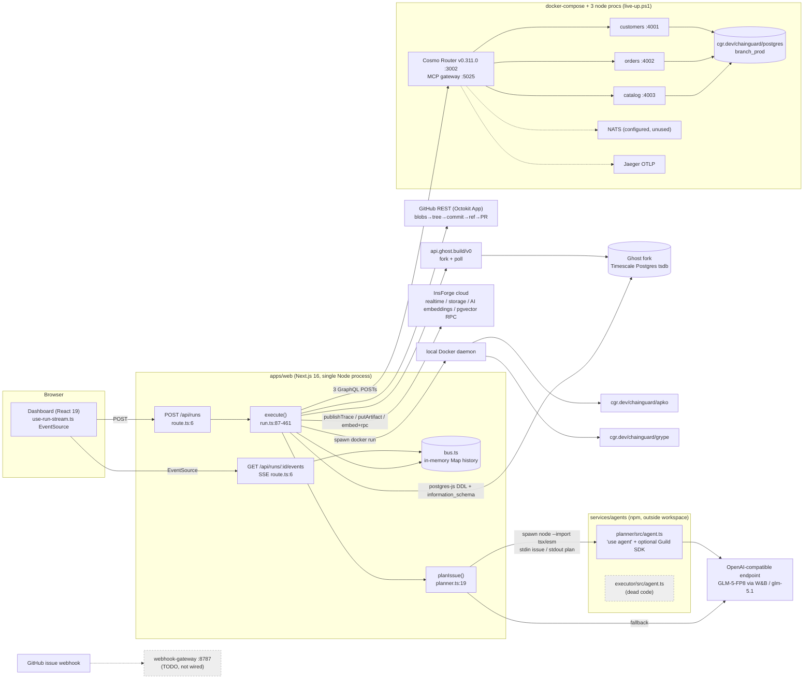

# Branch: whole-project deep dive

> **Current execution policy:** [Start now or anytime, with no build cutoff](../../event/BUILD_AUTHORIZATION.md). The human reports that the event is already underway and public schedules are stale. Older start/deadline/duration advice below is superseded; historical timestamps and analytics windows remain evidence, not build gates.

Round 1: [`analysis/guild-ai/branch.md`](../archive/source-tree/analysis/guild-ai/branch.md). Repo: `repos/guild-ai/branch` (upstream `github.com/chinesepowered/hack-apr24`). I read every tracked hand-written file in full: 104 files. I skipped `pnpm-lock.yaml` (3,609 lines), the two agent `package-lock.json` files (1,040 lines each), the three `sbom-*.spdx.json` files (6,008 lines, apko output, headers and package lists only), `packages/db/migrations/meta/*.json` (drizzle-kit output), `favicon.ico` and the five empty create-next-app SVGs.

## 1. At a glance

Branch is an "autonomous feature-development agent". A GitHub issue such as *"Add VAT support for EU customers"* goes through a six-phase pipeline: **plan** (an LLM writes a JSON change plan), **fork** (Ghost makes a copy-on-write clone of the production Postgres), **migrate** (DDL applied to the fork), **verify** (`information_schema` probe plus federated GraphQL queries through a WunderGraph Cosmo router), **PR** (a GitHub App commits files and opens a PR) and **image** (Chainguard `apko` builds a per-PR Wolfi image, and `grype` measures a CVE delta against `node:20`). Every phase streams to a Next.js dashboard over SSE. It is aimed at product and platform teams who want issue-to-PR automation that is tested against production-shaped data. The pitch: "File a GitHub issue → ~60 seconds later a real PR opens against a forked-from-production database" (`README.md:3`). It was built solo by Nelson Lai (`chinesepowered`) at **Ship to Prod, 24 Apr 2026, AWS Builder Loft SF**. It won **4 sponsor tracks**: **Most Innovative Use of Guild.ai**, **Chainguard**, **Best Use of Ghost** and **Best Use of WunderGraph**. These come from the Devpost badges recorded in round 1. Today's scrape of `devpost.com/software/branch-5zn8h0` returned only the main content without the badges, and `data/winners.json:1153-1200` records only the Guild award.

**The biggest corrections to round 1** [V]:
1. **The LLM's plan is never executed.** The migrate phase applies the hardcoded `demoPlan.migrationSql` (`apps/web/src/lib/orchestrator/run.ts:196`). The PR uses a hardcoded title, body and file list (`run.ts:368-375`). `POST /api/runs` ignores any issue in the request body, so every run is the canned VAT issue (`apps/web/src/app/api/runs/route.ts:7-11`, `run.ts:89`). The "agent" is a scripted pipeline with real side effects. The LLM output only fills the Plan panel.
2. **The "federated verification" never queries the new column.** The three live queries (`run.ts:529-545`) select `id name country orders…` and `searchProducts`. The subgraphs read the local prod DB via `DATABASE_URL`, not the fork (`services/subgraphs/customers/src/index.ts:18-20`). The `vatNumber` "before" error is a string literal (`run.ts:301`). The real migration proof is the `information_schema` probe (`packages/db/src/fork.ts:94-132`).
3. **The SBOMs and the deleted `grype_out.txt` are real evidence** that the Chainguard path executed. They are apko by-products written into the mounted workspace root (`chainguard/src/live.ts:32-39` mounts `workspaceRoot:/work`). The 1,409-line grype output matches the claimed `node:20=1408`.

## 2. Repo map

```
hack-apr24/  (pnpm 10 + turbo monorepo, TypeScript strict, Biome)
├── apps/web/                         Next.js 16.2.4 / React 19 dashboard + in-process orchestrator
│   ├── src/app/page.tsx              6    renders <Dashboard initialIssue={demoIssue}/>
│   ├── src/app/layout.tsx            34   create-next-app layout (Geist fonts), retitled
│   ├── src/app/globals.css           71   GitHub-dark palette tokens, pulse/slide animations
│   ├── src/app/api/runs/route.ts     17   POST start run (fire-and-forget), GET list run ids
│   ├── src/app/api/runs/[id]/events/route.ts 70  SSE stream with replay + 15 s keep-alive
│   ├── src/lib/orchestrator/run.ts   592  ★ the six-phase pipeline (the whole product)
│   ├── src/lib/orchestrator/planner.ts 114 Guild-subprocess → in-process LLM → canned-plan cascade
│   ├── src/lib/orchestrator/bus.ts   47   in-memory pub/sub + per-run history (replay)
│   ├── src/components/               dashboard.tsx 122, use-run-stream.ts 60 (EventSource hook), run-helpers.ts 51
│   │   └── panels/                   9 panels (issue/plan/fork/migration/verify/pr/image/log/timeline) + panel.tsx, 536 total
│   ├── AGENTS.md / CLAUDE.md         Next 16 "read the docs in node_modules" agent rule (create-next-app 16 template)
│   └── next.config.ts, postcss.config.mjs, tsconfig.json   scaffold
├── packages/
│   ├── shared/src/                   schemas.ts 143 (zod Issue/Plan/RunEvent union), env.ts 69 (zod env), demo.ts 125 (canned issue/plan/PR body)
│   ├── db/src/                       schema.ts 83 (Drizzle: customers/products/orders/order_items/runs/artifacts),
│   │                                 fork.ts 146 (applyMigrationToFork, probeCustomersVatColumn), seed.ts 50, migrate.ts 18
│   ├── db/migrations/                0000_common_bug.sql 51 + meta/ (drizzle-kit generated)
│   └── adapters/{ghost,github,chainguard,insforge,wundergraph}/src/
│                                     each: types.ts (interface) + live.ts + mock.ts + index.ts (factory)
│                                     live: ghost 142, github 149, chainguard 136, insforge 140, wundergraph 42
│                                     insforge/sql/bootstrap.sql 50 (pgvector table + HNSW + RPC)
├── services/
│   ├── agents/planner/               ★ "Guild coded agent": src/agent.ts 188, package.json (SDK = optionalDependency), lockfile
│   ├── agents/executor/              src/agent.ts 125, never invoked by anything
│   ├── agents/README.md              34   "Guild's task.llm is not used…"
│   ├── subgraphs/{customers,orders,catalog}/src/index.ts  83/92/78  Pothos + federation + Yoga over Drizzle
│   ├── cosmo-router/                 config.yaml 45 (MCP gateway, NATS, OTEL), supergraph.yaml, Dockerfile (wolfi-base), 3 .graphql ops
│   ├── webhook-gateway/src/index.ts  43   Fastify + @octokit/webhooks; handler is a TODO
│   └── preview-builder/              apko.yaml 33 (Wolfi + nodejs-22, nonroot, 2 archs), src/build.ts 39 (unused CLI)
├── scripts/                          live-up/down.ps1, compose-supergraph.ps1, smoke*.ps1, test-mcp.ps1 (PowerShell only),
│                                     seed-insforge-pr-history.mjs 127, tmp-probe-*.mjs/.ps1 (debug leftovers)
├── sbom-index/x86_64/aarch64.spdx.json   apko-emitted SPDX 2.3 SBOMs (committed, 6k lines)
├── README.md 79, sponsors.md 103, deploy.md 187, plan.md 191   judge-facing docs (≈560 lines)
├── docker-compose.yml               chainguard/postgres, nats, jaeger, cosmo-router (InsForge commented out)
├── .live-pids, tmp_docs.txt          committed runtime junk ("Error: Documentation not found")
└── pnpm-lock.yaml, biome.json, turbo.json, tsconfig.base.json
```

**LOC** [V] (`git ls-files | xargs wc -l`): TS/TSX **3,998**, `.mjs` 194, PowerShell 239, SQL 101 (51 of it drizzle-kit generated), YAML/GraphQL/Dockerfile 218, CSS 71, Markdown 600, JSON config about 640. Generated or vendored code: the create-next-app scaffold (layout, next.config, postcss, public SVGs, AGENTS.md), the drizzle-kit migration and snapshot, the lockfiles and the SBOMs. **Hand-written code is about 4.4k lines** (TS ≈ 3.95k + mjs + ps1 + SQL + YAML), plus about 600 lines of docs. Split: orchestrator, agents, live adapters and `fork.ts` = 1,821 lines. UI and API routes = 895. Mocks and the demo fixture = 350.

**The SBOMs are a signal** [V/I]. `sbom-index.spdx.json:4-9` says `"Tool: apko (v1.2.7)"`, and the per-arch files list Wolfi `nodejs-22`, `openssl`, `busybox` and others. They appear because `ChainguardLive` mounts the repo root into the apko container (`live.ts:32-39`) and apko writes SBOMs next to its output. They first appear in commit `a6cc30f` (16:20) and change again in `3f260d8` (17:20), so apko really ran at least twice. The `created: 2026-04-17` timestamp is earlier than the event. That most likely reflects apko's reproducible `SOURCE_DATE_EPOCH` derived from package build dates, not a prebuilt image [I]. A committed `grype_out.txt` (1,409 lines, added at 16:20 and deleted at 16:29) corroborates the README's `node:20=1408` [V: `git log --stat`]. For a supply-chain judge (Chainguard), stray SBOMs in the repo are accidental proof of work.

## 3. System architecture

### Component diagram (as found in code)



Things to notice [V]: no Guild cloud endpoint is contacted anywhere. `@branch/adapter-wundergraph` is a dependency of `apps/web` but is never imported (`grep makeWundergraph` finds only its definition). The MCP gateway is exercised only by `scripts/test-mcp.ps1`. The webhook gateway logs and stops (`webhook-gateway/src/index.ts:10-14`).

### Sequence diagram: the demo run (`pnpm demo:live`, all credentials present)

```mermaid
sequenceDiagram
  actor U as Presenter
  participant D as Dashboard
  participant R as /api/runs
  participant O as run.ts execute()
  participant P as planner subprocess
  participant L as GLM endpoint
  participant I as InsForge
  participant G as Ghost API
  participant F as Ghost fork (Postgres)
  participant C as Cosmo Router
  participant H as GitHub App
  participant K as Docker (apko/grype)
  U->>D: click "Run demo"
  D->>R: POST {speed:1}
  R-->>D: {runId}
  R->>O: startRun (no await)
  D->>R: GET /api/runs/:id/events (SSE)
  O->>I: isLive(); searchPrHistory(issue) [embed + RPC]
  O->>P: spawn node --import tsx/esm agent.ts; stdin demoIssue
  P->>L: chat.completions (json_object)
  L-->>P: plan JSON
  P-->>O: stdout Plan → plan_generated (displayed only)
  O->>G: GET /spaces → findByName → POST /databases/branch-prod/fork → poll until running
  G-->>O: host, port, password → DSN
  O->>F: CREATE TABLE IF NOT EXISTS customers (cold fork); 3 x hardcoded DDL (demoPlan.migrationSql)
  O->>I: putArtifact runs/:id/migration.sql
  O->>F: information_schema / pg_constraint / pg_indexes probe
  O->>C: 3 federated queries (no vatNumber) → local prod DB
  O->>H: blobs→tree→commit→ref→PR (title/body/files hardcoded)
  O->>I: indexPrHistory(pr)
  O->>K: docker run apko build → docker load → inspect
  O->>K: docker run grype registry:node:20 / oci-archive
  O-->>D: image_built {cve: 1408→0} → run_completed
  Note over O,D: every emit() also mirrored to InsForge realtime branch:run:<id>
```

## 4. Component walkthrough

**Orchestrator, `apps/web/src/lib/orchestrator/run.ts`** (592 lines, the product's core).
- `startRun` (`:29-41`) is fire-and-forget. An unhandled error becomes a `run_completed{status:'failed'}` event. That is good demo hygiene, because the UI always reaches a terminal state.
- `emit` (`:45-55`) stamps a **global** `seqCounter` (shared across runs), publishes to the in-memory bus, and mirrors a trimmed `TraceEvent` to InsForge realtime with errors swallowed.
- `execute` (`:87-461`) builds the five adapters from env (`:91-113`). Each phase is wrapped by `phase()` (`:463-484`), which emits `phase_started` and `phase_completed` with durations. `pause(ms)` (`:118`) adds **cosmetic delays** of 150-600 ms between log lines, scaled by `speed`. About 25 `pause` calls per run add roughly 7 s of theatre.
- Plan (`:124-158`): an InsForge pgvector neighbour lookup (`:126-137`), then `planIssue` (`:142`), with a log label that names the path taken (`:143-149`).
- Fork (`:163-192`): `ghost.fork(baseDb, \`pr-${issue.number}-vat-support\`)` (`:174`). The fork name is VAT-specific.
- Migrate (`:195-266`): **`const sql = demoPlan.migrationSql ?? ''` (`:196`)**, then a fake log line, "Generating migration from schema diff (drizzle-kit)" (`:197`). The live path (`:199-230`) logs each statement's real timing. The mock path (`:231-241`) narrates "Partial index built on 1,204,817 rows in 612ms" (`:238`).
- Verify (`:269-351`): the live fork probe (`:270-289`), then `liveVerify` against `ROUTER_URL` (`:290-325`). The `before` error is hardcoded (`:301`). In mock mode, canned `after` data is emitted (`:326-350`).
- PR (`:354-410`): the branch is `feat/vat-support-<n>-<base36 time>` (`:357`). The title, body (`demoPrBody`) and three files are hardcoded. Two of the files are one-line stubs (`'// + vatNumber column'`, `:373-374`), which **overwrite** `schema.ts` and the customers subgraph in the target repo with a single comment [V/I].
- Image (`:413-450`): narrative logs ("Fetching packages from cgr.dev", "Signing image with cosign", `:423-426`). **No cosign call exists anywhere** [V: grep]. Then real `buildPreviewImage` and `cveDelta` calls.
- `liveVerify` (`:547-592`) runs three named operations sequentially, records per-query timing, and sets `ok = every(ok)`.

**Planner cascade, `planner.ts`** (`:19-52`). (1) It spawns the Guild-shaped agent unless `GUILD_PLANNER_DISABLED=1` (`:24-27`). (2) It then tries an in-process OpenAI-compatible call with `response_format: json_object`, `temperature 0.2` and Zod `planSchema.safeParse` (`:33-48`). (3) Otherwise it returns `demoPlan`. Every failure degrades silently to the canned plan (`:29-31, :47, :49-51`). `runGuildPlanner` (`:54-89`) uses `spawn(process.execPath, ["--no-warnings","--import","tsx/esm", entry], {cwd: agentDir, env: process.env})`. It writes the issue JSON to stdin and parses stdout with Zod. Any non-zero exit returns `null`.

**Event bus and SSE.** `bus.ts:5-47` keeps `Map<runId, Set<listener>>` plus `history`, so late subscribers replay. The SSE route (`events/route.ts:13-60`) replays history, closes if the run is terminal, otherwise subscribes, sends `: ping` every 15 s, and cleans up on abort. Both are correct and minimal. Nothing is persisted, and runs vanish on restart.

**Frontend.** `use-run-stream.ts:24-55` POSTs and then opens an `EventSource`. `dashboard.tsx:16-89` derives each panel from the latest event of each kind (`run-helpers.ts:32-40`), in a 12-column grid: Timeline / Issue+Plan / Fork+Migration+Verify / PR+Image+Trace. The polish details are a pulse dot on the active phase, a copy-to-clipboard DSN, a regex SQL highlighter (`migration-panel.tsx:30-47`), a CVE before→after bar (`image-panel.tsx:16-50`) and an auto-scrolling trace (`log-stream.tsx:13-15`). **The Fork, PR and Image panels always show a "mock" badge** (`fork-panel.tsx:30`, `pr-panel.tsx:16`, `image-panel.tsx:18`), even in live mode. `LiveBadge` (`panel.tsx:45-51`) is defined but never used. The Plan badge is hardcoded to "GLM 5.1" (`plan-panel.tsx:16`).

**Adapters (`packages/adapters/*`).** Each has the same shape: an interface in `types.ts`, a `Live` class and a `Mock` class, and a `make*` factory that falls back to the mock when credentials are missing (`ghost/index.ts:13`, `github/index.ts:14`, `insforge/index.ts:13`). **The exception is Chainguard**, whose factory returns `ChainguardLive` unless `USE_MOCK_CHAINGUARD=1` (`chainguard/index.ts:14-15`). Because `run.ts:427` calls `buildPreviewImage` whether or not `isLive()` passed, a zero-credential `pnpm demo` on a machine without Docker would fail at the image phase [I, from code. Devpost advertises `pnpm demo` as zero-credential].
- Ghost (`ghost/live.ts`): resolves the space from the API key (`:48-55`), reuses a fork with the same name to avoid a 409 (`:79-83`), polls every 3 s for up to 10 min until `running` (`:57-72`), and builds `postgresql://tsdbadmin:<pw>@host:port/tsdb?sslmode=require` (`:122-138`).
- GitHub (`github/live.ts:27-122`): uses the low-level git-data API (base ref → base commit → blobs → tree → commit → ref → pull), then `compare` for +/- counts. `commentPr` is implemented (`:124-134`) but never called.
- Chainguard (`chainguard/live.ts`): `docker run cgr.dev/chainguard/apko build`, then `docker load`, then `docker inspect` (`:22-57`). For grype it scans `registry:node:20` and `oci-archive:` (`:59-78, :90-108`) without needing the Docker socket, a Windows Docker Desktop workaround (`:64-68`). **`grypeRun` returns `0` on any error** (`:110-121`), so a failed scan of the Chainguard image would silently display "0 CVEs".
- InsForge (`insforge/live.ts`): `realtime.publish` to `branch:run:<id>` (`:23-26`), storage upload (`:46-59`), embeddings via the InsForge AI gateway (`:121-129`), and an insert into `branch_pr_history` (`:61-76`). Search goes through RPC `branch_match_pr_history` with the vector passed as a TEXT literal (`:84-90`), which was **fixed in the post-deadline commit** (`git show 3f260d8`). If the RPC errors, it returns `[]` (`:91-94`).
- WunderGraph (`wundergraph/live.ts`): `listTools` and `callTool` throw "not implemented yet" (`:14-20`). The adapter is unused.

**DB package.** `schema.ts:13-83` defines Drizzle tables. `runs` and `artifacts` are never written. `fork.ts:35-92` opens one short-lived `postgres` client, sets `statement_timeout`, bootstraps `customers` on an empty fork (`:54-65`; the Ghost source DB is empty, so the "fork of production" has no data [I]), and runs each statement with `sql.unsafe`, treating `already exists|duplicate` as benign (`:71-87`). The comment at `:66-70` explains why per-statement autocommit replaced savepoints. `probeCustomersVatColumn` (`:94-132`) checks the column, constraint and index by name.

**Subgraphs.** Pothos + `plugin-federation` + Yoga. `customers` is an entity keyed on `id` (`customers/src/index.ts:37-40`). `orders` extends the external `Customer` with `orders` (`orders/src/index.ts:27-36`). `catalog` is keyed on `sku` with an `ILIKE` search (`catalog/src/index.ts:56-61`, parameterised by Drizzle). Each supports `--print-schema` for `wgc router compose` (`:65-72`). All three use `DATABASE_URL`, which is the local Chainguard Postgres, not the fork.

**Cosmo router.** `config.yaml` serves a local `supergraph.json` (`:8-10`), enables the MCP gateway on `:5025` with `expose_schema`, `enable_arbitrary_operations` and mutations allowed (`:19-30`), registers a NATS provider (`:33-37`, but no subgraph publishes) and sends OTEL to Jaeger (`:39-45`). The Dockerfile downloads router 0.311.0 onto `cgr.dev/chainguard/wolfi-base` and runs as `65532` (`Dockerfile:3-25`).

**Guild agents.** See §6. The executor is never referenced.

**Webhook gateway.** It verifies `x-hub-signature-256` (`:16-35`), but the `issues.opened` handler is a TODO (`:10-14`). Fastify's default JSON parser means `raw = JSON.stringify(req.body)` (`:27`) may not byte-match the signed payload [I], so verification could fail on real deliveries.

**Infra and scripts.** `docker-compose.yml` runs Chainguard Postgres (`:5-14`), public `nats:2-alpine` (with a comment that the Chainguard NATS image needs a paid token, `:17-19`), Jaeger and the router. `live-up.ps1` boots Docker, migrates and seeds, starts the 3 subgraphs through `cmd.exe` (a Windows pnpm `.ps1` workaround, `:28-34`), parses `.env` itself, including `\n` un-escaping for the GitHub PEM (`:47-63`), sets `ROUTER_URL` and `BRANCH_WORKSPACE_ROOT`, and runs `next dev`. It hardcodes the container name `hack-apr24-postgres-1` (`:18`). All tooling is PowerShell, so it only runs on Windows. `seed-insforge-pr-history.mjs` inserts **6 fictional past PRs** (#412-#455, `:26-63`) so the "similar PRs" log line has hits. **There are no tests**: `turbo test` exists, but no test files, and `demoPlan` references a non-existent `vat.test.ts` (`demo.ts:42`).

## 5. Data model

**Zod contracts** (`packages/shared/src/schemas.ts`): `issueSchema` (`:3-9`), `planSchema` {summary, affectedSubgraphs ∈ customers|orders|catalog, steps[{kind ∈ migration|code|test|verify, summary, files}], migrationSql?} (`:18-23`), a `runEventSchema` discriminated union of 10 kinds (`:55-120`), `traceEventSchema` (`:123-129`) and `runSchema` (unused, `:132-142`).

**Postgres (Drizzle, `packages/db/src/schema.ts`)**: `customers` (uuid id, email unique, name, country char-2), `products` (sku PK), `orders` (serial, FK customers), `order_items` (FK orders cascade, FK products), plus `runs` and `artifacts`, which are defined but never written. Migration: `0000_common_bug.sql` (drizzle-kit name).

**Ghost fork DDL** (`demo.ts:50-64`): `ADD COLUMN vat_number VARCHAR(32)`, CHECK `^[A-Z]{2}[A-Z0-9]{8,12}$`, partial index `WHERE vat_number IS NOT NULL`.

**InsForge** (`insforge/sql/bootstrap.sql`): `branch_pr_history(id uuid, pr_number, repo, title, summary, embedding VECTOR(1536), created_at)`, an HNSW cosine index (with a comment that IVFFlat returns nothing on tiny tables, `:16-21`), and RPC `branch_match_pr_history(query_embedding TEXT, match_count)` returning `1 - (embedding <=> q::vector)` (`:29-50`). The bucket is `branch-artifacts`.

**HTTP routes**

| Method | Path | Handler | Does |
|---|---|---|---|
| POST | `/api/runs` | `apps/web/src/app/api/runs/route.ts:6` | new runId, `startRun({runId, speed})`, ignores the issue |
| GET | `/api/runs` | `route.ts:15` | lists in-memory run ids |
| GET | `/api/runs/:id/events` | `events/route.ts:6` | SSE replay + live |
| POST | `/github/webhook` (:8787) | `webhook-gateway/src/index.ts:16` | signature check, then TODO |
| GET | `/health` (:8787) | `webhook-gateway/src/index.ts:37` | ok |
| POST | `/graphql` (:3002) | Cosmo router | supergraph |
| POST | `/mcp` (:5025) | Cosmo MCP gateway | `execute_graphql`, `execute_operation_*`, `get_schema`… (README:69) |
| POST | `/graphql` (:4001-4003) | subgraphs | Yoga |

**Env vars.** Read in code: `OPENAI_BASE_URL/API_KEY/MODEL`, `GUILD_PLANNER_DISABLED`, `USE_MOCK_LLM`, `USE_MOCK_EXEC`, `GHOST_API_KEY`, `GHOST_SPACE_ID`, `GHOST_BASE_DATABASE`, `GITHUB_APP_ID`, `GITHUB_APP_PRIVATE_KEY`, `GITHUB_INSTALLATION_ID`, `GITHUB_DEMO_REPO`, `GITHUB_WEBHOOK_SECRET`, `CHAINGUARD_PULL_TOKEN_USERNAME/PASSWORD` (passed to the adapter but never used in `live.ts`), `BRANCH_WORKSPACE_ROOT`, `INSFORGE_URL`, `INSFORGE_API_KEY`, `INSFORGE_BUCKET`, `INSFORGE_EMBED_MODEL`, `ROUTER_URL`, `DATABASE_URL`, `PORT`, `SCHEMA_OUT` and `USE_MOCK_{GHOST,GITHUB,CHAINGUARD,INSFORGE}`. Declared but unused: `GUILD_API_KEY`, `GUILD_WORKSPACE_ID`, `COSMO_API_KEY`, `COSMO_CDN_URL`, `SLACK_*`, `NGROK_AUTHTOKEN`, `USE_MOCK_WUNDERGRAPH`, `USE_MOCK_SLACK` (`.env.example`, `shared/src/env.ts:8-48`).

## 6. AI / agent design

| Call | Where | Provider / model | Prompt | Output handling |
|---|---|---|---|---|
| Planner (primary) | `services/agents/planner/src/agent.ts:69-85` | `openai` v4 SDK → `OPENAI_BASE_URL`. `.env.example:2-4` says `glm-5.1` on `open.bigmodel.cn`. The live run used **`zai-org/GLM-5-FP8` via W&B Inference** (`deploy.md:33`, `sponsors.md:75`) | `SYSTEM` (`:50-52`), user = repo/issue/body + "Return JSON only." (`:140-142`) | `json_object`, temp 0.2, `coerce()` = loose Zod parse → synthesise a step if missing → strict parse (`:88-107`). No retry. |
| Planner (fallback) | `apps/web/src/lib/orchestrator/planner.ts:33-48` | `openai` v6 SDK, same env | `SYSTEM_PROMPT` (`:91-104`) includes an inline JSON schema | `planSchema.safeParse`. Failure → `demoPlan`. |
| Embeddings | `insforge/live.ts:121-129` | InsForge AI gateway, `openai/text-embedding-3-small` | issue title+body, or PR title+body | 1536-dim vector → pgvector RPC |

System prompt, in full (agent, `agent.ts:50-52`):
> "You are the Branch planner agent. Given a GitHub issue, produce a JSON plan describing migration + code changes across the customers/orders/catalog federated subgraphs. Keep migrations narrow, non-blocking, and nullable where possible."

**No tools or function calling. No multi-turn loop. No memory**, apart from InsForge PR-history retrieval. Even that is never fed into the prompt: neighbours are logged only (`run.ts:126-137`) and not passed to `planIssue`. That makes the README's claim that it "materially improves planner quality" false [V]. The model-name claims are inconsistent: the UI says "GLM 5.1", while the live proof shows GLM-5-FP8.

**Guild design, in detail** [V unless marked]:
- `"use agent"` at line 1 of both agents. It only means something to Guild's Babel compiler.
- `loadGuildSdk()` uses `new Function("m","return import(m)")` (`agent.ts:129-138`) to hide the import from TypeScript and bundlers, so a missing SDK is not an error.
- A **top-level `await`** builds `sdk.agent({description, inputSchema, outputSchema, run})` if the SDK resolves, and otherwise exports `{description, run}` (`:165-176`).
- The CLI mode is detected via `process.argv[1].endsWith("agent.ts")` (`:179-188`): stdin JSON → `run` → stdout JSON.
- `notify()` (`:109-120`) uses `task.ui.notify(progressLogNotifyEvent(msg))` inside Guild and `stderr` otherwise. Note: `run(input, ctx)` takes a `{task}` wrapper, but Guild's `agent()` passes the `Task` as the second argument directly (`_GUILD_PLATFORM.md` §4.1, MediCall `run(input, _task)`). So **even inside Guild, `ctx.task` would be undefined and notifications would never reach the Guild UI** [I, from the documented signature].
- The SDK is an `optionalDependency` and was never installed (both lockfiles mention `@guildai/agents-sdk` only in the root `optionalDependencies` stanza, line 20, with no `node_modules/@guildai` entry). `tsx` and `openai` *are* locked (`planner/package-lock.json:903, 964`), which is consistent with `npm install` having been run so that the subprocess works.
- The orchestration pattern is a **fixed sequential pipeline** with one LLM step, not a planner→executor multi-agent loop. The executor duplicates `fork.ts` using `psql` and is dead code.
- `services/agents/README.md:29-30` says `guild agent init --template coded-agent` and `guild agent deploy`. `deploy.md:149-150` says `--template AUTO_MANAGED_STATE` and `guild agent save --wait --publish`. The second pair is the documented one.

## 7. All integrations

| Service | Usage (file:line) | Depth |
|---|---|---|
| **Guild.ai** | Guild-shaped planner run as a plain Node subprocess (`planner.ts:54-89`, `agent.ts`); 0 Guild API calls; SDK never installed; webhook→Guild trigger is a TODO (`webhook-gateway/src/index.ts:12-13`) | **decorative** (but it won the track) |
| **Ghost** | Real fork API + polling + DSN (`ghost/live.ts:74-138`); DDL applied (`fork.ts:35-92`); schema probe (`fork.ts:94-132`) | **core-to-the-pitch** |
| **WunderGraph Cosmo** | Router + 3 federated Pothos subgraphs + local `wgc` composition (`compose-supergraph.ps1`); verify phase = 3 POSTs (`run.ts:547-592`); MCP gateway configured (`config.yaml:19-30`) but only `test-mcp.ps1` calls it; NATS/Streams registered but nothing publishes | **load-bearing** for verify, **decorative** for MCP and Streams |
| **Chainguard** | apko build + grype CVE delta through containers (`chainguard/live.ts`); `cgr.dev/chainguard/postgres` (`docker-compose.yml:6`); wolfi-base router image (`Dockerfile:3`); apko.yaml with nonroot and 2 archs | **load-bearing** (the CVE delta is the demo's hero number) |
| **InsForge** | realtime mirror (`run.ts:48-54`), storage (`run.ts:243-257, 305-325`), embeddings + pgvector (`run.ts:126-137, 394-409`) | **thin to load-bearing**; the results are logged, not used |
| GitHub App | Octokit git-data PR creation (`github/live.ts:27-122`) | load-bearing (the "bot in your workflow" UX) |
| GLM via OpenAI-compatible endpoint (W&B Inference) | planner (`agent.ts:69-85`) | thin; output not acted upon |
| Jaeger / OTEL | router config only | decorative |

## 8. Real vs. mock map

"Live" means `pnpm demo:live` with all `.env` credentials, as in the judged run `run_modkmlhf_bu6d` (`sponsors.md:5`).

| Claim / visible feature | Status | Evidence |
|---|---|---|
| Issue lands from GitHub | **hardcoded** | `demoIssue` (`demo.ts:3-19`); POST ignores the body (`route.ts:7-11`); webhook TODO |
| LLM plans the change | **real call, output unused** | `agent.ts:74-85`; migrate uses `demoPlan.migrationSql` (`run.ts:196`) |
| "Guild planner agent" | **partially real**: a subprocess, not Guild | `planner.ts:61-69`; log label `run.ts:145` |
| InsForge "similar PRs" improves planning | **real lookup on seeded fake PRs, not fed to the LLM** | `run.ts:126-137`; `seed-insforge-pr-history.mjs:26-63` |
| Ghost fork of prod | **real** (the source DB is empty and bootstrapped) | `ghost/live.ts:74-88`; `fork.ts:54-65` |
| Mock fork shows "1,204,817 rows" | **mocked** (mock mode only) | `ghost/mock.ts:21-22`, `run.ts:238` |
| "drizzle-kit generates migration" | **fake log line** | `run.ts:197` |
| Migration applied to fork with timings | **real** (hardcoded SQL) | `fork.ts:71-87`, `run.ts:208-222` |
| Fork schema probe | **real** | `fork.ts:94-132`, `run.ts:270-289` |
| Federated verification of the new field | **partially real**: real federation, wrong DB, no `vatNumber` | `run.ts:529-545`; `customers/src/index.ts:18-35`; `before` literal `run.ts:301` |
| Cosmo MCP "agent tools layer" | **configured, not used by the agent** | `config.yaml:19-30`; `wundergraph/live.ts:14-20` throws |
| Cosmo Streams / NATS | **config only** | `config.yaml:33-37` |
| Real PR opened by bot | **real** (title/body/files hardcoded, 2 stub files) | `github/live.ts:27-122`; `run.ts:366-376` |
| "PR with fork DSN embedded" | **hardcoded fake DSN in body** | `demo.ts:95` (`ghost-eu.branch.build`) |
| PR body "CVEs 47 → 0" | **hardcoded**, contradicts the live 1408 | `demo.ts:113` |
| apko preview image | **real build**; the image has no app (`/app/server.mjs` is never copied) | `chainguard/live.ts:22-57`; `apko.yaml:24-25`; SBOMs at root |
| "Signing image with cosign" | **fake log line** | `run.ts:425` |
| CVE delta node:20=1408 → 0 | **real scan**, but a failed scan also yields 0 | `chainguard/live.ts:110-121`; deleted `grype_out.txt` |
| Realtime trace via InsForge | **real mirror**; the UI reads the local bus, not InsForge | `run.ts:48-54`; `use-run-stream.ts:37` |
| Live/mock badges per panel | **wrong**: always "mock" | `fork-panel.tsx:30` etc. |
| Slack summary, auth, edge functions (plan / Devpost InsForge row) | **missing** | no code |
| Executor agent | **dead code** | no references |

**Rough ratio** [I]: in live mode, about **60% real / 40% scripted**. The side effects (fork, DDL, probe, PR, apko, grype, InsForge) are real. The decisions (issue, SQL, PR content, verification target) are canned. In zero-credential `pnpm demo` mode it is about 95% mock.

## 9. Demo path trace (video `F-5-mgj1U7M`, 137 s, timestamps from the round-1 transcript)

| Time | Shown / said | Code that runs |
|---|---|---|
| 0:01-0:33 | Problem: a human pastes an issue into a coding agent repeatedly | none |
| 0:33 | "someone opens a GitHub issue for add VAT support… create a fork using Ghost" | `demoIssue`; `run.ts:163-192` → `ghost/live.ts:74` |
| ~0:45 | "test the production database against our fix" | `fork.ts:35-92` with `demo.ts:50-64` SQL |
| 0:50 | "verify that actually works thanks to Cosmo" | `run.ts:290-325` (3 prod-DB queries) + probe `run.ts:270-289` |
| ~0:58 | "open a PR… Chainguard to build the preview runtime" | `github/live.ts:27-122`; `chainguard/live.ts:22-78` |
| 1:08 | **Wow:** "a GitHub bot… all these commits made by our Branch bot… our UI is exactly in your workflow" | the GitHub App installation token authors the commit and PR (`github/live.ts:80-102`). The demo repo `chinesepowered/hack-apr24demo` now returns 404, so it was probably made private or deleted [V: scrape] |
| 1:24-2:01 | Sponsor roll call; "we use AI for the orchestration" (probably "Guild AI") | none |
| 2:01 | "look at sponsors.md" | the `sponsors.md` dossier |

The video leans on GitHub artifacts rather than the dashboard. Guild never appears on screen.

## 10. Code quality and security review

**Quality: B-.** Strengths: strict TS with `noUncheckedIndexedAccess` (`tsconfig.base.json:13-14`), Zod at every boundary (env, plan, events), and a disciplined live/mock adapter pattern with typed interfaces. The comments explain *why* (HNSW vs IVFFlat, postgres-js savepoints, Windows Docker socket). Errors are always surfaced into the trace instead of crashing. Weaknesses: zero tests; hardcoded VAT coupling throughout the "generic" orchestrator; silent fallbacks that fake success (`planner.ts:47-50` → canned plan, `grypeRun` → 0, digest → zeros at `chainguard/live.ts:52`); misleading UI badges and log lines; dead code (executor, the wundergraph adapter, `runs`/`artifacts` tables, `commentPr`, `discard`); Windows-only scripts; committed debris (`.live-pids`, `tmp_docs.txt`, `tmp-probe-*`). A global `seqCounter` and module-level `insforgeBus` (`run.ts:43-44`) race if two runs overlap.

**Security (cyberdefense lens)**

| Issue | Where | Severity |
|---|---|---|
| **No auth on `POST /api/runs`.** Anyone who can reach :3000 can create Ghost forks, push branches and open PRs with the App's write token | `route.ts:6-13` | High (if exposed) |
| The DB DSN with **plaintext password** is streamed to every SSE client and rendered with a copy button | `run.ts:183-190`, `fork-panel.tsx:39-49` | Medium |
| **LLM-to-SQL design**: `sql.unsafe(stmt)` executes whatever SQL it is given. Today that is a constant, but the `Plan.migrationSql` field is designed to be fed through. No allow-list, no `pg_dump` diff, no human gate | `fork.ts:74` | Medium (latent) |
| Webhook secret defaults to `'dev-secret'`; the signed payload is re-serialised | `webhook-gateway/src/index.ts:8, 27` | Medium |
| Cosmo MCP: `enable_arbitrary_operations: true`, `exclude_mutations: false`, `expose_schema: true`, bound to `0.0.0.0` | `cosmo-router/config.yaml:21-30` | Medium (the file says "disable in prod") |
| The whole repo root (including `.env` with the GitHub PEM and API keys) is bind-mounted into the apko container | `chainguard/live.ts:34` | Low-Med |
| `new Function("m","return import(m)")`, an eval-style dynamic import | `agent.ts:131` | Low |
| Docker args are passed as an array via `spawn` (no shell), so there is no command injection [V] | `chainguard/live.ts:125` | ok |
| The debug script calls InsForge `/api/database/rawsql/unrestricted` | `tmp-probe-sql.mjs:10` | Low (committed) |
| Default DB creds `branch:branch` | `docker-compose.yml:8-9`, `migrate.ts:7` | Low (local) |
| PR file writes overwrite real source files with stub comments | `run.ts:371-375` | Integrity bug |
| No committed secrets found [V: `.env` gitignored; `.env.example` is empty] | | ok |

## 11. Build history

All 9 commits are by **chinesepowered** (`nlai@rediffmail.com`), on 24 Apr 2026, PT. The submission deadline was ~16:30 (round 1).

| Time | Commit | Files | +/- | What |
|---|---|---|---|---|
| 11:08 | 681998b Initial commit | 1 | +2 | `.gitattributes` |
| 11:41 | 11e4743 Create plan.md | 1 | +181 | the full architecture plan and prize table naming Guild ($1k/$500), with doc URLs |
| *(2 h 20 m gap)* | | | | |
| 14:01 | daeb04a first shot | 124 | +7,894 | the whole monorepo at once: every adapter (mock + stub live), UI, subgraphs, router, agents v1, run.ts v1 (300 lines). About 4.2k hand-written lines + 3.2k lockfile |
| 14:59 | e09c59f checkpoint | 24 | +1,072/-82 | live Ghost, GitHub and Chainguard adapters; MCP operations; `sponsors.md` and `deploy.md` |
| 16:20 | a6cc30f checkpoint | 32 | +10,589/-265 | `fork.ts` (real DDL + probe), InsForge live, planner subprocess cascade, agents rewritten for the Guild SDK shape; **+5,880 SBOM, +2,080 agent lockfiles, +1,409 grype output** |
| 16:29 | 570c4a2 cleanup | 9 | -1,459 | delete grype output and tmp scripts |
| 16:31 | d49244b Update README | 1 | +21/-11 | |
| 16:45 | bf80fac fixes | 2 | +41/-33 | README, .gitignore |
| **17:20** | 3f260d8 live! | 14 | +366/-68 | **post-deadline**: 3-query verify, InsForge verify archive, **pgvector RPC TEXT fix**, PR-history seed script, tmp probes, "Live proof" lines in `sponsors.md` |

Reading [I]: a plan-first, coding-agent-driven build. A 181-line spec with doc URLs, then a 2-hour silence, then a 124-file drop (`apps/web/CLAUDE.md` / `AGENTS.md` exist, and `deploy.md` speaks in the agent's voice: "send me the creds… and I'll ship it", `deploy.md:6, 187`). Nothing was prebuilt before 11:08. The judged version is probably 16:20-16:45. That means the InsForge similarity search likely returned `[]` at judging time (the RPC fix landed at 17:20), and the "Live proof" run id in `sponsors.md` was recorded after the deadline.

## 12. How hard was this to build?

For a skilled builder with a coding agent in 5.5 h: **the skeleton is easy, and the live integrations are the hard part.** The monorepo, Zod event schema, SSE dashboard and mocks take about 1.5 h with an agent. The hard parts, which together took the author roughly 2.5 h of commits:
1. **The Cosmo federation stack**: 3 Pothos subgraphs, local `wgc` composition, the router in Docker reaching `host.docker.internal`. About 1 h of fiddly config.
2. **Ghost**: space discovery, fork polling, Timescale `tsdbadmin`/`tsdb` DSN quirks, the empty-fork bootstrap, idempotent reruns. About 45 m.
3. **apko/grype through containers on Windows**: workspace mounting, the OCI archive scan without the Docker socket. About 45 m.
4. **InsForge pgvector over PostgREST**: the vector-as-TEXT RPC and the IVFFlat-empty-results trap. This ran past the deadline.
5. A **GitHub App** PEM and installation plus the git-data API. About 30 m.

The Guild part took about 20 minutes.

## 13. Why the whole product was strong (4 tracks)

1. **Product framing that every sponsor could read as about them.** "Issue → forked DB → verified → PR → hardened image" is one story in which each sponsor fills a necessary step: Ghost = "fork databases like branches" (`sponsors.md:42`), Cosmo = "the agent's tools layer" (`:25`), Chainguard = "supply-chain hygiene is the default" (`:58`), Guild = "the agent boundary is the right unit of governance" (`:78`). No sponsor looks bolted on. Each one's *thesis* is the step it occupies [I].
2. **Real side effects that judges can verify.** A real Timescale DSN on screen, real DDL timings (185/139/127 ms, `sponsors.md:38`), a real PR on GitHub authored by a bot, and a real grype number (1408 → 0). Each of these takes seconds to check, and three of the four winning sponsors (Ghost, Cosmo, Chainguard) got **load-bearing** use [V §7].
3. **A hero metric.** "node:20=1408 → chainguard=0, Δ=-1408" is a single number a Chainguard judge can quote. It is rendered big with a progress bar (`image-panel.tsx:25-50`) and backed by real scans.
4. **"No new UI, it lives in your workflow."** The demo's wow moment is the GitHub bot (1:08). It reframes a hackathon dashboard as a product.
5. **Judge-facing documentation as a deliverable.** `sponsors.md` gives each sponsor "What we use / Where it appears in the demo / Live proof / Pitch". `deploy.md` and the README tables repeat the exact API endpoints used. Judges for each track can find their own section in 30 seconds.
6. **Breadth with graceful degradation.** Every adapter has a mock, every failure becomes a log line, and the run always reaches a terminal state, so the demo cannot hard-crash on stage.
7. **Polish.** A GitHub-dark design-token palette, phase timeline, pulse dots, copyable DSN, SQL highlighting, auto-scrolling trace and before/after JSON panels. It looks like a product.
8. **Vocabulary fluency for Guild.** `"use agent"`, the `agent({inputSchema, outputSchema, run})` factory, `progressLogNotifyEvent` and `AUTO_MANAGED_STATE` are all correctly named primitives. With a coding-agent use case that matches Guild's own "software factory" narrative, this probably outweighed the absence of any Guild runtime use [I]. Judges seemingly rewarded the overall product and the correct framing over integration depth.

## 14. Reusable patterns and code (for a Cyberdefense entry: ClickHouse, Pi Security, Guild AI, Semgrep)

**Pattern 1: an SDK-optional Guild agent with a stdin/stdout CLI mode** (`services/agents/planner/src/agent.ts:127-138, 165-188`). It lets you demo locally and deploy to Guild with the same `run()`. Keep it, but fix the `task` signature and actually deploy it.
```ts
async function loadGuildSdk(): Promise<GuildSdk | null> {
  try {
    const dynImport = new Function("m", "return import(m)") as (m: string) => Promise<GuildSdk>;
    return await dynImport("@guildai/agents-sdk");
  } catch { return null; }
}
const sdkAgent = await (async () => {
  const sdk = await loadGuildSdk();
  if (!sdk || typeof sdk.agent !== "function") return null;
  return sdk.agent({ description: "…", inputSchema, outputSchema, run });
})();
export default sdkAgent ?? { description: "… (CLI fallback)", run };
if (process.argv[1]?.endsWith("agent.ts")) { /* stdin JSON → run → stdout JSON */ }
```
*For Cyberdefense:* make `run(finding, task)` a `semgrep-triage` agent. Inside Guild, call `task.llm` and `pick(gitHubTools, ["…pulls_create", "…create_comment"])`. Then the Guild session log is your evidence, which is what Branch lacked (see `_GUILD_PLATFORM.md` §4.1-4.3).

**Pattern 2: loose-then-strict LLM output coercion** (`agent.ts:31-45, 88-107`). Models name fields inconsistently, so parse permissively, synthesise the missing parts, then enforce the strict schema.
```ts
const loose = looseOutputSchema.safeParse(raw);
const base = loose.success ? loose.data : { summary: "Generated plan", affectedSubgraphs: [], … };
const steps = base.steps?.length ? base.steps : [{ kind: base.migrationSql ? "migration" : "code", summary: base.summary, files: [] }];
return outputSchema.parse({ ...base, steps });
```
Use it for Semgrep-finding → `{severity, cwe, fix, confidence}` triage.

**Pattern 3: a phase-wrapped orchestrator plus a discriminated-union event bus plus SSE replay** (`run.ts:463-484`, `schemas.ts:55-120`, `bus.ts`, `events/route.ts:23-28`). Each phase emits start, logs, a typed result and completion with duration. The UI derives every panel from `findEvent(events, kind)`. Late joiners replay history. This is about 200 lines and gives you a live "SOC pipeline" view: *ingest → scan (Semgrep) → enrich (ClickHouse) → triage (Guild) → contain (PR/ticket)*. Mirror the same events into ClickHouse (`MergeTree ORDER BY (run_id, seq)`) instead of InsForge, which gives you an audit trail for free.

**Pattern 4: the live/mock adapter triad with an `isLive()` health check** (`ghost/index.ts:8-15`, `types.ts:12-21`). An interface, `Live`, `Mock` and a factory that falls back on missing credentials. Copy it for ClickHouse, Semgrep and Pi Security clients. **But render the real mode in the UI** (`LiveBadge` exists and was never used) and **never let a fallback report success**. A failed scan must not show "0 CVEs" (`chainguard/live.ts:117-119`).

**Pattern 5: test the remediation on a throwaway clone, then prove it with a catalog probe** (`fork.ts:35-132`). Per-statement execution with benign-error tolerance, followed by an `information_schema`/`pg_constraint`/`pg_indexes` probe. For cyberdefense: apply the Semgrep autofix or the firewall/config change to a fork or sandbox, re-run the scanner, and show the before/after finding count as the hero metric, in the style of Branch's 1408→0.

**Pattern 6: a per-sponsor `sponsors.md` dossier** with "What we use (file paths) / Where in demo / Live proof (exact log line + run id) / Pitch". It costs about 20 minutes and is probably the single highest-ROI artifact for a multi-track run.

**Avoid:**
- An LLM whose output is displayed but not acted upon. A judge who reads `run.ts:196` sees a script, not an agent.
- Claiming "Guild trigger → planner → executor" when the trigger is a TODO and the executor is dead. A Guild-specific judge with repo access would catch it.
- `sql.unsafe` on model output without a gate. In a security hackathon, put a human approval (`ui_prompt`) and an allow-list in front of any write.
- Hardcoded PR bodies that contradict live numbers (`demo.ts:113` "47 → 0" vs a live 1408).
- Post-deadline commits that change what the docs claim.
- An unauthenticated trigger endpoint holding write credentials.

### Biggest weakness (summary)

**The agent doesn't decide anything.** The issue, migration SQL, PR content and verification target are constants (`run.ts:89, 196, 368-375, 301`). The one LLM call is decorative, and the Guild integration is a naming convention around a subprocess with zero Guild API calls. A competitor with a smaller but genuinely agentic loop would beat it on depth: an LLM-generated fix, actually applied and verified, running on the Guild runtime with an approval gate. Branch won on framing, polish and three real sponsor integrations, not on autonomy.
