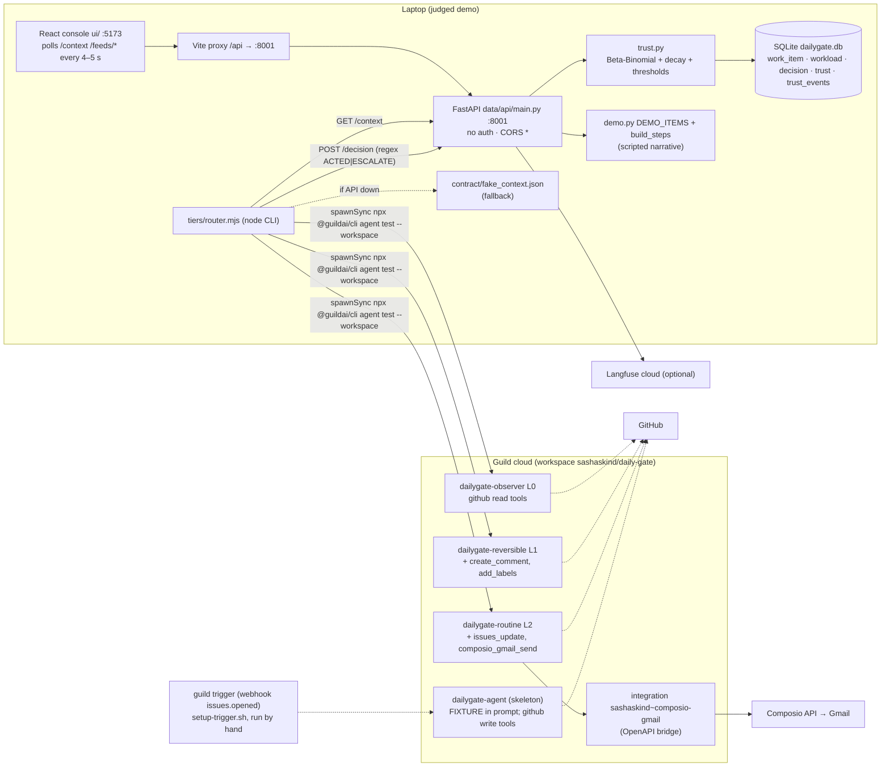
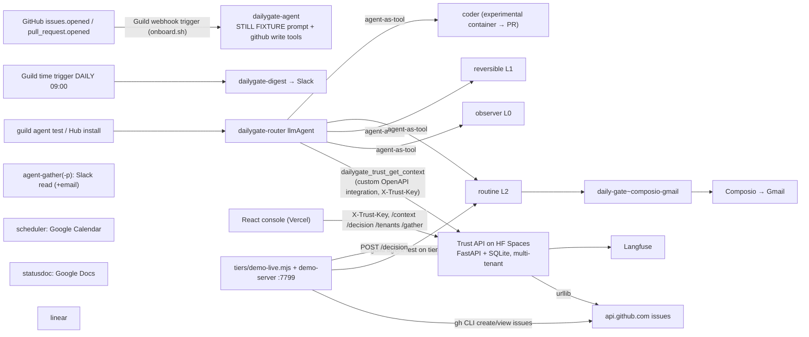
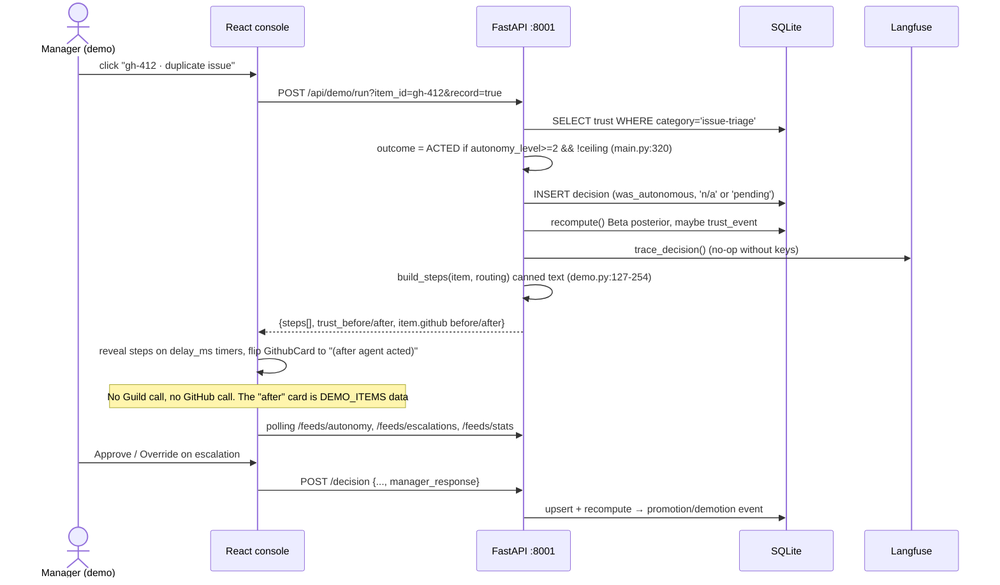

# DailyGate: whole-project deep dive

> **Current execution policy:** [Start now or anytime, with no build cutoff](../../event/BUILD_AUTHORIZATION.md). The human reports that the event is already underway and public schedules are stale. Older start/deadline/duration advice below is superseded; historical timestamps and analytics windows remain evidence, not build gates.

> Guild deep-dive team, 8 Oct 2026. Read-only. **[V]** = verified at file:line or with git. **[I]** = inference.
> Two code states are analysed:
> - **Judged** = merge commit `42b8648` (12 Jun 2026 16:55 PT; parents `f0d4f2f` and `21c6b12`). Read through `git archive 42b8648` into scratch. Nothing was checked out.
> - **HEAD** = `1249622` (7 Aug 2026).
>
> Line refs without a prefix are at the judged commit. HEAD refs are marked `@HEAD`.
> Round-1 file: [`analysis/guild-ai/dailygate.md`](../archive/source-tree/analysis/guild-ai/dailygate.md).

## 1. At a glance

DailyGate is a "chief of staff" agent for engineering managers. It watches work items from GitHub, Slack and email and decides, per item, whether to act (close a duplicate, nudge, send a thank-you) or escalate (a hiring decision, for example). The pitch is **earned autonomy**. Every manager approve or override feeds a time-decayed Beta-Binomial trust score per *category* of work, and that score maps to one of three **permission tiers**. Each tier is a separate Guild agent with a different tool grant, so promotion hands the work to an agent that physically has more tools. "Ceiling" categories (hiring) never promote.

It won **Most Innovative Use of Agents (Guild.ai)** at the Harness Engineering Hack (12 Jun 2026). It was probably a 2nd-place prize: the Devpost badge is verified, but the rank is inferred. Team: Sasha Skinderev and Tvisha Shah.

**Headline finding.** At judging, the Guild side was real: three published tier agents with genuinely different tool grants, plus a CLI router script. The UI's "Agent execution — live" panel, however, was a **scripted narrative**: `POST /demo/run` plus canned before/after GitHub cards from `data/api/demo.py`. It was committed at **16:27, three minutes before the 4:30 pm deadline**, and it makes no Guild call. The trust maths behind it was real. Most of what makes the repo impressive today was added in the 8 weeks after judging: the cloud router, live trust as a Guild integration, real execution, the coder agent, multi-tenancy and tests.

## 2. Repo map

### HEAD tree (2–3 levels; generated or scaffold files marked)

```
dailygate/
├── README.md                 product README (rewritten 27 Jun; links Vercel console, Guild Hub, HF Space)
├── DESIGN.md                 3 design decisions (Bayesian trust, tiers-as-agents, per-tenant)   [post-event]
├── CAPABILITIES.md HUB.md ONBOARDING.md   capability list, marketplace + onboarding docs      [post-event]
├── onboard.sh                installs agents + creates issues.opened webhook trigger            [post-event]
├── .mcp.json                 Guild CLI MCP server (`guild mcp`)
├── .claude/skills/           VENDORED Guild skills (agent-dev 1460, guild-cli-workflow 209, integrations 338 lines)
├── Gemini_Generated_Image_*.png   4.8 MB logo                                                     [post-event]
├── contract/                 FROZEN SEAM between the two lanes
│   ├── types.ts              canonical TS types (WorkItem, Workload, Decision, Trust, AutonomyLevel)
│   ├── context.schema.json   JSON Schema of GET /context
│   └── fake_context.json     423-line fixture exported from seed (data, not code)
├── agent/                    `dailygate-agent`: trigger-handler llmAgent (skeleton; FIXTURE state). Unchanged since judging
│   ├── agent.ts fixture.ts   prompt + embedded fake state
│   ├── integrations/         Composio→Gmail OpenAPI spec + `guild integration` setup script
│   ├── triggers/setup-trigger.sh   `guild trigger create --type webhook ... issues opened`
│   └── .claude/skills/       VENDORED copy of the same 3 Guild skills
├── tiers/                    THE LADDER
│   ├── observer/ reversible/ routine/   L0/L1/L2 llmAgents (agent.ts hand-written; package.json/tsconfig/markdown.d.ts/README = `guild agent init` scaffold)
│   ├── router.mjs            judged-era local router: reads trust → `guild agent test` on tier dir → POST /decision
│   ├── demo-live.mjs demo-server.mjs demo-reset.sh send_email.py   post-event live-demo harness
│   └── publish-tiers.sh      clone/save/publish org agents                                    [post-event]
├── router/                   `dailygate-router` cloud llmAgent, tiers-as-tools + trust integration   [post-event]
├── coder/                    code-first agent: experimental coding container → PR              [post-event]
├── agent-gather/ agent-gather-p/   Slack-reading llmAgents (p = + Composio email)              [post-event]
├── digest/ scheduler/ statusdoc/ linear/   extra capability llmAgents (Slack/Calendar/Docs/Linear) [post-event]
├── data/
│   ├── PLAN.md               367-line brief "You are Person B's Claude Code" (lane spec)
│   ├── schema.sql            ClickHouse DDL. Never used (the runtime is SQLite)
│   └── api/                  FastAPI trust service
│       ├── main.py           routes
│       ├── trust.py          Bayesian engine
│       ├── database.py       SQLite schema + migrations (+ tenants @HEAD)
│       ├── seed.py           demo dataset
│       ├── demo.py           scripted /demo/run narratives (judged UI's "live" panel)
│       ├── langfuse_client.py  Langfuse v4 traces/scores
│       ├── gather_github.py  REST pull of real issues                                       [post-event]
│       ├── test_trust.py     9 pytest tests                                                  [post-event]
│       ├── Dockerfile fly.toml dailygate-trust.openapi.yaml   deploy + Guild integration spec [post-event]
│       └── start.sh requirements*.txt .env.example
└── ui/                       React 18 + Vite console (hand-written CSS, no component library)
    └── src/ App.tsx api.ts types.ts components/{ExecutionPanel,EscalationQueue,AutonomyFeed,TrustLadder,
             TrustEventStream,TimeSavings,LoopDiagram,WorkItemList,TrustDashboard,Onboarding*,TrustToast*}.tsx styles.css
```

### Lines of code by language

Counts exclude `.git`, `.claude/skills`, `package-lock.json`, `node_modules` and the PNG. **[V]** `find … | xargs cat | wc -l`.

| Lang | Judged `42b8648` | HEAD | Notes |
|---|---|---|---|
| Python | 1,761 | 2,212 | trust.py 470→486, main.py 411→521, langfuse 343, demo.py 254, seed 183→188, +gather 85, +tests 141 |
| TS | 516 | 1,077 | agents + contract types + UI api/types. Includes 4→12 × 3-line `markdown.d.ts` scaffolds |
| TSX | 764 | 1,159 | UI components |
| MJS | 126 | 346 | router.mjs → + demo-live, demo-server |
| CSS | 775 | 975 | hand-written styles.css |
| SQL | 41 | 41 | unused ClickHouse DDL |
| Shell | 110 | 209 | setup scripts |
| JSON | 792 | 1,275 | mostly scaffold (package.json/tsconfig ×N) + 423-line fixture |
| YAML | 69 | 116 | 2 OpenAPI specs (Composio bridge, trust API) |
| Markdown | 527 | 908 | PLAN.md, READMEs, design docs |

- **Hand-written code** (py + ts + tsx + mjs + sh + sql, excluding CSS, JSON and scaffold `.d.ts`): about **3.3k at judging** and about **5.0k at HEAD**. Add about 0.8k / 1.0k of CSS.
- **Generated, vendored or scaffold:**
  - 4,014 lines of Guild Claude Code skills (two identical copies of 2,007 lines)
  - per-agent `package.json` / `tsconfig.json` / `.gitignore` / `markdown.d.ts` / `README.md` from `guild agent init`
  - the 423-line `fake_context.json` (exported seed data)
- **What this pass read, skimmed and skipped.**
  - **Read in full:** every `.py`, every agent `.ts`, the `.mjs` and `.sh` scripts, the contract, `App.tsx`/`api.ts`, and every judged-commit component.
  - **Skimmed:** `data/PLAN.md` (headings and §0–1), `fake_context.json`, `styles.css`, HEAD `Onboarding.tsx`/`TrustToast.tsx` (first 60/25 lines), `HUB.md`/`ONBOARDING.md`.
  - **Skipped:** the vendored `.claude/skills` files, lockfiles, scaffold `package.json`/`tsconfig.json`, and the PNG.
- **[I]** Nearly all the code was written by Claude Code. `data/PLAN.md:3` says "You are Person B's Claude Code", the Devpost says "two engineers (and two Claude Code agents)", and the Guild skills were dropped into `agent/.claude/skills` at 13:55, so the coding agent had them during the build.

## 3. System architecture

### 3a. Component diagram: judged state (`42b8648`)



The UI never calls Guild. The only path from code to Guild is `router.mjs` run in a terminal **[V: ui/src/api.ts:1-36; tiers/router.mjs:84-88]**.

### 3b. Component diagram: HEAD



### 3c. Sequence: the judged demo flow (UI button → visible result)



The CLI path, run separately (`node tiers/router.mjs gh-412`): it reads `/context`, applies the deterministic ceiling and level logic (`router.mjs:63-75`), and calls `npx @guildai/cli agent test --workspace sashaskind/daily-gate` with the JSON item on stdin from that tier's directory. That runs the agent in Guild, which builds and tests from the local working dir and needs no publish. The script then regex-parses `ACTED|ESCALATE` and POSTs `/decision` (`router.mjs:96-126`).

## 4. Component walkthrough

### 4.1 Trust service: `data/api/` (Python, FastAPI, SQLite). Tvisha's lane

- **`trust.py`** (470 lines; 486 @HEAD). The core IP.
  - Signal weights: approved 1.0, n/a 0.5, edited −0.4, overridden −1.0 (`:33-39`).
  - Exponential time weight with a 30-day half-life (`:90-92`).
  - Posterior mean `α/(α+β)` from prior (1,1) (`:123-167`). The docstring calls it the "MAP estimate", but it is the posterior mean.
  - Confidence = `1 − 1/(1 + n_eff/4)` (`:165`).
  - Risk thresholds 0.70/0.80/0.92 by keyword-inferred risk profile (`:52-73, 95-100`), shifted ±0.05 by the team-wide override rate (`:170-185`).
  - `recompute()` (`:269-381`): ceiling short-circuit, then immediate demotion if the latest decision is overridden or edited, else promotion if score ≥ threshold and confidence ≥ 0.20. It logs a `trust_events` row on level change or score Δ > 0.02.
  - `autonomy_level()` (`:223-242`) maps to 0/1/2. A reversible band at 0.55 gives L1.
  - `explain()` (`:391-470`) builds a plain-English audit with per-decision weighted signals.
- **`main.py`** (411 lines). Routes in §5. `post_decision` (`:145-231`) validates enums, upserts, captures before/after trust, and emits a Langfuse trace or a score update on resolution. `demo_run` (`:300-376`) is the scripted demo (§8).
- **`database.py`**. Schema (`:22-84`) plus an ALTER-TABLE migration (`:87-100`). WAL mode; a new connection on every call.
- **`seed.py`**. 5 assignees, about 30 work items arranged as "demo beats" (duplicate, overload trap, forgotten tasks, ceiling), 6 trust rows, 19 historical decisions. It then calls `recompute_all` and pushes the history to Langfuse (`seed.py:29-120`).
- **`demo.py`**. `DEMO_ITEMS` (5 items with hand-written GitHub before/after states and comments) and `build_steps()`, which returns timed step objects whose text claims "Agent has: github_issues_update, github_issues_create_comment" (`demo.py:203-205`).
- **`langfuse_client.py`**. Langfuse v4 OTel API: one `chain` trace per decision with an `evaluator` span and 5 scores, plus session-level scores keyed `trust-category:{cat}` (`:77-218`). It fails soft (`:217-218`).
- **@HEAD additions:**
  - `tenants` table and a `tenant` column on every table; the `tenant()` dependency resolves `X-Trust-Key` (`main.py@HEAD:53-63`)
  - `POST /tenants` (`:455-484`) and `POST /gather` (`:493-509`, backed by `gather_github.py`, which pulls via urllib)
  - deterministic latest-decision ordering with a `rowid` tiebreak (`trust.py@HEAD:317`, commit `821e49d`)
  - new categories auto-ceilinged when their risk is "high" (`trust.py@HEAD:257`)
  - `test_trust.py`: 9 tests covering auth, tenant isolation, gating, promotion, override demotion, ceiling and the mapping function
  - Dockerfile (non-root uid 1000, HF Spaces port 7860) and `fly.toml`

### 4.2 Agent lane: Guild agents (TypeScript, `@guildai/agents-sdk`). Sasha's lane

| Agent (dir) | Kind | Tools | State at judging |
|---|---|---|---|
| `agent/` dailygate-agent | `llmAgent`, one-shot | guild_get_me + github_issues_get/update/create_comment/add_labels (`agent/agent.ts:70-79`) | Skeleton. The prompt embeds `FIXTURE` (`:10, 64-65`). **Unchanged at HEAD** |
| `tiers/observer` | `llmAgent`, Zod input + `inputTemplate` | github issues get/list/list_comments + guild_get_me (`:40-47`) | exists |
| `tiers/reversible` | same | + create_comment, add_labels (`:45-52`) | exists. Prompt: "In this proof, name the exact tool + key args you would call" (`:27`). **Same at HEAD** |
| `tiers/routine` | same | + issues_update, `composio_gmail_composio_gmail_send` (`:44-53`) | exists. Prompt: "Name the exact tool + key args you invoke … Live delivery is gated only by Gmail OAuth verification" (`:24-28`) |
| `router/` | `llmAgent`, tiers + coder as tools, trust integration | `router@HEAD:62-68` | **post-event** (15–16 Jun) |
| `coder/` | code-first `agent({run})` | experimental_coding_create/delete, `communicate`, 9 GitHub git-data tools (`coder@HEAD:33-53`) | post-event |
| `agent-gather(-p)`, `digest`, `scheduler`, `statusdoc`, `linear` | `llmAgent` | Slack / Calendar / Docs / Linear service tools | post-event |

`tiers/router.mjs` (126 lines) is the judged-era orchestrator:
- hardcoded `ITEMS` (`:30-36`)
- trust read with a fixture fallback (`:39-51`)
- `--level` "demo-only" override (`:60-61`)
- deterministic ceiling cap (`:67-74`)
- `spawnSync` of the Guild CLI (`:84-88`)
- regex write-back (`:98-126`)

### 4.3 Frontend: `ui/` (React 18 + Vite 6, no UI library)

At judging, `App.tsx` (83 lines) composed these components, polling every 5 s (`App.tsx:23-27`):
- `LoopDiagram`: static
- `ExecutionPanel`: drives `/demo/run`
- `EscalationQueue`: Approve/Override → `POST /decision`, poll every 4 s
- `AutonomyFeed`
- `TrustLadder`: score bar, threshold tick, confidence
- `TimeSavings`: duplicates the server's `TIME_PER_CATEGORY` (`TimeSavings.tsx:3-10`)
- `TrustEventStream`

`WorkItemList.tsx` and `TrustDashboard.tsx` exist but are **not mounted** at judging (dead code) **[V: App.tsx imports]**.

@HEAD the UI adds:
- `Onboarding` modal (demo / create org / paste key / connect repo)
- `TrustToast` for promotion and demotion
- "teach" approve/override buttons per category (`TrustLadder.tsx@HEAD`, `api.ts@HEAD:83-104`)
- an org switcher and `VITE_API_BASE` for the Vercel deploy

### 4.4 Scripts, infra, CI

- `agent/integrations/setup-composio-gmail.sh`: `guild integration create/version/operation/build/publish` of the OpenAPI bridge (`:12-29`). Connecting the credential is left as a manual step (`:31-33`).
- `agent/triggers/setup-trigger.sh`: webhook trigger on the org workspace `daily-gate/team`, agent `daily-gate~dailygate-agent` (`:25-30`). The comments say "YOU run this", so whether it was executed is unknown.
- @HEAD:
  - `publish-tiers.sh` (clone → copy agent.ts → `agent save --publish` → `workspace agent add`)
  - `onboard.sh`
  - `demo-reset.sh` (creates 3 real GitHub issues with `gh`)
  - `demo-server.mjs` (local control panel on :7799)
  - Dockerfile and `fly.toml`
- **No CI, no lint config, no tests at judging.** The 9 pytest tests came on 9 Jul.

## 5. Data model

### Tables (SQLite; `database.py:25-82`. @HEAD adds `tenant` to each table, plus a `tenants` table)

| Table | Key columns |
|---|---|
| `work_item` | id PK, source ∈ {github, slack, email}, title, owner_suggested, age_days, status ∈ {open, in_progress, stale, done}, is_duplicate_of, type |
| `workload` | assignee PK, kind ∈ {person, agent}, open_tasks, est_load_score (>70 = overloaded) |
| `decision` | id PK (upsert key), item_id, category, action, stakes ∈ {low, high}, reversible, was_autonomous, manager_response ∈ {approved, overridden, edited, pending, n/a}, timestamp |
| `trust` | category PK, trust_level ∈ {ask, auto}, trust_score, trust_confidence, auto_threshold, decay_half_life, approvals/overrides_count, ceiling, risk_profile, last_event |
| `trust_events` | id, category, event_type ∈ {promoted, demoted, score_updated, created, threshold_adjusted}, old/new level+score, confidence, reason, decision_id, timestamp |
| `tenants` @HEAD | api_key PK, tenant, name, created |

`data/schema.sql` is ClickHouse DDL (MergeTree / ReplacingMergeTree) that is **never executed**. The README sponsor stack claims ClickHouse (`README.md:19,25,39` at judging). That claim is false **[V]**.

### API routes

| Method | Path | Handler (judged) | Purpose | Auth judged / HEAD |
|---|---|---|---|---|
| GET | `/context` | `main.py:135` | full snapshot (work_items, workload, trust with derived `autonomy_level`) | none / X-Trust-Key |
| POST | `/decision` | `main.py:145` | upsert decision, recompute trust, Langfuse | none / key |
| GET | `/trust/{category}/explain` | `main.py:236` | audit trail | none / key |
| GET | `/feeds/autonomy` | `:251` | was_autonomous=1 | none / key |
| GET | `/feeds/escalations` | `:261` | pending | none / key |
| GET | `/feeds/trust-dashboard` | `:270` | trust ordered by score | none / key |
| GET | `/feeds/trust-events` | `:279` | learning log | none / key |
| GET | `/feeds/langfuse` | `:290` | deep links | none / key |
| POST | `/demo/run` | `:300` | **scripted** run, records a real decision | none / key |
| GET | `/feeds/stats` | `:379` | hours saved, counts | none / key |
| GET | `/health` | `:408` | status + Langfuse | none / none |
| POST | `/tenants` | `main.py@HEAD:455` | mint `dgk_…` key, bootstrap gated ladder | open unless `ADMIN_KEY` set |
| POST | `/gather` | `main.py@HEAD:493` | pull a repo's issues into work_item | key |
| GET | `/whoami` | `main.py@HEAD:518` | key → tenant | key |

### Contract

`contract/types.ts:1-90` is frozen TypeScript, mirrored by `context.schema.json`. The frozen constants (`contract/README.md:20-25`: "N=3 approvals → auto") are no longer what the Bayesian engine does. The engine keeps `CONSECUTIVE_APPROVALS_NEEDED = 3` only as a "legacy constant" (`trust.py:23`).

### Environment variables

| Var | Where | Needed for |
|---|---|---|
| `LANGFUSE_PUBLIC_KEY`, `LANGFUSE_SECRET_KEY`, `LANGFUSE_HOST` / `LANGFUSE_BASE_URL` | `langfuse_client.py:38-48` | optional tracing |
| `VITE_API_BASE` | `vite.config.ts:12`; `api.ts@HEAD:6` | proxy target / prod API |
| `API_BASE` | `router.mjs:39`; `demo-live.mjs@HEAD:21` | trust API for CLI scripts |
| @HEAD: `DAILYGATE_DB`, `DEMO_TRUST_KEY` (default `demo-key`), `ADMIN_KEY`, `GITHUB_TOKEN`, `PORT` | `database.py@HEAD:20-24`, `main.py@HEAD:42,505`, Dockerfile | deploy, tenancy |
| @HEAD: `COMPOSIO_API_KEY`, `COMPOSIO_USER_ID`, `COMPOSIO_GMAIL_AUTH_CONFIG`, `DEMO_EMAIL_TO`, `GMAIL_USER`, `GMAIL_APP_PASSWORD` | `.env.example@HEAD`, `send_email.py@HEAD:15-16` | email paths |
| Guild auth | via `guild auth login` (CLI state, gitignored `.guild/`) | all agent runs |

## 6. AI / agent design

- **Provider and model: none specified anywhere.** Every agent is a Guild `llmAgent` with no model field, so it runs on the Guild platform's default LLM **[V: grep for model/claude/gpt/gemini in agent.ts files returns nothing]**. No direct OpenAI or Anthropic SDK calls exist in the repo. **The trust engine is pure statistics, not ML.**
- **Pattern at judging: a deterministic orchestrator with LLM leaves.**
  - `router.mjs` decides the tier in code.
  - The LLM inside each tier only decides how to word its single-line verdict, and whether to call a tool from the subset it was granted.
  - Output parsing is a regex on `(ACTED|ESCALATE)\b[^\n]*` (`router.mjs:99`). On a miss there is no write-back and no retry.
  - There are no retries anywhere.
- **Pattern at HEAD: an LLM router with agents as tools.** `router/agent.ts@HEAD` holds the trust tool and **all four** sub-agents as tools, and is told to "call exactly ONE delegation tool".
  - Tier selection and the ceiling now depend on prompt compliance (`router@HEAD:34-39`).
  - If the trust call fails, the prompt's hardcoded table applies: issue-triage=2, capacity-assignment=2, thank-you-note=2 (`router@HEAD:44-46`). **That fails open.**
- **Key prompts (trimmed):**
  - Observer (`tiers/observer/agent.ts:15-28`): "Your tools are READ-ONLY … those tools are simply not available to you (Guild has not granted them) … Respond with EXACTLY one line: ESCALATE · <category> · … · (level 0 observer lacks write permission)".
  - Routine (judged, `tiers/routine/agent.ts:18-32`): "ACT — carry out the needed action with your tools … Name the exact tool + key args you invoke, then confirm. (Live delivery is gated only by Gmail OAuth verification …)". The HEAD version says "REALLY SEND … Actually invoke the tool — do not just describe it" (`routine@HEAD:24-34`). That change is itself evidence the judged version narrated rather than executed **[I, strong]**.
  - Trigger agent (`agent/agent.ts:19-66`): act-vs-escalate rules, workload-aware assignment (>70 load → reassign), `ui_prompt` only when interactive, and `${JSON.stringify(FIXTURE)}` as "CURRENT STATE (from the data layer)".
  - Coder (`coder@HEAD:59-74`): "careful junior engineer … if NOT clearly trivial … reply ESCALATE … create branch dailygate/fix-N … open a pull request". The issue body is interpolated raw.
- **Memory.** The SQLite decision ledger *is* the long-term memory. Agents are stateless one-shots with `useWorkspaceAgents: false` on every agent, which isolates them from other workspace agents.
- **Multi-agent orchestration.** Judged: an external script picks one of three agents. HEAD: hierarchical delegation inside Guild (router → tier/coder), and the coder agent in turn talks to a coding agent inside a container (`communicate`).
- **Human in the loop.** The design rejects Guild's `ui_prompt` because "`ui_prompt` can't run under triggers" (Devpost; `agent/agent.ts:54-57`). Instead it uses an async persisted queue (`manager_response='pending'`), and resolutions become training signal.

## 7. All integrations

| Service | Usage (file:line) | Depth at judging | Depth at HEAD |
|---|---|---|---|
| **Guild agents SDK / runtime** | 4 `llmAgent`s with `pick()`-scoped tools; `guild agent test` from router.mjs:84-88 | **core-to-the-pitch** (tool grant = permission) | core |
| Guild GitHub service tools | `@guildai-services/guildai~github` picks per tier | load-bearing in design. Real execution against the fake `gh-412` ids is doubtful, because the tier input has no owner/repo **[I]** | load-bearing (real issues via demo-live `repoCtx`, `demo-live.mjs@HEAD:60-66`) |
| Guild custom OpenAPI integration | Composio Gmail bridge (`composio-gmail.openapi.yaml`, setup script) | thin wrapper; real send unproven | real send claimed (`68c1e86`, 13 Jun) |
| Guild trigger | `setup-trigger.sh` (manual) → dailygate-agent | decorative (script present, fixture agent) | thin. Wired to the still-fixture agent (`onboard.sh@HEAD:23-28`) |
| Guild trust integration | `dailygate-trust.openapi.yaml@HEAD` + `router@HEAD:13,63` | absent | load-bearing |
| Guild experimental coding container | `coder@HEAD:8-10,57,76-83` | absent | load-bearing for coder |
| Guild Slack / Calendar / Docs / Linear | gather, digest, scheduler, statusdoc, linear @HEAD | absent | thin (CAPABILITIES.md: 3 of these "need connected to run live") |
| Guild CLI MCP + skills | `.mcp.json`; `.claude/skills` | dev tooling | dev tooling |
| **Composio** | Gmail via `/tools/execute/GMAIL_SEND_EMAIL` | thin wrapper, unproven | thin. `send_email.py@HEAD:2-4` admits "Composio's managed Gmail OAuth is blocked by Google's app-verification" and adds an SMTP path |
| **Langfuse** | `langfuse_client.py` traces + scores; seed history push | load-bearing for observability (optional) | same |
| ClickHouse | `data/schema.sql` only | **decorative / false claim** | removed from README |
| OpenUI / Thesys C1 | `ui/package.json:23` comment only | **claimed, not used** | removed |
| Hugging Face Spaces, Vercel | Dockerfile, README links | n/a | hosting |
| GitHub REST | `gather_github.py@HEAD:34-47` | n/a | real |

## 8. Real vs. mock map

Status is given for both states.

| Feature / claim (Devpost, README, demo) | Judged `42b8648` | HEAD | Evidence |
|---|---|---|---|
| Bayesian per-category trust with decay, confidence, risk thresholds | **real** | real + tested | `trust.py:123-185, 269-381`; `test_trust.py@HEAD` |
| Override → immediate demotion | **real** | real (deterministic tiebreak fixed) | `trust.py:304-313`; `821e49d` |
| Ceiling never promotes | **real** in engine and router.mjs | real in engine; **prompt-only** in cloud router | `trust.py:236-237, 285-293`; `router.mjs:68-70`; `router@HEAD:34-35` |
| Tiers have different Guild tool grants | **real** | real | `tiers/*/agent.ts` tool blocks |
| Tiers take real actions (close, comment, email) | **mostly narrated**. Reversible: "name the exact tool … you would call". Routine: "Name … then confirm". The fake ids have no repo | real for routine (prompt rewritten 13 Jun); reversible **still** "would call" | `reversible/agent.ts:27`; `routine/agent.ts:24-28`; `routine@HEAD:24-34` |
| UI "Agent execution — live" panel | **hardcoded/scripted**. Steps and GitHub before/after are canned; the only real part is the decision insert + trust recompute | unchanged (still `/demo/run`) | `main.py:300-376`; `demo.py:19-124, 127-254`; `ExecutionPanel.tsx:72-101` |
| "Agent has: github_issues_update …" step text | **hardcoded** string | same | `demo.py:203-205` |
| Hours saved / "acted alone" counters | partially real: counts from DB, but the minutes per category are constants and 12 autonomous decisions are **seeded** | same + per-tenant | `main.py:379-405`; `demo.py:8-15`; `seed.py` d-001…d-016 |
| Work items from GitHub / Slack / email | **seeded fake** (30 rows) | GitHub real via `/gather`; Slack via agent-gather (agent output only, not stored); email items still seeded | `seed.py:51-104`; `gather_github.py@HEAD` |
| Real-time trigger: new issue wakes the agent | script exists; target agent reasons on **FIXTURE** | trigger wired; target agent **still FIXTURE** and bypasses tiers | `setup-trigger.sh:25-30`; `agent/agent.ts:10,64-65`; `onboard.sh@HEAD:23-28` |
| Live trust read by the agent | router.mjs reads the live API, **falls back to fixture silently** | cloud router reads it via integration, **falls back to a prompt table (fail-open)** | `router.mjs:39-51`; `router@HEAD:30-33, 44-46` |
| Escalation queue, approve/override | **real** | real + "teach" buttons that inject approvals without an action | `EscalationQueue.tsx:15-18`; `api.ts@HEAD:83-104` |
| Langfuse traces, manager responses as Scores | **real** if keys are set | same | `langfuse_client.py:77-260` |
| ClickHouse ledger | **missing** (SQLite) | removed from claims | `database.py:8-19`; `schema.sql` unused |
| Composio Gmail send | **unverified/missing**. Prompt says delivery "gated … by Gmail OAuth verification" | real path claimed; SMTP fallback added because Composio OAuth was blocked | `routine/agent.ts:27-28`; `send_email.py@HEAD:2-4` |
| OpenUI / Thesys generative UI | **missing** | missing | `ui/package.json:23` |
| Coder opens PRs | missing | partially real ("live PR via web UI (long container run)") | `coder@HEAD`; `CAPABILITIES.md@HEAD` |
| Multi-tenant isolation | missing | real + tested | `main.py@HEAD:53-63`; tests |
| Code-fix "permanently capped" (HUB.md) | n/a | **false**: `code-fix` infers "medium" risk → ceiling 0 → can reach L2 via the coder | `trust.py@HEAD:63-73, 257`; `HUB.md@HEAD` |

**Ratio at judging [I].** Of the 15 judged-era claims above:
- about 5 real (the trust engine, demotion, ceiling, tool grants, the escalation loop, Langfuse)
- 3 partial (counters, tier actions, live trust)
- about 7 mocked, hardcoded or missing (execution panel, the step text, work items, trigger target, ClickHouse, Composio, OpenUI)

The **statistics and Guild permission design were real. The visible "agent acting" was not.**

## 9. Demo path trace

The video (B5a7SoK_7Bs, 150 s, uploaded 12 Jun) is narrated against the judged code. The transcript is taken from round 1; a fresh `yt-dlp` fetch failed in this pass.

1. **[00:00–00:38] Hook and concept.** No code: "stuck between two extremes … earns its autonomy over time". `LoopDiagram.tsx` is the visual (static array, `:3-8`).
2. **[00:38–01:16] Architecture: "Composio … a trust gate where we calculate a Bayesian score … candidate decision you always need escalation".**
   - The trust bars are `TrustLadder.tsx` fed by `GET /context`, with `autonomy_level` computed at `main.py:77` → `trust.py:223-242`.
   - The "candidate-decision" badge is the seeded `ceiling=1` row (`seed.py` trust_rows).
3. **[01:34–01:53] "It did a code review on its own … pushed for a stale task … sent a thank-you note … nudged an employee."** This list is `AutonomyFeed` → `/feeds/autonomy`.
   - Its rows are mostly **seeded history** (`seed.py` d-001…d-016, e.g. "Sent thank-you to open-source contributor", "Nudged marco on stale task gh-310").
   - Plus anything recorded by `/demo/run`, whose action strings come from `DEMO_ITEMS[*].action` (`demo.py:25,51,76`).
   - **[I]** "Did a code review on its own" cannot come from an L2 run at seed state. Code-review sits at about 0.74 against a 0.80 threshold (my hand calculation from `seed.py` + `trust.py`), so `/demo/run gh-377` would *escalate*. The wording is narration over feed text.
4. **[01:53–02:28] "2.3 hours saved, 14 acted alone, four categories trusted."**
   - `/feeds/stats` (`main.py:379-405`) multiplies the counts of `was_autonomous=1` rows by the constants in `demo.py:8-15`.
   - The seed alone gives 12 autonomous rows and 112 min. The on-screen numbers therefore include about 2 recorded `/demo/run` executions **[I]**.
   - The "categories trusted" pill is `routineCount` (`App.tsx:31`).
5. **Not shown per captions:** any Guild UI, a Guild session, `router.mjs` output, or a tier refusing for lack of a tool. Guild is never named in the captions **[round-1, V]**.

**[I]** The judged demo exercised the trust service and the scripted panel. The Guild tier agents were demonstrated, if at all, only in the live judging conversation (the README's `tiers/README.md` "Proven behaviour" table, `:27-34`), and that table records LLM verdict lines, not verified side effects.

## 10. Code quality and security review

### Quality

- **Good:**
  - a clean two-lane split with a frozen contract (`contract/`)
  - a readable, well-commented `trust.py` with an `explain()` audit
  - Pydantic input with enum validation (`main.py:153-159`)
  - parameterized SQL throughout (the one f-string, `database.py:100`, interpolates constant column names only)
  - fail-soft Langfuse
  - consistent use of `pick()` to scope tools
- **Weak:**
  - **No tests at judging.**
  - Two dead UI components.
  - Duplicated constants: `TIME_PER_CATEGORY` in Python and TS; `ITEMS` in router.mjs vs `DEMO_ITEMS`.
  - The docs drift: "N=3", ClickHouse, OpenUI.
  - `trust.py` calls the posterior mean the "MAP".
  - Upsert on `/decision` lets any caller rewrite `category`, `action` and `was_autonomous` on an existing id (`main.py:187-194`).
  - The judged latest-decision query had no tiebreak (fixed @HEAD).
  - Regex parsing of free-text agent output.
  - Misleading commit messages: `81c18d4` "add write-back loop" contains only `ui/package-lock.json` (+1,855); the write-back code actually landed in `13760cf` **[V]**.
  - TypeScript strictness is not enforced in the agent dirs beyond the scaffold tsconfig.

### Security (relevant to a cyberdefense audience)

| # | Issue | Where | Severity |
|---|---|---|---|
| 1 | **No auth on any endpoint at judging.** Anyone who reaches :8001 can POST `/decision` approvals and **promote any non-ceiling category to L2**, which is privilege escalation of an autonomous agent. Bound `0.0.0.0` with `--reload` | `main.py:145`; `start.sh:34` | high (demo) |
| 2 | **CORS `*`** with all methods and headers, judged and HEAD | `main.py:32-37` | medium |
| 3 | **Shared default credential** `demo-key`, hardcoded and advertised in README/UI | `database.py@HEAD:24`; `api.ts@HEAD:15`; `README.md@HEAD` | medium |
| 4 | **Open tenant provisioning** when `ADMIN_KEY` is unset (the default), and the README invites `curl -X POST …hf.space/tenants` | `main.py@HEAD:40-42, 463` | low–medium |
| 5 | **Trust gaming by design.** The "teach" button posts synthetic approvals with no underlying action, so anyone with the key can manufacture autonomy | `api.ts@HEAD:83-104` | medium (design) |
| 6 | **Prompt-only ceiling + fail-open fallback** in the cloud router, which holds all tier tools at once | `router@HEAD:34-35, 44-46, 62-68` | high (for the pitch) |
| 7 | **Webhook-triggered agent bypasses the ladder.** `dailygate-agent` holds `github_issues_update`/`create_comment` itself, decides from an embedded fixture that says issue-triage is "auto", and is wired to `issues.opened` on a public repo. **Any outsider who opens an issue feeds untrusted text to an agent with write tools** (prompt injection → close/comment) | `agent/agent.ts:10, 64-79`; `setup-trigger.sh:25-30`; `onboard.sh@HEAD:23-28` | high |
| 8 | **Prompt injection into the coder.** The issue title and body are interpolated into a coding agent's instructions, and that agent holds git write + PR tools | `coder@HEAD:59-74, 41-53` | high (if promoted) |
| 9 | GitHub token accepted in a JSON body and sent to the hosted API (not stored) | `main.py@HEAD:488-505` | low |
| 10 | Unauthenticated local control server that creates real GitHub issues with the operator's `gh` credentials; listens on all interfaces | `demo-server.mjs@HEAD:82-102` | low (local) |
| 11 | Trust key in `localStorage` | `api.ts@HEAD:12-26` | low |

**No committed secrets:** a grep for `ghp_`, `AKIA`, `sk-`, `ak_` and real `pk-lf-` values finds only placeholders in `.env.example` files **[V]**. `.gitignore` covers `.env`, `*.pem`, `*.key` and `*.db` (`.gitignore:7-25`). No shell injection was found: the `spawn`/`spawnSync` calls use argv arrays (`router.mjs:84`, `demo-live.mjs@HEAD:41,68`).

## 11. Build history

**49 commits; 2 authors.**
- Sasha: 41 commits in total (13 by the judged commit)
- Tvisha: 8 commits, all on event day

21 commits on event day up to the judged merge (round 1 said about 27; corrected) **[V]**. Times are PT, 12 Jun. Sizes exclude `package-lock.json` unless noted.

| Hour | Commits (author, +ins/−del) |
|---|---|
| 11:xx | `66ea77e` 11:51 Sasha first commit (+1) |
| 13:xx | `ec111e4` 13:00 Sasha `data/PLAN.md` Claude brief (+367); `16a0c9b` 13:11 Sasha repo skeleton (23 files, +746); `7e3a08b` 13:55 Sasha agent skeleton + Composio bridge (+294 code, +2,007 vendored skills) |
| 14:xx | `47c95b7` 14:27 **Tvisha data+trust lane** (+1,403: trust.py 445, main.py 246, seed 171, db 100); `83ad066` 14:28 Sasha 3-tier ladder + router.mjs (26 files, +573); `c4ba887` 14:39 merge; `0960999` 14:48 lane-mismatch fixes (+102/−70); `fae2413` 14:48 remove MISMATCHES.md |
| 15:xx | `81c18d4` 15:00 "write-back loop" (actually only ui lockfile +1,855); `ddcebd3` 15:05 Tvisha Langfuse (+442); `13760cf` 15:11 Sasha trigger-ready agent + **real write-back in router.mjs** (+93); `caa8634` 15:25 Tvisha Langfuse v4 fix (+149/−158); `b896d74` 15:27 merge; `7c64ec9` 15:56 Tvisha .env.example (+9) |
| 16:xx | `6e440b0` 16:06 Sasha setup-trigger + routine tweak (+19/−11); `cf3b170` 16:10 Tvisha mission-control UI (+983/−142); **`f354ebe` 16:27 Tvisha light UI + `/demo/run` + demo.py + ExecutionPanel (+1,442/−568)**; `f0d4f2f` 16:34 YouTube link; `21c6b12` 16:36 Guild skills copy + .mcp.json (+2,017, vendored); **`42b8648` 16:55 merge = judged** |

- **Before the event:** nothing. The first commit is 11:51 on event day, and no prebuilt code was found. The vendored Guild skills and the `guild agent init` scaffolds are the only non-original material.
- **Final hour (15:30–16:30):** the entire judged UI (two UI commits totalling +2.4k/−0.7k lines), the scripted demo endpoint, the trigger script and the env example. The demo video was uploaded the same day.
- **After the deadline:** 16:34–16:55 docs, skills and the merge only. Then 28 commits, all by Sasha:

| Date | Commits | What landed |
|---|---|---|
| 13 Jun 23:18–23:46 | 5 | real Composio/GitHub execution, Slack gather, live demo harness |
| 15 Jun 11:49–23:38 | 11 | publish tiers, cloud router, org workspace, Dockerfile, onboarding, gather, coder/digest/scheduler/statusdoc/linear (+742) |
| 16 Jun | 1 | router reads live trust via Guild integration |
| 18 Jun | 6 | multi-tenancy, X-Trust-Key, UI toasts/teach, real GitHub gather, onboarding modal |
| 27 Jun | 2 | HF Spaces deploy, README rewrite |
| 5 Jul | 1 | Guild marketplace link |
| 9 Jul | 1 | tests + DESIGN.md |
| 7 Aug | 1 | README |

- **Unchanged since judging:** `agent/agent.ts`, `tiers/observer`, `tiers/reversible`, `router.mjs`, `demo.py`, `ExecutionPanel.tsx` **[V: git diff --stat]**.

### What changed after judging (summary)

1. **Execution became real.** The routine prompt switched from "name the tool" to "really invoke" (13 Jun). A real-issue harness (`demo-live.mjs`) was added. The reversible tier is still narrate-only.
2. **Routing moved from code to an LLM.** The cloud `router/agent.ts` replaced `router.mjs` as the "installable" entry point. This weakened the ceiling from code to prompt and added a fail-open fallback table.
3. **Live trust became a Guild integration** (`dailygate-trust` OpenAPI with `X-Trust-Key`), hosted on HF Spaces.
4. **Multi-tenancy + auth + 9 tests + DESIGN.md**, and a deterministic tiebreak bug fix.
5. **Five extra capability agents and a coder agent**, three of them never run live per `CAPABILITIES.md`.
6. **Claims cleaned up:** ClickHouse and OpenUI were removed from the README.
7. **Not fixed:** the trigger target is still the FIXTURE skeleton, and the UI "live" panel is still scripted.

## 12. How hard was this to build?

**[I]** A skilled builder with Claude Code and the Guild skills could rebuild the **judged** version in 5.5 hours. Two people did, in about 4.7 hours of commits (11:51–16:27).

| Part | Estimate |
|---|---|
| Trust engine + FastAPI + seed + Langfuse | about 1.5 h with an LLM (formula-heavy but small) |
| 3 tier agents | about 30 min of code, but **Guild account, workspace, auth, `agent test` and the integration publish flow are the real time sink** (the CLI pinned at `@0.12.3` and the zsh workarounds in scripts hint at friction) |
| Composio→Guild OpenAPI bridge | about 45 min including credential plumbing. Delivery was blocked by Google OAuth verification |
| UI (two passes) | about 1.5 h |

**The hard parts:**
- (a) learning Guild's tool-grant, publish and trigger model fast enough to make "the toolset is the permission" true
- (b) choosing defensible trust maths (decay + confidence gate + immediate demotion)
- (c) coordinating two lanes; the frozen contract plus `PLAN.md` solved this

The **HEAD** version (agents-as-tools router, experimental coding container, custom integration with tenant keys, HF deploy) is about 2–3 more days of work.

## 13. Reusable patterns and code (Cyberdefense entry)

1. **The toolset is the permission: one Guild agent per tier.** Map to SOC tiers: `observe` (read alerts/logs) → `contain` (isolate host, disable token) → `remediate` (rotate creds, close the ticket).
   ```ts
   // tiers/reversible/agent.ts:45-52
   tools: { ...pick(gitHubTools, ["github_issues_get","github_issues_create_comment","github_issues_add_labels"]),
            ...pick(guildTools, ["guild_get_me"]) },
   ```
2. **Deterministic gate in front of the LLM; fail closed.** Copy `router.mjs`, not `router/agent.ts`:
   ```js
   // tiers/router.mjs:67-74
   const earned = override !== null ? override : t.autonomy_level;
   if (t.ceiling) { level = 0; why = `... CAPPED at level 0 (earned ${earned} ignored)`; } else { level = earned; ... }
   ```
   Change the fixture fallback (`:49-50`) to **level 0 on any trust-read failure**, and remove the `--level` override in production.
3. **A Bayesian earned-autonomy engine with immediate demotion** (port as-is). Use it per incident class or per playbook action:
   ```python
   # trust.py:308-317
   immediate_demotion = bool(latest and latest["manager_response"] in ("overridden", "edited"))
   if immediate_demotion: new_level = "ask"
   elif new_score >= threshold and confidence >= MINIMUM_CONFIDENCE_TO_PROMOTE: new_level = "auto"
   else: new_level = "ask"
   ```
   Add an *explicit* ceiling list for categories such as `disable-mfa`, `delete-data` and `prod-firewall`. Don't rely on keyword risk inference; `code-fix` slipping through as "medium" shows why.
4. **An async approval queue as the training signal.** `manager_response='pending'` → Approve/Override upserts the same id → recompute (`main.py:164-202`; `EscalationQueue.tsx:15-18`). It works under triggers, where Guild `ui_prompt` cannot run.
5. **An explainable audit endpoint.** `GET /trust/{category}/explain` (`trust.py:391-470`) returns weighted signals, events and a "path to promotion", which is exactly what a security reviewer wants to see.
6. **Frozen contract + per-lane Claude briefs** (`contract/`, `data/PLAN.md`) to parallelize a two-person team.

**Avoid:**
- a scripted "live execution" panel (`demo.py`), or at minimum label it a simulation
- LLM routers holding every privileged sub-agent at once
- prompt fallback tables that fail open
- wiring an untrusted public webhook to an agent with write tools
- "teach" buttons that mint approvals
- claiming sponsors (ClickHouse, OpenUI) that only appear in docs
- a default shared API key
