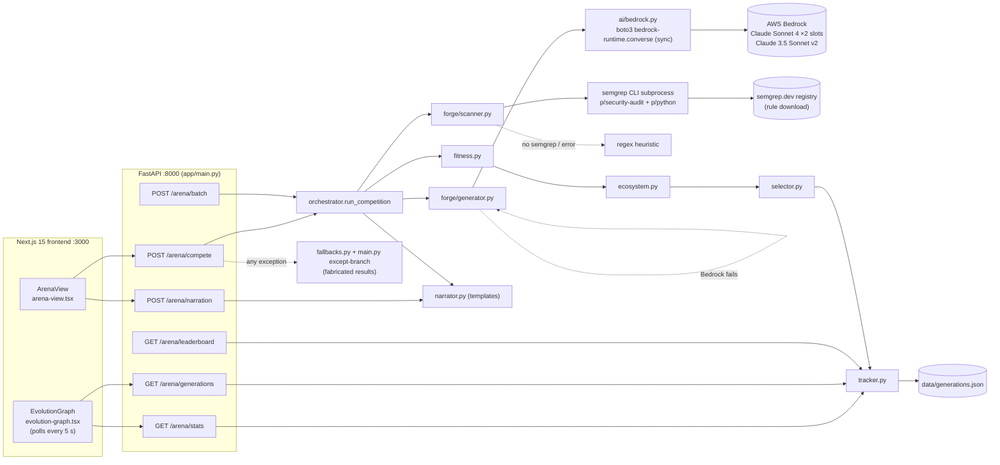
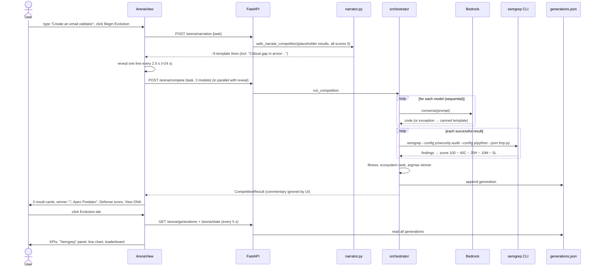

# Darwin: whole-project deep dive

Round 1: [`analysis/semgrep/darwin.md`](semgrep-darwin.md). This pass read every hand-written file in `repos/semgrep/darwin` and the persisted run log `backend/data/generations.json`. Paths below are relative to `repos/semgrep/darwin/` unless noted.

## 1. At a glance

Darwin is a "natural selection" arena for LLM-generated Python tools. You type a task such as "Create an email validator". Three Bedrock model slots each write a function. Each output is scored and the highest weighted "fitness" survives. Security from a Semgrep scan is 40% of that score, success 30%, latency 20% and a quality number 10%. Every run is appended to a JSON log, and an "Evolution" tab charts winners over time. The pitch: "don't pick the best model; let it emerge under security selection pressure." The audience is agent builders who generate tools on demand. It won **Best Use of Semgrep** at the AWS AI Agents Hackathon in San Francisco on 10 Oct 2025. The tier is unpublished; round 1 inferred the 3rd tier, "clean scan of generated code".

**New in this pass, beyond round 1:**
- **[V] Semgrep did find real issues during the day, but never in the demo.** 14 tool results scored exactly **75** between 15:47 and 16:00: one `WARNING` finding at −25 each (`forge/scanner.py:373-381`). Those runs were URL shorteners using `hashlib.md5`, a GitHub API client, a weather wrapper and a web scraper using `urllib.request.urlopen`. **[I]** These match Semgrep registry rules for MD5 use and dynamic urllib use. The regex heuristic has no urllib/MD5 pattern and adds bonuses, so it cannot produce a clean 75 on that code (`scanner.py:80-243`).
- **[V] The demo's "Vulnerabilities: 150" counts failed runs, not findings.** It equals 15 tool results with `security_score: 0`. Every one is a run rejected with `"Invalid model names: llama-3.1-70b, gpt-4"` (generations.json, 15:15–15:46). The UI estimates `floor((100−0)/10) = 10` per result (`frontend/src/components/evolution-graph.tsx:80-84`), and 15 × 10 = 150. The 75-scored results with real Semgrep findings count as **0**, because the estimator ignores scores of 70 or above.
- **[V] Bedrock calls are sequential and block the event loop.** `_generate_real_tools` loops over the models (`forge/generator.py:393-397`). `_call_bedrock` uses synchronous `boto3 client.converse` inside an `async def` (`ai/bedrock.py:117`). The README's "parallel model invocation" (`README.md:515`) is false. The "execution_time" in fitness is LLM latency, not tool runtime.
- **[V] 37 of 192 persisted tool results have `bedrock_used: false`.** Bedrock failed on those and canned template code was substituted, still marked `success: True` (`generator.py:408-422`).
- **[V] The `gpt-4` and `llama-3.1-70b` leaderboard wins come from the pre-Bedrock mock era (13:48–14:00).** Neither model is wired to anything.

## 2. Repo map

```
darwin/
├── package.json            root npm scripts: `concurrently` runs uvicorn + next dev (template)
├── quick-start.sh          checks node/python, npm install, npm run dev (template)
├── docker-compose.yml      frontend + backend + **unused redis** (template)
├── env.example             USE_BEDROCK, AWS_* placeholders
├── README.md               581-line Devpost-style write-up (largely post-deadline, 16:45)
├── QUICK_START_BEDROCK.md  404-line Bedrock setup guide (LLM-written)
├── backend/
│   ├── Dockerfile          python:3.11-slim, uvicorn --workers 4 (template)
│   ├── requirements.txt    27 deps; stripe, openai, bcrypt, PyJWT, pandas… unused (template); boto3, semgrep added
│   ├── models.py           Pydantic TaskSubmission / ToolResult / CompetitionResult
│   ├── app/
│   │   ├── main.py         FastAPI app: template prelude (CORS, headers, pass-through auth) + 7 arena routes
│   │   ├── orchestrator.py run_competition(): generate → scan → fitness → ecosystem → select → save → narrate
│   │   └── fallbacks.py    "realistic" fake results/stats used when anything fails
│   ├── ai/bedrock.py       Bedrock Converse client, MODEL_IDS map, prompt, code-fence extraction
│   ├── forge/
│   │   ├── generator.py    validates input, calls Bedrock per model, mock templates on failure, random quality
│   │   ├── scanner.py      Semgrep subprocess + ~25-regex heuristic fallback → 0-100 score
│   │   └── validator.py    AST/quality heuristics (351 lines) — **not called by the live path**
│   ├── evolutions/
│   │   ├── fitness.py      0.4·sec + 0.2·speed + 0.3·success + 0.1·quality (+ 2 placeholder variants)
│   │   ├── selector.py     argmax of successful tools (+ 4 placeholder strategies that call argmax)
│   │   ├── tracker.py      JSON-file persistence, stats, lineage, ecosystem health (+ DynamoDB/CloudWatch stubs)
│   │   ├── ecosystem.py    relative rank → "🦁 Apex Predator" … "🦗 Struggling Species"
│   │   └── narrator.py     ~16 template pools of biology-themed lines; LLM narrator stub returns templates
│   ├── data/generations.json  64 persisted generations (5,064 lines) — the Evolution tab's data
│   ├── generate_realistic_data.py  wipes the JSON and runs 12 canned tasks offline
│   ├── run_30_generations.py       bulk-runs N tasks through the orchestrator to fill the chart
│   └── test_*.py (11 files) print-driven "phase" scripts, mostly no assertions
└── frontend/               create-next-app + shadcn scaffold
    ├── src/app/page.tsx    two tabs: Live Arena / Evolution
    ├── src/components/arena-view.tsx         task input, narration stepper, result grid
    ├── src/components/arena-result-card.tsx  per-model card (rank, time, Defense, Quality, Fitness, "View DNA")
    ├── src/components/evolution-graph.tsx    5 s polling dashboard, Recharts line chart, leaderboard
    ├── src/components/ui/{button,card,tabs}.tsx  shadcn (generated)
    ├── src/lib/api.ts      axios client, 90 s timeout
    ├── src/types/darwin.ts TS mirrors of the Pydantic models
    └── next.config.js / next.config.ts  both present; .js has security headers (template)
```

**Lines of code** (`wc -l`; lockfiles, `node_modules`, `.pyc`, SVGs excluded):

| Bucket | Lines | Notes |
|---|---|---|
| Backend runtime Python (app/, ai/, forge/, evolutions/, models.py, 2 scripts) | 4,656 | **[I]** about 40% is docstrings, Phase-2 TODO stubs and placeholder functions. `main.py` started as a 137-line template at 11:04 (`9ba2643`) |
| Backend test scripts | 3,154 | 11 files. Assertions only in `test_ecosystem.py` (25), `test_orchestrator_ecosystem.py` (11), `test_evolution.py` (4) and `test_narrator_ecosystem.py` (3) |
| Frontend hand-written TSX/TS | 1,322 | arena-view 305, arena-result-card 160, evolution-graph 525, api 134, types 150, page 48 |
| Frontend scaffold (shadcn ui, layout, globals.css, tailwind and next configs) | 545 | generated or template |
| Docs (README, QUICK_START_BEDROCK, BEDROCK_SETUP, frontend README) | 1,344 | LLM-written |
| Data (`generations.json`) | 5,064 | run output, committed |

**[I]** Hand-written logic that actually runs is about **2.5k lines of Python and 1.3k of TSX**. The setup commit `9ba2643` (11:04) committed 374k lines, mostly `node_modules`, which were removed at 11:09 (`ec095db`). It also brought in the "AWS Hackathon Backend" FastAPI and Next.js template.

## 3. System architecture



There is no queue, no worker and no database beyond the JSON file. `docker-compose.yml` starts Redis, but nothing imports it **[V]** (no `redis` import in `backend/`).



## 4. Component walkthrough

### 4.1 FastAPI app: `backend/app/main.py`
- **Template prelude (lines 1-137):** this is the 11:04 scaffold.
  - `get_api_key_or_token` (`:41-54`) is a "pass-through" dependency that returns `{}` for every non-public path. There is no auth.
  - CORS lists localhost origins **plus `"*"`** with `allow_credentials=True` (`:85-115`).
  - Production-only HTTPS and TrustedHost middleware (`:97-105`) and security headers (`:118-127`).
- **`POST /arena/compete` (`:143-240`):**
  - Awaits `run_competition` and converts the result to Pydantic.
  - On **any** exception it returns fabricated results (`:177-240`): a canned `process_input` function, `security_score=random.uniform(85,98)` and `fitness=random.uniform(65,85)`. The comments say "make it look real" (`:227`). The frontend cannot tell this happened.
- **`POST /arena/narration` (`:243-294`):**
  - Narrates *placeholder* results where every score is 0 (`:262-266`).
  - If that fails, it returns 9 hardcoded lines including "🛡️ Impenetrable defenses detected… genetic security proves flawless" (`:289`).
- **`GET /arena/stats` (`:297-321`):** tracker stats. On failure it returns random `avg_fitness` 78–86.
- **`GET /arena/health` (`:324-392`):** reports module importability and `MOCK_MODE`.
- **`GET /arena/generations` (`:399-427`):** raw JSON history.
- **`GET /arena/leaderboard` (`:430-490`):** win counts. On failure it returns a fake one-row leaderboard.
- **`POST /arena/batch` (`:493-564`):** runs up to 20 tasks × 3 models sequentially. Unauthenticated.
- `/api/v1/hello` and `/api/v1/echo` are template leftovers (`:568-574`).

### 4.2 Orchestrator: `backend/app/orchestrator.py`
- `ArenaState` (`:28-61`) is an in-memory counter. **[V]** It resets on every restart, so 24 of the 64 persisted generations are numbered `1`. The Dockerfile's `--workers 4` (`backend/Dockerfile:29`) would give each worker its own counter.
- `_generate_mock_tools` (`:68-95`) is a second, older mock: random 75% success and random security. It is used only if `forge` fails to import.
- `_generate_tools_safe` (`:102-132`) uses the real forge and falls back to that mock on any exception.
- `_scan_security_safe` (`:135-157`) **fails open: an import error or any exception returns score 100.**
- `run_competition` (`:164-311`) runs these steps:
  1. Generate.
  2. Scan only `success` results (`:206-208`).
  3. Compute fitness.
  4. Compute ecosystem position (`:225-232`).
  5. `select_fittest`.
  6. `save_generation`.
  7. Template narration (`:265-297`). `USE_LLM_NARRATOR = False` is hardcoded (`:274`).
- It logs every winner's full code (`:244`).

### 4.3 Bedrock client: `backend/ai/bedrock.py`
- `USE_BEDROCK` defaults to true (`:24`).
- `MODEL_IDS` (`:28-32`): `claude-4-sonnet` → `us.anthropic.claude-sonnet-4-20250514-v1:0`, `claude-3.5-sonnet` → `us.anthropic.claude-3-5-sonnet-20241022-v2:0`, and **`llama-4-maverick` → the same Claude Sonnet 4 ID** ("Use Claude as fallback for now").
- `_call_bedrock` (`:107-128`) makes one `converse` call with a single user message. There is no system prompt, no `inferenceConfig` and no temperature.
- `_build_prompt` (`:135-151`) and `_extract_code` (`:154-170`): first ```` ```python ```` fence, else first fence, else the whole text.
- It never raises. It returns `{"success": False, "reason": …}` (`:75-100`).

### 4.4 Forge
- **`generator.py`:**
  - `_validate_input` (`:35-59`) rejects models outside `ALLOWED_MODELS` (`:29-33`). That is the source of the 15 "Invalid model names" zero-score results.
  - `_sanitize_task` (`:61-79`) strips HTML and the literal substrings `eval(`/`exec(`/`__import__` from the *task text*. This is cosmetic.
  - `_generate_real_tools` (`:385-445`) is a sequential loop. On Bedrock failure it substitutes `_generate_mock_code` (`:191-382`, four canned templates keyed on "email", "date", "json/parse", "url", plus a generic one) and still sets `success = True` (`:421`).
  - **`code_quality = random.randint(min_qual, max_qual)` per model (`:439`)** and `security_score = random.randint(80,100)` (`:438`). The scanner overwrites the second for successful results.
- **`scanner.py`:**
  - Import-time `semgrep --version` probe (`:23-37`) and dispatch (`:39-74`).
  - Heuristic (`:76-243`): penalties for `eval(`, `exec(`, `__import__`, `pickle.loads`, `shell=True`, `os.system`, `subprocess.call`, `input()`, `open(` with literal paths, `assert`, `globals()`/`locals()`; secrets and SQL-concat regexes (`:245-279`); bonuses for `try:`, `isinstance`, `import re` and similar, then a clamp.
  - Semgrep path (`:315-433`), detailed in §7.
- **`validator.py`** (351 lines): `ast.parse` syntax check (`:69`), comment ratio, docstrings, naming, cyclomatic estimate, nesting depth. **[V]** Only `generate_realistic_data.py:61` and test scripts call it. The live API never uses it.

### 4.5 Evolutions
- `fitness.calculate_fitness` (`fitness.py:43-55`). The other two functions are pass-throughs labelled "Phase 2: CloudWatch / adaptive weights".
- `selector.select_fittest` (`selector.py:20-79`): argmax over `success` results. If all failed it returns the "best of failures", which is how failed runs still produce a "winner" in the leaderboard. Tournament, roulette and Pareto selection are stubs that call argmax (`:203-312`). `select_with_exploration` exists but is unused.
- `tracker.py`:
  - `GENERATIONS_FILE = Path("data/generations.json")` is **CWD-relative** (`:15`), so it only works when started from `backend/`.
  - Read-modify-write with no lock (`:51-78`).
  - `get_evolution_stats` (`:81-152`).
  - `calculate_ecosystem_health` (`:396-508`): diversity = unique winners / generations, intensity from the spread of the last 3 fitness scores, adaptation from early versus late fitness. This produced the demo's "Struggling, Diversity 7%".
  - DynamoDB and CloudWatch functions are stubs (`:181-214`, `:341-375`).
- `ecosystem.py` (`:19-110`): rank by position in the cohort's fitness range: ≥0.85 → "🦁 Apex Predator", ≥0.60 → "🦅 Dominant Species", and so on.
- `narrator.py`:
  - Template pools (`:19-150`), assembled in `narrate_competition` (`:152-305`).
  - The security line depends on `best_security >= 90` or `worst_security < 70` (`:203-220`). With placeholder zeros it always picks `SECURITY_WEAKNESS`, which is the contradiction seen in the demo.
  - `narrate_competition_with_llm` (`:308-349`) returns the templates ("NOT CURRENTLY USED").

### 4.6 Fallbacks: `backend/app/fallbacks.py`
`get_realistic_tool_result` (`:19-98`) builds results with `security_score = 100` and quality 100, commented "matches real data". It is used when no valid results exist (`orchestrator.py:220-222`) and by the selector's empty-list path. `log_fallback_used` (`:305-320`) logs at INFO level only.

### 4.7 Frontend
- `arena-view.tsx`:
  - Fetches narration, reveals one line every 2.5 s (`:55-61`), starts `/arena/compete` in parallel (`:64`), and waits for *both* the full reveal plus 1.5 s and the HTTP result (`:67-71`).
  - The `commentary` returned by `/compete`, which is computed on real scores, is **discarded**.
  - The header shows "Generation {commentary.length}" (`:160`), i.e. the number of narration lines, not the generation.
- `arena-result-card.tsx`: species badge and position score (`:46-55`), time (`:67`), **Defense = security_score** (`:79-81`), Quality (`:88`), Fitness (`:97`), and a "View DNA" code toggle with copy button (`:109-131`).
- `evolution-graph.tsx`:
  - Polls `/arena/generations` and `/arena/stats` every 5 s (`:37-48`).
  - Recomputes per-generation diversity, competition and adaptation client-side (`:52-97`).
  - The vulnerability **estimate** is at `:80-84`.
  - A static "Security Scanning (Semgrep + Heuristic Fallback)" panel (`:250-262`) and a "🔒 Security Score (Semgrep)" chart series (`:375-376`). The footer reads "Security (Semgrep scan) is weighted highest at 40% · Tools evolve safer over generations" (`:454`).
- `lib/api.ts`: axios against `NEXT_PUBLIC_API_URL || http://localhost:8000` with a 90 s timeout (`:23-31`). The comment says "real LLM calls take ~37s with 3 models" (`:27`), consistent with sequential calls.

### 4.8 Scripts, infra, tests
- `run_30_generations.py` (`:71-80`) loops `run_competition` over about 35 canned tasks. This is how the Evolution tab's history was filled (`6e578b1` 15:08, data committed in `a3d48db` 15:40 and `5df69f8` 16:13).
- `generate_realistic_data.py` (`:21-25`) **deletes** `generations.json` and writes 12 offline generations, using the validator for quality.
- `Dockerfile`s, `docker-compose.yml` and `quick-start.sh` are template. **[I]** They were never used for the demo, which ran at `localhost:3000`. The compose file maps 8000→8080, but `NEXT_PUBLIC_API_URL` is baked at build time.
- Tests are `print`-driven "Phase 1/2/3" scripts. Several import modules and run live competitions that **write to the same `generations.json`** (e.g. `test_integration_phase2.py:360`). **[I]** Some persisted generations are test artefacts. There is no pytest config, no CI, and `package.json` "test:backend" points at a non-existent `tests/` directory.

## 5. Data model

**Pydantic** (`backend/models.py`):
- `TaskSubmission{task: str (min 1), models: List[str] = 3 defaults}` (`:14-25`).
- `ToolResult{model, task, code, execution_time, success, security_score, code_quality, fitness_score, ecosystem_position?, error?}` (`:28-53`).
- `CompetitionResult{generation, task, results, winner, stats: dict, commentary: List[str]}` (`:56-73`).
- `scanner_used`, `vulnerabilities`, `warnings` and `bedrock_used` are **not** in the response model, so the scan detail never reaches the client.

**Persistence:** `data/generations.json` holds `{"generations":[{generation, task, timestamp, tool_results[], winner}]}`. The committed file has 64 generations, 13:48 → 16:12. Winners: claude-3.5-sonnet 37, claude-4-sonnet 14, llama-4-maverick (actually Sonnet 4) 10, llama-3.1-70b 2, gpt-4 1. Security-score histogram: 100 ×154, 0 ×15, 75 ×14, plus a few 85–98 from mock-era random values.

**Routes** (all in `backend/app/main.py`):

| Method | Path | Line | Does |
|---|---|---|---|
| GET | `/` , `/health` | 130, 134 | static status |
| POST | `/arena/compete` | 143 | full competition; fabricated result on error |
| POST | `/arena/narration` | 243 | template narration over zero-score placeholders |
| GET | `/arena/stats` | 297 | tracker stats + ecosystem health |
| GET | `/arena/health` | 324 | module readiness |
| GET | `/arena/generations` | 399 | full history |
| GET | `/arena/leaderboard` | 430 | ranked win counts |
| POST | `/arena/batch` | 493 | ≤20 tasks sequential |
| GET/POST | `/api/v1/hello`, `/api/v1/echo` | 568, 572 | template leftovers |

**Env vars:**
- `USE_BEDROCK` (`ai/bedrock.py:24`, `forge/generator.py:26`).
- `AWS_DEFAULT_REGION` (`bedrock.py:25`).
- AWS credentials via the boto3 chain. `test_bedrock.py:18` mentions `AWS_BEARER_TOKEN_BEDROCK`.
- `ENVIRONMENT` (`main.py:95`).
- `NEXT_PUBLIC_API_URL` (`frontend/src/lib/api.ts:23`).
- `SEMGREP_ENABLED`, `DEBUG` and `LOG_LEVEL` appear in docs or `env.example` but are **read nowhere**.

## 6. AI / agent design

- **One model call site:** `client.converse(modelId=…, messages=[{"role":"user","content":[{"text": prompt}]}])` at `ai/bedrock.py:117-120`. No system prompt, tools or retries. Failures fall back to canned code.
- **Prompt** (`bedrock.py:137-151`, verbatim core):
  > Generate a Python function to solve this task: Task: {task} Requirements: - Pure Python function with descriptive name - Include docstring … - Add error handling (try/except) - Include basic input validation - Add example usage in if \_\_name\_\_ == "\_\_main\_\_" block - Use only Python standard library. Generate ONLY the Python code, no explanations. Model: {model_name}

  The trailing "Model: {model_name}" tells Sonnet 4 it is "llama-4-maverick" in one slot. The `try/except` requirement also earns heuristic bonuses.
- **Model claims versus code:**
  - The README says Claude Sonnet 4, Claude 3.5 Sonnet and Llama 4 Maverick (`README.md:37,56`), plus "Claude, GPT-4, and Llama" (`:469`).
  - The code has **two distinct models**. The Llama slot is Sonnet 4 (`bedrock.py:31`), and GPT-4 is not wired.
  - `openai` is in `requirements.txt` but never imported.
- **Orchestration pattern:** a deterministic pipeline, *not* an agent. There is no loop, no tool use and no feedback from Semgrep findings to the generator. "Evolution" is argmax per run plus historical win counting. Nothing mutates, reproduces or adapts between generations, so "the system learns" (`README.md:13,528,552`) is unbacked.
- **Memory:** the JSON history is the only state. It is read only for charts, not to steer future generations.
- **Narration:** templates with `random.choice`. The LLM narrator is a stub.

## 7. All integrations

| Integration | Where | What exactly | Depth |
|---|---|---|---|
| **Semgrep CLI** | `forge/scanner.py:23-37` probe; `:315-433` scan; `requirements.txt:26` `semgrep>=1.45.0` | `semgrep --config p/security-audit --config p/python --json --timeout 30 --max-memory 2000 tmp.py` with a 30 s subprocess timeout. Parses `results[].extra.severity`, `check_id`, `extra.message`. ERROR → −40, WARNING → −25, INFO → −10. Return code not checked. No custom rules, no autofix, no MCP, no AppSec Platform, no login | **Load-bearing** in the selection formula (40%). **Thin wrapper** in implementation. Findings are computed (`:414-415`) then dropped by `orchestrator.py:208` and `models.py` |
| AWS Bedrock (Converse) | `ai/bedrock.py:41-54, 107-128` | 2 Anthropic inference profiles via `us.` cross-region IDs | Load-bearing (with canned fallback) |
| Semgrep registry | implicit, via `--config p/...` | rule packs downloaded at scan time; **[I]** a cold first scan risks the 30 s timeout → heuristic | incidental |
| Recharts / shadcn / Radix / axios | frontend | charts, tabs, cards, HTTP | UI |
| Redis | `docker-compose.yml` | container defined, never used | decorative |
| DynamoDB, CloudWatch, Step Functions, QuickSight, Lambda | docstring TODOs in `tracker.py`, `fitness.py`, `selector.py` | none | **missing** (named only in comments) |
| Vanta (event sponsor) | — | none | absent |

## 8. Real vs. mock map

| Feature / claim | Status | Evidence |
|---|---|---|
| Three models compete via Bedrock | **Partially real**: 2 distinct models, slot 3 duplicates Sonnet 4 | `ai/bedrock.py:28-32` |
| GPT-4 / Llama competing (README, leaderboard rows) | **Mocked / missing** | No client. Rows come from mock-era data at 13:53–14:00 in `generations.json` |
| Parallel model invocation | **False**: sequential, blocking | `generator.py:393-397`, `bedrock.py:117` |
| Generated code shown ("View DNA") | **Real**, when Bedrock succeeds; otherwise a canned template shown as real | `generator.py:408-422`; 37 persisted results have `bedrock_used:false` |
| Semgrep scans every output | **Real when installed**. Silent heuristic otherwise, and score 100 on error | `scanner.py:61-74`, `orchestrator.py:149-157` |
| Semgrep finds vulnerabilities | **Real in logs, never surfaced**. 14 results at 75 (one WARNING each) between 15:47 and 16:00 | `generations.json`; `scanner.py:373-381` |
| Defense score on cards | **Real number**; no indication of source | `arena-result-card.tsx:79-81` |
| Quality score (10%) | **Random** | `generator.py:439` |
| "Execution time" / speed (20%) | **Real LLM latency** (not tool runtime); random when mocked | `generator.py:394-402, 420` |
| Success (30%) | **Hardcoded true** for any generation incl. mock; generated code never run | `generator.py:403, 421` |
| Fitness / natural selection | **Real arithmetic**, argmax | `fitness.py:43-55`, `selector.py:72-79` |
| Tournament / roulette / Thompson sampling | **Stub** → argmax | `selector.py:86-312` |
| Live narration of the evolutionary process | **Templates over placeholder zeros**; contradicts results; real-score narration discarded | `main.py:262-275`, `narrator.py:203-220`, `arena-view.tsx:48-81` |
| Species ranks ("Apex Predator") | **Real**, relative position | `ecosystem.py:19-50` |
| Evolution history (71 generations in demo) | **Real runs**, bulk-filled by script, mixed with mock-era and failed runs | `run_30_generations.py`; 64 committed |
| "Vulnerabilities: 150" | **Misleading**: 15 failed "Invalid model names" runs × 10 | `evolution-graph.tsx:80-84`; JSON |
| Security trend chart "(Semgrep)" | **Partially real**: winner's score, source unknown | `evolution-graph.tsx:77-78, 375-376` |
| Ecosystem health / diversity | **Real** computation over history | `tracker.py:396-508` |
| "System learns which models excel at which tasks" | **Missing** | no task-type tracking or feedback |
| Never fails | **Fabricates**: random 85–98 security on exception | `main.py:177-240`; `fallbacks.py:19-98` |
| `SEMGREP_ENABLED` config | **Missing** | not read anywhere |
| Validator-based quality | **Missing from live path** | only `generate_realistic_data.py:61` |
| DynamoDB / CloudWatch / Step Functions | **Missing** | TODO stubs |

**Ratio [I]:** of about 20 visible claims, about 6 are real, 6 partially real, 5 mocked or misleading, 3 missing. The core loop (Bedrock → Semgrep → weighted argmax → JSON → chart) does run end to end.

## 9. Demo path trace (75 s silent video, round 1 §6)

| t | On screen | Code path |
|---|---|---|
| 0:00 | Title, "Create an email validator", Begin Evolution | `page.tsx:22-27`, `arena-view.tsx:116-131` |
| 0:05–0:30 | "Evolutionary Process" stepper and narration lines, including "Critical gap in armor… claude-4-sonnet cannot defend the colony" | `POST /arena/narration` → `main.py:262-275` (scores 0) → `narrator.py:212-220` (SECURITY_WEAKNESS) and EXTINCTION_WARNING (fitness 0 < 50, `:233-236`); 2.5 s reveal `arena-view.tsx:55-61` |
| (hidden) | 3 sequential Bedrock calls (~7 s each per the card), 3 Semgrep scans | `orchestrator.py:198-213`, `scanner.py:331-345` |
| 0:40 | Cards: claude-4-sonnet 98.3 "Apex Predator", Defense 100 ×3, Quality 97 | `ecosystem.py:42-43`; Defense = Semgrep 0 findings (or heuristic); Quality = `random.randint(88,99)` |
| 0:45–0:55 | View DNA, generated `validate_email_address` | `arena-result-card.tsx:109-122`. The name differs from the mock template's `validate_email`, so this was **real Bedrock output** **[I]** |
| 0:55–1:05 | Evolution tab: 71 generations, Security 100, "Vulnerabilities 150", Semgrep panel | `evolution-graph.tsx:37-48, 198-240, 250-262`; 150 = failed runs (§1) |
| 1:05–1:15 | System Health "Struggling, Diversity 7%", chart, leaderboard | `tracker.py:447-499` (5 unique winners / 71 ≈ 7%); leaderboard `main.py:430-473` |

**[I]** The demo's live run was genuine. It shows "Defense 100" because the email-validator task gives Semgrep nothing to flag, not because of a fallback. That cannot be proven without the backend log.

## 10. Code quality and security review

**Structure:** module boundaries are clear (forge / evolutions / ai / app) and named by owner ("Paing's code", "Shrey's module"). Docstrings are very verbose and LLM-written. Many "Phase 2" stubs inflate the line count. Typing uses Pydantic at the edge and `Dict[str, Any]` inside. The frontend types mirror the backend.

**Error handling, the defining trait:** every layer swallows exceptions and substitutes plausible data (`main.py:177-240, 312-321, 475-490`, `orchestrator.py:127-132, 152-157`, `fallbacks.py`). This is great for demo survival and terrible for honesty. Failures are logged at INFO. This is the anti-pattern to avoid in a security product: **a security scanner that fails open to "100"**.

**Tests:** about 3.1k lines of print-driven scripts with 43 assertions in total. They hit the real JSON file. No CI.

**Security findings (cyberdefense lens):**

| Issue | Where | Severity |
|---|---|---|
| No authentication on any route; the auth dependency is a pass-through | `main.py:41-54, 79` | High if deployed: `/arena/batch` lets anyone trigger 60 Bedrock calls per request (cost DoS) |
| CORS `"*"` with `allow_credentials=True` (Starlette then reflects any Origin) | `main.py:85-115` | Medium |
| Scanner fails open (exception → score 100) | `orchestrator.py:152-157` | Logic flaw: insecure code can win on scanner failure |
| Return code and `errors[]` from Semgrep ignored; a partial or failed parse still yields findings = [] → 100 | `scanner.py:331-359` | Logic flaw |
| Fabricated "security_score 85–98" on errors | `main.py:221` | Integrity |
| Unlocked read-modify-write on a JSON file; `--workers 4` in Docker | `tracker.py:51-78`, `backend/Dockerfile:29` | Data race / corruption |
| Full generated code and winner logged at INFO | `orchestrator.py:244`, `generator.py:407` | Low |
| Temp file `delete=False`, unlinked in `finally` | `scanner.py:325-327, 428-433` | OK |
| Generated code never executed | whole repo | Good: no RCE surface from LLM output |
| Secrets | none committed; `env.example` placeholders only | OK |
| Committed `__pycache__/*.pyc` | `backend/app/__pycache__/` | Hygiene |
| Prompt injection via task text (task is concatenated into the prompt) | `bedrock.py:137-151` | Low (output is only scanned and displayed) |

## 11. Build history

All 31 commits fall on **Fri 10 Oct 2025 (PDT)**. Hacking ran 11:30–16:30.

| Hour | Commits | What landed (lines ±) |
|---|---|---|
| 10:00 | 1 | `8db550d` Initial commit (Shreyash Hamal, 10:31) |
| 11:00 | 4 | `9ba2643` 11:04 "Setting up": template + node_modules (+374k); `3eb0de8`/`ec095db` gitignore and remove node_modules; `efa7793` 11:46 natural-selection engine (+1,101, Paing) |
| 12:00 | 8 | `6ca6719` 12:05 fitness/selection refactor and Semgrep **stub** (+1,162, Shreyboiii); `968dfcc` shared models (+583, ariahan); Phase 1/2 test suites; `e875cf2` extinction detection (+821) |
| 13:00 | 8 | Phase 3 tests (+1,930), "demo safety" selection, narration feature (+405), `d4c8a1e` "frontend running" (+2,428, Paing), `fa02845` ecosystem positions (+436) |
| 14:00 | 3 | `ebf60fd` narration endpoint (+501); `1f64509` species badges (+1,300/−1,341); `2306f06` 14:30 **Bedrock** (+1,009) |
| 15:00 | 4 | `06d75a6` 15:01 **real Semgrep subprocess** (+640); `6e578b1` 15:08 bulk generation script; `9ee0593` 15:15 model updates (+477); `a3d48db` 15:40 model IDs + 1,233 lines of run data |
| 16:00 | 3 | `5df69f8` 16:13 logging + **2,150 lines of run data** + result-card code display; `50d8896` 16:29 title text; `ab4fa93` 16:45 README +205 |

- **Before the event:** the 11:04 template (FastAPI/Next scaffold, Docker, configs). No Darwin logic predates 11:46. **[V]**
- **Final hour (15:30–16:30):** Bedrock model-ID fixes, bulk-generated history data (3.4k lines of JSON) and UI tweaks. **[V]** The real Semgrep path was only about 90 min old at the deadline.
- **Post-deadline:** the README rewrite at 16:45, 15 min after. **[V]**
- **Authors:** ariahan 14 commits (orchestrator, tests, narration, Bedrock, Semgrep); Paing 8 (evolution engine, ecosystem, frontend); Shreyboiii / Shreyash Hamal 9 (setup, forge, model IDs, data). The Devpost says 4 people; git shows 3.

## 12. How hard was this to build?

**[I]** A skilled builder could reproduce the *working* core in **2–3 hours**:
- Bedrock Converse call ×N (30 min).
- Semgrep subprocess + JSON severity scoring (30 min).
- Fitness / argmax / JSON log (30 min).
- Next.js page with cards and a Recharts line (60–90 min).

The 5.5-hour version adds the narration theatre, species ranks and the ecosystem-health dashboard. The hard parts were not technical:
1. **Choosing a metaphor** that makes a SAST score the selection pressure.
2. **Bedrock access and model IDs.** Commits 9ee0593 and a3d48db spent the 15:00 hour on inference-profile IDs, and Llama access apparently never worked.
3. **Filling the history chart** with enough generations for a trend.

The three-person team produced about 8k lines, mostly LLM-written tests, docs and stubs.

## 13. Reusable patterns and code

1. **Semgrep JSON → severity-weighted score.** Copy the shape, but keep the findings, fail closed, and check `errors`:
   ```python
   # forge/scanner.py:331-345, 362-381
   subprocess.run(['semgrep','--config','p/security-audit','--config','p/python',
                   '--json','--timeout','30','--max-memory','2000', temp_file], ...)
   for finding in semgrep_data.get('results', []):
       severity = finding.get('extra', {}).get('severity', 'INFO').upper()
       ...
   score = 100.0 - 40*len(critical) - 25*len(high) - 10*len(medium) - 5*len(low)
   ```
   For Cyberdefense: add your **own** rule file (`--config rules/`), return `check_id`, `path`, `start.line` and `extra.lines` to the UI, and use `semgrep --autofix` or an LLM patch loop.
2. **Security as an explicit, displayed weight in a decision function:**
   ```python
   # evolutions/fitness.py:49-55
   security = security_score * 0.4  # 40% weight - security is paramount
   ```
   Judges remembered "Semgrep = 40% of fitness". Use the same trick to rank remediation patches or agent actions.
3. **Narration-while-waiting UX.** Reveal staged lines every 2.5 s while a slow multi-LLM call runs in parallel (`arena-view.tsx:55-71`). It hides 20–40 s of latency. **But** narrate from the *real* result. Darwin's placeholder narration contradicted its own cards.
4. **Bulk-seed a history** with a script that drives the real pipeline (`run_30_generations.py:71-80`), so the trend chart is real data rather than fabricated data.
5. **Bedrock Converse in roughly 10 lines** (`ai/bedrock.py:117-128`), with cross-region `us.` inference-profile IDs.

**Avoid:**
- Fail-open security scores (`orchestrator.py:152-157`).
- Random "quality" (`generator.py:439`).
- Fabricated results on exceptions (`main.py:177-240`).
- Labelling a model slot "Llama" while calling Claude (`bedrock.py:31`).
- A "Vulnerabilities" KPI that is really a client-side estimate (`evolution-graph.tsx:80-84`).
- Toy tasks that give Semgrep nothing to find. Darwin's own log shows that the urllib, MD5 and API-client tasks *did* trigger findings, and those would have made a far better demo than the email validator.
