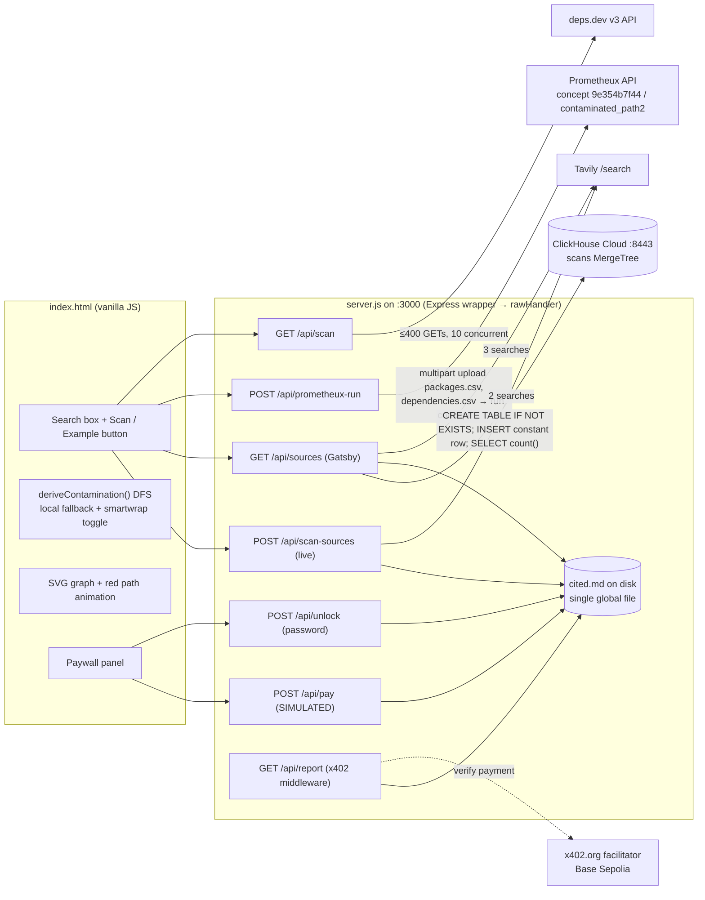
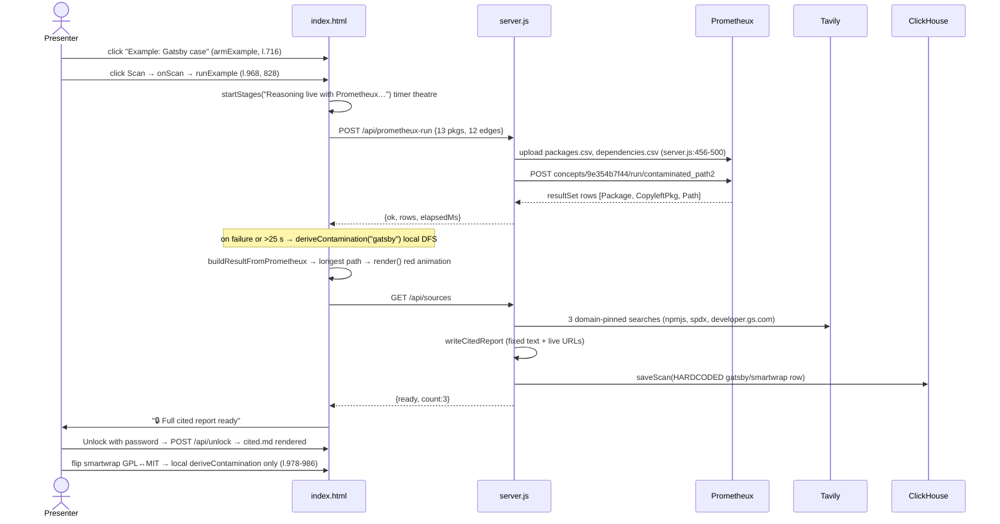

# LicenseTrace — whole-project deep dive

Round 1: [`analysis/clickhouse/licensetrace.md`](../archive/source-tree/analysis/clickhouse/licensetrace.md). Repo: `repos/clickhouse/licensetrace` (all 14 tracked files read in full).

## 1. At a glance

LicenseTrace (in-app title "License Contamination Scanner") is a solo-built npm license scanner. You give it a package name. It pulls the full transitive dependency graph from deps.dev, finds GPL/AGPL packages, shows the exact root→offender chain as an animated red path in an SVG graph, writes a cited `cited.md` report using Tavily search results, and puts that report behind a paywall (a dev password, a simulated x402 payment, or a real x402 route on Base Sepolia that the UI never calls). The "reasoning" runs on a saved Prometheux (Vadalog/Datalog) concept. ClickHouse gets one hardcoded audit row. The audience is engineering and legal teams worried about copyleft contamination. Pitch: "Your private code can be legally forced open by one buried dependency you've never heard of" (`README.md:3`). Award: Best Use of ClickHouse (one of two winners), Multiagents Hackathon London, 26 June 2026.

**The biggest correction to round 1** [V]: the project makes **no LLM calls at all**. The "autonomous agent" is a fixed request pipeline (deps.dev → Prometheux → Tavily → file write). Claude was only the coding assistant (`CLAUDE.md`, `README.md:39`).

## 2. Repo map

```
licensetrace/
├── server.js              691  Node backend: raw http handler wrapped in Express; deps.dev scan, Prometheux upload+run,
│                               Tavily search, cited.md writer, ClickHouse HTTPS insert, paywall routes, x402 middleware
├── index.html            1009  Whole UI: CSS (l.7-183), markup (l.184-230), vanilla JS (l.232-1006): embedded demo graph,
│                               BFS layout, SVG render + path animation, DFS fallback engine, paywall panel, staged-progress theatre
├── test-pmtx.js           177  Dev probe script: Prometheux auth check, concept run, "does upload feed the run?" experiment
├── packages.csv / dependencies.csv   13+12 rows  curated Gatsby demo graph (also embedded in index.html:241-268)
├── sample_packages.csv / sample_dependencies.csv  fictional "PaySwift → … → fast-xml (GPL-3.0)" sample
├── cited.md                18  last generated report (committed output)
├── CLAUDE.md               51  the agent brief for Claude Code (scope, priorities, "I'm a beginner")
├── README.md               76  pitch + run instructions
├── .env.example            23  env var template
├── package.json            13  deps: express ^5.2.1, x402-express ^1.2.0
└── package-lock.json     7.5k  generated (added for x402 in 684be84)
```

**LOC (hand-written, excluding the lockfile)** [V]: JavaScript ≈ 1,640 (server 691 + test-pmtx 177 + inline JS ≈ 775), CSS ≈ 175 (inline), HTML markup ≈ 50, Markdown ≈ 145, CSV ≈ 45. **About 1.9k lines of code.** There is no scaffolding, no framework, no component library and no vendored code. All of it is AI-assisted output from a single author [I, from `CLAUDE.md`].

## 3. System architecture



Main demo flow (the Gatsby example):



## 4. Component walkthrough

**Server shell** (`server.js:13-34, 660-691`) [V]. Loads `.env` with its own regex parser (`:23-34`). Express is used only to mount the x402 middleware on `GET /api/report` (`:663-679`). Every other request falls through to `rawHandler` (`:685`), which routes by string comparison on `req.url` (`:518-651`). Static serving uses an allowlist of five filenames, so there is no path traversal (`:644-650`).

**deps.dev scanner** `scanNpmPackage()` (`server.js:311-403`) [V]. This is the most engineered piece:
1. Resolve the default version (`:314-319`).
2. Fetch `…/versions/X:dependencies` (`:322`).
3. Look up licenses for up to 400 nodes with a hand-rolled `mapLimit` at concurrency 10 (`:295-306, 333-342`). Multiple licenses are joined with " OR ".
4. Pick which nodes to display: copyleft nodes **plus their BFS ancestor chain** are always kept, so the 150-node display cap can never hide a contamination path. Remaining slots fill in BFS order (`:344-375`).
5. Disambiguate colliding names with `@version` (`:378-384`).

The server-side `isCopyleft` (`:274`, `/GPL/i`) is used only for that display prioritisation, not for the verdict.

**Prometheux client** (`server.js:410-500`) [V]. `uploadCsv` hand-builds a multipart body and overwrites `packages.csv` and `dependencies.csv` at the **root of the shared Prometheux disk** (`:456-487`). `runConcept` POSTs `{params:{},scope:"user",persist_outputs:false}` to the saved concept and returns the first predicate's `resultSet` rows (`:413-452`). The Vadalog rule itself lives in the Prometheux workspace and is **not in the repo**. `test-pmtx.js:122-158` is the experiment the author used to confirm that the upload actually feeds the run ("rows mentioning gatsby/smartwrap = stale/cached").

**Tavily + report writer** (`server.js:38-181`) [V]. `tavilySearch` returns only the top hit's `{title,url}` (`:66-67`). Gatsby mode runs 3 fixed queries with `include_domains` pinning and a no-domain retry for the Goldman article (`:78-103`). Live mode runs 2 queries (`:140-155`). `writeCitedReport` is a **fixed template**: verdict and path text are literals, and only the URLs are dynamic (`:105-135`, the comment at `:106-108` says so).

**ClickHouse** (`server.js:192-259`) [V]. See §7.

**Paywall** (`server.js:560-602`, `index.html:536-666`) [V]. The password route is a real server-side gate. `/api/pay` is a mock. The UI plays a scripted 3-step "Agent authorizing micropayment ($0.05 USDC)… Verifying settlement on-chain…" sequence on 750 ms timers (`index.html:640-650`) and then shows the random `txHash` (`server.js:571`).

**Frontend engine** (`index.html:232-1006`) [V]:
- The demo data is embedded as CSV strings (`:241-268`).
- `isCopyleft` is strict (`:327-332`).
- `deriveContamination` does a first-hit DFS with a cycle guard (`:380-405`).
- `computeLayout` uses BFS depth rows (`:416-442`).
- `render` builds SVG with string templates and animates path edges with a 0.45 s stagger using `getTotalLength` and a CSS dash animation (`:461-534`).
- `startStages` paints "Sending dependency graph to Prometheux → Running recursive reachability → Tracing contamination paths" on **elapsed-time thresholds (3 s, 8 s)**, not on real progress events (`:735-758`).
- `fetchPrometheux` has a 25 s abort timeout and a `?forcefallback=1` rehearsal hook (`:764-780`).
- Live scans skip Prometheux when `total > 80` (`:915`), but the "Reasoning live with Prometheux…" stages still play first (`:901`). The final banner then admits "Fast JS scan · Prometheux skipped" (`:468`).

**Dead code** [V]: `KNOWN_GATSBY_RESULT` and `getContaminationResult()` (`index.html:352-373`) are never called. The only references are their definitions and a comment. Round 1 flagged the stub as possibly used in the video, but it is unreachable. The "Prometheux API (stubbed)" label (`:471`) is likewise unreachable in practice.

**Infra/CI/tests**: there are none. No Dockerfile, no CI, no automated tests. `test-pmtx.js` is a manual connectivity probe.

## 5. Data model

**ClickHouse** (`server.js:242-245`) [V]: `scans(timestamp DateTime, root_package String, contaminated UInt8, copyleft_package String, path String) ENGINE = MergeTree ORDER BY timestamp`. This is the only table.

**Prometheux disk**: `packages.csv(name,license)` and `dependencies.csv(parent,child)` (`server.js:489-491`). The concept output columns are `[Package, CopyleftPkg, Path]`, with Path as an `a -> b -> c` string (`index.html:791-797`).

**Files**: `cited.md` is one global file, overwritten by every scan.

**API routes** [V]

| Method | Path | Handler | Does |
|---|---|---|---|
| GET | `/api/scan?package=X` | `server.js:521-541` | deps.dev graph + licenses → `{root, packages, dependencies, truncated, total, shown}` |
| POST | `/api/prometheux-run` | `server.js:543-558` | upload caller's graph as CSV, run concept, return rows |
| GET | `/api/sources` | `server.js:622-642` | 3 Tavily searches → write Gatsby cited.md → **constant ClickHouse insert** → `{ready,count}` |
| POST | `/api/scan-sources` | `server.js:604-620` | 2 Tavily searches → write live cited.md from **client-supplied** pkg/path |
| POST | `/api/unlock` | `server.js:578-602` | returns cited.md if `password === DEV_UNLOCK_PASSWORD` |
| POST | `/api/pay` | `server.js:560-576` | **always** returns cited.md + random fake txHash |
| GET | `/api/report` | `server.js:665-679` | real x402 paywall ($0.01, base-sepolia), only when `X402_PAY_TO` is set; **not called by UI** |
| GET | `/`, 5 static files | `server.js:644-650` | allowlisted static |

**Env vars** (`.env.example`) [V]: `TAVILY_API_KEY`, `PMTX_TOKEN`, `PMTX_API_URL`, `CLICKHOUSE_URL`, `CLICKHOUSE_PORT`, `CLICKHOUSE_USER`, `CLICKHOUSE_PASSWORD`, `DEV_UNLOCK_PASSWORD`, `X402_PAY_TO`, `X402_NETWORK`, `X402_PRICE`, `X402_WALLET_PRIVATE_KEY` (documented but unused by the server), and `PORT`.

## 6. AI / agent design

- **No model calls** [V]. A grep finds no Anthropic, OpenAI, Bedrock or Gemini SDK or endpoint anywhere. "Agent" means a deterministic orchestration in two client functions (`runExample`, `scanNpm`).
- **"Reasoning"** = the Prometheux Datalog concept `contaminated_path2`, whose rule is hidden in SaaS, plus a JS DFS that duplicates it as a fallback. The client's `isCopyleft` was explicitly tightened "to match Prometheux's reasoning" (commit `1c08cb3`, `index.html:320-326`).
- **Retrieval** = top-1 Tavily URL per fixed query. No LLM summarisation; the report is a template.
- **Memory** = none. The ClickHouse row is never read back.
- **Orchestration pattern**: linear pipeline with graceful degradation. Each external call is wrapped so the demo "never hard-fails" (`index.html:826-860`, `server.js:233-259`).

## 7. All integrations

| Service | Where | Usage | Depth |
|---|---|---|---|
| **Prometheux** | `server.js:410-500`, `index.html:764-865, 915-932` | CSV upload + saved-concept run; result drives the graph | **core-to-the-pitch** (but bypassed for trees >80 nodes and by the toggle) |
| deps.dev | `server.js:277-403` | real transitive graph + per-version licenses | load-bearing |
| Tavily | `server.js:38-181` | top-1 URL per query, domain-pinned | thin wrapper (but real, live) |
| **ClickHouse** | `server.js:198-259, 627-632` | raw HTTPS SQL, DDL-on-every-call, one **literal** row per Gatsby run, `count()` logged to the console | **decorative** |
| x402 (`x402-express`) | `server.js:18, 663-679` | real middleware on an unused route; UI uses the simulated `/api/pay` | decorative (real code, unreachable from UI) |
| Express | `server.js:660-685` | only as an x402 mount point | thin |

## 8. Real vs. mock map

| Feature / claim | Status | Evidence |
|---|---|---|
| Scan any npm package's transitive tree | **real** | `server.js:311-403` |
| Copyleft detection | **real, with a deliberate false-negative policy** | `-or-later` and dual-licensed packages are excluded on purpose (`index.html:320-332`); legally `GPL-3.0-or-later` is still copyleft |
| "Reasoned live by Prometheux" (Gatsby example) | **real**, with a silent local fallback (labelled "engine warming up", `:469`) | `index.html:840-856` |
| "Reasoned live by Prometheux" (live scans) | **partially real**: only when total ≤ 80 nodes; otherwise JS DFS after a fake "Prometheux" progress animation | `index.html:901, 915-939` |
| The controls-bar hint "Reasoned live by Prometheux" | static text, shown regardless | `index.html:201` |
| Staged progress ("Running recursive reachability…") | **theatre**: time-threshold driven | `index.html:741-758` |
| smartwrap GPL↔MIT toggle, "proving it's reasoning, not a lookup" (`README.md:43`) | **local JS only**, no Prometheux call | `index.html:976-986` |
| Gatsby contamination chain | **curated** 13-node graph, not fetched from deps.dev | `index.html:241-268` |
| Cited report sources | **real** (Tavily, live); verdict text is a template | `server.js:110-135` |
| "Stores every scan" / "logged in ClickHouse" (README:18, demo 3:02) | **hardcoded**: one constant row, Gatsby path only; live scans write nothing; never read back | `server.js:627-632` |
| x402 agent payment (demo 1:39) | **mocked**: always succeeds, random tx hash, UI shows "$0.05 USDC" while the real route prices $0.01 | `server.js:560-576`, `index.html:642` |
| Real x402 paywall | **real but unreachable from the UI** | `server.js:663-679` |
| Password unlock | **real** gate, but bypassed by `/api/pay` | `server.js:578-602` vs `:560` |
| "Autonomous agent" | **missing** in the LLM sense; deterministic pipeline | §6 |
| `KNOWN_GATSBY_RESULT` stub | **dead code** | `index.html:352-373` |

Ratio [I]: of ~13 user-visible claims, about 5 are real, 3 partially real or theatre, 4 mocked or hardcoded, and 1 missing. The *core* scan-and-path experience is genuinely real. The sponsor-facing extras (ClickHouse, x402, "every scan") are the faked parts.

## 9. Demo path trace (206 s video; timestamps from round 1)

| Time | On screen | Code |
|---|---|---|
| 0:00–1:01 | Hook, Gatsby/Goldman/Orange/Panasonic stakes | none (narration) |
| 1:03–1:25 | Gatsby example → red path to smartwrap | `armExample` → `runExample` → `/api/prometheux-run` (real, ~20 s per the comment at `:734`) or DFS fallback; `render` animation |
| 1:28–1:50 | Locked report, "x402 agentic payment", unlock by password | `/api/sources` (Tavily + constant ClickHouse row) → `showReportLocked` → `/api/unlock` |
| 2:06–2:30 | node-jose: GPL in node-forge "not flagged" | `scanNpm` → `/api/scan` → (≤80 nodes so likely Prometheux [I]) → strict `isCopyleft` excludes the dual license `BSD-3-Clause OR GPL-2.0` |
| 2:33–2:46 | express: clean | same; no report, **no ClickHouse write** |
| 2:55–3:02 | "logged in ClickHouse" | only true for the Gatsby run at 1:28 |

## 10. Code quality and security review

**Quality** [V]: the code is very readable, with beginner-oriented comments everywhere. Error handling is defensive and fail-open throughout. There are no types and no tests. There is a lot of global mutable state: browser `licenses`/`edges`/`pos`, the server's `cited.md`, and the shared Prometheux disk. Concurrent users would overwrite each other's Prometheux CSVs and reports (a race condition).

**Security** (relevant for a cyberdefense audience):

| Issue | Where | Severity |
|---|---|---|
| **Paywall bypass**: `POST /api/pay` returns the report with no payment and no password | `server.js:560-576` | high (the business logic is the security boundary) |
| **DOM XSS**: package names, licenses and paths from deps.dev or Prometheux are interpolated into `svg.innerHTML`/`banner.innerHTML` unescaped | `index.html:472-476, 511-520` | medium (npm names are constrained; license strings less so) |
| **Reflected XSS**: user-typed package name and server error text go into `innerHTML` | `index.html:956-959, 679, 698` | low (self-XSS) |
| **Stored injection into the report**: `/api/scan-sources` writes client-supplied `package`/`copyleftPkg`/`path` into `cited.md`; `mdToHtml` escapes HTML but allows `[x](javascript:…)` links | `server.js:604-611`, `index.html:550` | medium (any caller can plant a `javascript:` link that the next unlocker clicks) |
| SQL built by string concatenation (manual escaping of `\` and `'`); values are constants today | `server.js:239-251` | low now, a pattern to avoid |
| DDL executed on every insert | `server.js:242` | hygiene |
| No auth or rate limit; `/api/scan` fans out up to 400 deps.dev calls per request (amplification) | `server.js:268, 333` | low–medium |
| Password compared with `!==`; the route returns HTTP 200 on failure | `server.js:588` | low |
| Secrets: none committed; `.env*` is git-ignored (`.gitignore:2-3`) | — | good |
| No CORS headers (same-origin only) | — | fine |

## 11. Build history

All 19 commits [V] fall on Fri 26 Jun 2026 (BST). There are two author names for one person: `Welddevelopment` (the GitHub web initial commit) and `Joel`.

| Hour | Commits | What landed |
|---|---|---|
| 11:00 | 1 | `c796245` 11:04 placeholder README |
| 12:00 | 3 | `25a8588` 12:30 **+873 lines in one go** (UI, Tavily, cited.md, ClickHouse, CLAUDE.md, CSVs); `04965ca` README; `78c3263` 12:51 live deps.dev (+296) |
| 13:00 | 4 | UI flow polish: single Scan button, example arm/disarm (13:08–13:25) |
| 14:00 | 6 | `5a53fc1` 14:05 live Prometheux for the example (+298, test-pmtx); `f589c9d` concept → `contaminated_path2`; staged progress; Tavily for live scans; `0d4216a` 14:41 paywall (+175); `296ea56` 14:55 "Live scans present as Prometheux-reasoned (look, label…)" |
| 15:00 | 5 | `85e0720` 15:34 live scans really call Prometheux (+180); `8dbca03` 15:38 "Make x402 agent payment look live (demo-simulated settlement)"; `684be84` 15:54 real x402 (+43 server lines + lockfile); relabel; `1c08cb3` 15:59 strict copyleft |

- Final hour before the 16:30 deadline: 5 commits, adding both x402 paths and the strict copyleft rule.
- Nothing was committed after the deadline.
- No prebuilt code. The 12:30 commit shows ~1.5 h of local work before the first push [I].
- ClickHouse was wired in the first real commit and **never touched again**.

Commit `296ea56` is worth noting: the label "Prometheux-reasoned" was applied to live scans 39 minutes *before* live scans actually called Prometheux (`85e0720`).

## 12. How hard was this to build?

A skilled builder using Claude Code could reproduce it in **about 3–4 hours** [I]. The author, a self-described beginner, did it in ~5.5 h.

**The hard parts:**
1. The deps.dev graph walk with bounded concurrency and path-preserving truncation.
2. Getting Prometheux to reason over *uploaded* data. It took a dedicated experiment (`test-pmtx.js --upload-run`) and still relies on overwriting a shared disk root.
3. The animated SVG path, which is a small amount of code with a high visual payoff.

**The easy parts:** ClickHouse (~60 lines), Tavily (~70 lines), the paywall.

## 13. Reusable patterns and code

1. **Path-preserving truncation.** When you cap a big graph for display, always keep each finding and its ancestor chain. This applies directly to attack-path or reachability graphs:
   ```js
   // server.js:363-369
   nodes.forEach((_,i)=>{
     if(!isCopyleft(lic[i])) return;
     let cur=i, chain=[];
     while(cur!==undefined && cur!==ROOT){ chain.push(cur); cur=parent[cur]; }
     if(cur===ROOT){ chain.push(ROOT); chain.forEach(x=>keep.add(x)); }
   ```
2. **Sequential red-path animation** with no library (`index.html:523-533`): stagger `animationDelay = i*0.45s` over the path edges, using `--len = getTotalLength()` for a stroke-dash draw. This was the demo's "wow" moment.
3. **Fail-open sponsor sink.** The `saveScan` try/catch means a sponsor outage never breaks the demo (`server.js:233-259`). Reuse the pattern, but write *real* rows, use `{p:String}` query parameters, run the DDL once at boot, and read the rows back in the UI.
4. **The never-hard-fail fallback with a rehearsal flag**: `?forcefallback=1` (`index.html:768`) plus an AbortController timeout (`:771-772`). It is a cheap way to rehearse a demo when a sponsor API is cold.
5. **Bounded fan-out helper** `mapLimit` (`server.js:295-306`), 12 lines with no dependencies.

**Avoid:**
- A "simulated settlement" route that defeats your own paywall.
- Progress UIs that name a sponsor when the sponsor isn't being called (`index.html:901` vs `:915`).
- `innerHTML` with external data. A security judge will spot it.
- Claiming "every scan is logged" when only a constant row is written.
- Global singleton output files (`cited.md`) and shared remote scratch space (the Prometheux disk root).
