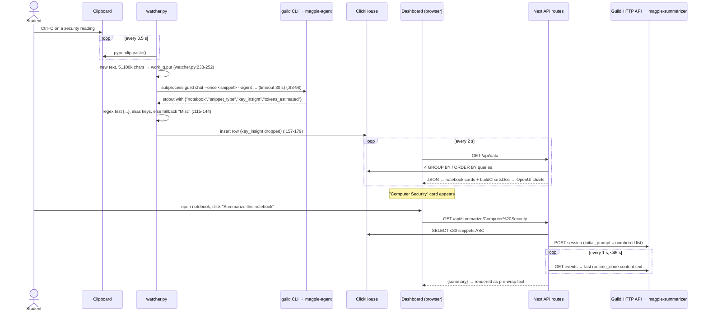

# Magpie: whole-project deep dive

> **Current execution policy:** [Start now or anytime, with no build cutoff](../../event/BUILD_AUTHORIZATION.md). The human reports that the event is already underway and public schedules are stale. Older start/deadline/duration advice below is superseded; historical timestamps and analytics windows remain evidence, not build gates.

> Guild AI prize winner ("Most Innovative Use of Agents", Harness Engineering Hack, 12 Jun 2026). Repo: `repos/guild-ai/magpie` (HEAD `085eaab`). Round 1: [`analysis/guild-ai/magpie.md`](../archive/source-tree/analysis/guild-ai/magpie.md). Read-only review, 8 Oct 2026. **[V]** = verified with file:line, **[I]** = inference. Paths are relative to the repo root unless noted.

## 1. At a glance

Magpie is an "ambient study tracker" for students and researchers. A local Python process polls the OS clipboard. Every new copy is sent to a Guild classifier agent, which picks a topic "notebook" and a snippet type. The result goes into one ClickHouse table, and a Next.js dashboard re-polls that table every 2 s. The dashboard shows notebook cards and OpenUI charts, and three more Guild agents add notebook summaries, a "clean up Misc" re-filer, and an "Ask Magpie" panel that answers in **OpenUI Lang**, so the agent's answer is rendered as UI. The pitch: "Every time you copy something, that is an implicit highlight" (README.md:19). The README and LinkedIn claim 1st place; Devpost shows a winner badge (round 1 §1). The team was two people. The whole system is about 2.3k hand-written lines, and all the Guild code landed in the last ~75 minutes [V: git log].

## 2. Repo map

```
magpie/
├── README.md                    project write-up; Mermaid arch; "four agents" table (166 lines)
├── .env.example                 ClickHouse + GUILD_TOKEN vars for the root/seed
├── magpie-watcher/              Python capture process (Track A, Shantanu)
│   ├── watcher.py               clipboard poll -> queue -> `guild chat --once` -> ClickHouse insert (258)
│   ├── check_rows.py            debug: print last 20 rows (24)
│   └── schema.sql               clipboard_events DDL (dupe of clickhouse/create_table.sql)
├── magpie-agent/                Guild llmAgent: classifier (agent.ts 56) + Guild CLI scaffold
├── magpie-summarizer/           Guild llmAgent: notebook summary (agent.ts 28) + scaffold
├── magpie-refiler/              Guild llmAgent: Misc re-filer (agent.ts 35) + scaffold
├── magpie-chat/                 Guild llmAgent: question -> OpenUI Lang (agent.ts 72) + scaffold
├── clickhouse/                  create_table.sql + seed.js (21 demo rows) (Track B, Mehul)
└── clipdeck-dashboard/          Next.js 16 / React 19 app scaffolded by `openui-cli`
    └── src/
        ├── app/page.tsx                     home: stats, notebook grid, Clean-up button, charts, ChatPanel (186)
        ├── app/notebook/[name]/page.tsx     notebook detail + Summarize button (176)
        ├── app/components/ChatPanel.tsx     "Ask Magpie" input + OpenUI Renderer (114)
        ├── app/api/data/route.ts            4 aggregate queries for the home page (61)
        ├── app/api/notebook/[name]/route.ts snippets + type counts for one notebook (58)
        ├── app/api/summarize/[notebook]/route.ts  -> magpie-summarizer (59)
        ├── app/api/refile/route.ts          -> magpie-refiler + guarded ALTER UPDATE (92)
        ├── app/api/chat/route.ts            -> magpie-chat, repair/fallback OpenUI doc (88)
        ├── lib/guild.ts                     askGuildAgent(): HTTP session + event polling (139)
        ├── lib/buildDashboardDoc.ts         builds OpenUI Lang for charts in code (114)
        ├── lib/clickhouse.ts                client factory (11)
        ├── library.ts                       OpenUI template re-export (unused)
        ├── app/layout.tsx                   fonts/metadata (scaffold-ish)
        └── app/globals.css                  dark theme + OpenUI variable overrides (420)
```

**Each agent dir** (`package.json`, `tsconfig.json`, `markdown.d.ts`, `.gitignore`, a one-line `README.md`) is Guild CLI scaffolding; only `agent.ts` is hand-written. The package.json files are identical apart from name/version (`diff magpie-agent/package.json magpie-chat/package.json` shows only lines 2-3) [V].

**Lines of code** (excluding lockfiles, `.d.ts` and scaffold config) [V: `find … | xargs wc -l`]:

| Area | Language | Lines | Notes |
|---|---|---|---|
| magpie-watcher | Python + SQL | 294 | all hand-written |
| 4 × agent.ts | TypeScript | 191 | ~90% of it is prompt text |
| clickhouse | JS + SQL | 272 | seed.js is ~200 lines of demo data literals |
| dashboard src | TS/TSX | 1,126 | hand-written apart from layout.tsx/library.ts (~30) |
| dashboard css | CSS | 420 | hand-written theme |
| **Total hand-written** | | **~2,270** | ~1,650 excluding CSS and seed data |

**Generated, vendored or template content:** `clipdeck-dashboard/package-lock.json` (10.8k lines), `clipdeck-dashboard/README.md` (verbatim openui-cli boilerplate that says "bootstrapped with openui-cli"), `eslint.config.mjs`, `postcss.config.mjs`, `next.config.ts`, a committed `tsconfig.tsbuildinfo`, and the Guild agent scaffolds. The original `api/chat/route.ts` was the OpenUI template's OpenAI proxy (`model: "gpt-5.2"`, streaming), later replaced by the Guild call [V: `git show 465fa6b:clipdeck-dashboard/src/app/api/chat/route.ts`]. There was also 903 lines of AI-style build-plan markdown (`01-setup.md`…`04-polish.md`, each with a "Time budget"), committed at 15:14 and deleted after the event [V: 7b1b3be, 6220299].

## 3. System architecture

```mermaid
flowchart LR
  subgraph Laptop["User laptop"]
    CB[(OS clipboard)]
    W["watcher.py<br/>poll 0.5s + worker thread"]
    GCLI["guild CLI<br/>(subprocess)"]
    subgraph Next["Next.js 16 dashboard :3000 (no auth)"]
      UI["page.tsx / notebook page / ChatPanel<br/>poll every 2s"]
      RD["/api/data, /api/notebook/[name]"]
      RS["/api/summarize/[notebook]"]
      RR["/api/refile (POST, mutates)"]
      RC["/api/chat (POST)"]
      GL["lib/guild.ts askGuildAgent()"]
      OUI["OpenUI Renderer<br/>(@openuidev/react-lang)"]
    end
  end
  subgraph Guild["Guild.ai cloud (app.guild.ai)"]
    A1["shanjoshi25~magpie-agent<br/>classifier"]
    A2["magpie-summarizer"]
    A3["magpie-refiler"]
    A4["magpie-chat"]
    LLM["Guild-hosted LLM<br/>(model not set in code)"]
  end
  CH[("ClickHouse Cloud<br/>default.clipboard_events<br/>MergeTree")]
  SEED["clickhouse/seed.js<br/>21 demo rows"]

  CB --> W --> GCLI --> A1
  W -->|insert| CH
  SEED -->|insert| CH
  UI --> RD --> CH
  UI --> RS & RR & RC
  RS & RR & RC --> GL
  RS & RR & RC -->|SELECT| CH
  RR -->|ALTER TABLE UPDATE| CH
  GL -->|POST /api/workspaces/{id}/sessions<br/>GET /api/sessions/{id}/events| A2 & A3 & A4
  A1 & A2 & A3 & A4 --> LLM
  RC --> OUI
  UI --> OUI
```

There are no queues beyond an in-process `queue.Queue` (watcher.py:191), no workers beyond the one watcher thread, and no Docker/CI/deploy config [V: file list].

**Main demo flow** (copy → card appears → Summarize), from the demo video (round 1 §6):



## 4. Component walkthrough

### 4.1 Watcher (`magpie-watcher/watcher.py`)
- **Config:** env vars with hard failures for host/password (:30-35). Poll 0.5 s, min 5 chars, truncated to 4,000 (:37-39). Copies over 100k chars are silently skipped (:241) [V].
- **Producer loop** (`main`, :221-254): it seeds `last_seen` with the current clipboard so the existing content isn't ingested at startup (:226-230), and dedups only against the *last* value. Copying A, B, A ingests A twice [V].
- **Window title:** `pygetwindow` is best-effort (:22-25, :60-67). On macOS `pygetwindow` mostly doesn't support `getActiveWindow`, so `source_window` is probably `""` in the demo [I]. The seed rows have nice titles like "Deep Learning Textbook.pdf", which live rows likely lack [I].
- **Consumer** (`worker`, :194-214): one daemon thread classifies and inserts. Insert errors are printed and dropped, with no retry [V].
- **Agent call** (`call_guild_agent`, :86-135): `subprocess.run([...])` with an argv list, so there's no shell injection. A 30 s timeout. A greedy `\{[\s\S]*\}` regex grabs the JSON. `_pick` accepts both `snippet_type` and `snippettype` spellings. Values are coerced and truncated (notebook 60, type 24, insight 400) [V].
- **Insert** (:151-179): writes 8 columns. **`key_insight` is computed but never stored.** The schema has no column for it (schema.sql:1-12), so the "one-line insight" exists only in the watcher's memory [V].
- `check_rows.py` is a 24-line debug print of the last 20 rows [V].

### 4.2 Guild agents (`magpie-*/agent.ts`)
All four use the same `llmAgent({ description, tools: {}, systemPrompt, mode: "one-shot" })` shape (magpie-agent:51-56, magpie-chat:66-72, magpie-refiler:29-35, magpie-summarizer:22-28) [V]. No tools, no memory, no sub-agents. The `@guildai-services/guildai~github` dependency is template residue and never imported [V: magpie-agent/package.json:24]. Prompts are covered in §6.

### 4.3 ClickHouse layer (`clickhouse/`)
- `create_table.sql` is the same as `magpie-watcher/schema.sql`: one MergeTree, `ORDER BY (captured_at, event_id)`, `LowCardinality` on notebook/type [V].
- `seed.js` inserts **21** rows (9 Neural Networks, 6 Linear Algebra, 6 Thermodynamics). The comment says "30 rows" (:17), which is wrong, and round 1 repeated it. Each row's `captured_at` is set to now − 10 min + an offset, so the timeline chart has "shape" (:226-230). It uses JSONEachRow and prints verification counts (:233-258) [V].
- There are no materialized views, TTLs, projections or skip indexes. ClickHouse is a plain hosted table [V].

### 4.4 Dashboard API routes
- `/api/data` (data/route.ts:13-61) runs four parallel queries: notebook counts, per-minute timeline, notebook×type counts, and the latest 50 rows. It has its own `getClient` copy (:4-11). The same code is duplicated in notebook/route.ts:4-11 [V].
- `/api/notebook/[name]` (notebook/[name]/route.ts:13-58) uses parameterized `{nb:String}` queries [V].
- `/api/summarize/[notebook]` (summarize/[notebook]/route.ts:11-59) selects ≤80 rows ASC, builds a numbered `[type] text` list truncated to 500 chars each (:39-46), and calls `askGuildAgent("magpie-summarizer", …, 45 s)` (:48). Errors return 500 with a message [V].
- `/api/refile` (refile/route.ts:23-92) gets the distinct non-Misc notebooks (:27-33) and up to 30 Misc rows (:39-47). It classifies three at a time (:81-83), accepts only answers in the candidate set (:71), and runs a parameterized `ALTER TABLE … UPDATE notebook WHERE event_id` (:73-77) [V]. ClickHouse mutations are asynchronous, so cards may move a poll or two later [I].
- `/api/chat` (chat/route.ts:32-88) takes the last user message (:36-38), builds context from three queries (notebook counts, type counts, the 40 most recent snippets truncated to 200 chars) (:44-60), and sends `QUESTION: …\n\nCONTEXT: <json>` (:68-69). It then runs `repairDoc` (cut to `root =`) or `fallbackDoc` (:13-30, :71-79). It **always returns 200**, and even errors render as a TextContent node (:82-84) [V].

### 4.5 `lib/guild.ts` (the reusable piece)
- **Token:** `GUILD_TOKEN` env, or shell out to `execFile("guild", ["auth","token"])` with the result cached (:17-23). A 401 clears the cache and throws (:86-91) [V].
- **Call:** `POST /api/workspaces/{WORKSPACE_ID}/sessions` `{initial_prompt, session_type:"chat", agent_id}` (:73-84). Then a poll every `pollIntervalMs` (default 1 s) until the deadline (default 45 s), with non-OK polls ignored (:100-110). `extractAgentReply` walks the events backwards to find the last `runtime_done` that has a non-empty `content.text` (:35-46) [V].
- **Hardcoded values:** `WORKSPACE_ID` and `OWNER_PREFIX="shanjoshi25~"` (:7-8) [V].
- `parseAgentJson` strips fences, takes the first `{…}`, and aliases dropped-underscore keys (:119-139) [V].

### 4.6 Frontend
- `page.tsx` polls `/api/data` every 2 s (:47-67). It recomputes the OpenUI charts doc and only updates state when the doc string changes, to avoid re-render flicker (:55-59). Stats are computed client-side (:69-70). The "Clean up Misc" button appears only when a Misc notebook exists (:110). Notebook cards are plain React, not OpenUI (:140-167) [V].
- `buildDashboardDoc.ts` generates **OpenUI Lang deterministically in code** for the charts: a LineChart timeline plus a stacked BarChart of type × notebook (:35-69). The "Analytics" charts are therefore not agent-generated [V]. `buildNotebookDoc` (:72-114) is dead code; nothing imports it, and it was unused in 465fa6b too [V: grep].
- `notebook/[name]/page.tsx` polls every 2 s (:66-81). The Summarize button calls the route and shows the plain-text summary (:51-64, :122-132). `prevCount` is set but never read (:46, :73) [V].
- `ChatPanel.tsx` has an input, three suggestion chips (:7-11), and a POST `/api/chat`. It renders `json.doc` with `<Renderer library={openuiLibrary}>` (:107-111) [V].
- `globals.css` (420 lines) forces OpenUI into dark mode via CSS variables (:1-35) and defines the card/pill theme [V].

### 4.7 Infra, config, tests
There's no Dockerfile, CI, deploy config or test file anywhere [V: file list]. Setup is manual: pip install, `npm run dev`, and `guild agent save --publish` (README.md:99-146). The ClickHouse client in the dashboard hardcodes `database: "default"` (lib/clickhouse.ts:9) [V].

## 5. Data model

**Table** `default.clipboard_events` (clickhouse/create_table.sql:1-12) [V]:

| Column | Type | Written by |
|---|---|---|
| event_id | UUID DEFAULT generateUUIDv4() | watcher (uuid4), seed (default) |
| captured_at | DateTime64(3) DEFAULT now64(3) | watcher `datetime.utcnow()`, seed synthetic |
| snippet | String | raw clipboard text (≤4000) |
| snippet_type | LowCardinality(String) | agent |
| notebook | LowCardinality(String) | agent; updated by /api/refile |
| source_window | String | pygetwindow (often empty [I]) |
| tokens | UInt32 | LLM-estimated token count (!) |
| latency_ms | UInt32 | measured agent round-trip |

**API routes** [V]:

| Method | Path | Handler | Does |
|---|---|---|---|
| GET | /api/data | src/app/api/data/route.ts:13 | 4 aggregate queries for the home page |
| GET | /api/notebook/[name] | src/app/api/notebook/[name]/route.ts:13 | snippets + type counts for a notebook |
| GET | /api/summarize/[notebook] | src/app/api/summarize/[notebook]/route.ts:11 | Guild summarizer |
| POST | /api/refile | src/app/api/refile/route.ts:23 | Guild refiler + ALTER UPDATE |
| POST | /api/chat | src/app/api/chat/route.ts:32 | Guild chat → OpenUI Lang doc |

**External APIs called:** `POST https://app.guild.ai/api/workspaces/{id}/sessions` and `GET https://app.guild.ai/api/sessions/{id}/events` (guild.ts:73-105), plus the `guild` CLI (`chat --once`, `auth token`) [V].

**Env vars:**

| Var | Used in | Notes |
|---|---|---|
| CLICKHOUSE_HOST | watcher.py:30, seed.js:11, lib/clickhouse.ts:6 | watcher wants a host and separate port; dashboard wants a full URL with :8443 (.env.example differences) |
| CLICKHOUSE_PORT | watcher.py:31 | default 8443 |
| CLICKHOUSE_USER | all | default `default` |
| CLICKHOUSE_PASSWORD | all | |
| CLICKHOUSE_DATABASE | watcher.py:34 | dashboard ignores it (hardcoded "default") |
| GUILD_AGENT_ID | watcher.py:35 | default `shanjoshi25~magpie-agent` |
| GUILD_TOKEN | lib/guild.ts:18 | optional; else `guild auth token` |

## 6. AI / agent design

| Agent | Called from | Transport | Input | Output parsing | Retry/fallback |
|---|---|---|---|---|---|
| magpie-agent (classifier) | watcher.py:93-98 | `guild chat --once` CLI | raw snippet | regex `{…}` + key aliases (:115-135) | none; "Misc" fallback on timeout/exit/JSON error (:99-124) |
| magpie-summarizer | summarize route:48 | Guild HTTP session + 1 s poll | numbered list ≤80×500 chars | raw text | none; HTTP 500 shown in UI |
| magpie-refiler | refile route:62 | HTTP | `EXISTING NOTEBOOKS: [...]\nSNIPPET: …` | `parseAgentJson` + allowlist (:65-71) | skip row on error |
| magpie-chat | chat route:73 | HTTP | `QUESTION … CONTEXT <json>` | `repairDoc` → `fallbackDoc` | deterministic TextContent |

- **Model:** not specified anywhere. `llmAgent` uses whatever model Guild's platform defaults to [V: no model field]. The only model string in the history is the template's `gpt-5.2`, which was deleted [V: 465fa6b chat route].
- **Classifier prompt** (magpie-agent/agent.ts:3-49), trimmed: *"You are Magpie, an ambient study agent… receive ONE snippet at a time… return a single JSON object — and ONLY that JSON object… `notebook` short topic name, 1-3 words, Title Case… If the snippet clearly extends a previous topic, REUSE that topic name verbatim… `snippet_type` one of definition/example/formula/quote/image/other… `key_insight` ONE sentence… `tokens_estimated` ceil(chars/4)… CRITICAL — the JSON keys must be EXACTLY these four strings, spelled with underscores…"* plus a one-line example.
  - **Design flaw [V/I]:** the prompt asks the model to "REUSE" previous topic names, but every call is a fresh `--once` session with no memory and no list of existing notebooks. Consistency depends only on the model naming things the same way. The refiler gets the candidate list; the classifier doesn't. Passing `SELECT DISTINCT notebook` into the classifier prompt would be the obvious fix.
  - Asking an LLM to estimate `ceil(chars/4)` is wasted work; the watcher could compute it [V: watcher.py:132-134 already falls back to `len//4`].
- **Summarizer prompt** (magpie-summarizer/agent.ts:3-20): "produce a single connected summary… 3-6 short paragraphs of plain prose… Connect related snippets… Note any gaps… No markdown headers… no bullet points".
- **Refiler prompt** (magpie-refiler/agent.ts:3-26): "decide which EXISTING notebook it really belongs to… MUST be copied verbatim from the EXISTING NOTEBOOKS list… If the snippet does not clearly belong… return {"notebook": "Misc"}".
- **Chat prompt** (magpie-chat/agent.ts:3-63): "You answer by emitting an 'OpenUI Lang' document… You do NOT write prose answers — you build the UI that answers the question". It includes a grammar (`nodeId = Component(args)`, first line `root = Stack([...])`), an **allowlist of 10 components** (Stack, Card, CardHeader, TextContent, LineChart, BarChart, Series, Tag, TagBlock, Separator), and two few-shot examples. This prompt is the most interesting AI artifact in the repo. Its output is constrained to a rendering vocabulary, and the server checks only the `root =` prefix.
- **Orchestration pattern:** none between agents. There are four independent single-purpose prompts. App code is the orchestrator (watcher, three routes) and owns all I/O. "Coordinated agents" (README:46) means "separately invoked" [V].
- **Memory:** ClickHouse is the only state. Agents are stateless one-shots [V].
- **Concurrency:** the watcher processes one snippet at a time. Refile uses 3-way `Promise.all` batches [V].

## 7. All integrations

| Service | Usage (file:line) | Depth |
|---|---|---|
| **Guild.ai** (sponsor) | 4 published `llmAgent`s; CLI `guild chat --once` (watcher.py:93-98); HTTP sessions/events API (lib/guild.ts:58-113); CLI token (:20) | **Load-bearing / core-to-the-pitch.** It's the only LLM path, but used as a hosted prompt runner, with no tools, integrations, triggers or approvals |
| **ClickHouse Cloud** | single MergeTree table; watcher insert (watcher.py:157); 4 dashboard read routes; `ALTER UPDATE` (refile:73-77); seed | **Load-bearing**: system of record + aggregates; no ClickHouse-specific features beyond LowCardinality and `toStartOfMinute` |
| **OpenUI (Thesys)** `@openuidev/react-lang`, `react-ui` | `Renderer` in page.tsx:174-178 and ChatPanel.tsx:109; code-built docs in buildDashboardDoc.ts; agent-emitted docs in chat route | **Load-bearing for the UI wow** (agent output becomes UI); the charts doc is deterministic |
| pyperclip | watcher.py:19, :228, :234 | load-bearing (capture) |
| pygetwindow | watcher.py:22-25 | decorative / best-effort |
| Google Fonts | layout.tsx:17-22 | decorative |
| OpenAI | template chat route at 465fa6b only, removed | none at HEAD |
| Langfuse | mentioned in the deleted plan 04-polish.md ("bonus") | never built |

## 8. Real vs. mock map

| Feature / claim | Status | Evidence |
|---|---|---|
| Every Ctrl+C is captured | **Real** (polling, 0.5 s); copies of the same text back-to-back are skipped; >100k skipped | watcher.py:232-254 |
| "Not a polling wrapper" (LinkedIn) | **False**: it is polling | watcher.py:254 |
| Guild agent classifies each snippet | **Real** | watcher.py:93-98 |
| Key insight per snippet | **Computed, discarded**: never stored or shown | watcher.py:131 vs :169-178; schema.sql |
| Notebook names reused consistently | **Partially real**: prompt request only, no existing-notebook context | magpie-agent/agent.ts:17-20 |
| Source window attribution | **Partially real**: best-effort, likely empty on macOS [I]; seed rows have fake titles | watcher.py:60-67; seed.js:27 etc. |
| Token count | **LLM-guessed**, fallback len/4 | watcher.py:132-134 |
| Live dashboard | **Real**: 2 s polling of ClickHouse (not push/stream) | page.tsx:65 |
| Notebooks shown in demo (Neural Networks, Linear Algebra, Thermodynamics) | **Seeded**: 21 synthetic rows with synthetic timestamps | seed.js:21-217, :226-230 |
| Analytics charts "rendered by OpenUI" | **Real but code-generated**, not agent-generated | buildDashboardDoc.ts:35-69 |
| Per-notebook AI summary | **Real** | summarize route:48 |
| Clean up Misc | **Real**, allowlist-guarded | refile route:62-77 |
| Ask Magpie generative UI | **Real**; not shown in demo; failures render a text fallback (silently "succeeds" with error text) | chat route:71-84 |
| "Four coordinated agents" | **Partially real**: four agents, no coordination | §6 |
| "Guarded mutations… can only move Misc snippets" (README:158) | **Mostly real**: guard is the prior SELECT + allowlist; the UPDATE itself filters only on event_id | refile route:39-47, :73-77 |
| Password-manager content never seen ("privacy by design", README:40) | **Overstated**: true for autofill, but anything copied to the general pasteboard (including passwords copied from a manager) is read; no redaction | watcher.py:234 [V]; PW-manager behavior [I] |
| Scheduled summarizer | **Missing** ("What's next") | README.md:164 |
| <3 s copy-to-card | **Not backed**; Devpost admits 8-10 s cold starts; the 2 s UI poll adds latency | round 1 §5 |

Roughly 9 of 18 claims are fully real, 6 partial or seeded, and 3 false or missing. The core capture → classify → store → display loop is genuinely live [I].

## 9. Demo path trace (video HWpXXJRrSqc, 3:13)

| Time | On screen | Code / data behind it |
|---|---|---|
| 00:00-00:54 | hook + sponsor roll-call | none |
| ~00:54 | `python watcher.py` starts and prints `[magpie] watching clipboard` | watcher.py:222-224 |
| 00:54-02:11 | presenter copies 3 paragraphs from a computer-security reading | poll loop :232-254 → queue → `guild chat --once` (:93) → insert (:157). Console `[agent] notebook=… latency=…ms` (:202-206) |
| ~02:11 | dashboard shows a new "Computer Security" card next to Neural Networks / Linear Algebra / Thermodynamics | page.tsx 2 s poll → /api/data (data/route.ts:16-41). Other cards come from seed.js |
| ~02:29 | "11 snippets … neural networks" | seed puts 9 rows in Neural Networks; 11 suggests the seed ran more than once or extra rows were captured during rehearsal [I] |
| 02:48-03:07 | click Summarize → prose summary | notebook page :51-64 → summarize route → `askGuildAgent("magpie-summarizer")` (guild.ts:58) |
| not shown | Ask Magpie, Clean up Misc | ChatPanel.tsx, refile route |

## 10. Code quality and security review

**Quality.** The code is small, readable and well commented. The comments explain *why* (watcher.py:185-189, guild.ts:12-16, :30-34). TypeScript uses typed `json<T>()` generics. Error handling is deliberately demo-safe: the "Misc" fallback, `fallbackDoc`, and polling that keeps the last state on blips. Weaknesses:
- duplicated `getClient` (data/route.ts:4-11, notebook/route.ts:4-11 vs lib/clickhouse.ts)
- dead code (`buildNotebookDoc`, `library.ts`, `prevCount`)
- schema duplicated in two directories
- committed `tsconfig.tsbuildinfo`
- inline styles mixed with the CSS file
- **zero tests** [V]

**Security** (relevant to a Cyberdefense audience):
1. **Sensitive-data exfiltration by design (High).** The watcher reads every clipboard string (watcher.py:234). It sends it verbatim to a cloud LLM via Guild (:94) and stores it in plaintext in ClickHouse Cloud (:157-179). The dashboard then shows it to anyone who can reach it. There is no secret/PII redaction, no allow/deny list per source app, and no respect for the macOS `org.nspasteboard.ConcealedType` marker that password managers set [V for the code; I for PW-manager behavior]. The README's privacy claim (README.md:40) is wrong for copied passwords, API keys and tokens. A Cyberdefense entry built on this pattern would need redaction (e.g. Semgrep/regex secret detectors) *before* the LLM call.
2. **No authentication on any API route** (all five routes) [V]. `POST /api/refile` mutates the DB, and `POST /api/chat` / `GET /api/summarize` spend the operator's personal Guild token [V]. `next dev` listens on all interfaces by default [I], so anyone on the venue Wi-Fi could read every captured snippet.
3. **Argument injection into the Guild CLI (Low-Med).** `["guild","chat","--once", snippet, "--agent", …]` (watcher.py:94) passes untrusted clipboard text as an argv element. There's no shell, so no command injection [V]. But a snippet beginning with `-`/`--` may be parsed as a CLI flag [I; depends on the CLI's parser]. The fix is `--` before the value, or stdin.
4. **Prompt injection.** Clipboard text and stored snippets go straight into prompts (summarize:46, chat:68-69, refile:57-59) [V]. The blast radius is limited by design: the refiler output is allowlisted (refile:71), and chat output can only render from a fixed component library [V]. The summarizer's output is plain text in React, so it's auto-escaped [V]. Good containment, worth copying.
5. **OpenUI Lang injection (Low).** `buildChartsDoc` interpolates `snippet_type` (LLM-produced, ≤24 chars) into `Series("${type}", …)` without escaping (buildDashboardDoc.ts:65). Notebook labels are escaped by `q()` (:30-32, :57). A malicious or odd type string could break the charts doc [V/I].
6. **SQL:** all dashboard queries use ClickHouse `{param:Type}` binding (notebook route:26-28, refile:43-44, :74-76, summarize:23-26). No string-built SQL [V]. Good.
7. **Over-privileged DB credential.** The dashboard uses the `default` ClickHouse user for both reads and `ALTER … UPDATE` [V: .env.example]. A read-only user plus a separate writer would be better.
8. **Secrets:** none committed. `.env` is gitignored (.gitignore:1-3), and the full `git log -p` contains only placeholders [V]. `WORKSPACE_ID` is hardcoded (guild.ts:7), an identifier rather than a secret [V].
9. CORS: Next.js defaults, no wildcard headers set [V].

## 11. Build history

All times PT (-0700) [V: `git log --format='%h %an %ad %s' --date=iso --stat`]:

| Time | Commit | Author | Size | Content |
|---|---|---|---|---|
| 12 Jun 13:17 | 0fd5b65 | Shantanu Joshi (GitHub UI) | +1 | repo created |
| 12 Jun 15:03 | 465fa6b | MehulMangave | +12,251 (≈1,430 excluding the 10.8k lockfile) | dashboard (openui-cli scaffold + pages, data/notebook routes, buildDashboardDoc, CSS), ClickHouse DDL + seed |
| 12 Jun 15:14 | 7b1b3be | shantanujoshi25 | +1,334 (≈430 code + 903 plan md) | watcher.py, check_rows, schema, magpie-agent |
| 12 Jun 15:54 | 45fad43 | shantanujoshi25 | +987/−162 | lib/guild.ts, summarize/refile/chat routes, ChatPanel, 3 new agents, notebook Summarize UI, home refile button |
| 12 Jun 16:02 | 074855c | shantanujoshi25 | +143 | README |
| 14 Jun 21:09-21:22 | a3cbd3c, d1e7812, 6220299 | Shantanu | README edits; −903 plan md | post-event |
| 14 Jun 23:12 | 085eaab | mehulmangave27 | −4 README | post-event |

- **By hour:** 13:00 has 1 trivial commit; 14:00 has none; 15:00 has 3 commits (all of the code); 16:00 has the README.
- Nothing was committed between 13:17 and 15:03. Work happened locally on two "tracks" (the plan files say "Track A … integration point 1 with Track B") and was pushed in big batches [V: 03-watcher.md:3].
- **Final hour:** the whole Guild HTTP integration and 3 of the 4 agents landed at 15:54. The demo audio has the "less than 10 minutes left to submit" PA announcement (round 1 §6).
- **Post-deadline:** README/markdown only, so judged code = HEAD [V].
- **Authors:** Mehul ≈ dashboard + ClickHouse (~1.4k hand lines); Shantanu ≈ watcher, all agents, Guild glue, README (~1.3k hand lines) [V by commit stats].
- **Before the event:** nothing in the repo. The OpenUI and Guild CLI scaffolds were generated on the day [I]. The detailed, time-boxed plan markdown suggests the build was planned with an AI assistant beforehand or at the start [I].

## 12. How hard was this to build?

This is a ~4-5 hour build for two people, and a skilled solo builder with Guild and OpenUI experience could reproduce it in 5.5 h [I]. The parts that were easy:
- the watcher (~1 h)
- the schema and seed (20 min)
- the dashboard with a Next scaffold (1.5 h)

The hard or risky parts:
1. **Learning Guild's undocumented-ish HTTP session/event shape**, including finding that the reply is the last `runtime_done` with `content.text` (guild.ts:30-46).
2. **Getting stable JSON** from an `llmAgent`. The underscore-dropping bug cost prompt iterations, as the shouting prompt (agent.ts:39-45) and the dual alias code show.
3. **Getting the chat agent to emit valid OpenUI Lang.** This needed a grammar, an allowlist and few-shot examples.
4. **Cold-start latency** (8-10 s per Devpost), handled by pre-warming.

None of it is algorithmically hard. The value is in the idea and the integration polish.

## 13. Reusable patterns and code

1. **Call a published Guild agent from any backend** (create session → poll events → last `runtime_done`):
   ```ts
   // clipdeck-dashboard/src/lib/guild.ts:73-84, 100-109
   const createRes = await fetch(`${GUILD_API}/api/workspaces/${WORKSPACE_ID}/sessions`, {
     method: "POST", headers: authHeaders,
     body: JSON.stringify({ initial_prompt: prompt, session_type: "chat", agent_id: agentId }) });
   ...
   const { items } = await evRes.json(); const reply = extractAgentReply(items ?? []);
   ```
2. **Non-blocking event intake:** a poll/producer loop feeding a `queue.Queue` with one worker, plus a deterministic fallback classification so the pipeline never stalls (watcher.py:191-214, :138-144). In a SOC setting, the "clipboard" becomes a log tail or alert webhook.
3. **LLM proposes, code disposes:** an allowlist check before any write (refile/route.ts:70-77):
   ```ts
   if (target === "Misc" || !candidateSet.has(target)) return;
   await client.command({ query: `ALTER TABLE clipboard_events UPDATE notebook = {nb:String} WHERE event_id = {id:String}`, query_params: { nb: target, id: row.event_id } });
   ```
   This is a strong least-privilege story for security judges. Tighten it by adding `AND notebook = 'Misc'` to the UPDATE.
4. **Agent output as constrained UI:** a prompt with a component allowlist and grammar (magpie-chat/agent.ts:16-43), plus server-side `repairDoc`/`fallbackDoc` (chat/route.ts:13-30). This gives "generative dashboards" with bounded XSS surface.
5. **Defensive JSON parsing:** strip fences, take the first block, alias keys (guild.ts:119-139).
6. **Seeded-but-live demo:** seed realistic background rows with recent synthetic timestamps so charts have shape (seed.js:226-230), then add one live event on stage. Disclose the seeding honestly.

**What to avoid:**
- shipping a capture tool without secret redaction (an instant "gotcha" for a Cyberdefense jury)
- unauthenticated mutating routes
- computing fields (`key_insight`) and then dropping them
- asking a stateless one-shot agent to "reuse previous names" without giving it the names
- claiming "coordinated" multi-agent behavior when it's independent calls; judges who read the code will notice
