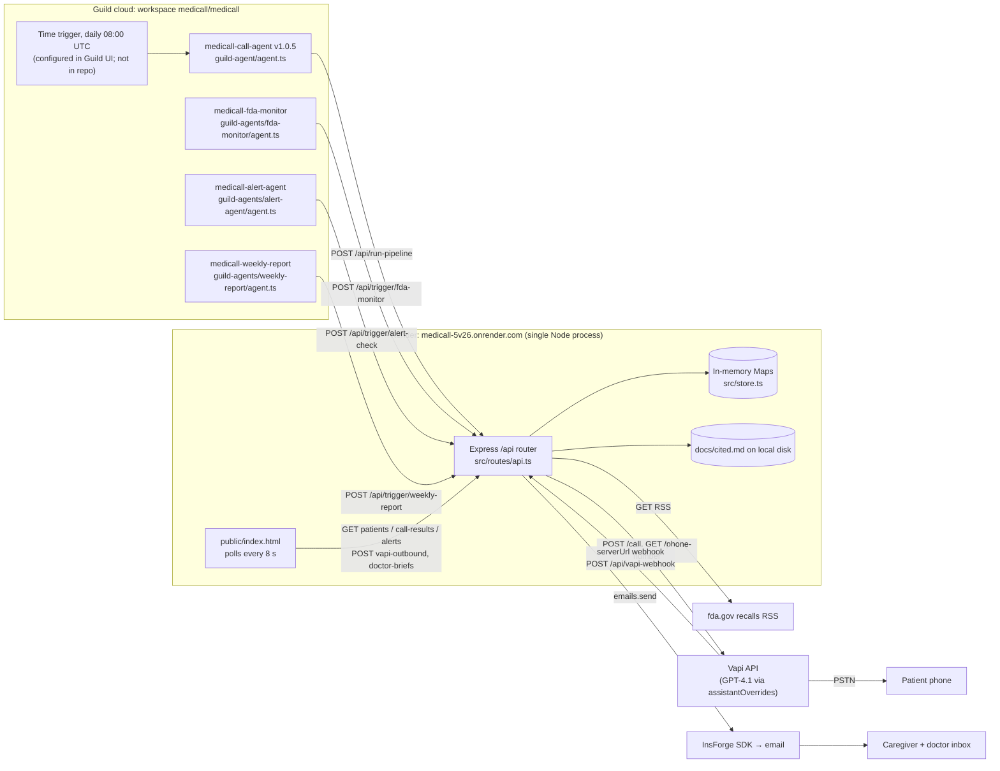
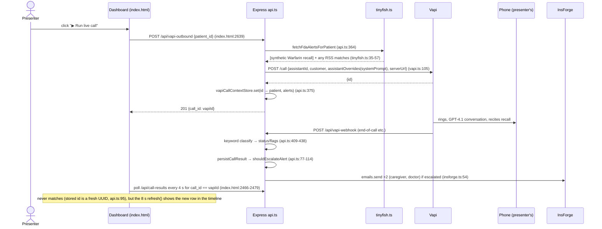

# MediCall: whole-project deep dive

> **Current execution policy:** [Start now or anytime, with no build cutoff](../../event/BUILD_AUTHORIZATION.md). The human reports that the event is already underway and public schedules are stale. Older start/deadline/duration advice below is superseded; historical timestamps and analytics windows remain evidence, not build gates.

> Guild AI deep-dive group. Checked 8 Oct 2026. Read-only: nothing installed, run or deployed. **[V]** = verified at file:line (paths are relative to `repos/guild-ai/medicall/`). **[I]** = inference. Round-1 file: [`analysis/guild-ai/medicall.md`](../archive/source-tree/analysis/guild-ai/medicall.md). This pass builds on round 1 and corrects it where noted.

## 1. At a glance

MediCall makes a daily automated phone check-in for elderly patients on medication. A Vapi voice agent (GPT-4.1 behind Vapi) calls the patient. It asks how they feel and whether they took their meds, and it reads out any FDA recall that matches their medication list. The backend classifies the transcript with keywords. If a deterministic rule trips (a concern, 2+ missed doses, or a no-answer streak), the backend emails the caregiver and doctor through InsForge. A single-page dashboard shows the roster, the call timeline, alerts and a "doctor brief". Four tiny Guild coded agents act as the scheduler and control plane: each one POSTs to one backend endpoint. The audience is adult children/caregivers and the patients' physicians. Pitch: *"the phone call that nobody else is making, every morning, so families stop finding out too late."* Awards: **Winner, Most Innovative Use of Guild.ai Platform** (participant-reported **3rd**) and **Best Use of Vapi** (participant-reported **1st**) at Ship to Prod, 24 Apr 2026 (see round 1 for sources).

## 2. Repo map

```
medicall/
├── src/                         Express 5 backend (TypeScript, ESM, built with tsgo)  — hand-written
│   ├── index.ts                 app bootstrap: cors(), json, static public/, /api router (17)
│   ├── config.ts                env loading + mock switches (29)
│   ├── types.ts                 Zod schemas: Patient, CallResult, AlertRecord, webhook (71)
│   ├── store.ts                 in-memory Maps + 3 seed patients + seed calls/alerts (209)
│   ├── routes/api.ts            all 18 REST routes, webhook classifier, pipeline (596)
│   └── services/
│       ├── vapi.ts              Vapi POST /call with per-patient assistantOverrides (206)
│       ├── insforge.ts          @insforge/sdk emails.send fan-out, SMS "skipped" (138)
│       ├── tinyfish.ts          FDA RSS regex parse + synthetic Warfarin recall (59)
│       ├── alerts.ts            deterministic escalation rule (26)
│       ├── summary.ts           weekly summary string template (27)
│       ├── pharmacology.ts      keyword "pharmacology agent" with canned answers (70)
│       └── doctorBrief.ts       templated brief + appends to docs/cited.md on disk (117)
├── public/index.html            whole dashboard: 1,179 CSS + ~500 markup + ~1,080 JS lines (2,776)
├── guild-agent/                 Guild coded agent medicall-call-agent v1.0.5 (agent.ts 97 + pkg/tsconfig/lock)
├── guild-agents/
│   ├── fda-monitor/             medicall-fda-monitor (agent.ts 73)
│   ├── alert-agent/             medicall-alert-agent (agent.ts 84)
│   └── weekly-report/           medicall-weekly-report (agent.ts 70)
├── docs/
│   ├── guild-judge-walkthrough.md  2-minute scripted tour of app.guild.ai for judges (34)
│   ├── demo-script.md           spoken demo script (45)
│   ├── marketing.md             "technical narrative for judges" (29 long paragraphs)
│   └── cited.md                 GENERATED output of /api/doctor-briefs (190), committed with real test runs
├── .kiro/specs/                 Kiro AI specs: vapi-guild-integration (536), demo-sprint (64), AI-generated plans
├── .claude/skills/
│   ├── medicall-project/        team-written "source of truth" skill for coding agents (398)
│   ├── guild-agent-development/ Guild CLI/SDK notes skill (206), doc-derived
│   ├── skill-creator/           VENDORED Anthropic skill-creator (1,169 incl. LICENSE + 3 py scripts)
│   └── insforge, tinyfish       DANGLING symlinks to gitignored ../../.agents/skills/*
├── CLAUDE.md                    generic "check in with the user" agent rules (76), no project content
├── package.json                 deps + `guild:*` CLI evidence scripts (44)
└── tsconfig.json, .env.example, .gitignore, README.md
```

**Lines of code** (lockfiles, `node_modules` and `dist` excluded) [V: `wc -l`]:

| Bucket | Lines | Notes |
|---|---|---|
| Backend TypeScript (`src/`) | **1,565** | hand-written (Cursor-assisted per commit trailers) |
| Guild agent TypeScript (4 × `agent.ts`) | **324** | about 80% identical boilerplate across the 4 |
| Dashboard (`public/index.html`) | **2,776** | CSS 1,179 / HTML ~500 / JS ~1,080, one file, no framework |
| JSON/TS config | ~280 | 5 package.json + 5 tsconfig |
| Project docs + team skill + Kiro specs | ~1,560 | prose, largely AI-generated [I] |
| Generated (`docs/cited.md`) | 190 | runtime output committed |
| Vendored (`skill-creator`) | 1,169 | Anthropic template, not project work |

**Hand-written code: about 4.7k lines** (1.9k TS + 2.8k dashboard). The functional backend core (routes, Vapi, alerts, FDA) is about 1.1k lines.

## 3. System architecture



Main demo flow ("Run live call" button for Samuel Brooks):



## 4. Component walkthrough

### 4.1 Backend bootstrap and config
- `src/index.ts:6-16`: Express with `cors()` open to every origin (`:8`), JSON body, static `public/`, and router at `/api`. No auth middleware, no rate limit, no helmet [V].
- `src/config.ts:13-28`: `USE_MOCK_VAPI` / `USE_MOCK_NOTIFICATIONS` toggles, Vapi credentials, InsForge URL/anon key, and `TINYFISH_FDA_FEED_URL`, which defaults to the plain fda.gov RSS URL (`:24-27`). The only "TinyFish" thing in the code is this env var name [V].

### 4.2 Data layer: `src/store.ts`
- Three seed patients (`:7-41`). Margaret Ellis and Samuel Brooks share the same real phone number `+14086740311` (`:10, :22`), which is the presenter's demo phone [I from commit msg 9d03509 "Samuel Brooks phone updated to demo number"].
- Seed call results and one seed alert with fake "sent" deliveries to `seed-caregiver@example.com` (`:48-131`). On boot, the dashboard KPIs, timeline and alert panel are populated from this canned data [V].
- Everything lives in `Map`s. A Render restart wipes it [V].

### 4.3 Routes: `src/routes/api.ts` (596 lines)
- `persistCallResult` (`:77-114`): builds a provisional record, runs `shouldEscalateAlert` over it plus the last 5 calls, stores it with a **new random `call_id`** (`:95`), and calls InsForge when escalated.
- `/run-pipeline` (`:136-211`): loops patients sequentially, fetches FDA alerts, starts the Vapi call. **If Vapi throws, it persists a fake `took_meds` result** with the transcript "Fallback: Vapi unavailable. Simulated successful call." (`:182-202`). It does label `provider: "fallback"`.
- `/trigger/*` (`:215-314`): single-purpose endpoints called by the three auxiliary Guild agents.
- `/vapi-webhook` (`:396-468`): `normalizeVapiWebhookPayload` (`:51-75`) digs `call.id`/`transcript` out of whatever Vapi shape arrives. Classification is **keyword matching**: "chest pain", "dizzy", "confused", "shortness of breath" → `concern`; "forgot", "missed", "didn't take" → `missed_meds`; default `took_meds` (`:415-438`). There is **no filter on Vapi message type**, so every server message that carries a call id and reaches this URL creates a call result [V code; how many messages Vapi actually sent depends on the assistant's `serverMessages` config, which isn't in the repo, I].
- `/vapi-outbound` (`:347-394`): what the dashboard button hits. On failure it returns 502 with `details: String(error)` (`:389-392`), so Vapi error text leaks to the client.
- Doctor-brief routes (`:536-593`) and the pharmacology query (`:470-488`).

### 4.4 Services
- `vapi.ts`: `buildAssistantOverrides` (`:17-65`) builds the per-patient system prompt and first message and picks the model (`openai`/`gpt-4.1`, `:53-56`). `startLiveCall` (`:73-141`) POSTs `/call` with `phoneNumberId`, `assistantId`, `customer`, `assistantOverrides`, `metadata`, and `serverUrl` (the webhook). `resolvePhoneNumberId` (`:162-197`) lets you put a phone number instead of a UUID in env and looks it up via `GET /phone-number`, which is a nice robustness touch. Mock mode returns `mock-call-<uuid>` (`:67-71`).
- `insforge.ts`: lazy `createClient({baseUrl, anonKey})` (`:30-46`), then `emails.send({to, subject:"MediCall Alert", html:`<p>${message}</p>`})` (`:54-58`). The message contains the raw transcript (`:123-130`), which is **unescaped HTML in email**. SMS is always recorded as `skipped / sms_channel_not_configured` in live mode (`:87-96`), yet the dashboard toast says "SMS + email sent" (index.html, demo sequence step 3) [V].
- `tinyfish.ts`: regex RSS parser (`:10-26`). For any patient whose meds include "warfarin", it **always prepends a hard-coded recall** "Warfarin Sodium Tablets (5 mg, lot #WF-2026-04)" (`:32-39`). Live RSS matches are appended after, up to 5 (`:41-57`). Feed errors are swallowed.
- `alerts.ts:3-25`: escalate if any recent call is `concern`, 2+ `missed_meds`, or the first ≤3 are all `no_answer`. Bug: `slice(0,3).every(...)` is true for a **single** no-answer call, so one missed pickup escalates immediately rather than after 3 [V].
- `pharmacology.ts`: the "Pharmacology Agent" is a keyword detector plus 3 canned answers (alcohol+metformin, side effects, generic) with two static citation URLs (`:16-70`). The dashboard describes it as "Queries Ghost drug DB" (index.html:1470-1471). No DB and no LLM exist [V].
- `doctorBrief.ts`: string template plus a fixed citation list; it appends each brief to `docs/cited.md` on disk with `writeFile` (`:77-98`). The committed `docs/cited.md` holds real test output from 13:22 PT on event day [V].
- `summary.ts`: one-sentence template.

### 4.5 Guild agents (`guild-agent/`, `guild-agents/*`)
All four agents share the same shape: `"use agent"`, `agent({description, inputSchema, outputSchema, tools: {}, run})`, and a `run()` that does one `fetch` POST to the Render backend and Zod-parses the reply (e.g. `guild-agent/agent.ts:57-97`). No `task.llm`, no tools, no Guild integrations [V].
- **History matters:** the first version (commit d7c2b44, 13:00) was an `llmAgent` with a long system prompt telling the LLM to GET/POST backend URLs, but its only tool was `pick(guildTools, ["guild_get_me"])`, so it **could not make HTTP calls**. The Kiro "demo-sprint" spec says exactly this ("Currently the agent only has `guild_get_me`"). At 14:56 (40bddbd) they rewrote it as code-first `fetch` [V: `git show d7c2b44:guild-agent/agent.ts`; `.kiro/specs/demo-sprint/requirements.md`]. That's a useful lesson: Guild `llmAgent`s need real tools to touch the world.
- **Bug: `medicall-weekly-report` can never succeed.** It expects `summary: z.record(...)` (`guild-agents/weekly-report/agent.ts:21-24`), but the backend returns `summary` as a **string** (`src/routes/api.ts:262-265`), so `parse` throws [V].
- At the deadline (16:30) the three auxiliary agents still defaulted `backend_url` to `http://localhost:8080`. The Render default and `new Headers()` ("for Guild compiler") landed at 16:48 (42a49e5) [V: diff].
- Package names `@guildai/medicall~medicall-*`. The lockfiles show `@guildai/agents-sdk` 0.2.40 from Guild's private registry (round 1) [V].

### 4.6 Dashboard (`public/index.html`)
- Vanilla JS. `refresh()` polls `/api/patients`, `/api/call-results` and `/api/alerts` every 8 s (`:2675-2705, :2773`). It renders KPIs, roster, timeline, alerts, agent cards and the audit table. Transcripts and names go through `escapeHtml` (`:2165-2172`), so it's XSS-safe for those fields [V].
- "Guild trigger panel" (`:1391-1419`): **"▶ Run live call"** → `runMorningCall` → `/api/vapi-outbound` (`:2629-2670`). **"Run judge sequence"** → `runDemoSequence` (`:2481-2560`): call → wait → alert toast → doctor brief. Note that the "Guild trigger panel" never calls Guild. It calls the backend directly [V].
- **Bug:** `waitForCallResult` polls for `c.call_id === outboundPayload.call_id` (`:2466-2479`). The response carries the **Vapi** id, but stored results get a fresh UUID (`api.ts:95`). The wait can't succeed and times out after 120 s/180 s with "Live call failed: timed out waiting for webhook result". The new result still appears through the 8 s refresh [V code; behaviour I].
- The "Agent pipeline" card lists 5 agents with static copy ("Nightly scrape", "every Sunday 6pm", "Ghost drug DB"). Its status chips are derived from local state and recent calls (`:2175-2200`), not from Guild sessions [V].

### 4.7 Infra, deploy, CI, tests
- Render deploy is implied by `medicall-5v26.onrender.com` (agent defaults) and commit 9a5ec0b "Wire public Vapi webhook URL for Render deploy". There's **no Dockerfile, render.yaml or CI config** in the repo [V].
- 8a451d5 removed Guild packages from the web app's dependencies so Render could build without Guild's private registry [V].
- **No tests** of any kind [V]. Type-checking uses `tsgo` (TypeScript 7 native preview, `package.json:8-11`).
- `package.json:12-16` has `guild:doctor/agents/triggers/sessions` npm scripts that wrap `npx @guildai/cli` and dump workspace evidence as JSON.

## 5. Data model

**Schemas** (Zod, `src/types.ts`; in memory only):

| Entity | Fields | Where |
|---|---|---|
| Patient | patient_id uuid, name, phone `+1\d{10}`, medications[], caregiver_phone, caregiver_email, doctor_email, call_time HH:MM, timezone | types.ts:3-13 |
| CallResult | call_id uuid, patient_id, timestamp, status ∈ took_meds/missed_meds/no_answer/concern, transcript, flags[], fda_alerts[], alert_sent | types.ts:15-31 |
| AlertRecord | alert_id, call_id, patient_id, created_at, acknowledged, acknowledged_at, deliveries[{channel, recipient, target, status sent/failed/skipped, detail, timestamp}] | types.ts:48-65 |
| VapiCallContext | vapi call id → {patient_id, fda_alerts} | store.ts:89-94 |
| DoctorBrief | brief_id, patient_id, call_id, generated_at, preview, full_brief, citations[] | doctorBrief.ts:5-13 |

`call_time` and `timezone` are stored but **never used for scheduling**. Nothing in the backend schedules anything; only the Guild trigger does [V: grep].

**API routes** (all under `/api`, none authenticated):

| Method | Path | Handler | Does |
|---|---|---|---|
| GET | /alerts | api.ts:116 | list alerts (filter `patient_id`) |
| POST | /alerts/:callId/acknowledge | api.ts:127 | ack alert |
| POST | /run-pipeline | api.ts:136 | FDA + Vapi call for one/all patients; fake success on Vapi failure |
| POST | /trigger/fda-monitor | api.ts:215 | FDA match for patient |
| POST | /trigger/weekly-report | api.ts:243 | weekly summary string |
| POST | /trigger/alert-check | api.ts:272 | re-run escalation + emails |
| GET | /health | api.ts:318 | liveness |
| GET | /patients | api.ts:322 | **all patient PII** |
| GET | /call-results | api.ts:326 | all transcripts |
| POST | /call-results | api.ts:330 | ingest arbitrary call result (can trigger emails) |
| POST | /vapi-outbound | api.ts:347 | place real phone call |
| POST | /vapi-webhook | api.ts:396 | Vapi callback, classify, persist, alert |
| POST | /pharmacology/query | api.ts:470 | canned drug answer |
| GET | /tinyfish/fda-alerts/:patientId | api.ts:490 | FDA match |
| GET | /reports/weekly/:patientId | api.ts:517 | weekly summary |
| POST | /doctor-briefs/generate/:callId | api.ts:536 | build brief, append to disk |
| GET | /doctor-briefs/call/:callId | api.ts:566 | brief by call |
| GET | /doctor-briefs/latest/:patientId | api.ts:578 | latest brief |

**Env vars** (`.env.example`, `src/config.ts`): `PORT`, `APP_URL`, `USE_MOCK_NOTIFICATIONS`, `USE_MOCK_VAPI`, `INSFORGE_URL`, `INSFORGE_ANON_KEY`, `VAPI_API_BASE_URL`, `VAPI_API_KEY`, `VAPI_PHONE_NUMBER_ID`, `VAPI_ASSISTANT_ID`, `TINYFISH_FDA_FEED_URL`. Guild agent input: `backend_url`, `patient_id`, `command`. No secrets are committed [V: grep of tracked files; `.env` is gitignored].

## 6. AI / agent design

There is **exactly one model call path**, and it runs inside Vapi rather than in this codebase:

| Where | Provider / model | Notes |
|---|---|---|
| `src/services/vapi.ts:53-56` | Vapi → `openai` `gpt-4.1` via `assistantOverrides.model` | full voice loop (STT → LLM → TTS) hosted by Vapi; base assistant `VAPI_ASSISTANT_ID` configured in the Vapi dashboard (not in repo) |

System prompt (`vapi.ts:26-47`, trimmed):
> You are a friendly, warm healthcare check-in assistant for MediCall. Your name is MediCall. You are calling ${patient.name} … PATIENT INFO: Name, Medications, Timezone. YOUR GOALS (in order): 1. Greet the patient warmly by first name… 2. Ask how they're feeling today. Listen for any health concerns (dizziness, chest pain, confusion, shortness of breath)… 3. Ask if they've taken their medications today… 4. [Inform them about the FDA recall… / No recall to mention] 5. Ask if they have any questions about their medications. 6. Wrap up warmly… TONE: Conversational, caring, like a friendly nurse… DO NOT: Diagnose anything; Prescribe or change medications; Give specific medical advice beyond "contact your doctor" or "contact your pharmacy"; Rush through the call.

Appended recall block (`:22-24`): "IMPORTANT — FDA RECALL ALERT: … You MUST inform the patient about this recall… contact their pharmacy on file to get a replacement… Be clear but calm". Without a recall it says "Do NOT mention any recalls." First message (`:49`): "Hey, is this ${firstName}? Hi! This is MediCall, just calling to check in on you today. How are you doing?" This matches the demo audio at 1:42 (round 1) [V].

- **Tools/functions:** none given to the voice model. No Vapi tool calls and no `analysisPlan`. The Kiro design (`.kiro/specs/vapi-guild-integration/design.md`, "Key Design Decisions" 1 and 6) planned Vapi structured `analysisPlan` classification, but it **was never built**; classification is backend keyword matching (`api.ts:415-438`) [V].
- **Output parsing:** substring checks on the lowercased transcript. Weakness: a negation like "no chest pain" contains the substring "chest pain", so it is classified `concern` [V by reading; I on frequency].
- **Retries:** none. One fetch, and failures go to a 502 or a fake success.
- **Guild agents:** deterministic code, no model. The original `llmAgent` (d7c2b44) was abandoned. The "multi-agent" design is really **four cron-able HTTP callers**; there is no agent-to-agent communication, shared memory or orchestration logic [V].
- **"Pharmacology agent", "doctor brief", "weekly report":** templates, not AI [V].
- **Memory:** none beyond the last-5-calls window for escalation.
- **Model-claim check:** the Devpost/pitch never names a model. GPT-4.1 is what the code sends. The dashboard's "LLM" pipeline stage refers to this.

## 7. All integrations

| Service | Exact usage | Depth |
|---|---|---|
| **Guild.ai** (agents-sdk 0.2.40, CLI) | 4 coded agents, each one `fetch` POST (`guild-agent/agent.ts:66-70`; `guild-agents/*/agent.ts:43, 53, 41`); published `@guildai/medicall~*` packages; `guild:*` npm scripts (`package.json:12-16`); time trigger + sessions described only in `docs/guild-judge-walkthrough.md:18-26` | **Load-bearing for scheduling only; thin per agent.** Autonomy hinges on a trigger that isn't in code. |
| **Vapi** | `POST {base}/call` (`vapi.ts:105-112`), `GET /phone-number` (`vapi.ts:172-178`), webhook `serverUrl` (`vapi.ts:102`) → `/api/vapi-webhook` (`api.ts:396`) | **Core-to-the-pitch.** Live phone call with dynamic prompt injection (won Vapi 1st). |
| **InsForge** (`@insforge/sdk` ^1.2.5) | `createClient` (`insforge.ts:38-42`), `emails.send` (`insforge.ts:54-58`) | **Thin wrapper.** Email only. The project skill calls InsForge "persistence, auth, notifications" (`.claude/skills/medicall-project/SKILL.md`), but persistence is in-memory Maps. |
| **TinyFish** | none. Only the env var name `TINYFISH_FDA_FEED_URL` (`config.ts:24`), route name `/tinyfish/...` (`api.ts:490`) and file name. The project skill admits it: "not currently wired through a TinyFish SDK package" | **Decorative / name-only.** The demo narration says "TinyFish basically flagged…" |
| FDA recalls RSS (fda.gov) | plain `fetch(feedUrl)` (`tinyfish.ts:43`) | real but secondary; the demo recall is synthetic |
| OpenAI GPT-4.1 | via Vapi override (`vapi.ts:53-56`) | load-bearing (inside Vapi) |
| Render | hosting (agent defaults; 9a5ec0b) | infra |
| Kiro, Cursor, Claude skills | build-time tooling (`.kiro/`, "Made-with: Cursor" trailers, `.claude/skills`) | n/a |

## 8. Real vs. mock map

| Feature / claim | Status | Evidence |
|---|---|---|
| Live outbound voice call personalised to the patient | **Real** | vapi.ts:73-141; demo 1:42-2:42 |
| Recall recited on the call ("Warfarin 5 mg, lot #WF-2026-04") | **Hardcoded** | tinyfish.ts:32-39, injected for any warfarin patient regardless of the FDA feed |
| "TinyFish pulls the live FDA recall feed" | **Missing** (TinyFish); plain RSS fetch is real | tinyfish.ts:41-57; no TinyFish SDK/API anywhere |
| "Guild agents wake up autonomously, no human trigger" | **Partially real** | agents real and published; time trigger is only in Guild config (walkthrough §2); the demo call itself was a button click (round 1, 1:15-1:22) |
| "Fleet of four agents" | **Partially real** | 4 agents exist, each a single HTTP POST with no logic; weekly-report always fails its Zod parse (weekly-report/agent.ts:21-24 vs api.ts:262-265); 3 of 4 pointed at localhost at the deadline |
| Transcript → status classification | **Real (keyword)** | api.ts:409-438; negation-blind |
| Caregiver + doctor email via InsForge | **Real** (if env set) | insforge.ts:48-63 |
| "SMS + email sent to caregiver and doctor" toast | **Partially false**: SMS always skipped in live mode | insforge.ts:87-96 vs index.html:2537 |
| Escalation rules (concern / 2 missed / 3 no-answers) | **Real, with an off-by-logic bug** (1 no-answer escalates) | alerts.ts:20-24 |
| Run pipeline when Vapi fails | **Fake success silently persisted** ("Simulated successful call", status took_meds) | api.ts:182-202 |
| Patient records, history, alerts persistence | **Mocked**: in-memory Maps with seeded patients/calls/alerts | store.ts:7-131 |
| Dashboard KPIs, timeline, alerts | **Real reads of the in-memory store**, but initially populated with seed data | index.html:2675-2705; store.ts:48-131 |
| Seed alert "sent" deliveries | **Hardcoded** | store.ts:106-128 |
| "Pharmacology agent queries Ghost drug DB" | **Mocked**: 3 canned answers | pharmacology.ts:27-69; index.html:1470-1471 |
| Doctor brief with citations | **Templated**; citations are a fixed list | doctorBrief.ts:17-22, 40-62 |
| Weekly report "mailed every Sunday 6pm" | **Missing** (no scheduler, no mail); summary is a one-liner | summary.ts; index.html "Next run · Sunday 18:00 local" is static text |
| "Guild trigger panel" on the dashboard | **Mislabelled**: calls the backend directly, not Guild | index.html:1391-1419, 2639 |
| Live-call pipeline stages (Calling/STT/LLM/Webhook/Persisted) | **Cosmetic**: stages 1-3 flip to done together after the wait; the wait can't match ids | index.html:2520-2527, 2466-2479; api.ts:95 |
| marketing.md "If FDA feed retrieval fails or live telephony cannot be initiated, the API surfaces explicit errors rather than manufacturing substitute medical events" | **False at HEAD**: both the synthetic recall and the simulated call exist | docs/marketing.md:23 vs tinyfish.ts:32-39, api.ts:182-202 |

Rough tally of user-visible claims: about **35% real, 25% partially real, 40% mocked/hardcoded/missing** [I, from the table above].

## 9. Demo path trace (video rzGN9MnGIyc, 180 s; timestamps from round 1)

1. **0:00-0:24 Hook and promise.** No code.
2. **0:24 "Guild AI agents wake up autonomously… another agent uses TinyFish…"** Narration only. The Guild side would be `guild-agent/agent.ts` firing from a time trigger → `POST /api/run-pipeline`. Not shown on screen.
3. **0:43 "dynamically inject the patient's name, medications, and active recalls"** → `buildAssistantOverrides` (vapi.ts:17-65). This is accurate.
4. **0:58 "alert agent fires and InsForge delivers"** → `persistCallResult` → `sendCaregiverAndDoctorAlert` (api.ts:100-111; insforge.ts:119-137). It runs inside the webhook, not in the Guild alert agent.
5. **1:15-1:22 Samuel Brooks selected, "click one button"** → roster click handler, then "▶ Run live call" → `runMorningCall` → `POST /api/vapi-outbound` (index.html:2629-2645; api.ts:347). The FDA panel's "recall on his warfarin" is `tinyfish.ts:35-39`.
6. **1:42-2:42 Live call.** Vapi plays `firstMessage` (vapi.ts:49) to the presenter's phone (store.ts:22). The patient says "dizziness and shortness of breath", and the model follows prompt goal 2. Asked about recalls, it reads the synthetic lot number from the recall block (vapi.ts:22-23).
7. **Webhook:** `/api/vapi-webhook` classifies `concern` with flags `dizziness, shortness_of_breath` (api.ts:417-430), escalates (alerts.ts:8-11) and emails (insforge.ts:54).
8. **2:42 "Dashboard shows result flagged"** → picked up by the 8 s `refresh()` (index.html:2773), not by the trigger-panel wait (which can't match ids).
9. **Not in the video:** the Guild UI tour, which was scripted for live judging in `docs/guild-judge-walkthrough.md` (committed 16:48, post-deadline).

## 10. Code quality and security review

**Quality.** The code is clean and readable. The TS is strict with Zod at the boundaries, and services are small and single-purpose. Weak spots: `api.ts` is one 600-line file with copy-pasted FDA/weekly logic (`:243-270` duplicates `:517-534`). Errors are swallowed (`catch {}` at api.ts:160, 182, 365; tinyfish.ts:53). There are no tests, and the in-memory store is lost on restart. The four Guild agents are copy-paste with schema drift (the weekly-report bug). Correctness bugs: the call-id mismatch (index.html:2474 vs api.ts:95), the no-answer streak (alerts.ts:20-24), negation-blind classification (api.ts:418-430), and doctor briefs written to the repo's `docs/` at runtime (doctorBrief.ts:15, 97). Grade: **C+**, a tidy hackathon backend with honest-looking types but fake fallbacks and no auth.

**Security** (relevant to a cyberdefense audience) [V unless marked]:

| # | Issue | Where | Severity |
|---|---|---|---|
| 1 | **No authentication on any route** of a public Render service holding health data. `GET /api/patients` returns names, phones, meds and caregiver/doctor emails; `GET /api/call-results` returns transcripts | index.ts:8-12; api.ts:322-328 | High (PHI exposure) |
| 2 | **Anyone can place real phone calls** (toll fraud / harassment) via `POST /api/vapi-outbound` or `/api/run-pipeline` (all patients), and the Guild agents call the same unauthenticated endpoint | api.ts:136, 347 | High |
| 3 | **Host-header-controlled webhook URL**: `serverUrl` is built from `x-forwarded-proto` + `Host` of the incoming request, so an attacker who triggers a call with a forged Host gets Vapi to deliver the full call transcript to the attacker's server | api.ts:40-49 → vapi.ts:102 | High [I: depends on Render's proxy passing a spoofed Host/X-Forwarded-Host; the code trusts it] |
| 4 | **Unverified webhook**: no Vapi secret/signature check. Anyone who knows a call id can POST a forged transcript and trigger caregiver/doctor emails | api.ts:396-468 | Medium |
| 5 | **Forged call results**: `POST /api/call-results` accepts any `status: "concern"` and sends emails | api.ts:330-345 | Medium |
| 6 | **HTML injection into outbound emails**: the raw transcript (attacker- or caller-controlled speech) is interpolated into `html` | insforge.ts:57, 123-130 | Medium |
| 7 | `cors()` with default `*` | index.ts:8 | Low (no cookies, but widens #1) |
| 8 | Internal error text returned to clients (`details: String(error)`) | api.ts:389-392 | Low |
| 9 | Unbounded disk append to `docs/cited.md` via an unauthenticated POST | doctorBrief.ts:77-98; api.ts:536 | Low (DoS) |
| 10 | Silent fake "took_meds" on Vapi failure: safety and integrity failure in a health product | api.ts:182-202 | High (safety) |

There are no committed secrets, no SQL/shell injection surface (no DB, no exec) and no unsafe deserialization. The dashboard escapes the rendered transcript/name fields (index.html:2165).

## 11. Build history

21 commits, 10:59 → 16:48 PT on 24 Apr 2026 (git dates are -0700) [V: `git log --shortstat`]. The deadline is 16:30 PT (round 1).

| Hour (PT) | Commit | Author | Size | What |
|---|---|---|---|---|
| 10:xx | d74c513 10:59 | abdullahw1 | +2 | init |
| 11:xx | 21864f5 11:00 | abdullahw1 | +2 | "first" |
| | 589c4c7 11:12 | Kevin Chen | +1,252 | CLAUDE.md + **vendored** skill-creator |
| | 65f36fd 11:33 | Kevin Chen | +2,639/-1 (≈940 non-lock) | whole backend v1 (routes, alerts, InsForge, FDA, store, team skill) |
| 12:xx | 26239cf 12:46 | Kevin Chen | +8,684/-826 (≈1.1k non-lock) | dashboard rebuild (+1,632 html), Guild skill, InsForge SDK |
| 13:xx | d7c2b44 13:00 | abdullahw1 | +666 | first Guild `llmAgent` (unusable) + Kiro specs |
| | 2577790 13:01 | Kevin Chen | merge | |
| 14:xx | 6fc2978 14:31 | Kevin Chen | +2,174/-113 | Vapi service, webhook, pharmacology, doctor briefs, dashboard |
| | 40bddbd 14:56 | abdullahw1 | +115/-122 | `/run-pipeline` + code-first Guild agent |
| | 12e528c 14:59 | Kevin Chen | +135/-232 | live-data dashboard refactor |
| 15:xx | 04cca82 15:04 | Kevin Chen | +703/-74 | alerts store + ack + UI |
| | 1eb8b69 15:19, a43d816 15:20 | Kevin Chen | +28/-7 | switch/publish run-pipeline agent |
| | 9a5ec0b 15:28 | Kevin Chen | +46/-2 | public webhook URL for Render |
| | 8a451d5 15:28 | Kevin Chen | lockfile -6.9k | drop Guild pkgs from web deploy |
| | 5a262fb 15:44, 08436ae 15:45 | Kevin Chen | +213/-7 | Render default, v1.0.5, agent lockfile |
| 16:xx | **9d03509 16:28** | abdullahw1 | +1,077/-40 | 3 more Guild agents, Vapi prompt overrides, **synthetic Warfarin recall**, demo script |
| | 0f0a0a2 16:29 | Kevin Chen | merge | |
| | **5096ee1 16:36** | Kevin Chen | +10/-10 | post-deadline: npm `guild:*` scripts, doc wording |
| | **42a49e5 16:48** | Kevin Chen | +74/-20 | post-deadline: judge walkthrough, Render defaults + `Headers()` for 3 agents, versions 1.0.1 |

- **Authors:** Kevin Chen made 15 commits (backend, dashboard, Vapi, deploy, Guild publishing). Abdullah Waheed made 6 (Guild agents, Kiro specs, pipeline endpoint, final demo wiring). Both use AI tools (Cursor trailers, Kiro specs, Claude skills).
- **Before the event:** nothing. The repo starts at 10:59 on event day [V].
- **Final hour (15:30-16:30):** Render wiring, agent publish, and the 16:28 commit that added the Vapi prompt overrides, the synthetic recall and three of the four Guild agents. The headline demo beats landed **2 minutes before the deadline**.
- **Post-deadline:** two commits (16:36, 16:48) that are docs/config only but make the three auxiliary agents reachable from Guild cloud. Judging likely saw this state [I]. No commits after 24 Apr.

## 12. How hard was this to build?

A skilled builder could reproduce the whole thing in **about 3-4 hours**. The hard parts were external, not code:
1. **Vapi telephony setup** (phone number, assistant, override semantics, webhook reachability). This drove the Render deploy and `resolvePhoneNumberId`. About 1-1.5 h including a real test call.
2. **Guild onboarding:** private-registry auth, the compiler constraints (`Headers()`, no `Promise.all`), discovering that an `llmAgent` without tools can't call HTTP (a pivot that cost ~2 h), publishing, and creating the trigger in the UI.
3. **InsForge email** credentials.

The backend (~1.1k functional lines) is a 1-hour job with AI help. The 2.8k-line dashboard is mostly AI-generated styling [I]. Nothing algorithmic is hard here. The winning effort went into the integrations, the live call and the judge enablement.

## 13. Reusable patterns and code (for a Cyberdefense entry)

1. **Per-run prompt injection of live context into a hosted voice/agent** (`src/services/vapi.ts:22-24, 95-98`):
   ```ts
   const recallBlock = hasRecall
     ? `\n\nIMPORTANT — FDA RECALL ALERT:\n…${fdaAlerts.join("\n")}\nYou MUST inform the patient…`
     : `\n\nNo FDA recall alerts matched … Do NOT mention any recalls.`;
   ```
   Cyber use: inject the matched IOC/CVE context into an incident-briefing call or agent, with an explicit "say nothing if none" branch to prevent hallucinated alerts.
2. **Thin code-first Guild agent as a typed, schedulable trigger** (`guild-agent/agent.ts:57-97`). Pattern: `"use agent"`, a Zod input with a production `backend_url` default, one fetch, Zod-parse the output. Fine as a *scheduler shim*, but give judges at least one agent that reasons or uses Guild tools.
3. **Deterministic escalation rule kept outside the LLM** (`src/services/alerts.ts:3-25`). Auditable thresholds are the right call for security alerting (e.g. N failed logins). Fix the streak bug: require `length >= 3`.
4. **Guild evidence scripts plus a judge walkthrough** (`package.json:12-16`; `docs/guild-judge-walkthrough.md`). Have the CLI dump agents, triggers and sessions as JSON, and a 2-minute click path with prepared "judge lines".
5. **Project skill as a single source of truth for coding agents** (`.claude/skills/medicall-project/SKILL.md`). It includes an honest "Sponsor Integration Modes (Current Repo Truth)" table. Do this, and keep the pitch consistent with it.

**Avoid:** fake-success fallbacks (api.ts:182-202), synthetic data presented as live (tinyfish.ts:32-39), sponsor names on code that doesn't use the sponsor ("TinyFish"), unauthenticated trigger endpoints and Host-derived webhook URLs (api.ts:40-49), a UI panel named after a sponsor that doesn't call it ("Guild trigger panel"), and ids that differ between the response and the stored record (api.ts:95).
