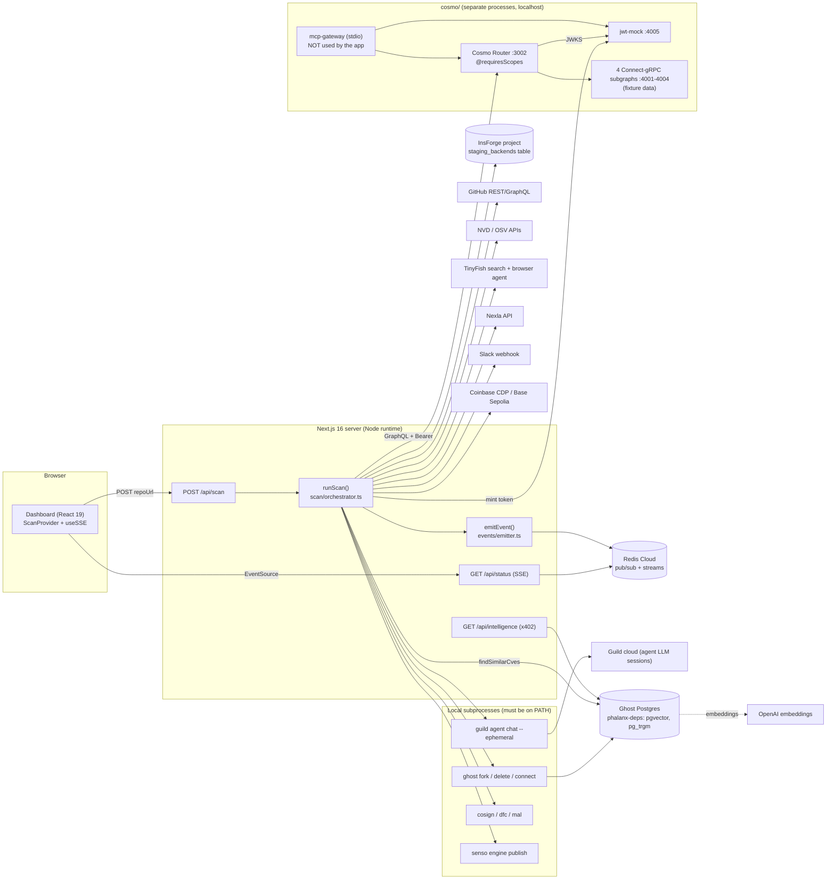

# Phalanx: whole-project deep dive

> **Current execution policy:** [Start now or anytime, with no build cutoff](../../event/BUILD_AUTHORIZATION.md). The human reports that the event is already underway and public schedules are stale. Older start/deadline/duration advice below is superseded; historical timestamps and analytics windows remain evidence, not build gates.

Round 1: [`analysis/guild-ai/phalanx.md`](../archive/source-tree/analysis/guild-ai/phalanx.md). Repo: `repos/guild-ai/phalanx` (https://github.com/ElijahUmana/phalanx). Paths below are relative to that repo unless noted.

## 1. At a glance

Phalanx is an "autonomous CVE response" pipeline for software supply-chain vulnerabilities. It is built for AppSec and platform teams, and the pitch is that it cuts patch time from "60 days to 90 seconds". You paste a GitHub URL. A Next.js server reads `package.json`, pulls CVE feeds, races four remediation "hypotheses" in Ghost copy-on-write database forks with InsForge staging backends, cancels one "false positive" fork mid-flight over Redis pub/sub, has a Guild Operator agent approve the winner, then opens a PR and publishes an evidence bundle (Chainguard SBOM plus Sigstore, and cited.md). The governance story is per-role GraphQL scopes enforced by a WunderGraph Cosmo router, plus an "audit log" of agent actions. It won **Most Innovative Use of Guild.ai** at Ship to Prod (24 Apr 2026) and also won the Chainguard and WunderGraph tracks. One author, Elijah Umana.

**What this pass adds to round 1 [V]:**
- The pipeline's **winner is fixed by a string hash of the hypothesis name**, so `swap-chainguard` always wins.
- The **"validation tests" are a constant 42** with a pass count derived from that hash.
- The **JWT issuer hands any role, including `ROLLOUT_OPERATOR`, to anyone who asks**, and the MCP gateway lets the LLM choose its own role.
- The dashboard **cannot render a Guild denial or a Guild-driven cancel**, because those event types are not subscribed.
- The README's claim that "the dashboard renders provenance" is false.

## 2. Repo map

```
phalanx/
├── src/                          Next.js 16 app (App Router, TS strict)
│   ├── app/
│   │   ├── page.tsx              redirect → /dashboard
│   │   ├── dashboard/page.tsx    single-page dashboard (Hero, ScanInput, PanelGrid, EvidenceChain, CancelEvent)
│   │   ├── api/scan/route.ts     POST: validate repoUrl, start runScan() in background, return scanId
│   │   ├── api/status/route.ts   GET SSE: subscribe Redis channel scan:events:{id} → frames
│   │   └── api/intelligence/route.ts  GET, x402-paywalled CVE similarity search
│   ├── components/dashboard/     15 client panels, one per sponsor + ForkRace/EvidenceChain/CancelEvent
│   │   └── ScanProvider.tsx      reducer folding PhalanxEvents into UI state; POSTs /api/scan
│   ├── hooks/useSSE.ts           EventSource with a hardcoded KNOWN_TYPES list
│   └── lib/
│       ├── scan/orchestrator.ts  THE pipeline: Phase 0→6, 562 lines
│       ├── scan/audit.ts         GitHub contents API → package.json deps (fallback list)
│       ├── scan/mock.ts          DEAD CODE: original all-synthetic runner (not imported)
│       ├── events/               emitEvent (Redis PUBLISH, in-process fallback) + event type
│       ├── guild/                Guild CLI subprocess wrapper + Zod schemas for 5 agents
│       ├── wundergraph/          GraphQL client: mint JWT per role → Cosmo router
│       ├── ghost/                `ghost` CLI fork/delete + pg queries + pgvector memory
│       ├── redis/                streams, pub/sub, Vector Sets, semantic cache
│       ├── insforge/             @insforge/sdk rows in `staging_backends` + in-memory registry
│       ├── tinyfish/             @tiny-fish/sdk search, browser agent, GitHub PR creator
│       ├── chainguard/           execFile dfc / cosign / mal + JSON fixtures
│       ├── nexla/                NVD/OSV/GHSA fetch + Nexla project lookup + Slack writeback
│       ├── senso/                `senso` CLI publish to cited.md
│       ├── x402/                 CDP / viem wallet, x402 paywall middleware, fetch client
│       └── env.ts                Zod env schema
├── cosmo/                        WunderGraph Cosmo supergraph (separate npm projects)
│   ├── graph.yaml, config.yaml   compose manifest + router config (JWT JWKS auth, require auth)
│   ├── config.json               composed execution config (generated by `wgc`, 58 KB single line)
│   ├── jwt-mock/src/server.ts    Fastify issuer: role → scope table, /token, JWKS
│   ├── services/{sbom,deployment,risk,marketplace}-service/
│   │   ├── src/graph/schema.graphql   federation schema with @requiresScopes (26 uses)
│   │   ├── src/proto/…               proto + mapping.json + lock (wgc-generated)
│   │   ├── src/generated/…_pb.ts     GENERATED protobuf-es
│   │   ├── src/data.ts               hardcoded seed fixtures
│   │   └── src/routes.ts             Connect-RPC handlers over the fixtures
│   ├── mcp-gateway/              stdio MCP server: 5 tools = 5 persisted ops, `_roleOverride` arg
│   └── scripts/                  start-all.sh, demo-scopes.ts (allow/deny assertion script)
├── scripts/                      manual smoke tests per subsystem (test-*.ts), seed-ghost.ts, seed SQL/JSON
├── skills/phalanx/SKILL.md       Shipables "skill" telling an agent how to curl the API
├── Dockerfile                    Chainguard node builder → distroless runtime
├── docker-compose.yml            only a Cosmo router stub (config commented out)
├── .github/workflows/ci.yml      lint + typecheck + build (added Aug 2026)
├── CLAUDE.md / AGENTS.md         coding-agent conventions ("Task #N" owners, no AI co-author trailers)
└── README.md                     229 lines, rewritten Aug 2026
```

**Lines of code (excluding lockfiles and node_modules) [V via `git ls-files | xargs wc -l`]:**

| Bucket | Lines | Notes |
|---|---|---|
| `src/**/*.ts(x)` | 8,872 | includes 396 lines of dead `scan/mock.ts` |
| `src/app/globals.css` | 99 | |
| `scripts/*.ts` | 1,235 | manual integration scripts, not a test suite |
| `cosmo/**/*.ts`, hand-written | 2,079 | about 636 of this is `data.ts` fixture tables |
| `cosmo` generated `*_pb.ts` | 2,141 | generated by protobuf-es |
| `cosmo` proto + GraphQL + mapping | about 1,770 | mapping.json/lock are `wgc`-generated; schemas and protos are hand-written |
| Markdown | 711 | |
| Seed/fixture JSON+SQL | 278 | |
| `pnpm-lock.yaml` and 9 `package-lock.json` | about 18k | excluded |

**Hand-written total is about 12.5k lines.** That is roughly 8.5k in the app, 1.2k in scripts and 2.8k in Cosmo. The 7,471-line "scaffold" commit at 14:28 is mostly the lockfile plus create-next-app files. The 19,940-line "docs: clean up README" commit at 15:09 is mostly `cosmo/` (generated code plus lockfiles).

## 3. System architecture

### Component diagram (as found in code)



### Sequence: the demo flow (paste URL → evidence published)

```mermaid
sequenceDiagram
  participant U as User / Dashboard
  participant API as /api/scan
  participant O as runScan
  participant R as Redis (events)
  participant WG as Cosmo Router + jwt-mock
  participant G as guild CLI
  participant GF as Ghost CLI
  participant IF as InsForge
  U->>API: POST {repoUrl}
  API-->>U: {scanId}; setTimeout(runScan, 500ms)
  U->>R: GET /api/status?scanId (SSE subscribe)
  O->>O: auditRepo (GitHub contents API)
  O->>O: Nexla ingest NVD/OSV/GHSA
  O-->>R: cve.found (always CVE-2020-8203 lodash)
  O->>O: TinyFish 4 searches, Ghost pgvector + trigram
  O-->>R: 4× redis.stream.dispatch (no consumer)
  O->>WG: ANALYST token → impact, risk queries (allowed)
  O->>WG: ANALYST token → rollout mutation
  WG-->>O: scope error → wundergraph.scope.denied
  O->>G: phalanx-analyst session (≤90s)
  G-->>O: JSON verdict (ignored: `void analystVerdict`)
  O-->>R: 3 synthetic guild.action events
  O->>GF: 4× ghost fork --wait (≤30s each, synthetic on timeout)
  O->>IF: 4× insert staging_backends row
  O-->>R: redis.pubsub.cancel + hypothesis.cancelled (index 2, hardcoded)
  O->>IF: validate survivors (score = hash(name))
  O-->>R: x402.payment (placeholder tx hash)
  O->>G: phalanx-operator with "Pre-approved decision: APPROVE"
  G-->>O: JSON → guild.approval.granted (or synthetic fallback)
  O->>O: dfc, cosign SBOM/attest (fixture fallback), mal scan
  O->>O: GitHub PR via REST, Senso publish, Nexla/Slack writeback
  O-->>R: scan.complete → SSE closes
  R-->>U: panels animate per event
```

## 4. Component walkthrough

**API layer**
- `src/app/api/scan/route.ts:13-21` checks the body with Zod. The GitHub regex (`:18`) is **unanchored**, so `https://evil.example/?u=https://github.com/x` passes. No SSRF follows from this, because later fetches are fixed to `api.github.com`. `:48-56` starts `runScan` in `queueMicrotask`+`setTimeout(500)`, with the comment "Pub/Sub drops messages without a subscriber". That is a known race: events published before the SSE subscriber connects are lost. There is no auth and no rate limit, and each POST spawns 4 Ghost forks, 2 Guild LLM sessions, TinyFish runs and a GitHub PR attempt.
- `src/app/api/status/route.ts:32-103` is an SSE `ReadableStream`. It subscribes to `scan:events:{scanId}` (`events/emitter.ts:73-131`), sends a heartbeat every 15 s, times out at 5 min, and closes 100 ms after `scan.complete`/`scan.failed`. It monkey-patches `controller.close` to release Redis (`:94-98`).
- `src/app/api/intelligence/route.ts:4-38` is an x402-paywalled ($0.001 USDC) Ghost semantic plus lexical CVE search. The demo pipeline never calls it.

**Event bus.** `src/lib/events/emitter.ts:39-66` publishes JSON to Redis. On the first failure it flips a global `redisUnavailable` flag and falls back to an in-process `EventEmitter`. That fallback only works single-process. The schema is `{scanId, type, source, timestamp, data}` (`events/types.ts:18-24`), with `data` untyped.

**Orchestrator.** `src/lib/scan/orchestrator.ts:108-562`, phase by phase:

| Phase | Lines | What runs | Real? |
|---|---|---|---|
| 0 audit | 120 → `scan/audit.ts:69-99` | GitHub contents API, deps from `dependencies/devDependencies/peerDependencies`, with `^~` stripped. Falls back to 5 hardcoded packages (`audit.ts:21-27`) | real |
| 1 feeds | 124 → `nexla/ingestion.ts` | NVD latest 20 (not filtered by package), OSV query for the **first** package, GHSA GraphQL (synthetic 3 CVEs without `GITHUB_TOKEN`, `:74-84`) | real, but **not used** to pick the CVE |
| 1 CVE | 128-137 | emits `DEMO_CVE` lodash CVE-2020-8203 **regardless of the repo's deps** (`:49-58`) | hardcoded |
| 1b enrich | 140 → `tinyfish/enrichment.ts:58-118` | 4 TinyFish search queries, heuristic confidence | real; result discarded |
| 2a memory | 144-149 → `ghost/memory.ts:120-179, 238-275` | pgvector `<=>` cosine and `pg_trgm similarity()` over seeded CVEs | real; result discarded |
| 2b dispatch | 152-164 → `redis/streams.ts:22-47` | 4 XADDs to `cve-investigations` | real write, **no consumer anywhere** in `src/` |
| 2c scopes | 167-181 → `wundergraph/client.ts` | ANALYST token. Impact and risk queries are allowed, then the rollout mutation is denied | real if the Cosmo stack runs locally |
| 2d Guild | 189-225 | one `runAnalyst` (90 s cap), 3 synthetic `guild.action` events (`:210-224`), verdict thrown away (`:225`) | 1 real, 3 synthetic |
| 3 forks | 235-272 | 4× `ghost fork --wait` (30 s cap, synthetic `ghost.fork.complete` on timeout `:252-258`), 4× InsForge row | real forks, **nothing is applied or tested inside them** |
| 3b cancel | 275-295 | `cancelledIndex = 2` constant, Redis PUBLISH, InsForge delete, Ghost delete | trigger hardcoded |
| 3c validate | 298-305 → `insforge/validator.ts` | SELECT row for "reachable", then **score = hash(hypothesisName)** | fake scoring |
| 4 portal/x402 | 310-350 | TinyFish browser agent on the npm page (15 s cap). Wallet resolved, and **tx hash is a literal placeholder** (`:342-345`) | partial |
| 5 approve | 353-428 | ranks survivors, builds `ValidatorOutput` locally, Operator session with `autoDecision: 'APPROVE'`, synthetic grant on timeout | staged |
| 5b Chainguard | 435-472 | `dfc` on a bundled `vulnerable.Dockerfile`, `cosign download sbom`/`verify-attestation` on `cgr.dev/chainguard/node:latest` (fixture fallback), `mal scan` on the demo dir | real if CLIs present, fixture otherwise |
| 6 publish | 476-532 | GitHub REST PR (`preferBrowserAgent: false`, `:493`), Senso → cited.md, Nexla writeback | partial (see §8) |
| 6b cleanup | 535-542 | delete loser forks and rows | real |

There is a latent bug at `:384`. The winner rationale prints `validations[0].testsPassed`, which is the first *survivor's* validation, not the winner's.

**Guild wrapper.** `src/lib/guild/orchestrator.ts`:
- `chat()` (`:90-128`) spawns `guild agent chat --path <AGENTS_DIR>/<name> --mode json --no-splash --ephemeral`, writes `{"prompt": …}` to stdin, and has a 120 s kill timer.
- `AGENTS_DIR` defaults to `path.resolve(cwd, '..', 'agents')` (`:47-48`). That is **outside the repo**, so no clone can run the agents.
- `sessionId` is a local `randomUUID()` (`:103`), not Guild's session id.
- `extractJson`/`unwrapEnvelope` (`:130-177`) peel code fences, `{result:{…}}` and `{type:'text',text:…}` envelopes. Unparseable output becomes `{}`, and the Zod `parse` then **throws**.
- Five typed `run*` functions exist (`:197-436`). Only `runAnalyst` and `runApprovalGate` are imported by the pipeline (`scan/orchestrator.ts:35-42`).

**Guild schemas.** `src/lib/guild/types.ts:13-250` holds Zod schemas for scanner findings, analyst verdict (`REAL_RISK|FALSE_POSITIVE|NEEDS_MORE_DATA`, blast radius, `recommendCancel`), planner hypotheses with `cancelPolicy`, validator ranking with a score breakdown, and the operator decision (`APPROVE|REJECT|HOLD`, `productionTouched`, `actions`). This is the best-designed part of the codebase. It is a clear contract for a 5-agent pipeline, even though 3 agents are never called.

**WunderGraph client.** `src/lib/wundergraph/client.ts` holds 5 inline operations with declared `requiredScopes` (`:29-86`). Each call mints a fresh JWT from jwt-mock (`:94-111`), POSTs to the router, and emits `wundergraph.query` and, if errors match, `wundergraph.scope.denied` (`:144-170`). The denial detector (`:278-299`) matches on error codes and regexes such as `/unauthorized/i`.

**Cosmo stack** (`cosmo/`):
- **Router.** `config.yaml:31-44` sets JWKS auth, `require_authentication: true` and `reject_operation_if_unauthorized: true`. `dev_mode: true` is at `:12`.
- **jwt-mock.** `jwt-mock/src/server.ts:26-48` is the role→scope table, and `:113-134` is `POST /token` with **no authentication**. It listens on `0.0.0.0` (`:142`), and its RSA key is regenerated each boot (`:59-66`).
- **Subgraphs.** Fixture tables (`services/*/src/data.ts`) are served over Connect-RPC (`routes.ts`). `rollout` always returns `approvalRequired: true` (`deployment-service/src/routes.ts:72-85`), so there is no real deployment.
- **`demo-scopes.ts`.** Asserts the allow/deny matrix (ANALYST denied rollout, REMEDIATOR allowed staging, and so on; `cosmo/scripts/demo-scopes.ts:1-12`).
- **MCP gateway.** `cosmo/mcp-gateway/src/tools.ts:56,76` exposes the 5 operations as MCP tools, each with an optional `_roleOverride` argument "to demonstrate scope enforcement". The Next.js app never references it (grep finds only a comment, `wundergraph/types.ts:2`).

**Ghost.** `src/lib/ghost/client.ts` uses `execFile('ghost', …)` with no shell. `createFork` (`:47-87`) runs `ghost fork <db> --wait --json --name`. `writePatchResult`/`queryDeps` exist (`:120-181`) but are **never called** by the pipeline, so forks are created and deleted with no work done inside them. `ghost/memory.ts:6-71` uses OpenAI `text-embedding-3-small` when `OPENAI_API_KEY` is set, and otherwise a **deterministic hashed bag-of-tokens/trigrams vector**. Search falls back silently with no flag.

**Redis.** `redis/pubsub.ts:11-32` PUBLISHes `cancel:{cveId}` and reports the subscriber count. `subscribeCancellations` (`:40-61`) is only called in `scripts/test-redis.ts:127`, so during a scan **the cancel goes to zero subscribers**. The "cancels that fork across the entire pipeline" effect is the orchestrator's own sequential code. `redis/vectors.ts` (Vector Sets `VADD`/`VSIM`) and `redis/cache.ts` (semantic cache) are not used by the pipeline.

**InsForge.** `insforge/provisioner.ts:47-110` inserts a `staging_backends` row via `@insforge/sdk` and always mirrors it into an in-memory `Map`. The fallback was hardened in Aug 2026 (`:25-45`). `validator.ts:17-24` is `deterministicScore(name) = 0.82 + (|hash| % 100)/100 × 0.18`, and `testsTotal = 42` (`:49`). Computing it gives upgrade-minor 0.834, upgrade-major 0.885, **pin-and-patch 0.903 (the one always cancelled)** and **swap-chainguard 0.910 (always the winner)**. So the Chainguard-sponsored strategy is guaranteed to win, and the cancelled lane is the best non-Chainguard option.

**TinyFish.**
- `enrichment.ts:58-118` runs 4 searches.
- `vendor-portal.ts:65-78` runs a browser-agent goal that extracts the latest/patched version from the npm page.
- `pr-creator.ts:23-46` tries the agent path, then the REST path. The pipeline forces REST (`orchestrator.ts:493`). The REST path (`:186-300`) needs `GITHUB_TOKEN` and a **head branch `phalanx/fix-cve-2020-8203` that nothing in the code creates or pushes** (`pr-creator.ts:51-53` says the caller "MUST have already pushed"). So the PR works only if the branch was pre-made in the target repo [I: demo repo was prepared].

**Chainguard.** `dfc.ts:34-41` runs `dfc --org chainguard <file>` with no shell. `sbom.ts:33-78` runs `cosign download sbom`, and on failure loads `fixtures/chainguard-node-sbom.json` with `source: 'fixture'`, `sigstoreUrl: …/fixture-cached` (`:178-187`). `attestation.ts:33-45` runs `cosign verify-attestation` with the Chainguard identity regex. `scanner.ts` runs `mal scan` (malcontent), with a fixture fallback.

**Nexla.** `ingestion.ts` makes real NVD/OSV/GHSA fetches. The Nexla API itself is only used for an "ensure project exists" lookup (commit `40b6123`, 18:15, post-deadline). `writeback.ts:29-48` is a Slack webhook if set. Jira/ServiceNow/PagerDuty are labelled "simulated" (`:40`).

**Senso.** `senso/publisher.ts:24-33` runs `execFile('senso', …)`, and `:197-262` does create prompt → `engine publish` → cited.md URL.

**x402.** `x402/wallet.ts:81-100` **generates a private key and writes it into `.env.local` at runtime**. `guard.ts` is a reasonable x402 paywall built on `@x402/core` with the public facilitator.

**Frontend.**
- `ScanProvider.tsx:126-230` reduces about 20 event types into fork lanes, evidence and a cancel flash.
- `useSSE.ts:65-79` subscribes to a **fixed `KNOWN_TYPES` list** that omits `guild.approval.denied`, `guild.cancel.broadcast`, `tinyfish.enrich`, `chainguard.attestation.verify`, `tinyfish.agent.*` and `x402.faucet`. Those events are emitted and never shown.
- `AgentFeed.tsx:43` is titled "Guild audit log".
- `WunderGraphPanel.tsx:21-28` renders **every** `wundergraph.query` as green "allow", including the denied rollout (the client emits `query` before `scope.denied`). It prints `d.scope`, which does not exist (the event has `scopes`), so the tag shows `[@requiresScopes()]`.
- No component reads `synthetic`, `fallback`, `fallbackReason`, `source: 'fixture'` or `persistedViaInsForge` (grep of `src/components src/hooks`). That contradicts `README.md:142` ("The dashboard renders that origin alongside the result").

**Scripts and tests.** `scripts/test-*.ts` are manual end-to-end smoke scripts against live services, with no assertions framework. There are **no unit tests**. CI (`.github/workflows/ci.yml`, Aug 2026) runs lint, typecheck and build only.

**Infra.**
- **Dockerfile.** `Dockerfile:8-47` is a Chainguard `node:latest-dev` builder → distroless `node:latest`, running as nonroot. That is a good base. However, the runtime image contains **none of the CLIs the pipeline shells out to** (`guild`, `ghost`, `cosign`, `dfc`, `mal`, `senso`). A container deploy therefore runs every one of those paths on fallback or failure.
- **vercel.json.** Plain Next.js build, with the same CLI problem plus long-lived SSE.
- **docker-compose.yml.** Only a Cosmo router stub, with its config commented out.

## 5. Data model

**Ghost Postgres `phalanx-deps`** (`scripts/seed-data/schema.sql`):
- **Extensions:** `vector`, `ltree`, `pg_trgm`.
- **Tables:** `dependencies` (package, version, registry, license, `transitive_deps JSONB`, `dep_path LTREE`), `services`, `cves` (with `embedding vector(1536)`, HNSW), `remediation_memories` (embedding, HNSW) and `patch_results` (`schema.sql:9-73`).
- **Seed:** `scripts/seed-ghost.ts` with `seed-data/cves.json` (8 CVEs).

**InsForge** has a `staging_backends(backend_id, scan_id, fork_id, hypothesis_name, url, status, provisioned_at)` table. No DDL is in the repo, which is why the in-memory fallback exists.

**Redis keys:**
- `scan:events:{scanId}` (pub/sub, the UI bus)
- `cancel:{cveId}` (pub/sub)
- stream `cve-investigations`, group `analysts`
- Vector Set keys and cache keys (unused)

**Cosmo GraphQL** (4 subgraphs, 26 `@requiresScopes`):
- Queries: `dependencyTree`, `blastRadius`, `cve`, `riskScore`, `remediationOptions`, `recommendedStrategy`, `deployments`, `activeVersion` and others.
- Mutations: `stageDeployment` (`write:staging`) and `rollout` (`write:production`) (`deployment-service/src/graph/schema.graphql:10-19`).

**HTTP routes:**

| Method | Path | Handler | Purpose |
|---|---|---|---|
| POST | `/api/scan` | `src/app/api/scan/route.ts:23` | start scan, return `{scanId, streamUrl}` |
| GET | `/api/status?scanId=` | `src/app/api/status/route.ts:32` | SSE event stream |
| GET | `/api/intelligence?q=` | `src/app/api/intelligence/route.ts:10` | x402-paid CVE search |
| POST | `:4005/token` | `cosmo/jwt-mock/src/server.ts:113` | mint JWT for any role |
| GET | `:4005/.well-known/jwks.json` | `server.ts:107` | JWKS |
| POST | `:3002/graphql` | Cosmo router | federated GraphQL |

**Env vars** (`src/lib/env.ts:6-29`):
- **Required:** `REDIS_URL`, `TINYFISH_API_KEY`, `SENSO_API_KEY`.
- **Optional:** `INSFORGE_API_KEY` (actually unused; config comes from `.insforge/project.json`), `CDP_API_KEY_ID/SECRET`, `CDP_WALLET_SECRET`, `PHALANX_WALLET_PRIVATE_KEY`, `GITHUB_TOKEN`, `ANTHROPIC_API_KEY` (unused for calls), `OPENAI_API_KEY`, `NEXLA_SLACK_WEBHOOK_URL`, `NEXLA_ACCESS_TOKEN`, `NEXLA_API_URL`, `GHOST_DB_NAME`, `EMBEDDING_MODEL`, `EMBEDDING_DIM`.
- **Read directly, bypassing the env schema:** `PHALANX_AGENTS_DIR`, `PHALANX_GUILD_TIMEOUT_MS`, `COSMO_ROUTER_URL`, `JWT_MOCK_URL`.
- **Cosmo side:** `JWT_MOCK_PORT`, `JWT_MOCK_ISSUER`.

## 6. AI / agent design

| Call | Provider/model | Where | Notes |
|---|---|---|---|
| Analyst verdict | Guild agent `phalanx-analyst` (model **not in repo**) | `guild/orchestrator.ts:234-279` | Prompt is the scanner finding JSON plus repo URL. Output is parsed with `analystOutputSchema`. Result discarded by pipeline |
| Operator approval | Guild agent `phalanx-operator` | `:368-436` | Prompt is the validator output plus evidence plus `"Pre-approved decision: APPROVE by phalanx-ci-demo (reason: CI demo auto-approval — replace with human gate in prod)"` (`:388-390`). The LLM echoes a decision that Phalanx then turns into an event |
| Scanner/Planner/Validator | Guild agents | `:197-353` | defined, never called |
| Embeddings | OpenAI `text-embedding-3-small` (1536-d) | `ghost/memory.ts:17-45` | silent deterministic-hash fallback (`:47-71`) |
| TinyFish browser agents | TinyFish (their LLM) | `tinyfish/vendor-portal.ts:65-78`, `pr-creator.ts:74-105` | natural-language goals asking for strict JSON |

- **System prompts:** none in this repo. The agent definitions live in Guild under `elijah-21296/phalanx-*` (`guild/orchestrator.ts:98`) and in a gitignored sibling `../agents` directory. Round 1 noted `types.ts:1-4`: "agent definitions are published to Guild, not vendored here".
- **Tools/function definitions:** none on the Phalanx side. The MCP gateway is the intended tool surface for Guild agents ("useful for the Guild agents to audit their own blast radius", `cosmo/mcp-gateway/src/server.ts:1-7`), but nothing shows the agents were wired to it.
- **Orchestration pattern:** a deterministic TypeScript pipeline with LLM calls at two points. It is not agent-driven control flow. "Multi-agent" means separate Guild agents per role, each one-shot (`--ephemeral`, one stdin message).
- **Retries:** none. There are timeouts (120 s CLI, 90 s pipeline) with synthetic fallback events.
- **Memory:** Ghost pgvector "Memory Engine" over seeded CVEs (read only during scans; `recordCve`/`recordRemediation` are unused in the pipeline).
- **Model claim mismatch:** the Devpost says "Operator uses multi-turn mode with a human-in-the-loop approval gate", but the code is single-turn and pre-decided.

## 7. All integrations

| Service | Where | Usage | Depth |
|---|---|---|---|
| **Guild** | `src/lib/guild/*` | CLI subprocess, 2 ephemeral sessions, outputs non-causal | thin wrapper pitched as core |
| WunderGraph Cosmo | `cosmo/*`, `src/lib/wundergraph/client.ts` | real router `@requiresScopes` deny, against fixture subgraphs | load-bearing for the governance beat |
| Ghost (TigerData) | `ghost/client.ts:47-96`, `memory.ts` | real CoW forks (empty work), pgvector/trigram search | load-bearing visual, hollow semantics |
| Redis Cloud | `events/emitter.ts`, `redis/*` | pub/sub is the UI bus (core). Streams and cancel channel have no consumers | load-bearing (bus), decorative (streams/cancel) |
| InsForge | `insforge/*` | 1 row per hypothesis; score is a hash | thin wrapper |
| TinyFish | `tinyfish/*` | real searches and browser agent, results unused downstream | decorative to the pipeline's decisions |
| Chainguard | Dockerfile, `chainguard/*` | real CLIs with fixture fallbacks; Chainguard always "wins" | load-bearing for evidence bundle |
| Nexla | `nexla/*` | project lookup plus raw NVD/OSV fetch; 3 of 4 writebacks simulated | thin wrapper |
| Senso / cited.md | `senso/publisher.ts` | real publish via CLI | load-bearing for "evidence URL" |
| Coinbase CDP / x402 | `x402/*`, `api/intelligence` | real wallet and paywall middleware; pipeline payment is a placeholder hash | decorative in demo |
| OpenAI | `ghost/memory.ts:17` | embeddings | optional |
| GitHub | `scan/audit.ts`, `tinyfish/pr-creator.ts`, `nexla/ingestion.ts` | contents API, GHSA GraphQL, PR REST | real |

## 8. Real vs. mock map

| Feature / claim | Status | Evidence |
|---|---|---|
| Parse the pasted repo's deps | real (fallback to 5 demo packages) | `scan/audit.ts:69-99`, `:21-27` |
| "Detects critical CVEs in the dependency tree" | **hardcoded** to lodash CVE-2020-8203 | `scan/orchestrator.ts:49-58,128-137` |
| NVD/OSV/GHSA ingestion | real fetch; GHSA synthetic without token; output not used for detection | `nexla/ingestion.ts:19-84` |
| TinyFish pre-NVD enrichment | real searches, result discarded | `orchestrator.ts:140` |
| Ghost memory "similar CVEs" | real query; embedding may be a hash fallback | `ghost/memory.ts:6-15,120-179` |
| "4 parallel analyst agents" | **1 real Guild session + 3 synthetic** events | `orchestrator.ts:200-224` |
| Analyst verdict drives cancellation | **missing**; verdict discarded | `orchestrator.ts:225` |
| WunderGraph per-operation scope denial | **real** (needs local Cosmo stack) | `cosmo/config.yaml:31-44`, `wundergraph/client.ts:158-170` |
| Scope boundary actually constrains an agent | **no**: role is self-selected; issuer mints any role | `jwt-mock/src/server.ts:113-134`, `mcp-gateway/src/tools.ts:56` |
| Fork dependency DB four ways | real Ghost forks (30 s cap, synthetic on timeout) | `orchestrator.ts:235-267` |
| Apply fix + run tests in each fork | **missing**; no write or test in forks | `ghost/client.ts:120-181` unused |
| InsForge isolated staging backends | rows in one table plus in-memory map; URL is a path string | `insforge/provisioner.ts:21-23,47-110` |
| "Integration tests pass N/42" | **fake**: score = hash(name), 42 constant | `insforge/validator.ts:17-24,49-51` |
| False-positive cancel mid-flight | Redis publish real; **which fork, and why, are hardcoded** | `orchestrator.ts:276,287` |
| "Cancels across pipeline in under a millisecond" | publish to **0 subscribers**; teardown is sequential local code | `redis/pubsub.ts:40-61` only used in `scripts/test-redis.ts:127` |
| Winner selection | deterministic; `swap-chainguard` always wins (0.910) | `insforge/validator.ts:17-24` (computed) |
| Guild human approval gate | **staged**: APPROVE injected into prompt; synthetic grant on timeout; no UI button | `guild/orchestrator.ts:388-390`, `orchestrator.ts:405-428` |
| Approval denial path visible | **missing in UI** (`guild.approval.denied` not subscribed) | `hooks/useSSE.ts:75` |
| "Guild immutable audit log" | app's own Redis events with local UUID session ids, 12-char hashes | `guild/orchestrator.ts:103,179-191` |
| x402 payment for PoC verification | wallet real; **tx hash placeholder** | `orchestrator.ts:338-350` |
| Chainguard dfc conversion | real if `dfc` installed (on a bundled Python Dockerfile, not the user's) | `orchestrator.ts:435-451` |
| Signed SBOM + Sigstore | real via cosign, or **fixture** with fake Rekor URL | `chainguard/sbom.ts:33-78,178-187` |
| SLSA L3 | `slsaLevel: 3` constant in evidence | `orchestrator.ts:394,508` |
| TinyFish opens the PR | REST API, not TinyFish (`preferBrowserAgent: false`); requires pre-pushed branch | `orchestrator.ts:493`, `pr-creator.ts:51-53` |
| cited.md evidence | real Senso publish (CLI) | `senso/publisher.ts:197-262` |
| Nexla bidirectional writeback | Slack real if webhook; Jira/ServiceNow/PagerDuty **simulated** | `nexla/writeback.ts:34-41` |
| "Every event marks substituted paths, dashboard renders origin" | flags exist on some events; **UI never renders them** | grep `src/components` |
| "60 days → 90 seconds" | narrative; scan time is bounded by timeouts (90+90+30+15…) | `orchestrator.ts` timeouts |

**Ratio.** About 30 user-visible claims: roughly 9 real, 8 partially real, 13 hardcoded, mocked or missing.

## 9. Demo path trace (YouTube raOOVmiU3y4, 212 s; timestamps from round 1)

| t | On screen / voice | Code that runs |
|---|---|---|
| 0:00-0:14 | hook stats, positioning | — |
| 0:14 | paste repo with lodash/minimist/express/node-fetch | `ScanProvider.tsx:251` → `POST /api/scan` → `auditRepo` |
| 0:27 | "everything you see is live"; NVD/GHSA/OSV; CVE-2020-8203 | `nexlaIngestAll` (real) and then the **constant** `cve.found` |
| 0:42 | TinyFish "real browser", Ghost vector match, "four parallel analyst agents" | `enrichCve` (search API, not a browser here), `findSimilarCves`, 4 XADDs, 1 Guild session + 3 synthetic |
| 1:17 | "analyst tried to call production deployment… denied" | `wundergraph/client.ts` rollout with ANALYST JWT → router error → `scope.denied` (panel also shows a green "allow" line for the same op) |
| 1:37 | Ghost forks ×4 with InsForge staging | `ghost fork --wait` ×4, InsForge inserts |
| 2:07 | "analyst flagged a false positive… Redis pub/sub cancels that fork" | `cancelledIndex = 2` and the reason string "Analyst-3 confirmed…" (`orchestrator.ts:276-289`) |
| 2:21-2:53 | validation + Chainguard scoring, PR, cited.md, Nexla | hash scores; cosign/fixture; REST PR; Senso; Slack |
| 2:53 | "60 days → 90 seconds… governed, scoped, auditable" | `scan.complete` |
| 3:08 | sponsor roll-call incl. Guild | — |

The approval gate is not narrated. If shown, it is the AgentFeed's green `guild.approval.granted` row.

## 10. Code quality and security review

**Quality.**
- Strict TS everywhere. `CLAUDE.md` bans `any`, swallowed errors and direct `process.env`, but the code itself breaks the last two: `safe()`/`timed()` return `null` on any error (`orchestrator.ts:69-100`), and several modules read `process.env` directly.
- Good typed boundaries (Zod for request bodies, env and agent output).
- Modules are clean and well-commented, one per sponsor.
- The orchestrator is one 450-line function with magic constants.
- Dead code: `scan/mock.ts`, `redis/vectors.ts`, `redis/cache.ts`, the three unused Guild `run*` functions, and the MCP gateway (from the app's view).
- No unit tests.
- UI bugs: unsubscribed event types, and the "allow" row for a denied op.

**Security (relevant to a Cyberdefense audience):**

| Issue | Where | Severity |
|---|---|---|
| **Token issuer mints any role to any caller, unauthenticated, on 0.0.0.0** — the whole "scope boundary" reduces to "the caller picks its role" | `cosmo/jwt-mock/src/server.ts:113-134,142` | High (by design for demo, but it is the pitch) |
| **LLM-controllable privilege**: MCP tools expose `_roleOverride` (ROLLOUT_OPERATOR) as a tool argument | `cosmo/mcp-gateway/src/tools.ts:56,76` | High if agents were wired |
| Unauthenticated, un-rate-limited `/api/scan` triggers paid LLM, TinyFish, Ghost forks and GitHub PRs with the server's `GITHUB_TOKEN` against a user-chosen repo | `api/scan/route.ts:23-61`, `orchestrator.ts:476-496` | High (cost and abuse amplification) |
| Approval is a string in the LLM prompt; "approval" event derived from LLM output, not a human or a signed decision | `guild/orchestrator.ts:388-419` | High (governance theater) |
| Wallet private key generated and **written to `.env.local` at runtime** | `x402/wallet.ts:81-100` | Medium |
| Unanchored URL regex | `api/scan/route.ts:18` | Low |
| Pub/sub race drops early events; 500 ms sleep as sync | `api/scan/route.ts:48-56` | Low (reliability) |
| SSE stream readable by anyone with a scanId (UUID) | `api/status/route.ts:32` | Low |
| Cosmo router `dev_mode: true` | `cosmo/config.yaml:12` | Low |
| Audit "hashes" are 12-hex sha256 prefixes of JSON; not chained, not signed; session id is local | `guild/orchestrator.ts:79-82,103` | Medium (audit integrity) |

**Good practice:**
- All subprocesses use `execFile`/`spawn` with argv arrays (no shell): `ghost/client.ts:16`, `chainguard/*.ts`, `senso/publisher.ts:25`, `guild/orchestrator.ts:106`.
- All SQL is parameterized (`ghost/client.ts:136-178`, `memory.ts`).
- Secrets are gitignored. `.env.example` has placeholders only.
- Chainguard distroless nonroot runtime.

## 11. Build history

All 37 commits are by "Elijah Umana" (two emails). `CLAUDE.md` says "NEVER add Co-Authored-By trailers or any AI attribution", and it assigns `Task #N` owners and directories. Commit `f64a03c` "integrate all pending teammate work". **[I]** The build ran as parallel coding-agent "teammates" under one human, with AI attribution deliberately stripped.

| Hour (PT, 24 Apr) | Commits | Lines + | What landed |
|---|---|---|---|
| 14:00-14:59 | 8 | about 12.7k (7.5k scaffold/lock) | init 14:16; scaffold 14:28; Ghost 14:42; dashboard + event bus + **mock orchestrator** 14:43; README/skill; Redis 14:49; InsForge 14:57; Nexla 14:59 |
| 15:00-15:59 | 12 | about 24.3k (19.9k cosmo bulk) | real orchestrator 15:07; **cosmo bulk drop 15:09**; teammate merge 15:10; Senso 15:25; TinyFish 15:30; x402 15:33/15:50; **Guild 15:54 (+756)**; **Guild wired into pipeline 15:58** |
| 16:00-16:30 | 4 | about 0.3k | Vercel/Shipables, README rewrites |
| 16:30 deadline | | | |
| 16:34-16:58 | 3 | docs | README architecture, "remove live dashboard link" |
| 17:12-18:15 | 4 | about 0.2k | **Guild stdin fix** (prompt had been passed as argv: `git show eb4db66`), JSON stdin (17:44), fork-lane UI fix, real Nexla API |
| 17-20 Aug 2026 | 6 | docs/CI | README rewrite, LICENSE, CI, InsForge fallback hardening |

- **Pre-event:** nothing in git before 14:16 [V]. A `FINAL-CONCEPT.md` brief is referenced but lives outside the repo (`CLAUDE.md:3`). The 14:16 start against a 11:00 hacking start suggests about 3 h of unrecorded planning or work [I].
- **Final hour (15:30-16:30):** TinyFish, x402, both Guild commits and the deploy.
- **Post-deadline:** the Guild invocation fix landed 42-74 min after the deadline, so at judging the Guild sessions very likely failed and the synthetic/fallback events covered for them [I, strong].

## 12. How hard was this to build?

A skilled builder with coding agents could reproduce the **visible demo** in 5.5 h. The demo is mostly orchestration of SDK/CLI calls plus an event-sourced dashboard. Phalanx itself did about 2.2 h of git-recorded work.

**Hard parts:**
1. The Cosmo supergraph: 4 gRPC subgraphs, federation schemas with `@requiresScopes`, `wgc` compose, JWKS issuer. This is the most real engineering, and the hardest to get right in an afternoon.
2. Getting 10 external CLIs/SDKs authenticated and talking at once.
3. The SSE + Redis bus with typed events driving a 12-panel dashboard.

**Easy-but-impressive parts:** the fork race, the cancel flash and the approval row are all orchestrator constants.

**What it would take to make it real:** apply the patch inside each Ghost fork, run `npm test` in a sandbox, drive the cancel from the analyst verdict, and gate the operator on a real human click. That would add about 3-4 h on its own.

## 13. Reusable patterns and code (for a Cyberdefense entry)

1. **Role → scope table plus router-enforced deny.** This is the governance beat judges remember.
   ```ts
   // cosmo/jwt-mock/src/server.ts:26-48
   ANALYST: ['read:sbom', 'read:deployment', 'read:risk', 'read:marketplace'],
   REMEDIATOR: [ …, 'write:staging'],
   ROLLOUT_OPERATOR: [ …, 'write:staging', 'write:production'],
   UNAUTHORIZED: [],
   ```
   ```graphql
   # cosmo/services/deployment-service/src/graph/schema.graphql:17-18
   stageDeployment(input: StageDeploymentInput!): Deployment! @requiresScopes(scopes: [["write:staging"]])
   rollout(deploymentId: ID!): DeploymentResult! @requiresScopes(scopes: [["write:production"]])
   ```
   **Fix it for us:** bind the role to the agent identity server-side (Guild credential policy, or a token issued per agent id), never accept the role from the caller or the LLM.
2. **Zod boundary on every agent output, with envelope peeling** (`src/lib/guild/orchestrator.ts:130-177` plus `types.ts`). Copy the schema-first design: severity, verdict, `recommendCancel`, `productionTouched`.
3. **Typed event bus → SSE → reducer dashboard.** `emitEvent(scanId, {source, type, data})` (`events/emitter.ts:39-66`) plus `api/status/route.ts`. One event contract, one panel per subsystem. Subscribe with a wildcard (send `data:` frames without `event:` names) to avoid the `KNOWN_TYPES` trap (`hooks/useSSE.ts:65-79`).
4. **Bounded steps with explicit provenance flags.** `timed(label, fn, ms)` (`orchestrator.ts:78-100`) and `synthetic: true` / `fallback: true` / `source: 'fixture'` on every substituted result. **Fix it for us:** render the flag in the UI. Phalanx didn't, and judges reading code will notice.
5. **Shell-free subprocess wrappers** (`execFile` with argv arrays) for security CLIs (`chainguard/attestation.ts:33-45` for `cosign verify-attestation` with an identity regex and OIDC issuer). Reusable verbatim for Sigstore verification.
6. **Narrative devices:** a scripted "agent tries prod and is denied" beat, a "kill the false positive mid-flight" beat, a "60 days → 90 s" compression number, and a "remove any one sponsor and it breaks" close.

**Avoid:**
- Hardcoding the decision points judges care about: the CVE, the cancelled index, the winner and the approval.
- An "approval gate" that is a sentence in a prompt.
- A local UUID labelled as a platform session id.
- A token mint endpoint with no auth.
- Fake test counts.
- Shipping the Guild integration 35 minutes before the deadline and fixing it after.
