# policyDiff — whole-project deep dive

> **Current execution policy:** [Start now or anytime, with no build cutoff](../../event/BUILD_AUTHORIZATION.md). The human reports that the event is already underway and public schedules are stale. Older start/deadline/duration advice below is superseded; historical timestamps and analytics windows remain evidence, not build gates.

Analyst: ClickHouse Team A (deep-dive pass). Repo: `repos/clickhouse/policydiff` at HEAD `b07bab2`. The **judged version** is taken as `849221d` (last event-day commit, 2026-05-23 17:23 EDT). Every non-generated source file was read: all three services, infra, scripts, tests (names and assertions skimmed), frontend pages and components. Skimmed: `globals.css` (1,289 lines of styling), `context/*.md` specs (covered in round 1), `.claude/` and `.agents/` Senso skill copies (vendored, post-event). Labels: **[V]** verified with file:line, **[I]** inference.

---

## 1. At a glance

policyDiff watches insurer ("payer") coverage-policy web pages and PDFs. When a page's normalized text hash changes, an LLM classifies the change (TIGHTENING / LOOSENING / SCOPE_CHANGE / STYLISTIC) and pulls out the changed clause and the affected CPT billing codes. A ClickHouse query then turns those codes into "annualized revenue at risk". The users are hospital revenue-cycle and prior-authorization teams, who today learn about policy changes only when claims start getting denied. One-line pitch: "Know the dollar cost of a payer policy change before the first denial." Award: ClickHouse category winner at the Agentic Engineering Hack, NYC, 23 May 2026; the "1st place" claim is creator-reported only. Round 1: [`analysis/clickhouse/policydiff.md`](../archive/source-tree/analysis/clickhouse/policydiff.md).

The main new findings in this pass:
- The **Ingestion pipeline was very likely never running against the demo database**. Nothing starts it: `start_services.sh` launches only the classifier, the dashboard API and the frontend, and has no Dockerfile. The final judged commit fixes an "epoch date for empty ingestion runs" display bug.
- The pipeline-health dots on the dashboard are **hardcoded green**.
- Two security issues the round-1 pass missed: a **Gemini-key-in-URL log leak**, and an **unauthenticated public write endpoint** that inserts synthetic events into the production table.

---

## 2. Repo map

```
policydiff/
├── CLAUDE.md                 post-event (05-28) agent guide; says "SHA-1" but code uses xxhash64
├── README.md                 post-event rewrite; claims "Gemini 2.5 Flash", "real CMS data", Railway
├── .env.example              single shared env for all services (no secrets)
├── docker-compose.yml        local ClickHouse + 4 services; ingestion build would fail (no Dockerfile)
├── start_services.sh         event-day launcher: classifier :8002, dashboard API :8003, Next :3000 — NOT ingestion
├── context/                  3 × ~630-line per-engineer specs (schemas, contracts, acceptance lists) [LLM-written plan]
├── infra/clickhouse/
│   ├── 001_ingestion_schema.sql   policy_sources, policy_versions, diff_candidates, ingestion_runs
│   ├── 002_classifier_schema.sql  claims_ref, change_events, classification_errors
│   └── 003_dashboard_schema.sql   workflow_alerts (never written)
└── services/
    ├── ingestion-service/    Engineer A (Yashwanth)
    │   ├── app/main.py            FastAPI + APScheduler lifespan; 3 routes
    │   ├── app/scheduler.py       process_policy(): fetch → normalize → hash → compare → insert
    │   ├── app/nimble_client.py   Nimble Extract call with retries + error-page detection
    │   ├── app/normalizer.py      HTML/PDF boilerplate stripping
    │   ├── app/hash_utils.py      xxhash64 (md5 fallback)
    │   ├── app/clickhouse_repo.py class-based repo; FINAL latest-version read
    │   ├── app/config_loader.py, settings.py   watchlist YAML + pydantic-settings
    │   ├── config/watchlist.yaml  20 policies (6 at judging)
    │   ├── scripts/               seed_demo_versions, seed_changed_cardiac_mri, create_demo_diff
    │   └── tests/                 hash, normalizer, nimble retry, repo (mocked client)
    ├── classifier-service/   Engineer B (Manoj)
    │   ├── app/main.py            process_one_diff / process_pending_diffs (@workflow); APScheduler or one-shot cron
    │   ├── app/classifier.py      prompt fill, output validation, CPT fallback
    │   ├── app/gemini_client.py   google-genai call (@llm), 429 backoff, JSON-repair retry
    │   ├── app/revenue_impact.py  only TIGHTENING / SCOPE_CHANGE produce $
    │   ├── app/clickhouse_repo.py queue poll, revenue SQL, DELETE+INSERT status, CMS seed
    │   ├── app/senso_publisher.py markdown brief + Senso CLI → REST fallback
    │   ├── app/cms_rates.py       post-event: CMS Medicare national rates → claims_ref
    │   ├── app/datadog_setup.py   LLMObs agentless init + no-op decorator fallback
    │   ├── prompts/classification_prompt.md
    │   ├── config/policy_cpt_map.yaml   fallback CPTs per policy
    │   ├── scripts/               seed_claims_ref (hardcoded 10 rows at judging), seed_demo_diff
    │   ├── tests/                 schema validation, revenue math, Senso markdown (36 tests)
    │   └── Dockerfile, api/index.py (Vercel shim)
    └── api-dashboard-service/  Engineer C (Kumar → Yashwanth/Manoj)
        ├── backend/app/main.py           FastAPI; 8 routes; CORS
        ├── backend/app/clickhouse_repo.py read aggregations
        ├── backend/app/demo_trigger.py   "zero-rate-limit smart demo" synthetic event generator
        ├── backend/app/x402_optional.py, luminai_optional.py, evidence_export.py (ReportLab PDF)
        ├── backend/app/schemas.py        pydantic response models
        └── frontend/ (Next.js 14, no chart lib)
            ├── app/page.tsx              dashboard (filters, stats strip, CSS bar charts, feed)
            ├── app/changes/[eventId]/page.tsx   detail + optional x402/Luminai buttons
            ├── app/markdown/[eventId]/page.tsx  evidence brief in <pre>
            ├── components/*.tsx          ChangeFeed, RevenueRiskChart, EvidencePanel, …
            ├── lib/api.ts                typed fetch client
            └── next.config.js            /api/* rewrite to backend
```

**Lines of code** (tracked files; lockfiles and the `.claude/` and `.agents/` skill copies excluded) [V `wc -l`]:

| Language | Lines | Notes |
|---|---|---|
| Python | 4,614 | includes 518 test lines and about 300 lines of seed scripts |
| TSX/TS | 1,491 | |
| CSS | 1,289 | hand-written; rewritten twice after the event |
| SQL | 156 | |
| YAML | 295 | watchlist and CPT map |
| Markdown | 2,604 | of which `context/` specs are 1,909 (LLM-written plan) |
| **Vendored or generated** | 2,642 + 498 | Senso skill copies (post-event) + `package-lock.json` |

Hand-written application code: about **5,600 lines** (Python, TS and SQL, excluding tests and specs). No shadcn or create-next-app scaffolding: the Next.js app is minimal (3 runtime dependencies) [V `frontend/package.json`].

---

## 3. System architecture

### Component diagram (as found in code)

```mermaid
flowchart TB
  subgraph EXT["External services"]
    NIM["Nimble Extract API<br/>sdk.nimbleway.com/v1/extract"]
    GEM["Google Gemini / Gemma<br/>google-genai SDK"]
    GEMREST["Gemini REST v1beta<br/>(demo enhancer, key in URL)"]
    DD["Datadog LLM Observability<br/>(agentless)"]
    SENSO["Senso CLI / apiv2.senso.ai"]
    CMS["data.cms.gov dataset API<br/>(post-event)"]
    LUM["Luminai webhook<br/>(default httpbin.org, disabled)"]
  end

  subgraph ING["ingestion-service :8001 (never launched by start_services.sh)"]
    ISCH["APScheduler every 30 min"] --> IPROC["scheduler.process_policy"]
    IPROC --> INORM["normalizer + xxhash64"]
  end

  subgraph CLS["classifier-service :8002"]
    CSCH["APScheduler every 60 s<br/>(or Railway one-shot cron)"] --> CPROC["process_pending_diffs (@workflow)"]
    CPROC --> CCLS["classify_diff → call_gemini (@llm)"]
    CPROC --> CREV["compute_revenue_at_risk"]
    CPROC --> CSEN["publish_to_senso"]
  end

  subgraph DASH["api-dashboard-service"]
    API["FastAPI :8003<br/>/api/changes, /risk-summary, /system-status"]
    DEMO["POST /api/demo/trigger<br/>demo_trigger._data_driven_demo"]
    OPT["/export-pdf (x402 mock)<br/>/route-alert (Luminai)"]
    FE["Next.js :3000<br/>polls every 10 s"]
  end

  subgraph CH["ClickHouse Cloud (AWS, TLS) — db policydiff"]
    PS[(policy_sources)]
    PV[(policy_versions)]
    DC[(diff_candidates)]
    IR[(ingestion_runs)]
    CR[(claims_ref)]
    CE[(change_events)]
    ERR[(classification_errors)]
    WA[(workflow_alerts — unused)]
  end

  IPROC --> NIM
  IPROC -->|INSERT| PS & PV & DC & IR
  IPROC -->|SELECT … FINAL| PV
  CPROC -->|SELECT status='PENDING'| DC
  CPROC -->|DELETE + INSERT| DC
  CCLS --> GEM
  CCLS -.trace.-> DD
  CREV -->|SELECT sum IN| CR
  CSEN --> SENSO
  CPROC -->|INSERT| CE
  CPROC -->|on failure| ERR
  CPROC -->|seed if empty| CR
  CR -.post-event.-> CMS
  FE -->|/api/* rewrite| API
  FE -->|button| DEMO
  API -->|GROUP BY| CE
  API -->|count| DC & IR
  DEMO -->|SELECT| CE & CR
  DEMO -->|INSERT synthetic row| CE
  DEMO --> GEMREST
  OPT --> LUM
```



### Sequence: the demo flow as recorded (judged version)

```mermaid
sequenceDiagram
  actor Presenter
  participant FE as Next.js page.tsx
  participant API as dashboard FastAPI
  participant DT as demo_trigger.py
  participant CH as ClickHouse
  participant G as Gemini REST (optional)

  Presenter->>FE: open dashboard
  loop every 10 s
    FE->>API: GET /api/changes, /api/risk-summary, /api/system-status
    API->>CH: SELECT … FROM change_events / GROUP BY payer, service_line, change_type
    CH-->>FE: rows (seeded and synthetic events)
  end
  Presenter->>FE: click "Trigger Demo"
  FE->>API: POST /api/demo/trigger
  API->>DT: trigger_via_pipeline() → _data_driven_demo()
  DT->>CH: SELECT recent change_events (avoid repeats)
  DT->>DT: random.choice(SCENARIO_TEMPLATES), random payer
  DT->>CH: SELECT cpt, avg_reimbursement_usd, claim_count_90d FROM claims_ref WHERE cpt IN (template hints)
  DT->>DT: revenue = Σ avg × count × 4 (or random 0.5–2.5M); confidence = random 0.87–0.97
  opt GEMINI_API_KEY set
    DT->>G: "make it sound authoritative" rewrite of markdown
  end
  DT->>CH: INSERT change_events (datadog_trace_id="demo-simulated")
  API-->>FE: "Simulated tightening by Aetna … $X at risk. Refresh in 3 seconds."
  FE->>API: refresh after 3 s
  FE-->>Presenter: new card in feed, revenue totals updated
```

The *real* pipeline (scrape → hash diff → `diff_candidates` → Gemini → `change_events`) exists in code but is not on this path. The only way the classifier saw a diff at the event was the hand-seeded UHC cardiac-MRI diff (`classifier-service/scripts/seed_demo_diff.py:23-58`) [V], or the Aetna synthetic diff (`ingestion-service/scripts/create_demo_diff.py:31-36`) [V].

---

## 4. Component walkthrough

### 4.1 ingestion-service (Engineer A)
- **Responsibility:** fetch each active watchlist policy, normalize it, hash it, and emit a diff when the hash changes.
- **Flow:** `run_ingestion_once` (`app/scheduler.py:125-181`) syncs `policy_sources`, then loops `process_policy` (`:31-122`). That calls `fetch_policy` (`app/nimble_client.py:16-111`), `normalize_policy_text` (`app/normalizer.py:40-53`), `compute_version_hash` (`app/hash_utils.py:6-12`) and `get_latest_policy_version` with `FINAL` (`app/clickhouse_repo.py:75-89`). The result is FIRST_VERSION_STORED, NO_CHANGE, or DIFF_CREATED (which inserts both `policy_versions` and `diff_candidates`).
- **Notable logic:**
  - The Nimble payload sets `render_js` for HTML, `ai_stealth: True` and per-type timeouts (`nimble_client.py:23-29`).
  - Retries only on timeout, connection errors and 429/5xx (`:165-170`).
  - Error-page detection catches upstream 4xx `status_code`, "error-page" redirects and "404 not found" text (`:149-162`), so a 404 page never becomes a "policy change".
  - The PDF normalizer drops lines repeated three or more times that look like footers (`normalizer.py:99-113`).
  - Together these show real attention to diff noise.
- **Routes:** `GET /health`, `POST /ingest/run-once`, `POST /ingest/policy/{payer}/{policy_id}`, `GET /ingest/pending-diffs` (`app/main.py:31-52`).
- **Startup:** lifespan pings ClickHouse and raises if unreachable (`main.py:13-25`).
- **Deployment gap [V]:**
  - The service has no Dockerfile, although `docker-compose.yml:36` builds `./services/ingestion-service`.
  - `start_services.sh` (event version too) starts only ports 8002, 8003 and 3000 (`start_services.sh:33-61`; `git show 849221d:start_services.sh`).
  - The final event commit message is "fix epoch date for empty ingestion runs" (`849221d`), and the code guards against the 1970 epoch that ClickHouse returns for `max()` on an empty table (`backend/app/clickhouse_repo.py:277-286`).
  - **[I, strong]** At judging, `ingestion_runs` was empty in the demo DB, i.e. ingestion never ran against it.
  - The README's "Ingestion cron mode (Railway)" is post-event and has no start command in the repo.

### 4.2 classifier-service (Engineer B)
- **Responsibility:** turn PENDING diffs into `change_events` rows.
- **Flow:** `process_pending_diffs` (`app/main.py:133-164`, Datadog `@workflow`) seeds `claims_ref` if empty, then polls up to `CLASSIFIER_BATCH_SIZE` rows (`clickhouse_repo.py:35-62`). For each row, `process_one_diff` (`main.py:59-125`) runs:
  1. classify (`classifier.py:99-115`)
  2. guard: `changed_clause == "UNSUPPORTED"` marks the row ERROR (`main.py:88-91`)
  3. revenue (`revenue_impact.py:16-40`)
  4. Senso publish (`senso_publisher.py:238-267`)
  5. insert `change_events` (`clickhouse_repo.py:147-199`)
  6. `mark_processed`, implemented as DELETE + re-INSERT (`:202-252`)
- **Failure path:** writes `classification_errors` and `mark_error` (`main.py:75-85`).
- **Launch modes:** APScheduler in the lifespan (`main.py:185-211`), disabled when `VERCEL` is set. Post-event it ran as a Railway one-shot via `python -c "from app.main import process_pending_diffs; …"` (README).
- **Routes:** `GET /health`, `POST /classify/run-once`, `POST /classify/diff/{diff_id}` (409 if not PENDING), `GET /classify/pending` (`main.py:227-275`).
- **Infra:** two-stage Dockerfile running under `ddtrace-run` (`Dockerfile:1-32`); a Vercel shim (`api/index.py`) was tried and then abandoned (commits 16:11–16:59 on event day).

### 4.3 api-dashboard-service backend (Engineer C)
- **Responsibility:** read-only aggregation API plus the demo generator.
- Parameterized filters on the feed (`clickhouse_repo.py:67-133`).
- Four aggregate queries back the stats strip and charts: total, by type, by service line, by payer (`:193-255`).
- Status counts: PENDING, PROCESSED today, last ingestion, last event, Senso-published count (`:262-312`).
- `demo_trigger.py` (462 lines) is the most-used code at demo time (§9).
- Optional modules:
  - x402 "payment" accepts **any non-empty `X-Payment` header** (`x402_optional.py:45-55`, labelled DEMO_MOCK_VERIFICATION). It is off by default (`:20`).
  - Luminai posts to `httpbin.org/post` by default (`luminai_optional.py:22`) and is also off.
  - `evidence_export.py` builds a real ReportLab PDF (`:33-178`), reachable only through the x402 path.
- **Infra:** `Dockerfile` (python:3.12-slim); `vercel.json` routes everything to `api/index.py`.

### 4.4 Frontend (Next.js 14)
- `app/page.tsx` (419 lines at HEAD; the judged version is about the same size but an older layout):
  - polls three endpoints every 10 s (`:87-111`)
  - filters client-side (`:119-135`)
  - "Clear" sets `isCleared` and shows zeros (`:139-157`)
  - the Trigger Demo button calls the backend, then refreshes after 3 s (`:164-177`)
  - `computeRiskFromEvents` (`:30-65`) recomputes aggregates in the browser after a post-clear demo, so the totals match only the newly visible synthetic events. That is presentation management, not analytics.
- **Hardcoded status [V]:** the sidebar "Pipeline" dots for Ingestion and Classifier are always `p-ok` (`page.tsx:196-203`); only "Queue" reflects data. This is the post-event HEAD; the judged version had a status grid that did show `latest_ingestion_run` (`git show 849221d:…/page.tsx` around line 448).
- No chart library: bars are CSS (`components/RevenueRiskChart.tsx`).
- The evidence markdown renders inside `<pre>` (`app/markdown/[eventId]/page.tsx:94`), so there is no XSS from LLM output.
- `next.config.js:5-16` rewrites `/api/*` to the backend, so the browser never sees a cross-origin call.

### 4.5 Scripts, config, tests
- Seeds:
  - `seed_claims_ref.py` held **10 hand-typed rows** at judging (`git show 849221d:…/seed_claims_ref.py:18-29`)
  - `seed_demo_diff.py` inserts a fake PENDING UHC diff with `old_hash 111111111 / new_hash 222222222` (`:83-84`)
  - the ingestion seeds write stub "versions" and a synthetic Aetna change
- **Tests** (about 518 lines, pytest, all with mocked clients):
  - classifier output validation (13 tests)
  - revenue math (8)
  - Senso markdown sections (15)
  - Nimble retry/error-page (4)
  - normalizer (2), hash (2), repo uses FINAL (2)
  - No integration tests and no frontend tests. For a hackathon this is unusually good coverage of the pure functions [I].
- **CI:** none (no `.github/`).

---

## 5. Data model

### Tables (ClickHouse, db `policydiff`)

| Table | Engine / ORDER BY | Writer → Reader | File:line |
|---|---|---|---|
| `policy_sources` | ReplacingMergeTree(updated_at) / (payer, policy_id) | ingestion → (none) | `infra/clickhouse/001_ingestion_schema.sql:8-22` |
| `policy_versions` | ReplacingMergeTree(fetched_at) / (payer, policy_id, version_hash) | ingestion → ingestion (FINAL) | `:24-39` |
| `diff_candidates` | MergeTree / (status, created_at, payer, policy_id) | ingestion + seeds → classifier, dashboard | `:41-61` |
| `ingestion_runs` | MergeTree / (started_at, status) | ingestion → dashboard | `:63-76` |
| `claims_ref` | MergeTree / (cpt, payer) | seed / CMS → classifier, demo | `002_classifier_schema.sql:7-16` |
| `change_events` | MergeTree / (created_at, payer, policy_id, change_type) | classifier + **demo_trigger** → dashboard | `:19-43` |
| `classification_errors` | MergeTree / (created_at, error_stage) | classifier → (none) | `:46-57` |
| `workflow_alerts` | MergeTree / (created_at, payer, policy_id) | none | `003_dashboard_schema.sql:12-23` |

Note: the revenue SQL ignores `claims_ref.payer` (`classifier-service/app/clickhouse_repo.py:130-133`), so a CPT that appears for several payers is summed across all of them [V]. Harmless with 10 rows; wrong with real data [I].

### API endpoints

| Method | Path | Handler | What it does |
|---|---|---|---|
| GET | `/health` | ingestion `app/main.py:31` | liveness |
| POST | `/ingest/run-once` | ingestion `main.py:36` | full watchlist run |
| POST | `/ingest/policy/{payer}/{policy_id}` | ingestion `main.py:41` | single policy |
| GET | `/ingest/pending-diffs` | ingestion `main.py:50` | debug |
| GET | `/health` | classifier `app/main.py:227` | liveness |
| POST | `/classify/run-once` | classifier `main.py:232` | process batch |
| POST | `/classify/diff/{diff_id}` | classifier `main.py:241` | process one |
| GET | `/classify/pending` | classifier `main.py:261` | debug |
| GET | `/health` | dashboard `backend/app/main.py:68` | liveness |
| GET | `/api/changes` | `main.py:77` | feed (limit ≤ 500, filters) |
| GET | `/api/changes/{event_id}` | `main.py:101` | detail incl. markdown |
| GET | `/api/risk-summary` | `main.py:123` | 4 aggregates |
| GET | `/api/system-status` | `main.py:137` | pipeline counters |
| POST | `/api/demo/trigger` | `main.py:151` | **insert synthetic event** |
| GET | `/api/changes/{id}/export-pdf` | `main.py:166` | x402-gated PDF (off) |
| POST | `/api/changes/{id}/route-alert` | `main.py:223` | Luminai webhook (off) |

No endpoint has authentication [V].

### Environment variables
- **ClickHouse:** `CLICKHOUSE_HOST/PORT/USER/PASSWORD/DB/SECURE/VERIFY`
- **Nimble:** `NIMBLE_API_KEY`, `NIMBLE_API_URL`, `NIMBLE_*_TIMEOUT_SECONDS`, `NIMBLE_MAX_RETRIES`, `NIMBLE_RETRY_BACKOFF_SECONDS`
- **Ingestion:** `POLL_INTERVAL_MINUTES`, `WATCHLIST_PATH`
- **Gemini:** `GEMINI_API_KEY` (or `GOOGLE_API_KEY` in the demo), `GEMINI_MODEL`
- **Senso:** `SENSO_API_KEY`, `SENSO_ORG_HANDLE`
- **Datadog:** `DD_API_KEY`, `DD_SITE`, `DD_LLMOBS_ENABLED`, `DD_LLMOBS_AGENTLESS_ENABLED`, `DD_LLMOBS_ML_APP`
- **Classifier:** `CLASSIFIER_BATCH_SIZE`, `CLASSIFIER_POLL_INTERVAL_SECONDS`, `POLICY_CPT_MAP_PATH`
- **Service URLs:** `INGESTION_SERVICE_URL`, `CLASSIFIER_SERVICE_URL`, `DASHBOARD_API_URL`
- **Frontend and CORS:** `NEXT_PUBLIC_API_BASE_URL`, `API_BASE_URL`, `NEXT_PUBLIC_REFRESH_INTERVAL_SECONDS`, `CORS_ORIGINS`
- **Optional modules:** `ENABLE_X402`, `WALLET_ADDRESS`, `X402_PRICE_USDC`, `ENABLE_LUMINAI`, `LUMINAI_WEBHOOK_URL`
- **Platform flag:** `VERCEL`

Source: `.env.example:1-67` [V].

---

## 6. AI / agent design

| # | Call | Provider / model | Where | Prompt | Output handling |
|---|---|---|---|---|---|
| 1 | Policy-diff classification | Google `google-genai`. The model is `GEMINI_MODEL`: code default `gemini-2.0-flash` (`config_loader.py:29`), `.env.example` recommends `gemma-4-26b-a4b-it` (switched at 15:17 on event day, `d9a12c5`) | `gemini_client.py:25-59` | `prompts/classification_prompt.md` (below) | `response_mime_type="application/json"`, temperature 0.1 (`:41-48`); fence-stripping JSON parse (`:63-70`); 429 exponential backoff 5→10 s (`:81-102`); one retry with a "CRITICAL: single valid JSON" suffix (`:105-128`); schema normalization: unknown type becomes STYLISTIC, confidence clamped, CPT fallback from YAML (`classifier.py:48-96`) |
| 2 | Demo "narrative enhancer" | Gemini REST `gemini-2.0-flash`, hardcoded (`demo_trigger.py:441`) | `demo_trigger.py:433-462` | "You are a healthcare policy analyst. Improve the following policy change brief … Make it sound authoritative and clinical. Keep the same structure and all financial numbers." | raw text replaces template markdown; any 429/5xx falls back silently |

**Classification system prompt (trimmed)**, `prompts/classification_prompt.md:3-43`:
> You are a healthcare policy analyst specializing in payer coverage policies and prior authorization requirements. … Use exactly one of these four values for `change_type`: TIGHTENING … LOOSENING … SCOPE_CHANGE … STYLISTIC … Extract CPT codes **only if they appear in the new policy text**. Do NOT invent CPT codes. … If the new policy text does not contain enough evidence to identify the specific clause that changed, set `changed_clause` = "UNSUPPORTED" and `confidence` < 0.50.

Old and new texts are truncated to 25,000 characters each (`classifier.py:34-35`). The whole policy text goes to the model rather than a computed text diff [V], so the model has to find the change itself [I: a `difflib` hunk would be cheaper and more accurate].

- **Agent pattern:** none in the agentic sense. This is a **fixed pipeline of single-shot LLM calls coordinated through ClickHouse tables** (a queue-worker pattern). There is no tool use, no planning and no memory beyond the tables.
- **Guardrail:** the "UNSUPPORTED" sentinel blocks publishing (`main.py:88-91`). It is the one LLM-specific safety check.
- **Observability:** Datadog `@llm` and `@workflow` decorators, agentless (`datadog_setup.py:56-81`), plus manual `LLMObs.annotate` of input and output (`gemini_client.py:33-57`).
- **Model claim mismatch [V]:** README says "Gemini 2.5 Flash" (README "Architecture"). The code default is 2.0 Flash; the event-day env recommends Gemma 4 26B ("Avoid: gemini-2.5-flash (only 20 RPD on free tier)", `.env.example:31-32`). The `@llm(model_name=settings.gemini_model)` tag is taken from env at import, so Datadog shows whichever model actually ran.

---

## 7. All integrations

| Service | Usage (file:line) | Depth |
|---|---|---|
| **ClickHouse Cloud** | the only data store and the only channel between services; FINAL read (`ingestion clickhouse_repo.py:75-89`), queue poll (`classifier clickhouse_repo.py:35-62`), revenue join (`:124-139`), dashboard GROUP BYs (`dashboard clickhouse_repo.py:193-255`) | **core to architecture**; load-bearing for the $ number |
| Nimble Extract | `ingestion nimble_client.py:16-111` | load-bearing for the real pipeline; **not exercised in the demo** [I] |
| Google Gemini / Gemma | `gemini_client.py:41-48`; `demo_trigger.py:442-462` | load-bearing for the classifier; decorative in the demo (markdown polish) |
| Datadog LLM Obs | `datadog_setup.py:70-75`, `gemini_client.py:25`, `main.py:133` | thin wrapper (decorators); trace ID never stored (`main.py:104`) |
| Senso / cited.md | `senso_publisher.py:106-267` (subprocess CLI, then REST) | **not working at event** (REST 404 per Devpost); markdown kept locally |
| CMS Medicare API | `cms_rates.py:54-98` | post-event only |
| x402 (Base Sepolia USDC) | `x402_optional.py` | stub: any header passes |
| Luminai | `luminai_optional.py` | stub, default httpbin |
| Vercel / Railway | `vercel.json`, `api/index.py`, README | deploy only |

---

## 8. Real vs. mock map (judged version unless stated)

| Feature / claim | Status | Evidence |
|---|---|---|
| Scrape payer policies via Nimble | **Real code, not running at demo** | `nimble_client.py:16-111`; no launcher (`start_services.sh:33-61`); empty `ingestion_runs` [I strong, `849221d` msg] |
| Hash-based change detection | Real | `scheduler.py:62-122` |
| Diff → Gemini classification | Real, on seeded synthetic diffs | `classifier.py:99-115`; `seed_demo_diff.py:23-58` |
| Hallucination guard (UNSUPPORTED) | Real | `main.py:88-91` |
| CPT extraction | Real LLM output + YAML fallback | `classifier.py:79-91` |
| "$792K revenue at risk" | **Hardcoded inputs** (10 hand-typed rows × 4) | `849221d:seed_claims_ref.py:18-29` |
| "Real CMS Medicare reimbursement data" | **Post-event** | `cms_rates.py` added `9a86cd7` (05-28) |
| Dashboard "Trigger Demo" detection | **Mocked**: template + `random` | `demo_trigger.py:299-357, 398-410` |
| Demo confidence scores | **Random** 0.87–0.97 | `demo_trigger.py:357` |
| Demo revenue when CPTs are missing | **Random** 0.5–2.5M | `demo_trigger.py:337` |
| Demo source URL | **Fabricated** `https://provider.{payer}.com/policies/…` | `demo_trigger.py:403` |
| Demo "Based on … real claims volume data" text | Misleading at judging (hand-typed rows) | `demo_trigger.py:373` |
| Endpoint docstring "Tries Engineer A + B first, then falls back" | **False**: always simulation | `main.py:153-157` vs `demo_trigger.py:279-281` |
| Revenue/payer/service-line charts | Real GROUP BY over (mostly synthetic) rows | `dashboard clickhouse_repo.py:193-255` |
| "Clear workspace" | Client-side only (`localStorage`/state) | `page.tsx:149-157` |
| Pipeline status dots (HEAD) | **Hardcoded green** | `page.tsx:196-203` |
| Datadog tracing of every Gemini call | Real decorators; `datadog_trace_id` always `""` or `"demo-simulated"` | `main.py:104`, `demo_trigger.py:407` |
| Senso-published evidence briefs | **Not working**; inline markdown fallback | `senso_publisher.py:258-267` |
| x402 paid PDF export | Stub (any header) and disabled | `x402_optional.py:20, 45-55` |
| Luminai routing | Stub and disabled | `luminai_optional.py:21-22` |
| `workflow_alerts` | Dead table | grep: no writer |
| docker-compose one-command start | Broken for ingestion (no Dockerfile) | `docker-compose.yml:36` |

Rough ratio for what judges saw: about 25% real live computation (the dashboard aggregations and the GROUP BYs), about 75% seeded or simulated inputs [I].

---

## 9. Demo path trace (YouTube, 119 s; see round-1 §6 for timestamps)

| Step on screen | Code that runs |
|---|---|
| Dashboard loads with totals, feed, charts (00:58–01:08) | `page.tsx:87-111` → `GET /api/changes`, `/api/risk-summary`, `/api/system-status` → `dashboard clickhouse_repo.py:67-133, 193-255, 262-312` over `change_events` rows produced by earlier Trigger Demo clicks and possibly one classifier run on `seed_demo_diff.py` |
| "Here we have the demo datas … based on the changes we have generated" (01:10–01:17) | rows inserted by `demo_trigger._data_driven_demo` (`datadog_trace_id='demo-simulated'`) |
| Revenue at risk per change, confidence, CPTs (01:19–01:53) | `revenue_at_risk_usd` from `claims_ref` × 4 (`demo_trigger.py:327-333`) or classifier `query_revenue_at_risk`; confidence from `random.uniform` (demo) or Gemini (seeded diff) |
| Change-type examples (scope change, loosening) | template scenarios, `demo_trigger.py:111-233` |
| Click a change → evidence brief | `/changes/[eventId]` → `GET /api/changes/{id}` → `fetch_change_detail` (`clickhouse_repo.py:140-186`); markdown from template, optionally Gemini-polished |

Nothing on the demo path calls Nimble or the classifier live [I, from code paths and the transcript].

---

## 10. Code quality and security review

**Structure:**
- Clean three-service split with a written contract (`context/`).
- Each service has its own ClickHouse repo module, so there are no cross-imports [V].
- Three different ClickHouse access styles:
  - class-based repo with `%(x)s` client-side binding (ingestion)
  - module functions with `{x:String}` server-side binding (classifier, dashboard)
  - f-strings in a few places
- Typing is mostly present (pydantic schemas, `from __future__ import annotations`).
- Error handling is decent in the services (error tables, status, retries) and lax in the dashboard (every route returns `HTTPException(500, str(exc))`, which leaks internal messages).

**Security findings:**

| # | Finding | Evidence | Severity [I] |
|---|---|---|---|
| S1 | **String-built SQL from LLM output.** CPT codes come from a model that reads untrusted scraped web pages. A poisoned policy page could make the model emit `75561') OR 1=1 --`, and that string is interpolated into SQL. Indirect prompt injection → SQL injection chain. | `classifier-service/app/clickhouse_repo.py:128-133`; inputs `classifier.py:74-77` (only `str()` coercion) | Medium (read-only SELECT of a sum, but the pattern is the textbook one) |
| S2 | Same f-string `IN (...)` in the demo, with constant inputs | `demo_trigger.py:319-325` | Low |
| S3 | **Gemini API key in the URL query string**; on non-429/5xx errors `raise_for_status()` produces an `httpx.HTTPStatusError` whose message contains the full URL, which is then logged at INFO | `demo_trigger.py:442-460, 391-392` | Medium (secret in logs) |
| S4 | **Unauthenticated write endpoint on a public deployment.** Anyone can `POST /api/demo/trigger` and insert fabricated events into `change_events` (no rate limit) | `backend/app/main.py:151-159`, `demo_trigger.py:398-416` | Medium (data-integrity) |
| S5 | No auth on any read endpoint; internal exception strings returned to clients | `backend/app/main.py:96-98` etc. | Low–Medium |
| S6 | CORS `allow_origin_regex=r"https://.*\.vercel\.app"` with `allow_credentials=True`: any Vercel-hosted site is a trusted origin | `backend/app/main.py:50-61` | Low (no cookies used) |
| S7 | `subprocess.run(["senso", …, json.dumps(...)])` with list args, so no shell injection; LLM text goes into JSON args only | `senso_publisher.py:129-139, 158-165` | None |
| S8 | x402 "verification" accepts any header (disabled) | `x402_optional.py:45-55` | Info |
| S9 | No secrets committed (only `.env.example` tracked) | `git ls-files` | OK |

Correctness issues:
- Status kept in the sort key, with DELETE + INSERT mutations and no transaction (a crash between DELETE and INSERT loses the diff) (`clickhouse_repo.py:226-251`).
- `utcnow()` deprecations.
- `@llm` model name is fixed at import time.

---

## 11. Build history

**Event-day commits (2026-05-23 EDT), grouped by hour** [V `git log`]:

| Hour | # | Authors | Highlights (insertions) |
|---|---|---|---|
| 12:00 | 2 | Manoj | initial (+1); `context/` specs (+1,909) |
| 13:00 | 5 | Kumar, Manoj, Yashwanth | dashboard initial (+3,859, incl. CSS and lockfile); classifier service (+3,421); ingestion service (+2,056) |
| 14:00 | 2 | Manoj | Cloud ClickHouse TLS, DELETE+INSERT status (+82); `recommended_action` column (+3) |
| 15:00 | 11 | Manoj, Yashwanth | **smart demo** (+484, `53bc785` 15:08); Gemma switch; central `.env`; clear-state and localStorage fixes; UI merge (+1,877/−1,232) |
| 16:00 | 6 | Manoj | Vercel config for 3 services and its fixes; daily cron |
| 17:00 | 1 | Manoj | `849221d` 17:23: demo adds to feed in place; empty ingestion-runs epoch fix |

- **Pre-event work:** none in git. The 1,909-line spec landed 26 minutes after the initial commit, which suggests it was prepared beforehand or generated with an LLM [I].
- **Final hour (16:00–17:23):** deploy attempts on Vercel plus demo-feed polish; no pipeline work.
- **Post-deadline (19 commits, 05-25 → 05-28, all Manoj):** README, Senso skill vendoring, watchlist expanded to 20 policies and then 9 disabled, Datadog init fixes, **CMS Medicare auto-seed**, two complete UI redesigns ("strip AI-slop aesthetics"), CLAUDE.md, Railway cron.

**Authorship (event-day insertions, excluding lockfile and skills):** Manoj ≈ 5,400 (including the 1,909 spec lines), Kumar ≈ 3,860 (one commit: dashboard scaffold and CSS), Yashwanth ≈ 2,080 (ingestion plus the UI redesign merge) [V `git log --numstat`].

---

## 12. How hard was this to build?

A skilled builder with an AI coding assistant could rebuild the **judged** system in 5.5 hours: three FastAPI services, about 8 tables, one prompt and a CSS dashboard. The team did it in about 5 hours with three people working in parallel [I]. The hard parts:
1. **Reliable scraping and normalization of payer sites.** The post-event history shows 9 of 20 policies failing (UHC blocked, 404s), and this is where real time goes.
2. **ClickHouse-as-queue friction:** `CANNOT_UPDATE_COLUMN` on the sort-key status, then DELETE+INSERT (14:22 commit).
3. **Free-tier LLM rate limits** (20 RPD on 2.5 Flash), which forced the Gemma switch and the "zero-rate-limit" simulated demo.

Easy parts: the dashboard aggregations and the revenue arithmetic.

---

## 13. Reusable patterns and code

1. **Hash-gated change detection with ReplacingMergeTree + FINAL** (`ingestion-service/app/clickhouse_repo.py:75-89`, `scheduler.py:62-96`). For cyber, use this for config-drift, exposed-asset or rule-set changes:
   ```sql
   SELECT … FROM policy_versions FINAL
   WHERE payer = %(payer)s AND policy_id = %(policy_id)s
   ORDER BY fetched_at DESC LIMIT 1
   ```
2. **Error-page detection before diffing** (`nimble_client.py:149-162`). This prevents "404 page" from being treated as a change. Any scraper-based monitor needs it.
3. **LLM output contract + validator + sentinel guard** (`classifier.py:48-96`; prompt `classification_prompt.md:24-28`). Enumerated labels, clamped confidence, an "UNSUPPORTED" sentinel that blocks downstream actions, and a deterministic fallback. Port it for finding triage (e.g. a `NEEDS_HUMAN` sentinel).
4. **JSON-repair retry ladder** (`gemini_client.py:105-128`): parse → retry with a stricter suffix → raise. Combined with 429 backoff.
5. **LLM classification → ClickHouse join → business number** (`revenue_impact.py:16-40` + `clickhouse_repo.py:124-139`). Copy the idea, **not** the SQL: use `WHERE has({codes:Array(String)}, cpt)` with server-side binding.
6. **Per-engineer contract specs** (`context/`) so three people can build against shared tables without merge pain.

**Avoid:**
- `status` in `ORDER BY` with DELETE+INSERT; use an append-only status log or `ReplacingMergeTree(version)`.
- A demo button that silently fabricates events (random confidence, fake URLs) while the docstring claims a pipeline.
- API keys in query strings.
- Unauthenticated write routes.
- Hardcoded green health dots.
- Leaving the core service (ingestion) out of the launcher.
