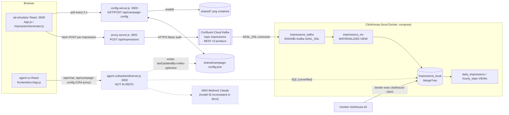

# Rokko (Ad Optimizer Agent): whole-project deep dive

> **Current execution policy:** [Start now or anytime, with no build cutoff](../../event/BUILD_AUTHORIZATION.md). The human reports that the event is already underway and public schedules are stale. Older start/deadline/duration advice below is superseded; historical timestamps and analytics windows remain evidence, not build gates.

> Round 1: [`analysis/clickhouse/rokko.md`](../archive/source-tree/analysis/clickhouse/rokko.md). This pass read every non-generated file in `repos/clickhouse/rokko` (all JS, CSS, SQL, shell, JSON configs, Markdown docs, compose file), parsed the committed `ad-simulator/proxy.log` (126,320 lines), and walked the full `git log --stat`. **[V]** = verified with file:line. **[I]** = inference. Secret values are redacted throughout.

## 1. At a glance

Rokko is a chat agent for brand advertisers ("Oreo Q3"). It asks for a campaign name and audience, reads impression analytics, re-weights the campaign's creative and audience mix, and re-checks on a timer. Nobody has real ad viewers at a hackathon, so a React simulator generates weighted-random impressions. They go through an Express proxy to **Confluent Cloud Kafka**, a **ClickHouse Kafka-engine table plus a materialized view** consumes them into MergeTree, and a shared JSON config file closes the loop back into the simulator. Pitch: "Automatically optimize your ad campaigns with AWS Bedrock, Confluent Cloud and ClickHouse!" Awards: **ClickHouse 1st place ("Most fun use of ClickHouse")** and **Best use of Confluent Cloud**, at the AWS MCP Enterprise Agents Challenge, SF, 25 Jul 2025. Solo build by Jason Kelly.

**Headline from this pass:** round 1 was right that the agent backend (`agent-ux/backend/server.js`) is **not in the repo**. That means every LLM call and every ClickHouse *read* by the agent is missing. New evidence in `proxy.log` shows the optimizer really did move traffic during the event (§8). It also shows the creative weighting the demo describes ("creative one to 94%") happened between 17:30 and 17:49 PDT, and that the Confluent key was revoked at 17:57 PDT.

## 2. Repo map

```
rokko/
├── README.md                 250  system doc (renamed from overview.md, + logo); architecture, config-file protocol, launch steps
├── overview.md               248  pre-rename copy of README (identical except logo line)
├── adsimulator.md             75  "V1 Implementation Plan" for the simulator (Claude Code planning doc)
├── agent-ux.md                95  agent UX implementation summary; describes the missing backend (Bedrock, Claude 3.5 Sonnet)
├── CLAUDE.md                  17  Claude Code instructions ("Don't start servers")
├── package-lock.json           6  empty root lockfile
├── rokko.png                      logo
├── shared/                        shared state between agent and simulator
│   ├── campaign-config.json   44  live config; last written by "rokko-optimizer" v26
│   └── c1-c5.png, c1/c8/c9.svg    creative images (c4, c5 added during the event)
├── ad-simulator/                  CRA React app + 2 Express servers + ClickHouse setup
│   ├── src/App.js            199  simulator state, 2 s config poll, interval generator
│   ├── src/ConfigPanel.js    218  weight editors (device, gender, browser, age, creatives)
│   ├── src/ImpressionGenerator.js 39  weighted-random impression factory
│   ├── src/ImpressionLogger.js 72  scrolling log with creative thumbnails
│   ├── src/KafkaPublisher.js  32  fetch POST to local proxy
│   ├── src/index.js, *.css   ~400  CRA boilerplate + styling
│   ├── proxy-server.js        96  Express :3001 → Confluent REST v3 produce
│   ├── secure-proxy-server.js 100  near-verbatim duplicate of proxy-server.js (only log lines differ)
│   ├── config-server.js      140  Express :3003, GET/POST shared config, atomic write, creative auto-detect
│   ├── setup-clickhouse.sql   77  DB, MergeTree, Kafka engine, MV, 2 views
│   ├── 9 × *kafka*/fix*.sql  287  iteration files re-creating impressions_kafka / impressions_mv
│   ├── setup.sh               49  docker-compose up + curl DDL
│   ├── monitor-clickhouse.sh  33  count/uniq/device-breakdown queries via docker exec
│   ├── rotate-credentials.sh  42  sed-replaces the Confluent key in proxy + SQL files
│   ├── docker-compose.yml     21  clickhouse/clickhouse-server:latest
│   ├── proxy.log         126,320  committed runtime log (6 MB), 6,016 impressions
│   └── public/shared/c1-c3.png    thumbnails served to the logger
└── agent-ux/
    ├── README.md              62  backend/frontend setup; two different model IDs
    ├── backend/.env.example    1  OPENAI_API_KEY placeholder; NO server code
    └── frontend/                  CRA React chat UI (proxy → :3002)
        ├── src/App.js        381  chat, config sidebar, delayed-prompt timers
        ├── src/App.css       439  styling (incl. styles for images inside agent messages)
        └── public/creatives/      c1-c5 png/svg (placeholder SVGs with the filename written on them)
```

**LOC (excluding lockfiles, `proxy.log`, images) [V]:** JS 1,297 · CSS 835 · SQL 364 · shell 124 · Markdown 836 · JSON 126 · YAML 21 · HTML 33 · SVG 158.

**Hand-written estimate [I]:** about **1,170 JS** (excluding the 100-line duplicate proxy and 22 lines of CRA `index.js`), about **110 unique SQL** (the 9 fix files are near-copies of the same two statements), and about 800 CSS. Roughly 2,100 lines of real code. Generated or template content: CRA scaffolding (`index.js`, `public/index.html`, `package.json` scripts and `eslintConfig`) and the planning `.md` docs, which read as Claude Code output (`CLAUDE.md:1-17`). The project's centrepiece, the agent backend, has **0 lines** in the repo.

## 3. System architecture

### Component diagram (as found in code; dashed = referenced but absent)



### Main demo flow (sequence)

```mermaid
sequenceDiagram
  actor U as Marketer
  participant SIM as Simulator (React)
  participant PX as proxy-server.js
  participant K as Confluent Kafka
  participant CH as ClickHouse (Kafka engine → MV → MergeTree)
  participant UI as Agent UI (React)
  participant BE as backend/server.js (missing)
  participant CFG as config-server + campaign-config.json

  U->>SIM: Start Simulation (testMode off)
  loop every 1000/ips ms (App.js:128-132)
    SIM->>PX: POST /api/impressions (KafkaPublisher.js:12)
    PX->>K: POST /kafka/v3/.../records {value:{type:JSON,data:"..."}} (proxy-server.js:49-62)
    K-->>CH: consumer pulls; MV parses JSON into impressions_local
  end
  UI->>U: "Hi, I'm Rokko! ... campaign name?" (hardcoded, App.js:175)
  U->>UI: "Oreo Q3" / "women 25-35"
  UI->>BE: POST /api/chat {message, conversationId, messageHistory} (App.js:204-208)
  BE-->>CH: query impressions (not in repo)
  BE-->>CFG: write weights, lastUpdatedBy=rokko-optimizer (inferred from campaign-config.json:41)
  BE->>UI: {message, campaignData, configUpdate, delayedPrompt}
  UI->>UI: render markdown, update sidebar, start countdown (App.js:210-232)
  loop every 2 s (App.js:101)
    SIM->>CFG: GET /api/campaign-config
    SIM->>SIM: restart generator with new weights (App.js:147-161)
  end
  Note over UI: countdown hits 0 (App.js:92-95)
  UI->>BE: POST /api/chat {isDelayedPrompt:true} (App.js:121-126)
  BE->>UI: follow-up report (+ maybe another delayedPrompt)
```

## 4. Component walkthrough

### 4.1 Ad simulator UI (`ad-simulator/src`)
- **`App.js`** keeps local default config (`:12-23`). It loads the shared config from `http://localhost:3003` (hardcoded host, `:37`) and merges `parameters` over local values (`:42-51`). It polls every 2 s (`:101-103`). Start creates a `setInterval` at `1000 / impressionsPerSecond` (`:128-132`). A second effect tears down and recreates the interval whenever `config.parameters` changes (`:147-161`). `CAMPAIGN_CONFIG_PATH` (`:9`) is dead code.
  - **Bug [V/I]:** each poll does `setConfig(prev => ({...prev, parameters: {...}}))` (`:42-51`), which creates a new `parameters` object every 2 s even when nothing changed. The restart effect therefore fires every 2 s. At 10 ips (the final config) this is harmless. At rates below 0.5 ips no impression would ever fire, because the interval is reset before it elapses.
  - Polling overwrites the user's local edits every 2 s, but the inputs are disabled while running anyway (`ConfigPanel.js:33,41,65`).
- **`ImpressionGenerator.js`** does a weighted pick by cumulative subtraction (`:9-21`) and produces **fresh random UUIDs for adId, campaignId and creativeId on every impression** (`:29-31`). `creativeName` is the only creative signal (`:32`).
- **`KafkaPublisher.js`** POSTs to `http://localhost:3001/api/impressions` (`:2`). Errors are logged and swallowed by the caller (`App.js:113-115`).
- **`ImpressionLogger.js`** shows the last 100 impressions (`App.js:109`) with a thumbnail from `/shared/<creativeName>` (`:8-10`). `public/shared` holds only c1–c3, so c4/c5 fall back to filename text (`:41-47`) **[V by file listing]**.
- **`ConfigPanel.js`** edits weights through a dotted-path setter. That setter shallow-copies only the top level, so nested objects are mutated in place (`:5-15`), which is a minor React anti-pattern. "Impression collector URL" from the plan (`adsimulator.md:17`) was never built.

### 4.2 Kafka proxy (`proxy-server.js`, duplicate `secure-proxy-server.js`)
- It reads `CONFLUENT_API_KEY/SECRET/KAFKA_CLUSTER_ID` from `.env` and exits if they are missing (`:10-19`). The broker host and topic are hardcoded in the URL (`:23`), so `KAFKA_BROKER` and `KAFKA_TOPIC` in `.env.example:8-9` are unused.
- It wraps the body as `{value:{type:'JSON', data: JSON.stringify(body)}}` (`:49-54`). That double encoding is the root cause of the 9 SQL fix files (§5).
- It logs the full payload twice per request (`:47,56`), which is how `proxy.log` became 126k lines. `/health` leaks the first 4 key characters (`:40`).
- **Correction to round 1:** round 1 implied the base64 credential lived in `proxy-server.js`. The committed proxy reads the key from env. The base64 credential sits in `rotate-credentials.sh:19`, which `sed`s it into the proxy (`:27-30`), so an *earlier* proxy version had it hardcoded **[I]**.

### 4.3 Config server (`config-server.js`)
- It reads and writes `../shared/campaign-config.json` (`:10`). `syncCreativeFiles` (`:45-73`) scans `shared/` for images, keeps existing weights, and gives new files 10 (or an equal share if there were none). That is how the agent "adds a creative to rotation": drop a PNG and the next GET picks it up.
- `writeConfigFile` (`:76-94`) writes a temp file, renames it, and bumps `version`. A GET can itself write the file if the set of creatives changed (`:103-105`).
- POST stamps `lastUpdatedBy: 'ad-simulator'` (`:119`). The committed config says `rokko-optimizer` (`shared/campaign-config.json:41`), so the missing backend wrote the file directly (or through its own endpoint), not through this server **[V/I]**.

### 4.4 ClickHouse (`setup-clickhouse.sql`, fix files, compose, scripts)
See §5. Runtime is `clickhouse/clickhouse-server:latest` locally (`docker-compose.yml:5`), with a hardcoded password (`:15`).
- **Setup path inconsistencies [V/I]:**
  - `setup.sh:32` curls the whole multi-statement file to the HTTP interface with no password, while compose sets one. The ClickHouse HTTP interface also runs one statement per request, so this path most likely failed **[I]**.
  - The README path (`README.md:182-193`) uses `docker run` with no password and `clickhouse-client --multiquery`, and is the one that works.
  - `monitor-clickhouse.sh:34` advertises an `auto-monitor.sh` that does not exist.

### 4.5 Agent chat UI (`agent-ux/frontend/src/App.js`)
- The greeting is hardcoded client-side (`:173-177`).
- `sendMessage` posts `{message, conversationId, messageHistory}` (`:204-208`). The response contract is `{message, campaignData, configUpdate, delayedPrompt:{id, delaySeconds, prompt, description}}` (`:210-232`).
- **The "background monitoring" is the agent scheduling its own follow-up.** The backend returns `delayedPrompt`, the browser counts down with a progress bar (`DelayedPromptTimer`, `:8-44`; `scheduleDelayedPrompt`, `:60-99`), then re-POSTs the stored prompt with `isDelayedPrompt: true` (`:121-126`). That response can schedule another one (`:148-151`), which gives a self-perpetuating loop. If the tab is closed, the loop dies.
- **Bug [V/I]:** `executeDelayedPrompt` reads `delayedPrompts` from a stale closure (`:102`). It only works because `new Map(prev.set(...))` (`:75`) **mutates the existing Map in place** before copying, so the stale reference still sees the entry. `messageHistory: messages` (`:124`) is also the stale history from scheduling time.
- Sidebar: Campaign Data JSON (`:338-344`), Campaign Config summary including `targetAudience` (`:352-361`; this field is not in the committed config, so the backend added it), and an "Artifacts" placeholder (`:368-374`).
- **New finding:** `App.css:149-160` styles `.message-text img` and `.message-text table img`. The agent replies therefore embedded creative thumbnails, and `public/creatives/c1-c5` exist to serve them. That backs the Devpost "creative thumbnails and metrics in tables" claim. However, `react-markdown` v10 (`package.json:10`) renders GFM tables only with `remark-gfm`, which is not a dependency. Tables most likely rendered as raw pipes while images rendered inline **[I]**.
- `package.json:37` proxies to `:3002`. `agent-ux/README.md:57` says the UI is on `:8002`, and the root README says `:3001`, which collides with the Kafka proxy (`README.md:229` vs `proxy-server.js:7`).

### 4.6 Agent backend (`agent-ux/backend/`): missing
Only `.env.example` exists, containing `OPENAI_API_KEY=your_openai_api_key_here` (`:1`). The docs describe an "Express server that handles CORS and proxies requests to AWS Bedrock … In-memory storage of conversation history per session … Extracts campaign data as JSON from Claude's responses" (`agent-ux.md:14-18`). The frontend contract in §4.5 is the best reconstruction available.

### 4.7 Infra, CI, tests
- One `docker-compose.yml` (ClickHouse only). There is no Dockerfile for any Node service, no CI, and no deploy config.
- **There are no tests.** `@testing-library/*` is installed (`ad-simulator/package.json:6-8`) but no test files exist.

## 5. Data model

### ClickHouse (`ad_analytics` database) [V]

| Object | Definition | Notes |
|---|---|---|
| `impressions_local` | MergeTree, `PARTITION BY partition_date`, `ORDER BY (campaign_id, timestamp, ad_id)`, LowCardinality dims, `partition_date MATERIALIZED toDate(timestamp)`, `ingestion_time DEFAULT now()` (`setup-clickhouse.sql:6-21`) | UUID IDs. The String-ID variant is in `impressions-table-strings.sql:4-19`. **No `creative_name`, no clicks.** |
| `impressions_kafka` | `ENGINE = Kafka()`, single `raw_message String`, SASL_SSL/PLAIN to Confluent (`setup-clickhouse.sql:24-36`) | Format moved through JSONAsString → RawBLOB, with 6 consumer-group names across files |
| `impressions_mv` | `TO impressions_local`, JSONExtract parse (`setup-clickhouse.sql:39-52`) | Final working parse: `JSONExtract(raw_message,'String')` to unwrap the string-encoded JSON (`update-kafka-credentials.sql:24`) |
| `daily_impressions` | plain VIEW, count/uniq by date×device×location×browser×gender (`:55-66`) | Not materialized |
| `hourly_stats` | plain VIEW, `toStartOfHour`, uniq, avg(age) (`:68-77`) | Not materialized |

The fix-file trail, in order of evidence: UUID plus nested `value.data` path (`setup`, `kafka-confluent-cloud`, `fix-kafka-*`), then RawBLOB plus new group (`kafka-fixed-format`, `kafka-fresh-consumer`), then unwrap the string (`kafka-fixed-parsing`), then pad strings into UUIDs (`kafka-final-fix.sql:7-9`), then String IDs (`impressions-table-strings`, `kafka-new-credentials`, `update-kafka-credentials`). Two of the files use the literal `'${CONFLUENT_API_KEY}'` (`kafka-new-credentials.sql:15`, `update-kafka-credentials.sql:19`). ClickHouse does not expand that, so the README tells users to hand-edit it (`README.md:191-193`).

### Shared config (`shared/campaign-config.json`)
`campaignName, impressionsPerSecond, testMode, parameters{deviceType, location, browser, gender, age{min,max}, creatives{file: weight}}, lastUpdatedBy, lastUpdated, version`. The backend also writes `targetAudience` (implied by `agent-ux/frontend/src/App.js:356`).

### HTTP endpoints

| Method | Path | Handler | Purpose |
|---|---|---|---|
| GET | `/health` | `ad-simulator/proxy-server.js:35` | status plus key preview |
| POST | `/api/impressions` | `ad-simulator/proxy-server.js:45` | wrap and forward to Confluent REST v3 |
| GET | `/api/campaign-config` | `ad-simulator/config-server.js:97` | read config, sync creatives (may write) |
| POST | `/api/campaign-config` | `ad-simulator/config-server.js:115` | overwrite config, version++ |
| POST | `/api/chat` | **missing** backend (called at `agent-ux/frontend/src/App.js:121,204`) | LLM turn, analysis, config update, delayedPrompt |
| GET | `/api/campaign-config` | **missing** backend on :3002 (called at `agent-ux/frontend/src/App.js:181`) | config for sidebar |

### Env vars
- **Simulator:** `CONFLUENT_API_KEY`, `CONFLUENT_API_SECRET`, `KAFKA_CLUSTER_ID` (used, `proxy-server.js:10-12`). `KAFKA_BROKER` and `KAFKA_TOPIC` are listed but unused (`.env.example:8-9`).
- **Compose:** `CLICKHOUSE_DB`, `CLICKHOUSE_USER`, `CLICKHOUSE_PASSWORD` (`docker-compose.yml:13-15`).
- **Backend (docs only):** `AWS_REGION`, `PORT=3002`, `ANTHROPIC_MODEL` (`agent-ux/README.md:28-30`). `.env.example` has `OPENAI_API_KEY` (`agent-ux/backend/.env.example:1`).

## 6. AI / agent design

- **No model call exists in the repo [V].** The repo has no Bedrock SDK, no `@anthropic-ai`, no `openai` dependency, and no prompt. Both `package.json` files contain only React, Express, axios and markdown libraries.
- **Claimed models (three, mutually inconsistent) [V]:**
  - `anthropic.claude-3-5-sonnet-20241022-v2:0` (`agent-ux.md:16`, `agent-ux/README.md:63`)
  - `us.anthropic.claude-sonnet-4-20250514-v1:0` (`agent-ux/README.md:30`)
  - the env template asks for `OPENAI_API_KEY` (`agent-ux/backend/.env.example:1`)

  **[I]** The demo-day backend was probably Bedrock Claude, given the Devpost tag and the README, but this cannot be verified.
- **What the design must have been, from the frontend contract [I]:** a single-agent, stateless-per-request Express handler. The client sends the whole `messageHistory` each turn (`App.js:207`). The documented design keeps in-memory history per `conversationId` (`agent-ux.md:17`). The agent does structured extraction to `campaignData` (`agent-ux.md:35-45`, `status: "setup_complete"`), writes the config, and returns a **self-scheduled follow-up** (`delayedPrompt`). Tool use (ClickHouse SQL, config write) is either function calling or hardcoded server logic; this cannot be determined.
- **Memory:** in-memory server-side (claimed) plus client-sent history. Nothing is persisted. The only durable record of agent actions is `version` and `lastUpdatedBy` in the config file.
- **Orchestration:** none beyond the browser countdown loop. Temporal is docs-only (`agent-ux.md:62-74`, `README.md:116,124-127`).

## 7. All integrations

| Service | Usage (file:line) | Depth |
|---|---|---|
| **ClickHouse** (sponsor) | Kafka engine plus MV plus MergeTree (`setup-clickhouse.sql:6-52`); 2 plain views; ops queries (`monitor-clickhouse.sh:15-30`); agent reads are missing | **Load-bearing for ingestion; core-to-the-pitch in narrative**; decision queries unverifiable |
| **Confluent Cloud Kafka** (sponsor, also won) | REST v3 produce (`proxy-server.js:22-28,58-62`); native consumer from ClickHouse (`setup-clickhouse.sql:24-36`); 5,906 HTTP 200 produces in `proxy.log` | **Load-bearing** |
| **AWS Bedrock / Claude** (sponsor) | docs only (`agent-ux.md:14-18`, `agent-ux/README.md:26-63`) | **Missing from repo** (claimed core) |
| Temporal | docs only | **Not built** |
| MCP (event theme) | none | **Not built** |
| Docker | ClickHouse compose (`docker-compose.yml`) | thin |
| Claude Code (dev tool) | `CLAUDE.md` | build-time only |

## 8. Real vs. mock map

| Feature / claim | Status | Evidence |
|---|---|---|
| Simulated impressions with configurable weights | **Real** (synthetic by design, disclosed in demo) | `ImpressionGenerator.js:27-40` |
| Stream to Confluent Kafka | **Real** | `proxy-server.js:45-91`; `proxy.log`: 6,016 received, 5,906 200s, 102 401s, 8 429s |
| ClickHouse consumes Kafka natively | **Real** (DDL); final applied variant unknown | `setup-clickhouse.sql:24-52`, fix files |
| Per-creative / per-campaign analytics in ClickHouse | **Missing / broken** | random UUIDs per impression (`ImpressionGenerator.js:29-31`); no `creative_name` column |
| "Creative 1 has the highest click-through rate" (demo 01:07-01:20) | **Hardcoded or LLM-invented [I]** | no click events exist anywhere; schema has no CTR input |
| Agent applies config changes to the live campaign | **Real (indirect)** | `campaign-config.json:41-43` (`rokko-optimizer`, v26). **New: `proxy.log` creative share for c1 by 10-minute bucket (PDT): 17:10 ≈ 53% (of creative-tagged), 17:20 ≈ 70%, 17:30 ≈ 86%, 17:40 ≈ 95%, then 17:50 back to ≈ 29% (reset).** This matches the "set creative one to 94%" narration **[V log / I attribution]** |
| Audience targeting changes | **Real (indirect) [I]** | 17:00-17:09 PDT the stream is 69% female (867/1,250), versus 43% at 12:00-13:00 PDT and the 45% default (`App.js:20`), consistent with a "women" targeting change |
| Background agent "continuing to pull results" | **Partially real**: browser `setTimeout` loop, not a server job | `agent-ux/frontend/src/App.js:60-164` |
| New AI-generated creatives added to rotation | **Plumbing real, generation missing** | auto-detect in `config-server.js:29-73`; c4/c5 present; Devpost admits concepts only |
| Dashboard with thumbnails and metric tables | **Partially real** | image CSS in agent messages (`App.css:149-160`); tables likely unrendered (no remark-gfm); Artifacts panel is a placeholder (`App.js:368-374`) |
| Bedrock Claude agent | **Missing from repo** | backend absent; three different model claims |
| Temporal workflows | **Missing** | docs only |
| MCP | **Missing** | none |
| Committed final config equals demo state | **No** | committed config is `gender male 70`, `age 35-45`, `c5.png` heaviest (`campaign-config.json:24-38`), so the config kept changing until 19:47 PDT, two hours after the last logged impression |

No silent fake fallbacks exist in the published code. Failures surface as "Sorry, I encountered an error" (`App.js:155-160, 235-240`) or as console errors.

## 9. Demo path trace (video `-NTsy-OQp00`, 2:47; transcript timings from round 1)

| Time | On screen | Code that runs |
|---|---|---|
| 00:00-00:14 | Pitch, three sponsors named | none |
| 00:14-00:35 | Simulator started, "firehose" | `App.js:119-136` → `KafkaPublisher.js:8-33` → `proxy-server.js:45-91` → Confluent → `impressions_kafka` → `impressions_mv` |
| 00:35-01:05 | Rokko greets, asks name and audience | greeting hardcoded `agent-ux/.../App.js:175`; replies come from missing `/api/chat` |
| 01:07-01:20 | "queried ClickHouse … creative one highest CTR" | missing backend; the published schema cannot compute CTR (§8) |
| 01:23-01:44 | about 18 s wait for the LLM | `isLoading` typing indicator `App.js:285-298` |
| 01:44-01:57 | "full report … pulling results every few minutes" | `delayedPrompt` → `DelayedPromptTimer` countdown `App.js:8-44,60-99` |
| 01:59-02:16 | "set creative one to 94%" | backend writes `campaign-config.json` → simulator 2 s poll `App.js:101` → interval restart `:147-161`; visible in `proxy.log` 17:30-17:49 PDT |
| 02:18-02:47 | recap, ends mid-sentence | none |

## 10. Code quality and security review

**Quality.** Small, readable, untyped JS (no TypeScript, no PropTypes). Most error handling is console logging. There are no tests and no CI. There is heavy duplication: two proxies, 9 SQL variants, and `overview.md` duplicating `README.md`. A 6 MB log is committed. Doc drift is visible in three model IDs, three ports for the agent UI, a nonexistent `auto-monitor.sh`, and a README impression table that says "query string parameter on the URL" (`README.md:54`) while the code POSTs JSON. Two React stale-closure bugs exist (§4.1, §4.5). Readability is fine for a hackathon.

**Security (what a cyberdefense judge would flag) [V]:**
1. **Committed live cloud credentials.**
   - A Confluent API key and secret are hardcoded in **6 of 8** Kafka DDL files: `setup-clickhouse.sql:35-36`, `kafka-confluent-cloud.sql:15-16`, `fix-kafka-simple.sql:15-16`, `fix-kafka-table.sql:15-16`, `kafka-fixed-format.sql:15-16`, `kafka-fresh-consumer.sql:15-16`.
   - `rotate-credentials.sh:14-15,19` holds the old key, the old secret, **and their base64 Basic-auth encoding**.
   - The ClickHouse password is in `docker-compose.yml:15` and `monitor-clickhouse.sh:8`.
   - The cluster ID and bootstrap host are in `.env.example:7-8`.
   - The rotation script exists because the key had leaked, and `proxy.log` shows 401s starting 17:57:03 PDT, which looks like revocation. The old secret nonetheless remains in git history. *(Values deliberately not reproduced.)*
2. **Open relay with the team's Kafka credentials.** `proxy-server.js:31` calls `app.use(cors())`, which allows any origin. `/api/impressions` has no auth and no schema validation, so any web page the operator visits can produce arbitrary messages into the Confluent topic.
3. **Unauthenticated config write with CORS `*`.** `config-server.js:14,115-128` lets any origin overwrite the campaign config, and therefore the agent-controlled "live campaign". This is a cross-site write to localhost (DNS-rebinding and CSRF class).
4. **Secret prefix disclosure:** `/health` returns the first 4 characters of the API key (`proxy-server.js:40`).
5. **PII-shaped data logged verbatim** (gender, age, location) to stdout and a committed file (`proxy-server.js:47,56`).
6. **LLM output rendering:** `react-markdown` without `rehype-raw` is safe from HTML injection, but agent-supplied image URLs are fetched by the browser (`App.js:274`). This is low risk.
7. **No string-built SQL from user input** in the published code. The shell `query()` helper takes only fixed strings (`monitor-clickhouse.sh:7-9`). The missing backend's SQL construction cannot be audited.

## 11. Build history

| Commit | Author | Time (PDT) | Size | Content |
|---|---|---|---|---|
| b62c3be | Jason Kelly | 2025-07-25 22:33 | 70 files, +168,538 | "Refreshing the repo": the entire codebase, `proxy.log`, lockfiles, images |
| 6effa3f | Jason Kelly | 2025-07-25 22:40 | 1 file, +118/−23 | overview.md documentation |
| 92da751 | Jason Kelly | 2025-07-26 06:55 | 2 files, +6/−1 | README update |
| 2dc2373 | Jason Kelly | 2025-07-26 06:57 | 1 file, +250 | rename overview.md → README.md, logo |
| 9917a51 | Jason Kelly | 2025-07-26 06:59 | 1 file, +2/−2 | move image |

- **Grouped by hour:** 22:00 PDT (2 commits: everything plus docs), 06:00 next morning (3 doc commits, post-deadline). There is **1 author** and 5 commits, and **zero code changes after the squash**.
- **Before the event:** nothing in git. The squash erased history, so prebuilt work cannot be ruled out, but the runtime log supports a same-day build **[I]**.
- **Runtime timeline from `proxy.log` (PDT, event day):**
  - 11:53: first hand test (`adId: "test-123"`).
  - 12:55: the first real generator impressions; 242 between 12:00 and 13:00.
  - 13:00 to 17:00: a 3.5-hour gap with almost no traffic (8 impressions). **[I]** This was spent on the agent backend and SQL fixing.
  - 17:00 to 17:57: the main run of about 5,700 impressions. `creativeName` first appears around 17:10, so the creatives feature landed late. The optimizer re-weighting happened 17:20-17:49. Key revocation (401s) came at 17:57.
  - Devpost was created 17:44 PDT (round 1). The config was last written at 19:47 PDT.
- **Final hour vs post-deadline:** the code was committed at 22:33, after judging (**[I]**: the demo video was uploaded 26 Jul). Post-deadline commits are documentation only.

## 12. How hard was this to build?

**Published part: easy.** It is about 1,200 JS lines of CRA plus Express plus about 110 unique SQL. A skilled builder with an AI coding assistant could reproduce the simulator, proxy, config server, chat UI and ClickHouse DDL in **2–3 hours**. The missing backend (an Express Bedrock call, a few ClickHouse queries, a JSON config write, and a `delayedPrompt` field) is perhaps **200–400 lines and 1.5–2 hours [I]**. **Whole system in 5.5 h: yes, comfortably**, which is consistent with a solo same-day build.

**The hard parts** (and where the solo builder spent the day, judging by the artifacts):
1. The **Confluent REST v3 envelope × ClickHouse Kafka-engine format** mismatch. It took 9 DDL iterations to discover that the message value is a JSON *string* that must be unwrapped with `JSONExtract(raw_message,'String')`.
2. UUID typing failures on test data, solved by moving to String IDs.
3. Credential management mid-event, which produced the rotation script.
4. Making the closed loop visible: a file-based config with version polling, so the agent's action shows up in the generator within 2 s.

## 13. Reusable patterns and code

1. **Kafka engine → MV → MergeTree, with the string-unwrap fix.** If you produce through Confluent REST v3 with `type: JSON` and a stringified payload, parse it like this (`ad-simulator/update-kafka-credentials.sql:23-36`):
   ```sql
   CREATE MATERIALIZED VIEW impressions_mv TO impressions_local AS
   WITH JSONExtract(raw_message, 'String') as clean_json
   SELECT JSONExtractString(clean_json, 'adId') as ad_id, ...
   FROM impressions_kafka
   WHERE clean_json != '' AND clean_json != 'null' AND JSONExtractString(clean_json, 'adId') != '';
   ```
   For Cyberdefense, this becomes a security-event firehose (auth logs, WAF hits) landing in ClickHouse with zero client-side insert code. **Better still:** produce a raw JSON object (`type: "JSON", data: <object>`) and use `kafka_format = 'JSONEachRow'`, which avoids the unwrap entirely.
2. **Agent-controlled simulator through a versioned shared state** (`config-server.js:76-94`): temp-file plus rename, `version++`, `lastUpdatedBy`. The simulator polls and hot-applies it (`App.js:101,147-161`). Swap "creative weights" for "blocked IPs / rate limits" and the defensive action visibly changes the next ClickHouse query.
3. **Self-scheduled follow-up (`delayedPrompt`)** (`agent-ux/frontend/src/App.js:60-99,148-151`): the agent returns `{delayedPrompt:{id, delaySeconds, prompt, description}}` and the UI shows a countdown, then re-invokes the agent. It is cheap and demo-visible ("re-checking in 1:30"). For a real entry, run it server-side (cron or a Guild session) and keep the countdown purely as UI.
4. **Drop-a-file auto-registration** (`config-server.js:29-73`): new artifacts in a directory appear in the agent's action space automatically. This is useful for "new Semgrep rule file appears, gets added to the scan set".
5. **Weighted synthetic event generator** (`ImpressionGenerator.js:9-21`): a 10-line weighted pick for attack-traffic simulation.

**Avoid:**
- Random IDs per event. Use stable entity keys (user, IP, host) that lead the `ORDER BY`.
- Leaving the dimension the agent reasons about out of the table.
- Committing credentials and logs. A security judge will grep for them.
- CORS `*` on state-mutating localhost endpoints.
- Shipping without the agent code.
- Browser-only "background" loops.
- Three conflicting model IDs in the docs.
