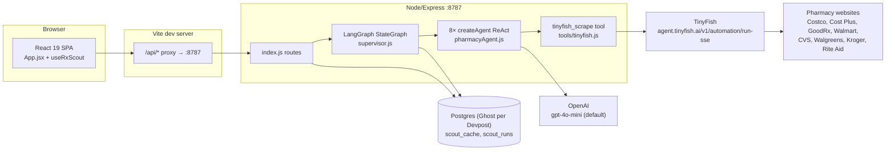
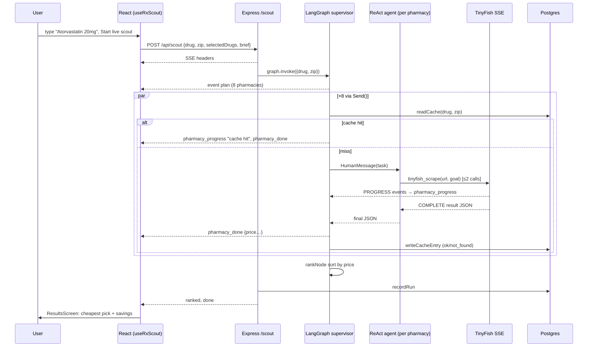

# RxScout: whole-project deep dive

Round 1: [`analysis/guild-ai/rxscout.md`](../archive/source-tree/analysis/guild-ai/rxscout.md). Repo: `repos/guild-ai/rxscout` (https://github.com/bvsbharat/RxScot1). There is 1 commit, `a6ffb56`, at 13:14 PT on 24 Apr 2026. Every source file was read (27 tracked text files).

## 1. At a glance

RxScout is a consumer price-comparison agent for prescription drugs. You type a medication and it fans out one LLM agent per pharmacy (8 chains) to scrape the cash price live through TinyFish's browser-automation API. Progress streams to a React UI, and the result ranks the cheapest option. Hook: "Same pill. 100× price difference." It won **Winner – Most Innovative Use of Guild.ai Platform** at Ship to Prod (24 Apr 2026), rank unpublished, and that was its only award.

**The submitted repo contains no Guild code at all** (round 1 verified this exhaustively). It is a LangGraph + LangChain + OpenAI build. This deep dive confirms that and documents the rest of the system.

## 2. Repo map

```
RxScot1/
├── .gitignore                 ignores .env, .claude/, .mcp.json, and "hello-agent/  # Unrelated nested project"
├── server/                    Node orchestrator (ESM, no TS)
│   ├── package.json           @langchain/{core,langgraph,openai}, langchain, express, cors, pg, zod
│   ├── .env.example           TINYFISH_API_KEY, OPENAI_API_KEY, OPENAI_MODEL=gpt-4o-mini, PORT, DATABASE_URL, CACHE_TTL_MINUTES
│   └── src/
│       ├── index.js           Express: /health, /history, /history/:id, POST /scout (SSE)
│       ├── graph/supervisor.js LangGraph StateGraph: plan → Send×8 → scout_pharmacy → rank
│       ├── agents/pharmacyAgent.js  ChatOpenAI + langchain createAgent (ReAct), system prompt
│       ├── tools/tinyfish.js  LangChain tool wrapping TinyFish run-sse endpoint
│       ├── pharmacies.js      8 pharmacies: start-URL builders + per-site hints
│       └── db.js              pg Pool: scout_cache (TTL) + scout_runs (history)
└── rxscout/                   Vite + React 19 client (create-vite template base)
    ├── index.html             preloader splash + Google Font + inline removal script
    ├── vite.config.js         dev proxy /api → :8787
    ├── README.md              UNCHANGED create-vite template README
    ├── eslint.config.js       template
    ├── public/                bg.png (6.2 MB), favicon, tinyfish logo, empty file "l"
    └── src/
        ├── main.jsx           template entry
        ├── App.jsx            phase switch idle/running/done
        ├── hooks/useRxScout.js fetch-based SSE client → per-pharmacy rows
        ├── components/SearchScreen.jsx   prescription textarea, chips, fake attachment, ZIP
        ├── components/ProcessScreen.jsx  8 live pharmacy cards
        ├── components/ResultsScreen.jsx  cheapest pick, savings, ranked list
        ├── components/HistoryPanel.jsx   past runs from DB, replay
        ├── index.css          963 lines of hand-styled "glass" UI
        └── App.css            1 line
```

**Lines of code** (lockfiles and binaries excluded):

| Bucket | Lines |
|---|---|
| Server JS | 772 (`supervisor.js` 264, `db.js` 131, `tinyfish.js` 117, `index.js` 113, `pharmacies.js` 80, `pharmacyAgent.js` 67) |
| Client JS/JSX | 814 (of which `main.jsx` 10 is template) |
| CSS | 964 |
| HTML | 114 |
| Config/template (`eslint`, `vite`, `package.json`, `README`) | about 100 |

**Hand-written total is about 2.6k lines**, of which about 1.6k is logic and 1k is CSS. The commit trailer is `Co-Authored-By: Claude Opus 4.7 (1M context)`, so the code is agent-generated.

## 3. System architecture

### Component diagram



### Sequence: demo flow



## 4. Component walkthrough

**HTTP server.** `server/src/index.js`:
- `:8-13` warns if keys are missing.
- `:16` is `app.use(cors())`, which allows all origins.
- `:32-43` are the history routes. They validate that `id` is numeric (`:38-39`).
- `:45-109` is `POST /scout`. It requires a `drug` string, opens SSE manually (`:52-58`), sends a heartbeat comment every 15 s (`:66-68`), and tracks client disconnect via `res.on('close')`. A comment at `:71-73` correctly notes that `req.on('close')` is the wrong event.
- It builds the graph with an `onEvent` callback that writes SSE frames (`:80-85`), runs `graph.invoke`, computes `cacheHit` as "every result cached" (`:89`), persists via `recordRun`, then sends `ranked` and `done`.
- A disconnect only silences writes. The graph and its TinyFish runs keep going (`:82`, `if (closed) return`).

**Supervisor graph.** `server/src/graph/supervisor.js`:
- `ResultSchema` (`:27-41`) and a `StateSchema` whose `results` is a `ReducedValue` appending each parallel node's output (`:43-51`). This is the correct LangGraph pattern for fan-in from `Send`.
- `planNode` is a pass-through (`:57-61`). The conditional edge emits a `plan` event and returns 8 `Send('scout_pharmacy', {drug, zip, __pharmacyId})` (`:242-259`).
- `scoutPharmacy` (`:77-156`):
  - Checks the cache first (`:91-101`).
  - Otherwise builds a fresh agent per pharmacy with an `onProgress` closure (`:103-108`) and invokes it with `recursionLimit: 12` (`:111-120`).
  - Takes the last message, extracts the first balanced `{…}` (`extractJson` `:178-199`) and maps it to `ok` / `not_found` / `error` (`toResult` `:201-228`).
  - Caches `ok` and `not_found` only (`:132-139`).
  - Errors become `status: 'error'` rows, so one failing site never fails the graph (`:141-154`).
- `rankNode` puts `ok` rows first, sorted by price (`:63-73`).

**Agent.** `server/src/agents/pharmacyAgent.js`:
- `ChatOpenAI` with `temperature 0`, `maxTokens 1024`, model `OPENAI_MODEL ?? 'gpt-4o-mini'` (`:42-46`).
- Built with `createAgent({model, tools:[tinyfish], systemPrompt})` (`:50-54`).
- The user task is pharmacy name, drug, ZIP, suggested start URL and per-site hint (`:57-67`).
- The "max 2 tool calls" limit is only a prompt instruction (`:22`). Enforcement is the recursion limit of 12.

**Tool.** `server/src/tools/tinyfish.js`:
- POSTs `{url, goal}` to `https://agent.tinyfish.ai/v1/automation/run-sse` with `X-API-Key` (`:14-31`).
- Hand-parses the SSE stream (`:38-72`), forwarding `PROGRESS.purpose`, `STARTED` and `STREAMING_URL` as human-readable progress. It treats `COMPLETE`/`COMPLETED` with status `FAILED`/`ERROR` as failure.
- Returns the JSON result stringified for the LLM (`:79`).
- The schema allows **any URL** (`z.string().url()`, `:90-93`).
- The key is read at tool-construction time. A missing key throws inside `buildPharmacyAgent`, and that error is caught per pharmacy.

**Pharmacy catalog.** `server/src/pharmacies.js:5-80` holds 8 entries with `startUrl(drug, zip)` builders, each using `encodeURIComponent`, plus natural-language hints such as "Extract the NON-MEMBER cash price" (`:42`) or the Walmart $4 program (`:33`).

**Persistence.** `server/src/db.js`:
- Lazy `pg.Pool` with `ssl: { rejectUnauthorized: false }` (`:16-20`).
- Every function swallows errors and returns an empty result (`:47-50`, `:66-68`).
- `readCache` (`:36-51`), `writeCacheEntry` upsert with TTL interval (`:53-69`), `recordRun` (`:71-96`), `listRuns` (`:98-114`) and `getRun` (`:116-131`).
- All queries are parameterized.
- **No DDL in the repo**: the tables must be created by hand.

**Client.**
- `useRxScout.js:34-121` uses POST + `ReadableStream` SSE parsing (needed because EventSource can't POST) and projects events into rows. Cancel aborts the fetch only (`:123-126`).
- `SearchScreen.jsx`:
  - The textarea is split on newline/comma/semicolon into up to 5 "drugs" (`:182-190`), but **only `drugs[0]` is scouted** (`:46-47`).
  - "Add image" stores the **file name only** (`:121-126`).
  - The "TinyFish active · Discovering · Shortlisting · Preparing live scout" panel is static text shown whenever the textarea is non-empty (`:166-174`).
  - The stat "67,000+ US pharmacies ready to compare" is a literal (`:79-86`).
- `ProcessScreen.jsx` shows live cards with stage text. `ResultsScreen.jsx:28-33` computes best/worst savings and percentage. `HistoryPanel.jsx` lists runs and offers "Re-run".

**Infra/tests.** There is no Dockerfile, deploy config, CI or tests. Run locally with `node --env-file=.env` (`server/package.json:8-9`) and the Vite dev proxy (`vite.config.js:9-17`).

## 5. Data model

**Tables** (inferred from queries in `db.js`; no schema file):
- `scout_cache(drug_key text, zip text, pharmacy_id text, payload jsonb, expires_at timestamptz, created_at timestamptz, UNIQUE(drug_key, zip, pharmacy_id))`. The `ON CONFLICT` target is at `db.js:60`.
- `scout_runs(id serial, drug, zip, selected jsonb, brief, cache_hit bool, best_price numeric, best_pharmacy, ranked jsonb, created_at)`. See `db.js:77-79`, `103`, `121`.

**Routes:**

| Method | Path | Handler | Purpose |
|---|---|---|---|
| GET | `/health` | `index.js:19` | liveness |
| GET | `/history` | `index.js:32` | last 25 runs, all users |
| GET | `/history/:id` | `index.js:37` | one run with ranked list |
| POST | `/scout` | `index.js:45` | SSE: `plan`, `pharmacy_started`, `pharmacy_progress`, `pharmacy_done`, `ranked`, `done`, `error` |

**Env:**
- `server/.env.example`: `TINYFISH_API_KEY`, `OPENAI_API_KEY`, `OPENAI_MODEL`, `PORT`, `DATABASE_URL`, `CACHE_TTL_MINUTES`.
- Also read: `TINYFISH_URL` (`tinyfish.js:15`) and `RXSCOUT_API` (`vite.config.js:12`).

## 6. AI / agent design

- **Model:** OpenAI via `@langchain/openai`, default `gpt-4o-mini` (`pharmacyAgent.js:43`, `.env.example:3`). The Devpost "built with" lists `openai-gpt-4o-mini`, which matches. The Devpost also claims "rx-ocr agent (GPT-4o-mini via Guild)", but that does not exist.
- **System prompt** (`pharmacyAgent.js:15-39`, trimmed):
  > You are a prescription price scout. You scrape ONE pharmacy website and return the cheapest available price for a specific drug. You have one tool: tinyfish_scrape… 1. Call tinyfish_scrape with the start URL and a goal that names the drug, strength, and the exact JSON shape… 3. …you may call tinyfish_scrape ONE more time… do not exceed 2 tool calls total. Always return ONLY a single JSON object… `{found, pharmacy, drug, price, price_label, quantity, notes, url}`… If no price could be found, return: `{"found": false, "pharmacy": "<name>", "reason": "<short reason>"}`.
- **Tool:** `tinyfish_scrape(url, goal)`. A second LLM (TinyFish's own browser agent) interprets `goal`, so this is an **LLM writing instructions for another agent**.
- **Orchestration:** a supervisor/fan-out graph (LangGraph `Send` map-reduce) with ReAct workers. There is no inter-agent communication and no supervisor LLM. `plan` and `rank` are deterministic.
- **Output parsing:** first-balanced-brace JSON extraction, then manual type checks. Zod is used only for graph state, not for the LLM output.
- **Retries:** an LLM-driven second attempt only. There are no HTTP retries or timeouts on TinyFish (the fetch has no `AbortSignal`).
- **Memory:** a Postgres result cache keyed by (drug, zip, pharmacy) with a TTL. This is the only "memory".
- **Guild:** **none**. The Devpost describes `server/agents/pharmacy-scout`, `rx-ocr`, `rx-parser`, run via `guild agent chat --ephemeral --mode json`, a `looksLikeInputEcho()` guard and `experimental-fetch` with `guildTools`. None of it is in the repo. The only adjacent trace is `.gitignore:` `hello-agent/  # Unrelated nested project`. That is an ignored nested project directory, possibly a scaffolded agent, which **[I, weak]** hints that agent projects existed locally and were deliberately not committed.

## 7. All integrations

| Service | Where | Usage | Depth |
|---|---|---|---|
| **Guild.ai** (judged prize) | — | absent from code | none (claimed core) |
| TinyFish | `server/src/tools/tinyfish.js:14-102` | every price comes from a TinyFish browser run | core-to-the-pitch |
| OpenAI | `pharmacyAgent.js:42-54` | gpt-4o-mini ReAct agent per pharmacy | load-bearing |
| LangGraph / LangChain | `supervisor.js`, `pharmacyAgent.js` | fan-out graph, agent loop, tool wrapper | load-bearing |
| Ghost (Postgres) | `db.js` (generic `pg` + `DATABASE_URL`) | cache and history; nothing Ghost-specific (no forks, no CLI) | thin (any Postgres) |
| Chainguard, InsForge (Devpost tags) | — | absent | none |

## 8. Real vs. mock map

| Feature / claim | Status | Evidence |
|---|---|---|
| Live prices from 8 pharmacies in parallel | real (depends on TinyFish success per site) | `supervisor.js:242-259`, `tinyfish.js:23-79` |
| Streaming per-pharmacy progress | real (TinyFish PROGRESS → SSE) | `tinyfish.js:56-61`, `index.js:80-85` |
| Cheapest pick + savings % | real arithmetic on extracted prices | `ResultsScreen.jsx:28-33` |
| Price accuracy / verification | **missing**: whatever the LLM returns is trusted; quantity/strength not normalized across sites | `supervisor.js:215-227` |
| Cache with 60-min TTL | real | `db.js:36-69`, `supervisor.js:91-101` |
| Search history + replay | real (global, not per-user) | `index.js:32-43`, `HistoryPanel.jsx` |
| Multi-drug "prescription list" | **partially real**: parsed into chips, only first drug scouted | `SearchScreen.jsx:46-47`, `ResultsScreen.jsx:58-61` ("live pricing shown for {drug}") |
| Photo / label upload → OCR | **mocked**: filename only, never sent | `SearchScreen.jsx:121-126`, `useRxScout.js:48` (body omits it) |
| "TinyFish active: Discovering / Shortlisting" | **hardcoded** static UI | `SearchScreen.jsx:166-174` |
| "67,000+ US pharmacies ready to compare" | **hardcoded** copy; 8 in code | `SearchScreen.jsx:84`, `pharmacies.js` |
| "Nine AI agents" (tagline) | 8 agents | `pharmacies.js` |
| Cancel stops the scout | **partial**: UI only; server keeps running and billing | `useRxScout.js:123-126`, `index.js:82` |
| Guild agents (pharmacy-scout, rx-ocr, rx-parser) | **missing** | repo-wide grep (round 1) |
| `Promise.all` fan-out, "no graph" (Devpost) | contradicted: code is a LangGraph graph | `supervisor.js:234-263` |
| Input-echo guard `looksLikeInputEcho()` | **missing** | grep |
| Ghost Postgres | real Postgres; Ghost-hosted per `.env.example` comment pattern only | `db.js:11-20` |
| Chainguard / InsForge usage | **missing** | — |

**Ratio.** About 16 claims: 6 real, 3 partial, 7 mocked, hardcoded or missing. The core loop (scrape → rank) is honest, and the missing parts are exactly the sponsor claims.

## 9. Demo path trace (YouTube ZheUbxVqV5A, 75 s; round-1 timestamps)

| t | Shown | Code |
|---|---|---|
| 0:00 | landing; type drug | `SearchScreen.jsx`, the static "TinyFish active" panel appears as soon as text is entered |
| ~0:10 | "TinyFish will trigger all the agents parallelly" | `POST /scout` → `plan` → 8 `Send`s → `ProcessScreen` cards with TinyFish `purpose` strings |
| 0:17-0:37 | cards resolve; some "not found" | `pharmacy_done` with `ok`/`not_found`/`error` |
| 0:37 | "best one is in Walmart… pending for CVS" | rows still `running`; ranked arrives after all 8 finish |
| 0:56 | final price | `ranked` + `done` → `ResultsScreen` |

Guild is never shown or mentioned. The demo is fully consistent with the repo, **so the video demonstrates the LangGraph version, not a Guild version** [I, strong: transcript narration (parallel TinyFish agents, "pending for CVS", ranked final price) matches this UI exactly; I did not inspect video frames]. That weakens round 1's hypothesis that a Guild version was demoed live. If one existed, it was shown only at the in-person finalist round [I].

## 10. Code quality and security review

**Quality.**
- Small, readable, well-commented ESM. The LangGraph usage is idiomatic (`ReducedValue` for parallel writes).
- Good SSE hygiene: heartbeat, `X-Accel-Buffering`, a correct disconnect event.
- No TypeScript, no tests, no schema migration.
- Errors are swallowed in the DB layer. `useRxScout` keeps an unused `ranked` state, and `ResultsScreen` re-sorts on the client.
- `README.md` is the untouched Vite template.
- There is a 6.2 MB `bg.png` in `public/`, and the hero image preload comes from a Dribbble CDN (`index.html:18-22`).

**Security:**

| Issue | Where | Severity |
|---|---|---|
| Unauthenticated `POST /scout` with `cors()` wildcard: any site can drive 8 paid TinyFish runs + 16–24 OpenAI calls (2–3 LLM turns per agent) per request (cost abuse) | `index.js:16,45` | High |
| `/history` exposes **every user's medication searches** (health data) with no auth | `index.js:32-43` | High for a health product |
| Indirect prompt injection: page content returned by TinyFish flows into the LLM, which can then call `tinyfish_scrape` with **any URL** and any goal | `tinyfish.js:90-93`, `pharmacyAgent.js:15-39` | Medium (bounded to TinyFish's cloud browser; no internal SSRF) |
| User `drug` text is interpolated into the LLM task and TinyFish goal (prompt injection by the user; low impact) | `pharmacyAgent.js:57-67` | Low |
| `ssl: { rejectUnauthorized: false }` on the DB connection (MITM-able) | `db.js:18` | Medium |
| Server-side scrape keeps running after client cancel | `index.js:74-83` | Low (cost) |
| No timeout on TinyFish fetch; a hung run blocks `rank` for all 8 | `tinyfish.js:23` | Low (availability) |

**Good practice:**
- Parameterized SQL throughout.
- `encodeURIComponent` on every URL builder.
- Secrets in `.env`, gitignored.
- Numeric validation on `:id`.

## 11. Build history

| Time (PT) | Commit | Size |
|---|---|---|
| 24 Apr 13:14:21 | `a6ffb56` "Initial RxScout: live price scout + Ghost Postgres history & cache", author `bvsbharat`, co-author `Claude Opus 4.7 (1M context)` | 35 files, +6,761 (about 3.9k lockfiles, about 2.6k hand-written) |

- **Pre-event:** nothing. **Final hour:** nothing pushed. **Post-deadline:** nothing; the repo was never updated (round 1 checked `gh api`).
- It is one author. Hacking started at 11:00, so the repo represents about 2 h of agent-assisted work, then 3 h 16 m of unrecorded work before the 16:30 deadline. That gap is where the Devpost's Guild re-architecture ("we scrapped an earlier LangGraph supervisor") would have happened [I].

## 12. How hard was this to build?

It is easy. A skilled builder with a coding agent can reproduce the entire public repo in about 1.5–2 h. The hard parts are:
1. Prompting TinyFish goals that return consistent JSON across 8 very different retail sites, where anti-bot protections (CVS, Walgreens) make failures common.
2. Streaming nested progress (TinyFish SSE → LangGraph node → Express SSE → React) without losing attribution. The closure-per-pharmacy `onProgress` solves this neatly.

The claimed Guild version (local agents spawned via the CLI per pharmacy) would add about 1–2 h.

## 13. Reusable patterns and code

1. **LangGraph map-reduce fan-out with safe parallel writes.** One worker per target. For a Cyberdefense entry that could mean one per host, repo, IOC or cloud account.
   ```js
   // server/src/graph/supervisor.js:46-49, 251-258
   results: new ReducedValue(z.array(ResultSchema).default(() => []), {
     inputSchema: ResultSchema, reducer: (current, incoming) => [...current, incoming],
   }),
   …
   return pharmacies.map((p) => new Send('scout_pharmacy', { drug: state.drug, zip: state.zip, __pharmacyId: p.id }))
   ```
2. **Per-worker progress attribution through a tool closure** (`createTinyFishTool({ onProgress })`, `tinyfish.js:17,56-61`, wired at `supervisor.js:103-108`). This yields a live per-lane activity feed, which is a strong demo visual.
3. **Error-as-row, never fail the fan-out** (`supervisor.js:141-154`). Every lane resolves to `ok | not_found | error`, so the dashboard always completes.
4. **TTL cache keyed by (query, scope, target), with "cache hit" surfaced in the UI** (`db.js:53-69`, `supervisor.js:91-101`). It makes repeated demo runs instant and reliable, which is useful insurance for a live demo.
5. **POST-SSE client** (`useRxScout.js:44-74`): a fetch plus `ReadableStream` parser for event streams that need a request body.

**Avoid:**
- Claiming the sponsor in the write-up when the repo doesn't show it. In a security hackathon, judges (Semgrep, Pi Security) are likelier to read code.
- Fake upload buttons and static "agent activity" panels.
- A global unauthenticated history of sensitive queries.
- Giving an LLM a free-URL browse tool with no allowlist. For security tooling, pin `url` to an allowlist of target domains in the tool schema.
