# seconds ai (seconds.ai) — whole-project deep dive

Analyst: ClickHouse Team A (deep-dive pass). Repo: `repos/clickhouse/seconds-ai` (`main`, HEAD `0ffad12`). The other branches were read from a read-only scratch clone of `https://github.com/txshah/seconds.ai` (all branches):
- **`sajib/render-deploy-stub`**: the hosted demo at seconds-ai.onrender.com. Its `/health` string "seconds.ai polished demo backend" matches `render_backend/main.py:437`.
- `sajib/render-telegram-integration`
- `sanjay_branch`

**Every source file was read:**
- `app/` (schema, config, db, models, store, pipeline, enrich, scrapers, api)
- `guild/ingest-agent.ts`
- `pioneer/*.py`
- `lead_mailer.py`, scripts, infra files
- `render_backend/main.py` (1,731 lines, about 430 Python + 1,300 inline HTML/CSS/JS) on both Render branches

Data artifacts were summarized, not read line by line: `rankings_output.json`, the training JSONL, `training_results.txt`. Labels: **[V]** verified with file:line, **[I]** inference.

---

## 1. At a glance

seconds.ai is a lead-generation pipeline for plaintiff-side consumer-protection law firms:
1. Collect consumer complaints from Reddit and the web (Reddit RSS, Firecrawl search).
2. Tag each with a keyword heuristic (company, complaint type, legal-signal score).
3. Classify with a Pioneer fine-tuned GLiNER2 model into statute labels.
4. Roll up in ClickHouse by (company × complaint type), counting **distinct complainants** as a proxy for class-action numerosity.
5. Push a lead to a law firm over Telegram.

Pitch: "one angry post isn't a lawsuit; 50 different people complaining about the same company for the same reason is a class action forming" (demo 0:15–0:29). Award: Best Use of ClickHouse (category winner, rank unconfirmed), Harness Engineering Hack, SF, 12 June 2026. Round 1: [`analysis/clickhouse/seconds-ai.md`](../archive/source-tree/analysis/clickhouse/seconds-ai.md).

New in this pass:
- **The hosted dashboard is a separate demo app that never reads `case_signals`.** It auto-picks whichever table "looks like results", orders by `pioneer_score`, and falls back to 3 hardcoded examples.
- **Its top "complaints" are news articles, FTC pages and law-firm marketing pages, not consumer posts** [V `rankings_output.json`].
- **The "Send Telegram Alert" button on the Telegram branch calls a stub**: `/send-alert` still returns `demo_stub`.
- **The hosted app exposes an unauthenticated arbitrary-table reader (`/clickhouse/preview`) with CORS `*`, plus stored XSS from crawled content.**
- The Guild "agent" has `tools: {}` and no LLM.

---

## 2. Repo map

```
main
├── README.md            judging-alignment TLDR table; "seven sponsor tools"
├── HANDOFF.md           289-line team contract (ClickHouse host committed, scoped 'pioneer' user, view spec)
├── DEPLOY.md, render.yaml, Procfile, runtime.txt, Makefile   Render + local run instructions
├── requirements.txt     incl. composio, openai (never imported)
├── app/                 ingestion + handoff API (Munib)
│   ├── schema.sql       5 tables/views: ingest_runs, raw_posts, leads, rankings, VIEW posts, VIEW case_signals
│   ├── config.py        pydantic-settings: CH conn, subreddits, Firecrawl queries, optional ingest token
│   ├── db.py            client factory + schema bootstrap (comment-safe statement splitter)
│   ├── models.py        LeadOut, CaseSignal, IngestRequest, RankRequest … (the contract)
│   ├── store.py         dedup lookup, batch inserts, run log, ranking write-back (RMT re-insert)
│   ├── pipeline.py      _run(): acquire → dedup → enrich → persist → log; 3 entry points
│   ├── enrich.py        keyword heuristics → companies, complaint_type, keywords, money, signal_score
│   ├── scraper/reddit.py      Reddit Atom/RSS (JSON API blocked), 429 backoff
│   ├── scraper/firecrawl.py   Firecrawl /v1/search mapper
│   └── api.py           FastAPI: /health /stats /ingest/run /leads* /cases /runs
├── guild/ingest-agent.ts  Guild coded agent: Firecrawl → enrich (TS port) → ClickHouse HTTP INSERT
├── guild/README.md        deploy + scoped-user GRANTs + hourly trigger (CH host committed)
├── pioneer/ (Tvesha)
│   ├── pioneer_finetuner.py   Pioneer REST: synth data → dataset → LoRA train → inference
│   ├── pioneer_ranker.py      read posts view → encoder or LLM → INSERT rankings
│   ├── run.py / run_finetune.py / db.py
│   ├── finetuning_checkpoints/ training_results.txt (job metadata), 300-row synthetic JSONL, view_dataset.md
│   ├── rankings_output.json   416 ranked rows (generated)
│   └── __pycache__/*.pyc      committed bytecode
├── lead_mailer.py       (Sanjay) SELECT 1 lead from posts → Telegram sendMessage (HTML)
└── scripts/run_ingest.py, run_firecrawl.py   CLI wrappers

sajib/render-deploy-stub (hosted)       branched from main @ 11:43 (pre-code)
└── render_backend/main.py   FastAPI + inline single-page dashboard; DEMO_MODE; cached Pioneer outputs
    render_backend/static/pioneer-deployment.png   screenshot "proof" of the Pioneer deployment
sajib/render-telegram-integration       same + render_backend/lead_mailer.py (html-escaped; never imported)
sanjay_branch                           older lead_mailer/README variant
```

**Lines of code** [V `wc -l`]:

| Area | Lines |
|---|---|
| `app/` Python | 1,175 |
| `pioneer/` Python | 591 |
| `lead_mailer.py` + scripts | 193 |
| `guild/ingest-agent.ts` | 203 |
| `schema.sql` | 157 |
| **main hand-written total** | **≈ 2,320** |
| hosted `render_backend/main.py` | 1,731 (≈ 430 Python, ≈ 1,300 inline HTML/CSS/JS) |
| Generated / data | `rankings_output.json` 4,993; synthetic JSONL 299; `training_results.txt` 61; committed `.pyc` files |
| Docs | README 98, HANDOFF 289, DEPLOY 33 |

No scaffolding generators, no tests, no CI.

---

## 3. System architecture

### Component diagram (all branches)

```mermaid
flowchart TB
  subgraph SRC["Sources"]
    RSS["Reddit Atom feeds<br/>/r/<sub>/new/.rss"]
    FC["Firecrawl /v1/search"]
  end

  subgraph MAIN["main branch"]
    GUILD["Guild coded agent<br/>guild/ingest-agent.ts<br/>(tools: {}, no LLM)"]
    PIPE["app/pipeline.py<br/>run_ingest · ingest_items · run_firecrawl"]
    ENR["app/enrich.py heuristics"]
    API["FastAPI app/api.py<br/>/leads /cases /stats /runs /ingest/run"]
    PR["pioneer/run.py → PioneerRanker"]
    FT["pioneer/run_finetune.py → PioneerFinetuner"]
    LM["lead_mailer.py (CLI)"]
  end

  subgraph CH["ClickHouse Cloud, db 'seconds' (us-west-2)"]
    IR[(ingest_runs)]
    RP[(raw_posts RMT)]
    L[(leads RMT)]
    RK[(rankings RMT)]
    PV{{VIEW posts}}
    CS{{VIEW case_signals}}
  end

  subgraph PIONEER["Pioneer (api.pioneer.ai)"]
    GEN["/generate synthetic data"]
    TRAIN["/felix/training-jobs (LoRA, GLiNER2)"]
    INF["/inference"]
    LLM["/v1 Anthropic-compatible<br/>model claude-opus-4-8 (fallback)"]
  end

  subgraph HOST["Render: sajib/render-deploy-stub"]
    RB["render_backend/main.py<br/>/run-demo /cited.md /publish-senso /send-alert (stub)<br/>/clickhouse/health|tables|preview"]
    UI["inline dashboard JS"]
    DEMOEX["DEMO_EXAMPLES (3 hardcoded)"]
  end

  TG["Telegram Bot API"]
  SENSO["Senso ingest URL (unset)"]

  GUILD --> FC
  GUILD -->|"HTTPS :8443 INSERT … JSONEachRow"| L & IR
  PIPE --> RSS & FC
  PIPE --> ENR
  PIPE -->|insert| RP & L & IR
  API --> PIPE
  API -->|SELECT| L & CS & IR
  L & RP & RK --> PV
  L & RK --> CS
  FT --> GEN --> TRAIN
  PR -->|"SELECT … FROM posts FINAL"| PV
  PR --> INF
  PR -.no PIONEER_MODEL_ID.-> LLM
  PR -->|INSERT| RK
  LM -->|"SELECT … FROM posts LIMIT 1"| PV
  LM --> TG
  UI --> RB
  RB -->|"auto-discover 'results' table, ORDER BY pioneer_score"| PV
  RB -.on any error.-> DEMOEX
  RB -.unset.-> SENSO
```



### Sequence: the demo as recorded (143 s)

```mermaid
sequenceDiagram
  actor Pres as Presenter
  participant UI as Render dashboard (inline JS)
  participant RB as render_backend/main.py
  participant CH as ClickHouse Cloud
  participant CLI as lead_mailer.py (laptop) [I]
  participant TG as Telegram

  Note over Pres,CH: Before recording: Firecrawl / RSS ingest → leads; pioneer/run.py → rankings (cached outputs)
  Pres->>UI: "Analyze Signals"
  UI->>RB: POST /run-demo?limit=10
  RB->>CH: SHOW TABLES; DESCRIBE each; pick best by column match
  RB->>CH: SELECT post_id, post, pioneer_score, … FROM <table> ORDER BY pioneer_score DESC LIMIT 10
  alt ClickHouse error or empty
    RB->>RB: DEMO_EXAMPLES (3 hardcoded rows)
  end
  RB->>RB: enrich_clickhouse_row → risk %, templated "reasoning"; generate_cited_md
  RB-->>UI: ranked signals, metrics, charts
  Pres->>UI: "Publish artifact"
  UI->>RB: POST /publish-senso
  RB-->>UI: "local_artifact_only" (SENSO_* unset; /health senso_configured:false)
  Pres->>UI: "Notify User"
  UI-->>Pres: JS alert("Notification prepared …") — no network call
  Pres->>CLI: python lead_mailer.py [I]
  CLI->>CH: SELECT … FROM posts WHERE signal_score >= 0.9 ORDER BY signal_score DESC LIMIT 1
  CLI->>TG: sendMessage (HTML) to FIRM_n_CHAT_ID
  TG-->>Pres: phone notification with "Estimated Payout"
```

---

## 4. Component walkthrough

### 4.1 Ingestion (`app/`, Munib)
- **`pipeline._run`** (`pipeline.py:117-143`) is the single writer:
  1. `acquire()`
  2. `_dedup` against `raw_posts` (`store.existing_post_ids`, `store.py:38-46`)
  3. `_persist`: raw posts, then `enrich` each, then leads (`pipeline.py:94-114`)
  4. always log an `ingest_runs` row, even on error (`:132-138`)
- **Entry points:**
  - `run_ingest` (Reddit RSS, `:149-157`)
  - `ingest_items` (pre-scraped items, used by `/leads/ingest`, `:160-168`)
  - `run_firecrawl` (Python twin of the Guild agent, `:171-187`)
- **`stable_id`** uses the Reddit post id if parseable, else `sha1(url)[:16]` (`:46-55`), so web results dedup cleanly.
- **Reddit scraper:** Atom feeds because "Reddit blocks the legacy /*.json endpoints at the IP level" (`scraper/reddit.py:5-13`). Browser user-agent, `Retry-After` honoring and per-sub isolation (`:105-143`). Authors are real here (`:86`).
- **Firecrawl scraper:** search-only by default; maps to items **without author or created time** (`scraper/firecrawl.py:26-41`).
- **Enrichment:** pure keyword rules:
  - 7 complaint types with first-match-wins
  - 18 legal-signal terms, a money regex, 36 known brands, and the host token of any external URL as a "company"
  - additive score 0.35 / 0.25 / 0.15 / 0.10 / 0.10 / 0.05 (`enrich.py:18-107`)
  - Labelled "heuristic now, LLM-upgradable later" in the schema comment (`schema.sql:61`)

### 4.2 API (`app/api.py`)
- `/stats`: counts with `FINAL`, `arrayJoin(companies)` top 10, epoch guard on the last run (`:64-93`).
- `/leads`: filtered and sorted, with the order column checked against an allow-list (`:40, 112-148`).
- `/leads/export.jsonl` streams a fine-tuning dataset (`:172-205`).
- `/leads/{id}/rank` writes a Pioneer score back as an RMT re-insert (`:228-235` → `store.set_ranking`, `store.py:100-127`).
- `/cases` reads `case_signals` with a numerosity floor (`:245-269`). **Nothing in the demo calls it** [V by grep of the hosted branch: no `case_signals`].
- `/runs` returns provenance (`:275-283`).
- Startup bootstraps the schema (`:43-49`).

### 4.3 Guild agent (`guild/ingest-agent.ts`)
- Zod input schema carries the Firecrawl key and the **ClickHouse password as trigger input** (`:25-34`).
- TypeScript port of `enrich` (`:53-94`), slightly diverged: no `"sue "` space guard, fewer brands.
- `chInsert` POSTs NDJSON to `https://host:8443/?query=INSERT INTO db.table FORMAT JSONEachRow` with `X-ClickHouse-User/Key` headers (`:126-135`).
- Writes `author: ""` and `created_utc = run start time` for every row (`:143, 165-166`). It writes **no `raw_posts`**, so the `posts` view's `metrics_json` and `raw_json` are empty for these rows.
- `tools: {}` and no model call (`:197-203`). It is a scheduled script wrapped as a Guild agent.
- No schedule exists in the repo; `guild/README.md:43-58` documents an hourly trigger and suggests manual firing for the demo.

### 4.4 Pioneer (`pioneer/`, Tvesha)
- **`PioneerFinetuner`** (`pioneer_finetuner.py:47-247`):
  1. `/generate` 300 synthetic multi-label examples from an 11-label vocabulary and a domain description (`:86-101`)
  2. poll `/felix/datasets/{name}` (`:142-161`)
  3. LoRA train `fastino/gliner2-base-v1`, 5 epochs (`:165-184`)
  4. poll the job (`:188-210`)
  5. `/inference` classification (`:214-227`)
- The real-posts path raises `NotImplementedError` (`run_finetune.py:36-48`).
- **Training result** (`finetuning_checkpoints/training_results.txt`): job `2a3f11a3…`, `status: deployed`, about 1.5 min on `modal-l4`, metrics are **losses only** (train 1.858, val 2.198). No F1 or precision was reported [V].
- **`PioneerRanker`** (`pioneer_ranker.py:86-210`):
  - Reads `seconds.posts FINAL WHERE pioneer_score IS NULL … ORDER BY signal_score DESC` (`:101-123`). `FINAL` on a *view* is unusual and may be rejected by ClickHouse [I].
  - Encoder path: label + confidence. `is_candidate` when the label is `class_action_candidate`, or a statute label with confidence ≥ 0.7. Score = confidence, or confidence × 0.5 if not a candidate (`:53-83`).
  - LLM fallback via the Anthropic SDK pointed at `https://api.pioneer.ai/v1` with model **`claude-opus-4-8`** and `thinking={"type":"adaptive"}` (`run.py:33-45`, `pioneer_ranker.py:135-153`).
  - Results go to `rankings` (`:155-161`) and to a local JSON file.
- `rankings_output.json` (416 rows, committed 14:27):

  | Label | Rows |
  |---|---|
  | not actionable | 205 |
  | class action candidate | 77 |
  | FDCPA | 32 |
  | product liability | 29 |
  | consumer fraud | 21 |
  | data breach | 20 |
  | other | 32 |

  - 130 rows are flagged candidates.
  - 114 rows have no subreddit (open-web results).
  - The top 8 are all score 1.0, and none is a consumer complaint: "AT&T data breach settlement nears approval…", "Equifax Data Breach Settlement - Federal Trade Commission", "Debt Collection FAQs - Consumer FTC", "Product Liability Lawyers - Law Offices of Jason Turchin", "Settlement, False Advertising - JD Supra" [V].

### 4.5 Delivery (`lead_mailer.py`, Sanjay)
- The firm registry comes from env `FIRM_<n>_NAME/CHAT_ID/KEYWORDS` (`:10-34`).
- It fetches **one** lead, thresholded on `signal_score` and **not** `pioneer_score`, and selects a `profit` column that is not in the repo schema (`:37-55`).
- Routing matches firm keywords against the label or type (`:58-71`).
- The Telegram message uses `parse_mode: "HTML"` with **unescaped post text** (`:86-104`). The docstring says "via Composio", but the code calls `api.telegram.org` directly (`:76-77, 100-104`).

### 4.6 Hosted dashboard (`render_backend/main.py`, Sajib, branch `sajib/render-deploy-stub`)
- **`find_best_results_table`** (`:80-127`) runs `SHOW TABLES` and `DESCRIBE` on each table, then scores 10 points per expected column and 1 per name keyword ("inference", "result", "pioneer"…).
- **`/run-demo`** (`:447-509`):
  - ClickHouse configured: top N by `pioneer_score` from that table.
  - Otherwise, or on any exception or empty result: `DEMO_EXAMPLES` (3 hardcoded rows, `:267-304`; two are law-firm pages, one a Reddit legal-advice thread).
  - Response carries `mode` and `clickhouse_error`, so the fallback is visible in JSON but not in the UI [I].
- **"Reasoning"** is a template string, not model output: "Pioneer classified this source as '{label}' with {x}% confidence." (`:253-257`). Recommended action is a constant (`:259`).
- **`/cited.md` and `/senso-artifact`**: generated markdown that states "Rank: cached Pioneer classifier outputs", "ClickHouse integration slot", "Composio alert integration slot" (`:386-397`).
- **`/publish-senso`** POSTs to `SENSO_INGEST_URL` if set, else returns `local_artifact_only` (`:576-630`).
- **`/send-alert`** returns `demo_stub` (`:633-640`).
- **`/clickhouse/health|tables|preview`** (`:643-715`): schema enumeration and row preview for any table.
- **UI** (`:720-1731`):
  - Hero "Analyze Signals", cited.md link, Publish artifact, Notify User (`:1408-1413`).
  - The "Cited artifact" metric is a hardcoded `1` (`:1454`).
  - Badge "Demo mode · cached Pioneer" (`:1396`).
  - Pioneer "proof" screenshot with the text "We use cached outputs in the video because live inference can take minutes" (`:1515-1521`).
  - `notifyUser()` is a JS `alert` (`:1711-1725`).
- **Telegram branch:** the button becomes `sendTelegramAlert()`, which POSTs `/send-alert` and checks `data.sent`. The backend `/send-alert` is **unchanged (stub)**, and `render_backend/lead_mailer.py` (html-escaped version) is never imported [V `diff main_stub.py main_tg.py`: only lines 1412 and 1711+ differ; no `import lead_mailer`].

### 4.7 Infra and config
- `render.yaml` on `main` describes the API service (`app.api:app`) with secrets marked `sync: false`.
- The hosted branch's `render.yaml` instead roots at `render_backend` with `DEMO_MODE=true` and `PIONEER_MODEL=LawClassActionClassifier`.
- `Makefile` drives a local ClickHouse binary, bootstrap, ingest, firecrawl and serve.
- No Dockerfile, no tests, no CI.

---

## 5. Data model

| Object | Engine / key | File:line | Writers → readers |
|---|---|---|---|
| `ingest_runs` | MergeTree / (started_at, run_id), `LowCardinality` source/status | `app/schema.sql:9-23` | pipeline, Guild → `/stats`, `/runs` |
| `raw_posts` | ReplacingMergeTree(ingested_at) / post_id; `raw_json` kept | `:27-45` | pipeline only (not Guild) → `posts` view |
| `leads` | ReplacingMergeTree(updated_at) / lead_id; `Array(String)` companies/keywords; Nullable pioneer fields | `:50-79` | pipeline, Guild, `/rank` → API, views |
| `rankings` | ReplacingMergeTree(ranked_at) / post_id | `:84-93` | PioneerRanker → views |
| `posts` (VIEW) | `leads FINAL ⟕ raw_posts FINAL ⟕ rankings FINAL`; `toJSONString(map(...))` | `:98-120` | → ranker, mailer, hosted UI [I] |
| `case_signals` (VIEW) | `arrayJoin(companies)`, `uniqExact(author)`, `uniqExactIf` 7d/30d, `groupUniqArray`, weighted `case_score` | `:126-157` | → `/cases` only |
| `profit` column | not in repo DDL; added by hand [I] | used `lead_mailer.py:49` | schema drift |

This is the only one of the three projects reviewed here that uses **`LowCardinality`**, **`DateTime64(3,'UTC')`**, `Nullable`, views, `arrayJoin` and `uniqExact` [V].

**Endpoints (main `app/api.py`):**
- GET `/health` (`:55`)
- GET `/stats` (`:64`)
- POST `/ingest/run` (`:99`, token optional)
- GET `/leads` (`:151`)
- GET `/leads/export.jsonl` (`:172`)
- POST `/leads/ingest` (`:208`, token optional)
- GET `/leads/{id}` (`:220`)
- POST `/leads/{id}/rank` (`:228`, **no auth**)
- GET `/cases` (`:245`)
- GET `/runs` (`:275`)

**Endpoints (hosted `render_backend/main.py`):**
- GET `/health` (`:433`)
- POST `/run-demo` (`:447`)
- GET `/latest-results` (`:511`)
- GET `/cited.md` (`:519`)
- GET `/senso-artifact` (`:524`)
- POST `/publish-senso` (`:576`)
- POST `/send-alert` (`:633`)
- GET `/clickhouse/health` (`:643`)
- GET `/clickhouse/tables` (`:676`)
- GET `/clickhouse/preview` (`:691`)
- GET `/` (`:719`)
- static `/static/*`

**Env vars:**
- ClickHouse: `CLICKHOUSE_HOST/PORT/USER/PASSWORD/SECURE/DATABASE`, `CLICKHOUSE_RESULTS_TABLE`
- Ingestion: `REDDIT_SUBREDDITS/LISTING/LIMIT/REQUEST_DELAY/USER_AGENT`, `FIRECRAWL_API_KEY/LIMIT/SCRAPE/QUERIES`, `SIGNAL_FLOOR`, `API_INGEST_TOKEN`
- Pioneer: `PIONEER_KEY`, `PIONEER_MODEL_ID`, `PIONEER_MODEL`, `USE_REAL_POSTS`, `PIONEER_API_KEY`, `PIONEER_BASE_URL`
- Delivery: `TELEGRAM_BOT_ID`, `FIRM_<n>_NAME/CHAT_ID/KEYWORDS`
- Hosted extras: `SENSO_API_KEY`, `SENSO_INGEST_URL`, `COMPOSIO_API_KEY`, `DEMO_ALERT_EMAIL`, `DEMO_MODE`

Sources: `app/config.py:20-66`, `.env.example`, `pioneer/run.py`, `lead_mailer.py`, `render_backend/.env.example` [V].

---

## 6. AI / agent design

| Call | Provider / model | Where | Prompt / payload | Output handling |
|---|---|---|---|---|
| Synthetic data generation | Pioneer `/generate` | `pioneer_finetuner.py:86-101` | labels (11), `domain_description` "Consumer complaints on Reddit about companies violating consumer rights…" (`:39-44`), 300 examples | dataset `seconds-ai-legal-data` |
| Fine-tune | Pioneer LoRA on `fastino/gliner2-base-v1` | `:165-184` | 5 epochs, lr 5e-5 | job id = model id; val loss 2.198 |
| Classification (primary) | Pioneer `/inference` with `PIONEER_MODEL_ID` | `:214-227`, `pioneer_ranker.py:125-133` | `{"classifications":[{"task":"legal","labels":[…],"multi_label":false}]}`, threshold 0 | `_assessment_from_encoder` maps label + confidence to score (`:53-83`) |
| Classification (fallback) | Anthropic SDK → `api.pioneer.ai/v1`, model `claude-opus-4-8`, adaptive thinking | `run.py:33-45`; `pioneer_ranker.py:135-153` | system: "You are a legal intelligence model trained to identify consumer complaints with class action lawsuit potential. Return only valid JSON." user: viability JSON schema (`:16-26`) | regex JSON extraction + pydantic `LegalAssessment`; errors skip the post |
| Hosted "Pioneer reasoning" | none (template) | `render_backend/main.py:253-259` | — | string formatting |

- **Agent pattern:** batch jobs coordinated through ClickHouse tables and views: ingest → `leads`; ranker reads `posts`, writes `rankings`; mailer reads `posts`.
- **"Autonomous agents"** in the pitch are the Guild-wrapped Firecrawl script (no LLM, no tools) plus scripts run by hand.
- No memory, no tool use, no retry beyond the HTTP-level backoffs.
- **Model naming:**
  - "Opus 4.8" via Pioneer's Anthropic-compatible endpoint is an unusual model id. It may be a Pioneer alias [I]; it is not used when `PIONEER_MODEL_ID` is set.
  - The hosted UI calls the model "LawClassActionClassifier", which matches `training_results.txt` [V].
  - The heuristic `signal_score`, not the fine-tuned model, picks the lead that gets sent (`lead_mailer.py:47-52`) [V].

---

## 7. All integrations

| Service | Usage | Depth |
|---|---|---|
| **ClickHouse Cloud** | shared bus for 4 teammates; RMT upserts; `posts` and `case_signals` views; scoped users per agent (`guild/README.md:13-15`, `HANDOFF.md:47-51`); Guild HTTP-interface inserts (`ingest-agent.ts:126-135`); hosted app reads it (`render_backend/main.py:159-204`) | **load-bearing**. The best ClickHouse *idea* is `case_signals` (core to the pitch on paper), but it is not on the demo path |
| Pioneer | fine-tune + inference (`pioneer/`) | load-bearing for labels; **cached outputs in demo** (`/health` `pioneer_mode: cached_outputs`) |
| Firecrawl | `/v1/search` from Guild agent and Python twin | load-bearing for ingestion |
| Guild.ai | coded-agent wrapper around the Firecrawl script (`tools: {}`) | thin wrapper |
| Reddit RSS | `scraper/reddit.py` | real secondary source |
| Telegram Bot API | `lead_mailer.py:100-104` | real (CLI) |
| Render | hosted demo dashboard | deploy |
| Composio | in `requirements.txt` and docstrings only | **claimed, not used** |
| Senso | hosted `/publish-senso` with env unset | **claimed, not working** (`senso_configured:false`) |
| OpenTelemetry (demo 1:59) | none in any branch | **claimed, missing** |

---

## 8. Real vs. mock map

| Feature / claim | Status | Evidence |
|---|---|---|
| Real-time Reddit/web complaint ingestion | **Real** (RSS + Firecrawl; data shows real subs and web hits) | `pipeline.py:149-187`; `rankings_output.json` taxonomy counts |
| Autonomous scheduled Guild agent | **Partially real**: agent code exists; no schedule in repo; Devpost lists "full Guild connector-based autonomous loop" as future work | `ingest-agent.ts`; `guild/README.md:43-58` |
| Agents "act" with intelligence | **Missing in Guild agent** (no LLM, no tools) | `ingest-agent.ts:197-203` |
| Fine-tuned Pioneer classifier | **Real** (job deployed); quality unknown (loss only) | `training_results.txt` |
| Pioneer scores in demo | **Cached**; hosted health says so | `render_backend/main.py:440`; UI `:1396, 1517` |
| Numerosity (distinct complainants) | **Real SQL; broken input on Guild and Firecrawl paths** (`author:""`) and never shown | `schema.sql:130`; `ingest-agent.ts:166`; `firecrawl.py:35-40` |
| 7-day "velocity" | Measures ingest time on Guild path | `ingest-agent.ts:143, 165` |
| Hosted "Ranked signals" | Real ClickHouse read **or** hardcoded `DEMO_EXAMPLES` fallback | `render_backend/main.py:458-479` |
| Ranked items are consumer complaints | **Mostly not**: top hits are news, FTC and law-firm pages | `rankings_output.json` top 8 |
| "Agent reasoning" in evidence brief | **Template string** | `render_backend/main.py:253-257` |
| Senso-cited artifact | Local markdown only | `:576-591` |
| Composio alerts | **Missing** (Telegram direct; hosted endpoint is a stub) | `lead_mailer.py:100-104`; `render_backend/main.py:633-640` |
| "Notify User" on dashboard | **JS `alert()`** only | `render_backend/main.py:1711-1725` |
| "Send Telegram Alert" (Telegram branch) | **Calls the stub**; would show "demo_stub: …" | `main_tg.py` diff; `/send-alert` unchanged |
| Phone notification with Estimated Payout | **Real** via `lead_mailer.py` CLI [I that the CLI was used]; `profit` column comes from a hand-added DB column | `lead_mailer.py:83-104` |
| Lead chosen by fine-tuned model | **No**: selected by heuristic `signal_score` | `lead_mailer.py:47-52` |
| "Seven sponsor tools" | 4 actually wired (ClickHouse, Firecrawl, Pioneer, Render) + Guild wrapper; Composio, Senso, OTel absent | README:17 |

Overall about **50% real**. The plumbing is real; the "intelligence" shown is cached or templated, and the delivery is a CLI [I].

---

## 9. Demo path trace (YouTube, 143 s; timestamps from round 1)

| Time | What is shown or said | Code / data |
|---|---|---|
| 0:00–0:35 | hook, numerosity insight | narrative; `case_signals` is the code for it but is not shown |
| 0:36–0:47 | "Guild AI … Firecrawl inside an agent … fires on a schedule … ingest into ClickHouse" | `ingest-agent.ts` (manual trigger per `guild/README.md:56-58`) |
| 0:48–1:17 | "inference on our fine-tuned model … Pioneer … upload to ClickHouse" | `pioneer/run.py` run before recording → `rankings`; output also in `rankings_output.json` (committed 14:27) |
| 1:17–1:31 | "using Composio … Telegram … deployed on Render" | Telegram direct (`lead_mailer.py`); Render hosted branch |
| 1:31–1:54 | dashboard: reports, risk factors | `POST /run-demo` → auto-discovered table ORDER BY `pioneer_score` (`render_backend/main.py:447-509`) |
| 1:54–2:02 | "publish artifact … notification … open telemetry" | `/publish-senso` → `local_artifact_only`; no OTel code |
| 2:02–2:18 | phone shows Telegram lead, "how much money they can potentially make" | `lead_mailer.send_lead_to_firm` with `profit` → "Estimated Payout" (`:83-84`) |

---

## 10. Code quality and security review

**Quality:**
- `app/` is the cleanest code in the repo: docstrings explain each tradeoff (RSS vs JSON, `signal_floor`, the single-writer rule), a comment-safe SQL splitter (`db.py:33-37`), an order-by allow-list (`api.py:40, 137`) and parameter binding throughout.
- `pioneer/` is reasonable and typed with pydantic.
- `lead_mailer.py` and the hosted `main.py` are demo-grade:
  - module-level env reads
  - a 1,300-line inline HTML string
  - template "reasoning"
  - duplicated enrichment logic between `enrich.py` and `ingest-agent.ts`, which has already drifted
- Committed `.pyc` files. No tests.

**Security findings:**

| # | Finding | Evidence | Severity [I] |
|---|---|---|---|
| A1 | **Unauthenticated arbitrary-table read on a public deployment.** `/clickhouse/preview?table=X&limit=N` returns 12 columns of any table in the configured DB; `limit` is unbounded; `/clickhouse/tables` enumerates the schema; CORS `*` with credentials | `render_backend/main.py:17-23, 676-715` | High |
| A2 | **Stored XSS.** Crawled web titles and text are interpolated into `innerHTML` (`${r.title}`, `${r.pioneer_label}` …) on the hosted dashboard; anyone who gets a page into the Firecrawl results controls script on the demo origin | `render_backend/main.py:1591-1608`; evidence panel `${r.text}` and `href="${r.source_url}"` at `:1622-1634` | High |
| A3 | **Unauthenticated score tampering**: `POST /leads/{id}/rank` | `app/api.py:228-235` | Medium |
| A4 | Ingest token **optional and empty by default**, so `/ingest/run` and `/leads/ingest` are open (write and cost abuse) | `config.py:66`; `api.py:102, 214` | Medium |
| A5 | **Secrets passed as Guild trigger input** (ClickHouse password, Firecrawl key), stored in trigger config and run history | `ingest-agent.ts:25-34`; `guild/README.md:45-53` | Medium |
| A6 | Telegram **HTML injection**: unescaped post text with `parse_mode: HTML` (fixed with `html.escape` on the Telegram branch, which was never wired) | `lead_mailer.py:86-104` vs branch `render_backend/lead_mailer.py:81-88` | Low–Medium |
| A7 | ClickHouse Cloud hostname committed | `HANDOFF.md:49`; `guild/README.md:49` | Low (reconnaissance) |
| A8 | Prompt-injection surface: crawled text goes straight into the LLM fallback prompt | `pioneer_ranker.py:136` | Low |
| A9 | Good: least-privilege ClickHouse users per agent (`guild_writer` INSERT-only; `pioneer` SELECT + INSERT rankings) | `guild/README.md:13-15`; `HANDOFF.md:51` | Positive |
| A10 | No secrets found in any branch's history (only the Modal job reference, which is not a key) | `git log --all -p` grep | OK |

---

## 11. Build history (all branches; times PDT, 12 June 2026; deadline 16:30)

| Hour | Commits | Who | What |
|---|---|---|---|
| 11:00 | 2 | Tvesha | README |
| 13:00 | 5 | Munib, Sajib, Tvesha | **ingestion + ClickHouse layer** (`03e1be4` 13:10); scoped pioneer user; Render scaffold (13:53, branch); Pioneer fine-tune + ClickHouse (`368c552` 13:59) |
| 14:00 | 7 | Tvesha, Sajib, Munib | example data from live DB; reformat (adds `rankings_output.json`); hosted UI redesign; PR merges #1–#2 |
| 15:00 | 11 | Sanjay, Tvesha, Sajib, Munib | **lead mailer** (15:11); firms from env; README judging TLDR (15:27); `profit` column (15:52); `LIMIT 1` (15:57); result-limit selector (hosted) |
| 16:00 | 3 | Tvesha, Sajib | README (16:04); Telegram branch (16:02); "Notify user demo button" (16:09) |

- **Pre-event:** nothing in git. The first code arrives 1 h 25 min after kickoff.
- **Final hour:** delivery and demo-button work (Telegram, `profit`, `LIMIT 1`, Notify). None of it reached the hosted backend's `/send-alert`.
- **Post-deadline:** none.
- **Authors (insertions, excluding data, png and pyc):** Sajib ≈ 2,620 (hosted demo), Munib ≈ 2,310 (ingestion, schema, API, Guild agent, HANDOFF), Tvesha ≈ 970 (Pioneer, README), Sanjay ≈ 180 (mailer) [V `--numstat`]. Four people, four mostly separate codebases joined only through ClickHouse.

---

## 12. How hard was this to build?

The core (schema with views, an RSS/Firecrawl ingester, keyword enrichment, a FastAPI handoff) is about 3 hours for one skilled builder. A Pioneer fine-tune through its REST API is about 1 hour, mostly waiting on the API. A Telegram sender is 15 minutes. The single-file hosted dashboard is 1–2 hours. A solo builder could reproduce the *judged* experience in 5.5 hours; the team parallelized it four ways [I]. The hard parts:
1. **Source access:** Reddit's JSON API blocked, so RSS. Guild's sandbox blocked raw `fetch()` per Devpost, which forced the direct HTTP-interface design.
2. **ClickHouse Cloud details:** FINAL placement in joins, Shared* engines (Devpost "Challenges").
3. **Fine-tune turnaround** fast enough to show; inference was slow enough that the team showed cached outputs.

The easiest and highest-value part, the `case_signals` view, was 30 lines of SQL.

---

## 13. Reusable patterns and code

1. **Distinct-actor rollup as the product metric** (`app/schema.sql:126-157`). For cyber: `uniqExact(src_ip)` and `uniqExactIf(src_ip, ts >= now() - INTERVAL 1 HOUR)` per (target, technique), giving "campaign vs. one-off":
   ```sql
   uniqExact(author) AS complainants,
   uniqExactIf(author, created_utc >= now() - INTERVAL 7 DAY) AS complainants_7d,
   arraySlice(groupUniqArray(source_url), 1, 5) AS evidence,
   round(least(uniqExact(author)/10.0,1.0)*0.5 + avg(signal_score)*0.3 + least(…_7d/5.0,1.0)*0.2, 3) AS case_score
   ```
   Make sure the counted field is actually populated, and put the result on screen.
2. **Scoped ClickHouse users per agent** (`guild/README.md:13-15`): `CREATE USER guild_writer …; GRANT INSERT ON seconds.leads …`. Show the GRANTs in the pitch; security judges will value it.
3. **Separate write surface per model + a joining view** (`rankings` + `posts`): "re-ranking is just another INSERT" (`schema.sql:81-120`). Clean multi-agent handoff with provenance.
4. **Always-logged run table** (`pipeline.py:117-143`): every run writes `ingest_runs` even on failure, which gives a provenance root for every finding.
5. **Agent writes to ClickHouse over the HTTP interface** with no driver (`ingest-agent.ts:126-135`). Useful in sandboxed agent runtimes (Guild).
6. **Single-writer pipeline with pluggable acquirers** (`pipeline._run(client, source, query, acquire)`), so every source produces identical rows.

**Avoid:**
- A demo dashboard that bypasses your best query.
- Template text labelled as "agent reasoning".
- Claiming sponsors you did not wire (Composio, Senso, OTel).
- Buttons that call stubs.
- `innerHTML` with crawled content.
- Public table-preview endpoints.
- Selecting the delivered lead by the heuristic while pitching the fine-tuned model.
- Counting distinct authors when the author field is empty.
