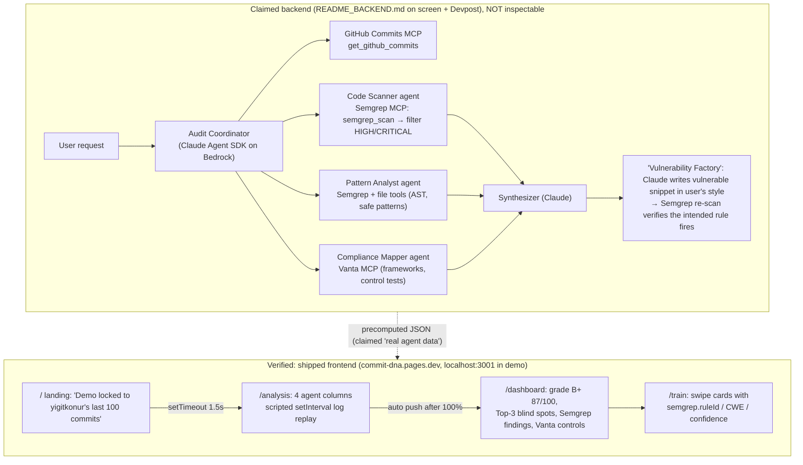

# CommitDNA — "Personalized sec & compliance tutor on your commits"

## 1. Snapshot

| Field | Value | Evidence |
|---|---|---|
| Event | AWS AI Agents Hackathon, SF, Fri 10 Oct 2025. Submission deadline 4:30 PM PT | Devpost hackathon page |
| Award | **Best Use of Semgrep, winner.** Rank not published | Devpost badge on the submission |
| Probable tier | *Inference:* the strongest fit for the **1st-place tier** ("Generate Rules for Agents — create an agent that helps customize your security experience; incorporate an agentic workflow that improves security"). It is a multi-agent workflow that "reverse-engineers Semgrep rules" into personalized training | Prize text vs. Devpost "Vulnerability Factory" |
| Repo | `github.com/yigitkonur/commitdna`: **404** (checked 2026-10-08). Not among the author's 100 most recently updated public repos. **Wayback Machine was offline** ("Temporarily Offline") on two tries, so no snapshot was checked | curl 404; GitHub API; archive.org |
| Demo | https://cln.sh/kwd5YrFm (reachable; 134.3 s MP4, downloaded). Identical content on YouTube https://www.youtube.com/watch?v=Na5lpLPbJpQ ("CommitDNA - Learn The Security & Compliance from The Mistakes You Did Based on Your Commits", 134 s, uploaded 2025-10-10, channel "Yiğidov"). Semgrep's blog links the YouTube copy | yt-dlp; ffprobe |
| Hosted app | https://commit-dna.pages.dev/: live static Next.js export (Cloudflare Pages). Routes `/`, `/analysis`, `/dashboard`, `/train` | curl; JS bundle fetched |
| Team | **Solo**: Yigit Konur. GitHub account since 2014 with 108 public repos, mostly MCP servers and Claude Code / Codex tooling (e.g. `mcp-parasut`, `skills-by-yigitkonur`, `codex-plugin-cc`). No Semgrep-related public repo | Devpost "Created by"; GitHub profile |
| Submitted | Devpost "started this project Oct 10, 2025 07:29 PM EDT" = **4:29 PM PT, 1 minute before the deadline** | Devpost updates feed |

## 2. What it is

CommitDNA turns a developer's own commit history into a personalized security and compliance course. The **Diagnose** phase works like this:
- Agents scan your last 100 commits with Semgrep.
- They profile your "coding DNA": blind spots, safe "gold standard" patterns, even what time of day your bugs land.
- Vanta maps the findings to SOC 2 / HIPAA controls.
- Claude writes a graded report ("B+ 87/100, Backend Fortress Builder").

The **Train** phase is a Tinder/Duolingo swipe deck of code snippets in *your* style. You swipe "vulnerable" or "safe" and get instant feedback. The users are developers, and hiring or training managers.

## 3. Architecture

Source is unavailable. The diagram below combines three sources:
- **(a)** the README_BACKEND.md architecture diagram visible in the demo at ~1:55–2:10;
- **(b)** the Devpost text;
- **(c)** the shipped frontend JS.

Labelled **claimed backend vs. verified frontend**.

- **Tech claimed:** Claude Agent SDK, Bedrock, Claude Sonnet 4.5 (spoken at 0:49 as "Claude 4.5 Sonnet"; the UI chip says "Claude 3.5 Sonnet"), **semgrep-mcp**, **vanta-mcp**, TypeScript, Next.js. Devpost "Built with": claude-agent-sdk, semgrep-mcp, typescript, vanta-mcp.

## 4. Semgrep usage deep-dive

**Depth rating: core-to-the-pitch as claimed. Unverifiable in source. Scripted in the shipped UI.**

What is verifiable:

- **The hosted frontend makes no network calls.** A grep of all four app chunks finds no `fetch` or `EventSource`. The only `fetch(` string is an XSS example payload inside a training card. The "multi-agent" screen is a `setInterval` that walks hard-coded log lines (`app_analysis_page-*.js`), for example:
  - `"Executing semgrep_scan() with p/security-audit config..."`
  - `"supported_languages() → [Python, JavaScript]"`
  - `"get_abstract_syntax_tree("`
  - `"Finalizing scan report... Found 23 vulnerabilities total."`
  - `"vanta.frameworks(frameworkId='soc2')"`, `"  → next_audit: 2024-03-15"`
  - `"  → 100 - 83 penalties + 15 bonuses = 87"`
- **The tool names match the real Semgrep MCP server's tools**: `semgrep_scan`, `supported_languages`, `get_abstract_syntax_tree`. These are real tool names from the `semgrep/mcp` README. This is evidence the author worked with the Semgrep MCP and modelled the UI on its tool calls (*inference*). The configured pack shown is `p/security-audit`.
- **The dashboard data is static JSON** (`app_dashboard_page-*.js`). One kind of entry is `semgrepFindings`, for example `{path:"frontend/Profile.jsx", line:42, snippet:"dangerouslySetInnerHTML={{ __html: user.bio }}"}`, `config/settings.py:23 API_KEY = "sk_live_51H7Y2SD..."` and `api/v2/users.py:45 # No CSRF token check`. The other is `semgrepAnalysis` "gold standards", for example "Parameterized queries and ORM usage 45/45 (100%)" and "@require_auth decorator 23/24 (95.8%)". The file paths are generic (`api/auth.py`, `models/user.py`). *Inference:* they look like a synthetic sample project, not the author's real repos, which are TypeScript/Python CLIs and MCP servers.
- **The training cards carry Semgrep metadata** (`app_train_page-*.js`): `semgrep:{ruleId, confidence, cweId}`. The IDs fall into two groups:
  - Plausible registry rule IDs: `javascript.react.security.audit.react-dangerouslysetinnerhtml` (CWE-79) and `javascript.express.security.injection.tainted-sql-string` (CWE-89).
  - IDs that look **invented** (*inference*; not checked against the registry): `javascript.lang.security.audit.hardcoded-secret`, `javascript.jwt.security.jwt-hardcoded-secret`, `javascript.express.security.best-practice.input-validation`, plus a "100%" confidence with CWE "N/A".
- **On-screen disclaimers in the demo itself:**
  - Landing banner: "Hackathon Demo: Real agent data from @yigitkonur's last 100 GitHub commits · Built with Semgrep MCP + Vanta API + Claude · No OAuth required for demo".
  - Analysis banner: "**Accelerated Mode for Judges**: Agent data from yigitkonur's last 100 commits · **Accelerated to 10x for demo (actual analysis: ~8 minutes)** · Using Semgrep MCP + Vanta API + Claude Agent SDK" (cln.sh frame at 0:30).
  - Spoken at 2:00–2:09: "some parts are just created for demo purposes, like the analysis part is just fastened 10x more faster".

**The claimed "Vulnerability Factory" (the most novel Semgrep idea of the three winners):**
1. Semgrep finds the user's bugs and their *safe* patterns ("gold standard").
2. Claude "reverse-engineers Semgrep rules" to generate new vulnerable snippets that look like the user's code.
3. **Semgrep runs again to verify that the snippet actually triggers the intended rule** ("ensuring 100% accuracy in our training challenges").

This uses Semgrep as a *generator-verifier oracle*, not just a scanner. It was not shown working in the demo; the train view displays cards only.

**Other sponsors:**
- Vanta MCP for compliance mapping. Claimed, shown in scripted logs, plus a "Vanta MCP Server T…" browser tab in the demo.
- AWS Bedrock as the Claude Agent SDK host.

## 5. Claimed vs. real

| Claim | Status |
|---|---|
| Four parallel agents via Claude Agent SDK + Semgrep MCP + Vanta MCP | **Unverifiable.** The repo is 404. README_BACKEND.md (507 lines, 15.5 KB, visible at 1:55) documents it |
| "Real agent data from your last 100 commits" | **Doubtful as shown.** The UI data is hard-coded, and the sample paths look synthetic. It may be a hand-curated precomputed result |
| Analysis takes ~8 min, accelerated 10x | Disclosed on screen. The replay is scripted (setInterval with fixed durations `[12,10,8,6]` s per agent) |
| Vulnerability Factory with a Semgrep re-verify loop | Claimed on Devpost only. Not demonstrated |
| "2,341 developers trained" (landing) | Fabricated vanity metric. The project was hours old |
| Vanta `next_audit: 2024-03-15` | Hard-coded and stale. Evidence of a scripted log |
| Compliance mapping (SOC2 CC6.1 / CC6.8) | Scripted strings |

## 6. Demo analysis (134 s, webcam bubble + screen; transcript from YouTube auto-captions, timestamps mm:ss)

| t | Transcript / on screen |
|---|---|
| 00:01–00:20 | "This is my demo for… CommitDNA. Taking your last 100 commits or last 10k git difference and trying to scan… using the powerful tools of Semgrep." On screen: landing "Turn Your Vulnerabilities Into Strengths", user `yigitkonur`, then **Analyze Last 100 Commits** |
| 00:20–00:56 | "another analyst… sub-agent architecture… checking the patterns… common vulnerabilities and the safe patterns… compliance risks… the Vanta MCP… reasoning of Claude to create a report… Claude 4.5 Sonnet." On screen: **four agent columns, each with a sponsor chip**: SCANNER [Semgrep MCP], ANALYST [Claude + Semgrep], COMPLIANCE [Vanta API], SYNTHESIZER [Claude 3.5 Sonnet]. Streaming `semgrep_scan(code_files=[…], config="p/security-audit")` lines, a progress bar and "Est. completion: 24s" |
| 00:56–01:10 | "all agent communication is just streaming… multi-agent architecture… creates a single report." On screen: Live Agent Communication log, then **grade card "B+ 87/100 'Backend Fortress Builder'"**, stats 23 / 15 / 8,450 / 12 days |
| 01:10–01:25 | "help you to understand what was the mistakes of you… hiring activity… like a Duolingo but perfectly customized to you." On screen: "Your Top 3 Blind Spots": #1 XSS "Found by Semgrep" with code; Compliance Impact (Vanta); Top 3 Strengths (SQL injection prevention, auth patterns, error handling); Behavioral Insights "72% of bugs after 6PM" bar chart |
| 01:25–01:50 | "security flashcards… if something is wrong it's giving you positive and negative signals." On screen: `/train` swipe card with red ✗ / green ✓ buttons, then "Excellent! 🎉" |
| 01:50–02:13 | "running on Claude SDK… architecture can be seen in the readme… some parts are just created for demo purposes… analysis part is 10x faster." On screen: GitHub README_BACKEND.md "VulnSwipe Multi-Agent Security Audit System" with a mermaid architecture of 5 colored agent boxes and "Phase 1: Vulnerability Detection (Required): code-scanner → Semgrep scan → Filter HIGH/CRITICAL". The browser sidebar shows tabs "semgrep (CLI) - Goo…" and "Vanta MCP Server T…" |

- **Structure:** hook (personal problem, "security Duolingo") → live-looking multi-agent run with a **sponsor logo on every agent** → personalized report → gamified training → architecture proof (README).
- **Sponsor moment:** Semgrep appears in the first 15 s (spoken) and on the very first agent chip ("Semgrep MCP"), then again as "Found by Semgrep" on each blind spot.
- **Wow moment:** the four-column parallel agent board streaming tool calls, then a letter grade about *you*.

## 7. Build timeline

- Repo unavailable, so there is no commit history.
- The YouTube upload is dated 2025-10-10. The Devpost entry was created at 4:29 PM PT, 1 min before the deadline.
- Internal name "VulnSwipe" (README title, a browser tab "VulnSwipe - Turn Y…") versus product name "CommitDNA". *Inference:* renamed during the day.
- Polish level: Framer Motion, a glassmorphism UI and a 507-line backend README. That is very high for a solo 5-hour build. *Inference:* the author leans heavily on AI coding agents (their GitHub is mostly Claude Code / Codex / MCP tooling). Some scaffolding may predate the event; this cannot be verified.

## 8. Why it won (ranked analysis)

1. **"Novel use of the tool" was the overall judging criterion, and CommitDNA said it out loud.** Devpost's Technical Implementation criterion reads "Surprise and inspires judges… through the novel use of tools in a unique way". CommitDNA's "What we learned" echoes it: "stopped asking 'What does this tool do?' and started asking 'How can we use this tool in an unexpected way?'… using [Semgrep] as a core component in a generative AI loop". Semgrep as a verifier for generated training content is a genuinely new framing.
2. **Matches the 1st-tier wording.** "An agent that helps customize your security experience. Incorporate an agentic workflow that improves security." Personalized, agentic and security-improving all apply. "Reverse-engineer Semgrep rules" also brushes the "Generate Rules" header.
3. **Semgrep MCP named explicitly**, at the moment Semgrep was pushing its MCP server. The retrospective opens with "MCP has indisputably become the backbone of agentic workflows… By building an MCP server for Semgrep, teams at the event were able to add security scans into their code creation process". CommitDNA is filed under "Trend 2: LLMs Can Encourage Best Practices": "coupled the explainability of an LLM with the deterministic security analysis of Semgrep… a personalized AppSec tutor for your commits".
4. **Developer-education angle.** Semgrep sells to AppSec teams who struggle with developer adoption, and "shift-left coaching" is their story.
5. **Three-sponsor stack visible on screen** (Semgrep MCP + Vanta MCP + Bedrock/Claude). That satisfied the "≥3 sponsor tools" criterion. Each agent column wears a sponsor badge.
6. Presentation polish: grade card, swipe cards, a mermaid architecture in the README.

## 9. Weaknesses

- The shipped UI is a scripted replay. A judge who clicked "Skip to Dashboard" or reloaded would see identical numbers.
- The headline innovation (the generate-then-verify Vulnerability Factory) was never shown running.
- Some Semgrep rule IDs on the cards appear invented, which Semgrep staff could have spotted.
- The repo is now private or deleted, so no reproducibility.
- The disclaimers ("accelerated 10x", "some parts created for demo purposes") are honest but concede the point.
- A competitor who shows a *real* Semgrep MCP call, with a real rule ID, file and line from a live repo, beats this on credibility.

## 10. Steal-this

- **Semgrep as an oracle in a generate-verify loop.** An LLM writes something (a vulnerable sample, a patch, a custom rule), and Semgrep deterministically confirms it. For Cyberdefense:
  1. The agent writes a custom Semgrep rule for a new CVE pattern.
  2. It generates a positive test (must match) and a negative test (must not), and runs `semgrep --test` or `semgrep_scan_with_custom_rule`.
  3. It ships the rule only when both pass.

  That covers the 1st and 2nd tiers in one loop.
- **One sponsor per agent, badged in the UI.** Make each agent column show its tool chip and stream real MCP tool-call names (`semgrep_scan`, `get_abstract_syntax_tree`, `semgrep_findings`).
- **Personalize the output** (the developer's own repo, their own blind spots) and give it a memorable artifact (a letter grade, an archetype name).
- **Have an honest accelerated mode with a banner**, but keep a real "Run live" button with one small repo so the judges can see one genuine Semgrep call end to end.
