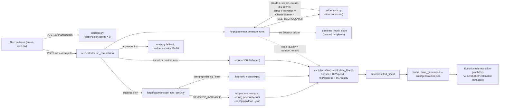

# Darwin — "Natural Selection to Evolve AI Tools"

## 1. Snapshot

| Field | Value | Evidence |
|---|---|---|
| Event | AWS AI Agents Hackathon (Creators Corner / Devpost), San Francisco, **Fri 10 Oct 2025**. Hacking ran 11:30 AM to 4:30 PM PT, about 5 hours | `aws-agentic-ai-hackathon.devpost.com` schedule |
| Award | **Best Use of Semgrep, winner.** Rank not published. Devpost badge plus Semgrep blog write-up | Devpost `darwin-cmfysv`; semgrep.dev blog (see §8) |
| Probable tier | *Inference:* most likely the **3rd-place tier** ("Run a Semgrep scan that finds no vulnerabilities of any generated or code you write"). Every model card in the demo shows **Defense 100/100** | Prize text (§8); demo at 0:42–0:55 |
| Repo | `persist-os/aws-hackathon` (also pushed as `divertissement-ai/aws-hackathon`, per a merge commit). Clone: `repos/semgrep/darwin` | `git log` 897593b |
| Demo | https://www.youtube.com/watch?v=52UihmmZJ0s, "Darwin Demo", **75 s, silent** (audio −91 dB, no narration, no captions) | yt-dlp metadata; ffmpeg volumedetect |
| Hosted app | none | |
| Team | The Devpost says "Four people". Git shows 3 committers: Aria Han (ariahan, 14 commits), Shreyash Hamal (Shreyboiii / Shreyash Hamal, 9), Myat Pyae Paing (Paing, 8) | `git log`; Devpost "Challenges" |

## 2. What it is

You type a coding task such as "Create an email validator". Darwin asks three LLMs on AWS Bedrock to write a Python tool for it. Each output gets a security score (Semgrep, with a regex fallback), a speed score, a success flag and a quality number. These combine into a weighted "fitness" score: **security 40%**, success 30%, speed 20%, quality 10%. The fittest model "survives". Every generation is saved to a JSON file, and an "Evolution" dashboard charts fitness and security over time plus a leaderboard of model wins. The pitch is "don't pick the best model; let it emerge under security selection pressure." The users are agent builders who generate tools on demand.

## 3. Architecture (as found in code)

- **Backend:** Python FastAPI, `backend/app/main.py`, about 4.7k non-test LOC. Modules:
  - `forge/` covers generation, scanning and validation.
  - `evolutions/` covers fitness, selection, tracking, narration and the "ecosystem".
  - `ai/bedrock.py` holds the Bedrock Converse client.
- **Frontend:** Next.js + Tailwind + shadcn + Recharts, about 1.5k LOC. Files: `arena-view.tsx`, `arena-result-card.tsx`, `evolution-graph.tsx`.
- **Storage:** `backend/data/generations.json`, a flat file.
- **Sponsor tech:**
  - AWS Bedrock (Converse API).
  - **Semgrep CLI invoked through a subprocess.** Not the MCP server, not the AppSec Platform, no custom rules.
  - No Vanta.



## 4. Semgrep usage deep-dive

**Depth rating: load-bearing in the formula, thin wrapper in implementation.** Semgrep supplies 40% of the fitness score, which picks the winner. But it is one subprocess call with two public registry rulesets. The UI shows only a single number. No rule ID, finding, file or line reaches the user.

### Exact invocation (`backend/forge/scanner.py`)

- **Availability probe at import time** (`scanner.py:23-37`). The module runs `semgrep --version` with a 5 s timeout and sets `SEMGREP_AVAILABLE`. When Semgrep is missing it logs `"Install with: pip install semgrep"`. `semgrep>=1.45.0` is pinned in `backend/requirements.txt:26`.
- **Dispatch** (`scanner.py:61-74`): Semgrep if available, otherwise `_heuristic_scan`. Any Semgrep exception also falls back to the heuristic, and `scanner_used` is set to `'semgrep'` or `'heuristic'`.
- **The scan** (`scanner.py:331-352`). Generated code is written to a `NamedTemporaryFile(suffix='.py')`, then:
  ```python
  subprocess.run(['semgrep',
      '--config', 'p/security-audit',   # Security-focused ruleset
      '--config', 'p/python',           # Python-specific rules
      '--json', '--timeout', '30', '--max-memory', '2000', temp_file],
      capture_output=True, text=True, timeout=30)
  ```
  - Registry packs only. No `auto`, no `p/default`, no custom YAML, no SARIF, no `--metrics` flag, no login or app token.
  - The return code is not checked. Only stdout JSON is parsed (`:355-359`). A JSON parse failure raises, which falls back to the heuristic.
  - `--timeout 30` is Semgrep's per-rule timeout. The outer `subprocess` timeout is also 30 s, and it includes the registry download of two packs on a cold start. *Inference:* a cold first scan could time out and silently drop to the heuristic.
- **Scoring** (`scanner.py:362-393`):
  - Each result's `extra.severity` is bucketed: `ERROR`/`CRITICAL` → critical, `WARNING` → high, `INFO` → medium, anything else → low.
  - Then `score = 100 − 40·critical − 25·high − 10·medium − 5·low`, clamped to 0–100.
  - Messages are formatted `f"{rule_id}: {message}"` and truncated to the top 10 (`:414-415`).
  - "Safe patterns" are substring checks (`try:`, `isinstance(`, `re.match`) that do not affect the Semgrep score (`:402-408`).
- **Heuristic fallback** (`scanner.py:76-300`) is about 20 regexes with fixed penalties:
  - `eval(` −40 (matched twice, once in the critical dict and once in the high dict), `exec(` −40, `pickle.loads` −35, `shell=True` −25, plus hardcoded secrets and string-concatenated SQL.
  - It also awards bonuses for `try:` (+5), `import re` (+2) and similar.
  - Simple generated code therefore tends to score at or near 100.

### How the score is used

- `orchestrator._scan_security_safe` (`app/orchestrator.py:135-157`) wraps the scanner. On `ImportError` **or any exception it returns `{'score': 100}`**. This is fail-open, so a broken scanner yields perfect security.
- Only successful generations are scanned (`orchestrator.py:205-208`).
- `evolutions/fitness.py:43-55` computes `security_score*0.4 + (100-min(t,100))*0.2 + success*30 + quality*0.1`.
- `scanner_used`, `vulnerabilities` and `warnings` are **dropped**. The Pydantic `ToolResult` keeps only `security_score` (`backend/models.py:42`). The UI cannot tell whether Semgrep or the regex produced the number.

### Frontend Semgrep surfacing

- `evolution-graph.tsx:250-262` is a static panel titled "Security Scanning (**Semgrep** + Heuristic Fallback) — 40% of Fitness". The chart series is labelled "🔒 Security Score (Semgrep)" (`:376`).
- The "Vulnerabilities" counter is **not Semgrep data**. It is estimated client-side as `floor((100−score)/10)` when score < 70 (`evolution-graph.tsx:80-84`).

### Other sponsors

AWS Bedrock Converse is real code (`ai/bedrock.py:107-130`). No Vanta.

## 5. Claimed vs. real

| Claim (Devpost/README) | Reality in code |
|---|---|
| "Three models compete (Claude, GPT-4, Llama via Bedrock)" | `MODEL_IDS` has two distinct models. **"llama-4-maverick" maps to Claude Sonnet 4** with the comment "Use Claude as fallback for now" (`ai/bedrock.py:28-31`). GPT-4 is not wired. The leaderboard's `gpt-4` and `llama-3.1-70b` entries come from older or seeded data |
| "Semgrep scans every output" | True when the `semgrep` binary is on PATH and the scan succeeds. Otherwise the regex heuristic runs, or a flat **100** on error. Nothing tells the user which one happened |
| "Semgrep catches what humans miss: Regex DoS, eval() abuse, shell injection" (README:536) | No ReDoS rule is configured beyond whatever the `p/python`/`p/security-audit` packs contain. In the demo every model scores 100, so nothing was "caught" on screen |
| Quality (10%) "from validator" | `code_quality = random.randint(min_qual, max_qual)` per model (`forge/generator.py:184`, `:439`). The orchestrator never calls `forge/validator.py` |
| Live, evolving security | The narration plays **before** results, using placeholder results with `security_score: 0` (`app/main.py:262-275`). So `narrator.py:212` emits "🕳️ Critical gap in armor… claude-4-sonnet cannot defend the colony" (`narrator.py:72`), shown at demo ~0:24–0:30. Seconds later the same model's card shows Defense 100/100. The narration is decorative and contradicts the data |
| Never fails | `/arena/compete` catches every exception and returns **fabricated results** with `security_score=random.uniform(85,98)` and a canned function (`app/main.py:177-240`), commented "make it look real" |
| `SEMGREP_ENABLED=true` env (README:466) | No code reads this variable |
| "Natural selection works; models specialize" | The selection is a deterministic argmax on a weighted sum. The "evolution" charts are generated by `run_30_generations.py` / `generate_realistic_data.py` batch scripts (commit 6e578b1, 15:08) |

What Semgrep code really does: the subprocess call and JSON severity parsing are genuine, and they work if Semgrep is installed (`pip install semgrep` appears in `QUICK_START_BEDROCK.md:7,26,30`). It is not mocked.

## 6. Demo analysis (75 s, silent screen recording at `localhost:3000`)

Frames sampled every 5 s and read visually. There is no audio, so this is a click-through only.

| t | On screen |
|---|---|
| 0:00 | "Darwin — Natural Selection to Evolve AI Tools". Tabs: Live Arena / Evolution. Typing "Create an email validator", then **Begin Evolution** |
| 0:05–0:30 | "Evolutionary Process" stepper with narration cards: "In the crucible of creation, 3 tools take their first form", "Neural pathways form… security defenses develop…", "Critical gap in armor… claude-4-sonnet cannot defend the colony", "The fossil record claims another victim… llama-4-maverick cannot adapt" |
| 0:40 | **Survival of the Fittest**: claude-4-sonnet "Apex Predator" fitness 98.3 (exec 7.03 s, **Defense 100**, Quality 97). claude-3.5-sonnet 97.6 (Defense 100). llama-4-maverick 97.1 (Defense 100) |
| 0:45–0:55 | "View DNA" expands the generated `validate_email_address` code |
| 0:55–1:05 | **Evolution tab**: Generations **71**, Fitness 91.0, Leader claude-3.5-sonnet. "Security-First Evolution" panel: Security **100**, Improvement +2.0, **Vulnerabilities 150** (client-side estimate). Then the "Security Scanning (Semgrep + Heuristic Fallback) 40% of Fitness" panel |
| 1:05–1:15 | System Health "Struggling, Diversity 7%". "Evolution & Security" line chart with a red "Security Score (Semgrep)" series. Leaderboard: claude-3.5-sonnet 43 wins (60.6%), claude-4-sonnet 15, llama-4-maverick 10, llama-3.1-70b 2, gpt-4 1 |

Structure: hook (title) → live run → result cards → dashboard with a "Semgrep" label. There is no problem statement, no spoken pitch, and **no Semgrep finding shown at any point**. The Semgrep moment is a label plus a 100 score.

Wow moment: the biological narration and "Apex Predator" cards. The live 3-minute pitch was presumably delivered in person and is not recorded.

## 7. Build timeline

- 31 commits, all on **10 Oct 2025, 10:31–16:45 PT**:
  - Initial commit 10:31.
  - Natural-selection engine 11:46.
  - Fitness and selection refactor with a **Semgrep stub** 12:05. The `_real_semgrep_scan` stub printed "Real Semgrep integration not yet implemented, using heuristic scanning".
  - Bedrock 14:30.
  - **Real Semgrep subprocess integration 15:01** (06d75a6, by ariahan: "Enhance AWS Bedrock setup with Semgrep integration"). That is **about 90 min before the 4:30 deadline**.
  - Model updates 15:15–15:40, README 16:45.
- The real Semgrep path was a late afternoon add. The morning ran on the regex heuristic.
- Size: about 4.7k backend LOC (non-test) + 3.2k LOC of tests + 1.5k frontend. Much of it is LLM-generated boilerplate: large docstrings, "Phase 1/2/3" test suites, "Paing's code" comments.
- Nothing looks prebuilt. Everything is created that day.

## 8. Why it won (ranked analysis)

1. **It hits the literal 3rd-tier criterion.** The official prize tiers were:
   - 1st, $2,500: "Generate Rules for Agents — Create an agent that helps customize your security experience. Incorporate an agentic workflow that improves security".
   - 2nd, $1,500: "Write a rule to check your code or any agents for custom security practices".
   - 3rd, $1,000: "Run a Semgrep scan that finds no vulnerabilities of any generated or code you write".

   Darwin scans *generated code* and shows every winner at **Defense 100/100**. Verified fact: the prize text and demo frames. *Inference:* this maps it to 3rd place.
2. **Semgrep decides the outcome.** It holds the largest weight (40%) in the function that picks the winning model. Semgrep's own retrospective (semgrep.dev/blog/2025/what-a-hackathon-reveals-about-ai-agent-trends-to-expect-2026) frames Darwin under "Trend 1: Teams use more than one LLM": "pitted model against model using the deterministic reasoning from Semgrep to build a survival fitness function… measurable pressure from a reliable SAST security scan rather than guesswork." Semgrep tied it to its own research ("Sonnet 4 and Codex on IDOR detection") and to the model picker in Semgrep Assistant. **The story matched Semgrep's "deterministic SAST as ground truth for AI" narrative.**
3. **Instantly legible metaphor.** Natural selection, plus a polished dark UI with explicit "Semgrep" and "40% of Fitness" badges. Judges never needed to read code.
4. **Multi-sponsor fit.** Bedrock is used for real, which matched the overall criterion "Tool Use — integration of at least 3 sponsor tools". Darwin used only 2.

## 9. Weaknesses a stronger competitor could exploit

- No finding is ever shown. The judges saw a number, not a vulnerability.
- No custom rules, no autofix, no MCP. That leaves the 1st and 2nd tier criteria (rule generation, custom rules) unaddressed.
- Fail-open scoring: an error yields a score of 100. The UI cannot tell Semgrep scores from regex scores.
- Two of the three "models" are the same model. Quality is random. The fallback fabricates results.
- The narration contradicts the scores.
- Toy tasks (an email validator) give Semgrep nothing to find, so the selection pressure is never visible.

## 10. Steal-this

- **Put Semgrep inside the decision function.** Make the scan result gate or rank something: choose a patch, block a deploy, promote an agent. Show the weight on screen ("Semgrep = 40% of fitness").
- **Fix Darwin's gaps when you copy it:**
  - Show the *rule ID, severity, line and diff* of a real finding.
  - Seed tasks that tempt models into `subprocess(shell=True)`, `yaml.load` or raw SQL, so selection is visible: one model gets −40 and goes "extinct".
  - Surface `scanner_used` and fail **closed**.
- The 3rd-tier "clean scan" proof is cheap. A "0 findings after fix" badge on generated code covers that tier for little effort. Pair it with a custom rule for tier 2 and an agent that writes rules for tier 1.
- A tournament or comparison of LLMs scored by Semgrep is a Semgrep-blessed narrative: they blogged about it. For Cyberdefense, use it to compare *remediation patches* from several models and keep the patch that makes Semgrep go clean without breaking tests.
