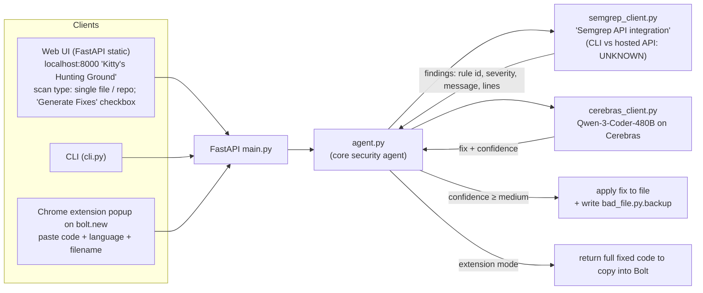

# Udon Cat — "Your Cute Security Companion"

## 1. Snapshot

| Field | Value | Evidence |
|---|---|---|
| Event | AWS AI Agents Hackathon, SF, Fri 10 Oct 2025 | Devpost |
| Award | **Best Use of Semgrep, winner.** Rank not published | Devpost badge |
| Probable tier | *Inference:* 1st or 2nd tier, most likely **2nd or 3rd**. It is an agentic scan-and-fix workflow that "improves security", which touches the 1st-tier wording. It writes **no custom rules**, which the 2nd tier asks for. It ends with fixed code ("fully secure project"), which is near the 3rd tier. Placement cannot be determined | Prize text |
| Repo | `github.com/chinesepowered/aws-secure-agent`: **404** (2026-10-08). Not among `chinesepowered`'s current public repos. **Wayback offline** during two attempts | curl; GitHub API; archive.org |
| Demo | https://www.youtube.com/watch?v=LdO30NH6WRU, "Udon Cat", **200 s**, uploaded 2025-10-10, channel "Jobie" | yt-dlp |
| Team | 2: **Nelson Lai** (speaker; "my name is Nelson") and **Ayana Terauchi** ("This is Diana[sic]… the brains behind this"). The local repo path on screen is `/Users/ayana/Documents/GitHub/aws-secure-agent/bad_file.py` | Devpost; demo 2:48–2:53; frame at 0:20 |
| Serial winner | GitHub `chinesepowered` also authored Guild AI winner **Branch** (`repos/guild-ai/branch`, 24 Apr 2026). *Inference:* `chinesepowered` = Nelson Lai, since the repo owner and the speaker match the Devpost creator. The account has 141 public repos, most named `hack-*`. In Sept–Oct 2026 it created roughly 3–5 new hackathon repos per week | GitHub API |
| Timing | Devpost entry created **5:34 PM EDT = 2:34 PM PT**. The demo was recorded at about 4:08–4:12 PM PT (macOS menu-bar clock visible in frames, low-res read) | Devpost; video frames |

## 2. What it is

Udon Cat runs a Semgrep scan on a file, a repo, or a pasted snippet. It sends each finding to **Cerebras-hosted Qwen-3-Coder-480B**, which writes a fix plus a confidence level. Fixes are **applied only when confidence is medium or high**, and a `.backup` file is written first. There are three front ends:
- a web UI ("Kitty's Hunting Ground");
- a CLI pitched for CI/CD;
- a **Chrome extension for bolt.new**, which lets vibe-coders paste code from the in-browser IDE, get findings, and copy back the fixed code.

The users are "vibe coders" who ship without security review: "when you wake up after getting 20,000 new users, you don't get 20,000 security flaws".

## 3. Architecture

Source is unavailable. Components come from the Devpost README (a tree is pasted in the Devpost story) plus the demo.

- **Tech:** Python FastAPI; Semgrep; Cerebras (Qwen 3 Coder 480B); a Chrome extension (vanilla JS presumably). Devpost "Built with": cerebras, qwen, semgrep.
- **Not used:** AWS Bedrock (despite the AWS event), Vanta. The project used **1 of the event's listed sponsor tools** (Semgrep) plus Cerebras. Cerebras's sponsor status at this event is not verified.

## 4. Semgrep usage deep-dive

**Depth rating: load-bearing.** Semgrep is the only detection source, and every fix is anchored to a Semgrep finding. Implementation details are unverifiable.

Verified from the demo frames:
- Findings carry **real Semgrep registry rule IDs and messages, verbatim**:
  - `python.lang.security.audit.md5-used-as-password.md5-used-as-password` (WARNING), with the registry message "It looks like MD5 is used as a password hash. MD5 is not considered a secure password hash because it can be cracked by an attacker in a short amount of time. Use a suitable password hashing function such as scrypt. You can use `hashlib.scrypt`." (frame at ~2:52).
  - `…security.audit.formatted-sql-query.formatted-sql-query` (HIGH)
  - `python.sqlalchemy.security.sqlalchemy-execute-raw-query…` (ERROR)
  - `python.lang.security.deserialization.pickle.avoid-pickle`
  - The UI shows line ranges ("bad_file.py lines 21–21").
  - *Inference:* this is genuine Semgrep output, likely `p/python`, `p/security-audit` or `auto`. The exact config is unknown.
- Severity labels come straight from Semgrep (`WARNING`/`ERROR`), re-badged as HIGH in places.
- The demo target is a **planted `bad_file.py`** containing MD5 passwords, formatted SQL, raw SQLAlchemy, pickle, `os.system` command injection and `input()` patterns. It is visible in the web UI path and in the bolt.new file tree.
- The extension result reads "Found **8 issue(s)** with **8 fix(es)** available", with counters ISSUES 8 / FIXES 8 / SELECTED 0, then "Apply Selected Fixes".
- Speaker: "sends it to **Semgrep's API** to analyze the code" (0:45, 2:19). The Devpost tree says `semgrep_client.py # Semgrep API integration`. *Unknown:* the client could wrap the local CLI (`semgrep scan --json`) or the Semgrep AppSec Platform / the hosted MCP at `mcp.semgrep.ai`. The phrase "API" is ambiguous. Pasting code into the extension and getting findings back suggests a backend that writes a temp file and runs the scan.
- No custom rules, no Semgrep Assistant or Autofix. The fixes come from Qwen, not from Semgrep's `fix:` keys.

## 5. Claimed vs. real

| Claim | Status |
|---|---|
| Web UI + CLI + Chrome extension | Web UI and extension **shown live**. CLI claimed but **not shown** |
| Single file or entire repository | Single file shown. Repo mode only as a dropdown option |
| "Medium/High confidence only" auto-apply | Web UI shows a "Fix Available — **high confidence**" badge, and "Apply Fix" rewrites the file. GitHub Desktop then shows the diff plus a `.backup` file (~1:20–1:30). The extension "applies all fixes at once that has medium or more probability" (2:35) |
| Teaches better security practice | It shows the Semgrep rule message and a fix rationale ("Replaced the insecure MD5 … with hashlib.scrypt, which… generates a random salt") |
| "Fully secure project" after fixing | Not demonstrated. No re-scan after the fix was shown |
| Implementation quality | Unverifiable (404) |

## 6. Demo analysis (200 s; YouTube auto-captions, mm:ss)

| t | Transcript / on screen |
|---|---|
| 00:01–00:33 | **Hook/problem:** "We are Udon Cat powered by Semgrep and Cerebras. We created an easy security analysis and automatic fixing tool. So **Semgrep [is] amazing in security. Unfortunately the fixes can only be done one at a time.** So instead… anyone can just analyze a file, generate fixes automatically and… apply to the file directly… review those files in your version control tool and also creates a backup." Header badge on screen: "Powered by Semgrep + Cerebras" |
| 00:34–00:47 | "We have a web UI, a CLI and a Chrome extension. This is the web UI… very cute Udon cat." Enters the bad_file.py path and ticks "Generate Fixes", then **Scan File** ("Kitty is sniffing for bugs…") |
| 00:45–01:16 | "analyzing… by sending it to Semgrep's API and then using Cerebras Qwen 3 coder we create automated fix suggestions and also the probability of how reliable those fixes are. Here we have a bunch of security flaws **caught by Semgrep. Thank you Semgrep.** …this is using MD5 for a password, that's not secure, it should be using scrypt instead… it teaches you how to have better security practices." On screen: "Bugs Udon Cat Found" with rule IDs |
| 01:16–01:47 | "notice… we have an empty change list. If you apply the fix… it'll actually apply the fix… also creates a backup file." On screen: GitHub Desktop diff. Then a joke about an AI dropping your database ("you're absolutely right") |
| 01:47–02:45 | "a version for people who are vibe coding… pop up the Udon Cat extension and copy in the code. The code has to be copied in because Chrome doesn't allow cross-frame reads." On screen: bolt.new project "Cute Hello Kitty Game" containing bad_file.py → extension popup → "Let Kitty Hunt!" → 8 issues → "applies all fixes at once that has medium or more probability… **it vibe-securities as you vibe-code**" |
| 02:45–03:13 | Close: "the fixed code that we can copy into Bolt… a fully secure project… when you wake up after getting 20,000 new users you don't get 20,000 security flaws." Team names |

- **Structure:** sponsor-first hook → problem framed *as a Semgrep limitation they fix* ("fixes one at a time") → live run in two UIs → diff/backup safety → vibe-coding extension → memorable tagline.
- **Sponsor moments:** Semgrep is named in the first 3 seconds, thanked by name at 1:02, and its rule IDs are visible throughout.
- **Wow moment:** the Chrome extension running on bolt.new, plus the phrase "vibe-secure as you vibe-code".

## 7. Build timeline

- No repo, so no commits.
- The Devpost entry was created at 2:34 PM PT. The demo was recorded around 4:08–4:12 PM PT (clock in the frames) and uploaded the same day.
- The `chinesepowered` pattern on later hackathons (e.g. Branch: Initial commit 11:08, "first shot" 14:01, "live!" 17:20, 9 commits in total) is fast single-day builds with very polished READMEs. *Inference:* Udon Cat followed the same cadence.

## 8. Why it won (ranked analysis)

1. **A clear, Semgrep-native user outcome.** Finding → explained → fixed → diff → backup, in under 90 seconds. It directly addressed a gap the speaker named in Semgrep's own (OSS) workflow, manual one-at-a-time remediation, without disparaging the detector ("Thank you Semgrep").
2. **A new surface Semgrep cared about.** Semgrep's retrospective made Udon Cat its "Trend 3: Vibe Coding Securely in the Developer's Browser": "browser-based AI coding environments… lack deep security integrations or MCP support… Udon Cat… bringing the deterministic code security analysis of a tool like Semgrep to the web… before it leaves the browser window. A crucial security layer for a growing and underserved segment." Semgrep later shipped exactly this direction (Guardian for AI-written code; Replit's built-in Semgrep scanner).
3. **Real Semgrep output on screen.** Verbatim registry rule IDs and messages build credibility with Semgrep judges in a way a single number (Darwin) or scripted logs (CommitDNA) do not.
4. **Safety framing for AI fixes:** confidence threshold, backup file, version-control review. This answers the obvious judge question "what if the AI fix is wrong?".
5. **Charm and memorability:** the cat persona, "Kitty is sniffing for bugs", and the "vibe-secure" tagline.

## 9. Weaknesses

- No re-scan after fixing, so the claim of "fully secure" is unproven. Semgrep's 3rd tier literally asks for a clean scan.
- The fixes come from an LLM, not Semgrep autofix rules, and fix correctness was not tested.
- The extension requires copy/paste. There is no automatic Bolt integration.
- A single planted file is a toy target.
- No custom rules (the 2nd tier), no rule generation (the 1st tier), no MCP.
- Low multi-sponsor usage for an event judging "≥3 sponsor tools".
- The repo is gone.

## 10. Steal-this

- **Close the loop: scan → LLM fix → re-scan → show "0 findings"** (plus tests passing). Udon Cat skipped the re-scan; doing it hits the 3rd tier and proves the fix.
- **Gate auto-apply on confidence**, and always write a backup or open a PR. That pre-empts the safety question.
- **Put Semgrep where code is born** (agent hooks, IDE, browser IDE). Today that means the Semgrep MCP's hooks (post-tool scan) or Guardian-style inline scanning inside the agent loop.
- **Show verbatim rule IDs, messages and line numbers on screen.** Semgrep judges recognise their own registry.
- **Frame a Semgrep limitation you solve, while thanking Semgrep.** It reads as complementary, not competitive.
- A cute persona and one tagline help the 3-minute demo stick.
