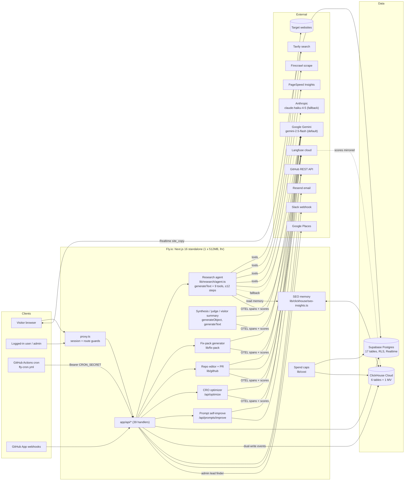
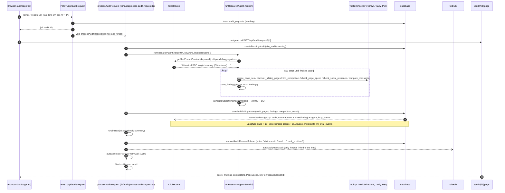

# SynapseCRO: whole-codebase deep dive

> **Current execution policy:** [Start now or anytime, with no build cutoff](../../event/BUILD_AUTHORIZATION.md). The human reports that the event is already underway and public schedules are stale. Older start/deadline/duration advice below is superseded; historical timestamps and analytics windows remain evidence, not build gates.

Round-1 file: [`analysis/clickhouse/synapsecro.md`](../archive/source-tree/analysis/clickhouse/synapsecro.md). Repo: https://github.com/ramstar3000/seo_tool (clone at `repos/clickhouse/synapsecro`). Everything below was read at **`1467ca9`**, the last event-day commit (2026-06-26 15:39 BST). The pre-event state was read at **`7eaf4b5`** (2026-06-25 09:35). Both were extracted with `git archive` into the scratchpad. Nothing was installed, run or deployed.

**[V]** = verified with file:line or git. **[I]** = inference.

---

## 0. Corrections to round 1

| Round-1 statement | What the code and git history show |
|---|---|
| "Prompt self-improvement … One PR was produced (#1, merged 15:15)" | **PR #1 was not produced by the self-improvement loop.** Its commit `1fc97aa` is authored by Ram with `Co-authored-by: Cursor`, touches 8 files, and comes from branch `prompt/eval-insights-rewrite`. The loop can only edit one file per PR (`lib/prompts/improve-pr.ts:84-96`) and always names branches `synapsecro/audit-<ms>` (`lib/github/create-pr.ts:45`). **PR #2 is a genuine bot PR**: branch `synapsecro/audit-1782484542900` decodes to 2026-06-26 14:35:42 UTC (15:35:42 BST), and its two commits `8d701de`/`13ab75f` were written through the contents API at 15:35:43–44 [V]. |
| ClickHouse memory "injected into five LLM entry points" | The five call sites exist, but the **scoping undermines three of them.** The PR path (`lib/github/auto-apply-from-audit.ts:132`), the PR apply route (`app/api/repos/[id]/apply/route.ts:152-153`) and the fix-pack path (`lib/fix-pack/generate.ts:97-98`) pass `auditId`, which `buildWhereClause` turns into `audit_id = {auditId}` (`lib/clickhouse/seo-insights.ts:208-211`). These queries therefore cover **one audit only**, so `HAVING audit_count >= 2 OR days_persisting >= 7` can never match, and the "persistent issues" line is never emitted on those paths. Only the research agent (`lib/research/agent.ts:131`, scoped by lead and/or keyword) and `/api/optimize?leadId=` get real cross-audit memory. The 15-minute cron calls `/api/optimize` **without** `leadId` (`.github/workflows/fly-cron.yml:20-23`), so the cron optimizer never sees ClickHouse memory (`app/api/optimize/route.ts:27`) [V]. |
| "outreach emails cite real rank data" | "Rank" is **Tavily result order** (`lib/research/serp.ts:95-96`, `position: index + 1`), not a Google SERP position. Leads created from visitor audits get a **hardcoded `rank_position: 3`** (`lib/leads/convert-from-audit.ts:65`), and that value flows into ClickHouse `rank_position` (`lib/research/persist.ts:108-118`). Leads have no prospect email, so outreach goes to the `OUTREACH_TARGET_EMAIL` test address unless `to` is passed (`lib/leads/send-outreach.ts:41-47`) [V]. |
| Event-day commits: 33 | **35** commits from 10:08 to 15:39, including 2 GitHub-web merges and 2 bot commits [V]. |
| Not mentioned | **43 of 45 commits carry AI co-author trailers**: `Cursor <cursoragent@cursor.com>` or `Claude Opus 4.8 (1M context)`. This includes all seven pre-event product commits [V]. |
| Not mentioned | `docs/HACKATHON_SPONSORS.md:3` names the event "**Cursor Hands-Off Hackathon — London**" and lists a "DeepMind (Gemini)" sponsor section (`:37-53`). The judged event is "Multiagents Hackathon London" (luma.com/ldnhack). Either the doc was written by an agent with the wrong event name, or the project was also pitched elsewhere [I]. |
| Not mentioned | Before the event the agent ran on **Anthropic `claude-haiku-4-5`** (`7eaf4b5:lib/anthropic/client.ts:24-25`). Commit `47d2f63` at 10:08 on event day switched it to "Gemini-first shims with Anthropic fallback" and added Tavily and a Firecrawl fallback [V]. |

---

## 1. At a glance

SynapseCRO is an "SEO/CRO agency in a box" for small (mostly London, local-service) businesses. A visitor types a URL and an email. A Gemini tool-calling agent scrapes the site, pulls competitors from Tavily, checks Core Web Vitals and social profiles, and saves scored findings. A synthesis call writes three "MUST_DO" actions. The system then emails a report, creates a lead, auto-generates a no-code "fix pack", and opens a **GitHub PR** with surgical find-and-replace edits if a repo is linked. A cron re-audits stale leads weekly. A second loop rewrites SynapseCRO's **own** landing-page hero copy every 15 minutes from page-view and click counts.

ClickHouse stores every audit and finding as events. The research agent's next prompt is prefixed with "Historical SEO insight memory (ClickHouse)", which lists recurring and persistent findings, rank history and the latest summary.

- **Pitch:** "Audit local business sites. Find what costs them rankings. Deliver fixes automatically." (`app/pitch/page.tsx`)
- **Award:** Best Use of ClickHouse, category winner at Multiagents Hackathon London, 26 June 2026. Rank unconfirmed.
- **Builder:** solo (Ram Vinjamuri).

---

## 2. Repo map

### 2.1 Tree at `1467ca9`, with purposes

```
app/                         Next.js 16 App Router (pages + API routes)
  page.tsx            307    Landing page: live hero copy via Supabase Realtime on site_copy, inline audit form, page_view/cta_click beacons
  audit/[id]/page.tsx 440    Public visitor report, polls /api/audit-request/[id]
  research/page.tsx   129    Authenticated list of audits
  research/[id]/page.tsx 386 Audit detail: findings, competitors, PageSpeed, social, FixPackPanel, LinkedRepositoriesPanel
  dashboard/page.tsx  717    Ops dashboard: cost, conversion, SEO insight metrics, ClickHouse showcase, live agent_brain_logs
  leads/page.tsx      836    Lead pipeline: discover, audit, outreach, export
  admin/page.tsx      299    Admin lead finder (Google Places / Tavily) + email drafts
  clickhouse/page.tsx 319    Judge showcase: scale stats, funnel, query timings, persistent findings, prompt memory block
  settings/repos/     463    GitHub App installation + linked repos
  pitch/              231    4-slide in-app pitch deck (added 15:04 on event day)
  seo-guide/          104    Static SEO guide (target of bot PR #2)
  login/, signup/, auth/callback/   Supabase magic-link and GitHub OAuth
  api/                ~2,430 39 route handlers (see §5.2)
components/           ~1,880 FixPackPanel (521), LinkedRepositoriesPanel (354), HeroSprayBackground (223), panels, nav, toast
lib/
  research/    2,976  Agent loop, 9 tools, fetch (Cheerio→Firecrawl), SEO extraction, SERP (Tavily), PageSpeed, social presence, offline heuristic audit, Supabase persistence
  clickhouse/  1,843  Client, schema DDL + MV, SEO memory (write/read/prompt block), analytics events, evals, agent-loop log, usage, showcase
  github/      1,404  REST client, App JWT + installation tokens, repo tree → LLM edits → PR, path guardrails, installations
  leads/       1,767  Discovery (Tavily or 30 fictional seed leads), local finder, light audit, outreach, re-audit cron
  prompts/       958  All system prompts + self-improvement loop (improve.ts, improve-pr.ts, registry.ts)
  fix-pack/      653  Platform detection, LLM fix-pack generation, persistence, checklist export
  langfuse/      572  OTEL span processor, trace helpers, deterministic eval scores + LLM judge
  seo/           571  Static best-practices content (550) + prompt-context wrapper (21)
  email/         556  Resend: audit-complete and outreach HTML emails
  cost/          422  API usage tracking (Supabase + ClickHouse), per-provider and global spend caps
  audit/         340  Visitor audit orchestration, lead audit, score
  llm/           259  Provider selection (Gemini/Anthropic), generateText/generateObject wrappers with spend cap
  auth/          137  requireUser / requireAdmin (@acyclic.dev domain) / cron auth
  supabase/      143  Clients, middleware session, schema-health
  env.ts, rate-limit.ts, analytics/, notifications/slack.ts, anthropic/ (dead), api/errors.ts
scripts/       1,857 mjs + 272 ts/sh   ClickHouse init/provision/seed/smoke, find-leads, draft-outreach, populate-evals, run-audit, run-optimize, fly-deploy
supabase/        917  schema.sql (17 tables + RLS + realtime), reset scripts, 3 migrations
docs/          1,104  CLICKHOUSE.md, FLY_DEPLOY.md, GITHUB_APP_SETUP.md, HACKATHON_SPONSORS.md, OUTREACH-HOOKS.md
Dockerfile, fly.toml, docker-compose.clickhouse.yml, vercel.json, .github/workflows/fly-cron.yml, proxy.ts, instrumentation.ts
```

### 2.2 Lines of code (`find … | xargs wc -l`, excluding `package-lock.json`, `public/`)

| Language | Pre-event `7eaf4b5` | Event `1467ca9` | Event-day delta |
|---|---:|---:|---:|
| TypeScript (.ts) | 7,838 | 15,900 | +8,062 |
| TSX | 3,730 | 6,487 | +2,757 |
| MJS (scripts) | 171 | 1,857 | +1,686 |
| SQL | 649 | 917 | +268 |
| Shell / YAML / TOML / CSS | 370 | 416 | +46 |
| **Code subtotal** | **~12,760** | **~25,580** | **~+12,820** |
| Markdown | 453 | 1,104 | +651 |

`git diff --stat 7eaf4b5 1467ca9 -- . ':!package-lock.json'` reports 168 files changed, **+14,510 / −950** [V].

### 2.3 Generated, vendored and template code

- **No vendored libraries and no shadcn.** `components/ui/` holds a single 57-line `PageContainer`.
- **create-next-app scaffold** (`c4c3a49`): about 300 lines of config plus `layout.tsx`/`page.tsx`; the rest of its 7,121 lines is `package-lock.json`. Almost all of it was rewritten later.
- **Static data and content**: `lib/leads/london-seed-leads.ts` (392 lines, 30 fictional London businesses with `020 7123 45xx` phone numbers), `lib/seo/best-practices.ts` (550 lines of SEO guidance text), `lib/prompts/seo-llm-knowledge.ts` (96-line rubric).
- **The whole codebase is AI-authored.** Every commit except the scaffold, the merges and the bot commits carries a `Co-authored-by: Cursor` or `Claude Opus 4.8` trailer [V]. "Hand-written" therefore means "human-directed, agent-typed". About 1,000 lines are static data, so roughly **24.5k lines are product logic**.

---

## 3. System architecture

### 3.1 Component diagram (as found in code)



### 3.2 Sequence: main demo flow ("audit any website")



---

## 4. Component walkthrough

### 4.1 Research agent (core loop)
- **Entry:** `runResearchAgent` (`lib/research/agent.ts:94-107`). With no LLM key, or when the spend cap is exceeded, it **silently falls back** to `runOfflineResearchAudit` (`lib/research/offline-audit.ts:193+`). That fallback runs 10 heuristic checks (title, meta, H1, CTA, word count, JSON-LD, canonical, OG, noindex, access gate at `:38-150`) and appends "(offline heuristic audit — configure GEMINI_API_KEY…)" to the summary (`:165`).
- **LLM loop:** `runLlmAgentGenerateText` with `stopWhen: steps >= 12 || ctx.finalized` (`agent.ts:152-162`, `tools.ts:23-24`). All tools mutate a shared `ToolContext` (`agent.ts:112-129`), and every call is recorded in `toolTrace` with its duration and error (`tools.ts:367-401`).
- **Tools** (`lib/research/agent-tools.ts:41-114`, executors in `tools.ts:162-365`):

| Tool | Executor | External |
|---|---|---|
| `find_competitors` | `serp.ts:103` | Tavily `/search`, `max_results` 10 |
| `scrape_page_seo` | `fetch-page.ts:121` + `seo-extract.ts` | Direct fetch (15 s, follows redirects); Firecrawl if the HTML looks like a bot gate or SPA shell (`:31-58`). Max 8 scrapes |
| `discover_sibling_pages` | `sitemap.ts:82` | sitemap.xml + homepage links |
| `compare_messaging` | `messaging.ts:75` | Heuristics plus an LLM `generateObject` when ≥2 pages |
| `check_serp_ads` | `serp.ts:120` | **Stub, always returns `[]`** |
| `check_social_presence` | `social-presence.ts:349` | Tavily `include_domains` searches plus scraping linked profiles. Auto-adds `social` findings (`tools.ts:265-283`) |
| `check_page_speed` | `pagespeed.ts:35` | PSI API. Auto-adds findings when score < 50 or LCP > 4 s (`tools.ts:315-333`) |
| `save_finding` | `tools.ts:342` | Pushes to `ctx.findings` |
| `finalize_audit` | `tools.ts:354` | Sets `ctx.finalized`, which ends the loop |

- **Synthesis:** `synthesizeFinalReport` (`agent.ts:61-92`) uses `generateObject` with `auditReportSchema` and falls back to the agent's own text if it fails.
- **Dead code:** `ANTHROPIC_TOOL_DEFINITIONS` (`tools.ts:32-156`) and `lib/anthropic/client.ts` are left over from the pre-event Anthropic SDK loop and are only re-exported.

### 4.2 Persistence and memory write
`saveAuditToSupabase` (`lib/research/persist.ts:23-130`) inserts the audit, competitors, pages, findings and social profiles. It then calls `void recordAuditInsights(...)` (`:120-127`) without awaiting it. That function writes `seo_insight_events`, logs `agent_loop_events`, computes the Langfuse eval scores plus the LLM judge, and flushes spans (`lib/clickhouse/seo-insights.ts:90-193`).

### 4.3 ClickHouse layer (`lib/clickhouse/*`, 1,843 lines, all written on event day)
- `client.ts`: a singleton `createClient` that returns `null` when unconfigured (`:21-38`). That null makes every reader degrade to empty output.
- `schema.ts`: `ensureClickHouseSchema()` runs idempotent DDL on first use: 6 tables, 2 `ALTER ADD COLUMN IF NOT EXISTS`, and the MV (`:5-158`).
- `seo-insights.ts`: writes (`:90`); `getPersistentFindings` (global, `:337-397`); `getSeoPromptContext` (6 parallel queries, `:400-582`); `buildPromptBlock` (`:268-327`).
- `events.ts`: dual-writes analytics, plus `countIf` conversion and the hourly funnel from **raw** events (`:62-125`).
- `analytics-deep.ts`: daily trend, rank trajectory, category heatmap, query timings. `getHourlyFunnelFromMv` (`:93`) is **defined but never called**.
- `evals.ts`: `ARRAY JOIN JSONExtractArrayRaw(scores_json)` aggregates (`:51-93`).
- `agent-loop.ts`, `usage.ts`: event sinks plus a timeline.
- `showcase.ts`: aggregates everything for `/clickhouse`. Its prompt-memory preview is **unscoped/global** (`getSeoPromptContext({ days: 90 })`, `:71`), so it is not what any single audit sees.

### 4.4 Delivery: GitHub PRs
1. `autoApplyFromAudit` (`lib/github/auto-apply-from-audit.ts:230-335`) loads repos linked to the lead and skips if a pending or completed run exists, or if a run failed within the last hour (`:41-73`).
2. `applyFindingsToRepo` (`lib/github/apply-findings.ts:143-210`) walks the full repo tree, picks up to 10 candidate files by path-hint score (`path-guardrails.ts:60-113`), and sends the file contents (16k characters each) plus findings plus memory to `generateObject` with an `{edits:[{path, oldString, newString, message}]}` schema.
3. `applyEditsToFiles` (`apply-findings.ts:105-141`) applies an edit **only when `oldString` occurs exactly once**. Non-matching or ambiguous edits are dropped. `filterSafeFileChanges` caps a PR at 5 files and blocks `.env`, `.git`, `node_modules`, `secrets`, `.pem` and `.key` (`path-guardrails.ts:1-58`).
4. `createPullRequestFromChanges` (`create-pr.ts:28-106`) creates branch `synapsecro/audit-<Date.now()>`, then does one contents-API PUT per file, then opens the PR.
- **Auth:** a GitHub App installation token (`app-auth.ts:25-90`, a hand-rolled RS256 JWT with a cached token). It **falls back to a server-wide PAT** (`resolve-auth.ts:34-37`).

### 4.5 Delivery: no-code fix packs
`detectSitePlatform` (`lib/fix-pack/platforms.ts:116+`) matches 11 platforms by host regex and generator signals. `generateFixPack` (`generate.ts:22-71`) makes one `generateObject` call that returns copy-paste items, JSON-LD snippets, diffs, playbooks, a checklist and off-page actions. A fix pack is auto-generated for **every** completed audit (`process-audit-request.ts:133-139`, `process-request.ts:55-61`, `research/analyze/route.ts:136-142`).

### 4.6 CRO optimizer loop
`/api/optimize` (`app/api/optimize/route.ts:17-95`) reads 30-day page-view and click counts (ClickHouse `countIf`, falling back to Supabase) and the current `site_copy` rows. `generateObject` must return `hero_title`, `hero_subtitle` and `cta_text` (`lib/llm/providers.ts:16-24`). The handler updates `site_copy` and logs to `agent_brain_logs`. `app/page.tsx:84-103` subscribes to Realtime `UPDATE` on `site_copy`, so the landing page changes live. **This optimizes SynapseCRO's own homepage, not customer sites.**

### 4.7 Prompt self-improvement
`gatherAuditEvidence` (`lib/prompts/improve.ts:58-125`) recomputes the deterministic eval gates over the 25 most recent **Supabase** audits. `proposePromptRevision` (`:203-227`) makes one `generateObject` call. `openPromptImprovementPr` (`improve-pr.ts:44-97`) splices the revised text into the prompt constant by exact unique match, escaping backticks and `${`, and opens a PR on `APP_GITHUB_REPO`. The registry (`registry.ts:39+`) lists 2 improvable prompts with invariants. ClickHouse is not read anywhere in this loop.

### 4.8 Leads and outreach
- `discoverLondonLeads` (`lib/leads/discover.ts:96-134`) takes Tavily positions 3–4 for London keywords. If there is no key or no results, it **falls back to the 30 fictional seed leads** and returns `source: 'fallback'`.
- `findLocalLeads` (`find-local.ts:232`) calls Google Places for the admin finder.
- `re-audit-stale.ts` finds leads with no audit, or a last audit older than 7 days, and processes 3 per run.
- Outreach emails are templates (`outreach-email.ts`, `send-outreach-email.ts`) sent through Resend in batches of up to 10 with a 600 ms gap (`send-outreach.ts:10-12`).

### 4.9 Observability, evals and cost
- `instrumentation.ts` calls `initLangfuseOtel()`, which registers AI SDK telemetry and sets up a `LangfuseSpanProcessor` with `exportMode: 'immediate'` (`lib/langfuse/otel.ts:11-33`).
- `computeResearchEvalScores` (`research-eval.ts:47-140`) produces about 20 deterministic scores: coverage, evidence %, duplicates, tool error rate, and 4 "gates".
- `runResearchQualityJudge` (`:186-218`) is an LLM judge returning 1–5 scores on 5 axes. Scores go to Langfuse and to ClickHouse `llm_eval_events` (`trace-llm.ts:87,159,249`).
- Cost: `assertLlmSpendCapNotExceeded` runs before every LLM call (`lib/llm/generate.ts:45,67,88`) with a default `GEMINI_SPEND_CAP_USD=30`. Tavily, Firecrawl and Resend have their own budgets (`lib/cost/check.ts`).

### 4.10 Frontend
Server and client React 19 pages with Tailwind 4 and no component library. The notable pieces are the polling visitor report (`app/audit/[id]/page.tsx`), `FixPackPanel` (521 lines, copy buttons and checklist), `LinkedRepositoriesPanel` (repo link, Create PR, change-run history), the dashboard's Realtime `agent_brain_logs` feed (`app/dashboard/page.tsx:274-285`), and the `/clickhouse` showcase (charts drawn as divs).

### 4.11 Infra, config, CI and tests
- **Dockerfile:** 3-stage node:22-alpine build into a Next standalone image. Supabase URL and key are passed as Fly build secrets, and the app runs as non-root `nextjs`.
- **fly.toml:** `lhr`, 1 always-on 512 MB machine, `/api/health` check.
- **CI:** `.github/workflows/fly-cron.yml` only curls `/api/optimize` every 15 minutes and `/api/cron/re-audit-leads` on Mondays. There is **no build, lint or test CI**. `vercel.json` duplicates the crons from an earlier Vercel deployment.
- **Local ClickHouse:** `docker-compose.clickhouse.yml` uses a passwordless `default` user open to `::/0`, intended for local dev only.
- **Tests:** none (0 `*.test`/`*.spec` files). There are manual smoke scripts: `scripts/smoke-test.sh` (validation 400s), `smoke-clickhouse.mjs`, `smoke-outreach-replyto.mjs` and `test-resend.mjs`.

---

## 5. Data model

### 5.1 Stores

**Supabase Postgres** (`supabase/schema.sql`, 17 tables, RLS enabled on all):
- `site_copy`: hero copy rewritten by the optimizer, public read, Realtime.
- `analytics_events`: public read, Realtime.
- `llm_usage_events` and `api_usage_events`: spend tracking.
- `agent_brain_logs`: optimizer thoughts, public read, Realtime.
- `leads`: business, keyword, `rank_position` constrained to 3 or 4, phone, address, notes. **Public read** (`:278-281`) and Realtime.
- `lead_discovery_runs`.
- `site_audits` (public read), `audit_competitors`, `audit_pages`, `audit_findings`, `audit_social_profiles`, `audit_fix_packs` (all public read).
- `github_installations`, `linked_repositories`, `repo_change_runs`: user-scoped policies.
- `audit_requests`: anon insert, no public read.

**ClickHouse** (`lib/clickhouse/schema.ts`):

| Table | Engine / keys | Purpose |
|---|---|---|
| `analytics_events` | MergeTree, `PARTITION BY toYYYYMM`, `ORDER BY (event_type, created_at)`, TTL 365 d | page_view / cta_click |
| `api_usage_events` | MergeTree, `ORDER BY (provider, created_at)` | Cost tracking mirror |
| `seo_insight_events` | MergeTree, `ORDER BY (lead_id, audit_id, event_type, completed_at)`, `allow_nullable_key` | Audit summaries and findings (the memory) |
| `agent_loop_events` | MergeTree, `ORDER BY (loop_type, created_at)` | optimize / audit_ingest log |
| `analytics_hourly_agg` | SummingMergeTree, `ORDER BY (hour, event_type)` | Target of `analytics_hourly_mv` |
| `llm_eval_events` | MergeTree, `ORDER BY (trace_name, created_at)` | Langfuse scores as a JSON string |

All reads use typed bind parameters (`{days:UInt16}`, `{leadId:UUID}`, `{keyword:String}`). No string-built SQL from user input was found [V].

### 5.2 API routes (`app/api/**/route.ts`)

| Method | Path | Handler | Auth | What |
|---|---|---|---|---|
| POST | /api/audit-request | `audit-request/route.ts:21` | none (rate limit 5/h) | Create visitor audit, fire-and-forget processing |
| GET | /api/audit-request/[id] | `audit-request/[id]/route.ts:9` | none | Report: email, score, findings, competitors, PSI |
| POST | /api/analytics | `analytics/route.ts:18` | none (30/min) | page_view / cta_click → Supabase + ClickHouse |
| GET | /api/analytics/metrics | `analytics/metrics/route.ts:6` | none | Conversion metrics |
| GET | /api/clickhouse/showcase | `clickhouse/showcase/route.ts:7` | none | Judge JSON |
| GET | /api/seo/insights | `seo/insights/route.ts:6` | none | Raw `getSeoPromptContext` for any leadId/keyword |
| GET | /api/seo/insights/metrics | `seo/insights/metrics/route.ts:6` | none | Severity/category metrics |
| GET | /api/seo/best-practices | `seo/best-practices/route.ts:10` | none | Static content |
| GET | /api/health | `health/route.ts:14` | none | Config booleans per provider |
| POST | /api/research/analyze | `research/analyze/route.ts:51` | user | Run full agent audit on lead or URL |
| GET | /api/research | `research/route.ts:8` | user | List audits |
| GET | /api/research/[id] | `research/[id]/route.ts:9` | `canAccessAudit` | Audit detail |
| GET/POST | /api/research/[id]/fix-pack | `research/[id]/fix-pack/route.ts:34,62` | `canAccessAudit` | Read / regenerate fix pack (LLM) |
| GET | /api/repos | `repos/route.ts:31` | user (own rows) | Linked repos |
| POST | /api/repos/link | `repos/link/route.ts:12` | user | Link any GitHub repo to any lead |
| DELETE | /api/repos/[id] | `repos/[id]/route.ts:7` | owner | Unlink |
| POST | /api/repos/[id]/apply | `repos/[id]/apply/route.ts:27` | owner | Findings → PR |
| GET | /api/repos/change-runs | `repos/change-runs/route.ts:24` | user (not owner-filtered) | PR run history |
| GET | /api/github/install, /callback, /installation, /installation/repos | `github/*` | user | GitHub App install flow |
| DELETE | /api/github/installation | `github/installation/route.ts:32` | user | Remove install |
| POST | /api/github/webhook | `github/webhook/route.ts:44` | HMAC if secret set | Installation lifecycle |
| GET/POST | /api/optimize | `optimize/route.ts:102,129` | cron or any user | CRO rewrite of site_copy |
| GET/POST | /api/prompts/improve | `prompts/improve/route.ts:24,115` | cron or admin | Prompt revision → PR |
| GET/POST | /api/cron/re-audit-leads | `cron/re-audit-leads/route.ts:8,27` | cron | Re-audit ≤3 stale leads |
| GET | /api/cost/summary | `cost/summary/route.ts:7` | user | Spend summary |
| GET, PATCH, POST… | /api/leads, /[id], /discover, /export, /[id]/social-summary, /[id]/send-outreach, /outreach/send-batch | `leads/**` | admin | Lead CRM + outreach |
| POST | /api/admin/find-leads | `admin/find-leads/route.ts:23` | admin | Places/Tavily finder + drafts |
| GET | /auth/callback | `app/auth/callback/route.ts:5` | — | OTP / OAuth exchange |

### 5.3 Environment variables
**Core:** `NEXT_PUBLIC_SUPABASE_URL`/`SUPABASE_URL`, `NEXT_PUBLIC_SUPABASE_ANON_KEY`/`SUPABASE_PUBLISHABLE_KEY`, `SUPABASE_SERVICE_ROLE_KEY`/`SUPABASE_SECRET_KEY`, `NEXT_PUBLIC_APP_URL`, `CRON_SECRET`.

**LLM:** `GOOGLE_GENERATIVE_AI_API_KEY`/`GEMINI_API_KEY`, `GEMINI_MODEL` (default `gemini-2.5-flash`, `lib/env.ts:22`), `ANTHROPIC_API_KEY`, `ANTHROPIC_MODEL` (default `claude-haiku-4-5`), `GEMINI_SPEND_CAP_USD`, `GLOBAL_SPEND_CAP_USD`, plus per-provider caps.

**ClickHouse:** `CLICKHOUSE_URL`, `_USER`, `_PASSWORD`, `_DATABASE`, plus Cloud provisioning (`_ORG_ID`, `_SERVICE_ID`, `_KEY_ID`, `_KEY_SECRET`, `_API_KEY`, `_API_SECRET`, `_SERVICE_NAME`, `_CLOUD_REGION`).

**Search and scrape:** `TAVILY_API_KEY`, `FIRECRAWL_API_KEY`, `GOOGLE_PAGESPEED_API_KEY`/`GOOGLE_API_KEY`, `GOOGLE_PLACES_API_KEY`.

**GitHub:** `GITHUB_TOKEN` (PAT), `GITHUB_APP_ID`, `_SLUG`, `_PRIVATE_KEY`, `_WEBHOOK_SECRET`, `APP_GITHUB_REPO`.

**Messaging:** `RESEND_API_KEY`, `RESEND_FROM_EMAIL`, `RESEND_REPLY_TO_EMAIL`, `OUTREACH_TARGET_EMAIL`, `SLACK_WEBHOOK_URL`.

**Observability:** `LANGFUSE_PUBLIC_KEY`/`_PK`, `LANGFUSE_SECRET_KEY`/`_SK`, `LANGFUSE_BASE_URL`, `LANGFUSE_RESEARCH_JUDGE`.

**Platform:** `FLY_APP_NAME`, `FLY_IMAGE_REF`, `VERCEL_URL`, `VERCEL_GIT_COMMIT_SHA`.

---

## 6. AI and agent design

**Provider selection:** `getActiveLlmProvider()` returns Gemini if a Gemini key exists, otherwise Anthropic (`lib/llm/client.ts:14-18`). Every call goes through Vercel AI SDK v7 `generateText`/`generateObject` via `lib/llm/generate.ts`, which handles the spend-cap check, usage recording, error-message secret redaction (`:11-31`) and OTEL `functionId`. **There are no explicit retries.** Each failure degrades instead: synthesis falls back to agent text, messaging falls back to heuristics, the judge returns `[]`, the visitor summary falls back to raw text, and PR or fix-pack failures are logged.

| # | Call | Where | Kind | Output |
|---|---|---|---|---|
| 1 | Research agent | `lib/research/agent.ts:152` | `generateText` + 9 tools, ≤12 steps | Side effects in ctx |
| 2 | Findings synthesis | `agent.ts:67` | `generateObject(auditReportSchema)` | summary + 3 MUST_DO |
| 3 | Messaging analysis | `lib/research/messaging.ts:85` | `generateObject` | inconsistencies[] |
| 4 | Visitor summary | `lib/audit/process-audit-request.ts:31` | `generateText` (1024 tokens) | Plain-English report |
| 5 | LLM judge | `lib/langfuse/research-eval.ts:199` | `generateObject(judgeSchema)` | 5 × 1–5 scores |
| 6 | Fix pack | `lib/fix-pack/generate.ts:29` | `generateObject` | Structured pack |
| 7 | Repo edits | `lib/github/apply-findings.ts:179` | `generateObject(EditsResponseSchema)` | ≤8 find/replace edits |
| 8 | CRO optimizer | `lib/llm/providers.ts:27` | `generateObject` | 3 hero strings |
| 9 | Prompt optimizer | `lib/prompts/improve.ts:219` | `generateObject(revisionSchema)` | Revised prompt + confidence |

A single visitor audit triggers calls 1–6 (plus 7 if a repo is linked), so **at least 6 LLM calls per audit** [V].

**Key system prompts (trimmed):**
- Research agent (`lib/prompts/research-agent.ts:6-32`): "You are SynapseCRO's autonomous site research agent… After scraping the homepage, classify site type (local_service, personal, global_brand, or unknown)… Save findings with save_finding… Always call finalize_audit… Quality bar (from production evals): …Every critical finding MUST include concrete evidence… When prior audit memory lists persistent issues… re-verify them first and save_finding if still present — these drive ClickHouse memory and downstream copy/PR agents." It ends with the shared rubric `buildSeoLlmPromptBlock('audit')` from `seo-llm-knowledge.ts`.
- User task memory injection (`research-agent.ts:43-45`): "ClickHouse memory from prior audits (re-verify persistent items first — issues surviving 7+ days or 2+ audits are highest priority):\n${priorInsights}".
- Repo editor (`lib/prompts/github-changes.ts:5-22`): "You propose surgical find-and-replace edits, NOT whole-file rewrites… 'oldString' MUST be an exact, character-for-character substring… occur EXACTLY ONCE… Maximum 8 edits."
- Synthesis (`findings-synthesis.ts:6-13`): "exactly 3 items, each starting with 'MUST_DO:'… When prior audit history is provided, at least one MUST_DO must address an issue that persisted across re-audits."
- CRO optimizer (`cro-optimizer.ts:5-26`): output contract, a banned-words list ("autonomous, agent, synergy…"), and "When conversion rate is below 10%, you MUST change at least two of the three fields."
- Judge (`research-eval.ts:151-159`): "strict QA reviewer… Be skeptical."
- Prompt engineer (`improve.ts:147-159`): "PRESERVE every listed invariant exactly… Do NOT use backticks or the sequence ${."

**Orchestration pattern:** a single tool-loop agent followed by a deterministic pipeline of single-shot structured calls. This is not a multi-agent system; there is no agent-to-agent messaging and no planner. **Memory** is a text block built from ClickHouse aggregates and prepended to prompts. There is no vector store or embeddings.

**Model naming:** the Devpost/README say Gemini, and the code default is `gemini-2.5-flash`. `.env.local.example:32` suggests `gemini-2.0-flash`. The production model cannot be verified from code because it depends on an env var [I].

---

## 7. All integrations

| Service | Usage (file:line) | Depth |
|---|---|---|
| **ClickHouse Cloud** | Memory write `seo-insights.ts:90`; read → prompt `agent.ts:131`, `optimize/route.ts:27`; analytics `events.ts`; evals `evals.ts`; cost `usage.ts`; showcase | **Core to the pitch**: load-bearing for the research agent, cosmetic on the PR and fix-pack paths (§0) |
| Supabase (Postgres, Auth, Realtime) | Everywhere: `lib/supabase/*`, `schema.sql`; Realtime `app/page.tsx:100` | Load-bearing (source of truth) |
| Google Gemini (AI SDK) | `lib/llm/client.ts:40-52` | Load-bearing |
| Anthropic | Fallback `client.ts:45-47` | Thin fallback |
| Tavily | `serp.ts:63`, `social-presence.ts`, `discover.ts` | Load-bearing (competitors, leads) |
| Firecrawl | `fetch-page.ts:88-119` | Thin fallback |
| PageSpeed Insights | `pagespeed.ts:35` | Load-bearing for the CWV findings |
| Google Places | `find-local.ts:101,200` | Admin-only |
| GitHub REST + GitHub App | `lib/github/*` | Core (PR delivery) |
| Langfuse | `lib/langfuse/*`, `instrumentation.ts` | Load-bearing for evals; mirrored into ClickHouse |
| Resend | `lib/email/*` | Real |
| Slack | `lib/notifications/slack.ts` | Decorative notifications |
| Fly.io + GitHub Actions | `fly.toml`, `Dockerfile`, `fly-cron.yml` | Real |
| Cursor / Claude Code | Commit trailers | Built-with (dev tool) |

---

## 8. Real vs. mock map

| Feature / claim | Status | Evidence |
|---|---|---|
| Free audit of any URL with research agent | **Real** | `process-audit-request.ts:83`, `agent.ts:152` |
| Silent heuristic audit when LLM key missing or cap hit | Fallback (disclosed in summary text) | `agent.ts:95-104`, `offline-audit.ts:165` |
| Competitor analysis | Real (Tavily results, not a Google SERP) | `serp.ts:103-109` |
| "Rank" positions | **Partially fake**: Tavily index order; visitor leads hardcoded to 3 | `serp.ts:96`, `convert-from-audit.ts:65`, `schema.sql:68` |
| SERP ad comparison | **Stub** (always `[]`) | `serp.ts:120-122` |
| Core Web Vitals | Real if PSI key set, otherwise `skipped` | `pagespeed.ts:39-50` |
| Social / directory presence | Real Tavily searches; `not_searched` checklist without key | `tools.ts:303-305` |
| ClickHouse memory feeds the next audit | **Real** (lead- or keyword-scoped) | `agent.ts:50-59,131`, `seo-insights.ts:400-582` |
| Memory makes PRs fix persistent issues first | **Mostly ineffective**: audit-scoped query, persistence never fires | `auto-apply-from-audit.ts:132`, `seo-insights.ts:208-211` |
| MV powers the CRO cron (`HACKATHON_SPONSORS.md:16`) | **False**: optimize uses raw `countIf`; MV reader unused | `events.ts:62-80`, `analytics-deep.ts:93` (no callers) |
| CRO self-optimizing landing page | Real, but rewrites SynapseCRO's own hero, steered by unauthenticated beacons | `optimize/route.ts:52-58`, `app/page.tsx:84-103` |
| Auto GitHub PRs | **Real** (bot PR #2 at 15:35) | `create-pr.ts`, git `8d701de`, `13ab75f` |
| Prompt self-improvement PR | Code real, but the visible PR #1 was a hand/Cursor commit | `improve-pr.ts:84-96` vs `1fc97aa` trailers |
| Eval scores in ClickHouse | Real sink + showcase aggregate | `trace-llm.ts:87`, `evals.ts:51-93` |
| LLM judge | Real | `research-eval.ts:186-218` |
| No-code fix packs (Wix/Webflow/Squarespace) | Real LLM output, platform via host regex | `fix-pack/generate.ts`, `platforms.ts:116` |
| Weekly re-audits | Real (GitHub Actions cron, 3 leads/run) | `fly-cron.yml:9`, `re-audit-stale.ts:5` |
| Lead discovery | Real with Tavily; **30 fictional seed leads** otherwise | `discover.ts:104-116`, `london-seed-leads.ts` |
| Outreach emails | Real Resend, but goes to a test inbox unless `to` is given | `send-outreach.ts:41-47` |
| `/clickhouse` showcase "persisting 14 days" | **Seeded** demo data ("Camden Smile Dental", audits at days 14/7/0) | `scripts/seed-clickhouse-demo.mjs:23-26,115` |
| Showcase prompt-memory block | Real query but global, not per business | `showcase.ts:71` |
| Spend caps | Real | `generate.ts:45`, `cost/check.ts` |
| "Proven to improve SEO on my personal website" | **No evidence** in repo | — |

---

## 9. Demo path trace (87 s video, transcript in round 1 §6)

| Video beat | Code |
|---|---|
| 0:00–0:25 pitch and stack | No code shown. Pitch matches `app/pitch/page.tsx` slides |
| 0:27–0:43 "my Human AI project", email, "start a full audit" | Homepage inline form `app/page.tsx:137` → `POST /api/audit-request` (`route.ts:21-73`) → `processAuditRequest` in the background. Page navigates to `/audit/[id]`, which polls `GET /api/audit-request/[id]` |
| 0:44–1:07 "find a previous one which I ran" | **Pre-run audit.** `/research/[id]` → `GET /api/research/[id]` → `getAuditById` (`persist.ts:134-194`), rendering findings, competitors, PageSpeed and social panels. The live audit (≥6 LLM calls plus scraping) takes longer than the video allows [I] |
| 1:07–1:22 "pre-made example … files changed … meta tags … prompts" | `LinkedRepositoriesPanel` → change-runs → GitHub PR. Most likely PR #2 (homepage title/meta + SEO-guide CTA, created 15:35) and/or the hand-made prompt PR #1 [I] |
| ClickHouse | **Not shown on screen.** It only appears through the `/clickhouse` page and Devpost text, backed by `seed-clickhouse-demo.mjs` |

---

## 10. Code quality and security review

**Quality:**
- **Clean layering.** Prompts live in `lib/prompts`, all LLM calls go through one wrapper, and integrations sit in their own `lib/*` folders.
- **Thorough fail-soft behaviour.** A null ClickHouse client produces empty context, and `void` writes never block.
- **Types.** `strict: true` (`tsconfig.json:7`) and zod on most inputs, but about 200 `as` casts and 55 empty `catch {}` blocks that swallow errors.
- **Tests and CI.** No tests and no CI build.
- **Execution model.** Fire-and-forget `void processAuditRequest()` from a request handler only works because Fly runs a long-lived Node server. It would be lost on serverless.
- **Rate limiting.** In-memory only (acknowledged at `rate-limit.ts:4-6`).
- **Dead code** has accumulated from the Anthropic-to-Gemini switch.

**Security (relevant to a cyberdefense audience):**

| # | Issue | Evidence | Severity |
|---|---|---|---|
| 1 | **Cron auth bypass.** Any request carrying an `x-vercel-cron` header is "cron", but the app runs on Fly, where nothing strips it. This lets anyone trigger re-audits (LLM spend), `/api/optimize` (rewrites the public homepage), and `/api/prompts/improve` (opens PRs on the app's own repo) | `lib/auth/cron-auth.ts:4-6`; used in `proxy.ts:55,59`, `optimize/route.ts:103`, `prompts/improve/route.ts:25`, `cron/re-audit-leads/route.ts:9` | High |
| 2 | **PII exposure through RLS.** Visitor emails are written into `leads.notes`, and `leads` has a `using (true)` select policy for `anon`. The anon key ships to the browser, so anyone can read all visitor emails through the Supabase REST API | `convert-from-audit.ts:36,67`; `supabase/schema.sql:278-281` | High |
| 3 | **Unauthenticated SSRF.** A user-supplied URL is fetched server-side with `redirect: 'follow'` and no private-range or metadata-IP checks. Fetched content is reflected into findings and reports | `audit-request/route.ts:15-19` (only `z.string().url()`), `fetch-page.ts:60-79`, `sitemap.ts` | Medium–High |
| 4 | **GitHub confused deputy.** Any signed-up user can link any `owner/repo` to any lead. Without their own installation, PR calls fall back to the operator's server PAT. `contentPaths` is user-controlled and guardrails allow `.yml`, including `.github/workflows/*` | `repos/link/route.ts:40-81`, `resolve-auth.ts:34-37`, `client.ts:38-41`, `path-guardrails.ts:12-29` | High if a PAT is set |
| 5 | **Indirect prompt injection and memory poisoning.** Scraped page text flows into findings, then into ClickHouse `summary_snippet` and titles, then into later prompts. It also reaches the PR-edit prompt and the prompt-improver evidence (`improve.ts:116-121`). For visitor audits, memory is **keyword-scoped across businesses**, so one site's content can steer another business's audit | `agent.ts:131` (no leadId on visitor path), `seo-insights.ts:204-215`, `github-changes.ts:33-49` | Medium |
| 6 | **Weak authorization model.** Any authenticated user can read any audit (`audit-access.ts:22`), list all change-runs (no owner filter, `change-runs/route.ts:52-56`), run `/api/optimize`, and launch full audits on arbitrary URLs. Signup is open | as cited | Medium |
| 7 | **Spoofable rate limit.** It keys on the first `X-Forwarded-For` value and is per-instance in memory. The $30 spend cap is the real backstop | `rate-limit.ts:58-63` | Medium |
| 8 | **Analytics poisoning.** Unauthenticated `page_view`/`cta_click` writes drive the optimizer's conversion rate and hence the homepage rewrite | `analytics/route.ts:18-57` | Low–Medium |
| 9 | **Open redirect** for logged-in users (`/login?next=//evil.com`) | `proxy.ts:71-73` (no `startsWith('/')` check, unlike `auth/callback/route.ts:11`) | Low |
| 10 | **Webhook fails open** when `GITHUB_APP_WEBHOOK_SECRET` is unset | `github/webhook/route.ts:48-53` | Low |
| 11 | **Unauthenticated memory and showcase reads.** `/api/seo/insights?keyword=` returns summaries and recommendations for any keyword | `seo/insights/route.ts:6-25` | Low |
| 12 | **Admin by email domain** (`@acyclic.dev`). This depends on Supabase email confirmation being enforced [I] | `lib/auth/admin-email.ts:4-8` | Low |

**Done well:**
- All ClickHouse SQL uses typed bind parameters.
- Secrets are redacted from error messages (`generate.ts:11-23`, `tools.ts:158-160`).
- HMAC is compared with `timingSafeEqual`.
- Email HTML is escaped (`send-audit-complete.ts:124-152`).
- PR edits require an exact, unique match, are capped at 5 files, and use a blocked-path list.
- Prompt-PR text is escaped for template literals.
- No committed secrets: `.env.local.example` contains placeholders only.
- The container runs as non-root.

---

## 11. Build history

**Authors:**
- Ram Vinjamuri: 41 commits. The first 7 use the unconfigured email `avinjamuri@Rams-MacBook-Pro.local`; later ones use `ramstar30000@gmail.com`.
- "Abhiram Vinjamuri" via GitHub noreply: 4 commits (2 web merges and 2 bot contents-API commits made with the same account's token).
- Effectively one person plus coding agents.

**Pre-event (2026-06-25, the day before):** 8 commits at **exactly 09:00:00, 09:05:00 … 09:35:00 +0100**, with author date equal to committer date. The GitHub repo was created at 17:21 UTC that day, *after* those timestamps [V, round 1]. Exact 5-minute spacing with `:00` seconds points to scripted or replayed history (`GIT_*_DATE`), probably a squash of earlier work. `8459047` alone adds 9,815 lines [I]. That snapshot already had:
- the research agent (Anthropic Haiku), 9 tools, offline audit;
- visitor audits, the lead pipeline, Slack, the re-audit cron;
- the repo → PR flow (`lib/github` 518 lines), Fly deploy, Supabase schema.

That is ~12.8k code lines.

**Event day (2026-06-26, kickoff 10:00, deadline 16:30 BST): 35 commits, 10:08 → 15:39.**

| Hour (BST) | Commits | +Lines | Highlights |
|---|---:|---:|---|
| 10:00 | 7 | 2,750 | `47d2f63` 10:08 (+961, 8 min after kickoff): Gemini-first LLM, Tavily, Firecrawl, auto-PR after audits. Resend outreach. $30 spend cap. Unified cost tracking |
| 11:00 | 5 | 6,747 | `c3a27bc` 11:15 (+2,004): ClickHouse layer + memory in prompts. `797c74a` 11:58 (+3,999): showcase, Langfuse OTEL, seed script, lead depth, admin finder |
| 12:00 | 6 | 502 | UI and env fixes, `541fb09` sponsor doc + Langfuse evals |
| 13:00 | 6 | 1,198 | Fix PR-from-findings to use surgical edits (`5e65ba4`), feed memory into prompts (`266e8a7`). `fac3a01` 13:57 adds the SEO rubric **and** the whole self-improve loop (`improve.ts`, `improve-pr.ts`, `/api/prompts/improve`). Its namesake `c81a8ed` only adds 2 env-example lines, so commit messages and contents are misaligned |
| 14:00 | 2 | 3,447 | GitHub App (`6aaa963` +1,132). Fix packs (`8241193` +2,315) |
| 15:00 | 9 | 475 | `/pitch` deck, hand prompt rewrite → PR #1 (15:15), homepage audit form, bot PR #2 created 15:35, merged 15:39 |

- **Final hour (15:30–16:30):** only the homepage build fix and the bot PR #2 (+16 lines). Nothing after 15:39.
- **Post-deadline:** `8b6caea` 2026-07-10 "push" (+6,267/−961, benchmarks and detectors) and a merge. This work was not judged and does not touch ClickHouse.
- **Pace:** ~12.8k code lines in 5.5 h (about 2,300/h), with peaks of +4k lines in 43 minutes. That rate fits agent-driven generation (Cursor and Claude Opus trailers on every commit), not hand typing [I].
- **What was provably built on event day:** the entire ClickHouse layer, Langfuse, fix packs, the GitHub App, the prompt self-improve loop, the Gemini switch, outreach email, cost caps and the showcase.
- **What predates the event:** the core agent, tools, audit flow and PR mechanism.

---

## 12. How hard was this to build?

A skilled builder with Cursor or Claude Code could reproduce the **judged ClickHouse story** in 5.5 hours: the event-day delta on top of an existing audit app. The **whole product** (25k lines) would take a solo dev several days even with agents. Without the pre-built base, a realistic 5.5-hour solo scope is one agent loop, a ClickHouse memory table with 2–3 aggregations, one showcase page and one PR action.

Hard parts:
1. **Reliable LLM file edits.** Whole-file rewrites corrupted files, as the fix commit `5e65ba4` "whole-file rewrites" shows. The surgical exact-unique find/replace design is the clever, reusable bit.
2. **The GitHub App installation-token flow**: JWT, callback, webhook and per-user mapping.
3. **A tool loop that terminates and covers enough categories.** Eval gates were needed to tune the prompt.
4. **Making memory relevant.** Scoping is subtle, and the authors got it wrong on 3 of 5 paths (§0).
5. **Platform-aware fix packs.** Mostly prompt engineering.

The ClickHouse SQL itself is easy (≈1 h). The value lies in **wiring the aggregates into prompts** and in **presenting** them on a judge page.

---

## 13. Reusable patterns for a Cyberdefense entry

**1. Memory block from analytical aggregates** (`lib/clickhouse/seo-insights.ts:470-483`, `:268-327`). Swap findings for vulnerabilities and audits for scans. Unlike SynapseCRO, **scope by asset or repo, never by a shared keyword or a single scan id**.
```sql
SELECT title, category, severity,
  count(DISTINCT audit_id) AS audit_count,
  dateDiff('day', min(completed_at), max(completed_at)) AS days_persisting
FROM seo_insight_events
WHERE event_type = 'finding' AND ${clause}            -- clause = typed {param:Type} binds
GROUP BY title, category, severity
HAVING audit_count >= 2 OR days_persisting >= 7
ORDER BY days_persisting DESC LIMIT 8
```

**2. Surgical, verifiable LLM edits** (`lib/github/apply-findings.ts:113-127`). This is ideal for auto-remediation PRs, because a hallucinated edit simply fails to apply.
```ts
const firstIdx = base.indexOf(edit.oldString);
if (firstIdx === -1) continue;            // snippet not found — skip rather than guess
const lastIdx = base.lastIndexOf(edit.oldString);
if (firstIdx !== lastIdx) continue;       // ambiguous (multiple matches) — skip
```

**3. Deterministic eval gates plus an LLM judge, mirrored to ClickHouse** (`lib/langfuse/research-eval.ts:47-140`, `lib/clickhouse/evals.ts:63-72`): `gate_unsupported_critical`, `gate_high_tool_error_rate`, `findings_with_evidence_pct`, then `ARRAY JOIN JSONExtractArrayRaw(scores_json)` to trend quality over time. This maps directly onto "triage-agent false-positive rate."

**4. One LLM wrapper that enforces a spend cap, records usage, redacts secrets and sets telemetry** (`lib/llm/generate.ts:38-98`). A cheap guard against demo-day cost blowups.

**5. Idempotent schema bootstrap on first use** (`lib/clickhouse/schema.ts:132-158`) plus a seed script for the judge page (`scripts/seed-clickhouse-demo.mjs`). Disclose that the data is seeded.

**6. The judge-facing `/clickhouse` page**, with row counts, live query timings (`analytics-deep.ts:244+`) and the exact prompt block the agent receives.

**Avoid:**
- Cron auth based on a client-settable header.
- `using (true)` RLS on tables holding PII.
- A shared-PAT fallback for user-linked repos.
- Unauthenticated server-side fetch of arbitrary URLs.
- Feeding scraped content into persistent memory without provenance.
- An MV that nothing reads.
- Showing a hand-made PR as if it were automated.
- Pre-built product presented as event work.
