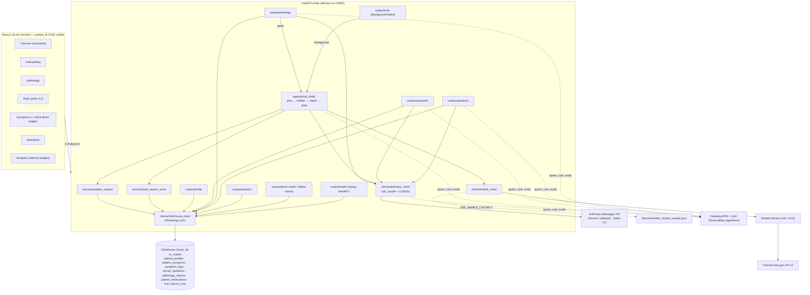

# TC Pilot — whole-project deep dive (Top Overall + Best Use of ClickHouse)

Analyst: ClickHouse Team A (deep-dive pass). Repo: `repos/clickhouse/tc-pilot` at HEAD `ac57e18` (20 commits, full history).

**Every source file was read:**
- all 18 backend Python modules
- all 7 Next.js pages, 17 components and 4 `lib/` modules
- `CLAUDE.md`, `API.md`, `run.sh`, configs and the Nimble fixture

Skimmed: `globals.css` (451 lines, design tokens) and `lib/mocks.ts` (mostly dead code). Labels: **[V]** verified with file:line, **[I]** inference.

---

## 1. At a glance

TC Pilot (in code, "TC Co-pilot") is a companion web app for people newly diagnosed with **testicular cancer**. Pitch: "if you recently got diagnosed with cancer … it's like your pilot" (demo 00:00–00:21). A patient creates an anonymous profile and then:
- pastes a pathology report and gets a plain-English explanation plus questions for the oncologist
- gets an agentic ClinicalTrials.gov search ranked for them
- logs daily symptom scores with a 14-day chart and an LLM trend summary
- keeps one merged prep sheet of doctor questions

A population **/analytics** page runs ClickHouse event-study queries over a synthetic 1,000-patient cohort ("Zofran lowered nausea 3.74 points").

Awards [V Devpost badges]: **Winner — Top Overall** and **Winner — Best use of ClickHouse** (Agentic Engineering Hack, NYC, 23 May 2026). Built by two engineers. Round 1: [`analysis/clickhouse/tc-pilot.md`](../archive/source-tree/analysis/clickhouse/tc-pilot.md).

New in this pass:
- **On `main` at the end of the event, the Trials page returned `MOCK_TRIALS` after a fake 1.1 s delay.** The real agent existed only on Akhil's laptop; the demo ran from there.
- **`patient_medications` has no writer except the admin seeder**, so the analytics showpiece cannot contain real-user data.
- The "agent" is a **fixed 4-step pipeline**, not a tool-choosing loop.
- A specced feature, symptom alerts becoming doctor questions, is missing.
- §14 below explains why the *whole product* was strong.

---

## 2. Repo map

```
tc-pilot/
├── CLAUDE.md          469-line build spec for coding agents (product, stack, schema, phases, demo script)
├── API.md             403-line endpoint contract shared by the two engineers
├── AGENTS.md          Next.js 16 boilerplate agent rule (generated by create-next-app)
├── README.md          create-next-app default (36 lines)
├── app/                         Next.js 16 App Router
│   ├── layout.tsx               fonts, ThemeProvider, TopBar, sonner Toaster
│   ├── page.tsx                 server component: cookie → /profile → greeting + 4 cards
│   ├── onboarding/page.tsx      creates UUID cookie, POST /profile, POST /symptoms/seed
│   ├── pathology/page.tsx       paste report → /translate-report (spinner waits for agent) + history
│   ├── trials/page.tsx          GET /find-trials/latest, polls every 4 s while pending; shows rationale
│   ├── symptoms/page.tsx        log scores, chart, Claude summary, custom symptom, client-only demo toggle
│   ├── questions/page.tsx       prep sheet: add / toggle / Claude "summarise into themes"
│   ├── analytics/page.tsx       3 ClickHouse cards with "Xms · ClickHouse" latency badges (recharts)
│   └── globals.css              design system (Instrument Serif / Geist, light+dark tokens)
├── components/ (17)             SymptomForm/Chart/Summary, ReportInput/Output, AgentTrialCard, TrialCard,
│                                QuestionList, PrepSheet, AddQuestion/SymptomInput, TopBar, Theme*, BrandMark
├── lib/
│   ├── api.ts                   single fetch wrapper; adds X-Patient-Id from cookie
│   ├── patient.ts               cookie helpers, crypto.randomUUID
│   ├── types.ts                 shared TS types
│   └── mocks.ts                 frontend-first mocks (only SAMPLE_REPORT still used)
├── backend/
│   ├── run.sh                   uv + ddtrace-run uvicorn :8000 --reload
│   ├── pyproject.toml / uv.lock
│   ├── scripts/test_nimble_structured.py   live Nimble smoke test
│   └── app/
│       ├── main.py              ddtrace patch, LLMObs.enable (agentless), CORS, routers, error shape
│       ├── bootstrap_env.py, config.py, deps.py (X-Patient-Id header dependency), models.py (pydantic)
│       ├── clients/clickhouse_client.py  DDL (7 tables), locked insert/query helpers, 3 analytics SQL
│       ├── clients/anthropic_client.py   call_claude + LLMObs llm span, cost metrics, evals
│       ├── clients/nimble_client.py      Nimble Extract → CT.gov API v2 → normalized trials
│       ├── agents/trial_finder.py        plan → nimble_search → match_eligibility → appointment_prep
│       ├── services/patient_context.py   ClickHouse → profile + latest pathology + 14-day trends
│       ├── services/trial_search_store.py run state machine in ReplacingMergeTree
│       ├── routes/ profile, symptoms, pathology, trials, questions, analytics, admin, health
│       └── fixtures/nimble_results_sample.json   cached CT.gov results (USE_NIMBLE_CACHE=1 only)
└── public/*.svg                 create-next-app placeholders (0 bytes)
```

**Lines of code** (tracked, excluding `pnpm-lock.yaml` and `uv.lock`) [V]:

| Language | Lines | Notes |
|---|---|---|
| Python | 2,994 | backend; 61 lines are a smoke-test script |
| TSX / TS | 2,869 | 2,480 TSX + 389 TS (of which `lib/mocks.ts` is 176, mostly dead) |
| CSS | 451 | hand-written design system |
| Markdown | 987 | CLAUDE.md 469, API.md 403 |
| Generated / scaffold | small | create-next-app configs, `AGENTS.md`, empty SVGs, README; no shadcn |

Hand-written application code: about **6,100 lines**. No tests and no CI [V].

---

## 3. System architecture

### Component diagram



### Sequence: the hero flow (pathology → agentic trials), as demoed

```mermaid
sequenceDiagram
  actor P as Patient
  participant FE as /pathology page
  participant API as POST /translate-report
  participant CH as ClickHouse
  participant C as Claude (Sonnet 4)
  participant AG as trial_finder
  participant N as Nimble → CT.gov v2
  participant DD as Datadog LLMObs

  P->>FE: paste report, "Translate"
  FE->>API: {reportText} + X-Patient-Id
  API->>CH: SELECT stage FROM patient_profiles FINAL   (span clickhouse-read)
  API->>C: system: "compassionate medical translator…" user: report
  C-->>API: {explanation, questions}  (+ evals: question_count, clean_json)
  API->>CH: INSERT pathology_reports   (span clickhouse-write)
  API->>CH: INSERT trial_search_runs status=pending
  API->>AG: await find_trials_for_patient(run_id)
  AG->>CH: load_patient_context: profile FINAL, latest report, 14-day avg per symptom
  AG->>C: Prompt A plan_trial_search → {location, page_size, must_match_terms, rationale}
  AG->>N: Extract https://clinicaltrials.gov/api/v2/studies?query.cond=…&filter.overallStatus=RECRUITING
  N-->>AG: studies[] → parse_studies_from_api (≤10, eligibility text ≤2000 chars)
  AG->>C: Prompt B match_eligibility → ranked trials with score, status, reasoning, 2 questions
  AG->>C: Prompt C build_appointment_prep → summary, 5–8 questions, themes
  AG->>CH: INSERT trial_search_runs status=completed (same run_id, JSON blobs)
  AG->>CH: INSERT doctor_questions source=trial-search (dedup vs FINAL)
  AG-->>DD: workflow find_trials_for_patient with 5 tool spans + 4 llm spans
  API-->>FE: {explanation, questions, trial_search_status:"completed"}
  FE->>API: POST /doctor-questions (report questions) ; GET /find-trials/latest
  FE-->>P: explanation, questions, toast "N trials matched" → /trials shows ranked cards + rationale
```

---

## 4. Component walkthrough

### 4.1 Backend core
- **`main.py`**
  - Imports `bootstrap_env` first so `.env` loads before any SDK; patches httpx for APM (`:1-8`).
  - Enables LLMObs agentless when `DD_LLMOBS_ENABLED` (`:16-28`).
  - Lifespan auto-creates tables, non-fatally (`:46-53`).
  - CORS is restricted to `FRONTEND_ORIGIN` + localhost with explicit headers (`:58-69`), which is good.
  - Uniform `{message, detail}` error envelopes (`:81-100`).
- **`deps.py:6-14`** — identity is whatever `X-Patient-Id` the client sends; no auth.
- **`models.py`** — strict pydantic I/O: `Stage = Literal["I","II","III"]`, `score: int = Field(ge=1, le=10)`, `age` 1–120 (`:11-55`). `TranslateReportIn.reportText` has no length cap (`:87-88`).

### 4.2 ClickHouse client (`clients/clickhouse_client.py`, 318 lines)
- **DDL** for 7 tables, kept as a dict of `CREATE TABLE IF NOT EXISTS` statements (`:29-105`). The DB is created through a bootstrap client with no database selected (`:122-132`). Idempotent `ADD COLUMN IF NOT EXISTS` migrations (`:141-146`).
- **One shared client behind a `threading.Lock`** for `insert_rows` / `query_all` (`:16-17, 198-213`). This fixed "concurrency crashes" (commit `fc54f0f` 14:35). The seeder bypasses the lock (`admin.py:175`).
- **Health gate:** write-then-read round trip (`:150-185`). Side effect: inserts a `health-check-*` row into `patient_profiles`, which inflates the analytics "Patients" KPI [V `:153-159`, `:227`].
- **Analytics**, each timed with `perf_counter` and returned as `query_ms`:
  - `analytics_overview` (`:219-239`)
  - `medication_impact` (`:242-281`)
  - `symptom_trends_population` (`:284-317`)

### 4.3 Claude client (`clients/anthropic_client.py`, 190 lines)
- `call_claude(system, user, feature_tag, model, span_name, max_tokens, patient_id, eval_fn)` (`:100-190`). Steps:
  1. Validates `feature_tag` against an allow-list (`:28-36, 120-121`).
  2. Opens an `LLMObs.llm` span.
  3. Calls `messages.create`.
  4. Annotates input, output, token counts and **USD cost** from a price table (`:19-24, 144-171`).
  5. Parses JSON leniently, returning `{"raw": text}` on failure (`:52-67`).
  6. Submits heuristic evaluations from `eval_fn` (`:175-188`).
- `feature_workflow` and `feature_task` context managers give every route a workflow span with `clickhouse-read` / `clickhouse-write` child tasks (`:70-97`).
- Defect: `async def` wraps the **synchronous** Anthropic client, so every LLM call blocks the event loop (`:132`) [V]. With one user at a demo this does not matter; with many it serializes [I].

### 4.4 Nimble client (`clients/nimble_client.py`, 264 lines)
- Uses Nimble **Extract** to fetch the official CT.gov API v2 JSON. The Studio "agents/run" path was dropped because "the required template was not published" (`:1-12`) [V].
- `build_api_url` builds `query.cond`, `filter.overallStatus=RECRUITING`, `pageSize` and `query.locn` (`:55-66`). `requirements` is accepted but **never sent** (`:38-45` vs `:55-66`).
- `parse_studies_from_api` maps `protocolSection` into a stable trial shape, truncating summary and eligibility to 2,000 characters (`:135-183`).
- Fixture fallback is used only when `USE_NIMBLE_CACHE=1` (`:203-223`). `/health/nimble` renders the JS search page with driver vx10 and counts `NCT\d{8}` matches (`:84-99, 226-264`).

### 4.5 The agent (`agents/trial_finder.py`, 360 lines)
- `find_trials_for_patient` (`:245-320`) is one `LLMObs.workflow` with five `LLMObs.tool` spans, run in a fixed order:
  1. `load_patient_context`
  2. `plan_trial_search` (Claude, Prompt A)
  3. `nimble_search`
  4. `match_eligibility` (Claude, Prompt B)
  5. `build_appointment_prep` (Claude, Prompt C)
- Planner output is sanitized: `page_size` clamped 5–20, deduped `must_match_terms`, default location (`build_search_query`, `:70-107`).
- Ranked rows are merged back onto canonical trial fields by URL, so the model cannot invent a phase or NCT id (`_normalize_ranked_trial`, `:216-239`) [V]. This is a nice hallucination dampener.
- On success, a `completed` row is written to `trial_search_runs`, and questions fan out into `doctor_questions` with text-level dedup (`:295-355`). On exception, a `failed` row with the note (`:310-318`).
- `LLMObs.flush()` in `finally` (`:319-320`).

### 4.6 Services
- **`patient_context.py`** — three ClickHouse reads build the LLM context: profile `FINAL`, latest pathology, and a **14-day `toDate` × symptom `avg` aggregate** (`:44-119`). `symptom_summary` is always `None` (`:118`).
- **`trial_search_store.py`** — a run state machine (`pending → completed | failed`) by re-inserting the same `(patient_id, run_id)` key into a ReplacingMergeTree. `latest_run` reads `FINAL ORDER BY updated_at DESC` (`:43-168`). The old column `nimble_params_used` is reused for `search_query_used` to avoid a migration (`:3-6`).

### 4.7 Routes
- **profile:** upsert by insert, read back `FINAL` (`profile.py:19-53`).
- **symptoms:**
  - `/symptoms/seed` inserts 4 defaults (`:37-48`).
  - `/symptom-log` writes an explicit naive-UTC `logged_at`, with a comment explaining a clickhouse-connect default-`now()` round-trip bug (`:78-93`).
  - `/symptom-validate` uses Claude to accept or reject a custom symptom and inserts it on success (`:96-141`).
  - `/symptoms/chart` returns a 14-day pivot (`:144-162`).
  - `/symptom-summary` uses **Haiku 4.5** over the 14-day aggregate and flags any symptom up ≥2 points (`:165-226`).
- **pathology:** described in the sequence diagram above (`pathology.py:46-121`); history endpoints at `:124-154`.
- **trials:** `/find-trials/latest` and the background `/find-trials` dev trigger (`trials.py:19-51`).
- **questions:**
  - add with dedup (`questions.py:48-64`)
  - list `FINAL` (`:67-89`)
  - toggle done by re-inserting the same RMT key (`:92-115`)
  - Claude summarise into themes with a `dedup_ratio` eval (`:118-180`)
- **analytics:** thin wrappers, with `days` bounded 7–365 (`analytics.py:12-37`).
- **admin:** synthetic cohort generator and mutation delete (`admin.py:94-219`); see §8.
- **health:** `/setup`, `/health/clickhouse`, `/health/claude`, `/health/llmobs`, `/health/datadog`, `/health/nimble`, `/health/nimble/structured`, `/health/datadog/config` (`health.py:12-174`). These are "sponsor gates" to prove each integration before building features (the CLAUDE.md phase-1 discipline).

### 4.8 Frontend
- **Home** is a server component: it reads the cookie and redirects to onboarding when the profile is missing or returns 404 (`app/page.tsx:14-27`).
- **Onboarding** creates the UUID cookie, then creates the profile and seeds symptoms (`onboarding/page.tsx:28-50`).
- **Pathology** shows one spinner while the server runs translation plus the whole agent. It then posts the report questions to the prep sheet and toasts the trial count (`pathology/page.tsx:52-100`).
- **Trials** polls every 4 s while pending and shows `planning_rationale` and `search_query_used`, so the user sees *how* the agent searched (`trials/page.tsx:32-38, 85-91`).
- **Symptoms:**
  - Request-ID guard against stale summary responses (`symptoms/page.tsx:62-66`).
  - **Demo toggle** swaps the chart to a hardcoded 14-day BEP-cycle series without touching the DB (`:19-48, 169-179`).
  - The Claude summary next to the toggled chart still describes the *real* DB data, so the two can disagree on screen [V `:83` vs `:178`].
- **Analytics** fires three requests in parallel, shows KPI cards, the medication-impact bar chart, population trend lines, latency badges and a "for demonstration purposes" footer (`analytics/page.tsx:74-80, 338-455`).

### 4.9 Infra, config, tests
- `run.sh` runs uv + `ddtrace-run uvicorn --reload` (`backend/run.sh:35-36`).
- No Dockerfile, no `vercel.json` (CLAUDE.md §2 says "Deploys to Vercel"), no CI, no tests.
- No hosted app ("deploy coming soon", Devpost).
- `__pycache__/*.pyc` files were committed in `55ddc34` and removed in the merge `bc0928a` [V `git show --stat`].

---

## 5. Data model

| Table | Engine / ORDER BY | Writers | Readers |
|---|---|---|---|
| `patient_profiles` | RMT() / patient_id | `/profile`, admin seed, `/health/clickhouse` | profile, pathology, context, overview |
| `patient_symptoms` | RMT() / (patient_id, symptom_name) | `/symptoms/seed`, `/symptom-validate`, admin | `/symptoms` |
| `symptom_logs` | MergeTree / (patient_id, logged_at, symptom_name) | `/symptom-log`, admin | chart, summary, context, analytics |
| `doctor_questions` | RMT() / (patient_id, added_at, id) | `/doctor-questions`, toggle, agent fan-out | questions, summarise |
| `pathology_reports` | MergeTree / (patient_id, created_at, id) | `/translate-report` | history, context |
| `patient_medications` | RMT() / (patient_id, medication_name) | **admin seed only** | `medication_impact`, overview |
| `trial_search_runs` | RMT() / (patient_id, run_id) | trial_search_store | `/find-trials/latest` |

DDL lives at `clients/clickhouse_client.py:29-105`. No version columns, partitions, TTL, `LowCardinality`, MVs or projections [V].

### Endpoints

| Method | Path | Handler | Notes |
|---|---|---|---|
| GET | `/` | `health.py:12` | liveness |
| POST | `/setup` | `health.py:17` | create tables |
| GET | `/health/clickhouse` | `health.py:29` | write+read gate |
| GET | `/health/claude`, `/health/llmobs`, `/health/datadog` | `health.py:40, 74, 103` | paid Claude call each |
| GET | `/health/nimble`, `/health/nimble/structured` | `health.py:154, 130` | paid Nimble call each |
| GET | `/health/datadog/config` | `health.py:56` | config echo, no secrets |
| POST/GET | `/profile` | `profile.py:19, 40` | |
| POST | `/symptoms/seed` | `symptoms.py:37` | |
| GET | `/symptoms` | `symptoms.py:51` | |
| POST | `/symptom-log` | `symptoms.py:78` | |
| POST | `/symptom-validate` | `symptoms.py:96` | Claude Sonnet |
| GET | `/symptoms/chart` | `symptoms.py:144` | |
| GET | `/symptom-summary` | `symptoms.py:165` | Claude Haiku 4.5 |
| POST | `/translate-report` | `pathology.py:46` | Claude + whole agent, synchronous |
| GET | `/pathology-reports`, `/pathology-reports/latest` | `pathology.py:124, 139` | |
| GET | `/find-trials/latest` | `trials.py:19` | |
| POST | `/find-trials` | `trials.py:28` | background agent |
| POST/GET | `/doctor-questions` | `questions.py:48, 67` | |
| POST | `/doctor-questions/{id}/done` | `questions.py:92` | |
| POST | `/doctor-questions/summarise` | `questions.py:118` | Claude Sonnet |
| GET | `/analytics/overview`, `/medication-impact`, `/symptom-trends` | `analytics.py:12, 21, 31` | no identity |
| POST | `/admin/seed-mock-cohort?count≤10000` | `admin.py:94` | **unauthenticated** |
| DELETE | `/admin/mock-cohort` | `admin.py:207` | **unauthenticated** |

**Env vars** (`backend/.env.example:1-27`, `config.py`, `lib/api.ts:8`):
- `ANTHROPIC_API_KEY`, `ANTHROPIC_MODEL` (example: `claude-sonnet-4-6`; code default `claude-sonnet-4-20250514`)
- `CLICKHOUSE_HOST/USER/PASSWORD/DATABASE`
- `NIMBLE_API_KEY`, `USE_NIMBLE_CACHE`
- `DD_API_KEY/SITE/SERVICE/ENV/LLMOBS_ENABLED/LLMOBS_ML_APP/LLMOBS_AGENTLESS_ENABLED`
- `FRONTEND_ORIGIN`
- frontend `NEXT_PUBLIC_API_URL`

---

## 6. AI / agent design

**Provider:** Anthropic Messages API through one wrapper. **Models:** default `claude-sonnet-4-20250514` (`anthropic_client.py:26`), Haiku 4.5 for the symptom summary (`symptoms.py:219`). `.env.example` sets `claude-sonnet-4-6`, and the price table knows both (`:19-24`). Devpost says "Sonnet 4 / Haiku 4.5", which matches.

| # | Feature tag / span | Model | System prompt (trimmed, quoted) | Output | Evals |
|---|---|---|---|---|---|
| 1 | `pathology` | Sonnet | "You are a compassionate medical translator helping a testicular cancer patient understand their pathology report… Only explain what is explicitly written in the report. Never add information not present. Define every medical term… generate 4-5 specific questions… Return JSON: {explanation, questions}" (`pathology.py:66-77`) | lenient JSON | question_count, explanation_words, clean_json (`:79-86`) |
| 2 | `symptom-validate` | Sonnet | "Determine whether the described symptom is a known or commonly reported side effect of testicular cancer or its standard treatments — BEP chemotherapy…, orchiectomy, or radiation… If not: … compassionate one-sentence message" (`symptoms.py:99-113`) | `{valid, symptom_name, display_name, message}`; insert if valid | accepted, clean_json |
| 3 | `symptom-summary` | **Haiku 4.5** | "…summary of what the trends show… Identify any symptoms that have increased by 2 or more points… Keep the summary to 3-4 sentences" (`symptoms.py:192-202`); input is the ClickHouse 14-day aggregate | `{summary, alerts[]}` | alert_count, summary_words, clean_json |
| 4 | `doctor-questions` | Sonnet | "Deduplicate near-identical questions, group related ones under short themed headings… Keep every distinct concern — do not drop questions." (`questions.py:140-148`) | `{themes[]}` | theme_count, output_questions, **dedup_ratio** |
| 5 | `trial-finder` / `plan_trial_search` | Sonnet | Prompt A: "clinical research assistant building inputs for a ClinicalTrials.gov v2 search via Nimble Extract. Return JSON only. Stage values must start with 'Stage '…" (`trial_finder.py:18-24`) | location, page_size, must_match_terms, rationale (sanitized `:70-107`) | none |
| 6 | `trial-finder` / `match_eligibility` | Sonnet, 4,096 max tokens | Prompt B: "Be conservative. Never tell the patient to enroll. Frame next steps as questions for their oncologist." (`:26-29`); user lists patient context, terms, candidate trials and the rubric (match_score 1–10, likely_fit/uncertain/unlikely_fit, 2–3 sentence reasoning, 2 questions) (`:147-164`) | `{trials[]}` merged onto canonical CT.gov fields | none |
| 7 | `trial-finder` / `build_appointment_prep` | Sonnet | Prompt C: "helping a testicular cancer patient prepare for their oncologist visit. Be conservative. Never tell them to enroll" (`:31-34`) | summary, 5–8 questions, themes | none |
| 8 | health gates | Sonnet | "health-check bot… Reply with exactly {…}" (`health.py:43-47, 79-83, 107-111`) | echo | none |

**Pattern:**
- **Deterministic orchestration with LLM steps.** Python decides the order; Claude never chooses tools. "Tools" are `LLMObs.tool` labels on the trace (`trial_finder.py:254-283`).
- No retries anywhere: one call, lenient parse, `{"raw": …}` on failure.
- No streaming, no tool-use API, no prompt caching.
- **Memory = ClickHouse.** Each step reloads context from tables (`patient_context.py`), and agent state persists as run rows (`trial_search_store.py`).
- The single most notable design choice: **ClickHouse aggregates, not raw rows, are the LLM context** (14-day `avg` per day per symptom).

**Safety framing** is built into the prompts:
- "Never tell the patient to enroll"
- "Only explain what is explicitly written"
- CLAUDE.md:16: "navigation tool, not a diagnostic tool… Every Claude output ends in a small muted disclaimer"

**Model naming:** no mismatch with claims. `.env.example`'s `claude-sonnet-4-6` differs from the code default, but both are priced (`:19-24`).

---

## 7. All integrations

| Service | Exact usage | Depth |
|---|---|---|
| **ClickHouse Cloud** | only datastore (7 tables); agent context loader (`patient_context.py:44-119`); agent run-state (`trial_search_store.py`); 3 analytics queries with latency (`clickhouse_client.py:219-317`); write+read health gate (`:150-185`) | **load-bearing, bordering core-to-the-pitch** (core for the analytics finale) |
| Anthropic Claude | 7 prompt sites through `call_claude` (`anthropic_client.py:100-190`) | core |
| Datadog APM + LLMObs | `ddtrace.patch(httpx)` (`main.py:8`); agentless LLMObs (`:16-28`); workflow/task/tool/llm spans; cost metrics; `submit_evaluation` (`anthropic_client.py:144-188`); `/health/datadog*` | load-bearing for the demo (shown live at 00:46–01:25) |
| Nimble | Extract over CT.gov API v2 (`nimble_client.py:69-132`) | load-bearing for trials (thin wrapper over CT.gov) |
| ClinicalTrials.gov API v2 | through Nimble (`:55-66`) | real public data source |
| Vercel | spec only; no config in repo | none |

---

## 8. Real vs. mock map

| Feature / claim | Status | Evidence |
|---|---|---|
| Plain-English pathology translation | **Real** (live Claude) | `pathology.py:66-96` |
| Report questions added to prep sheet | Real | `pathology/page.tsx:70-74` |
| Agentic trial search ranked for this patient | **Real in the demo**; on `main` at event end it was **mocked**: `setTrials(MOCK_TRIALS)` after `setTimeout(1100)` | `git show e96fdff:app/trials/page.tsx` ("TODO(backend): wire up the real /find-trials endpoint"); real agent `55ddc34` 16:28 on a local branch, merged 05-24 16:25 |
| Live ClinicalTrials.gov results | Real by default; fixture only if `USE_NIMBLE_CACHE=1` | `trial_finder.py:113-131` |
| Trial search "in the background at the same time" (demo 02:01) | **Partially true**: synchronous inside `/translate-report` | `pathology.py:110-112` |
| Planner's `must_match_terms` / requirements narrow the search | **Not sent to Nimble**; only steer ranking | `nimble_client.py:55-66`; prompt says so (`trial_finder.py:58`) |
| Symptom logging + 14-day chart | Real | `symptoms.py:78-162` |
| Chart "trend over time" in demo (01:47–01:56) | **Hardcoded client-side demo series** | `symptoms/page.tsx:19-48, 178` |
| Claude symptom trend summary + ≥2-point alerts | Real (Haiku) over real data | `symptoms.py:165-226` |
| Symptom alerts auto-added to prep sheet (`source: "symptom-alert"`) | **Missing** (specced in API.md:212 / CLAUDE.md:138; no writer) | grep: only display mapping in `QuestionList.tsx:8` |
| Custom symptom validated by Claude | Real | `symptoms.py:96-141` |
| Prep-sheet theme summarisation | Real | `questions.py:118-180` |
| Population analytics "real-time aggregation across all patients" | **Real SQL over synthetic data**; medication effects hardcoded | `admin.py:59-66, 79-88`; footer `analytics/page.tsx:451` |
| "Zofran improved nausea by 3.74 points, 7,000 data points" | Generator constant (−3.0) + chemo ramp read back | `admin.py:61, 69-76` |
| Real patients contribute to medication analytics | **Impossible**: no medication API or UI | grep: `patient_medications` written only in `admin.py:177-191` |
| Seeder "deterministic — same seed → same data" | **False**: `uuid4` ids and global `random.uniform` noise | `admin.py:103, 114, 87` |
| "Cross-querying four tables" in < 1 s (demo 03:31) | 3 tables (overview) / 2 (impact); sub-second plausible | `clickhouse_client.py:226-266` |
| Datadog traces with ClickHouse read/write spans | Real | `pathology.py:52, 99`; `symptoms.py:168-180` |
| Per-call cost and eval metrics in Datadog | Real (heuristic evals) | `anthropic_client.py:144-188` |
| "Lightweight mutations" delete | Classic `ALTER TABLE … DELETE` mutation | `admin.py:211-217` |
| Hosted on Vercel | Missing | no `vercel.json`; Devpost "deploy coming soon" |
| Auth / privacy | Missing (disclosed as future work) | `deps.py:6-14` |

Ratio for what the demo showed: about **80% real live computation**. The synthetic parts are the analytics cohort and the chart toggle, both disclosed on screen or in the footer [I]. That is the highest real-to-mock ratio of the three projects reviewed here.

---

## 9. Demo path trace (YouTube "TC Pilot Demo (WINNER)", 4:23; timestamps from round 1)

| Time | On screen | Code |
|---|---|---|
| 00:00–00:36 | hook, feature tour, onboarding | `onboarding/page.tsx:28-50` → `POST /profile`, `POST /symptoms/seed` |
| 00:36–00:46 | paste pathology report, Translate (likely `SAMPLE_REPORT`) | `components/ReportInput.tsx:4`; `POST /translate-report` |
| 00:46–01:03 | Datadog LLMObs trace list incl. ClickHouse read/write | `feature_workflow("pathology-translate")` + `feature_task("clickhouse-read"/"-write")` (`pathology.py:52-104`) |
| 01:03–01:25 | trial-search trace breakdown, "Nimble…" | `LLMObs.workflow("find_trials_for_patient")` + 5 tool spans (`trial_finder.py:252-283`) |
| 01:27–01:46 | add "ear ringing" | `AddSymptomInput.tsx:21` → `/symptom-validate` → insert `patient_symptoms` |
| 01:47–01:56 | chart, "kind of like the demo data" | client demo toggle (`symptoms/page.tsx:169-179`) |
| 01:59–03:22 | agent narration; open a real CT.gov link | `/trials` → `GET /find-trials/latest` → `AgentTrialCard.tsx` (url from `parse_studies_from_api`) |
| 03:27–04:20 | analytics: KPIs, Zofran/nausea, latency | `analytics/page.tsx:338-345` → `analytics_overview`, `medication_impact`, `symptom_trends_population` over the seeded cohort (`POST /admin/seed-mock-cohort` run before recording [I]) |

The demo ran on Akhil's local `akhil_working_branch` (the trial agent was not on `main` until the next day) [V git; I for the machine].

---

## 10. Code quality and security review

**Quality (best of the three projects reviewed here):**
- One wrapper per sponsor.
- Consistent server-side parameter binding (`{pid:String}`) on every user-input query [V across routes].
- Pydantic validation on inputs.
- A uniform error envelope.
- A comment wherever a workaround exists: naive-UTC `logged_at` (`symptoms.py:82-86`), column reuse (`trial_search_store.py:3-6`), Nimble pivot (`nimble_client.py:8-11`).
- Span naming is deliberate.

Gaps: no tests; sync SDK calls inside async routes (`anthropic_client.py:132`, `trial_finder.py:273` calls sync httpx with a 180 s timeout); no retries; spec drift (CLAUDE.md file paths and alert derivation); dead mocks.

**Security (for a cyberdefense audience):**

| # | Finding | Evidence | Severity [I] |
|---|---|---|---|
| T1 | **IDOR / no authentication.** Identity is a client-supplied header; any caller can read or write any patient's pathology reports, symptoms and questions by sending their UUID | `deps.py:6-14`; all routes | High (medical data) |
| T2 | **Unauthenticated admin**: seed up to 10,000 patients × 90 days (≈3.9M rows per call) and mass-delete | `admin.py:94-95, 207-217` | High (DoS, data integrity) |
| T3 | **Unauthenticated paid-API triggers**: `/health/claude`, `/health/llmobs`, `/health/datadog`, `/health/nimble*` each make a paid call; `/translate-report` runs 4 Sonnet calls + Nimble | `health.py:40-174` | Medium (cost abuse) |
| T4 | Prompt injection: pathology text goes straight to the user turn and flows into the agent's context and fan-out questions; no length cap | `pathology.py:88-94`; `models.py:87-88` | Medium |
| T5 | Health check writes junk rows into the production patient table | `clickhouse_client.py:153-159` | Low |
| T6 | f-string SQL `INTERVAL {days} DAY` (bounded by FastAPI 7–365) | `clickhouse_client.py:300`, `analytics.py:32` | Low (Semgrep would still flag) |
| T7 | `ALTER TABLE {table}` from a constant tuple | `admin.py:216-217` | None |
| T8 | CORS restricted to configured origin with explicit headers | `main.py:58-69` | Good |
| T9 | No secrets committed (`.env.example` blanks; no `.env` in history) | `git log` | OK |

---

## 11. Build history

All 20 commits fall between **2026-05-23 11:15 and 2026-05-24 16:25 EDT** [V].

| Hour (05-23) | Commits | Author | Content (insertions, excluding lockfiles) |
|---|---|---|---|
| 11:00 | 3 | Haris | scaffold + design system + 469-line CLAUDE.md; frontend phase 2 (+1,388); trials UI skeleton + API.md (+557) |
| 12:00 | 4 | Akhil | backend env setup (+1,620: FastAPI, clickhouse client, Claude, Nimble, Datadog); Nimble/Datadog fixes (+133); merges |
| 13:00 | 2 | Akhil | Nimble structured extract (+229) |
| 14:00 | 4 | Haris | concurrency-lock fix, pathology history, age (+1,128); **admin seeder + analytics endpoints + page** (+965, 14:57) |
| 15:00 | 4 | Haris | LLMObs evaluations (+317); client-side chart demo mode (+51) |
| 16:00 | 1 | Akhil | **agentic trial finder** (+1,330, 16:28, local branch) |
| 05-24 16:00 | 2 | Akhil | merge to main ("existed only on my local branch") |

- **Before the event:** a full practice build (`CLAUDE.md:22`: "Practice run lives at /Users/haris/code/applications/tc-demo") and the spec. The design system and spec landed 15 minutes after the start [V].
- **Final hour:** the whole agent (16:28). The analytics showpiece came about 1.5 h before that.
- **Post-deadline:** only the merge. Code content is unchanged from the 16:28 commit except the merge resolution of three route files (+397/−178 in `bc0928a`) [V].
- **Authors:** Haris ≈ 5,760 inserted lines (frontend, ClickHouse analytics, evals); Akhil ≈ 2,300 (backend bootstrap, Nimble, agent) [V `--numstat`]. Clean PR-based workflow (#1–#7).

---

## 12. How hard was this to build?

A skilled pair with Claude Code and a rehearsed spec can rebuild this in 5.5 hours, and the team showed it. Unrehearsed, a solo builder would likely ship pathology, symptoms and analytics, and cut the agent [I]. The hard parts:
1. **Sponsor plumbing.** Nimble's agent template was unavailable, which forced the pivot to Extract over the CT.gov API. ddtrace LLMObs needed agentless mode in local dev. The shared ClickHouse client crashed under concurrency until the lock was added. Each cost real time; the health-gate endpoints exist because of it.
2. **The agent's context and output shaping:** canonical-field merge, run state in RMT, question fan-out with dedup.
3. **Product polish across 7 pages:** design system, empty and error states, request-ID guard.

Easy parts: the analytics SQL (one query) and the synthetic seeder.

---

## 13. Reusable patterns and code

1. **Event-study SQL**: impact of an intervention ±14 days (`clickhouse_client.py:253-266`). In cyber, swap in "rule enabled / patch deployed" and "alerts per host":
   ```sql
   round(avgIf(sl.score, sl.logged_at <  toDateTime(pm.start_date)), 2) AS avg_before,
   round(avgIf(sl.score, sl.logged_at >= toDateTime(pm.start_date)), 2) AS avg_after,
   countIf(sl.logged_at <  toDateTime(pm.start_date)) AS n_before, …
   WHERE sl.logged_at BETWEEN toDateTime(pm.start_date) - INTERVAL 14 DAY AND … + INTERVAL 14 DAY
   GROUP BY medication, symptom HAVING n_before >= 5 AND n_after >= 5
   ```
2. **Latency badge on every analytics card**: `perf_counter` around the query → `query_ms` → `"38ms · ClickHouse"` (`clickhouse_client.py:222-238`, `analytics/page.tsx:74-80`).
3. **Agent run state in ReplacingMergeTree**: `ORDER BY (tenant, run_id)`, re-insert `pending → completed/failed` with JSON outputs, read `FINAL ORDER BY updated_at DESC LIMIT 1` (`trial_search_store.py:43-168`). Free audit trail of every agent run.
4. **ClickHouse aggregate as LLM context** (`patient_context.py:92-111`): a compact `toDate × entity → avg` table, not raw rows.
5. **LLM wrapper with cost + eval telemetry**: allow-listed feature tags, a per-call USD cost metric, cheap heuristic evals such as `clean_json` and `dedup_ratio` (`anthropic_client.py:100-190`). In a security demo, "cost per triaged finding" is a strong slide.
6. **Ground LLM rankings back onto canonical records by key** (`trial_finder.py:216-239`), so the model ranks and explains but cannot alter facts. For cyber: rank CVEs or findings, then merge severity, CVSS and asset fields from the source of truth.

**Avoid:**
- Header-supplied identity.
- Unauthenticated admin, seed and health routes that cost money.
- Sync SDKs in async handlers.
- Demo toggles that make the chart and the LLM summary disagree.
- Leaving the hero feature on an unmerged laptop branch.
- A specced feature (symptom-alert → questions) that silently does not exist.

---

## 14. Why the whole product was strong (Top Overall)

Ranked, all [I] unless marked:

1. **One emotionally clear user, four tightly linked jobs.** Every page feeds the same prep sheet (report questions, agent questions, self-added questions). The product has a loop, not a feature list. Judges outside the ClickHouse panel (Top Overall) reward coherence over breadth.
2. **Visible agent reasoning.** The Trials page shows *how* the agent searched (`planning_rationale`, `search_query_used`), and the Datadog trace shows each step with ClickHouse reads and writes, cost and evals. The "agentic" claim can be checked on screen, not just asserted.
3. **Real external data at the moment that matters.** The judge can click a live ClinicalTrials.gov link (03:16) produced by a real Nimble → CT.gov call [V code path].
4. **A quantified finale tied to the sponsor.** The analytics page ends the demo with numbers, a latency badge and "ClickHouse" written on the cards. For the ClickHouse prize, this is exactly the "React dashboards reading from ClickHouse made analytics feel instantaneous" value [V quote in round 1].
5. **Engineering discipline visible in the repo.** A spec-first CLAUDE.md and API.md, sponsor health gates, consistent parameter binding, safety-framed prompts and a coherent design system. It reads as a product, not a hackathon script.
6. **Honest labelling of synthetic data** ("for demonstration purposes" footer; "demo data" said aloud). This keeps credibility despite the synthetic cohort.
7. **Rehearsal.** A practice run the week before means the event day was execution, not discovery [V `CLAUDE.md:22`].

What a Cyberdefense entry should copy is the *shape*: one clear user, one loop, a visible agent trace, one real live data pull, and one quantified ClickHouse finale with on-screen latency. Then fix TC Pilot's security holes, because Semgrep and Pi Security judges will look for them.
