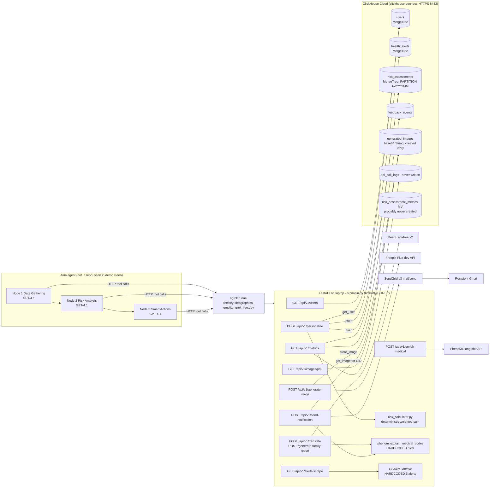
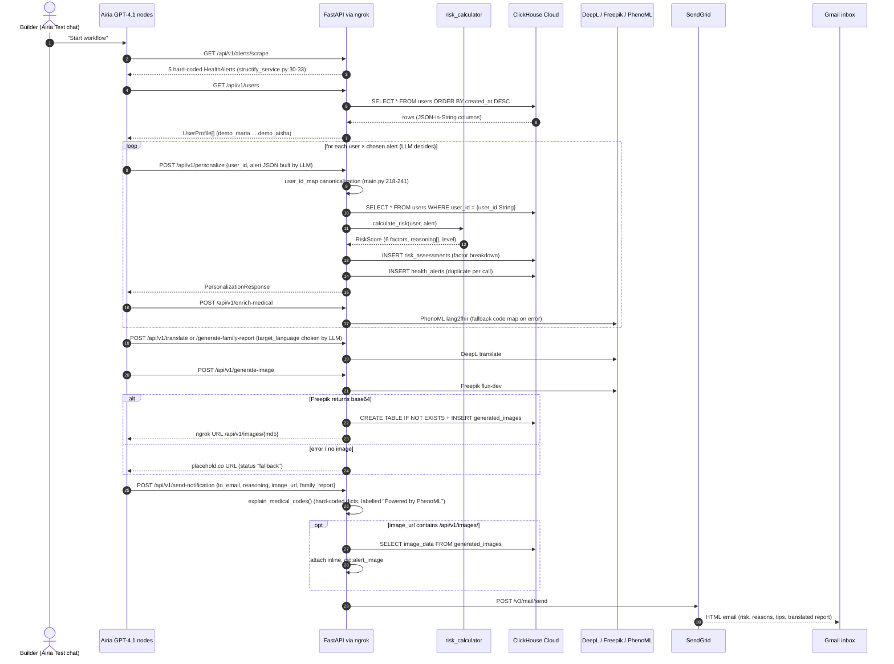

# Vital Signal (VitalSignal): whole-project deep dive

> Round 2 deep dive. Read-only analysis, 8 Oct 2026. Round-1 file: [`analysis/clickhouse/vital-signal.md`](../archive/source-tree/analysis/clickhouse/vital-signal.md).
> **[V]** = verified (file:line in `repos/clickhouse/vital-signal`, a URL, or a git hash). **[I]** = inference.
> All file:line references are to HEAD `4f2ae60` unless a commit hash is given.

---

## 0. Repo identity check: is this the judged project?

**Verdict: confirmed, about 97% confidence.** Evidence:

| Signal | Devpost (https://devpost.com/software/vital-signal, scraped 8 Oct 2026) | Repo | Match |
|---|---|---|---|
| Author | `richelgomez99`. The judge-test login is `gomezrichel99@gmail.com` | `git remote` is `github.com/richelgomez99/vitalsignal-backend`. Every commit author email is `gomezrichel99@gmail.com` **[V]** | Exact |
| Date | NYC AI Agents Hackathon, 4 Oct 2025 | First commit `93658be` at 2025-10-04 11:39 -0400. The last functional commit `b31177f` is at 16:25 -0400 **[V]**. `plan.md@93658be` says "~4.5 hours remaining until 4:30 PM submission" **[V]** | Exact |
| Architecture | "Airia ... 3 autonomous nodes", plus Structify, ClickHouse, PhenoML, DeepL, Freepik, SendGrid, FastAPI | `README.md:32-50` has the same 3-node diagram. Service files exist for all 5 non-Airia APIs (`src/services/*.py`) **[V]** | Exact |
| Specific story | "Base64 embedding blocked by Gmail → ngrok 405 → ClickHouse storage + SendGrid inline attachments with Content-ID" | `sendgrid_service.py:53-69` (CID attachment pulled from ClickHouse) and the hard-coded ngrok URL at `freepik_service.py:144` **[V]** | Exact |
| Example users | "Maria (São Paulo, diabetic) … Sarah (NYC, pregnant, flying to Brazil) … John (Tokyo, healthy)" | Same three personas in `scripts/init_db.py:52-186`. The cities differ: New York, Miami and Seattle. The README example (`README.md:82-87`) repeats the Devpost version exactly **[V]** | Same personas |
| Demo video | Airia tool calls on `demo_maria … demo_aisha` (round-1 frame review) | The ID map in `main.py:218-238` and the users in `add_high_risk_users.py:14-102` **[V]** | Exact |

Remaining uncertainty: Devpost does not link the repo. The judged *Airia agent configuration* (prompts, tool definitions) is not in any repo.

---

## 1. At a glance

VitalSignal is a solo-built "personal health guardian" agent. One disease-outbreak alert is scored separately for each stored user against their health conditions, current city, family members' cities and upcoming trips. Only the users at risk get an HTML email. The email holds a risk score, the reasons behind it, prevention tips, a translated "family-shareable report" and (in theory) an AI-generated poster. The pitch is **"Same alert → different outcomes for different people."** It won **ClickHouse 1st place** at the NYC AI Agents Hackathon (Datadog office, 4 Oct 2025). The ClickHouse blog confirms the result. An Airia no-code agent (3 GPT-4.1 nodes) orchestrates the work. This repo is the FastAPI tool backend those nodes call through ngrok. ClickHouse Cloud stores user profiles, the per-decision risk log and generated images.

---

## 2. Repo map

```
vital-signal/                        (HEAD 4f2ae60; venv/ untracked in 2026)
├── README.md                 374  Pitch, 3-node mermaid, setup, endpoint list, "Hackathon Alignment" rubric checklist
├── .env.example               23  Env template. Contains a real-looking ClickHouse Cloud hostname + sender email; secrets are placeholders
├── requirements.txt           32  fastapi 0.115, pydantic 2.9, clickhouse-connect 0.7.0, httpx, sendgrid (unused SDK), pytest (unused)
├── .gitignore                 56  Ignores *.md except README → planning docs were later dropped from git
├── add_high_risk_users.py    124  Seeds demo_sarah (dup), demo_kwame, demo_aisha
├── update_user_languages.py   22  One-off ALTER ... UPDATE on preferences (buggy, see §10)
├── test_structify.py          56  Probes 5 guessed Structify endpoints (exploration script)
├── static/images/dengue_d6aad2b4.jpg   Binary Freepik output from the earlier "save to disk" approach
├── scripts/
│   ├── init_db.py            245  Schema loader (broken splitter) + seeds demo_maria/john/sarah
│   ├── create_tables_manual.py 120  Workaround: creates the 4 core tables one by one
│   ├── quick_add_users.py     84  Simpler re-seed of the 3 base users
│   └── test_api.py           131  Prints risk breakdown for every user vs a São Paulo dengue alert (manual "test")
└── src/
    ├── __init__.py / utils/__init__.py   4
    ├── config.py              45  pydantic-settings Settings (all env vars, see §5)
    ├── models.py             274  Pydantic models + enums (UserProfile, HealthAlert, RiskScore, ...)
    ├── database_schema.sql   151  6 objects: 5 MergeTree tables + 1 SummingMergeTree MV
    ├── risk_calculator.py    477  Deterministic 6-factor weighted scorer + reasoning strings + disease×condition table
    ├── main.py               829  FastAPI app: 16 routes, CORS *, static mount, ID-mapping hack
    ├── utils/clickhouse_client.py 328  clickhouse-connect wrapper: users, alerts, assessments, feedback, metrics, images
    └── services/
        ├── structify_service.py 152  Returns 5 hard-coded alerts (no network call)
        ├── phenoml_service.py   227  1 real lang2fhir call + hard-coded "patient explanation" dictionaries
        ├── deepl_service.py      79  Real DeepL free-tier call + fake "[LANG] text" fallback
        ├── freepik_service.py   201  Real Flux-dev call → ClickHouse; placehold.co fallbacks
        └── sendgrid_service.py  281  Real SendGrid v3 call, 150-line inline-styled HTML template, CID attachment
```

**Lines of code (hand-written, excluding venv, lockfiles and binaries)** **[V]** (`wc -l`):

| Language | Lines | Notes |
|---|---|---|
| Python, `src/` | 2,897 | main 829, risk 477, services 940, CH client 328, models 274, config 45, init 4 |
| Python, scripts and root helpers | 782 | Seed, probe and manual-test scripts |
| SQL | 151 | `src/database_schema.sql` |
| Markdown | 374 | README only. Another ~3,400 lines of AI-style planning docs existed in early commits and were deleted in `902c64b` |
| **Total code** | **≈3,830** | Python 3,679 + SQL 151 |

No scaffolding, vendored or generated code is present (no frontend at all). Docstrings and the HTML email template inflate the count: perhaps 35-40% of `src/` is docstrings, comments and template strings **[I]**. The *logic* is closer to 1,800 lines. The style (exhaustive docstrings, "Phase 1" commit names, `plan.md`/`tasks.md`/`issues.md`, emoji prints) strongly suggests AI-assisted generation **[I]**.

---

## 3. System architecture

### 3a. Component diagram (as found in code)



### 3b. Sequence diagram: the demo run ("Start workflow" → emails)



---

## 4. Component walkthrough

### 4.1 FastAPI app: `src/main.py` (829 lines)
- **Bootstrap.** App metadata is at 32-38. CORS allows `*` origins *with* `allow_credentials=True` (41-47). `/static` is mounted from `static/` (50). The startup hook runs a ClickHouse `SELECT 1` health check (53-64) **[V]**.
- **Users.** List (99-113), get (116-138) and create (141-180). Create builds `user_<epoch>` IDs. It drops `travel_plans` and `medications` from the input, because `UserCreate` has no such fields (`models.py:119-127`) **[V]**.
- **`/personalize`, the core (183-278).** It canonicalises the LLM-supplied `user_id` through a hard-coded 17-entry map (218-241), loads the profile (244) and calls `risk_calculator.calculate_risk` (254). It persists the assessment (258) and *re-inserts the alert on every call* (261; the comment "Save alert if not exists" is false) **[V]**. `apis_called` is initialised `[]` (215) and never appended to, so `external_apis_called` is always `"[]"` **[V]**. `processing_time` is measured *before* the DB writes (257), so it records only the in-memory scoring time **[V]**.
- **Alerts.** `/alerts/scrape` (281-316) delegates to `structify_service`, which ignores the `disease` filter **[V]** (`structify_service.py:20-33`).
- **Medical.** `/explain-disease` (352-377) → hard-coded explainer. `/enrich-medical` (380-414) → real PhenoML call.
- **Translation.** `/translate` (428-450). `/generate-family-report` (453-590) builds a 70-line English f-string guide from the hard-coded "PhenoML" explainer, then sends the whole thing to DeepL (569-572) **[V]**.
- **Images.** `/generate-symptom-visual` (593-614) and `/generate-prevention-poster` (617-639) return **placehold.co URLs only** (`freepik_service.py:58-76`). `/generate-image` (642-664) is the real Freepik path. `/images/{id}` (792-819) serves base64 from ClickHouse as JPEG **[V]**.
- **Notifications.** `/send-notification` (667-705) calls the hard-coded explainer and then SendGrid **[V]**.
- **Learning.** `/feedback` (708-747) stores a row with `original_risk_score=0.0` and `original_risk_level="medium"` hard-coded (727-728). It has a `# TODO: Update user's learned weights` (740) **[V]**.
- **Metrics.** `/metrics` (750-770) wraps `db_client.get_metrics()` **[V]**.
- **Error handlers (774-789)** return plain `dict`s. FastAPI exception handlers must return a `Response`, so any 404/500 routed here would itself fail **[I, high confidence]**.

### 4.2 Risk engine: `src/risk_calculator.py` (477 lines)
- Six factors, each in [0,1] **[V]**:
  - `base_severity`: severity enum weight 0.2-1.0, averaged with mortality/10 (141-150).
  - `health_vulnerability`: the max over conditions of `disease×condition multiplier × condition-severity weight`, capped at 1 (152-177). Unknown conditions get multiplier 1.0, so *any* condition yields ≥0.3.
  - `geographic_proximity`: string match on the "City, Country" split. Same city → 1.0, same country → 0.6, unknown location → 0.3, else 0.1 (179-206). This replaced Haversine ("For MVP: string matching").
  - `family_exposure`: same-city family member → 0.8, same-country → 0.4 (208-232).
  - `travel_risk`: a future trip to the city within 14 days → 1.0, later → 0.7, same country → 0.5 (234-269).
  - `learned_preference`: `user.learned_weights[disease]`, default 0.5 (271-283). Nothing ever writes it.
- Composite = 0.25·sev + 0.25·health + 0.15·geo + 0.15·family + 0.15·travel + 0.05·learned (285-310). That is multiplied by a risk-tolerance factor (1.5 / 1.0 / 0.7) and capped at 1 (95-98).
- Level thresholds: CRITICAL ≥0.70, HIGH ≥0.50, MEDIUM ≥0.35, LOW ≥0.20 (312-323). They were lowered in commit `502470a` at 16:10, 15 minutes before the final commit, "to catch more HIGH risk" **[V]**.
- Reasoning strings are template sentences chosen by factor thresholds (325-373). Actions: CRITICAL → immediate alert + email, HIGH → email, otherwise log only (375-388).
- `needs_translation` requires `preferred_language != "en"` (110-114). Every seeded user has `"en"` (`init_db.py:97,181`, `add_high_risk_users.py:38,70,98`), so **the backend never flags a translation**. The PT-BR and AR choices in the demo came from the LLM **[V code, I for the demo]**.
- The knowledge table covers 5 diseases × 3-7 conditions (431-473). The disease key is matched case-sensitively against `alert.disease` (165) **[V]**. `add_high_risk_users.py` gives Aisha `"hiv"` (not `"hiv/aids"`) and severity `"high"` (not in mild/moderate/severe). Her malaria vulnerability therefore falls back to 1.0 × 0.6 = 0.6 **[V]**.

### 4.3 ClickHouse client: `src/utils/clickhouse_client.py` (328 lines)
This is a singleton created at import time (327-328). On a connection failure it prints and leaves `client=None` (33-35), and every later call raises `AttributeError`, which the per-method `except` swallows **[V]**. Methods: `create_user` (48-79), `get_user` with server-side parameter binding (84-87), `get_all_users` (98-105), `save_alert` (131-156), `save_risk_assessment` (159-189), `save_feedback` (192-208), `get_metrics` (211-255), `log_api_call` (257-277, **dead code**), `store_image` (280-308, which runs DDL on every call) and `get_image` (310-324, client-side `%(image_id)s` binding). Details in §7.

### 4.4 Service wrappers: `src/services/`
- **structify_service.py.** `scrape_who_alerts` prints a message and `return self._get_fallback_alerts()` (30-33). The rest is a comment ("TODO: Enable live Structify data once API endpoint is confirmed", 35-38). `_parse_date` and `_map_severity` (40-85) are dead code. The 5 alerts (87-148) carry real WHO DON URLs from 2024 with `published_at=utcnow()` **[V]**. History: at 12:30 (`fbbb237`) it POSTed to a guessed `https://api.structify.ai/v1/extract` with a JSON schema. That call evidently failed, and `test_structify.py` probes 5 more guessed endpoints **[V]**.
- **phenoml_service.py.** Two very different halves **[V]**:
  - `enrich_disease` (90-136) is a real `POST {base}/lang2fhir/create` with a Bearer token (110-124), FHIR parsing (138-177) and a 5-disease code fallback (179-223).
  - `explain_medical_codes` (15-40), which feeds **every email and family report**, is **pure hard-coded dictionaries** for 5 diseases (42-88). It never calls PhenoML. It also ignores the incoming codes, which are `""` from `main.py:684-685` anyway.
  - Config mismatch: `.env.example:10` names the variable `PHENOML_AUTH_TOKEN`, but `config.py:26` reads `phenoml_api_token`. With the example env, the real call is skipped and the fallback runs (102-105) **[V]**.
- **deepl_service.py.** A real call to `api-free.deepl.com/v2/translate` (33-58). On any error it returns `"[PT-BR] <original English>"` with no error status (68-75) **[V]**.
- **freepik_service.py.** A real `POST /v1/ai/text-to-image/flux-dev` (100-118). It base64-decodes the result and stores it in ClickHouse under `image_id = md5(disease+severity+location)[:16]` (136-140). It returns a **hard-coded ngrok URL** (144). A `job_id` polling branch (157-167) and placehold.co fallbacks (179-197) exist. The constructor creates `static/images` (19-20), left over from the earlier on-disk approach **[V]**.
- **sendgrid_service.py.** Builds the HTML (127-277) and fetches the image from ClickHouse when the URL contains `/api/v1/images/`, attaching it inline as `cid:alert_image` (53-69). It posts to `/v3/mail/send` (90-99). **A non-202 response is reported as `status: "queued"` with "(demo mode)"** (108-117), which silently fakes success **[V]**. Note the alt texts: the CID branch uses `alt="Health Alert Visual"` (158) and the external-URL branch uses `alt="Alert Visual"` (162) **[V]**.

### 4.5 Scripts, config, infra and tests
- **No Dockerfile, CI, deploy config or real tests.** `pytest` is pinned but no `test_*.py` uses it. `scripts/test_api.py` is a print-based smoke script **[V]**.
- `scripts/init_db.py:28` filters out statements that start with `--`. Every statement in the schema file starts with a comment line, so **init_db creates nothing**. `create_tables_manual.py` (11-101) is the workaround, and it creates only `users`, `health_alerts`, `risk_assessments` and `feedback_events` **[V]**. → `api_call_logs` and the MV almost certainly never existed **[I, high]**.
- Seeding: `init_db.py` (Maria, John, Sarah Johnson), `quick_add_users.py` (the same 3) and `add_high_risk_users.py` (Sarah **Chen**, Kwame, Aisha). MergeTree does not deduplicate, so `demo_sarah` exists twice. `get_user` takes `result_rows[0]` (92), so whichever Sarah comes back is arbitrary **[V code, I effect]**. The demo email shows "Sarah Chen", the second seed.
- `update_user_languages.py:7-18` runs `preferences = JSONExtractString(preferences,'preferred_language','es')`. That navigates the nested path `preferred_language → es` on a scalar and returns `''`. Run as written, it would blank the preferences column and make `json.loads('')` throw in `_row_to_user`, which kills `get_all_users` for everyone. Maria still worked in the demo, so the script was probably never run against the demo DB **[I]**.

---

## 5. Data model

### 5.1 ClickHouse tables (`src/database_schema.sql`) [V]

| Object | Engine / keys | Columns of note | Live? |
|---|---|---|---|
| `users` (5-33) | `MergeTree ORDER BY (user_id, created_at)` | 7 JSON-in-`String` columns: conditions, meds, allergies, family, travel, preferences, learned_weights | Yes (read on every personalize) |
| `health_alerts` (36-61) | `MergeTree ORDER BY (disease, published_at)` | severity String, `icd10_codes`/`snomed_codes`/`fhir_data` JSON strings (always `[]`/`{}` in practice) | Write-only, duplicated per call |
| `risk_assessments` (64-98) | `MergeTree PARTITION BY toYYYYMM(calculated_at) ORDER BY (user_id, calculated_at)` | 6 factor floats, risk_level, score, confidence, actions, reasoning, processing_time_ms, external_apis_called | Write on every personalize; read by /metrics |
| `feedback_events` (101-116) | `MergeTree ORDER BY (user_id, created_at)` | feedback_type, comment, original score/level (hard-coded) | Write-only |
| `api_call_logs` (119-137) | `MergeTree ORDER BY (service_name, called_at)` | per-call latency/status | **Never created** (manual script) and **never written** (`log_api_call` unused) |
| `risk_assessment_metrics` MV (140-151) | `SummingMergeTree ORDER BY (date, risk_level)` | count(), **avg()** columns | **Never created** [I]. Also wrong: `avg()` in a SummingMergeTree gets *summed* on merge. The correct pattern is `AggregatingMergeTree` + `avgState` |
| `generated_images` (`clickhouse_client.py:284-293`) | `MergeTree ORDER BY created_at` | `image_data String` (base64) | Created lazily in the request path; yes |

### 5.2 API routes (`src/main.py`) [V]

| Method | Path | Line | Does |
|---|---|---|---|
| GET | `/` | 67 | API info |
| GET | `/health` | 79 | DB `SELECT 1` health |
| GET | `/api/v1/users` | 99 | All profiles (full health PII), no auth |
| GET | `/api/v1/users/{user_id}` | 116 | One profile |
| POST | `/api/v1/users` | 141 | Create profile |
| POST | `/api/v1/personalize` | 183 | Score user×alert, log to CH |
| GET | `/api/v1/alerts/scrape` | 281 | 5 canned alerts |
| GET | `/api/v1/explain-disease` | 352 | Hard-coded explainer |
| POST | `/api/v1/enrich-medical` | 380 | PhenoML lang2fhir |
| POST | `/api/v1/translate` | 428 | DeepL |
| POST | `/api/v1/generate-family-report` | 453 | Template + DeepL |
| GET | `/api/v1/generate-symptom-visual` | 593 | placehold.co URL |
| GET | `/api/v1/generate-prevention-poster` | 617 | placehold.co URL |
| POST | `/api/v1/generate-image` | 642 | Freepik → CH |
| POST | `/api/v1/send-notification` | 667 | SendGrid email to **any** address |
| POST | `/api/v1/feedback` | 708 | Store feedback |
| GET | `/api/v1/metrics` | 750 | Aggregates over CH |
| GET | `/api/v1/images/{image_id}` | 792 | Serve image from CH |

Pydantic models: `src/models.py:10-274`. `EmailNotificationRequest` is defined twice, once with `EmailStr` (`models.py:77`) and again with plain `str` (`main.py:339`). The `main.py` version, without validation, is the one in use **[V]**.

### 5.3 Environment variables (`src/config.py:10-35`) [V]
`ENVIRONMENT`, `API_HOST`, `API_PORT`, `LOG_LEVEL`, `CLICKHOUSE_HOST`*, `CLICKHOUSE_PORT` (8443), `CLICKHOUSE_USER`, `CLICKHOUSE_PASSWORD`*, `CLICKHOUSE_DATABASE`, `CLICKHOUSE_SECURE`, `STRUCTIFY_API_KEY`* (required yet unused), `PHENOML_API_TOKEN`, `PHENOML_BASE_URL` (default `https://experiment.app.pheno.ml`), `DEEPL_API_KEY`*, `FREEPIK_API_KEY`*, `SENDGRID_API_KEY`*, `SENDGRID_FROM_EMAIL`*, `AIRIA_API_KEY`, `AIRIA_WEBHOOK_SECRET` (both unused). * = required, so the app will not boot without them.

---

## 6. AI / agent design

- **There are zero LLM calls in the repo** **[V]** (no OpenAI/Anthropic/etc. imports; `grep` shows only httpx calls to the five REST services). All "intelligence" in code is the deterministic scorer in §4.2.
- **The agent lives entirely in Airia**, a hosted no-code builder. From the demo video (round-1 frame review) **[V video, round 1]**: 3 sequential nodes (Data Gathering → Risk Analysis → Smart Actions), each GPT-4.1, with the FastAPI endpoints registered as custom HTTP tools. Prompt fragments seen on screen: "Process ALL 5 users completely. For EACH user (demo_maria, demo_john, demo_sarah, demo_kwame, demo_aisha)… Call 'Personalize Risk Assessment'", and a tool description saying "CRITICAL: … Use EXACTLY this user_id". Run stats: 26,245 tokens, $0.0734, 70.4 s.
- **The orchestration pattern is a linear pipeline of LLM nodes with a deterministic scoring tool.** The LLM decides which alert goes with which user, assembles the `HealthAlert` JSON passed to `/personalize`, picks the translation language, chooses the recipient address and composes the email-tool arguments. It has no memory beyond Airia's node-to-node context. There are no retries in the backend.
- **Signs of LLM fragility in the code** **[V]**:
  1. The `user_id_map` (`main.py:217-241`) exists because the model invented IDs like `maria_silva_id`.
  2. `PersonalizationRequest` takes a full `alert` object (`models.py:202-205`) instead of an `alert_id`, so the LLM can create alerts the scraper never returned. The demo emails show COVID-19 (Maria) and "dengue em Chicago" (Sarah). Neither is among the 5 canned alerts, and no seeded Sarah lives in Chicago **[V code; I that the LLM fabricated them]**.
  3. Seeded emails are `@example.com` (`init_db.py:55`, etc.), yet the demo emails arrived in a real Gmail inbox. `to_email` is free text in the tool call, so the Airia prompt must have overridden recipients **[I, high]**.
- **Model name vs claim.** Devpost says "multi-agent". It is one Airia agent with 3 LLM steps. "Non-deterministic risk engine" is false for the backend. The only non-determinism is the LLM's routing.

---

## 7. All integrations

| Integration | Where | What is actually used | Depth |
|---|---|---|---|
| **ClickHouse Cloud** (sponsor) | `clickhouse_client.py:24-31` connect; `84-87` param query; `159-189` decision log insert; `211-246` aggregates; `280-324` image BLOB; `main.py:244,258,261,758,807`; `sendgrid_service.py:57-59` | MergeTree tables, monthly partition, server-side typed params `{x:String}`, `count()/avg()/GROUP BY`, `EXISTS TABLE`, lazy DDL. **No** MV, TTL, LowCardinality, JSON/Map/Array, ReplacingMergeTree or vector search in the live path | **Load-bearing (light)**. System of record for profiles (every decision reads it) and decisions. Feature use is basic |
| Airia (sponsor at that event) | Not in repo; `README.md:32-50`; demo | The whole agent loop | Core-to-the-pitch (external) |
| Structify | `structify_service.py:30-33` | Nothing; canned data | **Decorative** (claimed "189 real-time alerts") |
| PhenoML | `phenoml_service.py:110-124` real; `15-88` hard-coded | lang2fhir code lookup on `/enrich-medical` only; the "Powered by PhenoML" email box is hard-coded text | Thin wrapper / partly decorative |
| DeepL | `deepl_service.py:42-50` | `/v2/translate` free tier | Thin wrapper, real |
| Freepik | `freepik_service.py:102-118` | Flux-dev text-to-image | Thin wrapper, real (with silent fallback) |
| SendGrid | `sendgrid_service.py:90-99` | v3 mail/send + inline CID attachment | Load-bearing for the demo artifact |
| ngrok | `freepik_service.py:144` | Hard-coded public tunnel host | Infra hack |
| placehold.co | `freepik_service.py:60,70,190` | Placeholder images | Mock |

---

## 8. Real vs. mock map

| Feature / claim (source) | Status | Evidence |
|---|---|---|
| User profiles stored in ClickHouse (Devpost, blog) | **Real** | `clickhouse_client.py:48-128`; `main.py:244` |
| Personalised multi-factor risk score (Devpost "8+ factors") | **Real but 6 factors**, deterministic. Age, medications and allergies are stored and never scored | `risk_calculator.py:74-79, 285-310` |
| "Non-deterministic", "true autonomy" | **Misleading**: fixed weighted sum; thresholds hand-tuned at 16:10 | `risk_calculator.py:292-323`; commit `502470a` |
| Every decision logged to ClickHouse | **Real** | `main.py:258`; `clickhouse_client.py:159-189` |
| "Structify scrapes 189 real-time WHO/CDC alerts … not mock data" | **Hard-coded** (5 alerts) | `structify_service.py:30-33, 87-148` |
| PhenoML medical codes (FHIR/SNOMED/ICD-10) | **Partially real**: real API on `/enrich-medical`; fallback map on error; codes never flow into emails (passed `""`) | `phenoml_service.py:90-136`; `main.py:682-686` |
| "Patient-friendly explanations via PhenoML" in every email | **Hard-coded** dictionaries, 5 diseases, generic text otherwise | `phenoml_service.py:15-88` |
| Family report translated to 20+ languages | **Real** DeepL; fallback returns English with a `[XX]` tag | `deepl_service.py:33-75` |
| Language chosen per family | **LLM-decided**, not backend (all prefs `"en"`) | `risk_calculator.py:110-114`; seed files |
| Freepik AI alert image | **Real call** with silent placeholder fallback | `freepik_service.py:95-177` |
| Symptom visual / prevention poster endpoints | **Mocked** (placehold.co) | `freepik_service.py:58-76` |
| "ClickHouse stores images as BLOBs", inline in email | **Real code path**, but **not what the demo emails show**: the broken image's alt text "Alert Visual" (round-1 frames ~1:28/1:36) is the external-URL branch (`sendgrid_service.py:162`), not the ClickHouse CID branch (`:158`, alt "Health Alert Visual"). The emailed image was a non-ClickHouse URL, most likely the placehold.co fallback | `sendgrid_service.py:152-162` [V code; I demo] |
| Personalised emails sent | **Real** SendGrid; non-202 is reported as "queued (demo mode)" | `sendgrid_service.py:101-117` |
| Behavioural learning from feedback | **Missing** (stored, never applied; TODO) | `main.py:727-741`; `risk_calculator.py:271-283` |
| API-call monitoring / metrics | **Partially real**: counts by risk level work; `api_call_logs` is never written | `clickhouse_client.py:211-277` |
| Materialized view metrics | **Missing** (never created; also incorrectly designed) | `database_schema.sql:140-151`; `init_db.py:28` |
| Haversine geo proximity | **Missing**: city/country string equality | `risk_calculator.py:179-206` |
| "Production-ready" | **No**: no auth, laptop + ngrok, hard-coded tunnel URL | §10 |

**Rough ratio:** of the 17 rows, about 6 are real, 4 partial and 7 mocked, hard-coded or missing. Weighted by what the demo exercised, the system is **≈50% real**. The real half (ClickHouse profiles, the scorer, the decision log, DeepL, SendGrid) is the half the demo's visible output depends on.

---

## 9. Demo path trace

Mapped onto the 108-second silent recording (timestamps from round 1):

| ~Time | On screen | Code that ran |
|---|---|---|
| 0:00-0:08 | Airia canvas, "Start workflow" | Airia only |
| 0:08 | "Scrape WHO Alerts" tool | `main.py:281` → `structify_service.py:33`, 5 canned alerts |
| 0:16 | "Get VitalSignal Users" (the only on-screen ClickHouse moment) | `main.py:99` → `clickhouse_client.py:101` `SELECT * FROM users ORDER BY created_at DESC` |
| 0:24-0:40 | Risk Analysis node, "Personalize Risk Assessment", "Enrich with Medical Codes" | `main.py:183-278` → `risk_calculator.calculate_risk` → CH inserts (`:258`, `:261`); `/enrich-medical` → PhenoML lang2fhir |
| 0:48-1:12 | JSON tool calls such as `generate_alert_image {Malaria, MEDIUM, Addis Ababa}` and translate `AR` | `/generate-image` → Freepik (→ CH store, or placehold fallback); `/translate` or `/generate-family-report` → DeepL |
| 1:20 | Summary: tokens, cost, per-user languages | Airia output |
| 1:28 | Gmail: COVID-19, HIGH 0.51, "Why this matters", "Medical Information (Powered by PhenoML)", broken "Alert Visual" | `/send-notification` → `explain_medical_codes` (hard-coded; COVID-19 isn't in its map, so it gets the generic "is an infectious disease requiring medical attention") → `sendgrid_service._build_email_html` external-image branch (`:162`) → SendGrid |
| 1:36 | Malaria (Ethiopia) MEDIUM 0.40 | Same path |
| 1:44 | Portuguese family report "Sarah Chen … dengue em Chicago" | `/generate-family-report` + DeepL. The "Chicago" location came from the LLM, not from any seeded profile [I] |

The ICD-10/SNOMED line in each email renders blank, because `main.py:684-685` passes empty strings into a dict that just echoes them back (`phenoml_service.py:35-38`) **[V]**.

---

## 10. Code quality and security review

**Structure (B).** Clean layering: config → models → services → client → routes. Pydantic models throughout, with type hints on most functions. It is readable, though over-documented.

**Error handling (D).** Errors are silent everywhere:
- `except: print` that returns `False`, `[]` or `None` (`clickhouse_client.py`, all methods).
- Bare `except:` (`:44`).
- Every external service fakes success on failure (DeepL `[XX] text`, SendGrid "queued", Freepik placeholder, PhenoML fallback codes).
- `HTTPException(404)` raised inside `try` is caught and re-raised as 500 (`main.py:806-819`).
- Exception handlers return dicts (`main.py:774-789`).
- The connection singleton is built at import time, and a failed connect leaves `client=None` (`clickhouse_client.py:33-35`).

**Correctness bugs found [V]:**
- The schema splitter skips everything (`init_db.py:28`).
- The MV design is wrong (`avg` in SummingMergeTree).
- `update_user_languages.py` would corrupt preferences.
- The duplicate `demo_sarah` makes the profile nondeterministic.
- Alerts are re-inserted per call.
- `processing_time` is taken before the I/O.
- `apis_called` is never filled.
- `create_user` drops travel and medications.
- The `PHENOML_AUTH_TOKEN` vs `phenoml_api_token` env mismatch.
- `store_image` runs DDL on every image.
- The md5 image ID collides across users who share the same disease, severity and location (fine for caching, but the same row is re-inserted each time).
- The README's `/personalize` curl example (`README.md:243-254`) omits the required `alert_id`, `title`, `description`, `source` and `published_at`, so it would 422.

**Tests (F).** None. Only print scripts exist.

**Security (highly relevant to a cyberdefense audience):**

| Issue | Location | Severity |
|---|---|---|
| **No authentication on any endpoint**, while the server is exposed publicly through ngrok | `main.py` (all routes); `freepik_service.py:144` | High |
| **Unauthenticated PII/PHI disclosure**: `GET /api/v1/users` returns every profile with health conditions, family members' names and cities, and travel plans | `main.py:99-113` | High |
| **Open email relay plus HTML injection**: `/send-notification` takes an arbitrary `to_email` and interpolates `user_name`, `reasoning[]`, `disease_name` and `family_report` raw into HTML (`sendgrid_service.py:167,214,219,255`). Anyone could send phishing mail from the builder's verified SendGrid sender | `main.py:667-705` | High |
| CORS `*` with `allow_credentials=True` | `main.py:41-47` | Medium (no cookies used, but a bad default) |
| Judge test credentials (Airia login + password) posted publicly on Devpost; a ClickHouse Cloud hostname is in `.env.example:2` | Devpost; `.env.example` | Medium / Low |
| Unbounded `POST /users` and `/feedback` (data-pollution DoS on ClickHouse) | `main.py:141, 708` | Low |
| SQL injection | Not found: the user-input queries use bound parameters (`clickhouse_client.py:84-87, 313-316`); the string-built SQL is constant | OK |
| Secrets in git | **Correction to round 1:** a scan of every added `*KEY/TOKEN/PASSWORD/SECRET=` line across history (excluding venv) found **only placeholders** (`.env.example@93658be`, README@`902c64b`). No real keys found [V heuristic, not exhaustive] | OK |
| Committed venv (480k lines) in `5860fa3`, removed only in 2026 | git history | Hygiene |

**Overall grade: C+.** It is a well-shaped skeleton, adequate for a hackathon, with a silent-fallback culture and no security controls.

---

## 11. Build history

`git log` (all times 2025-10-04 EDT unless noted). **11 commits, 1 human author**, shown under two git identities: `richelgomez99` for 10 commits and `Richel Gomez` for the 2026 cleanup, both with the same email **[V]**.

| Hour | Hash | Time | Size (excluding venv/pyc) | Content |
|---|---|---|---|---|
| ~11:00 | (pre-commit) | 11:27 | none | `issues.md` "Last Updated 11:27 AM"; `plan.md` "~4.5 hours remaining until 4:30 PM" → the build started ≈11:00 or a bit earlier [V/I] |
| 11:00-12:00 | `93658be` | 11:39 | +3,465 (≈1,915 code + ≈1,550 docs) | Schema, models, risk calculator (complete, 477 lines), CH client, main (335), init_db, test_api, plan/tasks/issues/setup docs |
| | `341fa2c` | 11:47 | +1,018 docs | Airia tool-creation guides |
| | `5860fa3` | 11:56 | +557 (+480k venv by accident) | ngrok URL docs, config tweaks |
| 12:00-13:00 | `fbbb237` | 12:30 | +657 | Structify live attempt (`/v1/extract`), `create_tables_manual.py` (the schema-splitter workaround), `quick_add_users.py` |
| 13:00-14:00 | `fd17d82` | 13:08 | +407/-57 | PhenoML lang2fhir service, `/enrich-medical` |
| 14:00-15:59 | none | 2 h 51 m | none | Uncommitted work (DeepL, Freepik, SendGrid, the image saga, the Airia agent build) |
| **Final 30 min** | `902c64b` | 15:59 | **+1,743/-3,439** (src: +1,201/-153) | DeepL, Freepik, SendGrid services, image-in-ClickHouse, Structify replaced by canned data, main +423, high-risk users, README rewrite, planning docs deleted |
| | `502470a` | 16:10 | 5/-6 | Remove pycache; **thresholds lowered**; accidentally removed `self` from `_generate_reasoning`, which **broke /personalize** |
| | `b31177f` | 16:25:54 | +1/-1 | Restores `self` ("fix risk calculator") |
| — | demo recorded | 16:27:22 | none | Video filename timestamp |
| Post-deadline | `b85dae7`, `035dc8f` | 10-05, 10-07 | 1-line README edits each | Cosmetic |
| | `4f2ae60` | 2026-08-03 | -480k | Stop tracking venv |

**Takeaways.** Nothing predates the event: the repo was created that day and the first commit is internally dated 11:27-11:39. The core (scorer + ClickHouse schema + client) was generated in about 40 minutes from a written plan, which looks AI-generated **[I]**. About 40% of the final `src/` lines landed in one commit 31 minutes before the deadline. The final 15 minutes included a bug that broke the core endpoint and its fix, 2 minutes before recording. No commit after the deadline changed code, so **the judged code equals HEAD** (minus venv).

---

## 12. How hard was this to build?

**Total: low-to-moderate.** A skilled builder with an AI coding assistant could reproduce this backend in **about 2.5-3.5 hours**, leaving 2+ hours for the Airia agent and the demo **[I]**.

| Part | Reproduction effort | Hard bit |
|---|---|---|
| FastAPI + Pydantic models + routes | 45 min | Nothing |
| ClickHouse schema + client | 30 min | Cloud setup, the multi-statement DDL gotcha (they lost time here) |
| Weighted risk scorer + reasons | 30 min | Tuning so the demo personas land on different levels |
| DeepL / Freepik / SendGrid wrappers | 45 min | **Getting an image to render in Gmail.** The Devpost lists 3 failed attempts; the code path still didn't render in the recording |
| PhenoML real call | 20 min | Unknown API shape (they fell back to dictionaries for explanations) |
| Airia 3-node agent + tool registration | 60-90 min | **LLM tool-call fragility**: invented IDs, alert hallucination, prompting "DO NOT create new IDs" |
| Structify live scraping | They never got it working | Unknown API endpoint |

The genuinely hard parts were integration plumbing and agent reliability, not algorithms. The ClickHouse usage is the easy part.

---

## 13. Reusable patterns for a Cyberdefense entry (ClickHouse, Pi Security, Guild AI, Semgrep)

### Pattern 1: Persist every agent decision with its factor breakdown (the best ClickHouse idea here)
```sql
-- src/database_schema.sql:64-98 (trimmed)
CREATE TABLE IF NOT EXISTS risk_assessments (
    assessment_id String, user_id String, alert_id String,
    risk_level String, risk_score Float64, confidence Float64,
    base_severity Float64, health_vulnerability Float64,
    geographic_proximity Float64, family_exposure Float64,
    travel_risk Float64, learned_preference Float64,
    recommended_actions String, reasoning String,
    processing_time_ms Float64, external_apis_called String,
    calculated_at DateTime DEFAULT now()
)
ENGINE = MergeTree()
PARTITION BY toYYYYMM(calculated_at)
ORDER BY (user_id, calculated_at);
```
**Cyber adaptation:** a `triage_decisions` table keyed by `(asset_id, decided_at)`, with one column per factor: `cvss`, `exploit_known` (from Pi Security/KEV), `semgrep_reachable`, `internet_exposed`, `asset_criticality`, plus `reasoning`, `tools_called` and `agent_session_id` (Guild). Do it better than VitalSignal: use `LowCardinality(String)` for level/severity, `Array(String)` for reasons and tools, and a `TTL decided_at + INTERVAL 90 DAY`. **Query it live on stage**, which VitalSignal never did.

### Pattern 2: Deterministic, explainable scorer as the LLM's tool (the LLM routes, code decides)
```python
# src/risk_calculator.py:292-308
weights = {"base_severity": 0.25, "health_vulnerability": 0.25,
           "geographic_proximity": 0.15, "family_exposure": 0.15,
           "travel_risk": 0.15, "learned_preference": 0.05}
composite = (factors.base_severity * weights["base_severity"] + ...)
```
together with template reasons (`risk_calculator.py:338-371`, e.g. `"Family members are in the affected area"`). For security triage this is exactly what judges trust. The same CVE gets a different priority per asset, and you can show the reason why. Pair it with Pattern 1 so every score is auditable.

### Pattern 3: Typed server-side parameter binding with clickhouse-connect
```python
# src/utils/clickhouse_client.py:84-87
result = self.client.query(
    "SELECT * FROM users WHERE user_id = {user_id:String}",
    parameters={"user_id": user_id}
)
```
LLM-supplied arguments flow straight into queries. Always bind them like this; a Semgrep judge will look for string-built SQL. Their `get_image` uses client-side `%(image_id)s` (`:313-316`). Prefer the `{name:Type}` form everywhere.

### Pattern 4: A one-call "show activity" metrics endpoint over the decision log
```python
# src/utils/clickhouse_client.py:218-228
by_level = self.client.query("""
    SELECT risk_level, count() FROM risk_assessments GROUP BY risk_level
""").result_rows
avg_time = self.client.query("SELECT avg(processing_time_ms) FROM risk_assessments").result_rows[0][0]
```
Make this the on-screen ClickHouse moment, and go further. Use `countIf`, `quantile(0.95)(latency)`, `toStartOfMinute` time buckets, and a correctly built MV: `AggregatingMergeTree` + `countState()/avgState()`, **not** their `SummingMergeTree` + `avg()` (`database_schema.sql:140-151`).

### Pattern 5: Guard rails for LLM tool arguments
```python
# src/main.py:241
canonical_id = user_id_map.get(request.user_id.lower(), request.user_id)
```
The *idea* is reusable and the implementation is not. Validate LLM-supplied IDs against ClickHouse (`SELECT ... WHERE id = {id:String}`) and return the list of valid IDs in the 404 so the agent self-corrects (they half-did this at `main.py:249`). Accept **IDs, not whole objects**, so the agent can't fabricate alerts or findings (their `PersonalizationRequest.alert` let it).

### Pattern 6: End in a real artifact, with the evidence pulled from ClickHouse
`sendgrid_service.py:53-69` fetches a blob from ClickHouse at send time and inlines it as `cid:alert_image`. Cyber equivalent: the agent opens a real GitHub issue, Slack message or email whose body is rendered from the ClickHouse decision row and the Semgrep finding. Prefer storing a link plus metadata over base64 blobs.

### What to avoid (all observed here)
- JSON in `String` columns, DDL inside request handlers, and a `SummingMergeTree` with `avg()`. Also schema loaders that split on `;` and skip anything starting with `--`: run each `CREATE` separately and **verify with `SHOW TABLES` on stage**.
- **Silent fallbacks that fake success**, such as SendGrid "queued (demo mode)", DeepL `[XX] text` and canned "Structify" data, and labelling hard-coded text "Powered by <sponsor>". A Pi Security or Semgrep judge reading the code will find them. If something is simulated, say so.
- No auth, an open email relay, raw HTML interpolation and a public PII endpoint behind ngrok. At a *cyberdefense* hackathon these are disqualifying optics. Add an API key header, `html.escape`, a recipient allow-list, and run Semgrep on your own repo as part of the demo.
- Last-minute threshold tuning plus a broken commit 2 minutes before recording. Freeze the scorer early and keep a smoke test.
