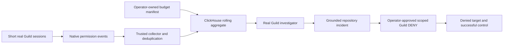

> Advisory research snapshot. For current native authority, event attribution, window boundaries and recovery semantics follow [the corrected architecture](../architecture/ARCHITECTURE.md) and its contracts. Fixture alternatives below are not simultaneous build requirements.

# Final idea: ScopeWatch

**Detailed expansion:** [the current master specification](MASTER_SPEC.md) adds the operator story, newly researched sponsor capabilities, 42-scenario coverage, renewed debate and explicit native-outcome gate. Its API-trigger key-scope correction and evidence rules take precedence over shorthand in earlier notes. The core permission-use metric is unchanged.

Final research decision, 9 October 2026, after three independent advocates, cross-rebuttals and a separate devil's advocate. Akash is excluded. This supersedes the earlier BoundaryProof recommendation as the current project choice. Research only: no competition project, native account test, source finding, hosted run, containment action or performance measurement has been completed.

## The choice

**Build ScopeWatch: find an agent exceeding its declared permission-use budget across sessions, investigate through Guild, and selectively block its subsequent operations while another legitimate agent keeps working.**

The user is an operator running several AI workloads with shared integration credentials. The question is specific: “Which agent exceeded its assigned access budget, and can I contain it without stopping approved work?” Several sessions can each look acceptable while their combined credential use violates the operator's policy. ClickHouse answers that cumulative question. Guild supplies real hosted execution, native permission evidence, a useful investigator and the actual enforcement surface.

The proposed opening line is: **“Every individual operation was permitted. Across sessions, this agent exceeded the budget its owner approved.”** It is a declared policy violation and investigation trigger, not proof of malicious intent.

This is our strongest current plan for two substantive monetary tracks, with a third opportunity only if an authentic Semgrep finding appears. It is not the architecture with the largest hypothetical subtotal. It avoids making the entire demonstration depend on discovering a particular source flaw during a five-hour event. The independent verdict and objections are preserved in [the final adjudication](../research/debate-archive/07_devils_verdict.md).

## Exactly what the evidence means

The minimum metric is **unique native Guild ALLOW permission-decision events for one selected operation family**, accumulated across sessions against a predeclared workload budget. An ALLOW proves the platform permitted an operation; it does not prove successful execution, returned documents or data exfiltration. Do not label the counter “documents stolen” or “bytes leaked.” Successful-delivery analytics would require independently matched outcome receipts and are outside this build's minimum scope. [Official session-event schema](https://docs.guild.ai/api-reference/sessions/fetch-session-events).

Guild persists events when a turn completes. ScopeWatch therefore detects completed-turn activity and restricts **subsequent** relevant operations. SQL latency and platform persistence delay are separate measurements. This product does not promise to prevent the first excess operation during the same turn. The first account test must establish the exact fields, operation unit, clock and agent/session binding available for the selected integration.

Declare the window clock explicitly. Use the chosen native record time where established, or label a collector-observation window if only arrival time is available. Do not silently call arrival time the original execution time. Duplicate events count once; unknown identity or incomplete collection produces an evidence warning, not a safe zero.

## One controlled scenario

Use one owned repository containing synthetic records and one supported Guild integration. Prefer the existing GitHub integration so a custom remote service is unnecessary.

- **Support agent:** several short hosted sessions use the same integration credential. Its manifest gives a small approval-event budget over a rolling interval. An illustrative scenario is five sessions with six counted decisions each against a budget of twenty; these are planned fixture numbers, not measurements or recommended production limits.
- **Approved bulk agent:** uses that shared credential but has a deliberately higher, preapproved allowance. Its legitimate workflow must actually succeed after the support agent is contained. Raw volume alone must not condemn it.
- **Investigator:** a real Guild-hosted agent with bounded context reads the operator manifest and contributing-session evidence, then creates an actionable incident issue in the owned operations repository.

The analytical payoff is selective scope: “Block this support agent's relevant operation, rather than revoke the shared credential for both workloads.” The operator approves and applies an agent/resource/operation-scoped Guild DENY. Repeating the selected operation must produce a genuine native denial for the contained agent and an actual successful result for the control agent.

The workloads are a disclosed, deterministic lab scenario. The model does not have to fall for a prompt on stage. Native events, queries, hosted tool actions and enforcement must be real. A global credential revoke, local pause flag or drafted recommendation is not proof of selective containment. [Guild credential policies](https://docs.guild.ai/platform/credential-policies).

## Why each sponsor belongs

| Sponsor | Necessary job | Judge-visible proof | Prize opportunity from supplied packet |
|---|---|---|---|
| ClickHouse | Aggregate permission use across sessions, apply each workload's declared allowance, return the particular actor and contributing sessions | Actual SQL changes the case/containment scope; real stored rows, rows read, query timings and event-to-alert delay | $1,000 gift card + $500 credits; $500 gift card + $300 credits; $250 cash/gift card |
| Guild | Run monitored workloads and investigator, hold integration credentials, produce native evidence and enforce the demonstrated policy | Actual session URLs, source/context tool read, created issue, applied scoped policy, denied repeat and successful control | $1,000 winner; two $500 runners-up |
| Semgrep | Examine ordinary AI-generated collector/controller/project code; preserve any genuine interesting discovery and its repair | Original generated source and actual scan result, rule/file/line, meaningful owned-lab consequence and correction | $1,000 or $500 cash gift card; both winners get 20 credits |
| Pi | Judge the innovation/usefulness of the operator outcome | A coherent evidence-to-selective-action demonstration with useful work preserved | Stream Deck + unspecified gift card; no product access required |

**Money:** ClickHouse + Guild top awards give a **$2,000 cash/gift-card face-value ceiling if stacking is allowed**. A genuinely eligible Semgrep top award could raise it to **$3,000**. This is neither expected payout nor $3,000 cash. ClickHouse credits, Semgrep credits, Pi hardware and Pi's unknown gift-card amount are separate. The known $5,250 pool is distributed across several teams. Current stacking and some eligibility terms are unconfirmed in the checked public material. [Prize audit](../research/prize-strategy-adversarial.md), [event/rule trail](../research/competition-and-eligibility.md).

If only one of these monetary prizes may be won, each stated top monetary amount is $1,000; lead with the sponsor whose completed proof is strongest. Preserve both core integrations because they serve the same product. Do not infer today's stacking from multi-award winners at other events.

## Semgrep's honest third-prize route

Enable the supplied Guardian setup while generating the actual ScopeWatch project during the event. Preserve initial model output and actual hook/scan findings before repairs. Useful audit surfaces include authentication in the collector/controller, handling of untrusted event labels, credential exposure and repository operations. These are areas to inspect, not findings we have obtained or instructions to introduce a bug.

Give focused discovery at most twenty to thirty minutes, in parallel with building the core. A qualifying issue should have an actual source location and stock detector result, an interesting security consequence, and an honest discovery sequence. A scan error is not a clean scan. Catalog membership does not prove detection or exploitability. A human-discovered issue covered afterward by a custom rule must not be attributed retroactively to Semgrep.

Remote Guardian uses a fixed default pack; the published MCP/Flask outbound rules audited earlier are not established in that pack. The stock CLI and Guardian are different surfaces. Ask the event sponsor about the actual route if using a nondefault scan or custom rule. The packet does not expressly say Guardian-only, but acceptance is not established here. [Exact rule/surface audit](../research/finding-feasibility.md), [Guardian configuration](https://docs.semgrep.dev/semgrep-guardian/rules-and-configuration).

If no interesting eligible finding appears, **continue the identical ScopeWatch core** and omit the Semgrep finding-prize claim. Do not generate a separate vulnerable app, insert a flaw or spend an hour rerolling code. Routine scanning is useful quality work; it does not by itself satisfy this finding contest.

## Minimum architecture

### Current sponsor capabilities to use deliberately

ClickStack's September 16 release note includes beta LLM/tool observability, release markers, richer alert webhooks and emerging-log-pattern tools. They can improve later observability, but this five-hour minimum needs native permission events and real SQL rather than a new dashboard stack. The October 5 executable-UDF release is unnecessary here. [ClickStack update](https://clickhouse.com/blog/whats-new-in-clickstack-august-2026), [UDF release](https://clickhouse.com/blog/executable-udfs-generally-available-on-clickhouse-cloud).

Guild's current session API, dedicated API-trigger keys and credential policies are the relevant control-plane features. Its SDK/network constraints make built-in repository tools and compact real query input the faster path than arbitrary direct HTTP from an agent. These are current documented capabilities, not a verified new release date. [API triggers](https://docs.guild.ai/platform/api-triggers), [security architecture](https://docs.guild.ai/platform/security-architecture), [full integration audit](../research/clickhouse-guild.md).

Semgrep's Guardian hook is useful for preserving real AI-generated-code findings; fixed remote rules differ from explicit local CLI packs. Pi's September 29 Compliance API integration supplies session security context in its own product, but event access is unavailable and no Pi integration is required. [Guardian overview](https://docs.semgrep.dev/semgrep-guardian/overview), [Pi announcement](https://www.pi.security/blog/powering-every-builder-with-security-context-pi-integrates-with-anthropics-compliance-api), [Semgrep/Pi profile](../research/semgrep-pi.md).

Keep four small records: native events; the versioned manifest; case/query evidence; action and verification receipts. Bind workload identity through authenticated platform metadata and the controller's own launch record, never an arbitrary `agent_id` supplied in a tool payload. Preserve source native IDs and links. The collector's query result drives the alert, rather than the UI choosing an actor and asking SQL to decorate it.

Plain MergeTree plus parameterized queries is enough. Normalize exact event fields after the account test. If adding minute rollups, apply changing budget context at query time; a later right-side manifest change does not retroactively recompute an insert-triggered join. [ClickHouse incremental-view semantics](https://clickhouse.com/docs/concepts/features/materialized-views/incremental-materialized-view).

Use one bounded investigator. Pass the actual aggregate as its input and use existing repository tools to read the manifest and create the issue. That avoids deploying a custom evidence API. Its issue must name the declared budget, counted event unit, contributing sessions, uncertainty and narrow proposed action. It cannot edit the manifest/evidence or apply policy changes itself. Local operator approval must be described as local approval; do not call it native Guild enforcement.

Replace/remove the initial credential allow-all policy before claiming a restricted configuration; a new scoped ALLOW alone leaves that fallback. DENY takes precedence. Keep the privileged policy-edit capability with the operator/controller, outside the investigator's grants. Agent-specific policy edits are documented but not tested in this research. [Policy documentation](https://docs.guild.ai/platform/credential-policies).

## The ClickHouse scale demonstration

Start with authentic events from several completed lab sessions. Then add a clearly separate, diverse replay workload varying workload, credential, session, operation, decision, time, allowance and duplicate/late-event cohorts. A target of roughly one million rows is optional and should be increased only after the working loop exists. There is no published million- or ten-million-row prize minimum.

Show two evidence panels:

1. **Active controlled case:** real native decision count, manifest allowance, contributing sessions and the actual actor chosen for review. These facts support the case.
2. **Load test:** actual synthetic/replay row count and query p50/p95 over a stated sample, with rows read, service/region and warm/cold conditions. This measures scale; it does not create millions of customers, discoveries or successful reads.

Show the SQL and actual query identifier. Measure platform persistence/collector lag, SQL execution, investigation completion and policy-change-to-observed-denial separately. No invented millisecond badge. A small fast query does not establish low end-to-end response latency.

## Demo contract: approximately two minutes

| Time | What the reviewer sees |
|---|---|
| 0–15 seconds | “These sessions each look acceptable; together one agent exceeded its approved budget.” The manifest and real case counter establish the stake. |
| 15–40 | ClickHouse combines sessions and selects the support agent while the approved bulk agent remains compliant. Open the SQL and show actual timing/scale labels. |
| 40–65 | Open the real Guild investigator session and the actual incident issue it created after reading the manifest/context. |
| 65–100 | Operator applies the narrowly scoped policy. The contained agent's repeat operation is denied; the control workload returns its actual expected result. |
| 100–120 | Evidence receipt: native events, query, issue/session, policy scope and both outcomes. If a genuine Semgrep finding exists, give it a clear additional dedicated beat or separate short finding evidence clip. |

Two minutes is a recommendation, not a published hard video limit. Record a genuine successful run and label any replay or recorded session. Do not imply a recording is a live stage run. The short video and readable repository must explain the result without relying on a finalist presentation.

## Five-hour execution plan

| PT | Milestone |
|---|---|
| 11:30–12:00 | Confirm stacking/track entry and account access; generate project during event; agree on one event/manifest contract; capture actual Semgrep results. Stop focused discovery if no genuine candidate. |
| 12:00–12:15 | Prove hosted operation, native event mapping, scoped DENY, denied repeat and actual successful control. Prove ClickHouse insert/query in parallel. |
| 12:15–1:30 | Complete collection → aggregate → real hosted investigation → issue → reviewed policy action. One complete loop before expanding UI or volume. |
| 1:30–2:30 | One case screen, bulk/duplicate/failed-execution controls, source links and measured replay workload. Freeze scope by 2:30. |
| 2:30–4:00 | Verify, rehearse, record/upload, assemble README/build/tools and sponsor evidence. |
| 4:00–4:30 | Verify repository/video access; add team names/emails; submit with margin. |

The phases total 300 minutes. Four owners: (1) Guild/credential enforcement; (2) collector/ClickHouse; (3) manifest/scenario/Semgrep provenance; (4) UI/evidence/video/submission. With two people, keep one integration, two observed workload identities and one investigator, and cut custom APIs, automatic policy editing, general sandboxing, agent swarms and fancy observability deployment.

**First-45-minute kill gate:** the native evidence and actual selective subsequent-call denial must work. If blocked, ask the sponsor mentor once and simplify within the same integration. A monitoring/review prototype can still be submitted, but cannot claim completed containment. Do not disguise a failed account/integration or restart a different platform at 2 PM.

Required controls: the approved bulk workload stays within its own allowance; replayed native event IDs do not increase counts; incomplete mapping is visible; an ALLOW followed by failed execution is never called a successful read; after containment the target is actually denied and the control actually succeeds. If both agents fail, the central selective-control promise failed.

## Past winners: what to borrow and what to reject

The archive covers 23 relevant awardees: eleven ClickHouse, nine Guild and three Semgrep. Argus is an additional corroborated Guild claim; exact rank remains separately qualified. No Pi winner was verified in the organizer archive. Code inspections were not uniform runtime tests and can differ from judging versions. [Complete historical matrix](../research/all-relevant-winners.md).

| Example | What the evidence supports | ScopeWatch adaptation |
|---|---|---|
| Rokko | Sponsor-confirmed ClickHouse first place; stream/aggregate results feed an action loop, with unpublished agent-backend limits | Query changes who is contained; show the changed downstream result. [Official recap](https://clickhouse.com/blog/aws-mcp-hackathon-san-francisco) |
| AeroRider | Verified ClickHouse category award; analytics re-score routes, with planted-input limitations and creator-only precise rank | Make one analytical answer change the proposed scope; avoid a seeded outcome presented as a discovery. |
| Argus | Real scoped Guild ticketing action; exact rank is participant-reported, and its local pause is not native Guild enforcement | Show genuine hosted source/context read and repository artifact, then actual platform DENY. |
| DailyGate | Guild award membership and different agent grants; judging-era live panel was scripted | Use differentiated grants, inspectable sessions and real tool events. |
| Darwin | Earlier Best Use of Semgrep award, generated tools and scanner-informed fitness; misleading historical headline totals | Give Semgrep one actual finding if obtained, with exact output and consequence. Today's award is finding-centric. [Sponsor retrospective](https://semgrep.dev/blog/2025/what-a-hackathon-reveals-about-ai-agent-trends-to-expect-2026/) |

Winner integration depth is not a winning formula. IncidentSherpa won Senso while missing ClickHouse/Guild despite substantive analytics; LicenseTrace won ClickHouse with thin inspected integration. The archive lacks judge scores and an unbiased denominator. The design inference is a clear outcome with attributable sponsor evidence, not an estimated win rate. [Corrected forensics](../research/clickhouse-guild.md), [counterexamples](../research/competition-and-eligibility.md).

## Recent evidence and debate conclusion

Fresh last30days research covered September 9–October 9 and returned 58 records across five selected sources, with a transcript for one of the two final YouTube records. These are collection counts, not confirmed incidents or independent demand. Earlier two passes and the current canonical pulse are preserved with source/coverage limits. [Fresh pulse](../research/debate-archive/05_fresh_permissions_pulse.md).

WorkOS's September 30 checklist already discusses runtime budgets and revocation; NVIDIA's September 28 safety reference describes independent monitoring and enforcement. This supports an execution-boundary product while constraining the innovation claim. Pi/Semgrep/Snyk already cover substantial scan/fix/recurrence work. ScopeWatch is a compact, working operator outcome to demonstrate, not a new security category or a claim that existing vendors cannot do it. [WorkOS](https://workos.com/blog/ai-agent-permissions-checklist), [NVIDIA](https://developer.nvidia.com/blog/nvidia-open-agent-safety-platform-a-reference-for-continuous-in-silicon-agent-monitoring), [competitor audit](../research/competition-and-eligibility.md).

Three advocates disagreed: the Semgrep advocate ranked ToolTrust first, the ToolTrust advocate ranked Code Vaccine first, and the runtime advocate ranked ScopeWatch first. Each conceded a substantial weakness. The separate judge selected ScopeWatch because its aggregation is the product's central uncertainty and it survives no source finding; A/C's centerpiece findings are unobtained and their small acceptance matrices make ClickHouse easier to bolt on. B's semantics were narrowed from successful reads to native approval decisions to match the actual evidence. [A/rebuttal](../research/debate-archive/01_semgrep_advocate.md), [B/rebuttal](../research/debate-archive/02_runtime_advocate.md), [C](../research/debate-archive/04_alternative_advocate.md), [C cross-response](../research/debate-archive/06_cross_rebuttals_tooltrust.md), [independent final verdict](../research/debate-archive/07_devils_verdict.md).

**Final commitment:** one cross-session permission-use budget, one genuine hosted investigation, one operator-approved selective subsequent-operation control, and one legitimate workflow that still succeeds. Target ClickHouse and Guild strongly; add Semgrep only through an authentic accepted finding and pitch Pi without pretending it has an integration.
