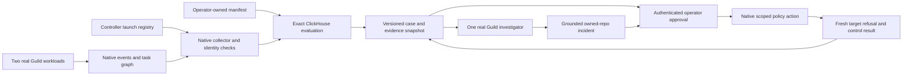
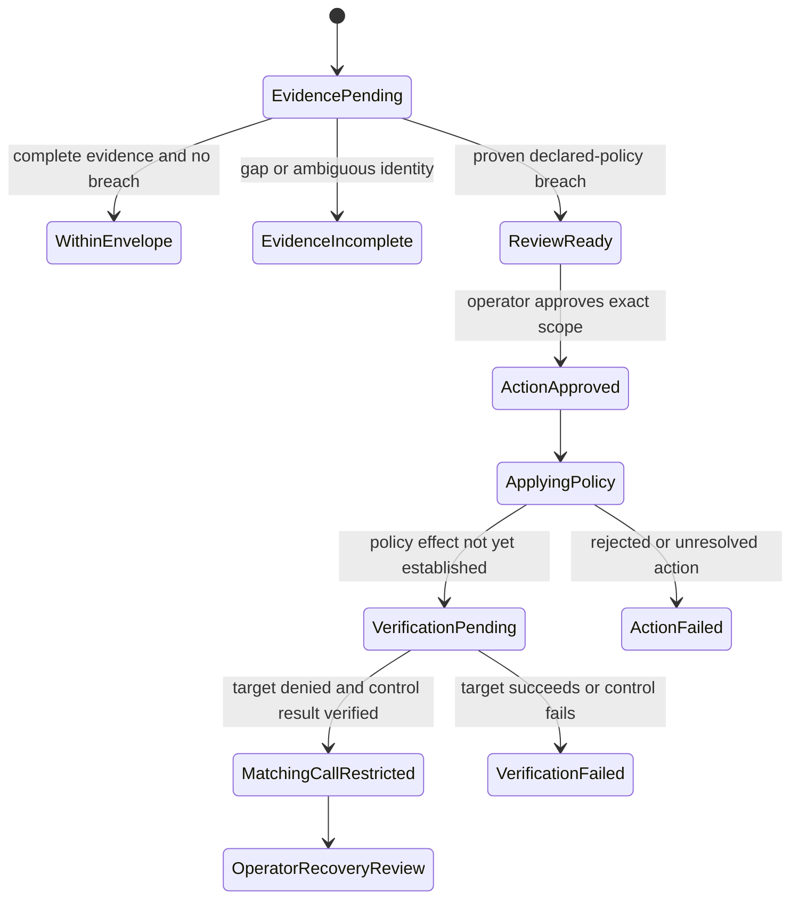

# ScopeWatch: detailed story, sponsor capabilities and event build specification

Prepared 9 October 2026 after Firecrawl/Alexandria research, a curated sponsor knowledge base, three specialist advocates, cross-rebuttals and an independent devil's advocate. **This is research and a proposed build, not an implemented project or measured result.** Akash is excluded. The supplied event packet is authoritative for itemized prizes: one project, at most four people, conservative build window 11:30 AM–4:30 PM PT.

**Detailed architecture refinement:** [seven-view offline diagram atlas](../architecture/architecture.html), [architecture and exact contracts](../architecture/ARCHITECTURE.md), and [independent design review](../architecture/ARCHITECTURE_REVIEW.md). This later audit adds historical event-anchor evaluation, per-event acting-subject bindings, generation/context readback, provisional finite-cohort coverage and manual native UI/verified CLI policy application. These corrections take precedence over earlier simplified sketches.

## 1. The exact final idea

**ScopeWatch finds an installed AI workload exceeding the permission-use envelope its operator approved across sessions, produces a grounded hosted investigation, and lets the operator restrict its subsequent matching operations while proving that approved work still succeeds.**

The user is an engineering/security operator responsible for several agents using a connected integration credential. The product decision is: **“Which workload should lose this particular capability, and which approved work will remain usable?”**

The minimum metric is unique native Guild ALLOW permission-decision events for one selected operation, accumulated across completed sessions under an operator-owned allowance. It is an asynchronous policy circuit breaker. The counter does not establish successful reads, documents stolen, malicious intent, task relevance or a prompt-injection exploit. It is useful even when the excess comes from a malfunction or retry loop rather than an attacker.

The strongest payoff is **attributable narrow restriction plus verified continuity**, not the invention of rate limiting. ClickHouse chooses the target from actual evidence. Guild supplies real hosted work, native permission evidence and the reviewed enforcement surface. Semgrep inspects the same AI-generated workflow and earns a third finding opportunity only through an actual interesting discovery. Pi provides an innovation-prize opportunity without product integration.

Current top monetary face-value ceilings are **$2,000 for ClickHouse + Guild**, or **$3,000 with an eligible Semgrep top finding**, only if stacking is permitted. These are not expected winnings or guaranteed cash. Credits, Pi hardware and its unspecified gift-card amount are separate. [Detailed prize arithmetic](../research/prize-strategy-adversarial.md).

## 2. The story: the credential Maya cannot simply switch off

The following company, names and numbers are **fictional demo design**, not an actual incident. Use owned synthetic fixtures; display real observed counts when the project runs.

Maya is the on-call operator at HarborDesk, a fictional small software company. She runs two Guild-hosted workflows against an owned GitHub repository containing synthetic support and release-review tickets. Both use the same connected integration credential, verified by actual platform metadata.

**TicketAssist** handles a narrow support-triage job. Maya approves a limited amount of credential use for it, including reasonable retries. **ReleaseReview** handles a separately approved batch and legitimately needs more calls. The limits belong to Maya's versioned manifest, not to a model-written statement such as “I am doing bulk work.”

For the illustrative controlled scenario, Maya declares these envelopes before the run:

| Workload | Approved job | Native approval-event allowance | Controlled observed count to aim for |
|---|---|---:|---:|
| TicketAssist | Bounded support triage | 20 in a rolling ten-minute window | 30 across several completed sessions |
| ReleaseReview | Preapproved release batch | 60 in the same window | 40 |

The counted unit must be established in the account test. One tool call is not assumed to create exactly one security event. These are fixture parameters, not production recommendations or results.

Maya sees separate short support sessions. Each looks locally ordinary, but together TicketAssist has consumed more permissions than Maya approved. ReleaseReview is even busier by raw count, yet still complies with its own allowance. The comparison that matters is **30/20 versus 40/60**, not “the busiest agent is the dangerous one.”

The controlled support run represents a compromised or malfunctioning worker. A deterministic hosted sequence makes the scenario reproducible. A synthetic support ticket containing planted audit instructions is the preferred **optional cause experiment**, because it ties the excess to lower-trust input inside this same workflow. It becomes part of the attack claim only if actual source-read and subsequent behavior evidence establish influence. Displaying the ticket beside a scripted workload does not establish that the model followed it.

Maya has a blunt option: revoke the credential and interrupt both workflows. ScopeWatch offers a narrower decision. ClickHouse combines the native events across sessions, applies the predeclared allowances and returns TicketAssist plus the contributing session evidence. The UI displays that SQL result; it does not preselect TicketAssist and ask the database to decorate a predetermined answer.

A real Guild investigator reads the trusted manifest, checks the case context, and creates an incident issue. It explains the count, interval, allowance, source sessions, missing evidence and why ReleaseReview is authorized. It proposes the narrow agent/workspace/credential/operation scope for review. It cannot change the allowance or authorize itself.

Maya approves that exact scope and applies the native policy. A fresh TicketAssist request for the selected operation is refused. A fresh ReleaseReview request returns the expected synthetic fixture, inspected in actual tool/result evidence. The shared credential remains useful for Maya's approved work.

**What the ending proves:** this subsequent matching operation was denied for one authenticated workload while this approved control operation actually succeeded. It does not prove that every operation, credential or integration available to TicketAssist is blocked, that an in-progress turn was interrupted, or that earlier actions were undone.

### The short pitch

> “Separate sessions hid one agent's cumulative credential use. ScopeWatch identified the workload that exceeded its approved envelope, turned the evidence into a reviewable case, and restricted its next matching call while the approved batch kept working.”

### The first ten seconds: a person, a number and a consequence

Use this opening **only with observed matching counts**. The five sessions and 30/20 comparison are illustrative targets, not completed measurements:

> “Five sessions. Thirty permission approvals against Maya's limit of twenty. Revoking their shared credential would interrupt the release batch too.”

Show the sessions, the pinned allowance and the two named workflows together. Maya and HarborDesk are fictional; the repository's support tickets and customer references are synthetic. The immediate human stake is Maya's choice between restricting the suspect workload and interrupting approved work. Customer-data risk motivates review, but the counter does not establish a victim's actual data loss.

If there is separately verified actual outcome evidence, describe precisely that result: for example, “30 successful synthetic ticket-lookup responses.” This is still not “30 distinct customer records” unless distinct object identities and successful returned content actually establish that count. Without that evidence, keep “native permission approvals”; even “approved reads” can imply completed retrieval.

### A bounded planted-ticket cause test

The scenario owner can test one ordinary synthetic support ticket and one matched version containing an instruction to expand the audit to additional synthetic tickets. Keep the trusted job requirements, operator manifest, tool grants, fixtures and controller launch schedule fixed; change only the lower-trust ticket content. Run fresh tasks and preserve the actual ticket-read result, task/version identity and ensuing tool calls. Do not give the model policy-edit authority or script extra calls while describing them as autonomous behavior.

The benign control should follow the bounded task. The planted-input run supports a narrow influence claim only if the trace shows the source was consumed and the tool behavior expanded beyond the trusted job in a way the control did not. Repeat a surprising result if time allows. A single controlled trace is not a robustness benchmark, and planted text alone is not an attack result. If no influence is observed, say so and keep the deterministic misuse simulation, visibly labeled. A secure refusal is also a valid test outcome.

Cap this optional comparison at ten minutes of the scenario owner's existing lane after essential fixture work. Stop by 1:30 PT, or earlier if it delays native proof, target/control verification or scan preservation. It adds no extra time to the 300-minute schedule and no extra project. Preserve comparison/preflight events separately from the declared main case rather than silently dropping counted events.

### What would make the story stronger

An exact native tool-outcome match may add HTTP status or response-size context. Actual returned fixture content may support a bounded successful-result claim. Trusted resource/recipient declarations plus actual matching request/delivery evidence could support a resource or audience violation. Those are evidence-earned extensions; none is silently inferred from ALLOW counts or task names.

## 3. The debate and why the final scope stayed narrow

The sponsor specialists and story advocate agreed on usefulness but challenged different dependencies. A separate reviewer then attacked the combined plan. [Full debate and verdict](DEBATE_AND_VERDICT.md), [Guild rebuttal](rebuttal-guild.md), [ClickHouse rebuttal](rebuttal-clickhouse.md), [story rebuttal](rebuttal-story.md).

| Objection | Resolution | Remaining limit |
|---|---|---|
| “This is just a quota counter.” | Agree. Center the operator decision, trusted cross-session attribution, differing approvals and verified surviving work. | The predicate is established policy practice; no algorithmic novelty claim. |
| “The LLM is unnecessary.” | SQL counts. The investigator independently reads context and creates a grounded actionable issue. | A script/template can perform much of this. Show actual useful work rather than claiming counting needs AI. |
| “A million cloned rows makes ClickHouse decorative.” | Separate a real controlled case from a diverse labeled replay workload; preserve expected answers and show real query work. | The small demo does not uniquely require ClickHouse; performance must be measured. |
| “ALLOW means the records were read.” | Keep the native permission metric. Outcome context has separate fields and evidence. | No document or exfiltration claim from permissions, HTTP status, DONE or byte count alone. |
| “Join every child task to the permission event.” | Many-to-one parent traversal can attribute an actor. Result attribution requires a proven native one-to-one relationship. | Ambiguous or nullable outcomes remain unmatched. |
| “A DENY policy means the whole agent is contained.” | Show a real denied subsequent call for the reviewed matching scope. | Other operations/resources/credentials and in-flight work may remain. |
| “A successful policy API response proves effect.” | Keep verification pending until the target is genuinely denied and control genuinely succeeds. | Unknown/failed effects are explicit product states. |
| “An API-trigger key belongs only to the investigator.” | Corrected: issuance is associated with a trigger, but effective documented session privileges are broader within the workspace. | Controller-held key, authenticated approval and an installed-agent allowlist are necessary. |
| “Use all the new sponsor features.” | Core first. Token/context conveniences are version-gated; alerts/MCP/outcomes have separate cutoffs. | More features consume the demo margin without necessarily improving the operator outcome. |
| “Run a separate 28-generation vulnerability app.” | Bound Semgrep discovery to ordinary code from this same workflow. | A separate finding entry's eligibility under the one-project rule is unconfirmed. |

The result is **one product with a fixed honest core**, not a menu of three products to start late. Native outcome enrichment gets only fifteen minutes after the full loop works. There is no receipt server, second vulnerable application or new OAuth/MCP bridge on the rescue path.

## 4. Current and new sponsor capabilities, with deployment decisions

Newly researched is different from newly released. Guild features below are current documented capabilities without an established launch date. Dated ClickHouse/Semgrep/Pi releases are explicitly identified. None has been tested in the event account.

### ClickHouse and ClickStack

| Capability | Freshness and source | Role in ScopeWatch | Decision |
|---|---|---|---|
| Exact native-event aggregation and raw evidence | Current [aggregation docs](https://clickhouse.com/docs/reference/functions/aggregate-functions/uniqExact) | Deduplicated per-actor/credential/operation totals, contributing sessions and narrow target selection | Core; validate correctness before optimizing |
| `CREATE TOKEN` with expiry and subset grants | September 23 [26.9 release](https://clickhouse.com/blog/clickhouse-release-26-09) | Optional short-lived SELECT-only access to curated case evidence without handing out the main database password | Stretch after deployed version and privileges are proven |
| Ordered `LIMIT ... AFTER/UNTIL` boundaries | Same 26.9 release | Optional bounded timeline context around an incident marker | Stretch; ordinary bounded queries preserve the core |
| `APPEND INCREMENTAL` refreshable views | Same 26.9 release | Potential later incremental evidence archival | Cut from five hours |
| Dashboard variables, release markers, richer alerts and beta LLM observability | September 16 [ClickStack update](https://clickhouse.com/blog/whats-new-in-clickstack-august-2026) | Helpful later exploration of actor/service/version context | Optional if already configured; not the event's data-truth source |
| SQL chart alerts | Current [alerts](https://clickhouse.com/docs/clickstack/features/alerts) and [SQL visualization docs](https://clickhouse.com/docs/clickstack/features/dashboards/sql-visualizations) | A possible native detector-to-investigator handoff | Stretch; minimum listed evaluation interval is one minute and chart semantics matter |
| Semantic observability MCP | Current [MCP docs](https://clickhouse.com/docs/clickstack/mcp) | Potential later agent investigation tools | Cut new integration; Cloud OAuth compatibility with Guild remains unproved |
| Executable UDFs | October 5 [GA announcement](https://clickhouse.com/blog/executable-udfs-generally-available-on-clickhouse-cloud) | No necessary job in the minimal incident path | Cut deployment/networking complexity |

The Alexandria GitHub provider returned public stable release records, including an October 8 26.9 patch. **Public release availability does not establish the deployed Cloud version, feature permissions or configuration.** Run an actual version/feature smoke check during the event before using the new syntax. [Structured release reference](../../references/scopewatch-kb/releases/index.md).

The optional token design is a separate analytics-access control, not the mechanism that restricts Guild's integration calls. A SELECT grant on an object does not by itself restrict access to a single case's rows; the evidence object must actually contain only the permitted data or use a separately verified row policy. Prefer the existing restricted reader and compact query result until the core works.

For the optional incident-boundary query, `AFTER` includes its matching row, while `UNTIL` excludes its matching row. A context query that stops at the refusal marker may therefore omit the refusal itself. Fetch/show the actual verification receipt separately; do not mistake convenient context selection for enforcement evidence.

Important ClickStack traps: alerts evaluate dashboard variables in their empty state, rather than the user's current filter selection; a Number chart displays its first numeric column, while the alert evaluates the last numeric column. Use one explicit numeric signal and encode the actual policy/actor context in trusted SQL. Tables are not supported alert targets. A one-minute alert schedule is not a rolling-budget definition or a subsecond detection guarantee. The core uses the application collector/SQL evaluator and labels it accurately.

### Guild

| Capability | Current source | Role and gate |
|---|---|---|
| Native agents using a prompt plus configuration | [Native agents](https://docs.guild.ai/guide/native-agents) | Fast single investigator with real context read and issue creation; no custom container or general HTTP needed |
| Explicit typed tool execution and resumable state | [Coded agents](https://docs.guild.ai/guide/coded-agents) | A disclosed deterministic monitored workload if SDK access works promptly; no persuasion-dependent stage exploit |
| Native security events | [Session events](https://docs.guild.ai/api-reference/sessions/fetch-session-events) | Core permission facts, native IDs, decision/reason and available task/credential fields; turn-end persistence and account population must be checked |
| Native tool-task metadata | [Session sub-tasks](https://docs.guild.ai/api-reference/sessions/fetch-session-sub-tasks) | Optional outcome context; nullable HTTP/byte fields and projection-dependent response data are not a protected-object receipt |
| Agent/workspace/operation/resource credential policy | [Credential policies](https://docs.guild.ai/platform/credential-policies) | Operator-reviewed subsequent matching-call restriction; default allow-all and actual selected selectors need proof |
| GitHub integration | [GitHub integration](https://docs.guild.ai/integrations/github) | Owned synthetic ticket reads plus real manifest read/incident creation; verify installed version and exact tool/operation names |
| API triggers and session access | [API triggers](https://docs.guild.ai/platform/api-triggers) | Controller launches and records native session identity; key stays server-side with allowlisted routing |
| Model policies and account token limit | [Models/providers](https://docs.guild.ai/platform/llm-settings) | Optional cost/model governance; BYOK-only policy availability and account-wide effects make this a separate control |

The effective key scope correction matters: a key created for a trigger can access sessions in that workspace and may route to another installed agent. It is not investigator-only. A tool subset such as `pick()` also does not replace credential-policy enforcement. Keep launch authority and policy-edit authority outside model-visible inputs and grants.

Fresh native task fields are promising, but parent/child links do not automatically attach the right HTTP result to a permission event. A parent agent task can contain several tool calls. A descendant cross-product would manufacture matched outcomes. First establish actor attribution; prove any result join separately. [Full Guild audit](guild-capabilities.md).

### Semgrep

The current Guardian plugin combines scanning hooks, MCP and skills. The recommended remote Claude Code/Codex path uses OAuth and a fixed `guardian-default` ruleset; organization Policies do not apply there. The local CLI paths differ. This was confirmed in the newly fetched [setup comparison](https://docs.semgrep.dev/semgrep-guardian/choose-your-setup), so broad marketing wording about policies must not be generalized to every setup.

Semgrep's September 24 [malware-response announcement](https://semgrep.dev/blog/2026/introducing-malware-detection-and-response-automation) describes additional automation and a private-beta Guardian firewall. July 28 [Agentic Workflows](https://semgrep.dev/blog/2026/introducing-semgrep-agentic-workflows-automate-deep-vulnerability-hunting-at-scale/) are existing customer/public-beta capability, outside the recent release window. Neither access nor a custom SDK is promised by the event. They are useful prior art; the prototype should not depend on them.

The award is finding-centric. Semgrep's useful role is an actual interesting issue in the generated collector/controller/support workflow, with original source, real detector output, meaningful consequence and repair evidence. The public rule audit is a capability reference, not a discovered target. [Exact rule and surface audit](../research/finding-feasibility.md).

### Pi

Pi's September 29 [Anthropic Compliance API integration](https://www.pi.security/blog/powering-every-builder-with-security-context-pi-integrates-with-anthropics-compliance-api) supplies session security context and guidance in its own product. Its [Lemonade case study](https://www.pi.security/customers/lemonade) already covers reproduction, variants and recurrence guardrails. The event provides no Pi technology access.

Pi therefore costs no integration work here. Present the operator's grounded decision and surviving-work proof for Most Innovative. Do not claim that budgets, selective policies, security memory or scan/fix/retest are new categories. The weakest prize argument remains market novelty, and a dramatic name does not resolve it.

The complete capability reference is [the 34-page knowledge base](../../references/scopewatch-kb/index.md), with retained examples/tables, source URLs, reuse metadata and structured release data.

## 5. Architecture and trust boundaries



The observed workloads cannot alter the manifest, collector history, case target or policy controller. The investigator can read the exact trusted manifest/context and create one scoped issue; it has no policy-edit, credential-connect, repository-update or evidence-write authority. The controller owns launch and administrative credentials. The frontend gets sanitized case evidence and action status, not a trigger key or policy-edit secret.

### The five small components

1. **Workload scenario:** two separately identifiable hosted agents, one integration, one synthetic repository and a controlled call sequence. Prefer a small deterministic coded workload if SDK access works immediately; otherwise use simple native agents and verify the actual call/event unit. The investigator is a separate Native agent.
2. **Collector:** retrieves known launched sessions, their complete native security-event snapshots and the task metadata necessary for attribution. Normalizes only facts it can establish; retains source IDs and unresolved rows.
3. **Evaluator:** parameterized ClickHouse queries over canonical events and the pinned manifest. Selects the actual breached subject and contributing sessions from all eligible candidates.
4. **Case/review:** one browser case view and one real hosted incident artifact. Facts, model interpretation, uncertainty and proposed action are visibly distinct.
5. **Controller/verifier:** authenticated operator approval, native policy action, fresh target/control calls and explicit effect verification.

No separate application, general SOC console, fleet sandbox, autonomous remediation factory, receipt service or new observability deployment is required. Firecrawl is research tooling here; adding it to the competition runtime is not necessary.

### Proposed operator manifest

This is **our application design**, not a Guild API payload. Resolve actual identifiers and operation names in the account test, then declare the fixture before the scenario.

```json
{
  "schema_version": "scopewatch-envelope/v1",
  "policy_version": "demo-envelope-1",
  "effective_from_utc": "<predeclared-scenario-start>",
  "workspace_id": "<verified-workspace>",
  "credential_id": "<verified-connected-credential>",
  "selected_operation": "issues_get",
  "window_seconds": 600,
  "window_clock": "guild_event_created_at",
  "owned_repo": "<owner>/<synthetic-repo>",
  "allowances": [
    {
      "policy_agent_id": "<verified-support-subject>",
      "display_name": "TicketAssist",
      "max_unique_allow_decisions": 20,
      "approval_ref": "support-job-approval"
    },
    {
      "policy_agent_id": "<verified-bulk-subject>",
      "display_name": "ReleaseReview",
      "max_unique_allow_decisions": 60,
      "approval_ref": "bulk-job-approval"
    }
  ]
}
```

Store the immutable repository commit/reference and a content hash separately. A Git blob identifier and a SHA-256 content hash are different values. The investigator must read the selected version, rather than accept a same-named file, branch head or tool-supplied “approved” label.

In the live scenario, freeze the allowance version through the window. Changing policy mid-window requires a defined historical-policy rule; do not implement an accidental mix of old events and new allowances. Preserve prior case snapshots even after current counts age out.

Record preflight/trial launches separately from the main approved job. The scenario's manifest becomes effective before its own activity; use that effective boundary or an explicitly separate pinned version for the earlier trial. Do not silently drop inconvenient setup events from an otherwise applicable allowance.

### Proposed data records

| Record | Required information | Purpose |
|---|---|---|
| Launch registry | Controller-issued launch, returned workspace/session/root-task IDs, requested installed subject, authenticated platform corroboration, resolved version | Bind runs to the actual policy subject; never trust a model's actor string |
| Native security event | Original event/session/task IDs, decision, selected operation, available credential/capability/reason, native creation time, observation time, source/mapping state | Exact permission facts and collection provenance |
| Manifest | Immutable reference/hash, subject and selected credential/operation, interval/unit/clock, allowance, approval/version | Operator authority and context |
| Collection coverage | Known session, completion state, pages/cursors fetched, missing/failed pages, mapping conflicts | Establish eligibility for a definitive aggregate |
| Case snapshot | Query/output/evidence IDs, chosen subject, allowance/count/window, manifest version, coverage, issue/session links | Stable reviewable basis for an action |
| Action receipt | Approved scope digest, operator/time, native policy ID, application result, verification result and residual scope | Distinguish recommendation, application and proven effect |
| Optional tool outcome | Native task/call identity, exact match method/cardinality, available status/bytes, actual result inspection or missing-field state | Evidence enrichment, never an automatic replacement metric |

Nullable IDs and outcomes remain null or unresolved. A missing credential field cannot be replaced with a guessed connected credential because the display name looks right. A `TaskAgent.agent` schema object does not establish that every account response supplies the desired installed-agent identifier. Verify the actual policy subject instead of assuming definition IDs, installation IDs and labels are interchangeable.

## 6. Collector and exact analytical decision

### Collection correctness comes before latency

The events endpoint defaults to newest-first with a small page. An exclusive cursor is useful only when the snapshot has actually been traversed. Taking the newest returned ID and advancing immediately can skip older records. Test the endpoint's supported ordering and pagination against a completed finite session; exhaust the snapshot and preserve coverage before advancing the high-water mark. If a page fails, keep the session incomplete.

Use native IDs as opaque deduplication/equality keys. Do not assume ClickHouse UUID sort order reproduces the platform's pagination order. Use the established native record-creation timestamp for the interval and retain collector-observation time separately. These are not service-delivery timestamps. Clock inconsistency and negative/implausible lag are visible data-quality problems, not numbers to silently clamp into a clean chart.

Events persist after turn completion. Keep the controlled turns short, await actual completion and show observed delay. A WebSocket or a product description using “real time” does not override the specific durable-events behavior.

Before grouping, handle two duplicate classes correctly:

- Re-delivery of the same authoritative event: retain one canonical fact and count its native ID once.
- Conflicting content or attribution for the same native ID: mark an integrity conflict and exclude it from a definitive target selection until resolved. Do not use an arbitrary latest row to pick a victim.

A genuine retry with a new ALLOW ID consumes another unit of this approval-event budget, even if the downstream operation fails. That may be an operational retry problem, not disclosure. DENY and ERROR have separate counters and meanings; neither is silently converted to ALLOW, and ERROR is not universally proof of an effective refusal.

Only the trusted collector assigns native provenance and verified mapping states. Client-submitted replay labels, IDs or `dataset_kind` values cannot make a fixture eligible for a privileged live-case action. Collection completeness includes the fields needed to identify the selected operation, clock and credential/subject, not merely an apparently successful page response. Null required fields remain evidence gaps.

### The question ClickHouse must answer

“Among the fully attributable and fully collected candidates, which installed subject exceeded its own approved allowance for this selected credential-operation pair in this declared interval, and which sessions contributed?”

The result must include both the selected breached workload and the busier authorized control. Return actual count, allowance, policy version, interval/clock, contributing sessions and evidence status. The UI is a consumer of this result, not an authority that chooses the target in advance.

Plain MergeTree is sufficient. Canonical deduplication and coverage can be handled in the collector plus exact query, retaining raw source records for inspection. Background ReplacingMergeTree merges are not an immediate uniqueness guarantee. An incremental view does not retroactively update old left-side rows when a right-side manifest changes. Summed minute buckets do not automatically provide an arbitrary exact rolling interval. Start raw and correct. [Replacement semantics](https://clickhouse.com/docs/reference/engines/table-engines/mergetree-family/replacingmergetree), [incremental views](https://clickhouse.com/docs/concepts/features/materialized-views/incremental-materialized-view).

The later architecture fixes the interval as **(anchor − 600s, anchor]**, lower excluded and upper included, with whole equal-timestamp groups. Evaluate historical event-time anchors as well as the current count; otherwise delayed completed-turn evidence can arrive after a breach has aged out and be missed. Preserve first crossing/peak witness separately. Admission canonicalizes the whole frozen generation before decision/time filters, uses an event-specific verified acting-subject mapping, and verifies analytical facts/bindings/manifest/coverage against the journal. The observed cohort is finite and controller-managed; stable repeated capture does not establish native finality or account-wide safety. [Complete corrected query contract](../architecture/CLICKHOUSE_CONTRACTS.md).

An **illustrative, unexecuted query sketch** over our normalized schema is:

```sql
SELECT
    workspace_id,
    policy_agent_id,
    credential_id,
    operation,
    policy_version,
    uniqExact(native_event_id) AS unique_allow_decisions,
    groupUniqArray(native_session_id) AS contributing_sessions
FROM canonical_security_events
WHERE dataset_kind = 'native_lab'
  AND decision = 'ALLOW'
  AND operation = {selected_operation:String}
  AND mapping_state = 'verified'
  AND native_created_at > {window_start:DateTime64(3)}
  AND native_created_at <= {window_end:DateTime64(3)}
GROUP BY
    workspace_id, policy_agent_id, credential_id,
    operation, policy_version;
```

A separate explicit join to the pinned manifest supplies the approved allowance, and coverage must qualify the candidate before “breached” is definitive. This sketch is not a complete implementation or a tested schema. Large session arrays should become bounded summaries with separate paginated evidence retrieval at production scale.

## 7. Native outcomes: a tightly bounded enhancement

After the complete core loop works by **1:30 PM**, allow **1:30–1:45** for an exact native outcome experiment. Stop at 1:45. If the loop is late, skip it.

First distinguish actor attribution from result attribution. Following a task graph upward may establish which agent owns a permission event. It does not justify attaching every descendant tool result to that event. A parent can have many calls; a tool can involve multiple permission decisions. The account test must establish the native relationships and cardinality for this chosen path.

Accept an outcome match only when exact authenticated identifiers establish the particular relationship. Time proximity, matching names, matching operation strings, adjacent rows or “there is only one visible candidate” are not substitutes. Retain the match method and cardinality; leave ambiguous, unavailable and projection-dependent data unmatched.

The UI must keep these statements separate:

| Observation | Justified statement | Unsupported upgrade |
|---|---|---|
| Native ALLOW | The selected permission decision was allowed | A document was read |
| Tool task DONE | That task reached its documented completion state | Every HTTP request succeeded |
| Matched HTTP 2xx | The matched HTTP response has that status | Meaningful content was returned |
| Matched response bytes | That available field reports response size | Sensitive data was stolen |
| Inspected actual expected fixture result | This controlled result was returned in the observed call | A production tenant boundary or recipient violation occurred |
| Source read followed by changed behavior | An observed controlled behavior sequence; stronger causal claims need suitable controls | Every future prompt injection will be detected |

Even a successful outcome experiment keeps **approval events** as the main policy unit. The enhancement adds context. It does not silently redefine the allowance into successful reads or leakage volume. No custom receipt service or new remotely reachable evidence API is added to rescue missing fields.

## 8. Investigation, approval and enforcement

### What the investigator actually does

Use one real Native investigator with the verified GitHub manifest-read and issue-create tools. Feed it a compact factual case: selected actor and actual count/allowance, pinned manifest reference, source session IDs, query/evidence references, proposed scope and missing evidence.

Require it to read the manifest rather than merely repeat supplied prose. Its real incident should explain why the breached subject is different from the busier approved subject, identify contributing sessions, list unknown outcomes and propose the narrow reviewed operation scope. It must cite evidence for quantitative statements and keep hypothetical compromise separate from measured policy facts.

It does not need an LLM to count. Its useful work is contextual review and a real system-of-record artifact through platform-held credentials. If it only copies a deterministic sentence into a template, that is a weaker product contribution; show the actual contextual read and useful artifact.

Untrusted issue content, labels and telemetry text are source material. They cannot increase an allowance, supply a new actor ID or authorize a policy change. The investigator gets neither arbitrary admin tools nor writes to the manifest/evidence. Tool selection and credential policies are separate controls; verify both. Repository-scoped create permission also prevents the incident from being redirected to an unintended repository.

### The operator approves a concrete action

The case's target/scope is built from trusted deterministic facts. The model's issue is explanatory evidence, not an executable administrative command. Bind approval to the exact workspace, policy subject, connected credential, operation, any proven resource/method selector, manifest and case snapshot. A changed target or widened scope requires renewed review.

The fresh public API audit does not establish credential-policy mutation through a controller account/trigger key. The concrete core is a human applying the reviewed rule in native Guild UI or a separately verified documented CLI. ScopeWatch prepares the exact review and records real rule/effect evidence; it does not promise an invented policy REST endpoint. Local revision checks cannot atomically control another admin's policy edits or a human applying an old copied scope. [Native contracts and authority](../architecture/GUILD_CONTRACTS.md).

Keep administrative and trigger keys in the authenticated controller. The frontend submits a case/action reference; the backend resolves the approved scope instead of accepting an arbitrary credential or agent supplied by a browser. Preserve unknown policy-update outcomes and reconcile them rather than creating contradictory rules.

The primary policy candidate is agent/workspace/operation scoped. Use repo/method selectors only after the first-hour test demonstrates the selected integration evaluates them. For GitHub, the SDK tool prefix and policy operation name differ: verify the installed tool manifest and the actual evaluated operation. Prefer exact names over broad wildcards.

Remove/replace the initial allow-all before claiming a restricted baseline. A targeted DENY can override it, but that does not make other unmatched operations least privilege. Disconnecting an association may delete a connected credential or fail to remove other ownership paths; it is not interchangeable with selective DENY. [Policy semantics](https://docs.guild.ai/platform/credential-policies).

### Verification is the ending, not policy creation

Start fresh post-action target and control operations, preferably in new sessions. Preserve the policy identifier and application observation time, actual native target refusal and actual control result. The control fixture's expected marker should not be handed to the model as an answer. Inspect the real returned fixture/result, not the model's assertion that it worked.

If the chosen integration cannot expose a meaningful control result, the surviving-work claim is unverified. If both fail, continuity failed. If the target succeeds, restriction failed. A policy API response, cached screen or stopped local worker is insufficient.

An existing controlled coded workload may expose its genuine SDK tool result or an inspected result assertion through its already available output/log path, with the audited wrapper/source version retained. It must reflect the actual executed tool response, not a hardcoded marker or model-written receipt. This is a bounded control witness, not the optional historical outcome join and not a new receipt service.

Say **“subsequent matching operation restricted.”** Other operations/resources/credentials, already permitted work and active turns remain explicit residual scope. Session stop, trigger pause, agent archive and global credential revoke are distinct controls with different limits and collateral costs.

### Case state machine



The changing counter is not the recovery authority. When old events leave the window, preserve the historical case and do not automatically remove the DENY. Recovery requires separate operator review and a fresh control check.

## 9. The actual product screen

Build one case page with five readable regions:

1. **Decision:** selected installed workload, exact counted unit, native count/allowance, interval/clock and evidence state. Beside it, show the busier approved control under its own allowance. Avoid an invented “maliciousness percentage.”
2. **Evidence timeline:** completed source sessions, detector snapshot, hosted investigation, operator action and actual verification. Every non-native marker is labeled as application-derived. Links resolve to preserved source IDs.
3. **Show query:** the parameterized query, actual identifier/output and measured timing. Native case and replay load are separate tabs or panels.
4. **Review:** manifest version/reference, actual investigator issue/session and the precise proposed scope. The issue's interpretation cannot overwrite deterministic facts.
5. **Effect:** target operation denied, approved control fixture returned, verification pending or failed. Expose residual scope rather than a global “safe” badge.

A missing-field warning belongs next to the affected claim. An optional matched-outcome section shows matched/unmatched counts and exactly what status/bytes mean; it is omitted if the fifteen-minute experiment fails. The public demo view is read-only and sanitized; approval remains an authenticated operator function.

Keep labels concrete: “native controlled case,” “approval decisions,” “selected operation,” “synthetic/replay workload,” “policy applied; verification pending,” and “matching call restricted.” Do not display “30 customer records stolen” for thirty ALLOWs.

## 10. Meaningful scale and measured latency

The real case consists of actual controlled hosted sessions, not a fictional production fleet. Its native count and actual post-action results establish the outcome.

The scale experiment is separate. Generate a diverse replay population with varied installed subjects, credentials, sessions, selected/unrelated operations, ALLOW/DENY/ERROR, time distribution, allowances, compliant high-volume actors and smaller breached actors. Include repeated IDs, delayed observations and explicitly labeled mapping-conflict fixtures. Retain the expected candidate/target results. A copied row with the same native ID must not become a million approvals.

Start small enough to verify the semantic answer, then increase only after the loop works. Approximately one million rows is a possible target, not a prize floor. Stop growing data if it consumes verification or recording time. Do not fabricate customer exposure or additional discoveries to justify a large table.

| Measurement | What to retain | What not to conflate |
|---|---|---|
| Dataset size/diversity | Stored rows, distinct authoritative/replay IDs, candidates, selected-operation fraction and dataset-kind split | Rows versus real users, attacks or discoveries |
| SQL performance | Actual query IDs/results, sample count, server/client measurement source, rows read where available, p50/p95 and warm/cold conditions | Vendor subsecond claim versus our measured workload |
| Persistence/collection | Native record time, completed-turn observation, collector coverage and queryable-insert observation | Record time versus exact service-delivery time |
| Hosted investigation | Actual trigger/session, context reads and issue-creation completion | Prompt text versus a completed tool action |
| Policy effect | Application receipt and first actual subsequent refusal; fresh control result | API success versus enforced restriction |
| Total response | Clearly defined starting event and final verified outcome | SQL milliseconds versus containment milliseconds |

Use a bounded repeatable timing sample, for example twenty query runs if the schedule permits, and report the actual sample. Save results with query metadata; `query_log` is not the answer itself. In Cloud, query logs may require replica-aware retrieval and privileges. If server statistics are unavailable, report a labeled client response measurement and leave unavailable metrics blank. Do not fill a dashboard with assumed values. [Query-log documentation](https://clickhouse.com/docs/reference/system-tables/query_log).

The analytical comparison is the same semantic question across a measured diverse population, with an attributable controlled case kept separate. Optimization should preserve the answer. Skip materialized rollups, native alerts and token conveniences if raw correctness or case evidence is not ready.

## 11. Scenario coverage: what runs, what is designed, what remains stretch

The [scenario playbook](SCENARIO_PLAYBOOK.md) consolidates **42 material scenarios**: the story advocate's 34 plus eight capability/integration traps. It is a coverage plan, not a claim that all scenarios have been executed or that every possible production failure is covered.

Use one small shared run for the essential proof:

| Core demonstration | Expected result |
|---|---|
| Support baseline and known identities | Selected unit, clock, actor and credential binding are established before the misuse run |
| Higher-volume approved bulk work | Its own declared allowance keeps it compliant |
| Cross-session support excess | Actual query selects support and returns contributing sessions |
| Re-delivered native event | Count/case do not increase |
| Missing mapping/page fixture | Evidence incomplete, not compliant zero; label fixture rather than manufacture a native event |
| Permitted operation with an inspected failure, if obtainable | Still an approval unit; never described as successful delivery |
| Post-policy target repeat | Native matching refusal and no fresh successful target result |
| Post-policy bulk verification | Actual expected fixture/result inspected after the policy; both failing means failure |

The setup policy proof and final policy proof are different phases. If a trial DENY is used at 12:15, the operator deliberately removes only that trial rule and verifies the allowed baseline before the scenario begins. A forgotten trial policy would suppress the supposed breach and invalidate the story. Preserve this sequence in the evidence.

Required design states include partial API pages, null credential IDs, late records, genuine retries, conflicting duplicates, raw labels impersonating another actor, stale approval, unknown policy-update outcome, duplicate incident creation, broad overlapping grants and aging windows. Use narrow fixtures or a walkthrough where a real runtime demonstration is unnecessary; mark each result's evidence class.

Stretch includes multiple workspaces, cloned/group-budget actors, new credentials/operations, object/recipient boundaries, actual prompt influence, outcome classification and recovery automation. Per-actor budgets are not Sybil resistance. One operation's DENY is not an egress sandbox. A count below its limit is not proof of safe behavior.

## 12. Semgrep's same-project discovery lane

Start the supplied Guardian plugin during ordinary generation of the actual ScopeWatch support workflow, collector and controller. Preserve initial output before repair, actual scan/hook records, source hash/reference, model/tool identity and relevant prompt. These are credibility practices; the packet does not publish a particular attestation format.

Potential review areas are authentication of the collector/admin endpoint, trust in native-versus-agent-supplied IDs, accidental credentials in logs/client code, unsafe arbitrary URL retrieval and repository-operation handling. They are **hypotheses to inspect, not findings already obtained**. Ask for correct authenticated behavior in the feature requirements. Do not insert a defect or change the client/framework solely to fit a detector.

Give focused discovery at most twenty to thirty minutes total while the core progresses. First verify one scan path. A small set of ordinary feature drafts may be reviewed if the owner can preserve and evaluate them promptly; do not commit to a separate 28-run application portfolio. Automatic generation does not automate meaningful consequence confirmation.

With four people, the scenario/Semgrep owner can concentrate that budget on the same workflow's ticket-lookup authorization, bounded query construction and token/admin handling. Require correct security behavior in each generation and retain the initial source before fixes. These are focused discovery opportunities, not established probabilities of winning or a reason to abandon the fixture/control duties. A smaller team should accept the no-finding outcome rather than split off another application.

For an actual candidate, retain:

- Original generated source and unchanged discovery output, including actual detector/rule/file/line and scan surface.
- The discovery sequence: scanner-first versus manual-first confirmation must be described honestly.
- An owned synthetic witness of the relevant consequence, including a legitimate positive control.
- The correction, actual rescan outcome and retained legitimate behavior.
- Why the finding is unusual or interesting in this workflow, rather than a generic count or severity label.

The remote default catalog contains particular JWT/secret/injection patterns; it does not promise arbitrary cross-file business-logic proof. Existing AI/MCP packs and explicit CLI configuration differ from the fixed remote pack. A later custom rule is confirmation unless it genuinely performed the original discovery. Ask the sponsor about the actual scan route/custom finding interpretation if relevant. [Finding feasibility](../research/finding-feasibility.md), [Guardian setup comparison](https://docs.semgrep.dev/semgrep-guardian/choose-your-setup).

No qualifying finding means the same ScopeWatch core continues, with no Semgrep finding-prize claim. A clean scan or quality integration alone is not this award. If a real finding appears, add a short evidence beat inside this same project's submission; it does not justify a late rebuild of CrossedLine.

## 13. Five-hour team execution and decision gates

This plan assumes four owners and totals 300 minutes. Portal/build start is conservatively 11:30 PT; confirm organizer instructions if kickoff/build timing differs. Build the competition implementation during the event; this research is planning/reference work.

| PT | Shared milestone | Owner focus | Decision/cut |
|---|---|---|---|
| 11:30–12:15 | First native proof: hosted call, event/task/credential/unit/clock, complete collection, actual selected DENY, fresh target refusal and control result; ClickHouse insert/query | Guild owner proves account/grants; collector owner gets source data; scenario owner defines fixture/envelope; UI owner prepares one case/evidence shell | Mentor once, simplify within the same integration. No native mapping/effect means the main promise remains unproved. Stop focused Semgrep discovery after its bounded budget. |
| 12:15–1:30 | One complete evidence → SQL-selected actor → investigator read/issue → reviewed policy → both results loop | Connect existing artifacts and preserve receipts; finish the real outcome before scale/UI expansion | If late, cut every optional enhancement. No separate application pivot without already working prerequisites. |
| 1:30–1:45 | Optional exact native tool-outcome experiment | One specialist checks identifiers/cardinality/population; others finish core controls/UI | Hard stop at 1:45; no receipt server or new bridge. Skip if the core is late. |
| 1:45–2:30 | Focused controls, one readable case view and diverse measured replay workload | Collector/query owner measures; scenario owner verifies outcomes; Guild owner preserves sessions/policy; UI owner prepares recording | Freeze scope at 2:30. Only nearly free version-verified conveniences may enter. |
| 2:30–4:00 | Verification, rehearsal, genuine recorded demo/upload, README/tools/sponsor evidence | Keep recording/submission owner protected; other owners support access and factual checks | No new OAuth, SDK, account, remote service or feature family. |
| 4:00–4:30 | Accessible repo/video, team names/emails and actual submission | Aim for submission by 4:15, retaining hard-deadline margin | Use the organizer's actual submission form; do not assume a Devpost page exists. |

### Four work lanes

**Guild/enforcement:** account and integration access, verified shared credential, observed subjects, Native investigator, real issue, precise policy and both fresh effects. This lane is first because documentation does not prove account behavior.

**Collector/ClickHouse:** native coverage and attribution, canonical event unit/clock, raw exact query, case target selection, output/latency evidence and diverse replay. No premature rollups.

**Scenario/Semgrep:** operator-owned envelope, synthetic fixture/result witness, controlled sessions, same-project original generation/scan preservation, proof labels and correctness controls. This owner is not removed for an unrelated vulnerability tournament.

**UI/evidence/submission:** one case timeline, actual links/receipts, no false status, short demo, clean narration, repository/video access and submission details. Starting this work only at 3:30 is a major avoidable risk.

With two people, pair Guild/scenario and collector/UI, cut outcome enrichment, new syntax, native dashboards, complex replay and automatic recovery. With one, complete the strongest useful integration/outcome before pursuing another award. This is scope judgment, not a prediction of prize probability.

### Gate failures

- **Native fields or actor binding fail:** retain unresolved source observations but remove definitive actor/breach claims; do not use a guessed label as attribution.
- **Real hosted issue fails:** an actual monitored/review product may remain, but remove the completed hosted-action claim.
- **Selective DENY fails:** monitoring/investigation is a weaker same-product result. Session stop, trigger pause, archive or global revoke are separately labeled controls with residual/collateral limits, not equivalent substitutes.
- **Both workloads fail:** correct the reviewed scope, repeat both results, and do not call the trial successful.
- **ClickHouse version/alerts/MCP/token features fail:** retain ordinary exact SQL and bounded actual input; the primary product does not depend on those conveniences.
- **Semgrep finds nothing:** preserve the completed primary product and omit the finding-prize claim.
- **Internet/cloud failure after an actual working run:** present an honestly labeled recording and retained evidence. Cached results are disclosed; fabricated live success is never a fallback.
- **Proposed CrossedLine fallback:** switch only if an actual interesting AI-generated-code finding, its owned consequence/repair evidence and the alternate hosted PR/policy behavior already work. An agent-scoped DENY failure does not establish that PR merge refusal works. Broken account access, GitHub setup or credential policy may affect both plans. Otherwise retain an honest weaker ScopeWatch monitoring/review result; do not start a second application late or claim containment that failed.

## 14. The two-minute judging story

The short video is a planning recommendation; no exact official duration cap was located. Use actual measured results, not the fixture counts in this document. If a genuine Semgrep finding merits twenty to thirty extra seconds, keep its evidence connected to the same project.

| Time | Narration and visible proof |
|---|---|
| 0:00–0:15 | Lead with actual observed session/approval counts versus Maya's pinned allowance, then the cost of revoking the shared credential. Show the two named jobs and label the controlled synthetic scenario. Use the ten-second opening in section 2 only if its numbers match the evidence. |
| 0:15–0:40 | “The separate sessions hid the combined use. This query selects support, while the busier approved batch is compliant.” Show real count, contributing sessions, SQL and labeled measurement. If the bounded cause test actually established influence, briefly show the consumed planted ticket and changed calls; otherwise identify the deterministic misuse simulation. |
| 0:40–1:00 | “Our hosted investigator read the policy context and created this reviewable incident.” Show the actual source-read event, session and issue, including unknown outcomes. |
| 1:00–1:30 | “Maya approves this precise operation restriction.” Show native policy scope and a fresh target request refused. |
| 1:30–1:50 | “The approved batch still returns the expected fixture.” Inspect the actual control result; put both outcomes on the same screen. |
| 1:50–2:00 | Evidence receipt: native source, exact query, manifest version, investigator/issue, applied policy and both results. State subsequent matching scope. |

### Thirty-second answer to “Isn't this a rate limit?”

> “Yes. A rate limiter can count across sessions too. ScopeWatch uses authenticated permission history and each workload's approved allowance to identify which shared-credential workload needs review. The hosted investigator reads the context and creates the case. The operator then restricts one matching capability, and we verify both the target refusal and the approved job's successful result. The contribution is an inspectable decision and verified continuity; the detector is an asynchronous circuit breaker, not a new limiting algorithm.”

### Likely reviewer questions

| Question | Defensible answer |
|---|---|
| “Did thirty records leave the system?” | “Our primary counter is thirty permission decisions, not records. Here is any separately established actual outcome evidence.” |
| “Did you catch a prompt injection?” | “The required scenario is controlled misuse. We claim prompt influence only if the actual input/behavior trace establishes it.” |
| “Why ClickHouse instead of a counter?” | “A counter can solve the tiny case. Here is the exact actor/context decision, contributing-session evidence and measured diverse workload. We do not claim exclusivity.” |
| “Why an AI investigator?” | “It actually read trusted context, explained the approved bulk exception and wrote this evidence-grounded incident. Counting and policy authority stay deterministic.” |
| “Did the policy stop the whole agent?” | “It restricted this verified subsequent operation/resource scope. The remaining capabilities and in-flight work are listed.” |
| “Is the data real?” | “These are actual native controlled sessions. This separate panel is labeled replay/synthetic load. Neither represents a customer fleet.” |
| “Why no Semgrep finding?” | “No interesting eligible issue was obtained. We used scanning for quality and do not claim the finding award.” |
| “Is the token/new syntax available on Cloud?” | “Only if our actual version/permission test says so. Public release records alone are not deployment proof.” |
| “What happens when the count drops?” | “The case remains a historical incident; recovery is a separate operator decision.” |

## 15. Prize strategy and lessons from winners

| Track | Submission evidence that matters | Top amount from supplied packet | Risk |
|---|---|---:|---|
| ClickHouse | Query actually selects the case actor/scope; meaningful diverse workload; genuine latency/freshness evidence | $1,000 Amazon/Visa gift card + $500 credits | A small quota example with decorative rows may be weak |
| Guild | Real hosted workloads/investigation, useful artifact, native mediated credential restriction and fresh positive control | $1,000 | Exact account/integration/grant behavior remains untested |
| Semgrep | Authentic interesting issue actually detected in this generated workflow; provenance, consequence and correction | $1,000 cash gift card + 20 credits | Discovery/interest/scan-surface eligibility remain conditional |
| Pi | Specific useful operator result and clear evidence; no technology access dependency | Stream Deck + unknown gift card | The underlying control is existing practice; novelty is uncertain |

Second/runner-up amounts remain available under the supplied packet: ClickHouse $500 plus $300 credits and third $250; Guild two $500 awards; Semgrep second $500 plus 20 credits. A team cannot assume it receives every placement. The known $5,250 aggregate monetary pool is distributed among awardees.

If stacking is permitted, firsts in the two primary tracks total $2,000 face value; an actual eligible Semgrep first raises the conditional subtotal to $3,000. Do not count unknown Pi value or credits as cash. If only one monetary award is allowed, the stated top amount in each is $1,000; lead with completed evidence rather than a theoretical total. No credible expected-payout calculation is possible from selected historic winners and unknown current entrants/judges.

Useful historical patterns: Rokko's sponsor-confirmed ClickHouse first showed analytics feeding action; AeroRider re-scored a decision; Argus performed real Guild ticketing; DailyGate's differentiated grants are useful, while its scripted panel is a warning; Darwin gave Semgrep a visible decision role, but today's award requires a finding. Exact ranks and implementation limits are qualified in [the winner matrix](../research/all-relevant-winners.md) and [forensics](../research/clickhouse-guild.md).

Counterexamples matter: substantive integrations also lost these tracks, and thin integrations sometimes won. IncidentSherpa won Senso while missing ClickHouse/Guild; selected archives lack unbiased denominators and judge scorecards. Borrow inspectable sponsor contributions and coherent storytelling, not an invented winning formula.

## 16. Submission and research handoff

The submission needs an accessible repository, short shareable demo, what was built/tools used, and team names/contact emails. A working site and screenshot are optional. Use the actual organizer form, confirm track entry/stacking with staff, and retain margin before 4:30 PT.

Recommended repository evidence: a clear README; `SPONSORS.md` with necessary role/demo timestamp/proof/limit; sanitized native event/task/query/manifest/action receipts; actual scan evidence if obtained; concise run instructions; and a real-versus-replay section. A Guild session URL may require workspace access, so preserve shareable sanitized evidence and a recording instead of publishing keys to make a link accessible.

Keep ordinary credentials, trigger/admin keys and sensitive raw response content out of exports. Public source docs in the knowledge base are implementation references, not operator policy authority. Native/user content remains data. All examples in this research are planning sketches; actual competition source and results must be produced during the event.

Research deliverables:

- [42-scenario playbook](SCENARIO_PLAYBOOK.md), including expected decisions, proof, enforcement limits and core/stretch status.
- [Independent debate and final verdict](DEBATE_AND_VERDICT.md).
- [ClickHouse capability audit](clickhouse-capabilities.md) and [Guild capability audit](guild-capabilities.md).
- [Story advocacy](story-and-scenarios.md), [story rebuttal](rebuttal-story.md), [Guild rebuttal](rebuttal-guild.md) and [ClickHouse rebuttal](rebuttal-clickhouse.md).
- [34-page reference knowledge base](../../references/scopewatch-kb/index.md), [source manifest](../../references/scopewatch-kb/sources.json) and [Alexandria release records](../../references/scopewatch-kb/releases/index.md).
- [Prior exact Semgrep audit](../research/finding-feasibility.md), [historical awardees](../research/all-relevant-winners.md) and [competition/eligibility trail](../research/competition-and-eligibility.md).

The reference KB is a curated subset, not complete mirrors of four vendor websites. Many source captures were reused honestly; normalization today does not prove a new release. One optional Semgrep blog request reset and was not promoted from excerpt into a dated capability claim. All primary capability dates, provider pagination/error handling and host/path capture provenance are preserved.

**Final contract:** one operator-owned permission envelope, an actual query-selected workload, one real hosted contextual incident, one reviewed subsequent matching-operation restriction, and a genuinely inspected approved-work result. Every stronger claim must earn its own evidence within the event budget.
